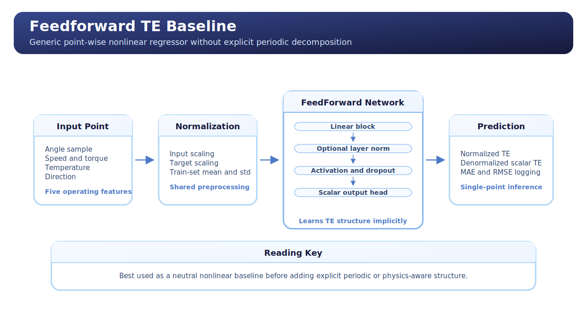
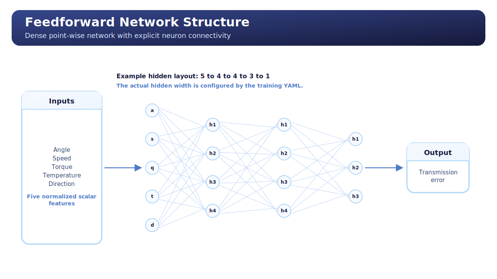

# FeedForward Network

## Overview

This unified guide explains the repository's `FeedForward Network` from both:

- a learning-oriented perspective for conceptual understanding;
- a technical perspective for understanding how it is implemented and trained in this repository.

The goal is to show:

- what the model is;
- why it is the starting point for the TE architecture curriculum;
- how the computation works from input to prediction;
- how it behaves in the TE problem;
- how the implementation fits into the repository training workflow;
- why this model is the right baseline before moving to more structured architectures.

This model should be read as the neutral nonlinear benchmark of the current TE program.

## English Companion Exports

English `NotebookLM` concept exports for this topic are archived in
`English/`.

## Model Description

The `FeedForward Network` is the simplest neural baseline currently implemented for TE regression.

It is a point-wise multilayer perceptron (`MLP`):

- each sample is treated independently;
- the model receives one TE point at a time;
- the output is a single scalar prediction.

In this repository, the model uses the point-wise TE representation built from:

- angular position;
- input speed;
- input torque;
- oil temperature;
- direction flag.

The model does not explicitly encode periodic structure.
It does not split the signal into analytical and residual components.
It simply learns a generic nonlinear mapping from inputs to TE.

## Operating Principle

The operating principle is standard nonlinear regression in normalized feature space.

At a high level:

1. the dataset is flattened into point-wise samples;
2. the input channels are normalized using train-set statistics;
3. the MLP transforms the feature vector through stacked dense layers;
4. the final layer produces a scalar TE prediction;
5. loss and metrics are computed during training and evaluation.

The model therefore implements the mapping:

`x -> f_theta(x) -> TE`

where `f_theta` is a learned nonlinear function.

The important idea is that the model is flexible, but not structured.
It can learn correlations from data, but it must discover periodicity and operating-condition interactions implicitly.

## Conceptual Map



The conceptual reading is:

- input features describe a single TE sample;
- normalization prepares the data for stable training;
- the MLP learns layered feature combinations;
- the prediction is a scalar TE estimate;
- metrics are reported after denormalization so they stay physically meaningful.

The model can also be read in this compact form:

```text
Input Point
  -> [angle, speed, torque, temperature, direction]
  -> normalization
  -> Linear
  -> optional LayerNorm
  -> activation
  -> optional Dropout
  -> ...
  -> Linear
  -> scalar TE prediction
```

Repository-level schematic:

```text
Curve Dataset
  -> Point Extraction
  -> TransmissionErrorDataModule
  -> FeedForwardNetwork
  -> TransmissionErrorRegressionModule
  -> Lightning Trainer
  -> checkpoints + metrics + registries
```

## Architecture Diagram



This diagram is the computational view of the same model.

The important architectural points are:

- the network is fully feedforward;
- information flows in one direction only;
- hidden layers are dense transformations;
- optional layer normalization and dropout can be inserted between dense layers;
- the output head is a single scalar regression layer.

The exact hidden widths are YAML-configurable, but the architectural logic remains the same.

## Why This Model Exists

This model exists because the project needs a neutral, flexible, easy-to-train baseline of reference.

Before adding explicit periodic structure, residual decomposition, or temporal memory, the repository needs to know how far a plain MLP can go on the TE task.

That makes the model useful for three reasons:

- it sets a minimum benchmark;
- it reveals how much gain later architectures actually provide;
- it provides a simple conceptual bridge from linear regression to neural networks.

## Advantages

- Very simple and easy to explain.
- Flexible enough to model generic nonlinear interactions.
- Cheap to experiment with compared with heavier models.
- A strong baseline for later structured architectures.
- Easy to integrate into the shared training pipeline.

## Disadvantages

- No explicit periodic prior.
- No explicit decomposition of structured and residual behavior.
- Less interpretable than harmonic models.
- May need more data to discover the same structure that a TE-aware model could encode directly.
- Can fit the data without revealing much about the underlying mechanism.

## Expected Behavior In The TE Context

In the TE problem, this model is expected to work reasonably well when:

- the mapping is smooth enough;
- the available data covers the operating conditions sufficiently;
- the main goal is predictive benchmarking rather than interpretability.

It is less attractive when the objective is:

- explicit periodic understanding;
- coefficient-level interpretability;
- decomposition into analytical and residual parts;
- physics-oriented reasoning.

## Repository Implementation

The implementation lives in the shared structured-neural stack and is centered on these files:

- `scripts/models/feedforward_network.py`
- `scripts/models/model_factory.py`
- `scripts/training/train_feedforward_network.py`
- `scripts/training/transmission_error_regression_module.py`

### `scripts/models/feedforward_network.py`

This file contains the actual `FeedForwardNetwork` backbone.

Key pieces:

- `get_activation_module(...)`
  Resolves the configured activation name into the correct PyTorch module.

- `FeedForwardNetwork.__init__(...)`
  Builds the dense stack layer by layer.
  The constructor validates sizes and assembles:
  - linear layers;
  - optional layer normalization;
  - activation;
  - optional dropout;
  - final output head.

- `FeedForwardNetwork.forward(...)`
  Runs the input tensor through the assembled network.

The implementation is explicit and readable so the architecture can be inspected directly from the source.

### `scripts/models/model_factory.py`

The model is registered under `model_type == "feedforward"`.

This factory layer is what makes the architecture selectable from YAML and usable inside the shared training code.

## Training Workflow

The training workflow for this model is the standard structured-neural pipeline used in the repository.

At a high level:

1. TE curves are converted to point-wise samples;
2. train-set statistics are computed;
3. the model is instantiated from configuration;
4. the regression module handles normalization and loss;
5. the trainer performs optimization with validation monitoring;
6. the best checkpoint is reloaded;
7. final validation and test metrics are reported.

This is important because later architecture guides reuse the same outer workflow, even when the backbone changes.

## Training Logic In This Repository

### `train_feedforward_network.py`

This file is the orchestration entry point.

Important functions:

- `print_training_configuration_summary(...)`
  Renders the resolved YAML settings in terminal form.

- `print_dataset_summary(...)`
  Shows the real train/validation/test curve counts and batching setup.

- `print_model_summary(...)`
  Reports trainable, frozen, and total parameter counts.

- `resolve_runtime_config(...)`
  Applies runtime decisions such as disabling `benchmark` when deterministic execution is requested.

- `save_training_test_report(...)`
  Builds the run-local Markdown report after training and testing.

- `train_feedforward_network(...)`
  This is the main orchestration function:
  - prepares the output directory;
  - initializes datamodule, backbone, and regression module;
  - configures logger, checkpointing, early stopping, and progress bar;
  - runs `fit`, `validate`, and `test`;
  - reloads the best checkpoint when available;
  - serializes metrics and updates registries.

### `transmission_error_regression_module.py`

This file contains the generic Lightning training logic.

For the feedforward baseline, the most relevant parts are:

- `set_normalization_statistics(...)`
  Copies train-split normalization statistics into Lightning buffers.

- `normalize_input_tensor(...)` and `normalize_target_tensor(...)`
  Move the optimization into normalized space.

- `forward(...)`
  Delegates directly to the MLP on normalized inputs.

- `compute_batch_outputs(...)`
  Produces normalized predictions, denormalized predictions, loss, `MAE`, and `RMSE`.

- `compute_loss(...)`
  Logs the metrics for train, validation, and test phases.

- `configure_optimizers(...)`
  Uses `AdamW`.

### `shared_training_infrastructure.py`

This file provides the shared repository plumbing:

- config loading;
- artifact naming;
- output directory resolution;
- datamodule creation;
- model instantiation;
- registry updates;
- common metrics snapshot format.

For the feedforward baseline, this file is what makes the training workflow reusable and comparable with the newer structured models.

## Practical Interpretation

In TE terms, the `FeedForward Network` is the "how far can we go with a generic nonlinear regressor?" baseline.

If it performs well, that tells us the task may not require strong structure.
If it performs poorly, that tells us the problem needs explicit periodic, residual, or temporal inductive bias.

That is why this model is the first guide in the architecture series.

## Summary

The `FeedForward Network` is the simplest implemented neural architecture in the TE program.

It is easy to train, easy to compare, and easy to understand.
It is also the reference point from which the rest of the architecture curriculum becomes meaningful, both scientifically and in repository engineering terms.
