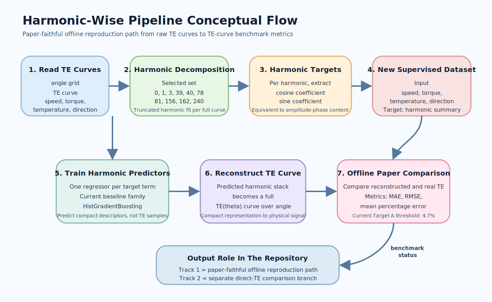
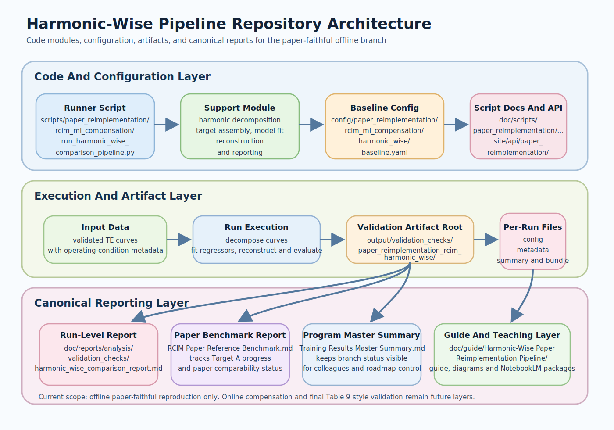

# Harmonic-Wise Paper Reimplementation Pipeline

## Overview

This guide explains the repository-owned harmonic-wise pipeline that was added
to reproduce the offline logic of
`reference/RCIM_ML-compensation.pdf`.

This topic is not the same as the repository's direct-TE training families.

It belongs to the paper-faithful reproduction branch, which the backlog now
calls `Track 1`.

The purpose of this branch is clear:

- recreate the paper's harmonic-wise modeling logic inside this repository;
- obtain an offline comparison protocol that is genuinely paper-aligned;
- prepare the bridge toward later online compensation work;
- keep the result inspectable for colleagues, reviewers, and future
  deployment work.

At the current repository state, this guide covers the offline branch only.

The online compensation loop and the final `Table 9` style benchmark are still
future work.

## Guide Export Folders

This topic separates its guide-local material into:

- `assets/`
  diagrams and `NotebookLM` source packages.
- `English/`
  imported final English `NotebookLM` exports for the concept and project
  tracks.
- `Italiano/`
  imported final Italian `NotebookLM` exports for the concept and project
  tracks.

The imported export naming follows the repository rule that each filename must
explicitly declare:

- guide name;
- track (`Concept` or `Project`);
- artifact type (`Guide`, `Presentation`, `Video Overview`, `Mind Map`,
  `Infographic`).

Language is intentionally expressed by the parent folder name, so it is not
repeated again inside each imported filename.

## Why This Pipeline Exists

The repository had already trained several strong direct-TE models.

Those models predict the TE curve directly from angular position plus operating
conditions.

That is useful, but it is not how the reference paper is structured.

The paper works in a different way:

1. represent each TE curve through selected harmonics;
2. predict the harmonic quantities from operating conditions;
3. reconstruct the TE curve from the predicted harmonic stack;
4. later apply that reconstructed TE information to compensation logic.

So this pipeline exists because the repository needed a branch that answers a
different question:

can the paper's harmonic-wise logic be reproduced here, with repository-owned
code, artifacts, and reports?

## Track Placement

The repository now keeps two comparison tracks:

- `Track 1`
  paper-faithful harmonic-wise reproduction.
- `Track 2`
  repository direct-TE comparison under a common offline TE-curve evaluator.

This guide is only about `Track 1`.

## Track 1 Completion Rule

The canonical `Track 1` completion rule is not a single campaign winner.

`Track 1` closes only when the repository reproduces the paper-facing cells in
Tables `3`, `4`, `5`, and `6` with inspectable per-target and per-harmonic
status.

That means:

- the primary `Track 1` readout is the exact-paper table-replication report;
- the harmonic-wise TE-curve evaluator is still useful, but only as support
  evidence;
- a lower TE-level percentage error alone does not mean that `Track 1` is
  closed.

## End-To-End Flow

The pipeline starts from full TE curves, converts them into a harmonic summary,
predicts those harmonic terms from operating conditions, and then reconstructs
the TE curve for evaluation.

That means the model does not learn point-wise TE samples directly.

It learns a compact representation of the whole curve.

## Stage 1. Read Curves And Operating Conditions

Each dataset item contains:

- an angular grid;
- a TE curve on that angular grid;
- operating conditions such as `speed`, `torque`, `temperature`, and
  `direction`.

In the direct-TE branch, the angle itself is part of the model input.

In this harmonic-wise branch, angle is not the final learning input.

Instead, the full angle-resolved TE curve is treated as a signal to summarize.

## Stage 2. Decompose The TE Curve Into Selected Harmonics

The pipeline uses a selected harmonic set aligned with the paper-oriented
comparison scope:

- `0`
- `1`
- `3`
- `39`
- `40`
- `78`
- `81`
- `156`
- `162`
- `240`

These harmonics were chosen because they capture the practical periodic
structure emphasized by the paper and by the repository's own benchmark notes.

The decomposition stage fits a truncated harmonic representation of the TE
curve.

Conceptually, the curve is written as:

`TE(theta) ~= a0 + sum_k [c_k cos(k theta) + s_k sin(k theta)]`

where:

- `a0` is the offset term;
- `c_k` is the cosine coefficient for harmonic `k`;
- `s_k` is the sine coefficient for harmonic `k`.

## Stage 3. Convert The Curve Into Harmonic Targets

For each selected harmonic, the current implementation stores the signal in
coefficient form:

- cosine coefficient;
- sine coefficient.

This form is convenient for stable regression and reconstruction.

It is also directly connected to the paper quantities:

- amplitude `A_k`;
- phase `phi_k`.

The relationship is:

- `A_k = sqrt(c_k^2 + s_k^2)`
- `phi_k = atan2(-s_k, c_k)` in the chosen convention

So even though the repository currently predicts coefficient pairs, those
coefficients still represent the same harmonic content that can be expressed as
`A_k` and `phi_k`.

## Stage 4. Build A New Supervised Dataset

This is the key conceptual shift.

The problem is no longer:

- input = `angle + operating conditions`
- target = `TE(angle)`

The problem becomes:

- input = `speed + torque + temperature + direction`
- target = harmonic summary of the whole TE curve

So each supervised sample corresponds to one operating-condition point and one
whole-curve harmonic representation.

That is why the pipeline is called harmonic-wise.

It predicts the ingredients of the curve, not the point-wise curve samples.

## Stage 5. Train Predictors On Harmonic Targets

The current repository baseline uses:

- one regressor per harmonic target term;
- model family: `HistGradientBoosting`.

That means the pipeline fits many small tabular regressors rather than one
large end-to-end point-wise neural model.

This is already directionally aligned with the paper, where tree and boosting
families dominate the deployable harmonic stack.

The baseline script is:

- `scripts/paper_reimplementation/rcim_ml_compensation/run_harmonic_wise_comparison_pipeline.py`

The main support module is:

- `scripts/paper_reimplementation/rcim_ml_compensation/harmonic_wise_support.py`

The current baseline configuration is:

- `config/paper_reimplementation/rcim_ml_compensation/harmonic_wise/baseline.yaml`

## Stage 6. Reconstruct The TE Curve

Once the model has predicted the harmonic coefficients for a new operating
point, the pipeline rebuilds the full TE curve over angle.

This is the bridge between:

- compact harmonic prediction;
- physical TE behavior over the full angular cycle.

Without reconstruction, the pipeline would only output abstract coefficients.

With reconstruction, it becomes comparable to the paper's offline TE-curve
validation logic.

## Stage 7. Evaluate The Reconstructed Curve

The reconstructed TE curve is compared against the real TE curve on held-out
validation and test splits.

The main metrics are:

- `MAE`
- `RMSE`
- mean percentage error

The mean percentage error over the full TE curve is now a supporting
paper-comparable metric for the offline phase.

The first repository-owned baseline established that protocol and produced:

- validation mean percentage error: `9.474%`
- test mean percentage error: `9.403%`

The current offline paper target is:

- `<= 4.7%`

So the comparison protocol now exists, but `Target A` is not closed yet.

More importantly, `Track 1` itself is still open until the canonical
exact-paper report closes the remaining cells in Tables `3-6`.

## Why The First Baseline Still Matters

Even though the first baseline does not yet match the paper threshold, it
already proved something important.

The truncation-only oracle with the same harmonic set reaches a much lower
error than the learned predictor.

That means:

- the selected harmonic set is expressive enough;
- the bottleneck is the operating-condition predictor;
- the next improvement work should focus on the predictor and target design,
  not on abandoning the harmonic representation itself.

## Offline Playback Probes

The current pipeline also includes offline `Robot` and `Cycloidal` style
motion-profile playback probes.

These are not yet the final online compensation benchmark.

They are repository-owned preparation steps that:

- exercise the predicted harmonic stack on profile-like conditions;
- prepare the path toward later online evaluation;
- keep the eventual `Table 9` target visible from the beginning.

## What This Pipeline Is Not

This pipeline is not:

- the direct-TE training branch;
- a finished online compensation system;
- a TwinCAT deployment package;
- the final `Table 9` benchmark.

It is an intermediate but essential branch between completed `Wave 1` and the
later online compensation path.

## Current Repository Outputs

The current validation artifacts live under:

- `output/validation_checks/paper_reimplementation_rcim_harmonic_wise/forward/`

The current human-readable validation report is generated under:

- `doc/reports/analysis/validation_checks/`

The canonical comparison reports that summarize the branch are:

- `doc/reports/analysis/RCIM Paper Reference Benchmark.md`
- `doc/reports/analysis/Training Results Master Summary.md`
- `doc/reports/analysis/validation_checks/track1/exact_paper/forward/shared/2026-04-12-17-00-28_paper_reimplementation_rcim_exact_model_bank_rcim_exact_paper_model_bank_exact_paper_validation_tables_3_4_5_6_exact_paper_model_bank_report.md`

## Practical Reading Map

If you want to understand the branch quickly, read in this order:

1. this guide;
2. `doc/reports/analysis/RCIM Paper Reference Benchmark.md`;
3. `doc/reports/analysis/validation_checks/track1/harmonic_wise/...harmonic_wise_comparison_report.md`;
4. the pipeline script and support module.

## Summary

The harmonic-wise paper-reimplementation pipeline changes the learning problem
from:

- point-wise TE prediction

to:

- operating-condition-to-harmonic prediction

and then reconstructs the TE curve for evaluation.

That is exactly why it matters.

It gives the repository a paper-faithful offline benchmark path instead of
only a direct-TE leaderboard.

The important operational nuance is that the harmonic-wise support branch and
the exact-paper table-replication branch must not be collapsed into one
winner-centric story. For `Track 1`, the table-replication branch is primary.

## Related Reading

- `doc/reports/analysis/RCIM Paper Reference Benchmark.md`
- `doc/reports/analysis/Training Results Master Summary.md`
- `doc/guide/project_usage_guide.md`
