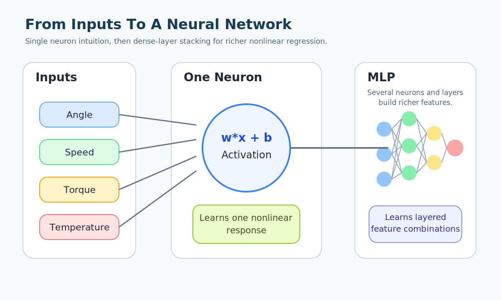

# Neural Network Foundations

## Overview

This guide is the entry point for readers who do not yet have a working mental model of neural networks.

The goal is to move from intuition to a more formal engineering view while keeping the Rotational Transmission Error (`TE`) project in scope.

By the end of this guide, the reader should understand:

- what supervised learning is;
- what a neural network is actually computing;
- how a multilayer perceptron (`MLP`) differs from a single linear model;
- how loss, gradients, and parameter updates interact;
- why training can succeed, fail, overfit, or underfit;
- how these concepts map to the TE compensation problem in this repository.

## English Companion Exports

English `NotebookLM` concept exports for this topic are archived in
`English/`.

## Why Start Here

Many explanations of neural networks jump too quickly into code or formulas.

That is not enough for this project.

The reader eventually needs to understand not only:

- how to run training scripts;
- but also why one architecture is more suitable than another for periodic and condition-dependent TE behavior.

The most useful starting point is therefore:

`data -> model -> prediction -> error -> parameter update -> better model`

Everything else is a refinement of this loop.

## Supervised Learning In One Sentence

Supervised learning means learning a function from examples.

Each example contains:

- an input vector `x`;
- a desired output `y`.

The model receives `x` and tries to produce `y_hat`, a prediction that is as close as possible to `y`.

For this repository, a point-wise TE sample can be read as:

- input features:
  - angular position;
  - input speed;
  - applied torque;
  - oil temperature;
  - motion direction;
- target:
  - measured transmission error.

The learning problem is therefore:

`x = operating state + position -> y = TE`

## The Simplest Useful Model: Linear Regression

Before a neural network, it helps to understand a linear model:

`y_hat = w^T x + b`

This says:

- each input feature gets a weight;
- the model forms a weighted sum;
- then adds a bias term.

If the relationship between input and output is approximately linear, this can work well.

But TE behavior is rarely that simple:

- the angular effect is periodic rather than linear;
- operating conditions interact nonlinearly;
- some effects change strength across regimes.

A plain linear model is usually too rigid.

## From A Linear Unit To A Neuron

An artificial neuron is just a linear model followed by a nonlinearity:

`z = w^T x + b`

`a = phi(z)`

Where:

- `z` is the pre-activation value;
- `phi` is an activation function;
- `a` is the neuron output.

Without the activation function, stacking layers would still collapse into one overall linear transformation.

That is why the nonlinearity is essential.

## Conceptual Diagram

The key idea in the diagram is:

- the neuron first mixes inputs linearly;
- the activation bends the representation;
- several neurons can learn different feature combinations;
- several layers can progressively construct richer internal representations.

## Common Activation Functions

The activation function controls how the model departs from simple linear behavior.

Common examples are:

- `ReLU(x) = max(0, x)`
- `Tanh(x)`
- `GELU(x)`
- `SiLU(x)`

In practical terms:

- `ReLU` is simple and robust;
- `Tanh` is smooth and bounded;
- `GELU` and `SiLU` often work well in modern dense networks.

In this repository, the exact activation is configurable in YAML for the feedforward family.

## From One Layer To An MLP

A multilayer perceptron (`MLP`) composes multiple dense layers:

`x -> h1 -> h2 -> ... -> y_hat`

Each hidden layer transforms the representation before the next one sees it.

This does not mean the model learns human-style concepts.

It means the model learns intermediate numerical representations that make the final regression easier.

For TE prediction, an `MLP` may internally build features such as:

- angular sectors that correlate with certain error patterns;
- condition combinations that amplify or reduce TE;
- direction-dependent offsets;
- nonlinear interactions among speed, torque, and temperature.

## Forward Propagation

Forward propagation means computing the prediction from the current parameters.

In a simple two-hidden-layer `MLP`, the computation is:

`h1 = phi(W1 x + b1)`

`h2 = phi(W2 h1 + b2)`

`y_hat = W3 h2 + b3`

The network is a parameterized function.

Training is the process of adjusting the matrices and bias vectors so that this function matches the data better.

## Loss Functions

The model needs a scalar quantity that measures prediction quality.

That quantity is the loss.

For regression, common losses are:

`MSE = mean((y_hat - y)^2)`

`MAE = mean(|y_hat - y|)`

In this repository:

- the optimization loss is typically computed in normalized space;
- reporting metrics such as `MAE` and `RMSE` is often done after denormalization so the values remain physically meaningful.

Interpretation:

- `MSE` penalizes large errors more strongly;
- `MAE` is easier to interpret in the physical unit;
- `RMSE` keeps the same unit as the target but still emphasizes larger deviations.

## Gradient Descent And Backpropagation

Once the loss is known, the model parameters must be updated to reduce it.

Gradient descent uses the derivative of the loss with respect to each parameter:

`theta <- theta - eta * grad_theta L`

Where:

- `L` is the loss;
- `eta` is the learning rate;
- `grad_theta L` tells us how the loss changes if we move each parameter slightly.

Backpropagation is the efficient procedure used to compute gradients through the composed network.

Conceptually:

1. run the forward pass;
2. compute the loss;
3. propagate gradients backward through the layers;
4. update the parameters with the optimizer.

This is why the training loop is often summarized as:

`forward -> loss -> backward -> optimizer step`

## Batches, Epochs, And Mini-Batch Training

Definitions:

- batch:
  a small subset of samples used for one gradient estimate;
- epoch:
  one full pass over the training dataset;
- iteration:
  one optimizer update step, usually one batch.

Mini-batch training is the practical compromise:

- cheaper than full-dataset gradients;
- more stable than single-sample updates;
- well suited to GPU computation.

## Capacity, Underfitting, And Overfitting

Three concepts must stay separate.

Underfitting means:

- the model is too weak, too constrained, or insufficiently trained to match the real pattern.

Overfitting means:

- the model adapts too strongly to the training data details and generalizes poorly.

Generalization means:

- the model performs well on unseen but relevant data.

A model can have:

- low training error and poor validation error -> probable overfitting;
- high training error and high validation error -> probable underfitting;
- low and similar train/validation error -> better generalization.

## Why Data Normalization Matters

Neural networks are sensitive to input scale.

If one feature ranges around `0.1` and another around `5000`, the optimizer may struggle because the parameter gradients will operate on inconsistent numerical scales.

Normalization improves:

- optimization stability;
- comparability across features;
- learning speed.

In this repository, normalization is especially important because:

- angle, speed, torque, and temperature live on different scales;
- TE metrics are later interpreted back in physical units.

## TE-Specific Reading Of The Learning Problem

For this repository, a useful mental model is:

- angular position explains the periodic coordinate;
- speed, torque, and temperature explain the operating regime;
- direction may explain asymmetry;
- the model predicts TE as a scalar response conditioned on these inputs.

The harder question is not whether a model can fit TE at all.

The harder question is:

which architecture expresses the TE structure efficiently, interpretably, and in a PLC-friendly way?

That question motivates the whole model-family roadmap.

## Repository Mapping

The foundations in this guide map directly to repository components:

- dataset and point extraction:
  `scripts/datasets/transmission_error_dataset.py`
- generic dense baseline:
  `scripts/models/feedforward_network.py`
- structured models:
  `scripts/models/harmonic_regression.py`
  `scripts/models/periodic_feature_network.py`
  `scripts/models/residual_harmonic_network.py`
- training entry point:
  `scripts/training/train_feedforward_network.py`

## Summary

The minimum working picture is:

1. the model receives input features;
2. the forward pass generates a prediction;
3. the loss measures prediction error;
4. backpropagation computes how the parameters affected that error;
5. the optimizer updates the parameters;
6. repeated updates gradually improve the mapping.

This is the computational foundation behind every neural architecture discussed later.

## Next Reading

After this guide, the recommended next document is:

- [Training, Validation, And Testing](../Training,%20Validation,%20And%20Testing/Training,%20Validation,%20And%20Testing.md)

Then continue with:

- [TE Model Curriculum](../TE%20Model%20Curriculum/TE%20Model%20Curriculum.md)
