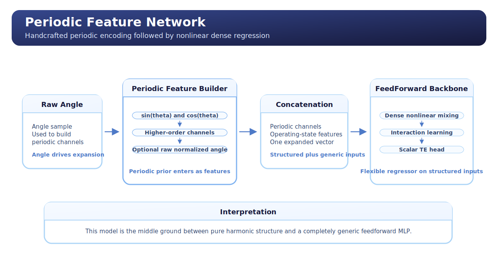
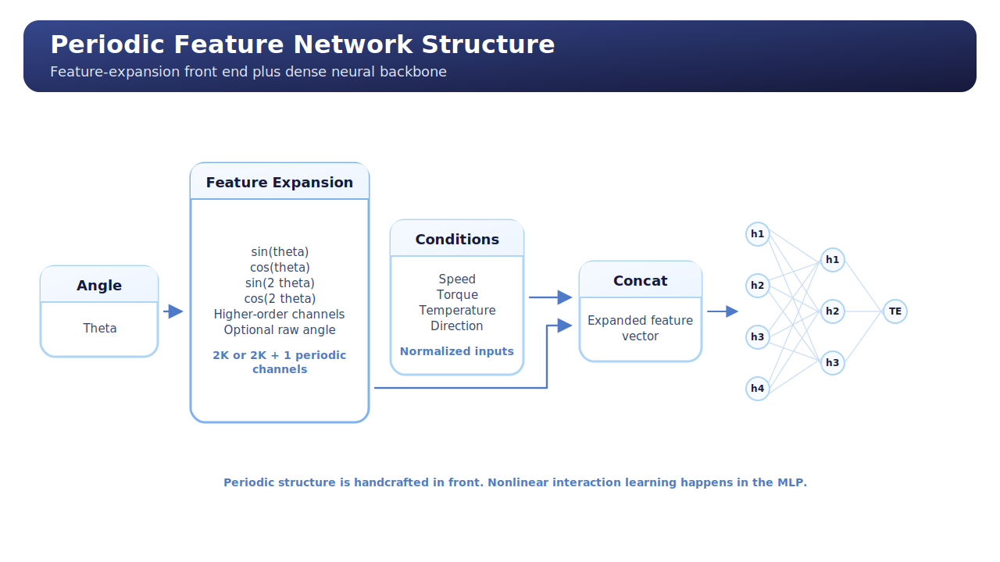

# Periodic Feature Network

## Overview

This unified guide explains the repository's `Periodic Feature Network` from both a conceptual and technical perspective.

The model sits between the plain feedforward baseline and the fully structured harmonic regressor:

- periodic structure is made explicit;
- but the final predictor is still an MLP.

The result is a flexible architecture that keeps periodic bias without becoming analytically rigid.

## Model Description

`Periodic Feature Network` is a feature-engineered neural network.

The core idea is simple:

1. expand the angle into periodic harmonic features;
2. concatenate those features with the operating-condition channels;
3. feed the expanded vector into a standard dense neural network.

So the model does not directly predict TE from sine and cosine terms.
Instead, it uses periodic features as inputs and lets the MLP learn the remaining nonlinear interactions.

This makes the architecture more expressive than harmonic regression and more structured than a plain MLP.

## Operating Principle

The model works in two stages.

### Stage 1: Periodic Feature Construction

- the raw angular position is converted to radians;
- `sin(k theta)` and `cos(k theta)` are generated up to the configured harmonic order;
- optionally the normalized raw angle is retained as an additional feature.

### Stage 2: Nonlinear Regression

- the periodic features are concatenated with normalized operating-condition channels;
- the expanded vector is processed by an MLP;
- the output is a scalar TE prediction.

The model can therefore be read as:

`encode periodicity explicitly, then learn the remaining nonlinear interactions`

## Conceptual Map



The conceptual view is:

- angle becomes periodic basis features;
- condition channels remain standard inputs;
- all features are concatenated;
- the MLP performs the final regression.

The model can also be summarized as:

```text
Input Point
  -> raw angle theta
  -> periodic expansion [sin(theta), cos(theta), ..., sin(K theta), cos(K theta)]
  -> optional raw normalized angle
  -> normalized condition features [speed, torque, temperature, direction]
  -> concatenation
  -> MLP
  -> scalar TE prediction
```

In repository terms:

```text
Raw angle for periodic basis
  + normalized condition channels
  -> expanded feature tensor
  -> FeedForwardNetwork
  -> TE
```

This is a helpful mental model because it shows why the architecture is a middle ground.

## Architecture Diagram



The architecture view emphasizes the actual computation:

- feature construction first;
- dense neural regression second;
- one feedforward stack after feature expansion.

The result is not a harmonic sum.
It is an MLP operating on a richer input representation.

## Why This Model Exists

This model exists because a plain MLP may have to learn periodic structure the hard way.

By adding periodic features directly, the model receives a representation that is already aligned with the TE signal while still preserving neural flexibility.

That makes it useful when:

- periodicity matters;
- but a pure harmonic series would be too restrictive;
- and condition interactions still need to be learned flexibly.

## Advantages

- Explicit periodic inductive bias.
- More expressive than a pure harmonic model.
- More structured than a plain MLP.
- Still compatible with the shared neural training pipeline.
- Good compromise between interpretability and flexibility.

## Disadvantages

- Less interpretable than coefficient-based harmonic regression.
- More parameter-heavy than a structured harmonic model.
- Still depends on MLP hyperparameters and training quality.
- Periodicity is explicit in the input map, not in the output decomposition.

## Expected Behavior In The TE Context

This model is expected to be attractive when:

- periodicity clearly matters;
- but a purely harmonic model is too restrictive;
- operating conditions modulate TE in nonlinear ways.

It is a strong candidate when we want a structured prior without giving up neural flexibility.

## Repository Implementation

The implementation is centered on these files:

- `scripts/models/periodic_feature_network.py`
- `scripts/models/feedforward_network.py`
- `scripts/models/model_factory.py`
- `scripts/training/train_feedforward_network.py`
- `scripts/training/transmission_error_regression_module.py`

### `scripts/models/periodic_feature_network.py`

Key pieces:

- `PeriodicFeatureNetwork.__init__(...)`
  Validates the TE input layout, computes the expanded input size, and creates the internal MLP.

- `build_periodic_feature_tensor(...)`
  Builds the sine and cosine basis from the raw angle.

- `forward_with_input_context(...)`
  Collects the raw angle, builds periodic features, concatenates the condition features, and forwards the expanded tensor through the MLP.

This file is the periodic feature front-end for the model.

### `scripts/models/feedforward_network.py`

The periodic model uses the same dense backbone class as the plain feedforward architecture.

That keeps the implementation modular:

- feature construction is handled separately;
- the neural regression stack is reused.

### `scripts/models/model_factory.py`

The model is registered under `model_type == "periodic_mlp"`.

This keeps the architecture selectable from YAML and consistent with the rest of the repository.

### `scripts/training/transmission_error_regression_module.py`

The training module detects contextual forwarding and passes the raw angle together with the normalized input tensor.

That is necessary because the periodic features are built from the raw angular value, not from the normalized summary alone.

### `scripts/training/train_feedforward_network.py`

The outer training script remains shared with the other structured-neural baselines.

The backbone changes, but the orchestration remains the same:

- load config;
- build datamodule;
- instantiate model;
- train;
- validate;
- test;
- save artifacts.

## Training Workflow

The workflow is:

1. flatten TE data into point samples;
2. compute train-split normalization;
3. instantiate the periodic network from YAML;
4. build periodic basis features from the raw angle;
5. train the neural backbone on the expanded representation;
6. reload the best checkpoint;
7. report validation and test metrics.

## Training Logic In This Repository

### `TransmissionErrorRegressionModule.forward_regression_model(...)`

This is the critical function for `PeriodicFeatureNetwork`.

The training module does not assume that every backbone only wants normalized inputs. Instead, it checks whether the model asks for contextual forwarding.

For this model, that matters because:

- periodic features must be built from the raw angle;
- the remaining channels are naturally passed in normalized form.

### `train_feedforward_network(...)`

The outer training workflow is unchanged relative to the feedforward baseline.

What changes is the backbone behavior:

- same optimizer family;
- same metrics;
- same output artifacts;
- different feature construction inside the model.

This is useful because improvements can be attributed more clearly to the modeling bias rather than to a different training framework.

## Practical Interpretation

`Periodic Feature Network` is the "structured input, flexible output" option.

Use it when you want to tell the model that angular periodicity matters, but you still want the network to learn nonlinear interactions beyond a closed-form harmonic sum.

## Summary

The `Periodic Feature Network` is a middle-ground architecture.

It respects periodic structure more directly than a feedforward network, but it keeps the flexibility of a learned dense regressor while remaining easy to compare inside the shared repository workflow.
