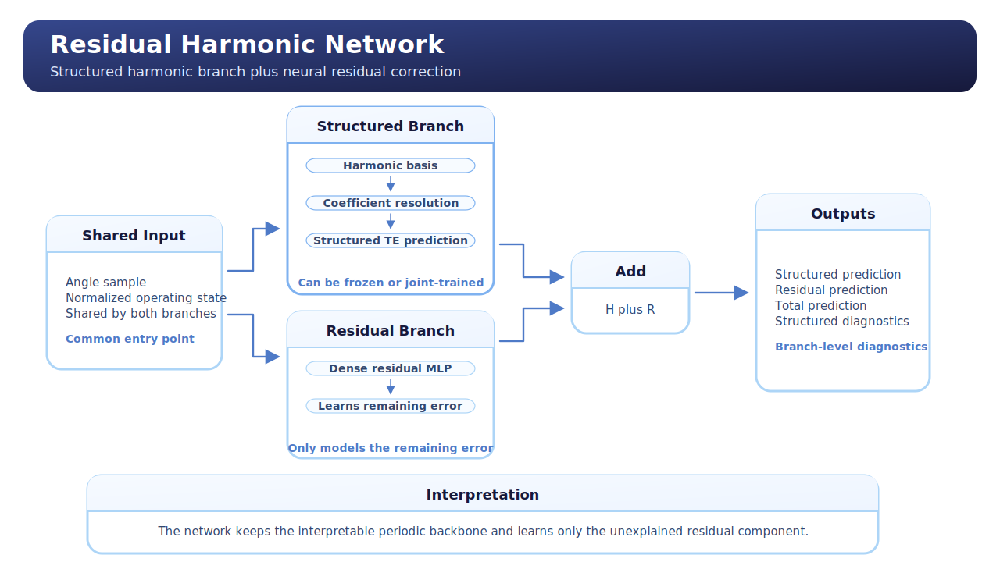
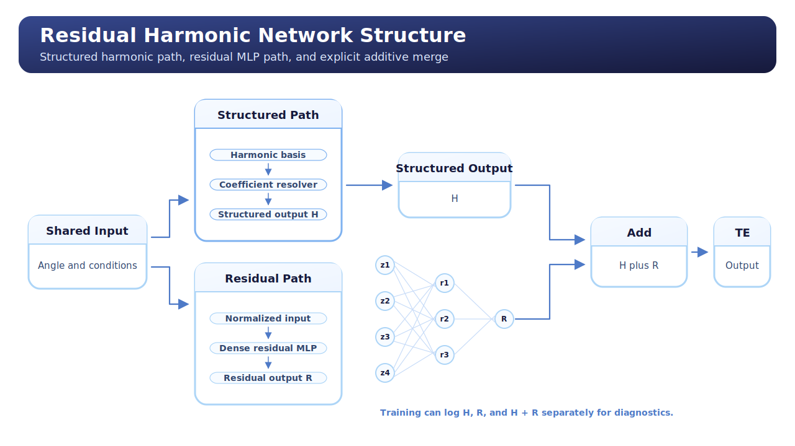

# Residual Harmonic Network

## Overview

This unified guide explains the repository's `Residual Harmonic Network` from both a learning-oriented and technical perspective.

It is the most explicitly hybrid structured-neural architecture currently implemented in the repository.

The core idea is to split the TE prediction into:

- a structured harmonic component;
- a learned residual correction.

This makes the model a bridge between analytical structure and flexible neural approximation.

## English Companion Exports

English `NotebookLM` concept exports for this topic are archived in
`English/`.

## Model Description

`Residual Harmonic Network` combines:

- a `Harmonic Regression` branch;
- a `FeedForward Network` residual branch.

The structured branch aims to capture the dominant periodic TE shape.
The residual branch aims to capture what the harmonic branch cannot explain.

The final prediction is the sum of the two.

This is not simple feature engineering.
It is an explicit additive decomposition.

## Operating Principle

The model assumes that TE can be approximated as:

`TE = structured_harmonic_component + residual_component`

Operationally:

1. the structured branch computes a harmonic prediction;
2. the residual branch computes an MLP correction;
3. the two outputs are added.

The implementation also supports a `freeze_structured_branch` option.

When this option is enabled:

- the harmonic branch remains fixed;
- only the residual branch learns.

When it is disabled:

- both branches are trained jointly.

That gives the model two useful operating regimes.

## Conceptual Map



The conceptual reading is:

- one path captures periodic structure;
- one path captures residual nonlinear behavior;
- the outputs are added into the final TE estimate.

The model can also be summarized as:

```text
Input Point
  -> Structured Branch
       -> harmonic basis
       -> harmonic coefficients
       -> structured TE
  -> Residual Branch
       -> normalized input features
       -> MLP
       -> residual TE
  -> sum
  -> final TE prediction
```

More compactly:

```text
TE(theta, c) = H(theta, c) + R(theta, c)
```

where:

- `H` is the structured harmonic branch;
- `R` is the learned residual neural branch.

This is the clearest way to remember what makes the architecture hybrid.

## Architecture Diagram



The architecture view shows the actual two-branch structure:

- harmonic branch on one side;
- residual MLP branch on the other side;
- additive merge at the end;
- optional auxiliary outputs for branch-level inspection.

This is more expressive than the harmonic model and more structured than a plain MLP.

## Why This Model Exists

This model exists because TE often has both:

- a clear periodic component;
- a remaining nonlinear residual component.

A pure harmonic model may be too rigid.
A pure MLP may hide the structure.

The hybrid model tries to keep both:

- structure;
- flexibility;
- interpretability.

## Advantages

- Explicit structured-plus-residual decomposition.
- More interpretable than a pure neural regressor.
- More expressive than a pure harmonic model.
- Supports frozen or joint training strategies.
- Very aligned with the TE curriculum direction toward hybrid models.

## Disadvantages

- More complex than the static baselines.
- Requires reasoning about two branches instead of one.
- Branch overlap can occur if the residual path learns what the structured path should have represented.
- Slightly harder to explain than a pure harmonic model because the final output is distributed across two components.

## Expected Behavior In The TE Context

This model is especially promising when:

- periodic structure is real and important;
- but it does not explain the full TE behavior;
- nonlinear condition effects remain after the harmonic approximation.

It is a strong bridge between:

- purely structured models;
- fully flexible neural models;
- future physics-informed hybrids.

## Repository Implementation

The implementation is centered on these files:

- `scripts/models/residual_harmonic_network.py`
- `scripts/models/harmonic_regression.py`
- `scripts/models/feedforward_network.py`
- `scripts/models/model_factory.py`
- `scripts/training/train_feedforward_network.py`
- `scripts/training/transmission_error_regression_module.py`

### `scripts/models/residual_harmonic_network.py`

Key pieces:

- `ResidualHarmonicNetwork.__init__(...)`
  Builds the structured branch and residual branch, then optionally freezes the structured branch.

- `forward_with_input_context(...)`
  Computes the harmonic component and the residual component, then sums them.

- `compute_auxiliary_output_dictionary(...)`
  Returns branch-level outputs so the training code can inspect the structured and residual contributions separately.

This file is the main implementation of the hybrid decomposition.

### `scripts/models/harmonic_regression.py`

The structured branch reuses the harmonic regression implementation.

That keeps the periodic component explicit and consistent with the standalone harmonic model.

### `scripts/models/feedforward_network.py`

The residual branch reuses the generic MLP backbone.

That keeps the correction path flexible and easy to compare with the feedforward baseline.

### `scripts/training/transmission_error_regression_module.py`

This module is particularly important because the residual-harmonic model exposes auxiliary outputs.

The training logic can therefore log not only the final prediction, but also the branch-level behavior.

### `scripts/training/train_feedforward_network.py`

The outer training workflow remains the same shared entry point.

What changes is the backbone behavior:

- the model returns structured diagnostics;
- the trainer still handles validation, checkpointing, and testing in the normal way.

## Training Workflow

The training workflow is:

1. load the YAML configuration;
2. instantiate the hybrid model from the factory;
3. pass raw angle and normalized conditions through the structured and residual paths;
4. optimize the total prediction;
5. inspect auxiliary outputs during training;
6. reload the best checkpoint;
7. report validation and test metrics.

## Training Logic In This Repository

### `TransmissionErrorRegressionModule.forward_regression_model(...)`

This is the main integration point.

Because `ResidualHarmonicNetwork` exposes `compute_auxiliary_output_dictionary(...)`, the regression module:

- receives the total prediction tensor;
- keeps the auxiliary branch outputs;
- returns them inside the batch-output dictionary.

This is more advanced than the plain contextual forward used by `harmonic_regression` and `periodic_mlp`.

### `TransmissionErrorRegressionModule.compute_batch_outputs(...)`

This function merges the auxiliary outputs returned by the model into the common batch-output dictionary.

That means the training loop has access not only to:

- total prediction;

but also to:

- structured branch prediction;
- residual branch prediction.

### `TransmissionErrorRegressionModule.compute_loss(...)`

This function adds structured diagnostics when `structured_prediction_tensor` is available.

Specifically, it logs:

- `structured_mae`
- `structured_rmse`

after denormalizing the structured branch output.

This is important because it lets us inspect:

- how good the harmonic branch is on its own;
- how much the residual branch is contributing.

### `train_feedforward_network(...)`

The outer training flow remains shared, but this model benefits more than the others from the reusable training design because:

- the hybrid branch logic lives inside the model;
- the diagnostic logging lives inside the generic regression module;
- the orchestration code does not need to become model-specific.

This is a good example of clean separation between:

- model-specific behavior;
- training infrastructure.

## Practical Interpretation

`Residual Harmonic Network` is the architecture to use when you believe the signal has a real periodic backbone but still needs a learned correction term.

It is the clearest transitional architecture between the structured baselines and more advanced hybrid or physics-informed models.

## Summary

The `Residual Harmonic Network` is the most explicit structured-neural hybrid in the repository.

It keeps the interpretability of harmonic modeling while recovering flexibility through a residual MLP branch, and it is currently the clearest stepping stone toward the later hybrid and PINN-oriented stages of the program.
