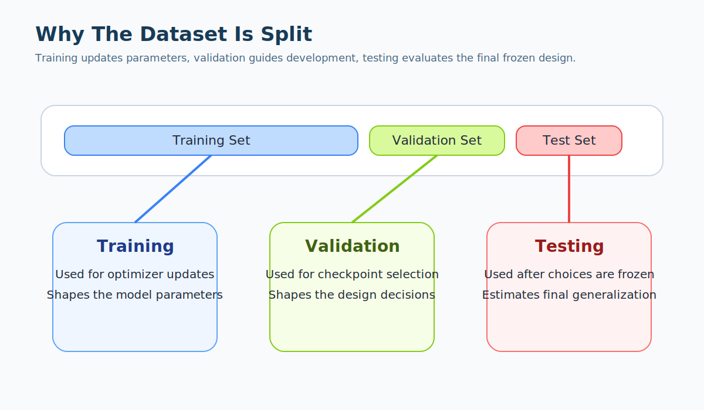

# Training, Validation, And Testing

## Overview

This guide explains the practical learning workflow around a model.

The previous foundations guide focused on what a neural network is.

This guide focuses on:

- how a model is trained;
- why datasets are split;
- what validation is actually used for;
- what testing is supposed to mean;
- which mistakes make reported metrics unreliable.

These points are especially important in the TE repository because the project is not only trying to fit data.

It is trying to compare model families fairly.

## The Three Main Dataset Roles

The standard split is:

- training set;
- validation set;
- test set.

They do not exist because machine learning likes bureaucracy.

They exist because each subset answers a different question.

### Training Set

The training set is the subset used to update model parameters.

This is where:

- batches are drawn;
- forward and backward propagation are run;
- optimizer steps happen.

The model is allowed to adapt directly to the training data.

### Validation Set

The validation set is used during development but not for direct parameter updates.

It is used to answer questions such as:

- Is the model improving on unseen data?
- Which checkpoint is best?
- Which hyperparameter setting is better?
- Should training stop early?

The validation set helps estimate generalization while the model is still being designed and tuned.

### Test Set

The test set is the final held-out evaluation subset.

It should be touched only after the design choices are already decided.

Its purpose is:

- to estimate how well the final selected model generalizes;
- to provide a less biased final benchmark.

If the test set is repeatedly used to drive design decisions, it stops being a real test set.

## Split Diagram

The diagram should be read as:

- training shapes the parameters;
- validation shapes the development decisions;
- testing evaluates the final chosen configuration.

## Why One Dataset Is Not Enough

Suppose a model fits the training set extremely well.

That does not prove the model has learned a robust pattern.

It might have learned:

- noise;
- quirks of a specific subset;
- spurious correlations;
- leakage artifacts.

Without a validation or test split, there is no reliable way to estimate whether the learned mapping generalizes.

## The Training Loop

At high level, one epoch of supervised regression training looks like this:

1. sample a training batch;
2. run the forward pass;
3. compute the loss against the target;
4. backpropagate gradients;
5. update parameters through the optimizer;
6. repeat for all batches in the training set;
7. run evaluation on the validation set.

This sequence repeats for many epochs.

The model checkpoint with the best validation behavior is usually kept.

## Epochs And Checkpoints

An epoch is one full pass over the training set.

A checkpoint is a saved copy of the model parameters and related training state.

The best checkpoint is often selected using a validation metric such as:

- `val_mae`
- `val_rmse`

This is important because:

- the last epoch is not always the best epoch;
- later epochs may overfit even if the training loss keeps improving.

## Early Stopping

Early stopping halts training when validation performance stops improving sufficiently.

The logic is pragmatic:

- if the validation metric no longer improves, continuing may only waste time or overfit more strongly.

Early stopping does not make a weak model strong.

It is a safeguard against unnecessary continuation once validation evidence says the model has plateaued.

## What Validation Is Really Doing

Validation is not a ceremonial report at the end of each epoch.

It is the control panel for model development.

Validation is used to:

- compare architectures;
- compare hyperparameters;
- select regularization strength;
- decide when to stop;
- decide which checkpoint to keep.

Because of that, the validation set is partly consumed by the design process.

That is why a separate test set is still needed afterward.

## What Testing Is Really Doing

Testing asks:

if we stop changing the design now and freeze the selected model, how well does it perform on held-out data?

Testing should be the least contaminated estimate of final performance.

The phrase "test performance" only has value if the test set remained meaningfully held out.

## Regression Metrics In This Repository

This repository predicts a continuous target: `TE`.

That means the central metrics are regression metrics rather than classification accuracy.

Common examples are:

- `MAE`
  average absolute prediction error;
- `MSE`
  average squared prediction error;
- `RMSE`
  square root of `MSE`.

For engineering interpretation:

- `MAE` is often the most intuitive;
- `RMSE` is useful when larger deviations should weigh more heavily.

## TE-Specific Split Concerns

The TE project is not an abstract tabular benchmark.

Several domain-specific issues affect split quality.

### Valid Windows

Only valid operating windows should contribute to meaningful TE learning and evaluation.

If invalid windows leak into one subset but not another, the comparison becomes distorted.

### Curve And Point Leakage

Because the repository often converts TE curves into point-wise samples, care is needed:

- points from the same physical curve are correlated;
- splitting naively at the point level can leak near-duplicate information across subsets.

A proper split should respect the intended unit of generalization.

### Operating-Condition Coverage

A model may perform well only because train and validation conditions are almost identical.

The more meaningful question is often:

can the model maintain performance across different speeds, torques, temperatures, or trajectory conditions?

## Common Failure Modes

### Leakage

Leakage means information from outside the training subset influences training indirectly.

Examples:

- statistics computed using the full dataset instead of the train split only;
- curve points from the same physical series appearing in both train and validation;
- hidden target information entering a feature.

Leakage creates deceptively good metrics.

### Validation Overuse

If the same validation split is used over and over for dozens of decisions, the project may slowly overfit to validation as well.

The development process is then adapting to that particular validation subset.

### Test Set Misuse

If the test set is checked after every tweak, it stops being a final evaluation set.

It becomes another validation set with a more impressive name.

## Repository-Level Workflow

In the current repository, the high-level training path is:

1. load the YAML configuration;
2. build the TE dataset and data module;
3. compute normalization statistics from the train split;
4. instantiate the selected model family;
5. train while monitoring validation metrics;
6. reload the best checkpoint;
7. run final validation and test evaluation;
8. write reports and metrics artifacts.

This logic is visible mainly in:

- `scripts/training/train_feedforward_network.py`
- `scripts/training/transmission_error_regression_module.py`
- `scripts/datasets/transmission_error_dataset.py`

## Practical Checklist

Before trusting a reported result, ask:

1. Was the split done at the correct unit of generalization?
2. Were normalization statistics derived from the train split only?
3. Was the best checkpoint chosen using validation, not test?
4. Was the final reported number measured on a genuinely held-out test set?
5. Are the reported metrics in physically interpretable TE units?
6. Are the operating conditions represented fairly across subsets?

If several answers are "no", the result is not yet reliable enough for cross-family comparison.

## Summary

Training, validation, and testing are not interchangeable names for "running the model".

They play three different roles:

- training learns parameters;
- validation steers development;
- testing estimates final generalization.

When these roles are mixed, the numbers become easier to obtain but harder to trust.

That is why split discipline is a core part of serious model development.

## Next Reading

Continue with:

- [TE Model Curriculum](../TE%20Model%20Curriculum/TE%20Model%20Curriculum.md)
