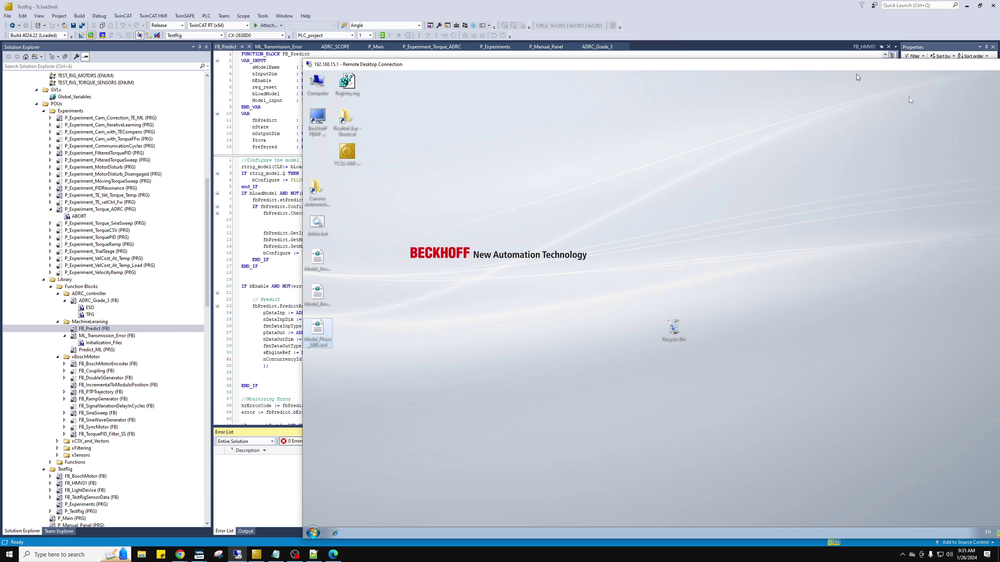
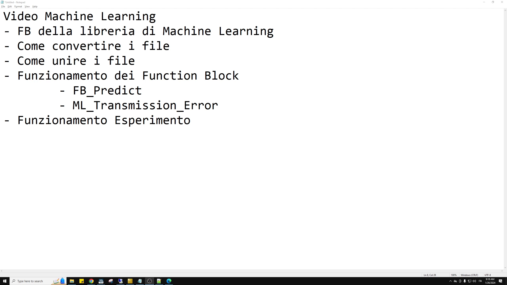
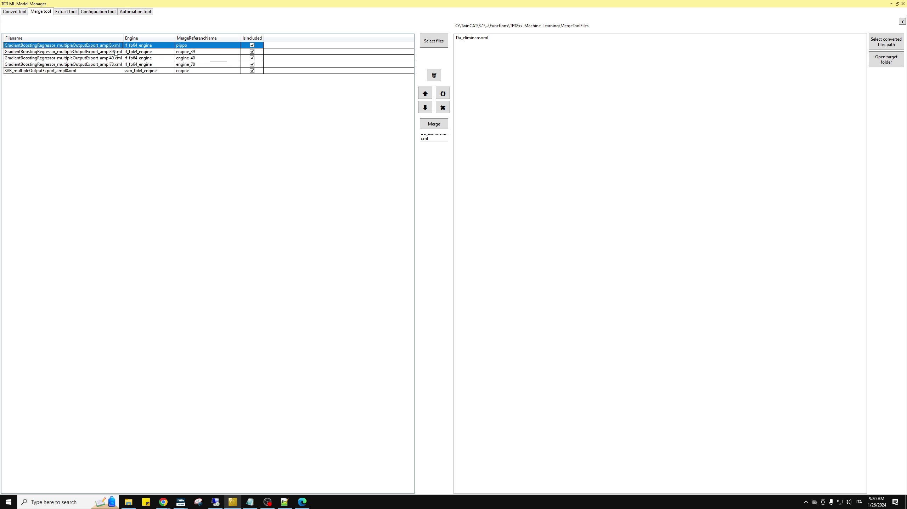
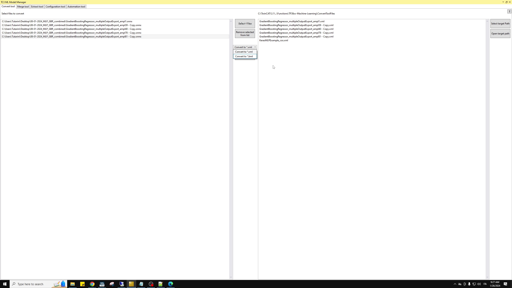

# Machine_Learning_1.mp4

## Overview

- Source video: `.temp/video_guides/Machine_Learning_1.mp4`
- Source analysis directory: `machine_learning_1` under `.temp/video_guides/_analysis_hq/`
- Duration seconds: `1920.2666666666667`
- Resolution: `2560x1440`
- Transcript segments: `279`
- Transcript quality summary: `{'min': 0.6349, 'median': 0.6687, 'max': 0.9237}`
- OCR extracted: `True`
- OCR quality summary: `{'min': 94.184, 'median': 100.0, 'max': 100.0}`

## Video Scope

- Matched term set: `TwinCAT, Beckhoff, TestRig, FB_Predict, ML_Transmission_Error, Predict_ML, speed, torque, temperature`
- Companion-note matches: `none`

## Executive Summary

- The video contains direct evidence about the PLC-side prediction blocks and how the machine-learning path is orchestrated inside TwinCAT.
- The transcript discusses multi-task execution timing and value exchange delays between the fast path and the machine-learning path.
- The video is useful for understanding the practical simulation and data-interface contract used around the TwinCAT workflow.
- Quality-gated OCR recovered readable UI text from selected TwinCAT screen regions instead of dumping unreadable full-frame text.

## Key Technical Findings

- `runtime` terms observed: `TwinCAT, Beckhoff, TestRig, speed, torque, temperature`
- `prediction` terms observed: `FB_Predict, ML_Transmission_Error, Predict_ML`

## Important Notes And Caveats

- No companion-note caveats were attached to this report.
- No pipeline issues were recorded for this video.

## Reference Images

### Reference Image 1

Timestamp: `00:15:00`



### Reference Image 2

Timestamp: `00:00:00`



### Reference Image 3

Timestamp: `00:12:00`



### Reference Image 4

Timestamp: `00:09:00`



## Transcript Highlights

### Transcript Highlight 1

Timestamp: `00:00:48`

Quality score: `0.66`

```text
block che si chiama FBMLLPrediction o MEPrediction. Questa function block ha pochi input e pochi
```

### Transcript Highlight 2

Timestamp: `00:01:16`

Quality score: `0.67`

```text
Configure, GetInputDim, GetMaxConcurrency, GetModelName, PredictRef e Reset. Gli altri non ho
```

### Transcript Highlight 3

Timestamp: `00:01:32`

Quality score: `0.67`

```text
molto la distinzione tra Predict e PredictRef, perché dopo mi servirà per quando parlerò
```

### Transcript Highlight 4

Timestamp: `00:01:37`

Quality score: `0.67`

```text
di come gestire i file. Infatti andiamo a vedere specialmente queste due. Predict ha diversi input
```

### Transcript Highlight 5

Timestamp: `00:01:44`

Quality score: `0.67`

```text
e un output. Un output vedete che è un booleano. Questo come PredictRef, che vedremo in seguito,
```

### Transcript Highlight 6

Timestamp: `00:02:04`

Quality score: `0.67`

```text
ma in realtà realizzano la predizione tramite gli input che tu gli vai a inserire. I due Predict e
```

### Transcript Highlight 7

Timestamp: `00:02:12`

Quality score: `0.67`

```text
PredictRef, che possiamo vedere in seguito, hanno più o meno gli stessi input. Infatti hanno
```

### Transcript Highlight 8

Timestamp: `00:03:23`

Quality score: `0.66`

```text
soltanto che è l'out, l'output del predict, quindi la predizione. Anche questo può essere
```

### Transcript Highlight 9

Timestamp: `00:03:52`

Quality score: `0.65`

```text
che è anche un ID, che è in comune sempre con predict ref, e in questo caso ti permetti
```

### Transcript Highlight 10

Timestamp: `00:04:21`

Quality score: `0.65`

```text
questo elemento. La differenza tra predict ref e predict è questa variabile qua, dove
```

## OCR Highlights

### OCR Highlight 1

Timestamp: `00:00:00`

Quality score: `100.00`

Selected region: `left_navigation`

```text
- Come convertire i file - Come unire i file - Funzionamento dei Func’ - FB Predict - ML_Transmissiol - Funzionamento Esperime
```

### OCR Highlight 2

Timestamp: `00:15:00`

Quality score: `100.00`

Selected region: `left_navigation`

```text
ae nInputDin TEST_RIG_MOTORS (ENUM) TEST_RIG_TORQUE_SENSORS (ENUM) bEnable req_reset 4 (2 GVLs bLoadModel tb Global_Variables Model_input 4 (2 POUs END_VAR 4 Experiments VAR Fl P_Experiment_Cam_Correction_TE_ML (PRG} a P_Experiment_Cam_lterativeLearning (PRG) nState Hie ai] P_Experiment_Cam_with_TECompens (PRG) Pa nOutputDin a) P_Experiment_Cam_with_TorqueFFw (PRG) Pa Prova Pa Preferred ai] P_Experiment_CommunicationCycles (PRG) P_Experiment_FilteredTorquePID (PRG) ce the mo adel i] P_Experiment_FilteredTorqueSweep (PRG) ai] P_Experiment_MotorDisturb (PRG) rtrig_model (CLK:= bLoaq P_Experiment_MotorDisturb_Disengaged (PRG) IF rtrig_model.Q THEN a P_Experiment_Moving lorqueSweep (PRG) bConfigure P_Experiment_PIDResonance (PRG) end_IF Fl P_Experiment_TE_Vel_Torque_Temp (PRG) IP bLoadModel AND NOT ({] a fbPredict.stPredic P_Experiment_TE_velCtrl_Fw (PRG) : IF fbPredict.Confi P_Experiment_Torque_ADRC (PRG) ABORT P_Experiment_Torque_SineSweep (PRG) ai] (PRG) Pa foPredict.GetL a P_Experiment_TorquePID (PRG) Pa a P_Experiment_TorqueRamp (PRG) fbPredict.GetM a] P_Experiment_TrialStage (PRG) Pa bConfigure = = Pa ai] P_Experiment_VelCost_At_Temp (PRG) END_IF wi] P_Experiment_VelCost_At_Temp_Load (PRG) END_IP a] P_Experiment_VelocityRamp (PRG) 4 Library 4 (3 Function Blocks IP bEnable AND 4 (3 ADRC_controller Predict ot i] ADRC_Grade_3 (FB) ESO pDataInp = AD] Em IPG = nDataInpDin = 4.9 MachineLeraning fmtDataInpType <@- F8_Predict (F8) pDataOut = AD Gl ML_Transmission_Error (FB) nDataOutDim ae m fmtDataOutType = tl Predict_ML (PRG) sEngineRef = = 4 (3 xBoschMotor 31 d Fl FB_BoschMotorEncoder (FB) Me d FB_Coupling (FB} BS d a FB_DoubleSGenerator 34 Fl FB_IncrementalToModuloPosition (FB) END_IP Gi] FB_PTPTrajectory (FB) + Fl FB_RampGenerator (FB) re zr a FB_SignalVariationDelaylnCycles (FB) heErrorcede = = error = = Gi] FB_SineSweep (FB) FB_SineWaveGenerator (FB) a FB_SyncMotor (FB) Error List FB_TorquePID_Filter_SS (FB) Db xCSV_and_Vectors Entire Solution d i] xFiltering = Description v D xSensors D Functions 4 TestRig d Gi] FB_BoschMotor (FB) d (FB) d Gl FB_LightDevice (FB)
```

### OCR Highlight 3

Timestamp: `00:03:00`

Quality score: `94.30`

Selected region: `left_navigation`

```text
Ret BOOL 6.2.2.1 85 86 87 Syntax Definitio METHOD INPI pDa nDa fmt! 88 pDa nDa fmt! nEn¢ nCo! 89
```

### OCR Highlight 4

Timestamp: `00:06:00`

Quality score: `94.18`

Selected region: `center_workspace`

```text
89 / 101 — 201% Lx] & VAR_INPUT nOutputDim : Reference To UDINT; END VAR 7 Inputs Name nOutputDim Reference To UDINT Size of the output data array Return value BOOL 6.2.2.1.13 Predict Predict pDataInp Predict nDataInpDim fmtDataInpType pDataOut nDataOutDim fmtDataOutType nConcurrencyld Syntax Definition: METHOD Predict : BOOL VAR_INPUT
```

## Potential Impact On TwinCAT Model Deployment

- The report reinforces that future exported models must fit the Beckhoff prediction-wrapper contract already used in the TestRig PLC code.
- The video remains relevant for deciding whether a new model can stay inside the current harmonic reconstruction structure or whether TwinCAT logic must change.
- Any future deployment path must be evaluated together with the task-cycle and inter-task delay budget, not only with raw inference speed.
- The video helps preserve the practical input, sign, and reconstruction assumptions that a TwinCAT-ready model export must respect.
