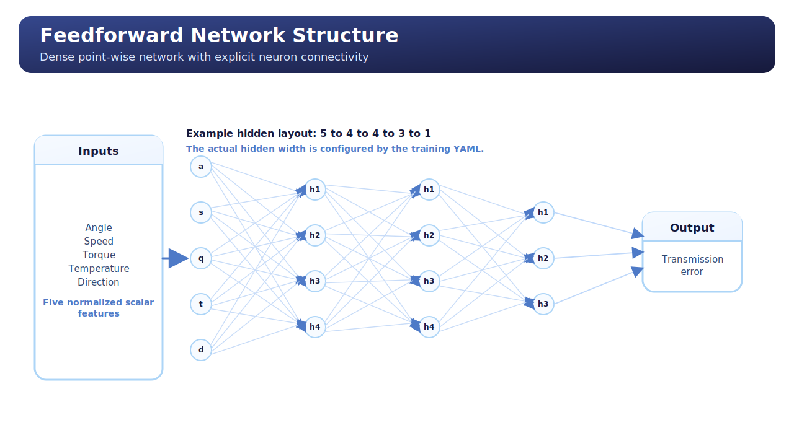

# Feedforward Model Explanatory Report

## Overview

This report documents the current `feedforward` TE baseline already implemented in the repository.

The goal is to frame the model quickly from three complementary angles:

- what the model is conceptually;
- how it behaves in the TE problem;
- how the Python implementation and training workflow are organized in this repository.

## Model Description

The `feedforward` model is the simplest neural baseline currently available for TE regression.

It is a point-wise multilayer perceptron (MLP) that receives one TE sample at a time after curve-to-point conversion. Each point is described by:

- output angular position;
- input speed;
- input torque;
- oil temperature;
- direction flag.

The model maps these five inputs directly to a scalar TE prediction.

This is the most generic static nonlinear regressor in the current program. It does not explicitly encode periodic structure, harmonic bias, or analytical decomposition.

## Operating Principle

The operating principle is standard nonlinear regression in normalized feature space.

At training time:

1. the datamodule flattens TE curves into point-wise samples;
2. input and target statistics are computed on the train split;
3. the MLP receives normalized input features;
4. the network outputs a normalized TE prediction;
5. loss is computed in normalized space, while `MAE` and `RMSE` are reported after denormalization.

This means the model learns a direct nonlinear mapping:

`x -> f_theta(x) -> TE`

without any explicit physics or periodic prior beyond what can be inferred from data.

## Conceptual Map


The model can be read as:

```text
Input Point
  -> [angle, speed, torque, temperature, direction]
  -> normalization
  -> Linear
  -> optional LayerNorm
  -> activation
  -> optional Dropout
  -> ...
  -> Linear
  -> scalar TE prediction
```

Repository-level schematic:

```text
Curve Dataset
  -> Point Extraction
  -> TransmissionErrorDataModule
  -> FeedForwardNetwork
  -> TransmissionErrorRegressionModule
  -> Lightning Trainer
  -> checkpoints + metrics + registries
```

## Architecture Diagram



This second diagram shows the network more explicitly as a dense layer stack.

Read it as an example architecture view:

- 5 input features;
- multiple dense hidden layers;
- one scalar output node;
- dense connectivity between consecutive layers.

The exact hidden widths are YAML-configurable, but the architectural logic remains the same.

## Why This Model Exists

This model is the baseline of reference because it is:

- simple;
- flexible;
- easy to train;
- easy to compare against future structured models;
- useful to measure how much gain comes from adding stronger inductive bias later.

In other words, it answers the question:

`How far can we go with a generic static neural regressor before adding TE-specific structure?`

## Advantages

- Very simple and robust baseline.
- Can model generic nonlinear couplings among operating variables.
- Low conceptual overhead compared with more structured models.
- Good first benchmark for later temporal, harmonic, or PINN models.
- Easy to deploy or compress compared with heavier architectures.

## Disadvantages

- No explicit periodic prior on angular position.
- No explicit decomposition between structured TE component and residual component.
- Less interpretable than harmonic or hybrid structured models.
- May need more data to learn periodic structure that could otherwise be encoded directly.
- Can fit the data well while still giving little physical insight.

## Expected Behavior In The TE Context

In the TE problem, this model is expected to work reasonably well when:

- the mapping is smooth enough;
- the available data covers the operating conditions sufficiently;
- the main goal is predictive benchmarking rather than interpretability.

It is less attractive when the objective is:

- explicit periodic understanding;
- coefficient-level interpretability;
- decomposition into analytical and residual parts;
- physics-oriented reasoning.

## Python Model Implementation

The model implementation lives in `scripts/models/feedforward_network.py`.

### `get_activation_module(...)`

This helper resolves the configured activation name into a concrete PyTorch activation module.

Its role is simple but important:

- keep activation selection declarative in YAML;
- centralize the supported activation set;
- fail early if an unsupported name is requested.

### `FeedForwardNetwork.__init__(...)`

This constructor builds the MLP architecture stage by stage.

Main responsibilities:

- validate `input_size`, `hidden_size`, `output_size`, and dropout;
- store the architectural parameters for traceability;
- build the hidden stack as repeated:
  - `Linear`
  - optional `LayerNorm`
  - activation
  - optional `Dropout`
- append the final linear output layer.

The implementation is intentionally explicit rather than abstract. Each hidden stage is assembled in a readable sequence.

### `FeedForwardNetwork.forward(...)`

This is the simplest forward path in the current model set.

It just applies:

- `self.network(input_tensor)`

The model therefore expects a normalized point-wise feature tensor and returns a normalized scalar prediction.

## Repository Integration

The model is registered in `scripts/models/model_factory.py` under `model_type == "feedforward"`.

The factory path is what makes the model:

- selectable from YAML;
- compatible with the shared training infrastructure;
- compatible with campaign execution and registries.

## Training Workflow Overview

The feedforward baseline uses the shared structured-neural training entry point in `scripts/training/train_feedforward_network.py`.

At high level, training works as follows:

1. load YAML configuration;
2. resolve the output artifact identity;
3. build the datamodule and compute normalization statistics;
4. instantiate the model through the factory;
5. wrap it inside the generic regression Lightning module;
6. train with early stopping and checkpointing on `val_mae`;
7. reload the best checkpoint;
8. run final validation and held-out test;
9. save metrics, report, and registry entries.

## Training Logic In This Repository

The actual training behavior is split across several files.

### `train_feedforward_network.py`

This file is the orchestration entry point.

Important functions:

- `print_training_configuration_summary(...)`
  Renders the resolved YAML settings in terminal form.

- `print_dataset_summary(...)`
  Shows the real train/validation/test curve counts and batching setup.

- `print_model_summary(...)`
  Reports trainable, frozen, and total parameter counts.

- `resolve_runtime_config(...)`
  Applies runtime decisions such as disabling `benchmark` when deterministic execution is requested.

- `save_training_test_report(...)`
  Builds the run-local Markdown report after training and testing.

- `train_feedforward_network(...)`
  This is the main orchestration function:
  - prepares the output directory;
  - initializes datamodule, backbone, and regression module;
  - configures logger, checkpointing, early stopping, and progress bar;
  - runs `fit`, `validate`, and `test`;
  - reloads the best checkpoint when available;
  - serializes metrics and updates registries.

### `transmission_error_regression_module.py`

This file contains the generic Lightning training logic.

For the feedforward baseline, the most relevant parts are:

- `set_normalization_statistics(...)`
  Copies train-split normalization statistics into Lightning buffers.

- `normalize_input_tensor(...)` and `normalize_target_tensor(...)`
  Move the optimization into normalized space.

- `forward(...)`
  Delegates directly to the MLP on normalized inputs.

- `compute_batch_outputs(...)`
  Produces normalized predictions, denormalized predictions, loss, `MAE`, and `RMSE`.

- `compute_loss(...)`
  Logs the metrics for train, validation, and test phases.

- `configure_optimizers(...)`
  Uses `AdamW`.

### `shared_training_infrastructure.py`

This file provides the shared repository plumbing:

- config loading;
- artifact naming;
- output directory resolution;
- datamodule creation;
- model instantiation;
- registry updates;
- common metrics snapshot format.

For the feedforward baseline, this file is what makes the training workflow reusable and comparable with the newer structured models.

## Practical Interpretation

The feedforward model should be read as the neutral nonlinear benchmark of the project:

- stronger than a trivial linear model;
- weaker in inductive bias than harmonic or hybrid structured models;
- useful as the reference point for answering whether added structure really helps.

If a later structured model beats it clearly, that improvement is meaningful because the feedforward baseline already captures generic nonlinear regression capacity without any TE-specific prior.
