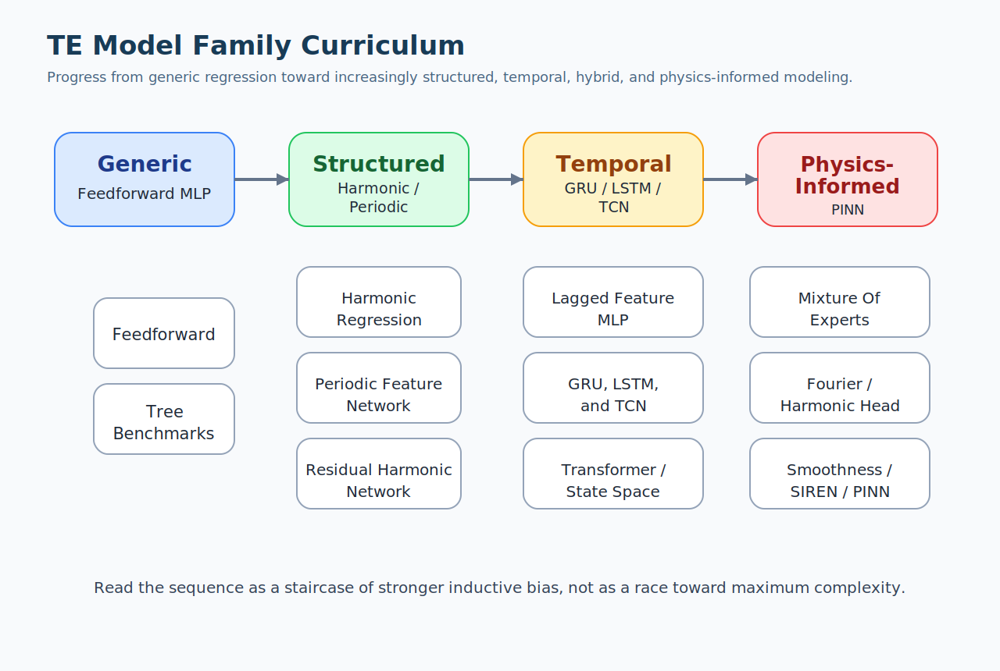

# TE Model Curriculum

## Overview

This guide connects neural-network theory to the actual model families of the repository.

It is not only a list of architectures.

It is a progression:

- start from the simplest generic nonlinear regressor;
- inject periodic structure;
- separate structured and residual behavior;
- decide whether temporal memory is necessary;
- move toward hybrid and eventually physics-informed models.

This ordering matters because the TE problem is not a generic benchmark.

The target has:

- periodic dependence on angular position;
- operating-condition dependence on speed, torque, and temperature;
- deployment constraints related to TwinCAT and PLC-side execution;
- a scientific need for interpretability beyond raw predictive accuracy.

## Status Legend

This curriculum distinguishes three statuses:

- `Implemented`
  architecture already present in repository code;
- `Planned`
  approved in the roadmap and backlog but not yet implemented;
- `Exploratory`
  explicitly kept in scope but lower priority.

## Family Progression Diagram

The progression should be read as a sequence of increasingly structured questions:

1. can a generic `MLP` already solve the problem well enough?
2. does explicit periodic structure help?
3. should the periodic baseline and residual correction be separated?
4. does recent history matter?
5. do more structured hybrid inductive biases help?
6. is the problem mature enough for full physics-informed constraints?

## Comparison Axes

Every family in this curriculum should be judged on the same axes:

- predictive accuracy on valid TE windows;
- robustness across operating conditions;
- ability to represent periodic structure cleanly;
- interpretability;
- training stability;
- runtime cost;
- TwinCAT / PLC deployment viability.

That last axis matters because a heavier architecture is not automatically better for this repository.

## 1. MLP / Feedforward Network

Status:
`Implemented`

Related repository report:

- [FeedForward Network](../../model_explanatory/FeedForward%20Network/FeedForward%20Network.md)

### Core Idea

The feedforward network is the simplest neural baseline in the repository.

It receives one point-wise sample at a time:

- angle;
- speed;
- torque;
- temperature;
- direction.

It directly predicts one TE value.

The idea is:

`give the model the raw variables and let it learn the nonlinear mapping`

### Mathematical Form

At a high level:

`h1 = phi(W1 x + b1)`

`h2 = phi(W2 h1 + b2)`

`y_hat = W3 h2 + b3`

The exact number of hidden layers and widths can change, but the logic stays the same.

### Why It Is The Right Starting Point

The feedforward baseline answers the neutral question:

how far can we get without inserting any explicit TE-specific structure?

That is scientifically useful because later improvements become meaningful only if they beat a reasonable generic baseline.

### Strengths

- simple;
- flexible;
- easy to train;
- good baseline for comparisons;
- compact enough for deployment-oriented thinking.

### Weaknesses

- no explicit periodic bias;
- limited interpretability;
- may waste capacity learning periodic structure that could be encoded directly;
- may need more data than a structured alternative.

### TE Interpretation

This model is good when:

- the objective is baseline predictive power;
- the data coverage is strong;
- interpretability is not the primary constraint.

It becomes less attractive when the question is:

- which harmonic components matter;
- how operating conditions modify those harmonics;
- what can be exported in a compact and inspectable form.

### What A Beginner Should Learn From It

The feedforward network teaches the essential neural workflow:

- inputs;
- hidden layers;
- nonlinear regression;
- training with backpropagation.

It is the best architecture for understanding basic neural-network mechanics before moving to TE-specific structure.

## 2. Harmonic Regression

Status:
`Implemented`

Related repository report:

- [Harmonic Regression](../../model_explanatory/Harmonic%20Regression/Harmonic%20Regression.md)

### Core Idea

Instead of forcing a generic network to discover periodicity, harmonic regression writes periodicity directly into the model.

The model assumes:

`TE(theta) = a0 + sum_k [a_k sin(k theta) + b_k cos(k theta)]`

This is a truncated harmonic expansion.

The model then learns the coefficients.

### Why It Matters

This is the first architecture in the curriculum that says:

the target is not just nonlinear, it is structurally periodic.

That makes the model:

- more interpretable;
- more compact;
- closer to harmonic compensation logic.

### Modes In The Repository

The current implementation supports:

- `static`
  one global coefficient vector;
- `linear_conditioned`
  coefficients adjusted from operating conditions.

This already introduces an important research question:

is TE mostly one periodic shape, or do operating variables meaningfully reshape that harmonic structure?

### Strengths

- explicit periodic inductive bias;
- compact parameterization;
- coefficient-level interpretability;
- high relevance for PLC-side use.

### Weaknesses

- less flexible for irregular residual behavior;
- depends on harmonic-order choice;
- conditioned version is still structurally limited compared with a richer nonlinear model.

### TE Interpretation

Harmonic regression is often the right model when:

- periodic structure dominates;
- interpretability matters strongly;
- one wants to know whether a heavy neural model is actually necessary.

### What A Beginner Should Learn From It

This model teaches a major lesson:

better architecture does not always mean deeper or larger.

Sometimes the strongest improvement comes from encoding the right structure.

## 3. Periodic Feature Network

Status:
`Implemented`

Related repository report:

- [Periodic Feature Network](../../model_explanatory/Periodic%20Feature%20Network/Periodic%20Feature%20Network.md)

### Principle

This family sits between pure `MLP` and pure harmonic regression.

It first expands the angle into harmonic features such as:

- `sin(theta)`;
- `cos(theta)`;
- `sin(2 theta)`;
- `cos(2 theta)`;
- and so on.

Then it feeds those periodic features, together with operating conditions, into an `MLP`.

### Why It Exists

This model says:

`encode periodicity explicitly, but keep a flexible nonlinear regressor downstream`

It is often a strong middle ground between rigid structure and generic flexibility.

## 4. Residual Harmonic Network

Status:
`Implemented`

Related repository report:

- [Residual Harmonic Network](../../model_explanatory/Residual%20Harmonic%20Network/Residual%20Harmonic%20Network.md)

### Principle

This family decomposes the problem into:

- structured periodic part;
- learned residual correction.

The philosophy is:

`let the interpretable model explain what it can, then let the neural branch learn only the unexplained remainder`

### Why It Is Important

This is one of the most meaningful architectures in the whole roadmap because it aligns with the project's scientific aim:

- preserve interpretability where possible;
- use machine learning where necessary.

## 5. Tree-Based Benchmarks

Status:
`Implemented` for current structured-baseline wave support

### Principle

These are non-neural baselines such as random forest or histogram gradient boosting.

They are included because good engineering needs honest baselines.

## 6. Lagged-Feature MLP / NARX-Style Regressor

Status:
`Planned`

### Principle

Instead of using only the current point, the model also receives a short history window.

The predictor is still feedforward.

### Why It Matters

This is the lowest-risk way to test whether recent history helps.

Before introducing recurrent models, it asks whether TE depends enough on recent context to justify temporal modeling at all.

## 7. GRU

Status:
`Planned`

### Principle

A `GRU` is a recurrent model with a learned hidden state that is updated along a sequence.

It is usually lighter than an `LSTM`.

## 8. LSTM

Status:
`Planned`

### Principle

An `LSTM` extends recurrent modeling with more explicit gating and memory control.

### Why It Matters

It is a natural candidate when longer or more selective memory seems useful.

## 9. TCN

Status:
`Planned`

### Principle

A Temporal Convolutional Network uses causal 1D convolutions over a history window.

### Why It Matters

It is often easier to train than recurrent models and still captures temporal context.

## 10. Mixture-Of-Experts / Regime-Conditioned Model

Status:
`Planned`

### Principle

Different lightweight submodels specialize in different operating regimes, while a gating mechanism decides how to combine or select them.

## 11. Fourier-Feature Network

Status:
`Planned`

### Principle

Angular inputs are encoded through a spectral basis before downstream learning.

## 12. Harmonic-Head Network

Status:
`Planned`

### Principle

The network predicts harmonic coefficients rather than direct TE samples.

TE is then reconstructed analytically from those coefficients.

## 13. Laplacian-Regularized Or Smoothness-Constrained Network

Status:
`Planned`

### Principle

The base predictor is trained with additional penalties that encourage physically plausible smoothness over angle or neighboring operating points.

## 14. SIREN

Status:
`Planned` / exploratory hybrid candidate

### Principle

This is a neural network with periodic activation functions.

## 15. Lightweight Transformer

Status:
`Exploratory`

### Principle

An attention-based temporal model looks across a sequence and learns which positions matter most.

## 16. State-Space Sequence Model

Status:
`Exploratory`

### Principle

This family learns compact internal dynamics for sequence processing.

## 17. Neural ODE

Status:
`Exploratory`

### Principle

The model describes hidden-state evolution through a differential equation perspective.

## 18. PINN

Status:
`Planned later, after formulation`

### Principle

A Physics-Informed Neural Network adds physically meaningful residual constraints to the data-driven objective.

### Why It Is Not The Starting Point

Full PINN work requires:

- a clear state definition;
- governing relations;
- boundary and periodic constraints;
- normalized residual terms;
- identifiability analysis.

Without that preparation, a PINN easily becomes difficult to optimize and physically weak despite the label.

## Suggested Study Order

For a new reader, the most productive reading path is:

1. foundations of neural networks;
2. training, validation, and testing;
3. feedforward baseline;
4. harmonic regression;
5. periodic and residual hybrid models;
6. temporal families;
7. advanced hybrid families;
8. full PINN preparation and formulation.

## Summary

The model curriculum is not just a march from simple to complicated.

It is a progression from:

- generic flexibility;
- to structured periodic bias;
- to structured-plus-residual decomposition;
- to temporal context;
- to hybrid inductive bias;
- to explicit physical constraints.

For this TE project, that progression is more meaningful than a naive "deeper is better" view of neural-network design.

## Related Reading

- [Neural Network Foundations](../Neural%20Network%20Foundations/Neural%20Network%20Foundations.md)
- [Training, Validation, And Testing](../Training,%20Validation,%20And%20Testing/Training,%20Validation,%20And%20Testing.md)
- [FeedForward Network](../../model_explanatory/FeedForward%20Network/FeedForward%20Network.md)
- [Harmonic Regression](../../model_explanatory/Harmonic%20Regression/Harmonic%20Regression.md)
- [Periodic Feature Network](../../model_explanatory/Periodic%20Feature%20Network/Periodic%20Feature%20Network.md)
- [Residual Harmonic Network](../../model_explanatory/Residual%20Harmonic%20Network/Residual%20Harmonic%20Network.md)
