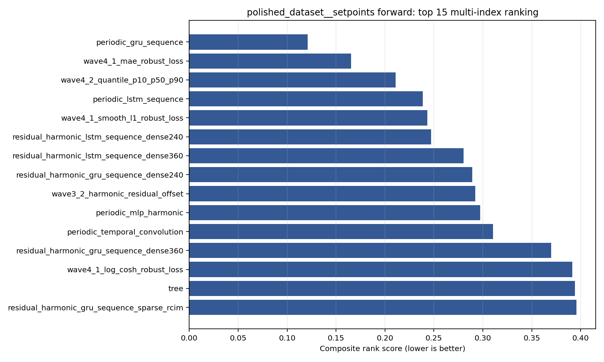
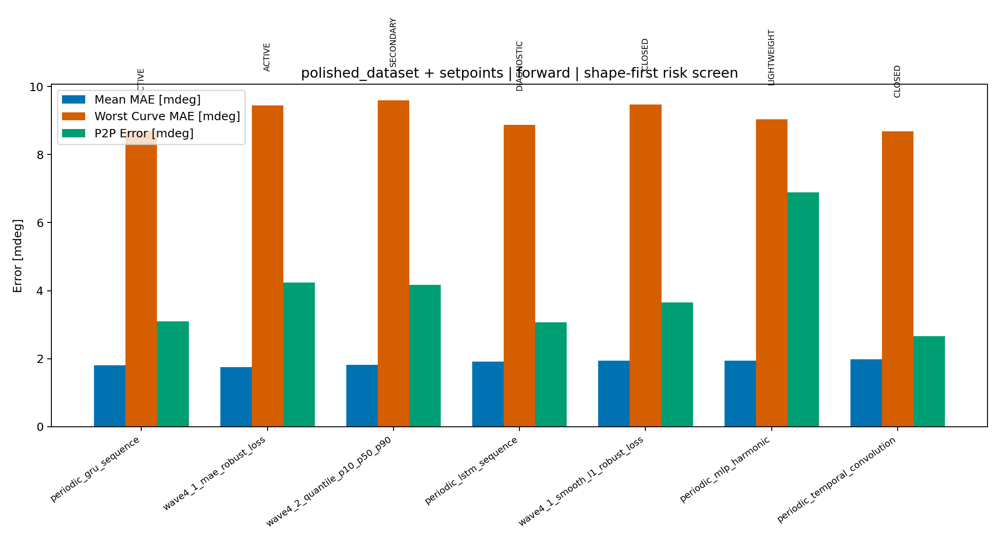
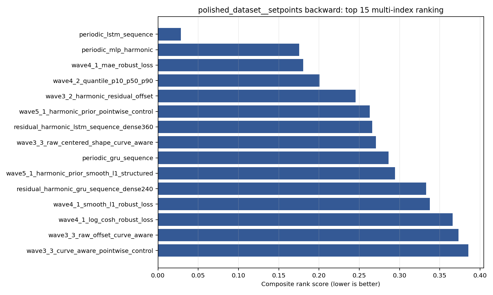
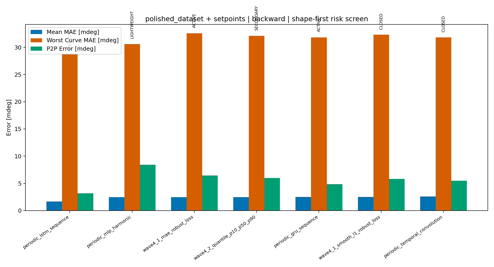
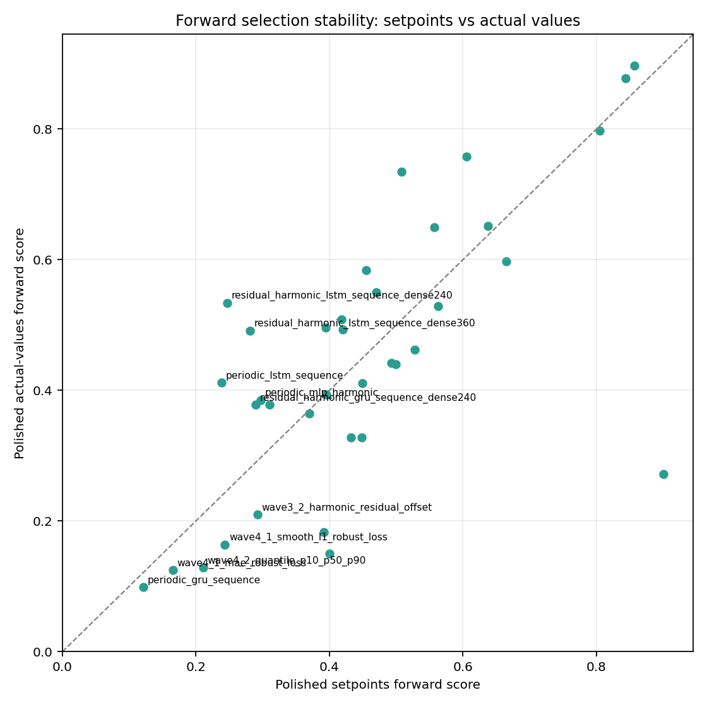
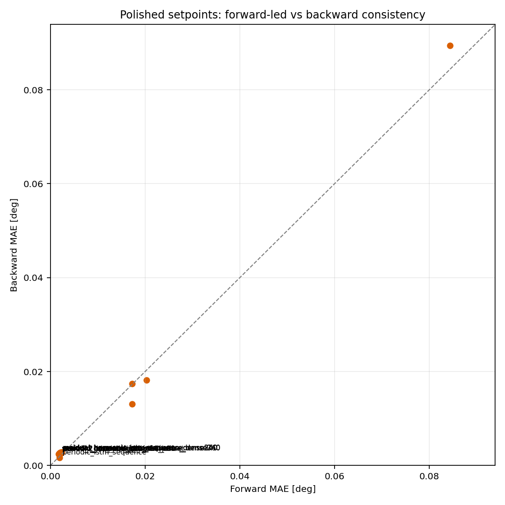

# TE Intermediate Model Selection Cleanup Report

## Overview

This report updates the `2026-07-06` model-family pruning decision after the
familywise ONNX `TE Curve Verification Pipeline` reports were regenerated for
all non-RCIM retrained model-development families.

This is an intermediate cleanup decision. It is not a final project closeout
and it does not delete historical artifacts. Its purpose is to stop carrying
dead-end exploratory branches into the next development stage while preserving
the few paths that either set a stronger target-to-beat or deserve deeper
implementation work.

The program constraint is now stricter than the first draft of this report:

- keep at least one temporal-window path active;
- keep at least one non-windowed path active;
- reject models that do not preserve the measured curve shape and harmonic
  content, even when their aggregate scalar error is low.

The last point is decisive. The target is not a smooth approximation of the
transmission-error envelope. The target is faithful reproduction of the
measured TE curve, including the harmonic/ripple structure.

## Evidence Package

The analysis uses these repository-backed artifacts:

- familywise ONNX report summaries under
  `output/validation_checks/track2_familywise_onnx_report/`;
- familywise 12-curve collages under the same report folders;
- the prior pruning decision report:
  `doc/reports/analysis/model_development_waves/model_family_pruning/[2026-07-06]/te_model_family_pruning_decision_report.md`;
- the canonical multi-index selection policy:
  `doc/reports/analysis/te_curve_verification_pipeline/00_overview/multi_index_curve_first_selection_policy/[2026-06-16]/track2_multi_index_curve_first_selection_policy.md`;
- diagnostic ranking tables in this report bundle:
  `selection_metric_ranking.csv`,
  `setpoint_vs_actual_comparison.csv`, and
  `shape_first_candidate_decisions.csv`.

Primary evidence surface:

- `polished_dataset + setpoints`;
- `forward` is the primary selection driver;
- `backward` is a consistency and split-decision check;
- `global` is excluded from this intermediate model selection.

Secondary check:

- `polished_dataset + actual_values`;
- considered only when it materially changes the interpretation.

## Shape-First Method

The first draft of this report over-weighted aggregate scalar behavior. It used
raw error, centered error, offset, and robustness, but it did not explicitly
veto models whose prediction became a smoothed or shifted approximation of the
measured curve in harmonic-rich operating conditions.

That is no longer acceptable for the project goal. A model can be low-`MAE`
because it follows the large low-frequency envelope while missing local TE
shape. Such a model is not a valid active development path for curve matching.

The revised decision order is therefore:

1. Check the familywise collage for visible shape and harmonic fidelity.
2. Check worst-case behavior with `max_mae`, `max_mean_pct`, `P95 Error`, and
   `P2P Error`.
3. Use aggregate `MAE`, `Mean Error`, centered error, and offset only after the
   curve-shape screen.
4. Keep `forward` as the primary branch-selection driver.
5. Use a separate `backward` model only if it passes the same shape screen and
   the evidence gap is substantial.

The next pipeline implementation should make this fully mechanical with
frequency-domain metrics:

| Metric | Purpose |
| --- | --- |
| Harmonic amplitude retention | Penalize missing measured ripple energy. |
| Spectral cosine similarity | Compare measured and predicted FFT amplitude shape. |
| Weighted phase error | Penalize harmonic phase shifts on dominant bins. |
| Derivative correlation | Detect smoothed curves that miss local slope changes. |
| Per-curve shape pass rate | Prevent one good average from hiding failed operating conditions. |

For this Markdown decision, the official gate is conservative: the existing
full aggregate metrics are kept, but the familywise 12-curve collages are used
as a hard visual veto for active selection.

## Forward Result

`periodic_gru_sequence` remains the strongest forward-led temporal choice. It
does not have the absolute best scalar `MAE`, but it is the best compromise
after shape fidelity, P95 behavior, and forward/backward deployability are
considered.

| Rank | Family | Decision | MAE [deg] | P95 [%] | Worst MAE [deg] | Shape Risk |
| ---: | --- | --- | ---: | ---: | ---: | --- |
| 1 | `periodic_gru_sequence` | Active temporal primary | 0.001802 | 8.937 | 0.008697 | cMAE 0.001421; P2P 0.003102 |
| 2 | `wave4_1_mae_robust_loss` | Active non-windowed primary | 0.001752 | 9.578 | 0.009451 | cMAE 0.001479; P2P 0.004239 |
| 3 | `wave4_2_quantile_p10_p50_p90` | Secondary non-windowed | 0.001825 | 9.470 | 0.009591 | cMAE 0.001506; P2P 0.004174 |
| 4 | `periodic_lstm_sequence` | Diagnostic only | 0.001914 | 10.391 | 0.008880 | cMAE 0.001409; P2P 0.003072 |
| 5 | `wave4_1_smooth_l1_robust_loss` | Closed/diagnostic | 0.001947 | 9.489 | 0.009475 | cMAE 0.001532; P2P 0.003657 |

Interpretation:

- `wave4_1_mae_robust_loss` is the best non-windowed forward model by raw
  error and offset.
- `periodic_lstm_sequence_Fw` has competitive centered metrics, but it does not
  improve the forward-led temporal path enough to displace `GRU`.
- `periodic_gru_sequence_Fw` remains the forward temporal leader because it is
  strong on mean error, P95 error, centered shape, P2P behavior, and visual
  curve tracking.

## Backward Result

The earlier draft incorrectly promoted `periodic_lstm_sequence_Bw` as a serious
backward challenger because it was the scalar leader on `polished_dataset +
setpoints`.

| Rank | Family | Decision | MAE [deg] | P95 [%] | Worst MAE [deg] | Shape Risk |
| ---: | --- | --- | ---: | ---: | ---: | --- |
| 1 | `periodic_lstm_sequence` | Demoted false scalar leader | 0.001671 | 7.047 | 0.028832 | cMAE 0.001263; P2P 0.003177 |
| 2 | `periodic_mlp_harmonic` | Lightweight harmonic comparator | 0.002470 | 9.956 | 0.030578 | cMAE 0.002026; P2P 0.008407 |
| 3 | `wave4_1_mae_robust_loss` | Active non-windowed with shape review | 0.002451 | 10.887 | 0.032566 | cMAE 0.002060; P2P 0.006463 |
| 4 | `wave4_2_quantile_p10_p50_p90` | Secondary non-windowed | 0.002476 | 10.935 | 0.032117 | cMAE 0.002077; P2P 0.005988 |
| 5 | `periodic_gru_sequence` | Active temporal default with shape review | 0.002489 | 11.378 | 0.031824 | cMAE 0.002051; P2P 0.004867 |

The reason for the demotion is not that `periodic_lstm_sequence_Bw` is bad on
every curve. It is that the model can look good in aggregate while visibly
losing or shifting the measured harmonic structure in difficult conditions.
That is exactly the failure mode this project must avoid.

Backward therefore does not get a separate LSTM leader in the reduced active
set. The default remains `periodic_gru_sequence_Bw`, mainly for consistency
with the forward temporal leader and because the actual-values check strongly
favours `periodic_gru_sequence_Bw`:

| Family | Actual Score | Actual MAE [deg] | Actual P95 [%] |
| --- | ---: | ---: | ---: |
| `periodic_gru_sequence` | 0.0057 | 0.001263 | 5.490 |
| `periodic_lstm_sequence` | 0.5529 | 0.002539 | 11.493 |

## Setpoint Versus Actual-Values Stability

Forward is stable enough for selection: `periodic_gru_sequence`,
`wave4_1_mae_robust_loss`, and `wave4_2_quantile_p10_p50_p90` stay near the top
when moving from setpoints to actual values.

Backward is not stable enough to justify the old LSTM split. The setpoint
aggregate score promotes `periodic_lstm_sequence`, but the actual-values
surface promotes `periodic_gru_sequence` decisively. With the shape-first gate,
this means LSTM is diagnostic evidence, not an active backward leader.

## Forward And Backward Consistency

The reduced decision is:

- carry one temporal-window path: `periodic_gru_sequence`;
- carry one primary non-windowed path: `wave4_1_mae_robust_loss`;
- carry one lightweight harmonic comparator: `periodic_mlp_harmonic`;
- keep `wave4_2_quantile_p10_p50_p90` only as secondary uncertainty-aware
  evidence;
- do not carry `periodic_lstm_sequence_Bw` as an active challenger unless a
  future FFT/phase shape gate proves it preserves measured harmonic content.

## Updated Active Development Set

- Temporal-window path: continue `periodic_gru_sequence_Fw/Bw` as the best
  forward-led temporal family. The actual-values backward check is strongest
  for the same family.
- Non-windowed path: continue `wave4_1_mae_robust_loss_Fw/Bw` as the primary
  non-windowed raw/offset target-to-beat.
- Probabilistic path: keep `wave4_2_quantile_p10_p50_p90_Fw/Bw` as a secondary
  candidate only while uncertainty-aware deployment remains relevant.
- Harmonic comparator: keep `periodic_mlp_harmonic_Fw/Bw` as a compact
  harmonic-aware deployment comparator.
- Former scalar leader: demote `periodic_lstm_sequence_Bw` because it is
  rejected by the shape-first gate.
- Simple anchors: preserve `tree`, `feedforward`, and `harmonic_regression` as
  interpretability and regression anchors.
- RCIM reference: keep the selected RCIM forward reference bank as a
  paper/reference benchmark after actual-values RCIM retraining.

## Branches To Close

These branches should stop appearing as active development candidates in future
selection reports unless a later implementation explicitly reopens them with
shape-gated evidence.

| Branch | Cleanup Decision | Reason |
| --- | --- | --- |
| Plain `GRU`, plain `LSTM`, and plain temporal convolution | Close | Periodic temporal variants dominate them and preserve the useful temporal-context idea. |
| `periodic_lstm_sequence` as backward leader | Close as active | The old scalar lead is not enough under the shape-first gate. |
| Dense residual harmonic `GRU`/`LSTM` variants | Close | Added size and complexity did not produce a better curve-matching target. |
| Sparse residual harmonic sequence variants | Close as active, preserve evidence | Useful negative evidence; not good enough to keep in reduced candidate sets. |
| Wave 3.1 and Wave 3.2 clean offset probes | Close | Superseded by cleaner robust/probabilistic and periodic temporal evidence. |
| Wave 3.3 full/composite variants | Close as active | Diagnostic value remains, but active selection should move to stronger branches. |
| Wave 4.3 mixture-density `k2`/`k3` | Close as active | Familywise ONNX results are weak after retraining. |
| Wave 4.4 latent-state / hysteresis probes | Close | Added state complexity did not show enough curve-matching gain. |
| Wave 5.1 harmonic-prior pointwise and structured branches | Close as active, preserve evidence | Conceptually useful but weaker than current temporal and robust-loss candidates. |

## Future Development Paths

### Shape-Gated Reranker

Add a repository-owned reranker that computes frequency-domain shape metrics on
the evaluated curve payloads:

1. measured/predicted FFT amplitude similarity;
2. dominant-harmonic amplitude retention;
3. dominant-harmonic phase error;
4. derivative correlation;
5. per-curve shape pass rate and worst-condition veto.

This should become part of future `TE Curve Verification Pipeline` reports so
the same error does not recur.

### Temporal-Window Path

Continue with a narrow temporal branch:

1. `periodic_gru_sequence` as the main deployable temporal family.
2. A targeted harmonic-shape repair or loss term for high-ripple conditions.
3. A deployment contract review for sequence-window buffering, inference
   latency, memory, and deterministic PLC-side state handling.

### Non-Windowed Path

Continue with a narrow non-windowed branch:

1. `wave4_1_mae_robust_loss` as the primary non-windowed target-to-beat.
2. `wave4_2_quantile_p10_p50_p90` as a secondary uncertainty-aware candidate.
3. `periodic_mlp_harmonic` as the lightweight harmonic comparator.
4. A compact feature/architecture iteration with explicit harmonic or spectral
   loss, not just lower aggregate `MAE`.

### Reference Path

Keep RCIM as reference-only until the remaining actual-values RCIM retraining
is available. That result should be compared as a benchmark, not as part of
the active neural model-development branch unless it materially changes the
target-to-beat.

## Proposed Reduced Evaluation Set

The next reduced evaluation should include:

- `periodic_gru_sequence_Fw`;
- `periodic_gru_sequence_Bw`;
- `wave4_1_mae_robust_loss_Fw`;
- `wave4_1_mae_robust_loss_Bw`;
- `wave4_2_quantile_p10_p50_p90_Fw`;
- `wave4_2_quantile_p10_p50_p90_Bw`;
- `periodic_mlp_harmonic_Fw`;
- `periodic_mlp_harmonic_Bw`;
- `tree`, `feedforward`, and `harmonic_regression` as simple anchors;
- selected RCIM reference candidates after the actual-values RCIM retraining
  is available.

Do not include `global` in this reduced pass. Do not include
`periodic_lstm_sequence_Bw` as an active candidate unless it passes the future
frequency-domain shape gate.

## Interim Decision

The current shape-first practical selection is:

- forward: `periodic_gru_sequence_Fw`;
- backward default: `periodic_gru_sequence_Bw`;
- non-windowed development target: `wave4_1_mae_robust_loss`;
- non-windowed secondary candidate: `wave4_2_quantile_p10_p50_p90`;
- lightweight harmonic comparator: `periodic_mlp_harmonic`;
- demoted scalar false leader: `periodic_lstm_sequence_Bw`.

The main correction from the first draft is that scalar centered metrics are
not enough. A model that smooths, shifts, or loses the measured harmonic shape
cannot remain a valid active road for a project whose target is faithful TE
curve reproduction.
