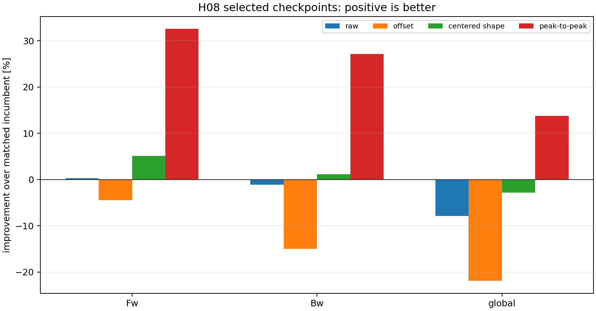
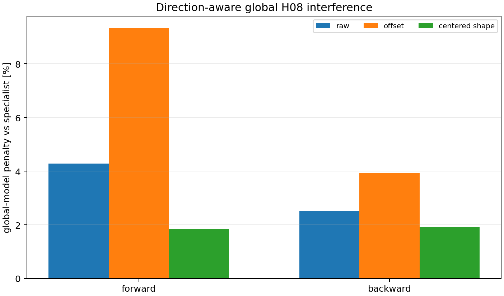
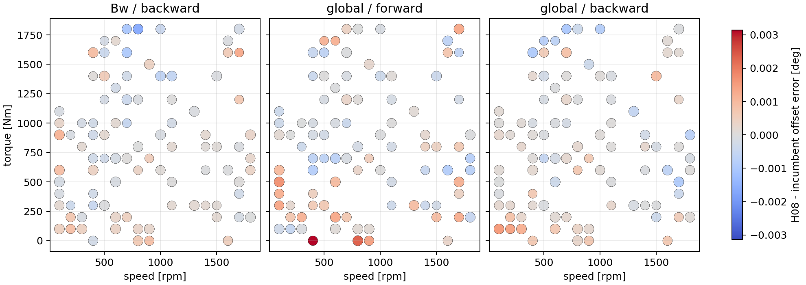
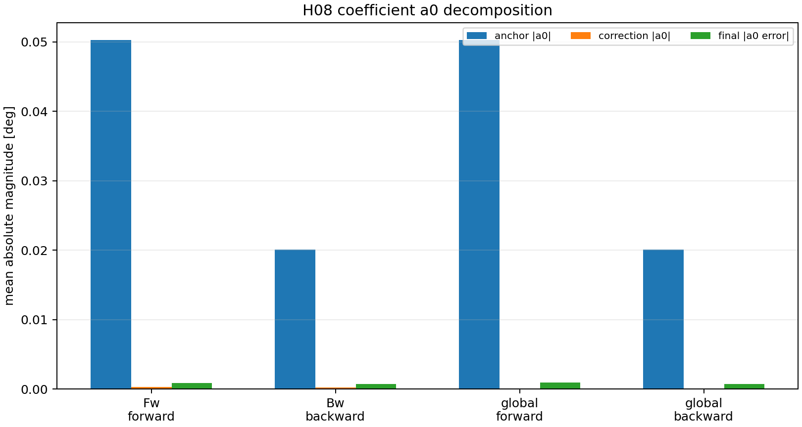
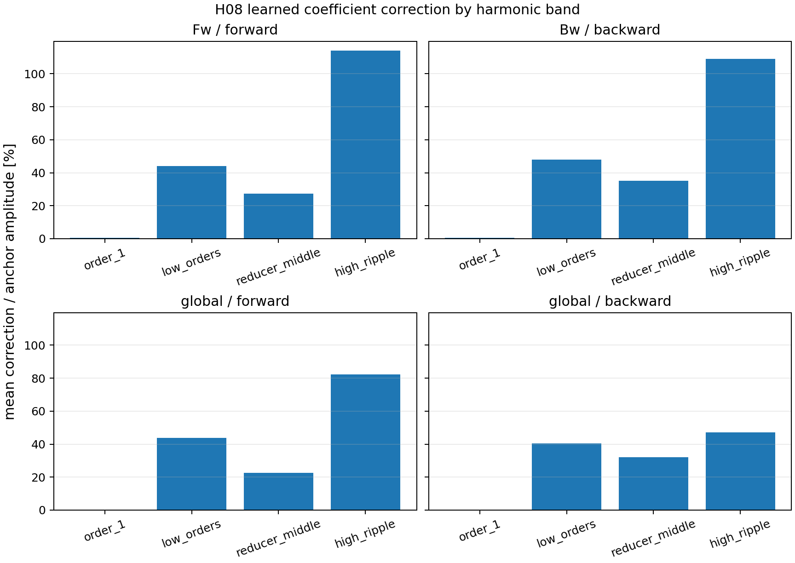
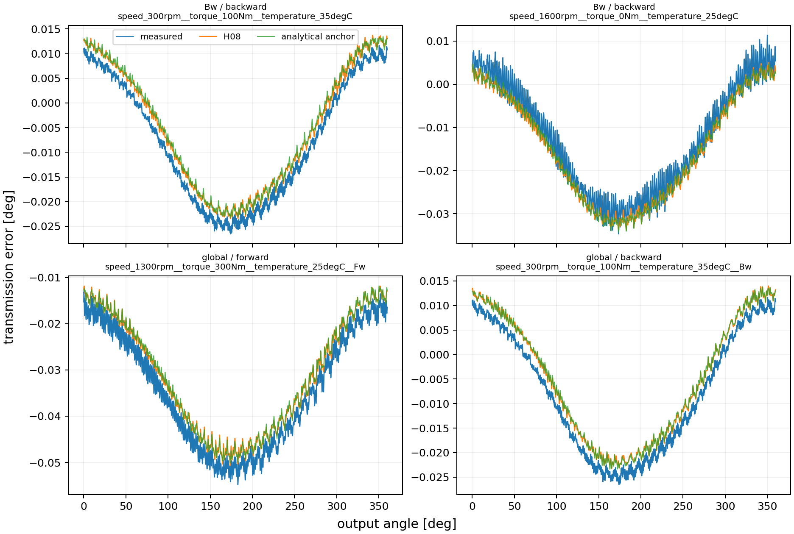

# Wave 5.2R H08 Backward And Global Defect Analysis

## Overview

This non-training diagnostic replays the nine frozen H08 promotion payloads and the official CVP 1.2 per-curve evidence. It separates raw error, curve-mean offset, centered shape, operating condition, direction, seed, coefficient `a0`, and harmonic-band behavior.

Diagnostic run: `2026-08-02-17-12-57`.

## Decision

**Outcome: `offset_dominant_direction_conditioned_with_global_interference`.**

The backward specialist retains a small centered-shape advantage but loses the matched-incumbent comparison mainly through offset. The combined global H08 model is worse than the corresponding direction-specific H08 specialist on both directions, so global-fit interference is confirmed. H08 should remain frozen as a forward specialist. If a repair is studied later, the first bounded candidate should be a direction-specific, causal `a0`/offset calibration with the existing harmonic coefficients frozen; broad retraining is not justified by this diagnostic.

This decision does not authorize training, model replacement, registry promotion, or integrated-specialist work.

## Official Metric Reproduction

The selected H08 raw, offset, and centered-shape metrics reproduce the rounded official decision with maximum absolute difference `0.000000412 deg`.

## Selected H08 Versus Matched Incumbent

| Surface | Raw improvement | Offset improvement | Shape improvement | P2P improvement |
| --- | ---: | ---: | ---: | ---: |
| `Fw` | 0.35% | -4.40% | 5.10% | 32.56% |
| `Bw` | -1.08% | -14.95% | 1.13% | 27.19% |
| `global` | -7.89% | -21.87% | -2.79% | 13.77% |

The `Bw` checkpoint changes raw MAE by `-1.08%`, offset by `-14.95%`, and centered shape by `1.13%`. The offset regression is therefore larger than the raw regression while shape still improves.

The selected `Fw` checkpoint remains useful on raw, centered shape, and peak-to-peak evidence, although its offset changes by `-4.40%`. The `global` checkpoint regresses raw, offset, and shape by `7.89%`, `21.87%`, and `2.79%`, respectively.

## Global Model Interference

| Direction subset | Raw penalty | Offset penalty | Shape penalty |
| --- | ---: | ---: | ---: |
| `forward` | 4.28% | 9.32% | 1.86% |
| `backward` | 2.53% | 3.93% | 1.91% |

The global checkpoint adds raw penalties of `4.28%` on Fw and `2.53%` on Bw relative to the corresponding directional H08 specialists. This rules out a backward-only explanation for the global failure.

## Coefficient a0 And Harmonic Interpretation

For selected backward H08, mean absolute final `a0` error is `0.000704 deg` and P90 is `0.001499 deg`. The frozen payload confirms that predicted curve mean and coefficient `a0` agree within the diagnostic tolerance.

The coefficient plots show where learned corrections sit relative to the analytical anchor. They support attribution to an inspectable coefficient surface; they do not identify hysteresis, compliance, or lost motion as the physical cause.

## Operating-Condition And Seed Evidence

The largest mean offset degradation group is `global` / `forward` at `torque_nm=0.0`, with mean H08-minus-incumbent offset delta `0.001834 deg`. This is an explanatory concentration, not a causal mechanism claim.

The maximum aggregate coefficient of variation across the three H08 seeds is `3.31%`; the cross-surface defect is not explained by one unstable selected seed alone.

## Visual Evidence













## Scientific Boundary

Repository references support keeping direction, torque, speed, temperature, periodic shape, offset, and possible memory state separate. The present artifacts confirm a direction-conditioned coefficient and offset defect plus global-fit interference. They do not identify an underlying contact, hysteresis, compliance, or lost-motion law.

## Recommended Next Gate

1. Keep H08 frozen as the non-temporal `Fw` specialist.
2. Do not transfer the current global H08 formulation into the integrated-specialist roadmap.
3. If an H08 repair is desired, prepare a separate bounded technical plan for direction-specific causal `a0` calibration with all non-offset coefficients frozen.
4. Use this defect report as an exclusion and ablation contract when the integrated-specialist roadmap is prepared.

## Reproducibility

```powershell
conda run --no-capture-output -n pinns_env python -B scripts/reports/analysis/build_wave52r_h08_backward_global_defect_analysis.py `
  --config config/analysis/wave52r_h08_backward_global_defect_analysis.yaml `
  --run-id 2026-08-02-17-12-57

conda run --no-capture-output -n pinns_env python -B scripts/reports/analysis/validate_wave52r_h08_backward_global_defect_analysis.py `
  --config config/analysis/wave52r_h08_backward_global_defect_analysis.yaml `
  --run-directory output/analysis/wave_5_2r/h08_backward_global_defect_analysis/2026-08-02-17-12-57
```
