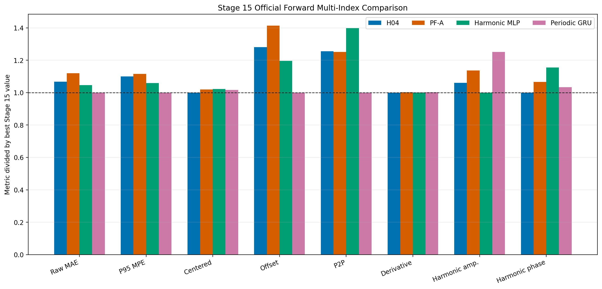
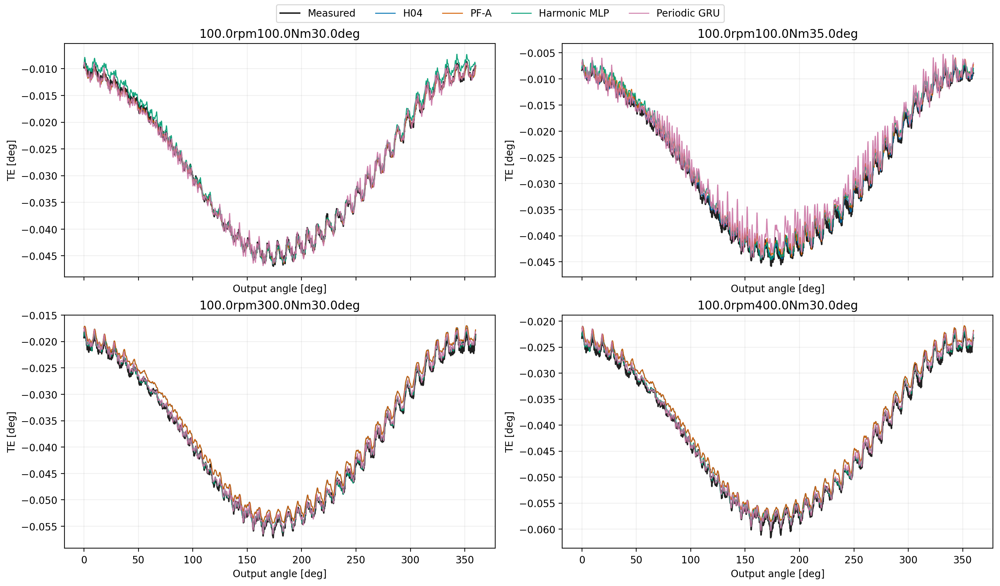
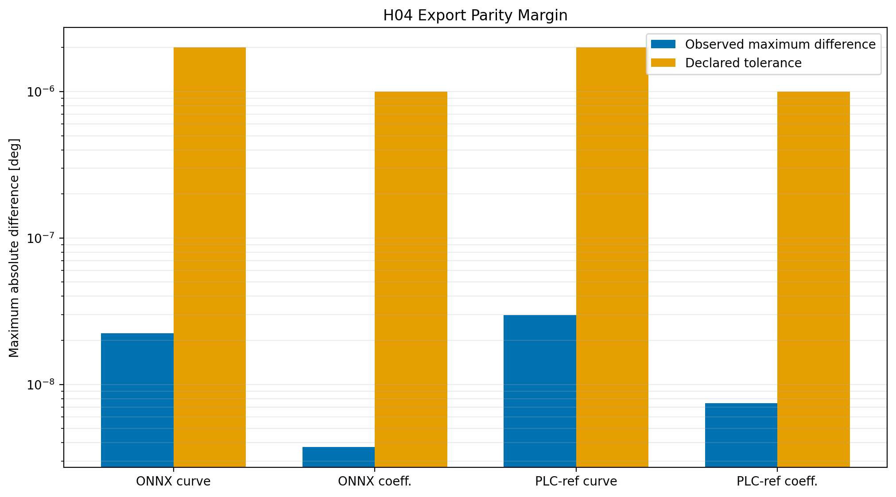

# Wave 5.2R Stage 15 Official Forward Verification And Deployment Preparation

## Executive Decision

Stage 15 is complete on the official polished-dataset setpoint-forward surface.
The matrix evaluated 97 held-out forward curves with the exact same split and
runtime-valid input contract for H04, PF-A, the accepted harmonic MLP, and the
accepted periodic GRU.

H04 remains exploratory and receives no family or program registry promotion.
It improves PF-A raw MAE by
`4.587%` and is the best
candidate for mean-centered shape, derivative fidelity, and mean harmonic
phase. It does not displace the GRU: its raw MAE is
`6.814%` worse and its
absolute offset error is
`28.116%` worse. The GRU
also retains the best P95 error and peak-to-peak behavior.

The Python/ONNX and independent float32 PLC-reference parity gates pass. A
TwinCAT compile and runtime replay were not performed, so this report makes no
PLC runtime claim. The accepted periodic GRU remains the forward incumbent.

## Scope And Evidence Contract

- dataset: `data/polished_dataset`;
- surface: setpoint `Fw` only;
- held-out curves: `97`;
- angular samples per full curve: `2048`;
- candidates: H04, PF-A, accepted harmonic MLP, accepted periodic GRU;
- selection policy: multi-index curve-first, never scalar MAE alone;
- curve payload diagnostics: CVP 1.2 with full curves and downsampled visual
  payloads;
- deployment evidence: immutable Python checkpoint replay, ONNX parity, and
  static Structured Text reference parity.

## Official Multi-Index Results

| Metric | H04 | PF-A | MLP | GRU | Best |
| --- | ---: | ---: | ---: | ---: | --- |
| Raw MAE [deg] | 0.0017286 | 0.0018118 | 0.0016935 | 0.0016184 | Periodic GRU |
| RMSE [deg] | 0.0020372 | 0.0021259 | 0.0020077 | 0.0019306 | Periodic GRU |
| MPE [%] | 3.5603777 | 3.7486325 | 3.4385998 | 3.2784267 | Periodic GRU |
| P95 MPE [%] | 7.9470835 | 8.0612904 | 7.6516177 | 7.2247095 | Periodic GRU |
| Centered shape MAE [deg] | 0.0013590 | 0.0013850 | 0.0013900 | 0.0013820 | H04 |
| Absolute offset error [deg] | 0.0008840 | 0.0009750 | 0.0008250 | 0.0006900 | Periodic GRU |
| Peak-to-peak error [%] | 10.6001280 | 10.5672770 | 11.8017840 | 8.4436780 | Periodic GRU |
| Derivative RMSE [deg/deg] | 0.0149380 | 0.0149690 | 0.0149630 | 0.0149680 | H04 |
| Harmonic amplitude error [%] | 16.3185540 | 17.4753110 | 15.3800510 | 19.2368600 | Harmonic MLP |
| Harmonic phase error [deg] | 11.7719440 | 12.5529950 | 13.5916490 | 12.1657890 | H04 |
| Closure mismatch [deg] | 0.0008690 | 0.0008690 | 0.0008810 | 0.0008920 | H04 |

The official matrix and CVP 1.2 diagnostics separate the winners:

- best raw MAE, RMSE, MPE, P95 MPE, offset, and peak-to-peak behavior:
  periodic GRU;
- best centered shape, derivative fidelity, and mean harmonic phase: H04;
- best aggregate CVP 1.2 diagnostic score and harmonic amplitude error:
  harmonic MLP;
- PF-A is improved by H04 but is not the official winner on any decisive
  acceptance axis.

H04's shape improvement over the GRU is
`1.664%`. This confirms
that the bounded analytical residual learned useful periodic structure. The
simultaneous raw and offset regressions show that this advantage is not a
balanced replacement for the incumbent.

## Representative Curve Evidence

The overlays use four deterministic CVP 1.2 payload conditions. They are
visual evidence only; the decision above uses all 97 full-resolution curves.
All models reproduce the dominant periodic structure. Their separation is
small enough that scalar or hand-selected visual inspection alone would be
misleading, which is why the official decision retains the multi-index table.

## Robustness Interpretation

The temperature slices preserve the same overall conclusion:

| Temperature | H04 MAE [deg] | PF-A MAE [deg] | MLP MAE [deg] | GRU MAE [deg] |
| ---: | ---: | ---: | ---: | ---: |
| 25 C | 0.0013770 | 0.0014953 | 0.0012815 | 0.0013628 |
| 30 C | 0.0018189 | 0.0018381 | 0.0017768 | 0.0016156 |
| 35 C | 0.0018864 | 0.0020149 | 0.0019034 | 0.0018093 |

H04 improves PF-A at every available temperature. It does not establish a
uniform advantage over the accepted neural references: the MLP leads at 25 C,
while the GRU leads at 30 C and 35 C. The result supports retaining H04 as a
compact grey-box formulation, not promoting it as the balanced forward
incumbent.

## Deployment Preparation And Parity

| Check | Observed maximum difference | Tolerance | Result |
| --- | ---: | ---: | --- |
| ONNX reconstructed curve | 2.235174179e-08 deg | 2.0e-06 deg | pass |
| ONNX final coefficients | 3.725290298e-09 deg | 1.0e-06 deg | pass |
| PLC-reference reconstructed curve | 2.980232239e-08 deg | 2.0e-06 deg | pass |
| PLC-reference final coefficients | 7.450580597e-09 deg | 1.0e-06 deg | pass |

The export package contains the ONNX graph, immutable parity payload,
Structured Text function block, Structured Text parameter GVL, and the
parameter archive. This proves reproducible static numerical translation.
TwinCAT compilation, execution-time measurement, task integration, invalid
input behavior, saturation behavior, and online `DataValid` replay remain
future deployment work.

## Acceptance Gate

| Gate | Result |
| --- | --- |
| Official common forward matrix completed | pass |
| H04 improves PF-A raw MAE | pass |
| H04 improves incumbent raw MAE | fail |
| H04 improves incumbent centered shape | pass |
| H04 improves incumbent offset | fail |
| Python/ONNX parity | pass |
| Static PLC-reference parity | pass |
| TwinCAT compile and runtime parity | pending / not claimed |

The Stage 15 exit gate therefore closes without promotion. This is a valid
negative acceptance result: the challenger demonstrated real shape value and
excellent export parity, but it did not provide a balanced predictive gain and
does not yet have runtime PLC evidence.

## Program Decision

Wave 5.2R has completed all stages 0 through 15. The program conclusions are:

1. observable analytical and harmonic priors are useful when treated as
   bounded structure, diagnostics, or auxiliary objectives;
2. useful physics guidance does not guarantee a better balanced predictor;
3. H04 is the strongest compact grey-box output of the wave and should be
   preserved for future deployment research;
4. the periodic GRU remains the accepted forward incumbent;
5. no family or program registry changes are authorized by this result;
6. physics-integrated Wave 6 remains a separate future decision and must not
   inherit an unearned H04 acceptance claim.

## Reproducibility Artifacts

- official matrix:
  `output/validation_checks/track2_reference_comparison/2026-07-30-01-03-11__wave52r_stage15_official_forward_verification_wave52r_stage15_official_forward_verification/`;
- CVP 1.2 diagnostics:
  `output/validation_checks/wave52r_stage15_curve_payload_diagnostics/2026-07-30-01-11-50__track2c_curve_payload_diagnostics/`;
- deployment parity:
  `output/validation_checks/wave52r_stage15_deployment_parity/`;
- machine-readable decision:
  `output/analysis/wave_5_2r/stage15_official_forward_verification/closeout/stage15_official_forward_verification_decision.yaml`.
