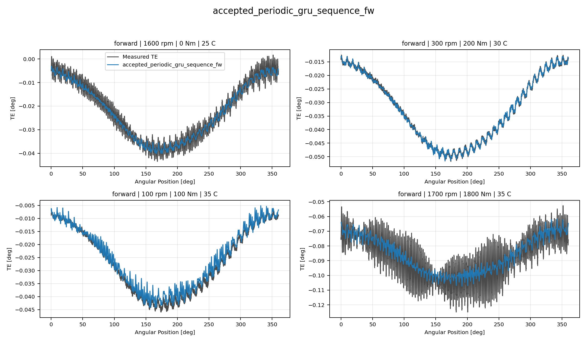
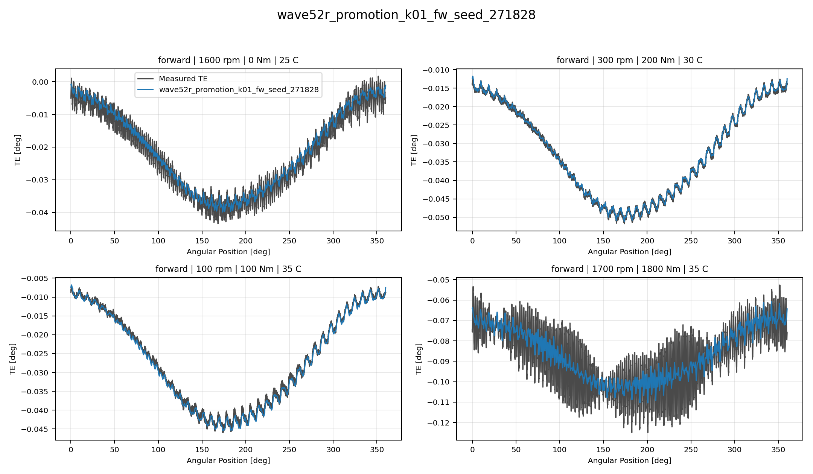
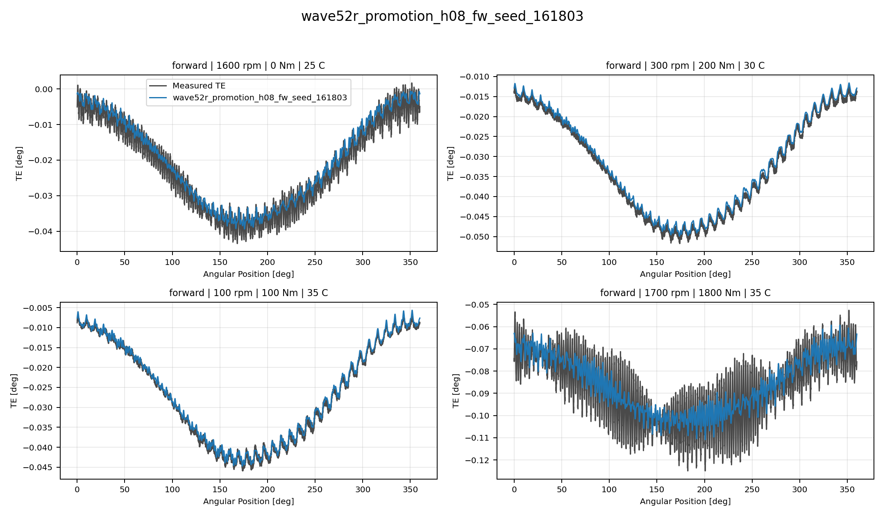

# TE Curve Verification Pipeline Best Model Collage Report

## Overview

This report compares representative `TE Curve Verification Pipeline` TE-curve predictions for
the current best reference, RCIM Model-Bank Reproduction, Wave 1 directional, and Wave 1
global models. Each model is shown as one four-image collage so local
oscillation tracking can be inspected directly.

## Scope

- each collage contains four deterministic held-out test curves;
- forward models are shown on forward curves only;
- backward models are shown on backward curves only;
- global Wave 1 models are shown on two forward and two backward curves;
- `Measured TE` uses the same line width as predictions and a dark-gray
  color for balanced visual comparison.

## Metrics Summary

### Forward Accepted Non PINN Incumbent Models

| Candidate | Source | Surface | Curve MAE [deg] | Curve RMSE [deg] | Mean Error |
| --- | --- | --- | ---: | ---: | ---: |
| `accepted_periodic_gru_sequence_fw` | `accepted_non_pinn_incumbent` | Fw | 0.001618 | 0.001931 | 3.278 |
| `accepted_periodic_mlp_harmonic_fw` | `accepted_non_pinn_incumbent` | Fw | 0.001694 | 0.002008 | 3.439 |

### Forward Wave52r Offline Leader Cross Surface Promotion Models

| Candidate | Source | Surface | Curve MAE [deg] | Curve RMSE [deg] | Mean Error |
| --- | --- | --- | ---: | ---: | ---: |
| `wave52r_promotion_k01_fw_seed_271828` | `wave52r_offline_leader_cross_surface_promotion` | Fw | 0.001358 | 0.001620 | 2.681 |
| `wave52r_promotion_h08_fw_seed_161803` | `wave52r_offline_leader_cross_surface_promotion` | Fw | 0.001688 | 0.001985 | 3.477 |

## Collage Gallery - Forward Accepted Non PINN Incumbent Models

accepted_periodic_gru_sequence_fw:

accepted_periodic_mlp_harmonic_fw:

## Collage Gallery - Forward Wave52r Offline Leader Cross Surface Promotion Models

wave52r_promotion_k01_fw_seed_271828:

wave52r_promotion_h08_fw_seed_161803:

## Output Artifacts

- output directory: `output\analysis\wave_5_2r\offline_leader_cross_surface_track2\visual_collages\forward\2026-07-31-13-38-10__track2_best_model_collage_report`;
- summary YAML: `output\analysis\wave_5_2r\offline_leader_cross_surface_track2\visual_collages\forward\2026-07-31-13-38-10__track2_best_model_collage_report\track2_best_model_collage_summary.yaml`;
- metrics CSV: `output\analysis\wave_5_2r\offline_leader_cross_surface_track2\visual_collages\forward\2026-07-31-13-38-10__track2_best_model_collage_report\track2_best_model_collage_metrics.csv`;
- report Markdown: `doc\reports\analysis\model_development_waves\wave_5_2\offline_leader_global_promotion\visual_collages\forward\[2026-07-31]\track2_best_model_collage_report.md`.
