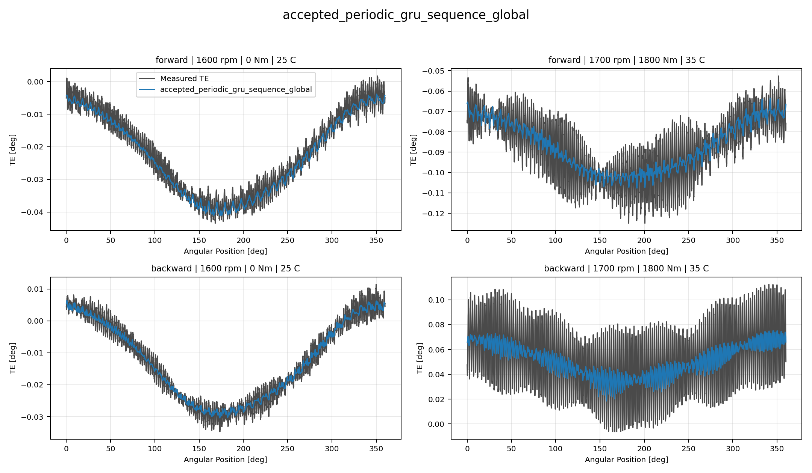
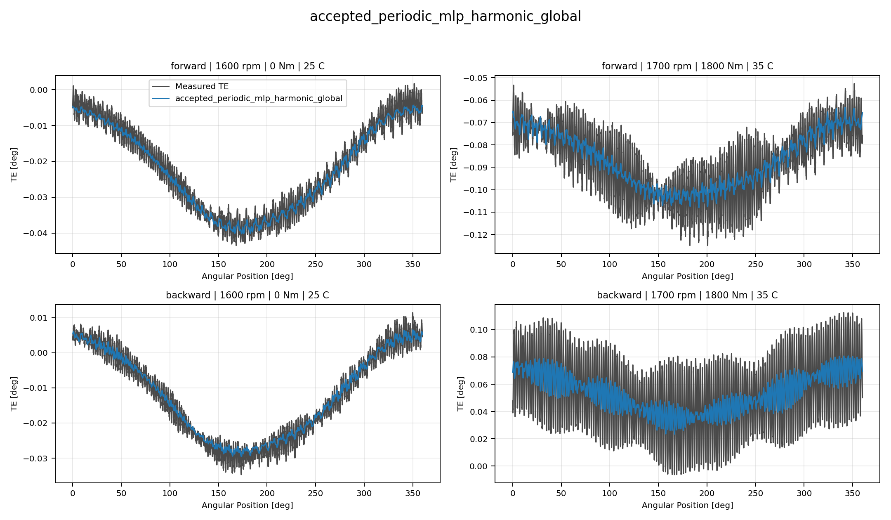
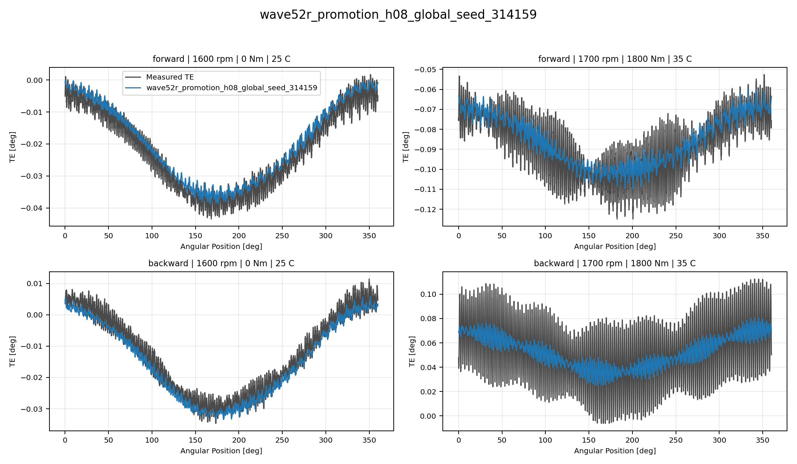
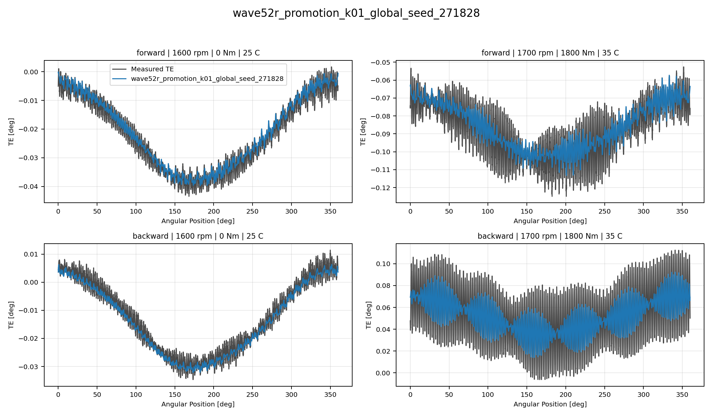

# TE Curve Verification Pipeline Best Model Collage Report

## Overview

This report compares representative `TE Curve Verification Pipeline` TE-curve predictions for
the current best reference, RCIM Model-Bank Reproduction, Wave 1 directional, and Wave 1
global models. Each model is shown as one four-image collage so local
oscillation tracking can be inspected directly.

## Scope

- each collage contains four deterministic held-out test curves;
- forward models are shown on forward curves only;
- backward models are shown on backward curves only;
- global Wave 1 models are shown on two forward and two backward curves;
- `Measured TE` uses the same line width as predictions and a dark-gray
  color for balanced visual comparison.

## Metrics Summary

### Global Accepted Non PINN Incumbent Models

| Candidate | Source | Surface | Curve MAE [deg] | Curve RMSE [deg] | Mean Error |
| --- | --- | --- | ---: | ---: | ---: |
| `accepted_periodic_gru_sequence_global` | `accepted_non_pinn_incumbent` | global | 0.001810 | 0.002141 | 3.567 |
| `accepted_periodic_mlp_harmonic_global` | `accepted_non_pinn_incumbent` | global | 0.001734 | 0.002054 | 3.385 |

### Global Wave52r Offline Leader Cross Surface Promotion Models

| Candidate | Source | Surface | Curve MAE [deg] | Curve RMSE [deg] | Mean Error |
| --- | --- | --- | ---: | ---: | ---: |
| `wave52r_promotion_h08_global_seed_314159` | `wave52r_offline_leader_cross_surface_promotion` | global | 0.001871 | 0.002204 | 3.731 |
| `wave52r_promotion_k01_global_seed_271828` | `wave52r_offline_leader_cross_surface_promotion` | global | 0.001464 | 0.001738 | 2.893 |

## Collage Gallery - Global Accepted Non PINN Incumbent Models

accepted_periodic_gru_sequence_global:

accepted_periodic_mlp_harmonic_global:

## Collage Gallery - Global Wave52r Offline Leader Cross Surface Promotion Models

wave52r_promotion_h08_global_seed_314159:

wave52r_promotion_k01_global_seed_271828:

## Output Artifacts

- output directory: `output\analysis\wave_5_2r\offline_leader_cross_surface_track2\visual_collages\global\2026-07-31-13-39-26__track2_best_model_collage_report`;
- summary YAML: `output\analysis\wave_5_2r\offline_leader_cross_surface_track2\visual_collages\global\2026-07-31-13-39-26__track2_best_model_collage_report\track2_best_model_collage_summary.yaml`;
- metrics CSV: `output\analysis\wave_5_2r\offline_leader_cross_surface_track2\visual_collages\global\2026-07-31-13-39-26__track2_best_model_collage_report\track2_best_model_collage_metrics.csv`;
- report Markdown: `doc\reports\analysis\model_development_waves\wave_5_2\offline_leader_global_promotion\visual_collages\global\[2026-07-31]\track2_best_model_collage_report.md`.
