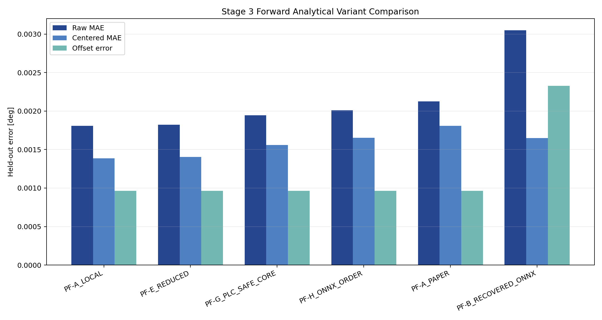
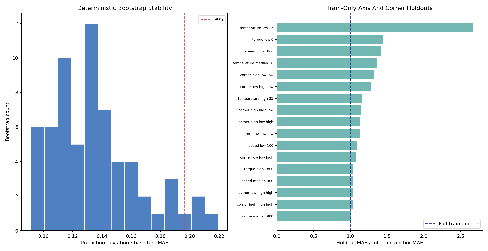
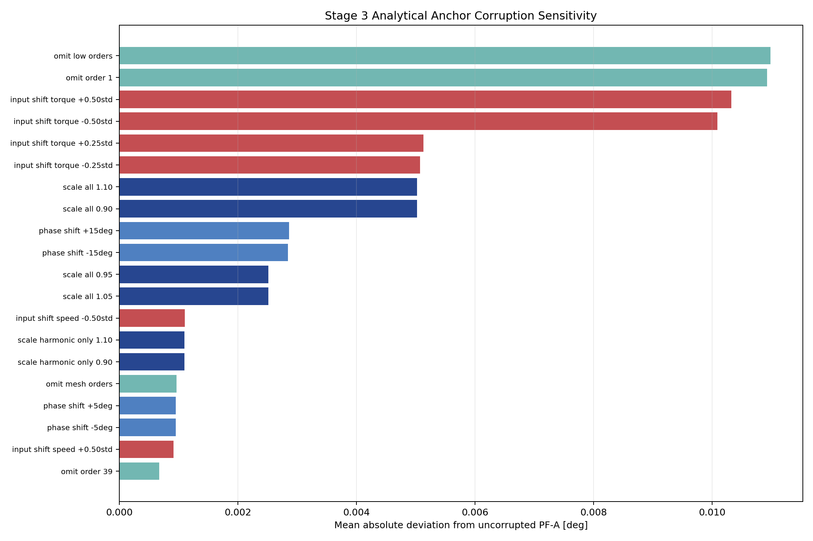

# Wave 5.2R Stage 3 Analytical Anchor Reproduction And Stress Tests

## Executive Decision

Wave 5.2R Stage 3 passes all twelve exit gates.

`PF_A_LOCAL_QUADRATIC` is qualified as the analytical anchor for the next
forward residual-learning stage, with one important boundary:

**PF-A is trusted as a bounded interpolation component only inside the
declared supported-core envelope.**

The independent refit reproduces the Phase 1 model exactly:

- split signature:
  `c1aa8718fb9bf88cc2021c121dc4f3b4010fc1d2e45ac90af5f4376aa64f8e16`;
- training curves used for fitting: `675`;
- validation curves used only for evaluation: `194`;
- test curves used only for evaluation: `97`;
- design condition number: `5.361553`;
- test raw MAE: `0.001807 deg`;
- test centered-shape MAE: `0.001385 deg`;
- test offset absolute error: `0.000965 deg`;
- maximum Phase 1 reproduction difference: `0.0`.

All `966` eligible forward conditions produce finite predictions. Sixty-four
deterministic bootstrap refits remain stable, with a condition-number P95 of
`5.612715`, a relative coefficient-change P95 of `0.029912`, and a
prediction-deviation-to-anchor-MAE P95 of `0.196634`.

The stress tests also expose limitations that must remain visible:

- withholding the lowest temperature level produces the worst axis holdout,
  with `0.004742 deg` MAE and a `2.67` error ratio relative to the full-fit
  anchor on the same population;
- omitting the low-order harmonic group is the most damaging corruption,
  creating `0.010982 deg` mean deviation from the anchor;
- validation and test each contain one condition outside at least one
  training-axis bound;
- reduced, PLC-safe, paper-order, and recovered ONNX formulations remain
  comparators only.

No neural network training was executed.

## Scope And Frozen Contract

Stage 3 is restricted to:

- dataset: `polished_dataset`;
- operating inputs: setpoint speed, setpoint torque, and temperature;
- direction: `Fw`;
- analytical family: Polynomial-Fourier coefficient surfaces;
- fit partition: frozen training split only;
- evaluation partitions: unchanged validation and test splits;
- angular response: full-resolution transmission-error curve.

The analysis does not:

- reopen the paper-faithful MMT branch;
- use measured target variables as inference inputs;
- tune an anchor on validation or test curves;
- train a neural residual;
- promote a PLC implementation;
- claim trustworthy extrapolation from numerical finiteness alone.

## Analytical Formulation

For each operating condition, the forward curve is projected into an explicit
offset and ordered sine/cosine coefficients:

**TE(theta) = offset + sum over k of
sin_coefficient_k times sin(k theta) +
cos_coefficient_k times cos(k theta).**

The canonical local-order set is:

`[1, 3, 39, 40, 78, 81, 156, 162, 240]`.

Each of the nineteen coefficient outputs consists of:

- one offset;
- nine sine coefficients;
- nine cosine coefficients.

Each coefficient is modeled as a complete-quadratic surface of the three
operating variables. The design includes:

- a constant term;
- three linear terms;
- three squared terms;
- three pairwise interaction terms.

The operating inputs are standardized using training-only statistics before
the quadratic basis is formed.

This structure is not a first-principles contact equation. It is an
interpretable grey-box analytical representation:

- Fourier orders encode repeatable angular structure;
- coefficient surfaces encode smooth operating-condition dependence;
- the future neural residual can model what this bounded analytical component
  does not explain.

## Reproduction Of Phase 1

The Stage 3 runner independently reloads the frozen curves, reconstructs the
training-only coefficient targets, and refits the complete-quadratic surface.

The following comparisons all have zero numerical difference at tolerance
`1e-12`:

| Reproduced quantity | Result |
| --- | --- |
| feature means | exact |
| feature scales | exact |
| coefficient matrix | exact |
| design condition number | exact |
| test raw MAE | exact |
| test RMSE | exact |
| test centered MAE | exact |
| test centered RMSE | exact |
| test offset absolute error | exact |
| test peak-to-peak absolute error | exact |
| test derivative MAE | exact |
| retained-amplitude MAE | exact |
| retained-phase MAE | exact |

This proves that the anchor used in Stage 3 is not an approximate recreation
or a differently preprocessed variant. It is the Phase 1 PF-A formulation
refitted from the frozen training evidence.

## Forward Variant Comparison

Six formulations were evaluated on the same `97` forward test conditions.

| Rank | Model | Orders | Test MAE [deg] | Role |
| ---: | --- | ---: | ---: | --- |
| 1 | PF-A local | 9 | 0.001807 | qualified anchor |
| 2 | PF-E reduced | 7 | 0.001823 | comparator only |
| 3 | PF-G PLC-safe | 4 | 0.001945 | comparator only |
| 4 | PF-H ONNX-order | 3 | 0.002011 | comparator only |
| 5 | PF-A paper-order | 20 | 0.002126 | comparator only |
| 6 | PF-B recovered ONNX | 3 | 0.003047 | comparator only |

The table uses compact display labels. The complete machine identifiers remain
in `stage3_forward_variant_comparison.csv`.

### Interpretation

The result rejects a simplistic rule that more harmonics must be better. The
twenty-order paper-derived set is worse than the nine-order local set on this
frozen forward surface.

The seven-order reduced form is close to PF-A in raw error, but closeness is
not enough to replace the anchor. Its order removal changes ripple and
harmonic content, and no deployment benefit has yet been demonstrated on the
complete multi-index gate.

The four-order PLC-safe core is useful as a low-complexity deployment
comparator. It is not promoted because the Stage 3 objective is anchor
qualification, not minimum-operation deployment selection.

The recovered ONNX path remains valuable as historical parity evidence but is
materially worse as the analytical anchor.

## Bootstrap Stability

The canonical surface was refitted sixty-four times using deterministic
training-only bootstrap samples with seed `314159`.

| Diagnostic | Median | P95 | Maximum |
| --- | ---: | ---: | ---: |
| design condition number | 5.391523 | 5.612715 | 5.705000 |
| relative coefficient delta | 0.013685 | 0.029912 | 0.036747 |
| prediction deviation / base MAE | 0.131243 | 0.196634 | below gate |

The design remains well conditioned across every bootstrap. Coefficients move
slightly as expected under resampling, but the induced prediction deviation is
small relative to the original test error.

This result supports use of PF-A as a repeatable analytical component. It does
not establish uncertainty calibration; Stage 11 addresses uncertainty and
physics-trust calibration explicitly.

## Train-Only Operating-Condition Holdouts

Seventeen refits were executed:

- low, median, and high torque levels;
- low, median, and high speed levels;
- low, median, and high temperature levels;
- eight geometric operating-space corner populations.

Every holdout fit excludes its evaluation population before estimating
feature statistics or coefficients.

### Most Informative Failures

| Holdout | Support type | Held-out MAE [deg] | Ratio to full anchor |
| --- | --- | ---: | ---: |
| temperature low, `25 C` | axis-edge extrapolation | 0.004742 | 2.670 |
| low-speed, high-torque, high-temperature corner | sparse corner | 0.004619 | about 1.0 |
| speed high, `1800 rpm` | axis-edge extrapolation | 0.003879 | about 1.4 |
| torque low, `0 Nm` | axis-edge extrapolation | 0.003860 | about 1.5 |
| temperature median, `30 C` | interpolation | 0.002517 | about 1.3 |

The lowest-temperature holdout is the dominant weakness. Temperature is not a
minor cosmetic input: removing its lower regime substantially degrades the
surface.

The median-temperature holdout raises the condition number to `10.347985`,
above the full-fit value but still finite. This indicates that the discrete
temperature support is structurally important to the quadratic basis.

The conclusion is not that PF-A is unstable. The conclusion is narrower:
PF-A is stable when fitted on the full frozen support, while extrapolating
across omitted operating regimes is materially less trustworthy.

## Anchor-Corruption Tests

Thirty-eight deterministic corruptions cover four families:

- coefficient scale;
- phase shift;
- order omission;
- operating-input shift.

### Most Sensitive Corruptions

| Corruption | Family | Mean deviation from PF-A [deg] |
| --- | --- | ---: |
| omit low-order group | order omission | 0.010982 |
| omit order 1 | order omission | 0.010928 |
| torque shift, `+0.50` training standard deviations | input shift | 0.010322 |
| torque shift, `-0.50` training standard deviations | input shift | 0.010090 |
| torque shift, `+0.25` training standard deviations | input shift | 0.005132 |
| torque shift, `-0.25` training standard deviations | input shift | 0.005074 |
| scale all coefficients by `1.10` | coefficient scale | 0.005024 |
| scale all coefficients by `0.90` | coefficient scale | 0.005024 |
| phase shift, `+15 deg` | phase | 0.002864 |
| phase shift, `-15 deg` | phase | 0.002843 |

### Physical And Modeling Meaning

The lowest orders carry the dominant slow angular structure. A residual model
must not be allowed to erase or arbitrarily rewrite this content without an
explicit diagnostic.

Torque-input corruption is nearly as damaging as low-order omission. This
supports two later requirements:

1. preserve input provenance and scaling exactly;
2. monitor analytical versus neural contribution by harmonic band.

Phase corruption is detectable but less damaging than low-order removal at
the tested magnitudes. This does not make phase unimportant. It means the
tested PF-A error surface is more sensitive to missing dominant content and
operating-input displacement than to a uniform modest phase rotation.

## Deployable Validity Envelope

The envelope is derived only from the `675` training conditions.

### Training Axis Bounds

| Input | Minimum | Mean | Maximum | Scale |
| --- | ---: | ---: | ---: | ---: |
| signed torque [Nm] | -1800.610 | -914.065 | 0.114 | 547.043 |
| absolute speed [rpm] | 100.000 | 934.519 | 1800.001 | 534.978 |
| temperature [C] | 24.259 | 30.850 | 37.642 | 4.006 |

The density threshold is the training-only P95 leave-one-out nearest distance
in standardized operating space:

`0.303207`.

### Tiers

| Tier | Definition | Runtime decision |
| --- | --- | --- |
| Core | inside all training bounds and within density threshold | PF-A may be used as qualified anchor |
| Sparse or corner | inside bounds but farther than density threshold | low-trust anchor; monitor or route conservatively |
| Extrapolation | outside one or more training bounds | fallback or explicit review |

The complete machine labels are `supported_core`,
`supported_sparse_or_corner`, and `unsupported_extrapolation`.

### Observed Population

| Split | Core | Sparse or corner | Extrapolation |
| --- | ---: | ---: | ---: |
| train | 675 | 0 | 0 |
| validation | 186 | 7 | 1 |
| test | 90 | 6 | 1 |

The twenty-seven-point minimum/mean/maximum envelope grid is numerically
finite. All `966` eligible forward predictions are also finite.

Numerical finiteness is necessary but not sufficient. The deployment rule is
therefore based on support classification, not only on a finite-number check.

## Exit-Gate Results

| Gate | Result |
| --- | --- |
| frozen split signature matches | pass |
| refit uses training partition only | pass |
| Phase 1 reproduction | pass |
| explicit offset and sine/cosine coefficients | pass |
| condition-number stability | pass |
| bootstrap coefficient stability | pass |
| bootstrap prediction stability | pass |
| required forward variant roster | pass |
| train-only axis and corner holdouts | pass |
| all corruption families | pass |
| deployable validity envelope | pass |
| finite predictions on every eligible forward condition | pass |

Result:

**12 / 12 gates pass.**

## What Stage 3 Proves

Stage 3 proves that:

- the repository can refit PF-A without hidden validation or test fitting;
- the refit is exactly reproducible against Phase 1;
- the quadratic operating-condition basis is numerically stable on the full
  training population;
- coefficient and prediction variation under bootstrap resampling is bounded;
- the local nine-order formulation is the strongest tested analytical anchor;
- the anchor remains finite over the complete eligible forward population;
- support-aware deployment tiers can be computed causally from training
  operating inputs;
- low-order content and torque input integrity are critical.

## What Stage 3 Does Not Prove

Stage 3 does not prove that:

- PF-A is the best final predictor;
- PF-A is physically exact;
- a residual neural network will improve it;
- every point inside axis bounds is equally trustworthy;
- numerical output outside the support envelope is reliable;
- the reduced or PLC-safe variants are deployment-ready;
- the future residual should modify every harmonic band;
- a physics-guided model beats a parameter-matched data-only model.

## Stage 4 Design Consequences

Stage 4 is the Data-Only Residual Capacity Ladder. It must use PF-A as a frozen,
bounded anchor and answer a deliberately non-physics question first:

**How much of the remaining error can an ordinary residual network learn
before any physics-guided loss is introduced?**

The Stage 4 campaign should therefore:

1. keep PF-A frozen in the primary residual arms;
2. expose analytical and residual contributions separately;
3. include zero-residual and direct-black-box controls;
4. test a small capacity ladder under matched budgets;
5. report residual energy and harmonic-band projection;
6. preserve the support tiers in evaluation;
7. fail closed on unsupported extrapolation;
8. avoid crediting capacity or normalization gains to physics.

Only after this data-only capacity floor is known can Stage 5 determine whether
complex harmonic coefficient supervision adds real value.

## Durable Artifacts

### Implementation

- Stage 3 analysis runner;
- Stage 3 independent validator.

### Machine Evidence

Under
`output/analysis/wave_5_2r/stage3_analytical_anchor_reproduction_and_stress_tests/`:

- refitted PF-A surface;
- explicit coefficient-surface table;
- Phase 1 reproduction comparison;
- six-variant comparison;
- bootstrap repeat and target diagnostics;
- holdout diagnostics;
- corruption diagnostics;
- per-condition validity-envelope assignments;
- validity-envelope summary;
- twelve-gate exit summary.

### Human Evidence

- three report plots;
- script usage note;
- project usage-guide entry;
- this Markdown report;
- validated PDF companion.

## Conclusion

PF-A has earned a precise role.

It is not a full physical solution, and it is not automatically safe outside
measured support. It is a stable, reproducible, inspectable analytical
component that captures the dominant forward harmonic structure and smooth
operating-condition dependence better than the tested analytical alternatives.

That makes it a sound anchor for residual learning. The lowest-temperature
holdout, low-order omission, and torque-input corruption results also show
exactly where the future hybrid must remain cautious.

Stage 4 is authorized to measure residual-network capacity on top of this
qualified anchor. No physics-guided advantage may be claimed until that
data-only residual baseline exists.
