# TE Curve Verification Pipeline Multi-Model Curve Comparison Report

## Overview

This report compares representative `TE Curve Verification Pipeline` TE curves by overlaying
multiple model predictions on the same original measured curve. The
plots are intended to show whether each model tracks the local harmonic
oscillations rather than only the broad mean trend.

## Scope

- each comparison image contains four deterministic held-out test curves;
- forward comparisons are shown on forward curves only;
- backward comparisons are shown on backward curves only;
- Wave 1 screening keeps the three strongest family-best models by
  `Curve MAE [deg]` within each direction;
- `Original Curve` uses the same visual weight as predictions and a
  dark-gray color for balanced comparison.

## Metrics Summary

### Forward Reference Model Overlay

| Candidate | Source | Surface | Curve MAE [deg] | Curve RMSE [deg] | Mean Error |
| --- | --- | --- | ---: | ---: | ---: |
| `paper_original_best_Fw` | `rcim_original` | Fw | 0.013058 | 0.013324 | 27.997 |
| `paper_retuned_best_Fw` | `rcim_retuned` | Fw | 0.029204 | 0.029350 | 62.562 |
| `rcim_model_bank_reproduction_best_fw` | `rcim_model_bank_reproduction` | Fw | 0.062756 | 0.062835 | 134.143 |

### Forward Wave 1 Family Model Overlay

| Candidate | Source | Surface | Curve MAE [deg] | Curve RMSE [deg] | Mean Error |
| --- | --- | --- | ---: | ---: | ---: |
| `feedforward_fw` | `wave1_current_registry` | Fw | 0.002130 | 0.002586 | 4.378 |
| `harmonic_regression_fw` | `wave1_current_registry` | Fw | 0.062598 | 0.062702 | 133.783 |
| `periodic_mlp_fw` | `wave1_current_registry` | Fw | 0.002118 | 0.002575 | 4.351 |
| `residual_harmonic_mlp_fw` | `wave1_current_registry` | Fw | 0.002093 | 0.002541 | 4.287 |
| `tree_fw` | `wave1_current_registry` | Fw | 0.002125 | 0.002612 | 4.355 |
| `periodic_mlp_harmonic_fw` | `wave1_periodic_mlp_harmonic_campaign` | Fw | 0.038372 | 0.039223 | 82.451 |

### Forward Wave 2.1 Temporal Model Overlay

| Candidate | Source | Surface | Curve MAE [deg] | Curve RMSE [deg] | Mean Error |
| --- | --- | --- | ---: | ---: | ---: |
| `temporal_convolution_fw` | `wave2_temporal_entry_registry` | Fw | 0.002210 | 0.002686 | 4.557 |
| `gru_sequence_fw` | `wave2_temporal_entry_registry` | Fw | 0.002102 | 0.002552 | 4.308 |
| `lstm_sequence_fw` | `wave2_temporal_entry_registry` | Fw | 0.002083 | 0.002538 | 4.261 |
| `periodic_temporal_convolution_fw` | `wave2_temporal_entry_registry` | Fw | 0.002004 | 0.002385 | 4.123 |
| `periodic_gru_sequence_fw` | `wave2_temporal_entry_registry` | Fw | 0.001195 | 0.001461 | 2.559 |
| `periodic_lstm_sequence_fw` | `wave2_temporal_entry_registry` | Fw | 0.001730 | 0.002084 | 3.517 |

### Forward Wave 2.3 Residual Harmonic Temporal Overlay

| Candidate | Source | Surface | Curve MAE [deg] | Curve RMSE [deg] | Mean Error |
| --- | --- | --- | ---: | ---: | ---: |
| `residual_harmonic_gru_sequence_sparse_rcim_Fw` | `wave2c_residual_harmonic_temporal_registry` | Fw | 0.045021 | 0.045184 | 96.691 |
| `residual_harmonic_gru_sequence_dense240_Fw` | `wave2c_residual_harmonic_temporal_registry` | Fw | 0.037261 | 0.038590 | 80.109 |
| `residual_harmonic_gru_sequence_dense360_Fw` | `wave2c_residual_harmonic_temporal_registry` | Fw | 0.038030 | 0.039604 | 81.958 |
| `residual_harmonic_lstm_sequence_sparse_rcim_Fw` | `wave2c_residual_harmonic_temporal_registry` | Fw | 0.042694 | 0.042917 | 91.847 |
| `residual_harmonic_lstm_sequence_dense240_Fw` | `wave2c_residual_harmonic_temporal_registry` | Fw | 0.034610 | 0.035965 | 74.503 |
| `residual_harmonic_lstm_sequence_dense360_Fw` | `wave2c_residual_harmonic_temporal_registry` | Fw | 0.033574 | 0.035202 | 72.338 |

### Forward Wave 3.1 Offset-Aware Probe Overlay

| Candidate | Source | Surface | Curve MAE [deg] | Curve RMSE [deg] | Mean Error |
| --- | --- | --- | ---: | ---: | ---: |
| `wave3_1_sequential_residual_offset_probe_fw` | `wave3_1_offset_aware_probe_registry` | Fw | 0.036294 | 0.036467 | 77.932 |

### Forward Wave 3.2 Harmonic-Offset Probe Overlay

| Candidate | Source | Surface | Curve MAE [deg] | Curve RMSE [deg] | Mean Error |
| --- | --- | --- | ---: | ---: | ---: |
| `wave3_2_clean_sequential_residual_offset_fw` | `wave3_2_harmonic_offset_probe_registry` | Fw | 0.045185 | 0.045455 | 97.083 |
| `wave3_2_harmonic_residual_offset_fw` | `wave3_2_harmonic_offset_probe_registry` | Fw | 0.059869 | 0.059969 | 127.873 |

### Forward Wave 3.3 Curve-Aware Training Overlay

| Candidate | Source | Surface | Curve MAE [deg] | Curve RMSE [deg] | Mean Error |
| --- | --- | --- | ---: | ---: | ---: |
| `wave3_3_curve_aware_pointwise_control_fw` | `wave3_3_curve_aware_training_registry` | Fw | 0.044577 | 0.044713 | 95.253 |
| `wave3_3_raw_centered_shape_curve_aware_fw` | `wave3_3_curve_aware_training_registry` | Fw | 0.037030 | 0.037237 | 79.717 |
| `wave3_3_raw_offset_curve_aware_fw` | `wave3_3_curve_aware_training_registry` | Fw | 0.058349 | 0.058552 | 124.991 |
| `wave3_3_full_curve_composite_fw` | `wave3_3_curve_aware_training_registry` | Fw | 0.050091 | 0.050255 | 107.778 |

### Forward Wave 4.1 Robust-Loss Overlay

| Candidate | Source | Surface | Curve MAE [deg] | Curve RMSE [deg] | Mean Error |
| --- | --- | --- | ---: | ---: | ---: |
| `wave4_1_mae_robust_loss_fw` | `wave4_1_robust_loss_registry` | Fw | 0.049061 | 0.049181 | 105.141 |
| `wave4_1_smooth_l1_robust_loss_fw` | `wave4_1_robust_loss_registry` | Fw | 0.058171 | 0.058283 | 124.441 |
| `wave4_1_log_cosh_robust_loss_fw` | `wave4_1_robust_loss_registry` | Fw | 0.054964 | 0.055089 | 117.915 |

### Forward Wave 4.2 Quantile Probabilistic Overlay

| Candidate | Source | Surface | Curve MAE [deg] | Curve RMSE [deg] | Mean Error |
| --- | --- | --- | ---: | ---: | ---: |
| `wave4_2_quantile_p10_p50_p90_fw` | `wave4_2_probabilistic_registry` | Fw | 0.050281 | 0.050425 | 107.720 |
| `wave4_2_gaussian_nll_fw` | `wave4_2_probabilistic_registry` | Fw | 0.054985 | 0.055109 | 117.675 |

### Forward Wave 4.3 Mixture Density Overlay

| Candidate | Source | Surface | Curve MAE [deg] | Curve RMSE [deg] | Mean Error |
| --- | --- | --- | ---: | ---: | ---: |
| `wave4_3_mixture_density_k2_fw` | `wave4_3_mixture_density_registry` | Fw | 0.047438 | 0.047677 | 102.227 |
| `wave4_3_mixture_density_k3_fw` | `wave4_3_mixture_density_registry` | Fw | 0.057840 | 0.057965 | 124.009 |

### Forward Wave 4.4 Latent State Hysteresis Overlay

| Candidate | Source | Surface | Curve MAE [deg] | Curve RMSE [deg] | Mean Error |
| --- | --- | --- | ---: | ---: | ---: |
| `wave4_4_gru_latent_offset_residual_fw` | `wave4_4_latent_state_hysteresis_registry` | Fw | 0.024419 | 0.025009 | 52.319 |
| `wave4_4_causal_tcn_latent_offset_residual_fw` | `wave4_4_latent_state_hysteresis_registry` | Fw | 0.028476 | 0.028960 | 61.107 |

### Forward Wave 3 Harmonic Prior Residual Registry Overlay

| Candidate | Source | Surface | Curve MAE [deg] | Curve RMSE [deg] | Mean Error |
| --- | --- | --- | ---: | ---: | ---: |
| `wave5_1_harmonic_prior_pointwise_control_fw` | `wave5_1_harmonic_prior_residual_registry` | Fw | 0.046994 | 0.047257 | 100.353 |
| `wave5_1_harmonic_prior_smooth_l1_structured_fw` | `wave5_1_harmonic_prior_residual_registry` | Fw | 0.047938 | 0.048105 | 102.360 |

### Forward Wave52b Offset Harmonic Guided Registry Overlay

| Candidate | Source | Surface | Curve MAE [deg] | Curve RMSE [deg] | Mean Error |
| --- | --- | --- | ---: | ---: | ---: |
| `wave52b_offset_centered_shape_harmonic_Fw` | `wave52b_offset_harmonic_guided_registry` | Fw | 0.001695 | 0.002045 | 3.391 |

### Forward Polished Model Development Registry Overlay

| Candidate | Source | Surface | Curve MAE [deg] | Curve RMSE [deg] | Mean Error |
| --- | --- | --- | ---: | ---: | ---: |
| `polished_feedforward_Fw` | `polished_model_development_registry` | Fw | 0.002130 | 0.002586 | 4.378 |
| `polished_harmonic_regression_Fw` | `polished_model_development_registry` | Fw | 0.062598 | 0.062702 | 133.783 |
| `polished_periodic_mlp_Fw` | `polished_model_development_registry` | Fw | 0.002118 | 0.002575 | 4.351 |
| `polished_residual_harmonic_mlp_Fw` | `polished_model_development_registry` | Fw | 0.002093 | 0.002541 | 4.287 |
| `polished_tree_Fw` | `polished_model_development_registry` | Fw | 0.002125 | 0.002612 | 4.355 |
| `polished_periodic_mlp_harmonic_Fw` | `polished_model_development_registry` | Fw | 0.001735 | 0.002062 | 3.511 |
| `polished_temporal_convolution_Fw` | `polished_model_development_registry` | Fw | 0.002210 | 0.002686 | 4.557 |
| `polished_gru_sequence_Fw` | `polished_model_development_registry` | Fw | 0.002102 | 0.002552 | 4.308 |
| `polished_lstm_sequence_Fw` | `polished_model_development_registry` | Fw | 0.002083 | 0.002538 | 4.261 |
| `polished_periodic_temporal_convolution_Fw` | `polished_model_development_registry` | Fw | 0.002004 | 0.002385 | 4.123 |
| `polished_periodic_gru_sequence_Fw` | `polished_model_development_registry` | Fw | 0.001195 | 0.001461 | 2.559 |
| `polished_periodic_lstm_sequence_Fw` | `polished_model_development_registry` | Fw | 0.001730 | 0.002084 | 3.517 |
| `polished_residual_harmonic_gru_sequence_sparse_rcim_Fw` | `polished_model_development_registry` | Fw | 0.001832 | 0.002216 | 3.700 |
| `polished_residual_harmonic_gru_sequence_dense240_Fw` | `polished_model_development_registry` | Fw | 0.003186 | 0.004142 | 6.811 |
| `polished_residual_harmonic_gru_sequence_dense360_Fw` | `polished_model_development_registry` | Fw | 0.004563 | 0.007628 | 9.896 |
| `polished_residual_harmonic_lstm_sequence_sparse_rcim_Fw` | `polished_model_development_registry` | Fw | 0.001892 | 0.002286 | 3.839 |
| `polished_residual_harmonic_lstm_sequence_dense240_Fw` | `polished_model_development_registry` | Fw | 0.003240 | 0.004196 | 6.948 |
| `polished_residual_harmonic_lstm_sequence_dense360_Fw` | `polished_model_development_registry` | Fw | 0.004652 | 0.007237 | 10.094 |
| `polished_wave3_1_sequential_residual_offset_probe_Fw` | `polished_model_development_registry` | Fw | 0.002071 | 0.002524 | 4.236 |
| `polished_wave3_2_clean_sequential_residual_offset_Fw` | `polished_model_development_registry` | Fw | 0.002052 | 0.002494 | 4.192 |
| `polished_wave3_2_harmonic_residual_offset_Fw` | `polished_model_development_registry` | Fw | 0.001756 | 0.002127 | 3.526 |
| `polished_wave3_3_curve_aware_pointwise_control_Fw` | `polished_model_development_registry` | Fw | 0.001701 | 0.002055 | 3.407 |
| `polished_wave3_3_raw_centered_shape_curve_aware_Fw` | `polished_model_development_registry` | Fw | 0.001716 | 0.002078 | 3.450 |
| `polished_wave3_3_raw_offset_curve_aware_Fw` | `polished_model_development_registry` | Fw | 0.001734 | 0.002099 | 3.495 |
| `polished_wave3_3_full_curve_composite_Fw` | `polished_model_development_registry` | Fw | 0.001786 | 0.002167 | 3.606 |
| `polished_wave4_1_mae_robust_loss_Fw` | `polished_model_development_registry` | Fw | 0.001775 | 0.002132 | 3.569 |
| `polished_wave4_1_smooth_l1_robust_loss_Fw` | `polished_model_development_registry` | Fw | 0.001799 | 0.002176 | 3.645 |
| `polished_wave4_1_log_cosh_robust_loss_Fw` | `polished_model_development_registry` | Fw | 0.001764 | 0.002125 | 3.566 |
| `polished_wave4_2_quantile_p10_p50_p90_Fw` | `polished_model_development_registry` | Fw | 0.001727 | 0.002081 | 3.466 |
| `polished_wave4_2_gaussian_nll_Fw` | `polished_model_development_registry` | Fw | 0.001711 | 0.002056 | 3.424 |
| `polished_wave4_3_mixture_density_k2_Fw` | `polished_model_development_registry` | Fw | 0.001545 | 0.001890 | 3.202 |
| `polished_wave4_3_mixture_density_k3_Fw` | `polished_model_development_registry` | Fw | 0.001528 | 0.001867 | 3.161 |
| `polished_wave4_4_gru_latent_offset_residual_Fw` | `polished_model_development_registry` | Fw | 0.002135 | 0.002611 | 4.373 |
| `polished_wave4_4_causal_tcn_latent_offset_residual_Fw` | `polished_model_development_registry` | Fw | 0.002149 | 0.002620 | 4.408 |
| `polished_wave5_1_harmonic_prior_pointwise_control_Fw` | `polished_model_development_registry` | Fw | 0.001881 | 0.002253 | 3.835 |
| `polished_wave5_1_harmonic_prior_smooth_l1_structured_Fw` | `polished_model_development_registry` | Fw | 0.001795 | 0.002160 | 3.630 |

### Forward RCIM Model-Bank Reproduction And Screened Wave 1 Overlay

| Candidate | Source | Surface | Curve MAE [deg] | Curve RMSE [deg] | Mean Error |
| --- | --- | --- | ---: | ---: | ---: |
| `rcim_model_bank_reproduction_best_fw` | `rcim_model_bank_reproduction` | Fw | 0.062756 | 0.062835 | 134.143 |
| `residual_harmonic_mlp_fw` | `wave1_current_registry` | Fw | 0.002093 | 0.002541 | 4.287 |
| `periodic_mlp_fw` | `wave1_current_registry` | Fw | 0.002118 | 0.002575 | 4.351 |
| `tree_fw` | `wave1_current_registry` | Fw | 0.002125 | 0.002612 | 4.355 |

### Forward Reference Tree And Wave 2.1 Overlay

| Candidate | Source | Surface | Curve MAE [deg] | Curve RMSE [deg] | Mean Error |
| --- | --- | --- | ---: | ---: | ---: |
| `paper_retuned_best_Fw` | `rcim_retuned` | Fw | 0.029204 | 0.029350 | 62.562 |
| `rcim_model_bank_reproduction_best_fw` | `rcim_model_bank_reproduction` | Fw | 0.062756 | 0.062835 | 134.143 |
| `tree_fw` | `wave1_current_registry` | Fw | 0.002125 | 0.002612 | 4.355 |
| `temporal_convolution_fw` | `wave2_temporal_entry_registry` | Fw | 0.002210 | 0.002686 | 4.557 |
| `gru_sequence_fw` | `wave2_temporal_entry_registry` | Fw | 0.002102 | 0.002552 | 4.308 |
| `lstm_sequence_fw` | `wave2_temporal_entry_registry` | Fw | 0.002083 | 0.002538 | 4.261 |
| `periodic_temporal_convolution_fw` | `wave2_temporal_entry_registry` | Fw | 0.002004 | 0.002385 | 4.123 |
| `periodic_gru_sequence_fw` | `wave2_temporal_entry_registry` | Fw | 0.001195 | 0.001461 | 2.559 |
| `periodic_lstm_sequence_fw` | `wave2_temporal_entry_registry` | Fw | 0.001730 | 0.002084 | 3.517 |

### Forward Reference Tree And Wave 2.3 Overlay

| Candidate | Source | Surface | Curve MAE [deg] | Curve RMSE [deg] | Mean Error |
| --- | --- | --- | ---: | ---: | ---: |
| `paper_retuned_best_Fw` | `rcim_retuned` | Fw | 0.029204 | 0.029350 | 62.562 |
| `rcim_model_bank_reproduction_best_fw` | `rcim_model_bank_reproduction` | Fw | 0.062756 | 0.062835 | 134.143 |
| `tree_fw` | `wave1_current_registry` | Fw | 0.002125 | 0.002612 | 4.355 |
| `residual_harmonic_gru_sequence_sparse_rcim_Fw` | `wave2c_residual_harmonic_temporal_registry` | Fw | 0.045021 | 0.045184 | 96.691 |
| `residual_harmonic_gru_sequence_dense240_Fw` | `wave2c_residual_harmonic_temporal_registry` | Fw | 0.037261 | 0.038590 | 80.109 |
| `residual_harmonic_gru_sequence_dense360_Fw` | `wave2c_residual_harmonic_temporal_registry` | Fw | 0.038030 | 0.039604 | 81.958 |
| `residual_harmonic_lstm_sequence_sparse_rcim_Fw` | `wave2c_residual_harmonic_temporal_registry` | Fw | 0.042694 | 0.042917 | 91.847 |
| `residual_harmonic_lstm_sequence_dense240_Fw` | `wave2c_residual_harmonic_temporal_registry` | Fw | 0.034610 | 0.035965 | 74.503 |
| `residual_harmonic_lstm_sequence_dense360_Fw` | `wave2c_residual_harmonic_temporal_registry` | Fw | 0.033574 | 0.035202 | 72.338 |

### Forward Reference Tree And Wave 3.1 Overlay

| Candidate | Source | Surface | Curve MAE [deg] | Curve RMSE [deg] | Mean Error |
| --- | --- | --- | ---: | ---: | ---: |
| `paper_retuned_best_Fw` | `rcim_retuned` | Fw | 0.029204 | 0.029350 | 62.562 |
| `rcim_model_bank_reproduction_best_fw` | `rcim_model_bank_reproduction` | Fw | 0.062756 | 0.062835 | 134.143 |
| `tree_fw` | `wave1_current_registry` | Fw | 0.002125 | 0.002612 | 4.355 |
| `wave3_1_sequential_residual_offset_probe_fw` | `wave3_1_offset_aware_probe_registry` | Fw | 0.036294 | 0.036467 | 77.932 |

### Forward Reference Tree And Wave 3.3 Overlay

| Candidate | Source | Surface | Curve MAE [deg] | Curve RMSE [deg] | Mean Error |
| --- | --- | --- | ---: | ---: | ---: |
| `paper_retuned_best_Fw` | `rcim_retuned` | Fw | 0.029204 | 0.029350 | 62.562 |
| `rcim_model_bank_reproduction_best_fw` | `rcim_model_bank_reproduction` | Fw | 0.062756 | 0.062835 | 134.143 |
| `tree_fw` | `wave1_current_registry` | Fw | 0.002125 | 0.002612 | 4.355 |
| `wave3_3_curve_aware_pointwise_control_fw` | `wave3_3_curve_aware_training_registry` | Fw | 0.044577 | 0.044713 | 95.253 |
| `wave3_3_raw_centered_shape_curve_aware_fw` | `wave3_3_curve_aware_training_registry` | Fw | 0.037030 | 0.037237 | 79.717 |
| `wave3_3_raw_offset_curve_aware_fw` | `wave3_3_curve_aware_training_registry` | Fw | 0.058349 | 0.058552 | 124.991 |
| `wave3_3_full_curve_composite_fw` | `wave3_3_curve_aware_training_registry` | Fw | 0.050091 | 0.050255 | 107.778 |

### Forward Reference Tree And Wave 4 series Overlay

| Candidate | Source | Surface | Curve MAE [deg] | Curve RMSE [deg] | Mean Error |
| --- | --- | --- | ---: | ---: | ---: |
| `paper_retuned_best_Fw` | `rcim_retuned` | Fw | 0.029204 | 0.029350 | 62.562 |
| `rcim_model_bank_reproduction_best_fw` | `rcim_model_bank_reproduction` | Fw | 0.062756 | 0.062835 | 134.143 |
| `tree_fw` | `wave1_current_registry` | Fw | 0.002125 | 0.002612 | 4.355 |
| `wave4_1_mae_robust_loss_fw` | `wave4_1_robust_loss_registry` | Fw | 0.049061 | 0.049181 | 105.141 |
| `wave4_1_smooth_l1_robust_loss_fw` | `wave4_1_robust_loss_registry` | Fw | 0.058171 | 0.058283 | 124.441 |
| `wave4_1_log_cosh_robust_loss_fw` | `wave4_1_robust_loss_registry` | Fw | 0.054964 | 0.055089 | 117.915 |

## Comparison Gallery - Forward Reference Model Overlay

Included models: `paper_original_best_Fw`, `paper_retuned_best_Fw`, `rcim_model_bank_reproduction_best_fw`.

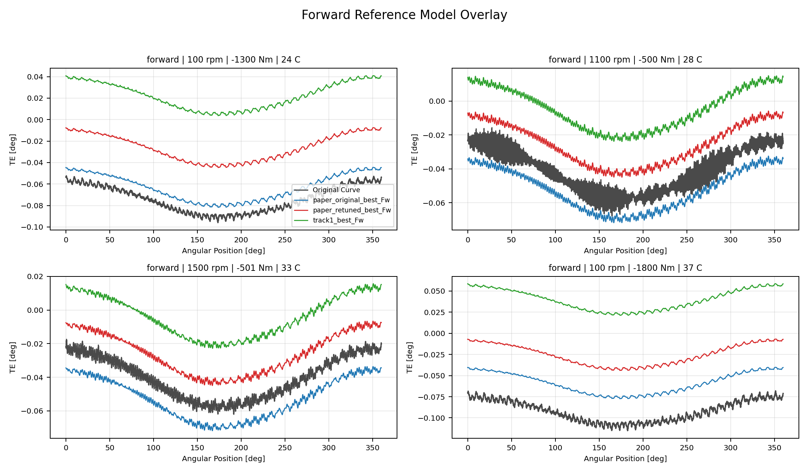

## Comparison Gallery - Forward Wave 1 Family Model Overlay

Included models: `feedforward_fw`, `harmonic_regression_fw`, `periodic_mlp_fw`, `residual_harmonic_mlp_fw`, `tree_fw`, `periodic_mlp_harmonic_fw`.

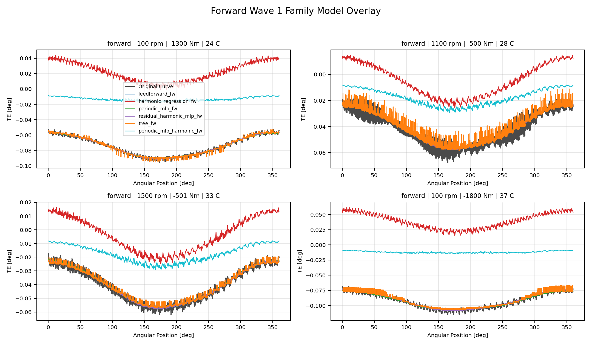

## Comparison Gallery - Forward Wave 2.1 Temporal Model Overlay

Included models: `temporal_convolution_fw`, `gru_sequence_fw`, `lstm_sequence_fw`, `periodic_temporal_convolution_fw`, `periodic_gru_sequence_fw`, `periodic_lstm_sequence_fw`.

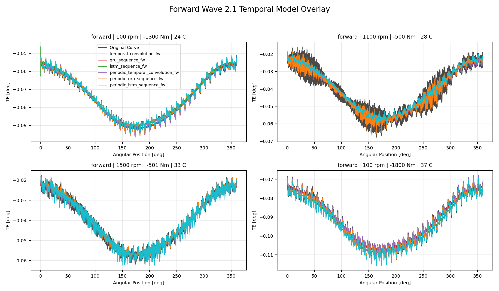

## Comparison Gallery - Forward Wave 2.3 Residual Harmonic Temporal Overlay

Included models: `residual_harmonic_gru_sequence_sparse_rcim_Fw`, `residual_harmonic_gru_sequence_dense240_Fw`, `residual_harmonic_gru_sequence_dense360_Fw`, `residual_harmonic_lstm_sequence_sparse_rcim_Fw`, `residual_harmonic_lstm_sequence_dense240_Fw`, `residual_harmonic_lstm_sequence_dense360_Fw`.

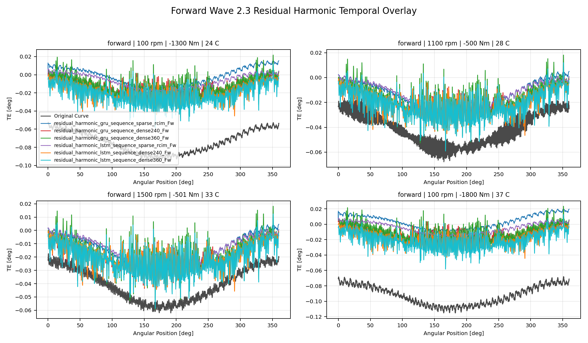

## Comparison Gallery - Forward Wave 3.1 Offset-Aware Probe Overlay

Included models: `wave3_1_sequential_residual_offset_probe_fw`.

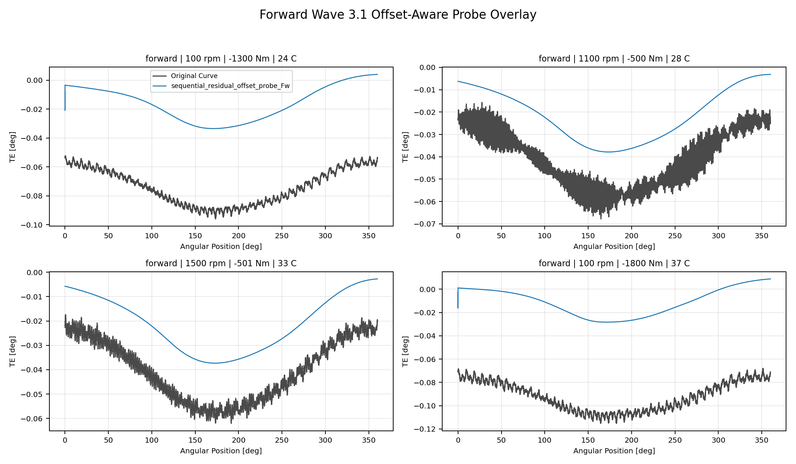

## Comparison Gallery - Forward Wave 3.2 Harmonic-Offset Probe Overlay

Included models: `wave3_2_clean_sequential_residual_offset_fw`, `wave3_2_harmonic_residual_offset_fw`.

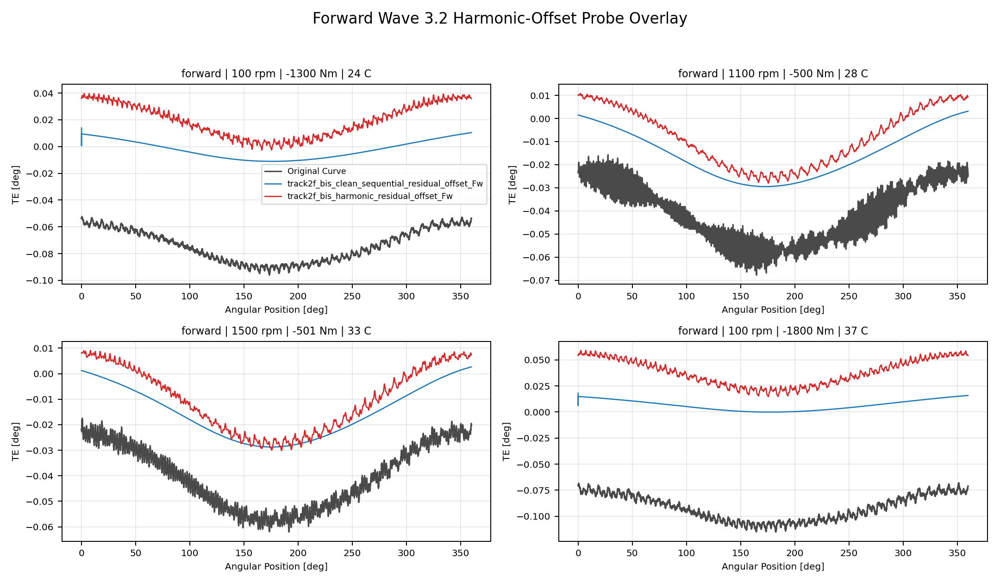

## Comparison Gallery - Forward Wave 3.3 Curve-Aware Training Overlay

Included models: `wave3_3_curve_aware_pointwise_control_fw`, `wave3_3_raw_centered_shape_curve_aware_fw`, `wave3_3_raw_offset_curve_aware_fw`, `wave3_3_full_curve_composite_fw`.

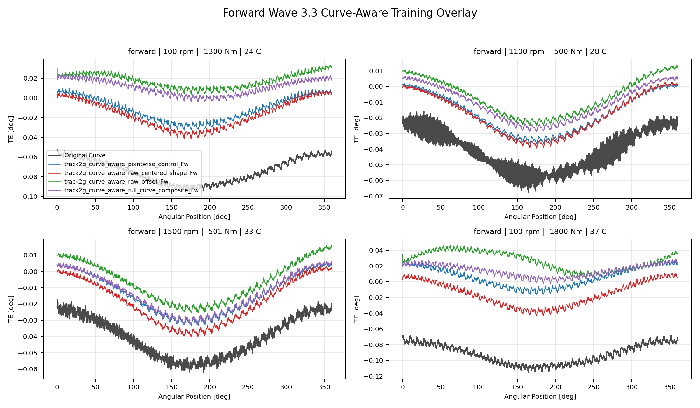

## Comparison Gallery - Forward Wave 4.1 Robust-Loss Overlay

Included models: `wave4_1_mae_robust_loss_fw`, `wave4_1_smooth_l1_robust_loss_fw`, `wave4_1_log_cosh_robust_loss_fw`.

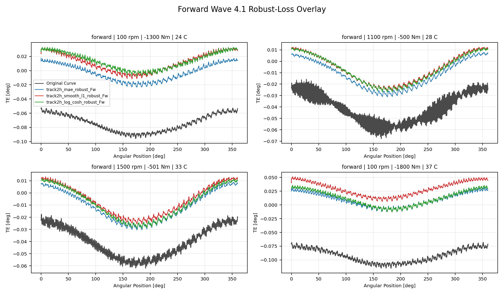

## Comparison Gallery - Forward Wave 4.2 Quantile Probabilistic Overlay

Included models: `wave4_2_quantile_p10_p50_p90_fw`, `wave4_2_gaussian_nll_fw`.

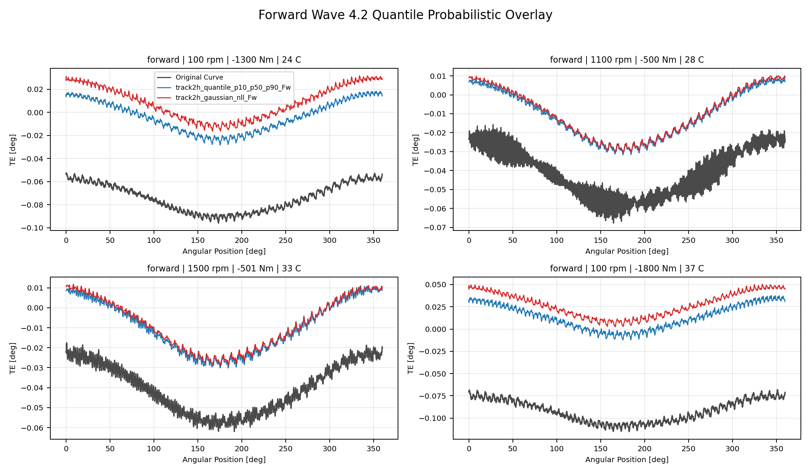

## Comparison Gallery - Forward Wave 4.3 Mixture Density Overlay

Included models: `wave4_3_mixture_density_k2_fw`, `wave4_3_mixture_density_k3_fw`.

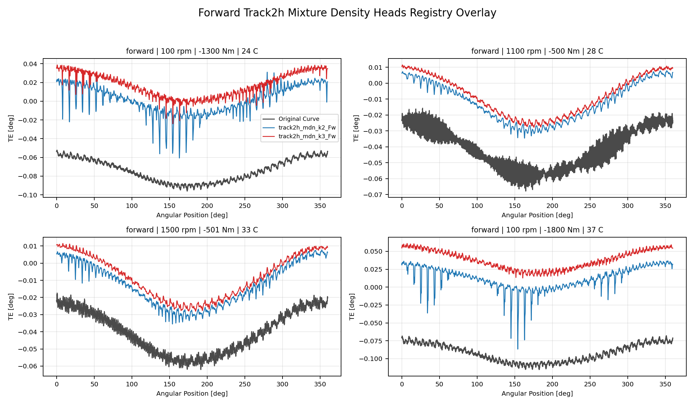

## Comparison Gallery - Forward Wave 4.4 Latent State Hysteresis Overlay

Included models: `wave4_4_gru_latent_offset_residual_fw`, `wave4_4_causal_tcn_latent_offset_residual_fw`.

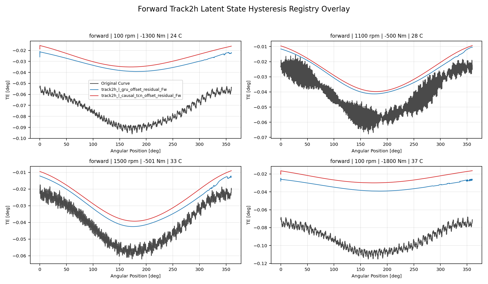

## Comparison Gallery - Forward Wave 3 Harmonic Prior Residual Registry Overlay

Included models: `wave5_1_harmonic_prior_pointwise_control_fw`, `wave5_1_harmonic_prior_smooth_l1_structured_fw`.

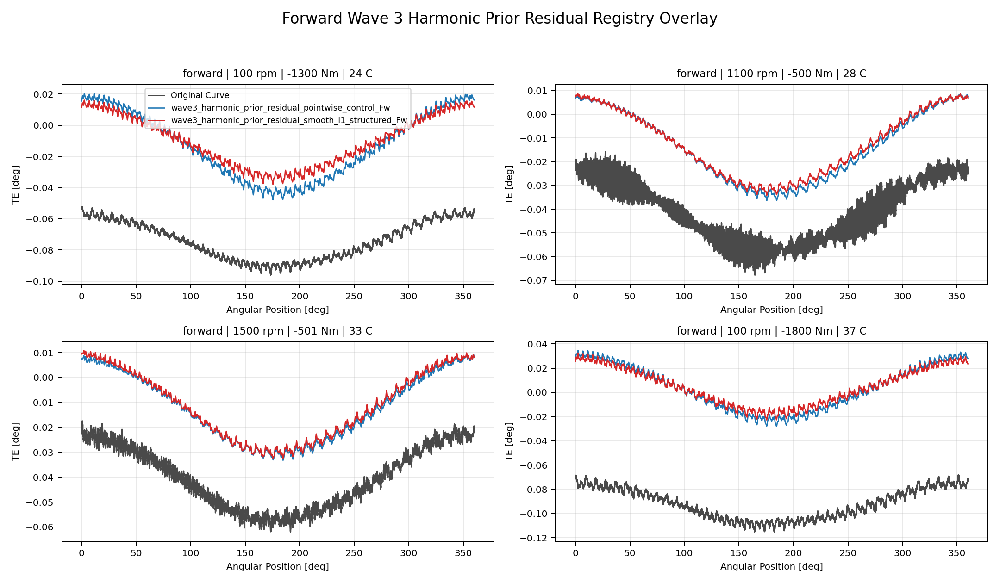

## Comparison Gallery - Forward Wave52b Offset Harmonic Guided Registry Overlay

Included models: `wave52b_offset_centered_shape_harmonic_Fw`.

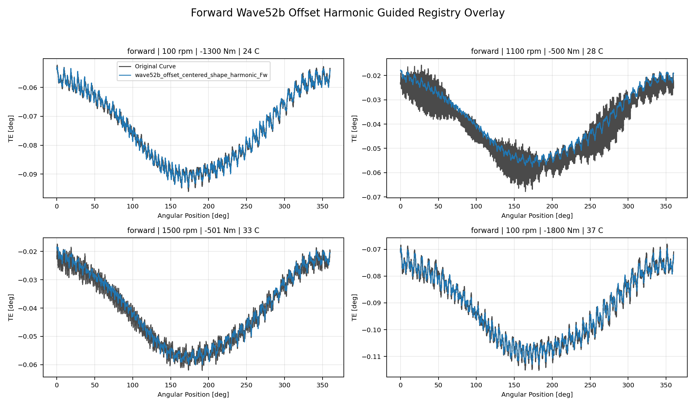

## Comparison Gallery - Forward Polished Model Development Registry Overlay

Included models: `polished_feedforward_Fw`, `polished_harmonic_regression_Fw`, `polished_periodic_mlp_Fw`, `polished_residual_harmonic_mlp_Fw`, `polished_tree_Fw`, `polished_periodic_mlp_harmonic_Fw`, `polished_temporal_convolution_Fw`, `polished_gru_sequence_Fw`, `polished_lstm_sequence_Fw`, `polished_periodic_temporal_convolution_Fw`, `polished_periodic_gru_sequence_Fw`, `polished_periodic_lstm_sequence_Fw`, `polished_residual_harmonic_gru_sequence_sparse_rcim_Fw`, `polished_residual_harmonic_gru_sequence_dense240_Fw`, `polished_residual_harmonic_gru_sequence_dense360_Fw`, `polished_residual_harmonic_lstm_sequence_sparse_rcim_Fw`, `polished_residual_harmonic_lstm_sequence_dense240_Fw`, `polished_residual_harmonic_lstm_sequence_dense360_Fw`, `polished_wave3_1_sequential_residual_offset_probe_Fw`, `polished_wave3_2_clean_sequential_residual_offset_Fw`, `polished_wave3_2_harmonic_residual_offset_Fw`, `polished_wave3_3_curve_aware_pointwise_control_Fw`, `polished_wave3_3_raw_centered_shape_curve_aware_Fw`, `polished_wave3_3_raw_offset_curve_aware_Fw`, `polished_wave3_3_full_curve_composite_Fw`, `polished_wave4_1_mae_robust_loss_Fw`, `polished_wave4_1_smooth_l1_robust_loss_Fw`, `polished_wave4_1_log_cosh_robust_loss_Fw`, `polished_wave4_2_quantile_p10_p50_p90_Fw`, `polished_wave4_2_gaussian_nll_Fw`, `polished_wave4_3_mixture_density_k2_Fw`, `polished_wave4_3_mixture_density_k3_Fw`, `polished_wave4_4_gru_latent_offset_residual_Fw`, `polished_wave4_4_causal_tcn_latent_offset_residual_Fw`, `polished_wave5_1_harmonic_prior_pointwise_control_Fw`, `polished_wave5_1_harmonic_prior_smooth_l1_structured_Fw`.

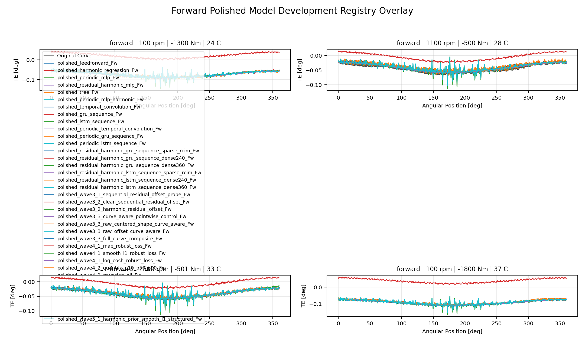

## Comparison Gallery - Forward RCIM Model-Bank Reproduction And Screened Wave 1 Overlay

Included models: `rcim_model_bank_reproduction_best_fw`, `residual_harmonic_mlp_fw`, `periodic_mlp_fw`, `tree_fw`.

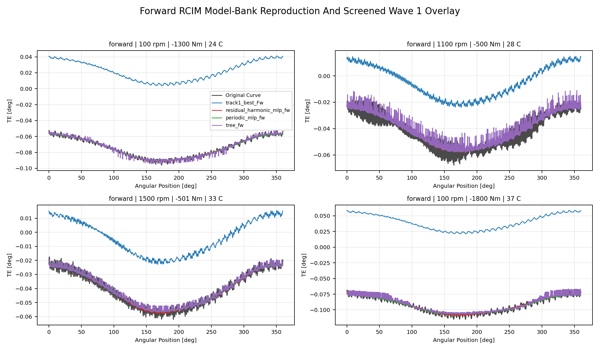

## Comparison Gallery - Forward Reference Tree And Wave 2.1 Overlay

Included models: `paper_retuned_best_Fw`, `rcim_model_bank_reproduction_best_fw`, `tree_fw`, `temporal_convolution_fw`, `gru_sequence_fw`, `lstm_sequence_fw`, `periodic_temporal_convolution_fw`, `periodic_gru_sequence_fw`, `periodic_lstm_sequence_fw`.

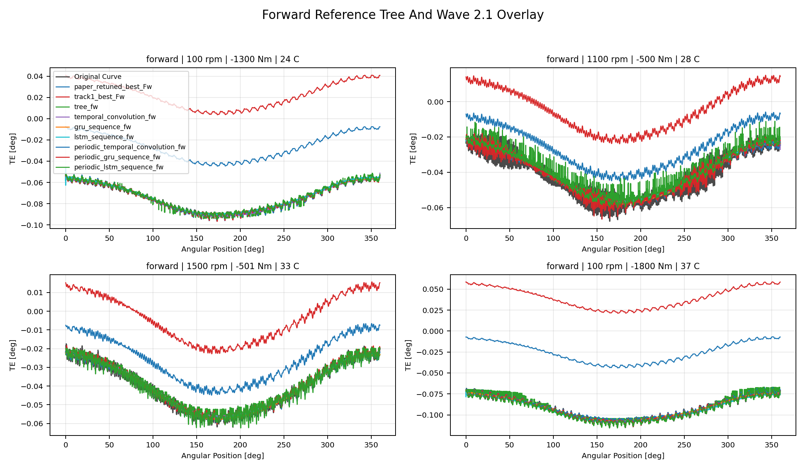

## Comparison Gallery - Forward Reference Tree And Wave 2.3 Overlay

Included models: `paper_retuned_best_Fw`, `rcim_model_bank_reproduction_best_fw`, `tree_fw`, `residual_harmonic_gru_sequence_sparse_rcim_Fw`, `residual_harmonic_gru_sequence_dense240_Fw`, `residual_harmonic_gru_sequence_dense360_Fw`, `residual_harmonic_lstm_sequence_sparse_rcim_Fw`, `residual_harmonic_lstm_sequence_dense240_Fw`, `residual_harmonic_lstm_sequence_dense360_Fw`.

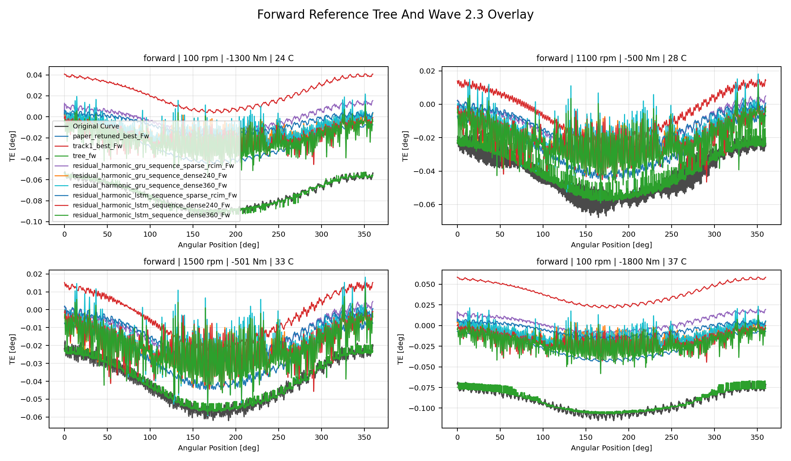

## Comparison Gallery - Forward Reference Tree And Wave 3.1 Overlay

Included models: `paper_retuned_best_Fw`, `rcim_model_bank_reproduction_best_fw`, `tree_fw`, `wave3_1_sequential_residual_offset_probe_fw`.

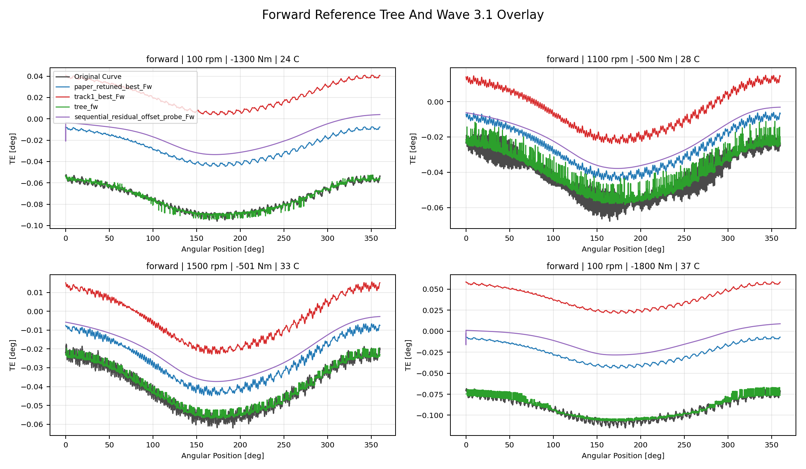

## Comparison Gallery - Forward Reference Tree And Wave 3.3 Overlay

Included models: `paper_retuned_best_Fw`, `rcim_model_bank_reproduction_best_fw`, `tree_fw`, `wave3_3_curve_aware_pointwise_control_fw`, `wave3_3_raw_centered_shape_curve_aware_fw`, `wave3_3_raw_offset_curve_aware_fw`, `wave3_3_full_curve_composite_fw`.

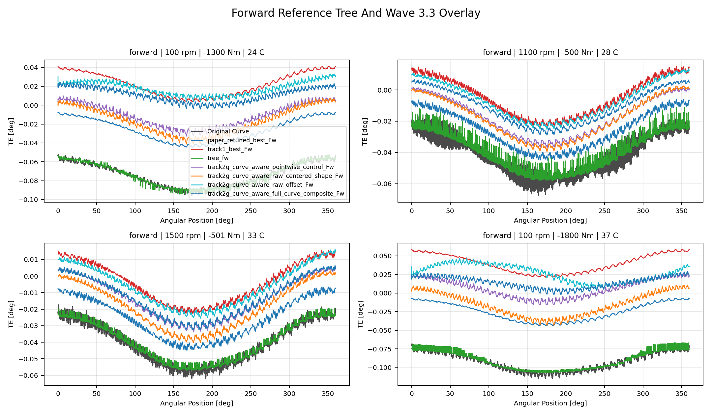

## Comparison Gallery - Forward Reference Tree And Wave 4 series Overlay

Included models: `paper_retuned_best_Fw`, `rcim_model_bank_reproduction_best_fw`, `tree_fw`, `wave4_1_mae_robust_loss_fw`, `wave4_1_smooth_l1_robust_loss_fw`, `wave4_1_log_cosh_robust_loss_fw`.

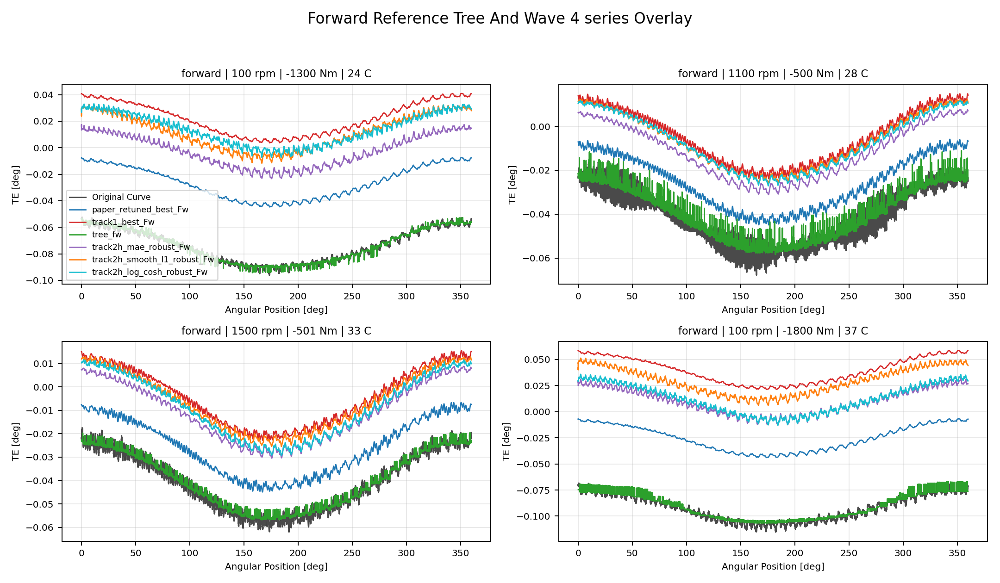

## Output Artifacts

- output directory: `output\validation_checks\track2_multi_model_curve_comparison_report\2026-07-04-11-41-15__track2_multi_model_curve_comparison_report`;
- summary YAML: `output\validation_checks\track2_multi_model_curve_comparison_report\2026-07-04-11-41-15__track2_multi_model_curve_comparison_report\track2_multi_model_curve_comparison_summary.yaml`;
- metrics CSV: `output\validation_checks\track2_multi_model_curve_comparison_report\2026-07-04-11-41-15__track2_multi_model_curve_comparison_report\track2_multi_model_curve_comparison_metrics.csv`;
- report Markdown: `doc\reports\analysis\te_curve_verification_pipeline\02_visual_reports\dataset_surface_report\polished_dataset\forward\overlay\[2026-07-04]\track2_multi_model_curve_comparison_report.md`.
