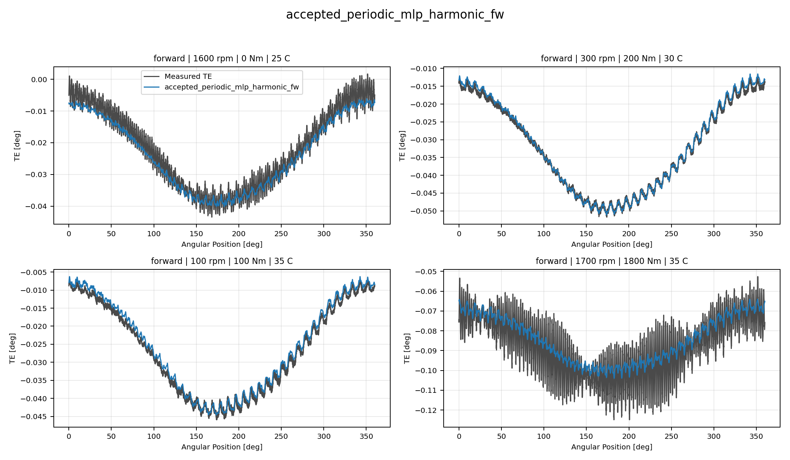
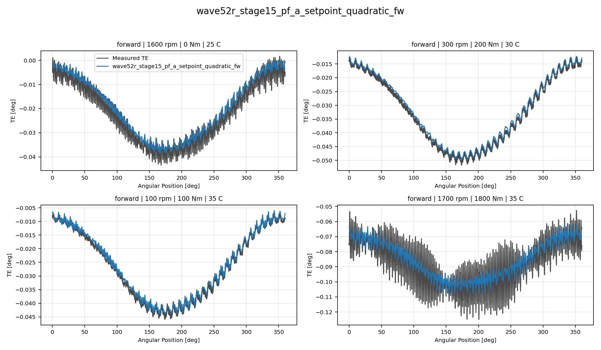
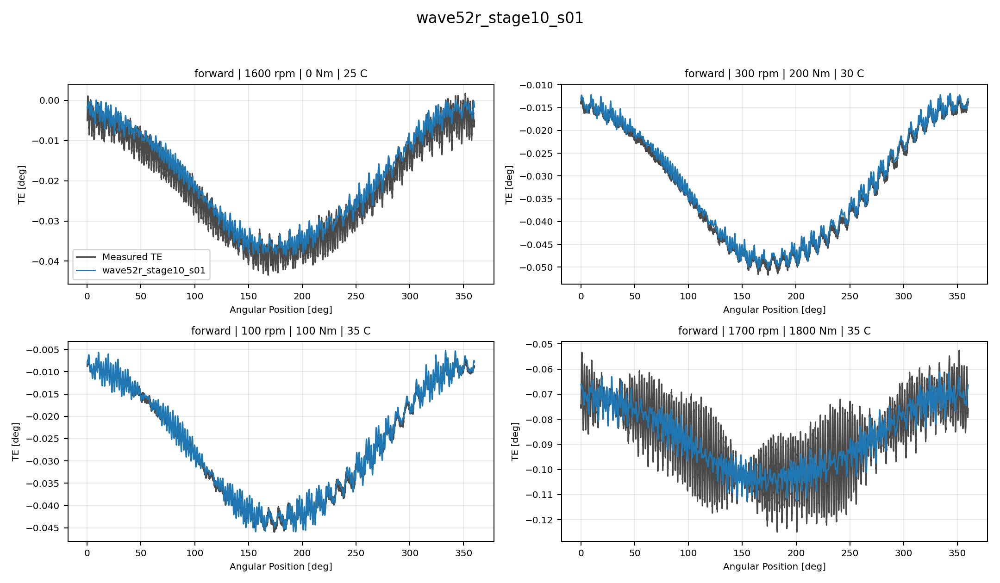
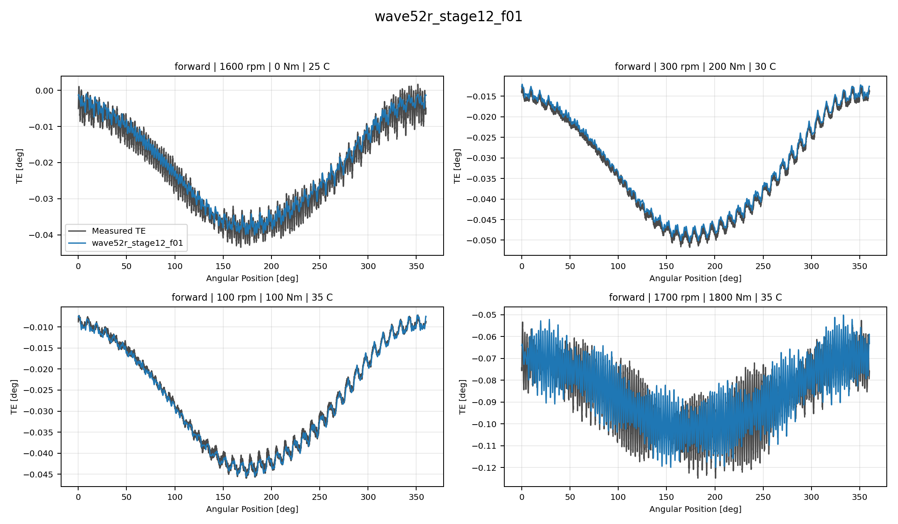
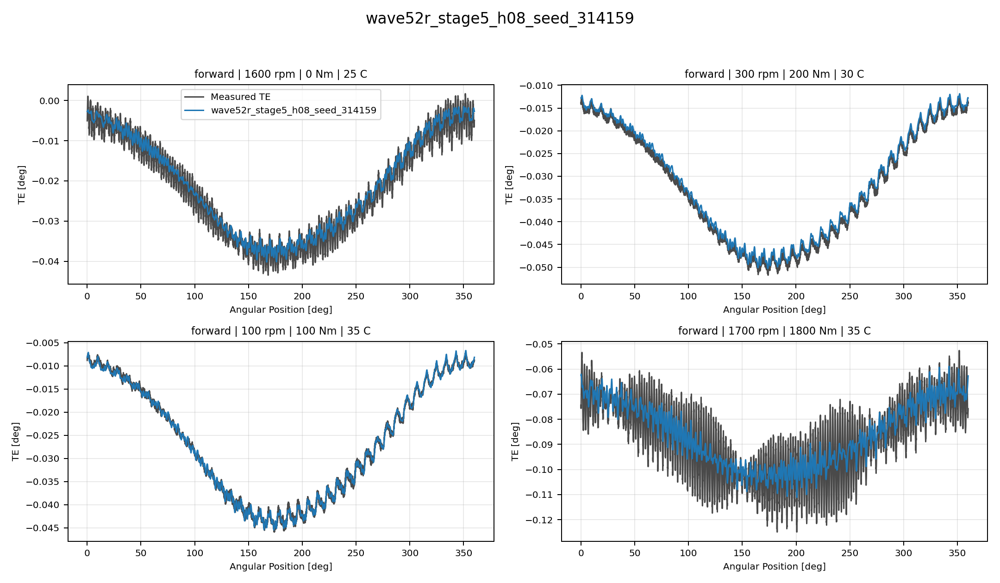
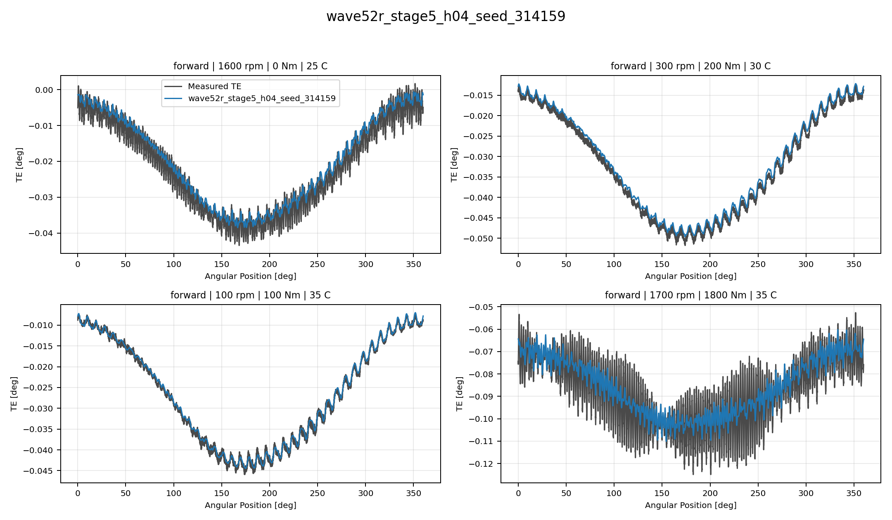
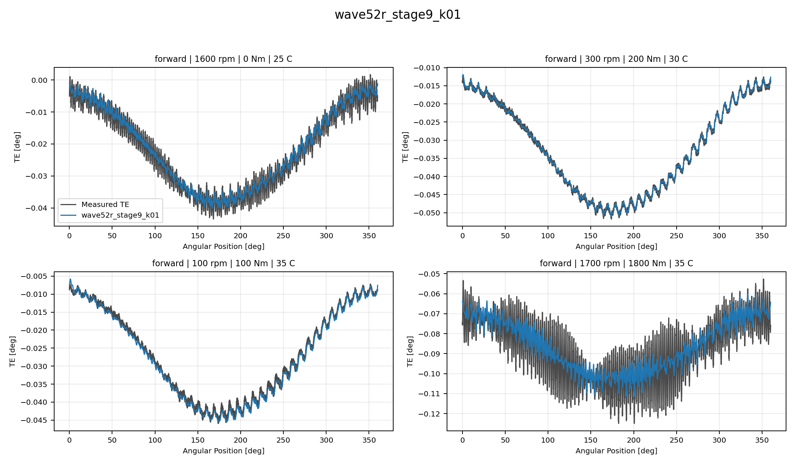

# TE Curve Verification Pipeline Best Model Collage Report

## Overview

This report compares representative `TE Curve Verification Pipeline` TE-curve predictions for
the current best reference, RCIM Model-Bank Reproduction, Wave 1 directional, and Wave 1
global models. Each model is shown as one four-image collage so local
oscillation tracking can be inspected directly.

## Scope

- each collage contains four deterministic held-out test curves;
- forward models are shown on forward curves only;
- backward models are shown on backward curves only;
- global Wave 1 models are shown on two forward and two backward curves;
- `Measured TE` uses the same line width as predictions and a dark-gray
  color for balanced visual comparison.

## Metrics Summary

### Forward Accepted Non Windowed Reference Models

| Candidate | Source | Surface | Curve MAE [deg] | Curve RMSE [deg] | Mean Error |
| --- | --- | --- | ---: | ---: | ---: |
| `accepted_periodic_mlp_harmonic_fw` | `accepted_non_windowed_reference` | Fw | 0.001694 | 0.002008 | 3.439 |

### Forward Accepted Time Windowed Incumbent Models

| Candidate | Source | Surface | Curve MAE [deg] | Curve RMSE [deg] | Mean Error |
| --- | --- | --- | ---: | ---: | ---: |
| `accepted_periodic_gru_sequence_fw` | `accepted_time_windowed_incumbent` | Fw | 0.001618 | 0.001931 | 3.278 |

### Forward Frozen Analytical Anchor Models

| Candidate | Source | Surface | Curve MAE [deg] | Curve RMSE [deg] | Mean Error |
| --- | --- | --- | ---: | ---: | ---: |
| `wave52r_stage15_pf_a_setpoint_quadratic_fw` | `frozen_analytical_anchor` | Fw | 0.001812 | 0.002126 | 3.749 |

### Forward Wave52r Stage10 Non Temporal Models

| Candidate | Source | Surface | Curve MAE [deg] | Curve RMSE [deg] | Mean Error |
| --- | --- | --- | ---: | ---: | ---: |
| `wave52r_stage10_r00` | `wave52r_stage10_non_temporal` | Fw | 0.001658 | 0.001986 | 3.422 |
| `wave52r_stage10_s01` | `wave52r_stage10_non_temporal` | Fw | 0.001658 | 0.001988 | 3.422 |

### Forward Wave52r Stage12 Temporal Models

| Candidate | Source | Surface | Curve MAE [deg] | Curve RMSE [deg] | Mean Error |
| --- | --- | --- | ---: | ---: | ---: |
| `wave52r_stage12_f01` | `wave52r_stage12_temporal` | Fw | 0.001444 | 0.001724 | 2.993 |
| `wave52r_stage12_s01` | `wave52r_stage12_temporal` | Fw | 0.001495 | 0.001768 | 3.041 |

### Forward Wave52r Stage5 Non Temporal Models

| Candidate | Source | Surface | Curve MAE [deg] | Curve RMSE [deg] | Mean Error |
| --- | --- | --- | ---: | ---: | ---: |
| `wave52r_stage5_h08_seed_314159` | `wave52r_stage5_non_temporal` | Fw | 0.001694 | 0.002005 | 3.483 |
| `wave52r_stage5_h04_seed_314159` | `wave52r_stage5_non_temporal` | Fw | 0.001728 | 0.002036 | 3.558 |

### Forward Wave52r Stage9 Temporal Models

| Candidate | Source | Surface | Curve MAE [deg] | Curve RMSE [deg] | Mean Error |
| --- | --- | --- | ---: | ---: | ---: |
| `wave52r_stage9_k01` | `wave52r_stage9_temporal` | Fw | 0.001374 | 0.001645 | 2.716 |

## Collage Gallery - Forward Accepted Non Windowed Reference Models

accepted_periodic_mlp_harmonic_fw:

## Collage Gallery - Forward Accepted Time Windowed Incumbent Models

accepted_periodic_gru_sequence_fw:

## Collage Gallery - Forward Frozen Analytical Anchor Models

wave52r_stage15_pf_a_setpoint_quadratic_fw:

## Collage Gallery - Forward Wave52r Stage10 Non Temporal Models

wave52r_stage10_r00:

wave52r_stage10_s01:

## Collage Gallery - Forward Wave52r Stage12 Temporal Models

wave52r_stage12_f01:

wave52r_stage12_s01:

## Collage Gallery - Forward Wave52r Stage5 Non Temporal Models

wave52r_stage5_h08_seed_314159:

wave52r_stage5_h04_seed_314159:

## Collage Gallery - Forward Wave52r Stage9 Temporal Models

wave52r_stage9_k01:

## Output Artifacts

- output directory: `output\validation_checks\wave52r_full_candidate_track2_best_model_collage_report\2026-07-30-11-03-21__track2_best_model_collage_report`;
- summary YAML: `output\validation_checks\wave52r_full_candidate_track2_best_model_collage_report\2026-07-30-11-03-21__track2_best_model_collage_report\track2_best_model_collage_summary.yaml`;
- metrics CSV: `output\validation_checks\wave52r_full_candidate_track2_best_model_collage_report\2026-07-30-11-03-21__track2_best_model_collage_report\track2_best_model_collage_metrics.csv`;
- report Markdown: `doc\reports\analysis\te_curve_verification_pipeline\02_visual_reports\wave52r_full_candidate_best_model_collage_report\[2026-07-30]\track2_best_model_collage_report.md`.
