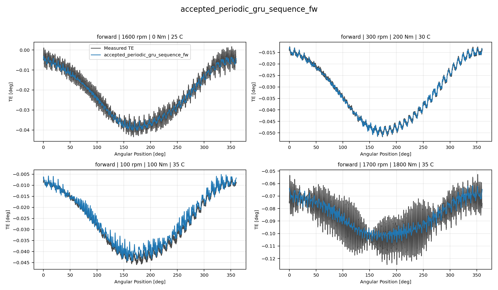
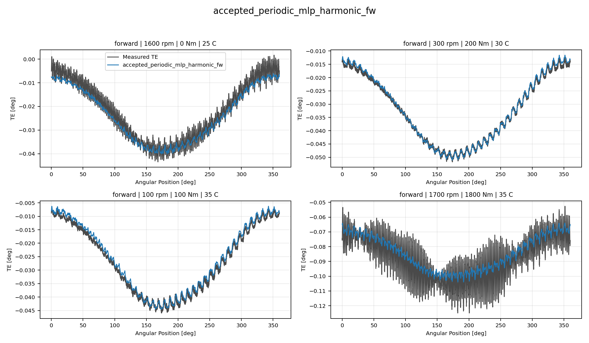
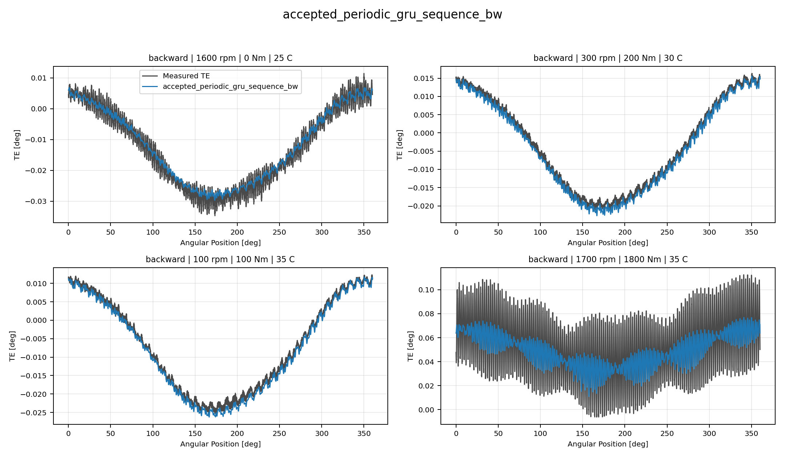
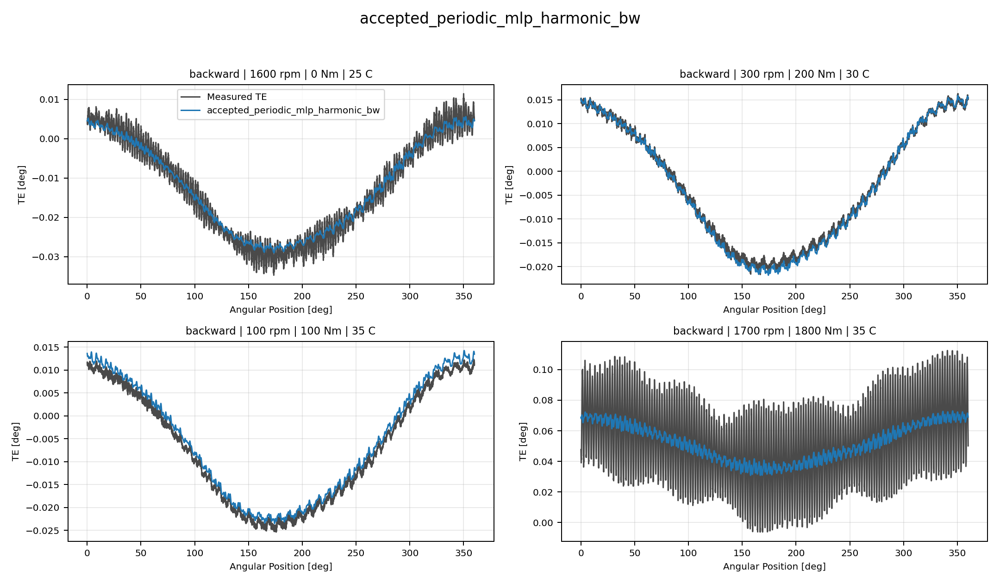
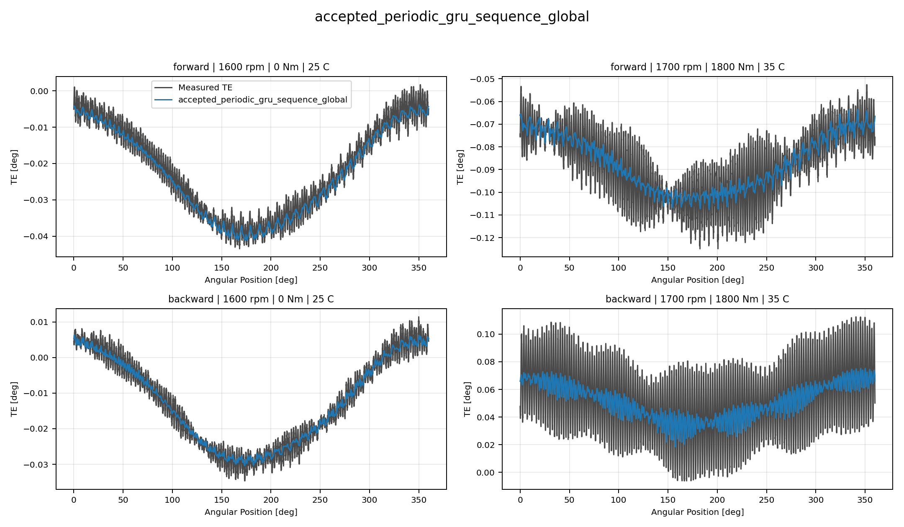
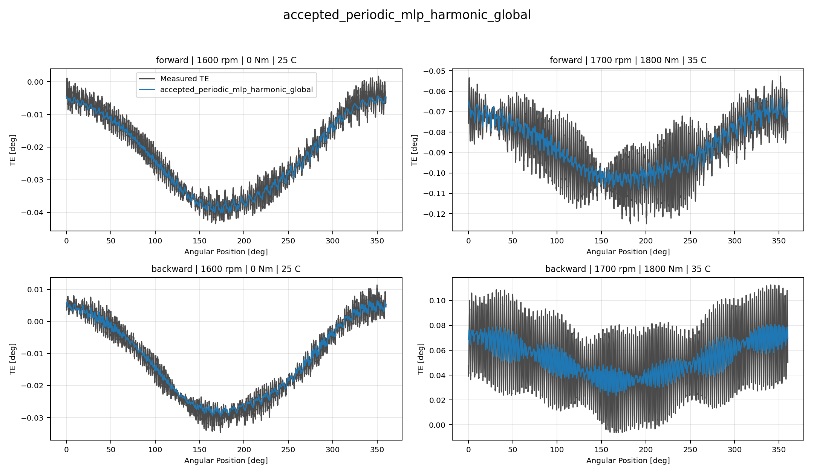
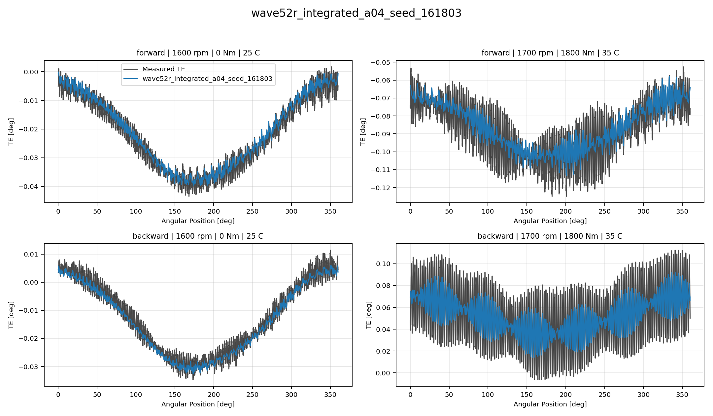
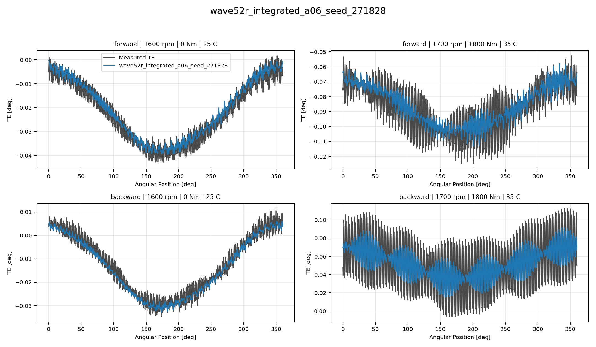
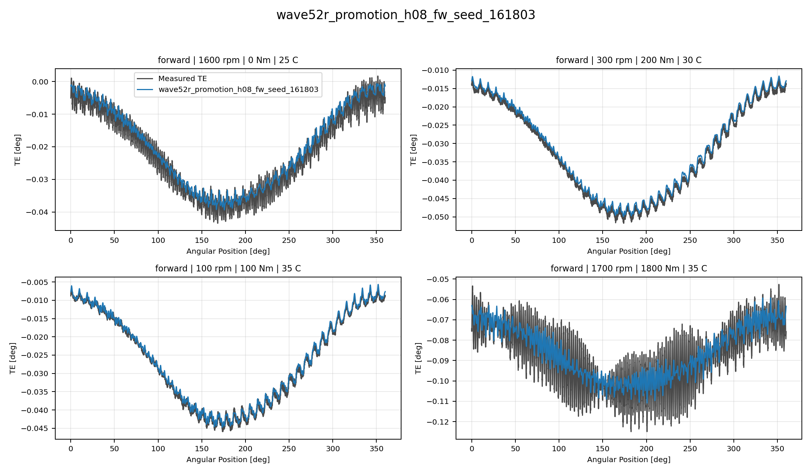

# TE Curve Verification Pipeline Best Model Collage Report

## Overview

This report compares representative `TE Curve Verification Pipeline` TE-curve predictions for
the current best reference, RCIM Model-Bank Reproduction, Wave 1 directional, and Wave 1
global models. Each model is shown as one four-image collage so local
oscillation tracking can be inspected directly.

## Scope

- each collage contains four deterministic held-out test curves;
- forward models are shown on forward curves only;
- backward models are shown on backward curves only;
- global Wave 1 models are shown on two forward and two backward curves;
- `Measured TE` uses the same line width as predictions and a dark-gray
  color for balanced visual comparison.

## Metrics Summary

### Forward Accepted Non PINN Incumbent Models

| Candidate | Source | Surface | Curve MAE [deg] | Curve RMSE [deg] | Mean Error |
| --- | --- | --- | ---: | ---: | ---: |
| `accepted_periodic_gru_sequence_fw` | `accepted_non_pinn_incumbent` | Fw | 0.001618 | 0.001931 | 3.278 |
| `accepted_periodic_mlp_harmonic_fw` | `accepted_non_pinn_incumbent` | Fw | 0.001694 | 0.002008 | 3.439 |

### Backward Accepted Non PINN Incumbent Models

| Candidate | Source | Surface | Curve MAE [deg] | Curve RMSE [deg] | Mean Error |
| --- | --- | --- | ---: | ---: | ---: |
| `accepted_periodic_gru_sequence_bw` | `accepted_non_pinn_incumbent` | Bw | 0.001837 | 0.002196 | 3.494 |
| `accepted_periodic_mlp_harmonic_bw` | `accepted_non_pinn_incumbent` | Bw | 0.001912 | 0.002263 | 3.581 |

### Global Accepted Non PINN Incumbent Models

| Candidate | Source | Surface | Curve MAE [deg] | Curve RMSE [deg] | Mean Error |
| --- | --- | --- | ---: | ---: | ---: |
| `accepted_periodic_gru_sequence_global` | `accepted_non_pinn_incumbent` | global | 0.001810 | 0.002141 | 3.567 |
| `accepted_periodic_mlp_harmonic_global` | `accepted_non_pinn_incumbent` | global | 0.001734 | 0.002054 | 3.385 |

### Global Wave52r Integrated Specialist Trained Models

| Candidate | Source | Surface | Curve MAE [deg] | Curve RMSE [deg] | Mean Error |
| --- | --- | --- | ---: | ---: | ---: |
| `wave52r_integrated_a02_seed_314159` | `wave52r_integrated_specialist_trained` | global | 0.001462 | 0.001735 | 2.890 |
| `wave52r_integrated_a03_seed_161803` | `wave52r_integrated_specialist_trained` | global | 0.001457 | 0.001731 | 2.885 |
| `wave52r_integrated_a04_seed_161803` | `wave52r_integrated_specialist_trained` | global | 0.001457 | 0.001729 | 2.877 |
| `wave52r_integrated_a05_seed_161803` | `wave52r_integrated_specialist_trained` | global | 0.001461 | 0.001733 | 2.884 |
| `wave52r_integrated_a06_seed_271828` | `wave52r_integrated_specialist_trained` | global | 0.001463 | 0.001736 | 2.889 |
| `wave52r_integrated_a07_seed_314159` | `wave52r_integrated_specialist_trained` | global | 0.001463 | 0.001736 | 2.888 |
| `wave52r_integrated_a07_seed_161803` | `wave52r_integrated_specialist_trained` | global | 0.001463 | 0.001736 | 2.890 |

### Forward Wave52r Offline Leader Cross Surface Promotion Models

| Candidate | Source | Surface | Curve MAE [deg] | Curve RMSE [deg] | Mean Error |
| --- | --- | --- | ---: | ---: | ---: |
| `wave52r_promotion_h08_fw_seed_161803` | `wave52r_offline_leader_cross_surface_promotion` | Fw | 0.001688 | 0.001985 | 3.477 |

### Global Wave52r Offline Leader Cross Surface Promotion Models

| Candidate | Source | Surface | Curve MAE [deg] | Curve RMSE [deg] | Mean Error |
| --- | --- | --- | ---: | ---: | ---: |
| `wave52r_promotion_k01_global_seed_271828` | `wave52r_offline_leader_cross_surface_promotion` | global | 0.001464 | 0.001738 | 2.893 |

## Collage Gallery - Forward Accepted Non PINN Incumbent Models

accepted_periodic_gru_sequence_fw:

accepted_periodic_mlp_harmonic_fw:

## Collage Gallery - Backward Accepted Non PINN Incumbent Models

accepted_periodic_gru_sequence_bw:

accepted_periodic_mlp_harmonic_bw:

## Collage Gallery - Global Accepted Non PINN Incumbent Models

accepted_periodic_gru_sequence_global:

accepted_periodic_mlp_harmonic_global:

## Collage Gallery - Global Wave52r Integrated Specialist Trained Models

wave52r_integrated_a02_seed_314159:

wave52r_integrated_a03_seed_161803:

## Collage Gallery - Global Wave52r Integrated Specialist Trained Models Continued

wave52r_integrated_a04_seed_161803:

wave52r_integrated_a05_seed_161803:

## Collage Gallery - Global Wave52r Integrated Specialist Trained Models Continued 2

wave52r_integrated_a06_seed_271828:

wave52r_integrated_a07_seed_314159:

## Collage Gallery - Global Wave52r Integrated Specialist Trained Models Continued 3

wave52r_integrated_a07_seed_161803:

## Collage Gallery - Forward Wave52r Offline Leader Cross Surface Promotion Models

wave52r_promotion_h08_fw_seed_161803:

## Collage Gallery - Global Wave52r Offline Leader Cross Surface Promotion Models

wave52r_promotion_k01_global_seed_271828:

## Output Artifacts

- output directory: `output\validation_checks\wave52r_integrated_specialist_track2_best_model_collage_report\2026-08-04-00-33-58__track2_best_model_collage_report`;
- summary YAML: `output\validation_checks\wave52r_integrated_specialist_track2_best_model_collage_report\2026-08-04-00-33-58__track2_best_model_collage_report\track2_best_model_collage_summary.yaml`;
- metrics CSV: `output\validation_checks\wave52r_integrated_specialist_track2_best_model_collage_report\2026-08-04-00-33-58__track2_best_model_collage_report\track2_best_model_collage_metrics.csv`;
- report Markdown: `doc\reports\analysis\te_curve_verification_pipeline\02_visual_reports\wave52r_integrated_specialist_best_model_collage_report\[2026-08-04]\track2_best_model_collage_report.md`.
