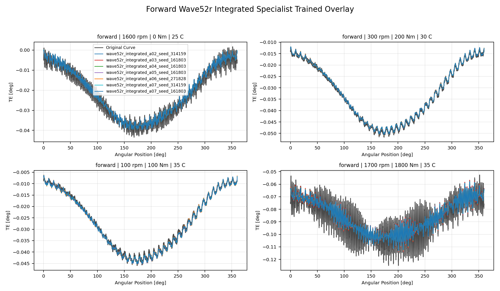
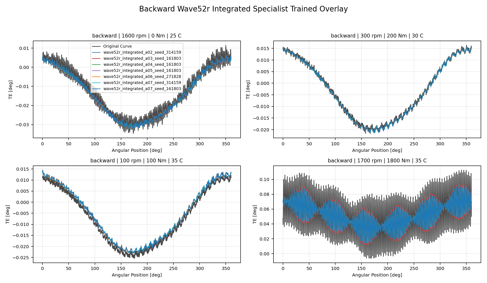
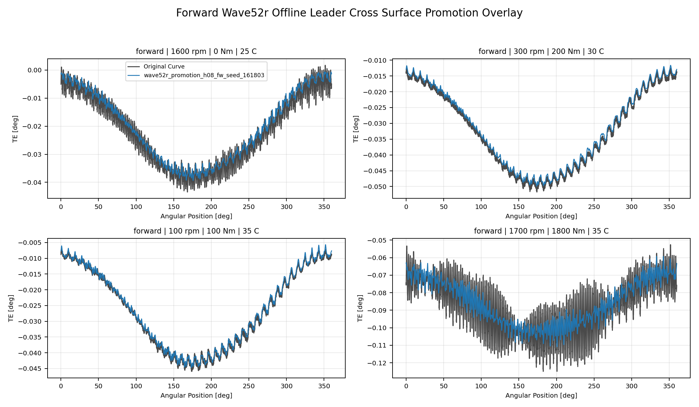
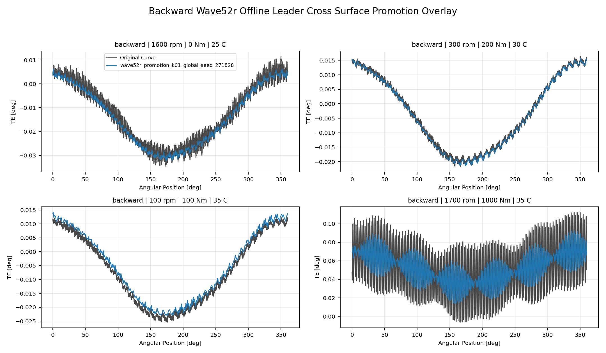
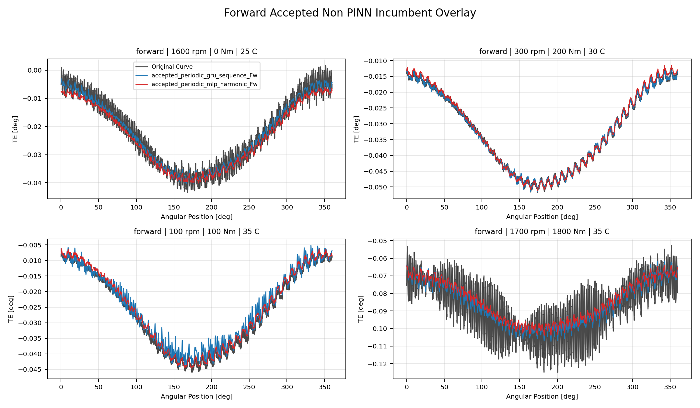
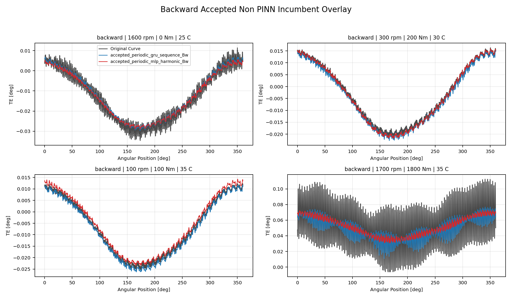

# TE Curve Verification Pipeline Multi-Model Curve Comparison Report

## Overview

This report compares representative `TE Curve Verification Pipeline` TE curves by overlaying
multiple model predictions on the same original measured curve. The
plots are intended to show whether each model tracks the local harmonic
oscillations rather than only the broad mean trend.

## Scope

- each comparison image contains four deterministic held-out test curves;
- forward comparisons are shown on forward curves only;
- backward comparisons are shown on backward curves only;
- Wave 1 screening keeps the three strongest family-best models by
  `Curve MAE [deg]` within each direction;
- `Original Curve` uses the same visual weight as predictions and a
  dark-gray color for balanced comparison.

## Metrics Summary

### Forward Wave52r Integrated Specialist Trained Overlay

| Candidate | Source | Surface | Curve MAE [deg] | Curve RMSE [deg] | Mean Error |
| --- | --- | --- | ---: | ---: | ---: |
| `wave52r_integrated_a02_seed_314159` | `wave52r_integrated_specialist_trained` | global | 0.001400 | 0.001658 | 2.856 |
| `wave52r_integrated_a03_seed_161803` | `wave52r_integrated_specialist_trained` | global | 0.001403 | 0.001662 | 2.862 |
| `wave52r_integrated_a04_seed_161803` | `wave52r_integrated_specialist_trained` | global | 0.001398 | 0.001655 | 2.848 |
| `wave52r_integrated_a05_seed_161803` | `wave52r_integrated_specialist_trained` | global | 0.001400 | 0.001658 | 2.852 |
| `wave52r_integrated_a06_seed_271828` | `wave52r_integrated_specialist_trained` | global | 0.001404 | 0.001662 | 2.858 |
| `wave52r_integrated_a07_seed_314159` | `wave52r_integrated_specialist_trained` | global | 0.001403 | 0.001661 | 2.858 |
| `wave52r_integrated_a07_seed_161803` | `wave52r_integrated_specialist_trained` | global | 0.001405 | 0.001664 | 2.862 |

### Backward Wave52r Integrated Specialist Trained Overlay

| Candidate | Source | Surface | Curve MAE [deg] | Curve RMSE [deg] | Mean Error |
| --- | --- | --- | ---: | ---: | ---: |
| `wave52r_integrated_a02_seed_314159` | `wave52r_integrated_specialist_trained` | global | 0.001523 | 0.001811 | 2.923 |
| `wave52r_integrated_a03_seed_161803` | `wave52r_integrated_specialist_trained` | global | 0.001512 | 0.001801 | 2.909 |
| `wave52r_integrated_a04_seed_161803` | `wave52r_integrated_specialist_trained` | global | 0.001517 | 0.001802 | 2.907 |
| `wave52r_integrated_a05_seed_161803` | `wave52r_integrated_specialist_trained` | global | 0.001521 | 0.001808 | 2.916 |
| `wave52r_integrated_a06_seed_271828` | `wave52r_integrated_specialist_trained` | global | 0.001523 | 0.001809 | 2.919 |
| `wave52r_integrated_a07_seed_314159` | `wave52r_integrated_specialist_trained` | global | 0.001523 | 0.001810 | 2.919 |
| `wave52r_integrated_a07_seed_161803` | `wave52r_integrated_specialist_trained` | global | 0.001521 | 0.001809 | 2.918 |

### Forward Wave52r Offline Leader Cross Surface Promotion Overlay

| Candidate | Source | Surface | Curve MAE [deg] | Curve RMSE [deg] | Mean Error |
| --- | --- | --- | ---: | ---: | ---: |
| `wave52r_promotion_h08_fw_seed_161803` | `wave52r_offline_leader_cross_surface_promotion` | Fw | 0.001688 | 0.001985 | 3.477 |

### Backward Wave52r Offline Leader Cross Surface Promotion Overlay

| Candidate | Source | Surface | Curve MAE [deg] | Curve RMSE [deg] | Mean Error |
| --- | --- | --- | ---: | ---: | ---: |
| `wave52r_promotion_k01_global_seed_271828` | `wave52r_offline_leader_cross_surface_promotion` | global | 0.001523 | 0.001811 | 2.923 |

### Forward Accepted Non PINN Incumbent Overlay

| Candidate | Source | Surface | Curve MAE [deg] | Curve RMSE [deg] | Mean Error |
| --- | --- | --- | ---: | ---: | ---: |
| `accepted_periodic_gru_sequence_Fw` | `accepted_non_pinn_incumbent` | Fw | 0.001618 | 0.001931 | 3.278 |
| `accepted_periodic_mlp_harmonic_Fw` | `accepted_non_pinn_incumbent` | Fw | 0.001694 | 0.002008 | 3.439 |

### Backward Accepted Non PINN Incumbent Overlay

| Candidate | Source | Surface | Curve MAE [deg] | Curve RMSE [deg] | Mean Error |
| --- | --- | --- | ---: | ---: | ---: |
| `accepted_periodic_gru_sequence_Bw` | `accepted_non_pinn_incumbent` | Bw | 0.001837 | 0.002196 | 3.494 |
| `accepted_periodic_mlp_harmonic_Bw` | `accepted_non_pinn_incumbent` | Bw | 0.001912 | 0.002263 | 3.581 |

## Comparison Gallery - Forward Wave52r Integrated Specialist Trained Overlay

Included models: `wave52r_integrated_a02_seed_314159`, `wave52r_integrated_a03_seed_161803`, `wave52r_integrated_a04_seed_161803`, `wave52r_integrated_a05_seed_161803`, `wave52r_integrated_a06_seed_271828`, `wave52r_integrated_a07_seed_314159`, `wave52r_integrated_a07_seed_161803`.

## Comparison Gallery - Backward Wave52r Integrated Specialist Trained Overlay

Included models: `wave52r_integrated_a02_seed_314159`, `wave52r_integrated_a03_seed_161803`, `wave52r_integrated_a04_seed_161803`, `wave52r_integrated_a05_seed_161803`, `wave52r_integrated_a06_seed_271828`, `wave52r_integrated_a07_seed_314159`, `wave52r_integrated_a07_seed_161803`.

## Comparison Gallery - Forward Wave52r Offline Leader Cross Surface Promotion Overlay

Included models: `wave52r_promotion_h08_fw_seed_161803`.

## Comparison Gallery - Backward Wave52r Offline Leader Cross Surface Promotion Overlay

Included models: `wave52r_promotion_k01_global_seed_271828`.

## Comparison Gallery - Forward Accepted Non PINN Incumbent Overlay

Included models: `accepted_periodic_gru_sequence_Fw`, `accepted_periodic_mlp_harmonic_Fw`.

## Comparison Gallery - Backward Accepted Non PINN Incumbent Overlay

Included models: `accepted_periodic_gru_sequence_Bw`, `accepted_periodic_mlp_harmonic_Bw`.

## Output Artifacts

- output directory: `output\validation_checks\wave52r_integrated_specialist_track2_multi_model_curve_comparison_report\2026-08-04-00-39-20__track2_multi_model_curve_comparison_report`;
- summary YAML: `output\validation_checks\wave52r_integrated_specialist_track2_multi_model_curve_comparison_report\2026-08-04-00-39-20__track2_multi_model_curve_comparison_report\track2_multi_model_curve_comparison_summary.yaml`;
- metrics CSV: `output\validation_checks\wave52r_integrated_specialist_track2_multi_model_curve_comparison_report\2026-08-04-00-39-20__track2_multi_model_curve_comparison_report\track2_multi_model_curve_comparison_metrics.csv`;
- report Markdown: `doc\reports\analysis\te_curve_verification_pipeline\02_visual_reports\wave52r_integrated_specialist_multi_model_curve_comparison_report\[2026-08-04]\track2_multi_model_curve_comparison_report.md`.
