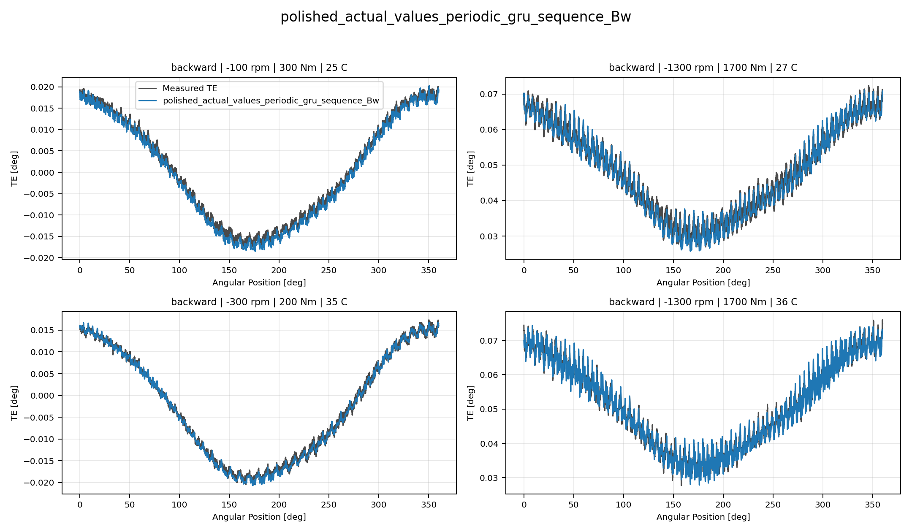
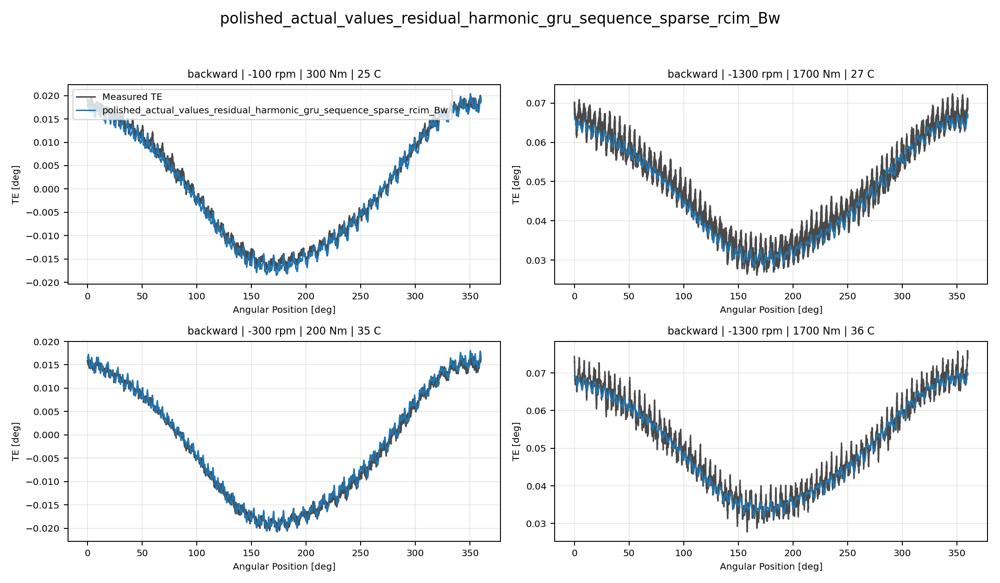

# Non-MMT Reduced Cross-Wave Comparison

## Overview

This report closes the approved six-cell reduced evaluation prepared in
`2026-07-24-13-10-16_non_mmt_reduced_evaluation_and_cross_wave_comparison.md`.
The remote launcher completed successfully on `2026-07-24`, covering:

- `polished_dataset + setpoints`, forward and backward;
- `simplified_dataset + setpoints`, forward and backward;
- `polished_dataset + actual_values`, forward and backward.

The reduced comparison is an interim model-development decision surface. It
does not replace the official full-matrix TE Curve Verification Pipeline
decision, reopen `global`, or authorize a program-registry promotion.

## Evaluation Method

The six selected-model reports were inspected together with their metrics,
operator logs, measured-versus-predicted curve collages, and shape-gated
reranker outputs. The decision follows the canonical multi-index curve-first
policy and keeps these axes separate:

- raw error;
- mean-centered shape fidelity;
- offset behavior;
- harmonic and phase fidelity;
- robustness and shape-pass rate;
- visual curve evidence.

The setpoint matrices evaluated seven candidates per direction. The polished
actual-values matrix evaluated nine candidates per direction, including the
sparse-RCIM GRU and LSTM references.

## Six-Cell Decision Matrix

| Dataset and input mode | Direction | Recommended candidate |
| --- | --- | --- |
| Polished setpoints | Fw | `polished_setpoints_periodic_gru_sequence_Fw` |
| Polished setpoints | Bw | `polished_setpoints_periodic_mlp_harmonic_Bw` |
| Simplified setpoints | Fw | `simplified_setpoints_periodic_mlp_harmonic_Fw` |
| Simplified setpoints | Bw | `simplified_setpoints_periodic_gru_sequence_Bw` |
| Polished actual values | Fw | `polished_actual_values_periodic_gru_sequence_Fw` |
| Polished actual values | Bw | `polished_actual_values_periodic_gru_sequence_Bw` |

The periodic GRU is recommended in four of the six cells. The periodic harmonic
MLP is recommended in polished-setpoint backward and simplified-setpoint
forward. This preserves both an explicitly time-windowed branch and a
non-windowed harmonic branch.

Axis leaders remain deliberately separate:

- polished setpoints: Wave 4.1 leads raw error and offset, periodic GRU leads
  shape, and periodic harmonic MLP leads harmonic fidelity;
- simplified setpoints: the tree anchor leads raw error and offset but fails
  the shape gate, while periodic GRU and periodic harmonic MLP lead the
  shape-preserving axes;
- polished actual values: periodic GRU dominates both directions, except that
  periodic harmonic MLP leads forward harmonic fidelity and Wave 4.1 leads
  forward offset behavior.

## Important Metric Findings

### Polished Setpoints

Wave 4.1 MAE robust is the raw-error and offset leader in both directions, but
it does not win the composite curve-first decision. Forward recommends the
periodic GRU, while backward recommends the periodic harmonic MLP.

### Simplified Setpoints

The tree anchor has the lowest raw MAE in both directions, but its shape-pass
rates are only `0.340206` forward and `0.288660` backward. The curve collages
show stepped predictions and loss of measured high-frequency content.
Accordingly, the tree remains a raw-error and offset reference rather than a
promotion candidate.

The tree artifacts were also serialized with scikit-learn `1.6.1` and loaded
during this pass with scikit-learn `1.8.0`, which emitted
`InconsistentVersionWarning`. Tree results therefore carry an additional
reproducibility caution until replayed in a compatible environment.

### Polished Actual Values

The periodic GRU is the recommended candidate in both directions. Backward is
the clearest result: it leads every inspected axis, with raw MAE
`0.001333 deg`, mean percentage error `2.624934%`, P95 percentage error
`5.437606%`, and shape-pass rate `0.989362`.

The sparse-RCIM GRU and LSTM references win no cell. On backward actual-values
evidence, sparse-RCIM GRU ranks third and sparse-RCIM LSTM ranks sixth. Their
curve evidence follows the low-frequency trend but smooths or under-represents
the measured high-frequency ripple. They remain useful exploratory references,
not active leaders.

## Visual Evidence Review

The six selected reports contain 46 candidate collages built from four shared
conditions per direction. The visual review supports the metric decisions:

- periodic GRU preserves both the low-frequency TE envelope and measured
  high-frequency ripple most consistently on polished actual values;
- periodic harmonic MLP preserves useful harmonic structure on the two cells
  where it is recommended, although some offset mismatch remains visible;
- Wave 4.1 remains an important raw-error and offset diagnostic benchmark;
- the simplified-setpoint tree anchor looks stepped despite its scalar lead;
- sparse-RCIM temporal references smooth measured ripple and do not justify
  promotion.

## Representative Curve Evidence

### Polished Actual-Values Backward Winner

The periodic GRU follows both the low-frequency envelope and the measured
high-frequency ripple across the shared operating conditions.

### Polished Setpoint Backward Winner

The periodic harmonic MLP retains the strongest composite harmonic and
robustness balance for this cell, although local offset mismatch remains
visible.

### Simplified Setpoint Forward Winner

The periodic harmonic MLP preserves the measured curve shape and ripple more
faithfully than the scalar-leading tree anchor.

### Simplified Tree Shape-Gate Caution

The tree prediction is visibly stepped and loses measured high-frequency
content despite leading raw MAE and offset metrics.

### Sparse-RCIM Temporal Reference Caution

The sparse-RCIM GRU captures the broad low-frequency trend but smooths the
measured ripple, supporting its reference-only status.

## Program Decision

This reduced pass makes no official leader or registry change. The accepted
official `Fw`, `Bw`, and `global` surfaces remain unchanged because this
evaluation intentionally excluded the full official matrix and paused
`global`.

The non-MMT active ingredients are now:

1. `periodic_gru_sequence` as the primary time-windowed family;
2. `periodic_mlp_harmonic` as the required non-windowed harmonic complement;
3. `wave4_1_mae_robust_loss` as the raw-error and offset diagnostic ingredient;
4. `wave4_2_quantile_p10_p50_p90` as a secondary uncertainty benchmark.

Sparse-RCIM GRU and LSTM remain actual-values reference anchors only. MMT
remains an inactive future TODO and is not required for the next branch.

## Next Step

The reduced evidence now satisfies the previous prerequisite for Wave 6
planning. The next repository step is to prepare, but not train, a bounded
technical design for a non-MMT Wave 6 integrated multi-head model. That design
should combine the periodic GRU temporal path, the periodic harmonic MLP
non-windowed path, and an explicit Wave 4.1-informed offset/raw-error head while
preserving causal, TwinCAT-friendly intermediate quantities.

Training remains gated behind a separate approved technical document and
campaign plan.

## Evidence Locations

- Selected reports:
  `doc/reports/analysis/te_curve_verification_pipeline/04_selected_model_reports/[2026-07-24]/`
- Shape-gated reports:
  `doc/reports/analysis/te_curve_verification_pipeline/03_cvp_diagnostics/non_mmt_cross_wave_shape_gated/`
- Remote operator logs:
  `output/validation_checks/track2_operator_launch_logs/2026-07-24-13-30-33_reduced_selected_track2_reports/`
- Reduced matrix artifacts:
  `output/validation_checks/track2_reference_comparison/`
- Shape-gated metric artifacts:
  `output/validation_checks/non_mmt_cross_wave_shape_gated/`
