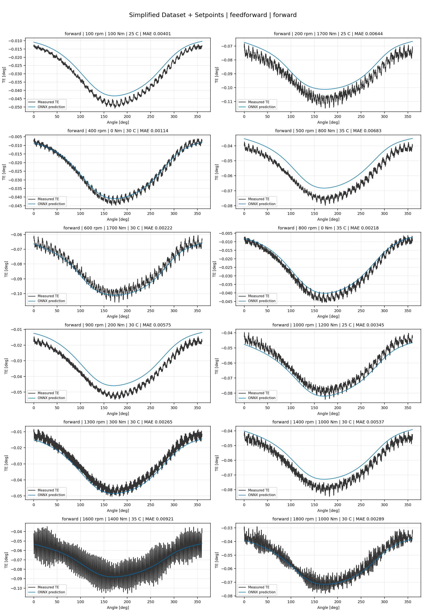
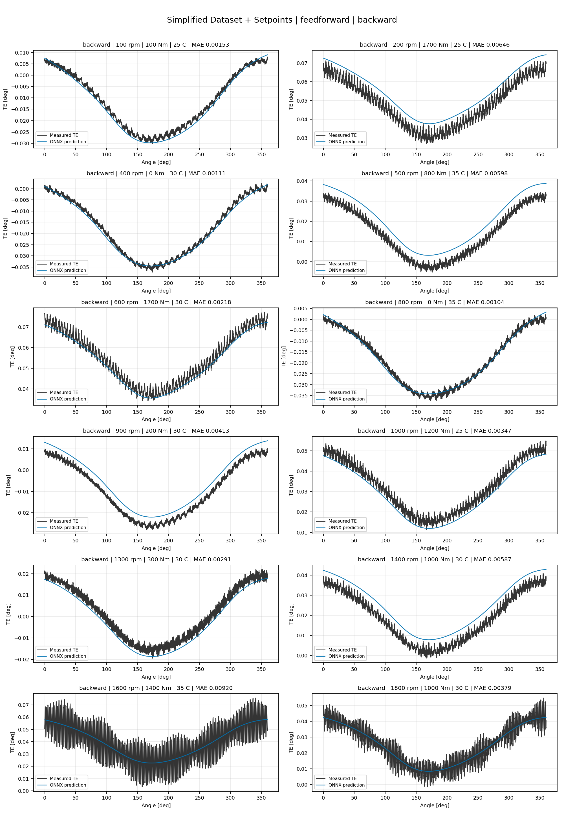
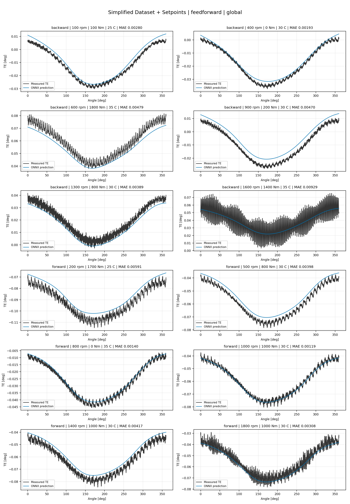
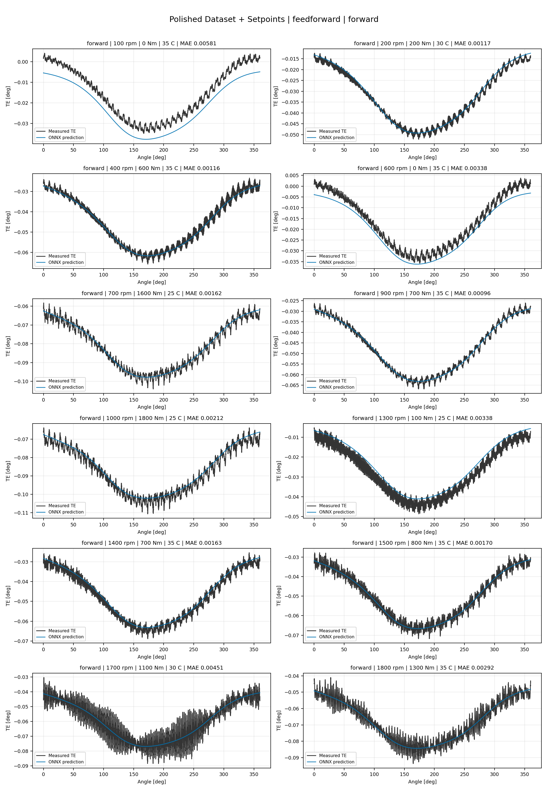
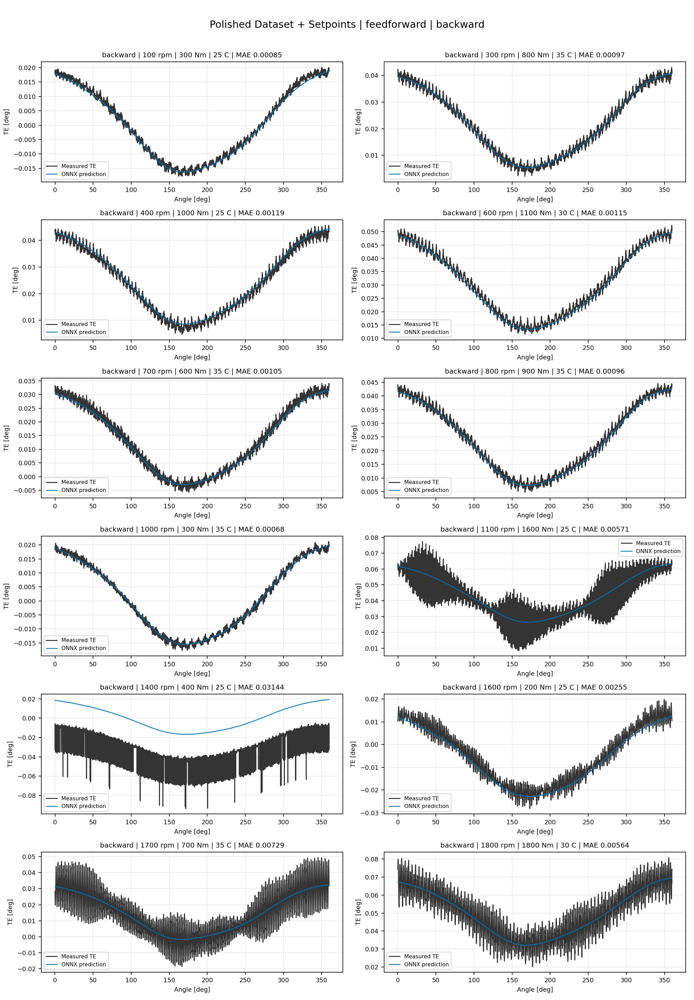
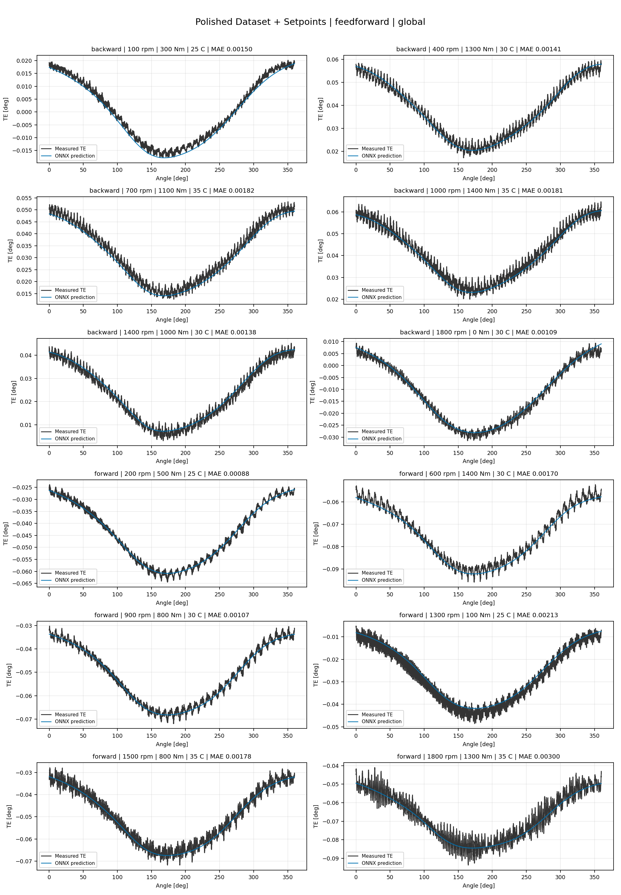
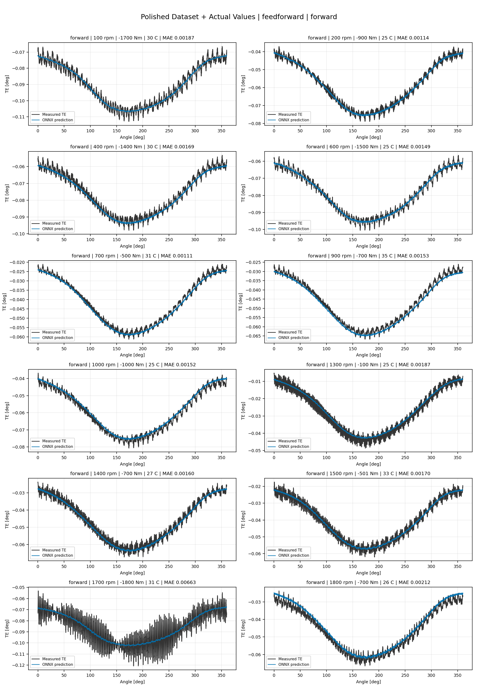
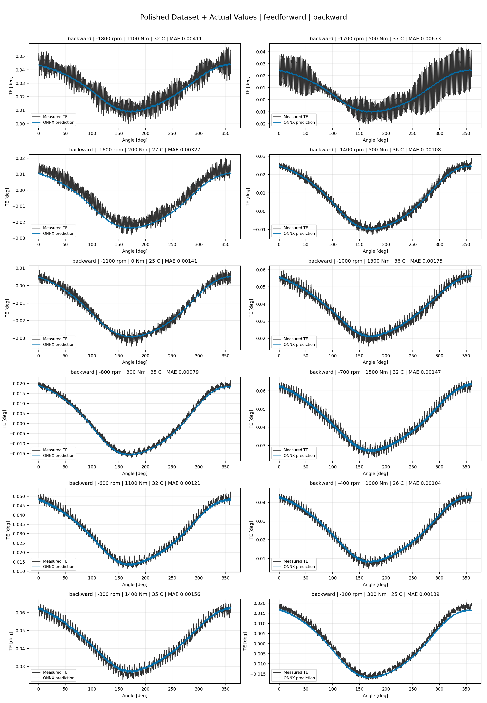
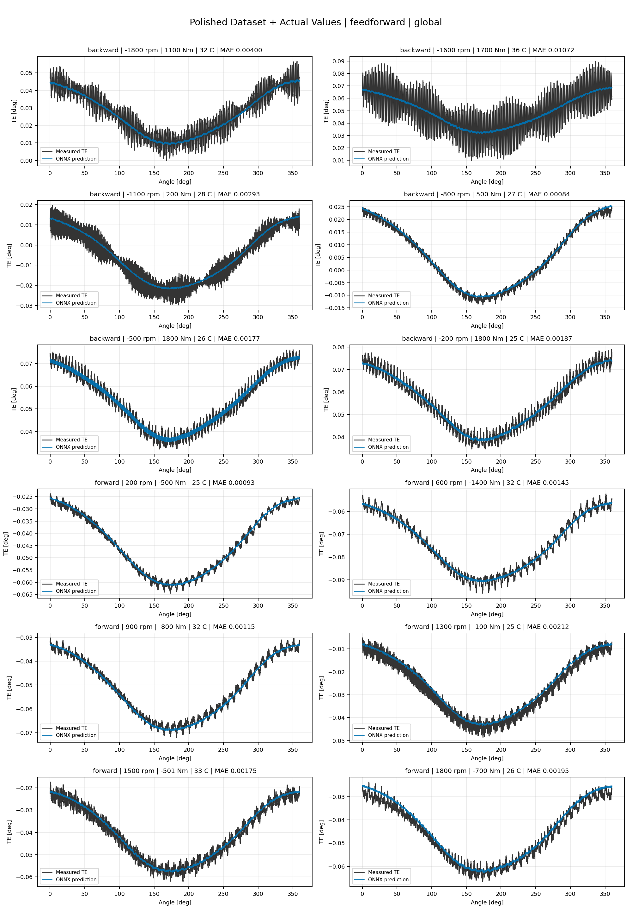

# TE Curve Verification Pipeline Familywise ONNX Report - feedforward

## Overview

This report evaluates exported ONNX models from the dataset input-mode
retraining program. Each dataset/input-mode section uses dataset-matched
held-out test curves and lists the exact model artifacts loaded from
`models/`.

The report is diagnostic and family-specific. It does not replace an
official multi-index model-promotion decision.

## Output Artifacts

- output directory: `output/validation_checks/track2_familywise_onnx_report/feedforward/2026-07-08-00-22-03__track2_feedforward_familywise_onnx_report`;
- summary YAML: `output/validation_checks/track2_familywise_onnx_report/feedforward/2026-07-08-00-22-03__track2_feedforward_familywise_onnx_report/track2_familywise_onnx_report_summary.yaml`;
- model inventory CSV: `output/validation_checks/track2_familywise_onnx_report/feedforward/2026-07-08-00-22-03__track2_feedforward_familywise_onnx_report/model_inventory.csv`;
- per-curve metrics CSV: `output/validation_checks/track2_familywise_onnx_report/feedforward/2026-07-08-00-22-03__track2_feedforward_familywise_onnx_report/per_curve_metrics.csv`.

## Simplified Dataset + Setpoints

- dataset: `simplified_dataset`;
- input mode: `setpoints`;
- evaluated family: `feedforward`;
- dataset root: `data/simplified_dataset`.

### Models Used

| Surface | Run Name | Run Instance | Dataset Schema |
| --- | --- | --- | --- |
| forward | `te_feedforward_fw__simplified_setpoints` | `2026-07-07-16-21-15__te_feedforward_fw__simplified_setpoints` | `simplified_curve_v1` |
| backward | `te_feedforward_bw__simplified_setpoints` | `2026-07-07-16-34-46__te_feedforward_bw__simplified_setpoints` | `simplified_curve_v1` |
| global | `te_feedforward_global__simplified_setpoints` | `2026-07-07-16-02-57__te_feedforward_global__simplified_setpoints` | `simplified_curve_v1` |

Exact model paths:

| Surface | ONNX Model Path | Python Model Path |
| --- | --- | --- |
| forward | `models/simplified_dataset/setpoints/exported/feedforward/forward/2026-07-07-16-21-15__te_feedforward_fw__simplified_setpoints/onnx/model.onnx` | `models/simplified_dataset/setpoints/exported/feedforward/forward/2026-07-07-16-21-15__te_feedforward_fw__simplified_setpoints/python/feedforward-epoch=057-val_mae=0.00299942.ckpt` |
| backward | `models/simplified_dataset/setpoints/exported/feedforward/backward/2026-07-07-16-34-46__te_feedforward_bw__simplified_setpoints/onnx/model.onnx` | `models/simplified_dataset/setpoints/exported/feedforward/backward/2026-07-07-16-34-46__te_feedforward_bw__simplified_setpoints/python/feedforward-epoch=128-val_mae=0.00297364.ckpt` |
| global | `models/simplified_dataset/setpoints/exported/feedforward/global/2026-07-07-16-02-57__te_feedforward_global__simplified_setpoints/onnx/model.onnx` | `models/simplified_dataset/setpoints/exported/feedforward/global/2026-07-07-16-02-57__te_feedforward_global__simplified_setpoints/python/feedforward-epoch=095-val_mae=0.00296788.ckpt` |

### Aggregate Metrics

| Surface | Curves | MAE [deg] | RMSE [deg] | Mean Error [%] | P95 Error [%] |
| --- | ---: | ---: | ---: | ---: | ---: |
| forward | 97 | 0.003438 | 0.003872 | 7.631 | 14.406 |
| backward | 97 | 0.003594 | 0.004023 | 7.858 | 15.119 |
| global | 194 | 0.003519 | 0.003952 | 7.745 | 13.378 |

Offset And Shape Metrics:

| Surface | Signed Offset [deg] | Absolute Offset [deg] | Centered MAE [deg] | P2P Error [deg] |
| --- | ---: | ---: | ---: | ---: |
| forward | 0.001112 | 0.002815 | 0.001761 | 0.010400 |
| backward | 0.000729 | 0.002793 | 0.001871 | 0.008579 |
| global | 0.000355 | 0.002867 | 0.001816 | 0.009697 |

### Forward 12-Curve Page

### Backward 12-Curve Page

### Global 12-Curve Page

## Polished Dataset + Setpoints

- dataset: `polished_dataset`;
- input mode: `setpoints`;
- evaluated family: `feedforward`;
- dataset root: `data/polished_dataset`.

### Models Used

| Surface | Run Name | Run Instance | Dataset Schema |
| --- | --- | --- | --- |
| forward | `te_feedforward_fw__polished_setpoints` | `2026-07-07-17-25-58__te_feedforward_fw__polished_setpoints` | `polished_setpoint_curve_v1` |
| backward | `te_feedforward_bw__polished_setpoints` | `2026-07-07-17-41-33__te_feedforward_bw__polished_setpoints` | `polished_setpoint_curve_v1` |
| global | `te_feedforward_global__polished_setpoints` | `2026-07-07-17-10-53__te_feedforward_global__polished_setpoints` | `polished_setpoint_curve_v1` |

Exact model paths:

| Surface | ONNX Model Path | Python Model Path |
| --- | --- | --- |
| forward | `models/polished_dataset/setpoints/exported/feedforward/forward/2026-07-07-17-25-58__te_feedforward_fw__polished_setpoints/onnx/model.onnx` | `models/polished_dataset/setpoints/exported/feedforward/forward/2026-07-07-17-25-58__te_feedforward_fw__polished_setpoints/python/feedforward-epoch=042-val_mae=0.00168289.ckpt` |
| backward | `models/polished_dataset/setpoints/exported/feedforward/backward/2026-07-07-17-41-33__te_feedforward_bw__polished_setpoints/onnx/model.onnx` | `models/polished_dataset/setpoints/exported/feedforward/backward/2026-07-07-17-41-33__te_feedforward_bw__polished_setpoints/python/feedforward-epoch=057-val_mae=0.00164066.ckpt` |
| global | `models/polished_dataset/setpoints/exported/feedforward/global/2026-07-07-17-10-53__te_feedforward_global__polished_setpoints/onnx/model.onnx` | `models/polished_dataset/setpoints/exported/feedforward/global/2026-07-07-17-10-53__te_feedforward_global__polished_setpoints/python/feedforward-epoch=038-val_mae=0.00169107.ckpt` |

### Aggregate Metrics

| Surface | Curves | MAE [deg] | RMSE [deg] | Mean Error [%] | P95 Error [%] |
| --- | ---: | ---: | ---: | ---: | ---: |
| forward | 100 | 0.002407 | 0.002885 | 5.036 | 10.659 |
| backward | 94 | 0.002781 | 0.003291 | 4.940 | 10.609 |
| global | 194 | 0.002565 | 0.003059 | 4.950 | 10.686 |

Offset And Shape Metrics:

| Surface | Signed Offset [deg] | Absolute Offset [deg] | Centered MAE [deg] | P2P Error [deg] |
| --- | ---: | ---: | ---: | ---: |
| forward | 0.000584 | 0.001151 | 0.001975 | 0.009923 |
| backward | 0.000566 | 0.001051 | 0.002392 | 0.011129 |
| global | -0.000004 | 0.001068 | 0.002175 | 0.010797 |

### Forward 12-Curve Page

### Backward 12-Curve Page

### Global 12-Curve Page

## Polished Dataset + Actual Values

- dataset: `polished_dataset`;
- input mode: `actual_values`;
- evaluated family: `feedforward`;
- dataset root: `data/polished_dataset`.

### Models Used

| Surface | Run Name | Run Instance | Dataset Schema |
| --- | --- | --- | --- |
| forward | `te_feedforward_fw__polished_actual_values` | `2026-07-07-18-43-03__te_feedforward_fw__polished_actual_values` | `polished_point_v1` |
| backward | `te_feedforward_bw__polished_actual_values` | `2026-07-07-19-17-09__te_feedforward_bw__polished_actual_values` | `polished_point_v1` |
| global | `te_feedforward_global__polished_actual_values` | `2026-07-07-18-12-11__te_feedforward_global__polished_actual_values` | `polished_point_v1` |

Exact model paths:

| Surface | ONNX Model Path | Python Model Path |
| --- | --- | --- |
| forward | `models/polished_dataset/actual_values/exported/feedforward/forward/2026-07-07-18-43-03__te_feedforward_fw__polished_actual_values/onnx/model.onnx` | `models/polished_dataset/actual_values/exported/feedforward/forward/2026-07-07-18-43-03__te_feedforward_fw__polished_actual_values/python/feedforward-epoch=181-val_mae=0.00161552.ckpt` |
| backward | `models/polished_dataset/actual_values/exported/feedforward/backward/2026-07-07-19-17-09__te_feedforward_bw__polished_actual_values/onnx/model.onnx` | `models/polished_dataset/actual_values/exported/feedforward/backward/2026-07-07-19-17-09__te_feedforward_bw__polished_actual_values/python/feedforward-epoch=074-val_mae=0.00164741.ckpt` |
| global | `models/polished_dataset/actual_values/exported/feedforward/global/2026-07-07-18-12-11__te_feedforward_global__polished_actual_values/onnx/model.onnx` | `models/polished_dataset/actual_values/exported/feedforward/global/2026-07-07-18-12-11__te_feedforward_global__polished_actual_values/python/feedforward-epoch=118-val_mae=0.00160808.ckpt` |

### Aggregate Metrics

| Surface | Curves | MAE [deg] | RMSE [deg] | Mean Error [%] | P95 Error [%] |
| --- | ---: | ---: | ---: | ---: | ---: |
| forward | 100 | 0.002181 | 0.002646 | 4.491 | 8.951 |
| backward | 94 | 0.002769 | 0.003293 | 4.919 | 10.603 |
| global | 194 | 0.002451 | 0.002940 | 4.659 | 10.305 |

Offset And Shape Metrics:

| Surface | Signed Offset [deg] | Absolute Offset [deg] | Centered MAE [deg] | P2P Error [deg] |
| --- | ---: | ---: | ---: | ---: |
| forward | -0.000602 | 0.000930 | 0.001949 | 0.010253 |
| backward | 0.000049 | 0.000920 | 0.002428 | 0.011132 |
| global | 0.000323 | 0.000872 | 0.002192 | 0.010048 |

### Forward 12-Curve Page

### Backward 12-Curve Page

### Global 12-Curve Page

