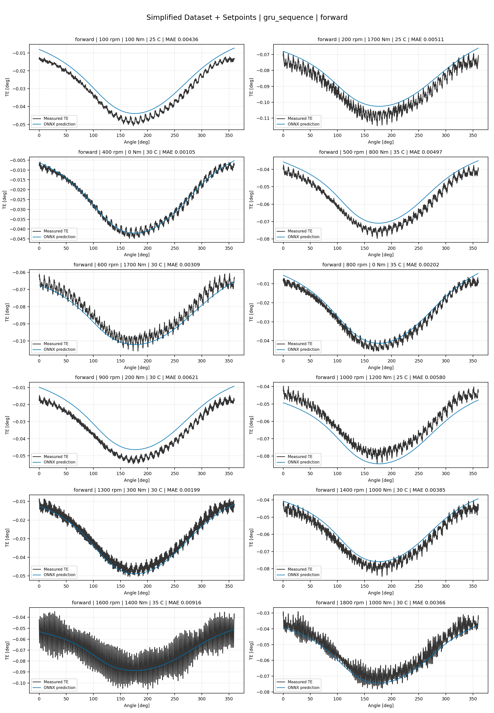
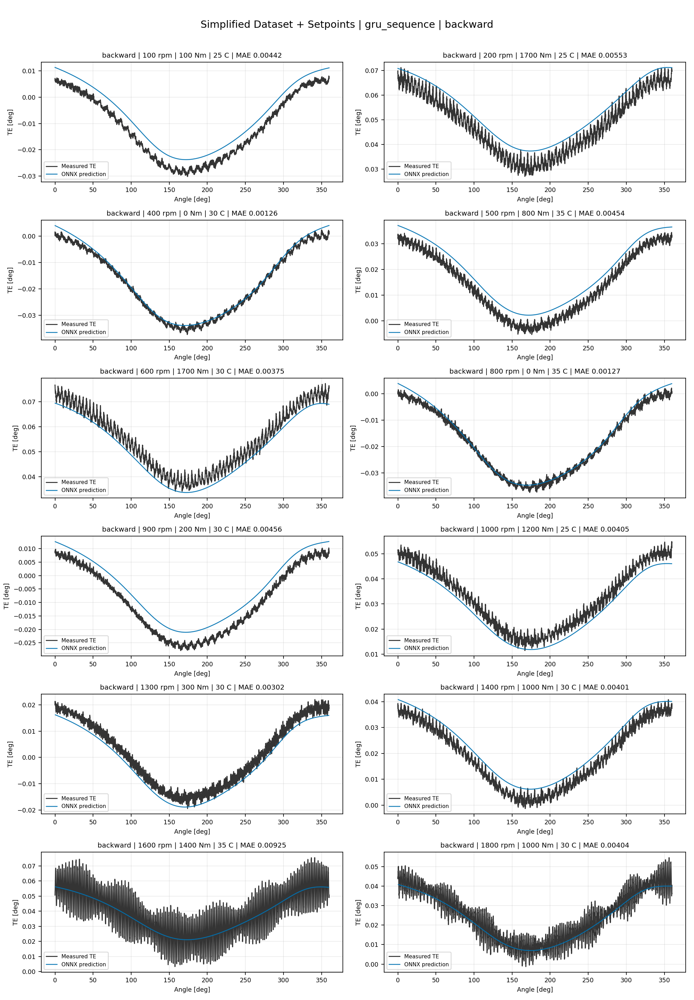
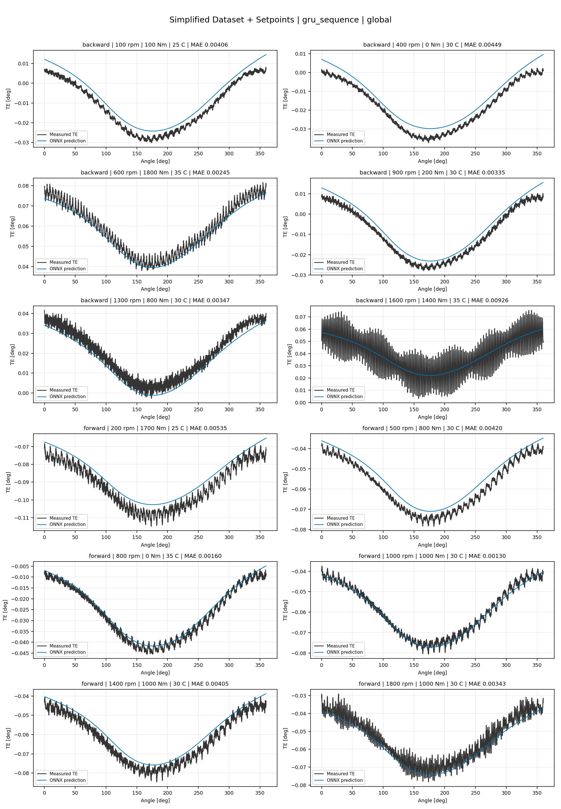
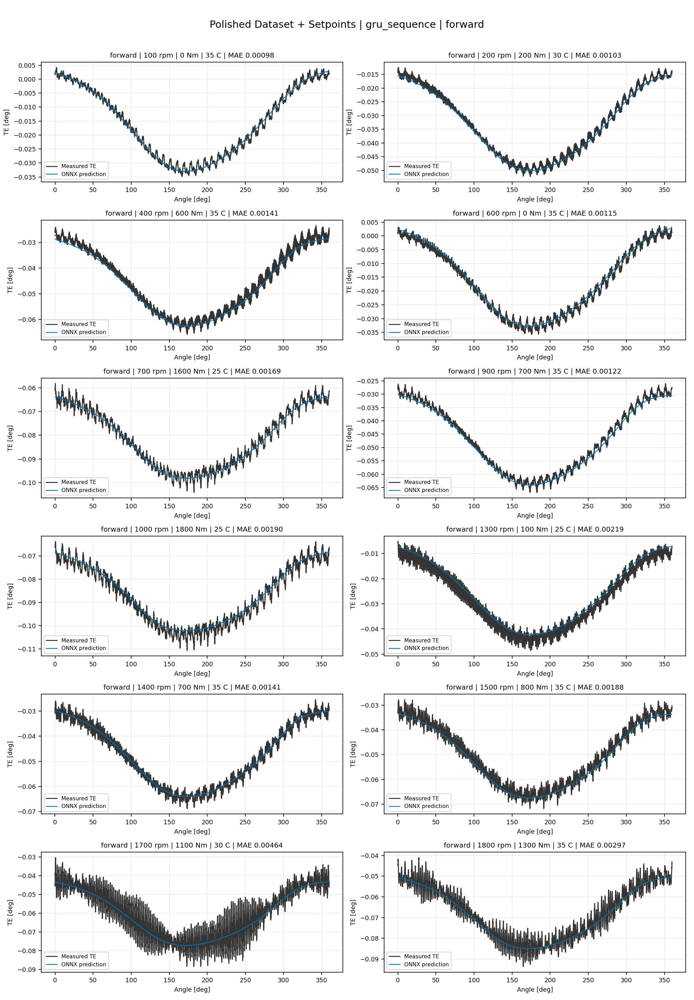
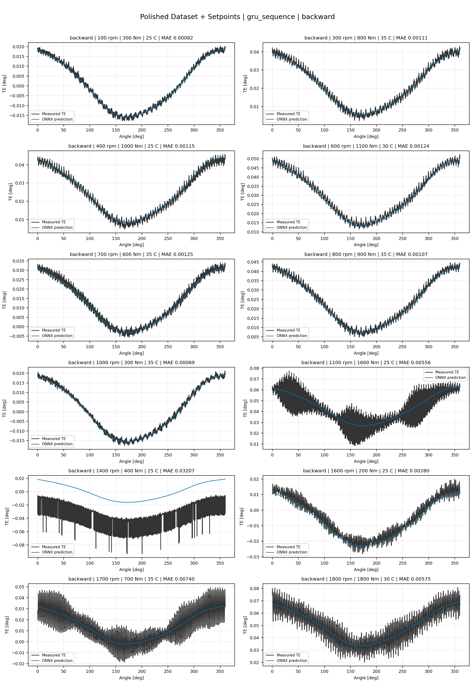
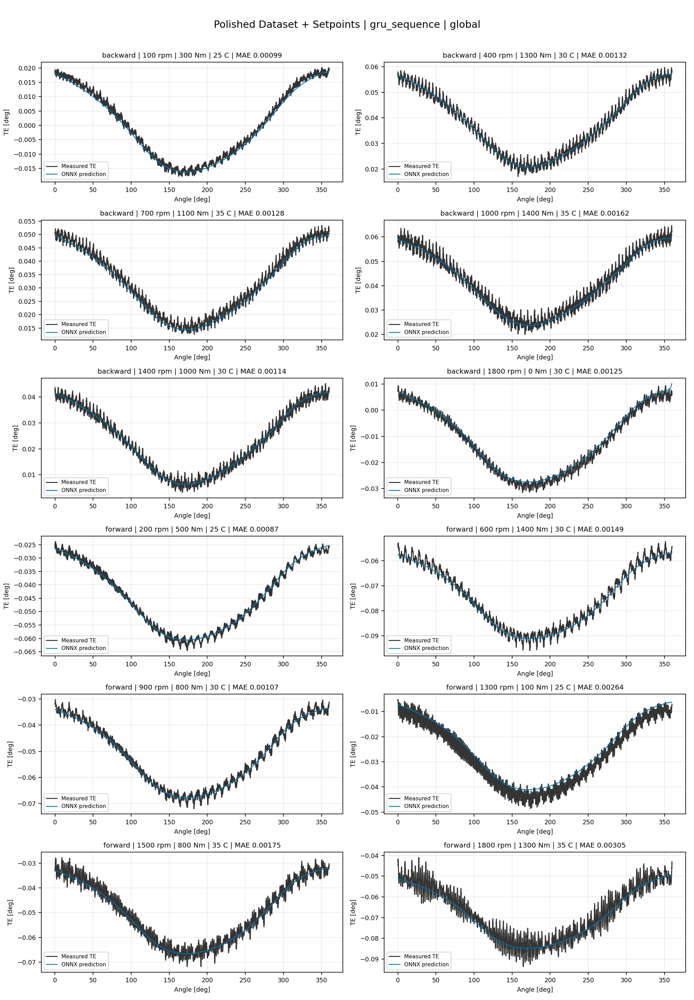
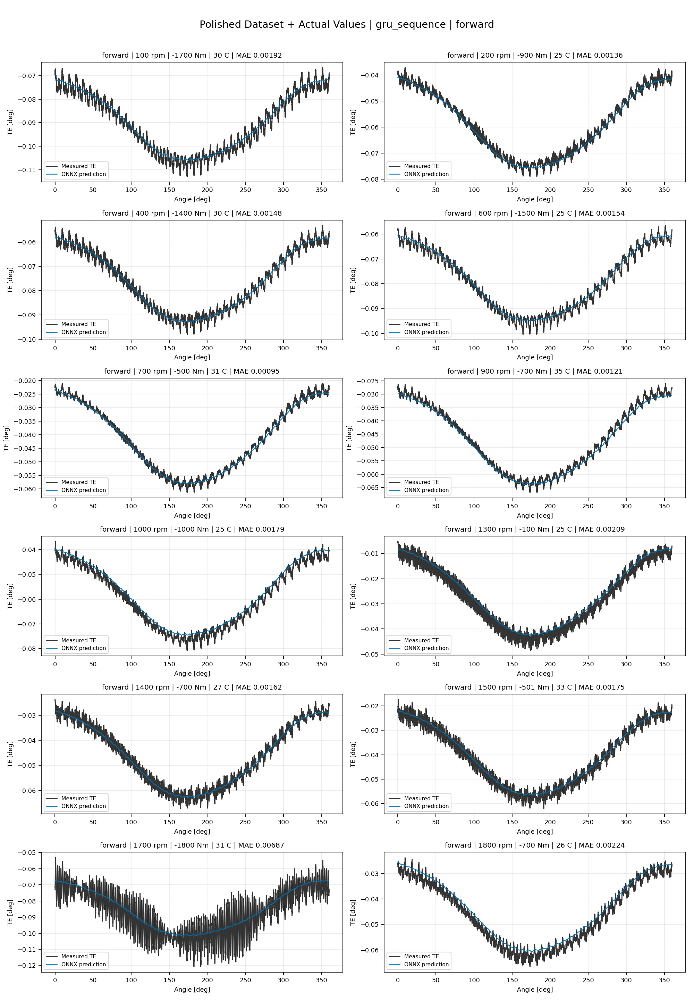
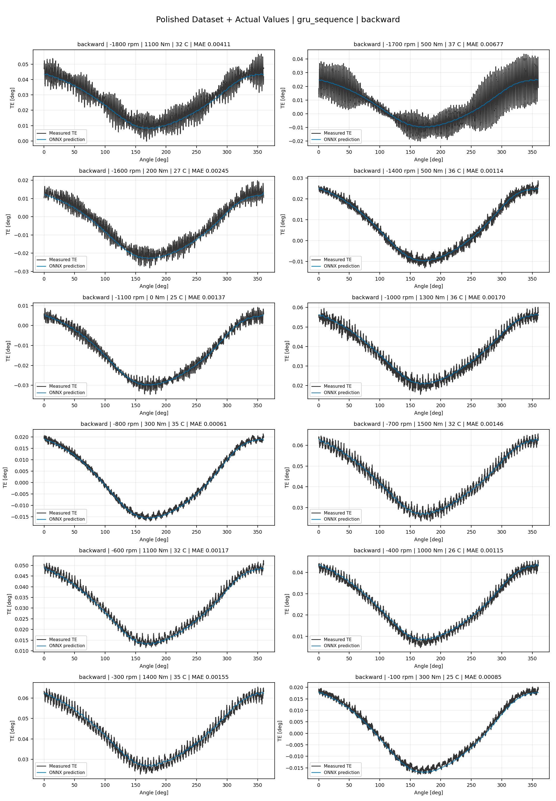
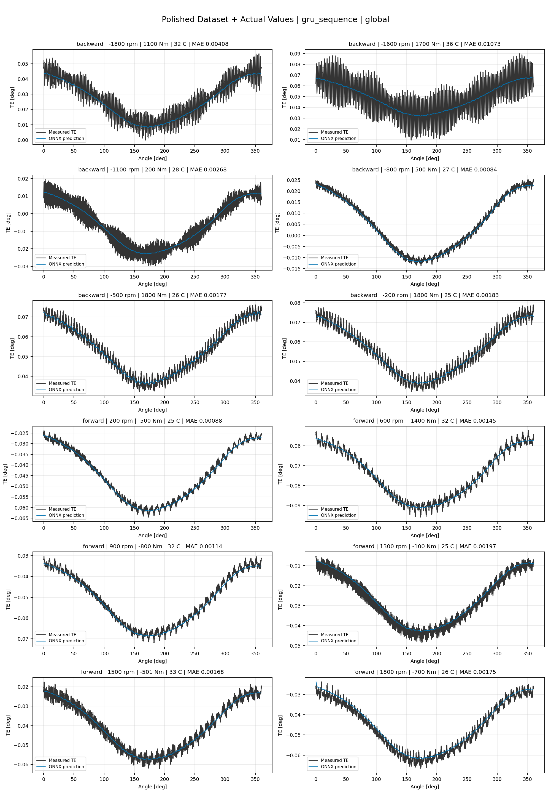

# TE Curve Verification Pipeline Familywise ONNX Report - gru_sequence

## Overview

This report evaluates exported ONNX models from the dataset input-mode
retraining program. Each dataset/input-mode section uses dataset-matched
held-out test curves and lists the exact model artifacts loaded from
`models/`.

Rank-3 temporal ONNX exports are evaluated on the sequence-window test
contract stored in each `training_config.snapshot.yaml`, including
`sequence_length`, `sequence_stride`, `sequence_target_position`, and
`maximum_sequences_per_curve`.
The collage pages keep the measured TE trace at the original full-curve
resolution; temporal ONNX predictions are overlaid at the evaluated
sequence-target angles.

The report is diagnostic and family-specific. It does not replace an
official multi-index model-promotion decision.

## Output Artifacts

- output directory: `output/validation_checks/track2_familywise_onnx_report/gru_sequence/2026-07-08-15-30-01__track2_gru_sequence_familywise_onnx_report`;
- summary YAML: `output/validation_checks/track2_familywise_onnx_report/gru_sequence/2026-07-08-15-30-01__track2_gru_sequence_familywise_onnx_report/track2_familywise_onnx_report_summary.yaml`;
- model inventory CSV: `output/validation_checks/track2_familywise_onnx_report/gru_sequence/2026-07-08-15-30-01__track2_gru_sequence_familywise_onnx_report/model_inventory.csv`;
- per-curve metrics CSV: `output/validation_checks/track2_familywise_onnx_report/gru_sequence/2026-07-08-15-30-01__track2_gru_sequence_familywise_onnx_report/per_curve_metrics.csv`.

## Simplified Dataset + Setpoints

- dataset: `simplified_dataset`;
- input mode: `setpoints`;
- evaluated family: `gru_sequence`;
- dataset root: `data/simplified_dataset`.

### Models Used

| Surface | Run Name | Run Instance | Dataset Schema |
| --- | --- | --- | --- |
| forward | `te_gru_sequence_fw__simplified_setpoints` | `2026-07-08-11-24-01__te_gru_sequence_fw__simplified_setpoints` | `simplified_curve_v1` |
| backward | `te_gru_sequence_bw__simplified_setpoints` | `2026-07-08-11-31-51__te_gru_sequence_bw__simplified_setpoints` | `simplified_curve_v1` |
| global | `te_gru_sequence_global__simplified_setpoints` | `2026-07-08-11-17-09__te_gru_sequence_global__simplified_setpoints` | `simplified_curve_v1` |

Exact model paths:

| Surface | ONNX Model Path | Python Model Path |
| --- | --- | --- |
| forward | `models/simplified_dataset/setpoints/gru_sequence/forward/onnx/model.onnx` | `models/simplified_dataset/setpoints/gru_sequence/forward/python/gru_sequence-epoch=043-val_mae=0.00375895.ckpt` |
| backward | `models/simplified_dataset/setpoints/gru_sequence/backward/onnx/model.onnx` | `models/simplified_dataset/setpoints/gru_sequence/backward/python/gru_sequence-epoch=132-val_mae=0.00366119.ckpt` |
| global | `models/simplified_dataset/setpoints/gru_sequence/global/onnx/model.onnx` | `models/simplified_dataset/setpoints/gru_sequence/global/python/gru_sequence-epoch=036-val_mae=0.00377716.ckpt` |

### Aggregate Metrics

| Surface | Curves | MAE [deg] | RMSE [deg] | Mean Error [%] | P95 Error [%] |
| --- | ---: | ---: | ---: | ---: | ---: |
| forward | 97 | 0.003389 | 0.003835 | 7.920 | 13.482 |
| backward | 97 | 0.003579 | 0.004014 | 8.280 | 13.823 |
| global | 194 | 0.003590 | 0.004049 | 8.375 | 15.044 |

Offset And Shape Metrics:

| Surface | Signed Offset [deg] | Absolute Offset [deg] | Centered MAE [deg] | P2P Error [deg] |
| --- | ---: | ---: | ---: | ---: |
| forward | 0.000006 | 0.002825 | 0.001764 | 0.005751 |
| backward | 0.000117 | 0.002885 | 0.001867 | 0.007078 |
| global | 0.000447 | 0.002928 | 0.001877 | 0.004880 |

### Forward 12-Curve Page

### Backward 12-Curve Page

### Global 12-Curve Page

## Polished Dataset + Setpoints

- dataset: `polished_dataset`;
- input mode: `setpoints`;
- evaluated family: `gru_sequence`;
- dataset root: `data/polished_dataset`.

### Models Used

| Surface | Run Name | Run Instance | Dataset Schema |
| --- | --- | --- | --- |
| forward | `te_gru_sequence_fw__polished_setpoints` | `2026-07-08-12-18-02__te_gru_sequence_fw__polished_setpoints` | `polished_setpoint_curve_v1` |
| backward | `te_gru_sequence_bw__polished_setpoints` | `2026-07-08-12-47-20__te_gru_sequence_bw__polished_setpoints` | `polished_setpoint_curve_v1` |
| global | `te_gru_sequence_global__polished_setpoints` | `2026-07-08-11-57-28__te_gru_sequence_global__polished_setpoints` | `polished_setpoint_curve_v1` |

Exact model paths:

| Surface | ONNX Model Path | Python Model Path |
| --- | --- | --- |
| forward | `models/polished_dataset/setpoints/gru_sequence/forward/onnx/model.onnx` | `models/polished_dataset/setpoints/gru_sequence/forward/python/gru_sequence-epoch=152-val_mae=0.00216223.ckpt` |
| backward | `models/polished_dataset/setpoints/gru_sequence/backward/onnx/model.onnx` | `models/polished_dataset/setpoints/gru_sequence/backward/python/gru_sequence-epoch=088-val_mae=0.00218293.ckpt` |
| global | `models/polished_dataset/setpoints/gru_sequence/global/onnx/model.onnx` | `models/polished_dataset/setpoints/gru_sequence/global/python/gru_sequence-epoch=091-val_mae=0.00217360.ckpt` |

### Aggregate Metrics

| Surface | Curves | MAE [deg] | RMSE [deg] | Mean Error [%] | P95 Error [%] |
| --- | ---: | ---: | ---: | ---: | ---: |
| forward | 100 | 0.002164 | 0.002622 | 4.783 | 9.796 |
| backward | 94 | 0.002719 | 0.003225 | 5.051 | 11.319 |
| global | 194 | 0.002474 | 0.002965 | 5.014 | 11.284 |

Offset And Shape Metrics:

| Surface | Signed Offset [deg] | Absolute Offset [deg] | Centered MAE [deg] | P2P Error [deg] |
| --- | ---: | ---: | ---: | ---: |
| forward | -0.000288 | 0.000956 | 0.001891 | 0.008608 |
| backward | 0.000301 | 0.000927 | 0.002372 | 0.009020 |
| global | -0.000029 | 0.000980 | 0.002137 | 0.008594 |

### Forward 12-Curve Page

### Backward 12-Curve Page

### Global 12-Curve Page

## Polished Dataset + Actual Values

- dataset: `polished_dataset`;
- input mode: `actual_values`;
- evaluated family: `gru_sequence`;
- dataset root: `data/polished_dataset`.

### Models Used

| Surface | Run Name | Run Instance | Dataset Schema |
| --- | --- | --- | --- |
| forward | `te_gru_sequence_fw__polished_actual_values` | `2026-07-08-13-44-26__te_gru_sequence_fw__polished_actual_values` | `polished_point_v1` |
| backward | `te_gru_sequence_bw__polished_actual_values` | `2026-07-08-14-10-34__te_gru_sequence_bw__polished_actual_values` | `polished_point_v1` |
| global | `te_gru_sequence_global__polished_actual_values` | `2026-07-08-13-16-43__te_gru_sequence_global__polished_actual_values` | `polished_point_v1` |

Exact model paths:

| Surface | ONNX Model Path | Python Model Path |
| --- | --- | --- |
| forward | `models/polished_dataset/actual_values/gru_sequence/forward/onnx/model.onnx` | `models/polished_dataset/actual_values/gru_sequence/forward/python/gru_sequence-epoch=149-val_mae=0.00216525.ckpt` |
| backward | `models/polished_dataset/actual_values/gru_sequence/backward/onnx/model.onnx` | `models/polished_dataset/actual_values/gru_sequence/backward/python/gru_sequence-epoch=172-val_mae=0.00214390.ckpt` |
| global | `models/polished_dataset/actual_values/gru_sequence/global/onnx/model.onnx` | `models/polished_dataset/actual_values/gru_sequence/global/python/gru_sequence-epoch=141-val_mae=0.00217238.ckpt` |

### Aggregate Metrics

| Surface | Curves | MAE [deg] | RMSE [deg] | Mean Error [%] | P95 Error [%] |
| --- | ---: | ---: | ---: | ---: | ---: |
| forward | 100 | 0.002077 | 0.002523 | 4.563 | 9.358 |
| backward | 94 | 0.002402 | 0.002923 | 4.643 | 11.025 |
| global | 194 | 0.002292 | 0.002776 | 4.743 | 11.055 |

Offset And Shape Metrics:

| Surface | Signed Offset [deg] | Absolute Offset [deg] | Centered MAE [deg] | P2P Error [deg] |
| --- | ---: | ---: | ---: | ---: |
| forward | -0.000019 | 0.000704 | 0.001906 | 0.008206 |
| backward | -0.000023 | 0.000503 | 0.002343 | 0.008235 |
| global | -0.000187 | 0.000726 | 0.002125 | 0.007934 |

### Forward 12-Curve Page

### Backward 12-Curve Page

### Global 12-Curve Page

