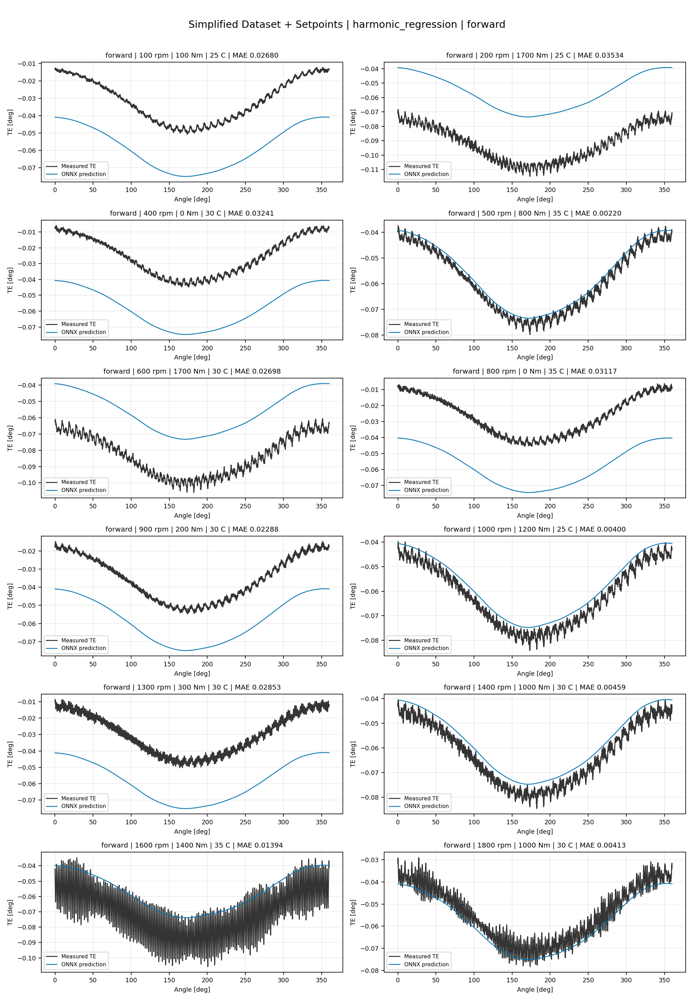
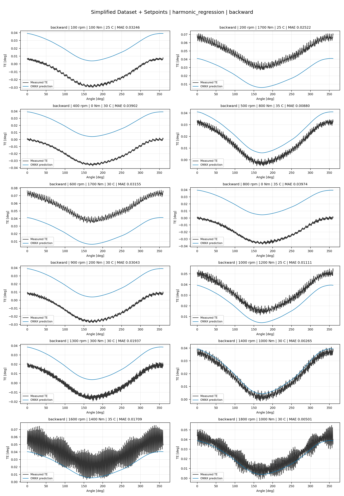
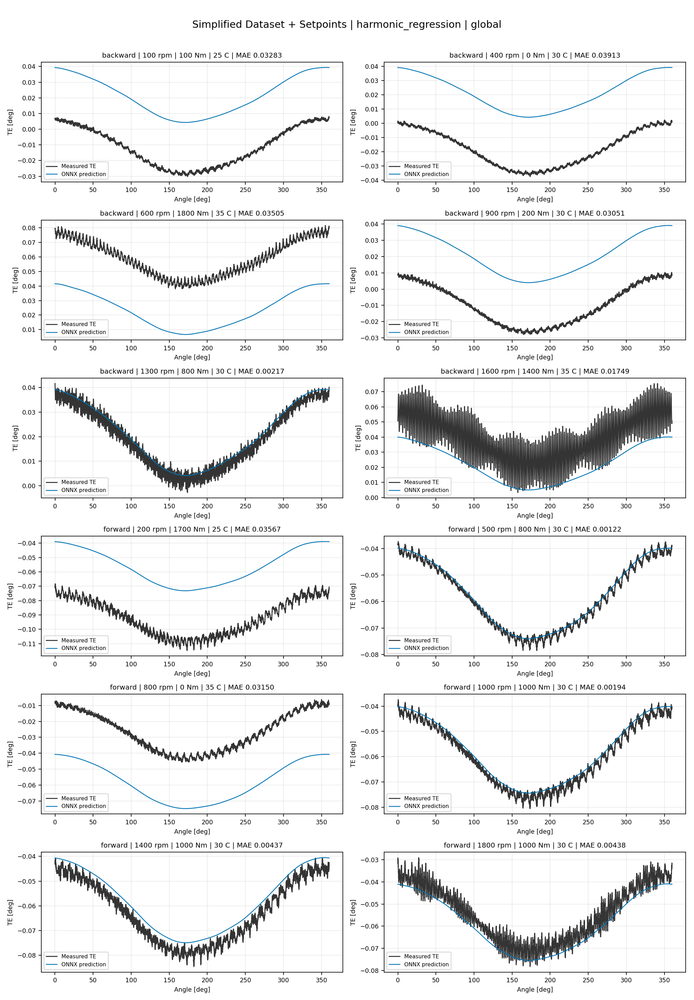
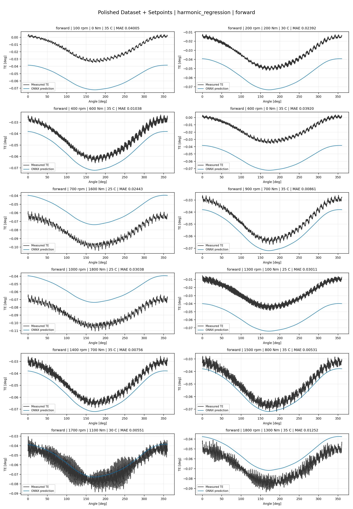
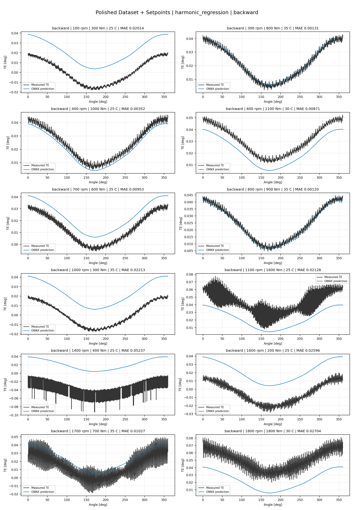
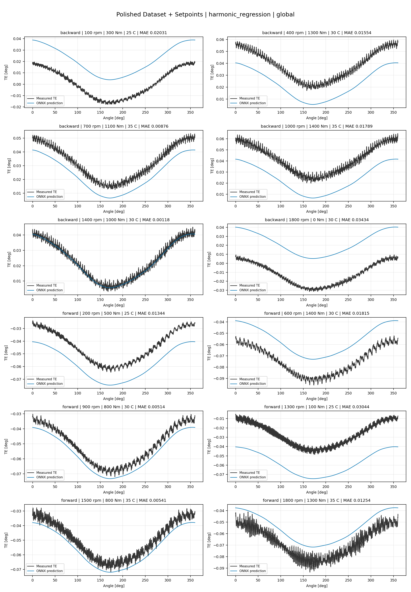
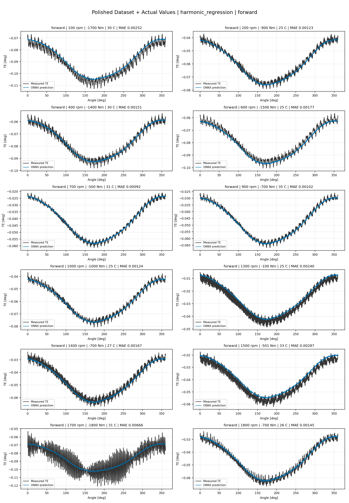
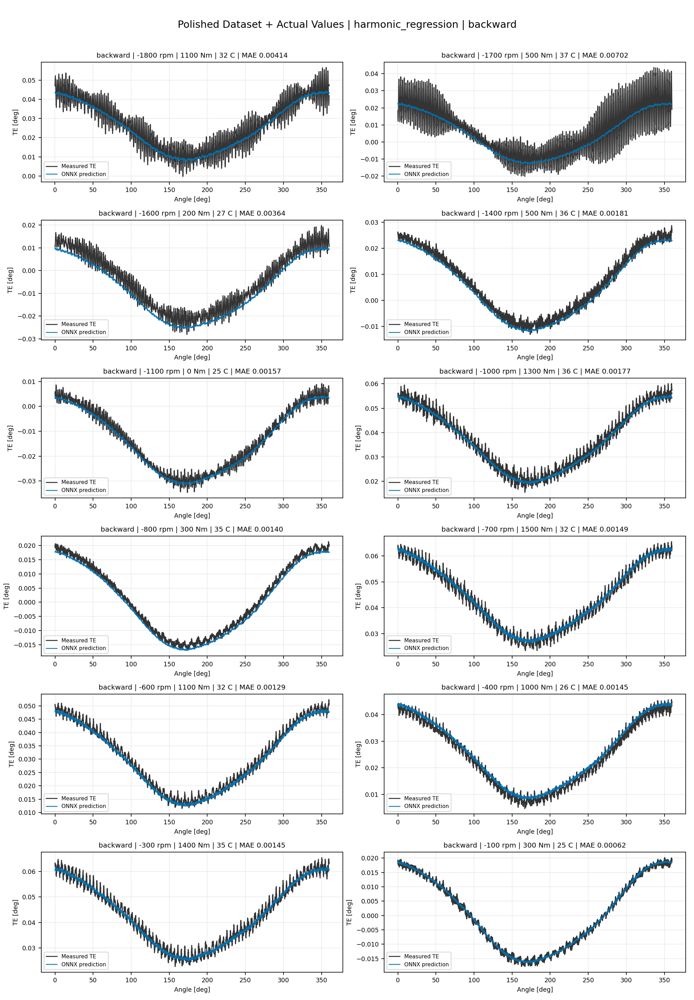
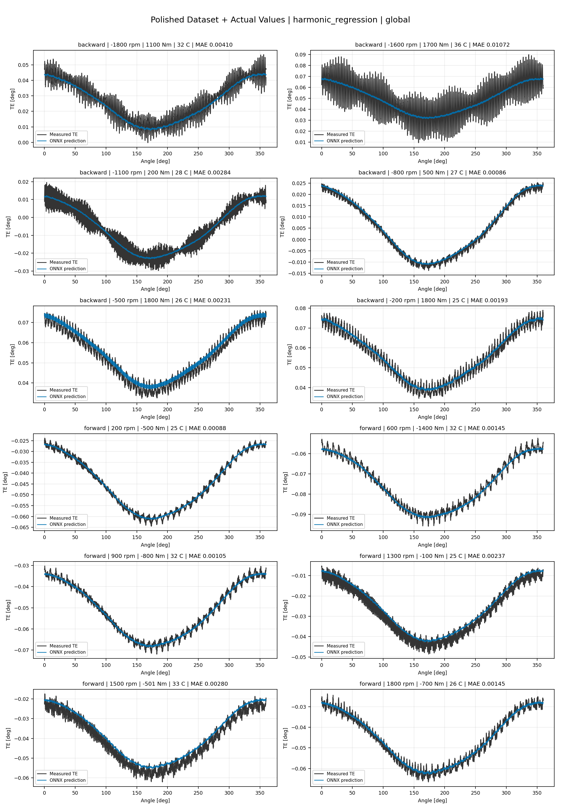

# TE Curve Verification Pipeline Familywise ONNX Report - harmonic_regression

## Overview

This report evaluates exported ONNX models from the dataset input-mode
retraining program. Each dataset/input-mode section uses dataset-matched
held-out test curves and lists the exact model artifacts loaded from
`models/`.

The report is diagnostic and family-specific. It does not replace an
official multi-index model-promotion decision.

## Output Artifacts

- output directory: `output/validation_checks/track2_familywise_onnx_report/harmonic_regression/2026-07-08-09-24-54__track2_harmonic_regression_familywise_onnx_report`;
- summary YAML: `output/validation_checks/track2_familywise_onnx_report/harmonic_regression/2026-07-08-09-24-54__track2_harmonic_regression_familywise_onnx_report/track2_familywise_onnx_report_summary.yaml`;
- model inventory CSV: `output/validation_checks/track2_familywise_onnx_report/harmonic_regression/2026-07-08-09-24-54__track2_harmonic_regression_familywise_onnx_report/model_inventory.csv`;
- per-curve metrics CSV: `output/validation_checks/track2_familywise_onnx_report/harmonic_regression/2026-07-08-09-24-54__track2_harmonic_regression_familywise_onnx_report/per_curve_metrics.csv`.

## Simplified Dataset + Setpoints

- dataset: `simplified_dataset`;
- input mode: `setpoints`;
- evaluated family: `harmonic_regression`;
- dataset root: `data/simplified_dataset`.

### Models Used

| Surface | Run Name | Run Instance | Dataset Schema |
| --- | --- | --- | --- |
| forward | `te_harmonic_regression_fw__simplified_setpoints` | `2026-07-07-22-54-59__te_harmonic_regression_fw__simplified_setpoints` | `simplified_curve_v1` |
| backward | `te_harmonic_regression_bw__simplified_setpoints` | `2026-07-07-23-01-08__te_harmonic_regression_bw__simplified_setpoints` | `simplified_curve_v1` |
| global | `te_harmonic_regression_global__simplified_setpoints` | `2026-07-07-22-48-30__te_harmonic_regression_global__simplified_setpoints` | `simplified_curve_v1` |

Exact model paths:

| Surface | ONNX Model Path | Python Model Path |
| --- | --- | --- |
| forward | `models/simplified_dataset/setpoints/exported/harmonic_regression/forward/2026-07-07-22-54-59__te_harmonic_regression_fw__simplified_setpoints/onnx/model.onnx` | `models/simplified_dataset/setpoints/exported/harmonic_regression/forward/2026-07-07-22-54-59__te_harmonic_regression_fw__simplified_setpoints/python/harmonic_regression-epoch=033-val_mae=0.01699562.ckpt` |
| backward | `models/simplified_dataset/setpoints/exported/harmonic_regression/backward/2026-07-07-23-01-08__te_harmonic_regression_bw__simplified_setpoints/onnx/model.onnx` | `models/simplified_dataset/setpoints/exported/harmonic_regression/backward/2026-07-07-23-01-08__te_harmonic_regression_bw__simplified_setpoints/python/harmonic_regression-epoch=060-val_mae=0.01698885.ckpt` |
| global | `models/simplified_dataset/setpoints/exported/harmonic_regression/global/2026-07-07-22-48-30__te_harmonic_regression_global__simplified_setpoints/onnx/model.onnx` | `models/simplified_dataset/setpoints/exported/harmonic_regression/global/2026-07-07-22-48-30__te_harmonic_regression_global__simplified_setpoints/python/harmonic_regression-epoch=063-val_mae=0.01699328.ckpt` |

### Aggregate Metrics

| Surface | Curves | MAE [deg] | RMSE [deg] | Mean Error [%] | P95 Error [%] |
| --- | ---: | ---: | ---: | ---: | ---: |
| forward | 97 | 0.018064 | 0.018299 | 41.176 | 78.839 |
| backward | 97 | 0.017958 | 0.018234 | 41.314 | 85.556 |
| global | 194 | 0.018080 | 0.018336 | 41.405 | 81.780 |

Offset And Shape Metrics:

| Surface | Signed Offset [deg] | Absolute Offset [deg] | Centered MAE [deg] | P2P Error [deg] |
| --- | ---: | ---: | ---: | ---: |
| forward | 0.001165 | 0.017990 | 0.001686 | 0.010423 |
| backward | -0.000835 | 0.017779 | 0.001819 | 0.009625 |
| global | 0.000126 | 0.017954 | 0.001754 | 0.009988 |

### Forward 12-Curve Page

### Backward 12-Curve Page

### Global 12-Curve Page

## Polished Dataset + Setpoints

- dataset: `polished_dataset`;
- input mode: `setpoints`;
- evaluated family: `harmonic_regression`;
- dataset root: `data/polished_dataset`.

### Models Used

| Surface | Run Name | Run Instance | Dataset Schema |
| --- | --- | --- | --- |
| forward | `te_harmonic_regression_fw__polished_setpoints` | `2026-07-07-23-29-07__te_harmonic_regression_fw__polished_setpoints` | `polished_setpoint_curve_v1` |
| backward | `te_harmonic_regression_bw__polished_setpoints` | `2026-07-07-23-39-40__te_harmonic_regression_bw__polished_setpoints` | `polished_setpoint_curve_v1` |
| global | `te_harmonic_regression_global__polished_setpoints` | `2026-07-07-23-18-16__te_harmonic_regression_global__polished_setpoints` | `polished_setpoint_curve_v1` |

Exact model paths:

| Surface | ONNX Model Path | Python Model Path |
| --- | --- | --- |
| forward | `models/polished_dataset/setpoints/exported/harmonic_regression/forward/2026-07-07-23-29-07__te_harmonic_regression_fw__polished_setpoints/onnx/model.onnx` | `models/polished_dataset/setpoints/exported/harmonic_regression/forward/2026-07-07-23-29-07__te_harmonic_regression_fw__polished_setpoints/python/harmonic_regression-epoch=032-val_mae=0.01714993.ckpt` |
| backward | `models/polished_dataset/setpoints/exported/harmonic_regression/backward/2026-07-07-23-39-40__te_harmonic_regression_bw__polished_setpoints/onnx/model.onnx` | `models/polished_dataset/setpoints/exported/harmonic_regression/backward/2026-07-07-23-39-40__te_harmonic_regression_bw__polished_setpoints/python/harmonic_regression-epoch=044-val_mae=0.01715066.ckpt` |
| global | `models/polished_dataset/setpoints/exported/harmonic_regression/global/2026-07-07-23-18-16__te_harmonic_regression_global__polished_setpoints/onnx/model.onnx` | `models/polished_dataset/setpoints/exported/harmonic_regression/global/2026-07-07-23-18-16__te_harmonic_regression_global__polished_setpoints/python/harmonic_regression-epoch=038-val_mae=0.01714113.ckpt` |

### Aggregate Metrics

| Surface | Curves | MAE [deg] | RMSE [deg] | Mean Error [%] | P95 Error [%] |
| --- | ---: | ---: | ---: | ---: | ---: |
| forward | 100 | 0.017220 | 0.017494 | 38.404 | 78.948 |
| backward | 94 | 0.017408 | 0.017823 | 37.675 | 77.694 |
| global | 194 | 0.017346 | 0.017688 | 38.151 | 77.969 |

Offset And Shape Metrics:

| Surface | Signed Offset [deg] | Absolute Offset [deg] | Centered MAE [deg] | P2P Error [deg] |
| --- | ---: | ---: | ---: | ---: |
| forward | -0.002228 | 0.017014 | 0.001923 | 0.011496 |
| backward | 0.002071 | 0.017259 | 0.002351 | 0.011906 |
| global | -0.000175 | 0.017164 | 0.002131 | 0.011713 |

### Forward 12-Curve Page

### Backward 12-Curve Page

### Global 12-Curve Page

## Polished Dataset + Actual Values

- dataset: `polished_dataset`;
- input mode: `actual_values`;
- evaluated family: `harmonic_regression`;
- dataset root: `data/polished_dataset`.

### Models Used

| Surface | Run Name | Run Instance | Dataset Schema |
| --- | --- | --- | --- |
| forward | `te_harmonic_regression_fw__polished_actual_values` | `2026-07-08-00-15-14__te_harmonic_regression_fw__polished_actual_values` | `polished_point_v1` |
| backward | `te_harmonic_regression_bw__polished_actual_values` | `2026-07-08-00-32-21__te_harmonic_regression_bw__polished_actual_values` | `polished_point_v1` |
| global | `te_harmonic_regression_global__polished_actual_values` | `2026-07-08-00-01-16__te_harmonic_regression_global__polished_actual_values` | `polished_point_v1` |

Exact model paths:

| Surface | ONNX Model Path | Python Model Path |
| --- | --- | --- |
| forward | `models/polished_dataset/actual_values/exported/harmonic_regression/forward/2026-07-08-00-15-14__te_harmonic_regression_fw__polished_actual_values/onnx/model.onnx` | `models/polished_dataset/actual_values/exported/harmonic_regression/forward/2026-07-08-00-15-14__te_harmonic_regression_fw__polished_actual_values/python/harmonic_regression-epoch=073-val_mae=0.00182314.ckpt` |
| backward | `models/polished_dataset/actual_values/exported/harmonic_regression/backward/2026-07-08-00-32-21__te_harmonic_regression_bw__polished_actual_values/onnx/model.onnx` | `models/polished_dataset/actual_values/exported/harmonic_regression/backward/2026-07-08-00-32-21__te_harmonic_regression_bw__polished_actual_values/python/harmonic_regression-epoch=054-val_mae=0.00182643.ckpt` |
| global | `models/polished_dataset/actual_values/exported/harmonic_regression/global/2026-07-08-00-01-16__te_harmonic_regression_global__polished_actual_values/onnx/model.onnx` | `models/polished_dataset/actual_values/exported/harmonic_regression/global/2026-07-08-00-01-16__te_harmonic_regression_global__polished_actual_values/python/harmonic_regression-epoch=053-val_mae=0.00182331.ckpt` |

### Aggregate Metrics

| Surface | Curves | MAE [deg] | RMSE [deg] | Mean Error [%] | P95 Error [%] |
| --- | ---: | ---: | ---: | ---: | ---: |
| forward | 100 | 0.002355 | 0.002816 | 4.909 | 10.791 |
| backward | 94 | 0.002966 | 0.003511 | 5.369 | 10.974 |
| global | 194 | 0.002638 | 0.003138 | 5.101 | 10.859 |

Offset And Shape Metrics:

| Surface | Signed Offset [deg] | Absolute Offset [deg] | Centered MAE [deg] | P2P Error [deg] |
| --- | ---: | ---: | ---: | ---: |
| forward | 0.000051 | 0.001141 | 0.001938 | 0.010400 |
| backward | -0.000118 | 0.001507 | 0.002402 | 0.010750 |
| global | 0.000031 | 0.001289 | 0.002162 | 0.010711 |

### Forward 12-Curve Page

### Backward 12-Curve Page

### Global 12-Curve Page

