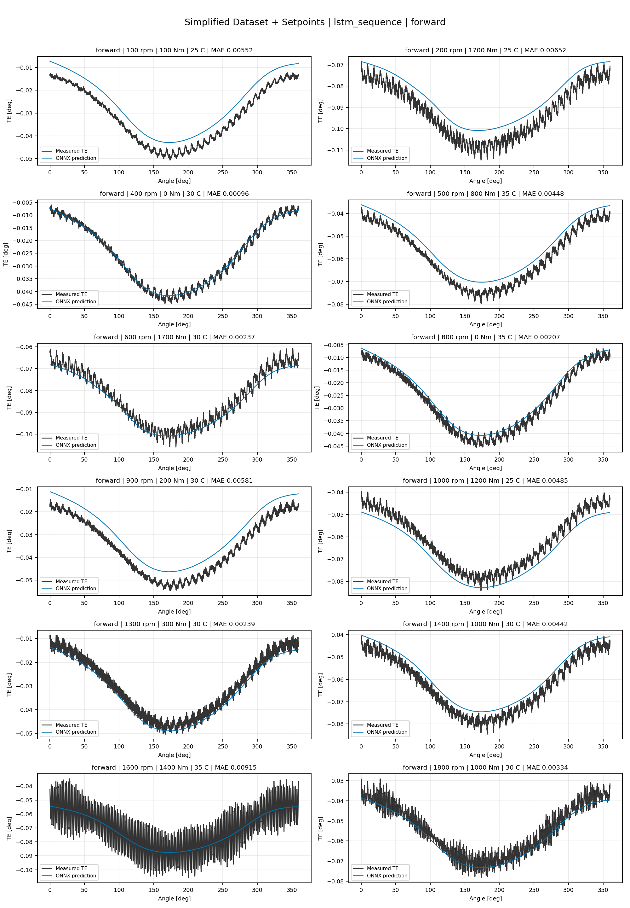
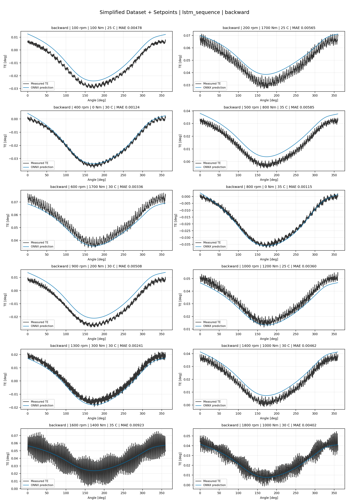
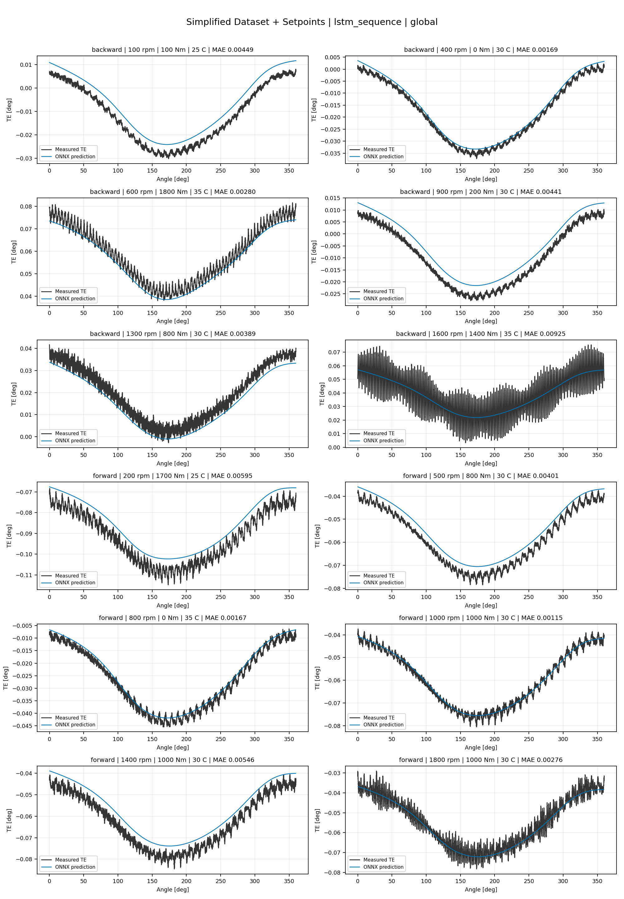
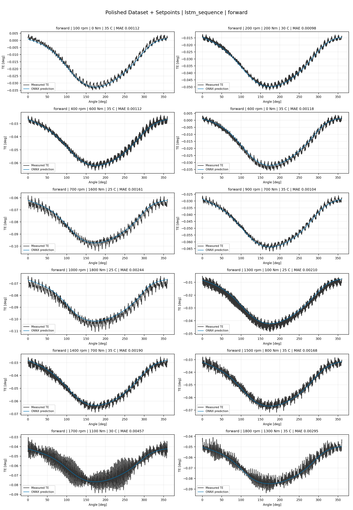
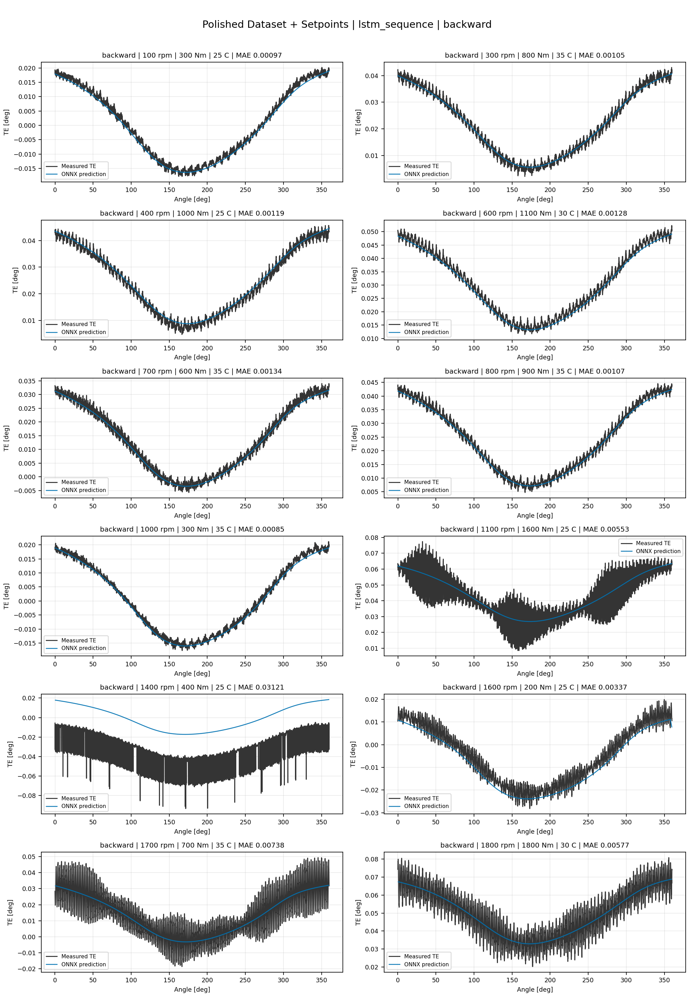
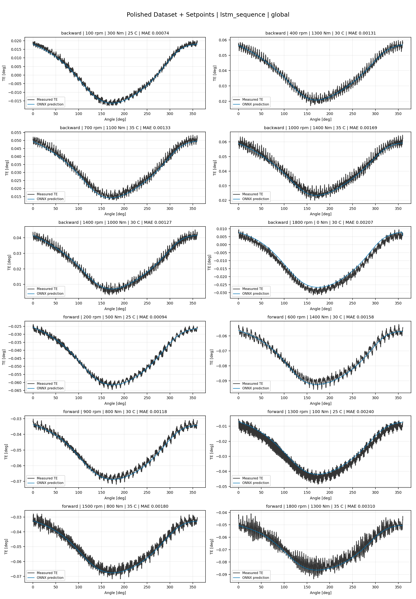
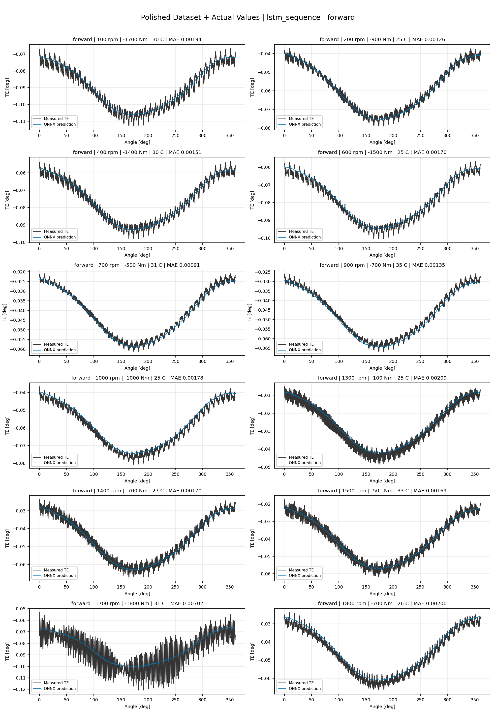
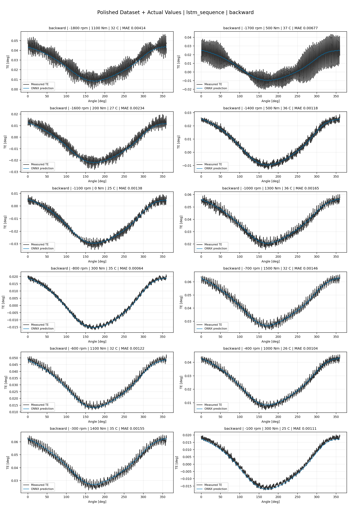
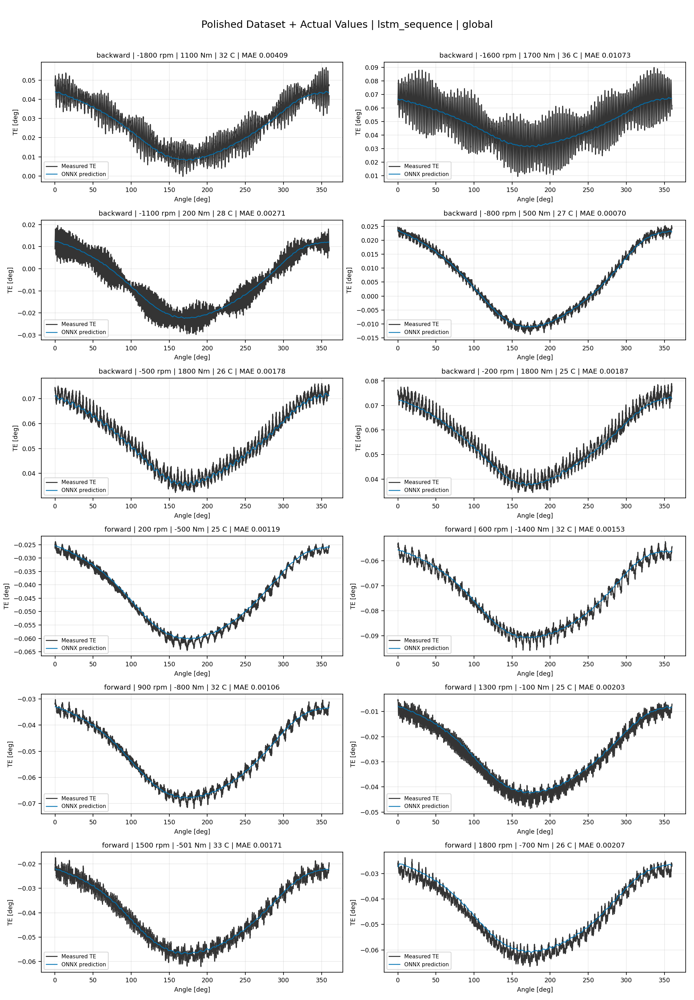

# TE Curve Verification Pipeline Familywise ONNX Report - lstm_sequence

## Overview

This report evaluates exported ONNX models from the dataset input-mode
retraining program. Each dataset/input-mode section uses dataset-matched
held-out test curves and lists the exact model artifacts loaded from
`models/`.

Rank-3 temporal ONNX exports are evaluated on the sequence-window test
contract stored in each `training_config.snapshot.yaml`, including
`sequence_length`, `sequence_stride`, `sequence_target_position`, and
`maximum_sequences_per_curve`.
The collage pages keep the measured TE trace at the original full-curve
resolution; temporal ONNX predictions are overlaid at the evaluated
sequence-target angles.

The report is diagnostic and family-specific. It does not replace an
official multi-index model-promotion decision.

## Output Artifacts

- output directory: `output/validation_checks/track2_familywise_onnx_report/lstm_sequence/2026-07-08-23-29-14__track2_lstm_sequence_familywise_onnx_report`;
- summary YAML: `output/validation_checks/track2_familywise_onnx_report/lstm_sequence/2026-07-08-23-29-14__track2_lstm_sequence_familywise_onnx_report/track2_familywise_onnx_report_summary.yaml`;
- model inventory CSV: `output/validation_checks/track2_familywise_onnx_report/lstm_sequence/2026-07-08-23-29-14__track2_lstm_sequence_familywise_onnx_report/model_inventory.csv`;
- per-curve metrics CSV: `output/validation_checks/track2_familywise_onnx_report/lstm_sequence/2026-07-08-23-29-14__track2_lstm_sequence_familywise_onnx_report/per_curve_metrics.csv`.

## Simplified Dataset + Setpoints

- dataset: `simplified_dataset`;
- input mode: `setpoints`;
- evaluated family: `lstm_sequence`;
- dataset root: `data/simplified_dataset`.

### Models Used

| Surface | Run Name | Run Instance | Dataset Schema |
| --- | --- | --- | --- |
| forward | `te_lstm_sequence_fw__simplified_setpoints` | `2026-07-08-15-14-13__te_lstm_sequence_fw__simplified_setpoints` | `simplified_curve_v1` |
| backward | `te_lstm_sequence_bw__simplified_setpoints` | `2026-07-08-15-24-03__te_lstm_sequence_bw__simplified_setpoints` | `simplified_curve_v1` |
| global | `te_lstm_sequence_global__simplified_setpoints` | `2026-07-08-14-59-31__te_lstm_sequence_global__simplified_setpoints` | `simplified_curve_v1` |

Exact model paths:

| Surface | ONNX Model Path | Python Model Path |
| --- | --- | --- |
| forward | `models/simplified_dataset/setpoints/exported/lstm_sequence/forward/2026-07-08-15-14-13__te_lstm_sequence_fw__simplified_setpoints/onnx/model.onnx` | `models/simplified_dataset/setpoints/exported/lstm_sequence/forward/2026-07-08-15-14-13__te_lstm_sequence_fw__simplified_setpoints/python/lstm_sequence-epoch=092-val_mae=0.00370236.ckpt` |
| backward | `models/simplified_dataset/setpoints/exported/lstm_sequence/backward/2026-07-08-15-24-03__te_lstm_sequence_bw__simplified_setpoints/onnx/model.onnx` | `models/simplified_dataset/setpoints/exported/lstm_sequence/backward/2026-07-08-15-24-03__te_lstm_sequence_bw__simplified_setpoints/python/lstm_sequence-epoch=091-val_mae=0.00367749.ckpt` |
| global | `models/simplified_dataset/setpoints/exported/lstm_sequence/global/2026-07-08-14-59-31__te_lstm_sequence_global__simplified_setpoints/onnx/model.onnx` | `models/simplified_dataset/setpoints/exported/lstm_sequence/global/2026-07-08-14-59-31__te_lstm_sequence_global__simplified_setpoints/python/lstm_sequence-epoch=115-val_mae=0.00369210.ckpt` |

### Aggregate Metrics

| Surface | Curves | MAE [deg] | RMSE [deg] | Mean Error [%] | P95 Error [%] |
| --- | ---: | ---: | ---: | ---: | ---: |
| forward | 97 | 0.003491 | 0.003916 | 8.190 | 15.462 |
| backward | 97 | 0.003584 | 0.004038 | 8.305 | 15.374 |
| global | 194 | 0.003446 | 0.003867 | 8.014 | 13.715 |

Offset And Shape Metrics:

| Surface | Signed Offset [deg] | Absolute Offset [deg] | Centered MAE [deg] | P2P Error [deg] |
| --- | ---: | ---: | ---: | ---: |
| forward | 0.000662 | 0.002947 | 0.001703 | 0.008429 |
| backward | 0.000626 | 0.002837 | 0.001903 | 0.007710 |
| global | 0.000386 | 0.002792 | 0.001776 | 0.007126 |

### Forward 12-Curve Page

### Backward 12-Curve Page

### Global 12-Curve Page

## Polished Dataset + Setpoints

- dataset: `polished_dataset`;
- input mode: `setpoints`;
- evaluated family: `lstm_sequence`;
- dataset root: `data/polished_dataset`.

### Models Used

| Surface | Run Name | Run Instance | Dataset Schema |
| --- | --- | --- | --- |
| forward | `te_lstm_sequence_fw__polished_setpoints` | `2026-07-08-16-05-59__te_lstm_sequence_fw__polished_setpoints` | `polished_setpoint_curve_v1` |
| backward | `te_lstm_sequence_bw__polished_setpoints` | `2026-07-08-16-21-04__te_lstm_sequence_bw__polished_setpoints` | `polished_setpoint_curve_v1` |
| global | `te_lstm_sequence_global__polished_setpoints` | `2026-07-08-15-45-54__te_lstm_sequence_global__polished_setpoints` | `polished_setpoint_curve_v1` |

Exact model paths:

| Surface | ONNX Model Path | Python Model Path |
| --- | --- | --- |
| forward | `models/polished_dataset/setpoints/exported/lstm_sequence/forward/2026-07-08-16-05-59__te_lstm_sequence_fw__polished_setpoints/onnx/model.onnx` | `models/polished_dataset/setpoints/exported/lstm_sequence/forward/2026-07-08-16-05-59__te_lstm_sequence_fw__polished_setpoints/python/lstm_sequence-epoch=078-val_mae=0.00219094.ckpt` |
| backward | `models/polished_dataset/setpoints/exported/lstm_sequence/backward/2026-07-08-16-21-04__te_lstm_sequence_bw__polished_setpoints/onnx/model.onnx` | `models/polished_dataset/setpoints/exported/lstm_sequence/backward/2026-07-08-16-21-04__te_lstm_sequence_bw__polished_setpoints/python/lstm_sequence-epoch=070-val_mae=0.00219971.ckpt` |
| global | `models/polished_dataset/setpoints/exported/lstm_sequence/global/2026-07-08-15-45-54__te_lstm_sequence_global__polished_setpoints/onnx/model.onnx` | `models/polished_dataset/setpoints/exported/lstm_sequence/global/2026-07-08-15-45-54__te_lstm_sequence_global__polished_setpoints/python/lstm_sequence-epoch=118-val_mae=0.00218648.ckpt` |

### Aggregate Metrics

| Surface | Curves | MAE [deg] | RMSE [deg] | Mean Error [%] | P95 Error [%] |
| --- | ---: | ---: | ---: | ---: | ---: |
| forward | 100 | 0.002222 | 0.002682 | 4.922 | 9.879 |
| backward | 94 | 0.002739 | 0.003246 | 5.110 | 11.311 |
| global | 194 | 0.002470 | 0.002950 | 4.999 | 11.303 |

Offset And Shape Metrics:

| Surface | Signed Offset [deg] | Absolute Offset [deg] | Centered MAE [deg] | P2P Error [deg] |
| --- | ---: | ---: | ---: | ---: |
| forward | 0.000290 | 0.000991 | 0.001905 | 0.007869 |
| backward | 0.000011 | 0.000958 | 0.002377 | 0.008768 |
| global | 0.000065 | 0.001013 | 0.002136 | 0.008355 |

### Forward 12-Curve Page

### Backward 12-Curve Page

### Global 12-Curve Page

## Polished Dataset + Actual Values

- dataset: `polished_dataset`;
- input mode: `actual_values`;
- evaluated family: `lstm_sequence`;
- dataset root: `data/polished_dataset`.

### Models Used

| Surface | Run Name | Run Instance | Dataset Schema |
| --- | --- | --- | --- |
| forward | `te_lstm_sequence_fw__polished_actual_values` | `2026-07-08-17-20-19__te_lstm_sequence_fw__polished_actual_values` | `polished_point_v1` |
| backward | `te_lstm_sequence_bw__polished_actual_values` | `2026-07-08-18-02-26__te_lstm_sequence_bw__polished_actual_values` | `polished_point_v1` |
| global | `te_lstm_sequence_global__polished_actual_values` | `2026-07-08-16-51-13__te_lstm_sequence_global__polished_actual_values` | `polished_point_v1` |

Exact model paths:

| Surface | ONNX Model Path | Python Model Path |
| --- | --- | --- |
| forward | `models/polished_dataset/actual_values/exported/lstm_sequence/forward/2026-07-08-17-20-19__te_lstm_sequence_fw__polished_actual_values/onnx/model.onnx` | `models/polished_dataset/actual_values/exported/lstm_sequence/forward/2026-07-08-17-20-19__te_lstm_sequence_fw__polished_actual_values/python/lstm_sequence-epoch=210-val_mae=0.00215124.ckpt` |
| backward | `models/polished_dataset/actual_values/exported/lstm_sequence/backward/2026-07-08-18-02-26__te_lstm_sequence_bw__polished_actual_values/onnx/model.onnx` | `models/polished_dataset/actual_values/exported/lstm_sequence/backward/2026-07-08-18-02-26__te_lstm_sequence_bw__polished_actual_values/python/lstm_sequence-epoch=240-val_mae=0.00214547.ckpt` |
| global | `models/polished_dataset/actual_values/exported/lstm_sequence/global/2026-07-08-16-51-13__te_lstm_sequence_global__polished_actual_values/onnx/model.onnx` | `models/polished_dataset/actual_values/exported/lstm_sequence/global/2026-07-08-16-51-13__te_lstm_sequence_global__polished_actual_values/python/lstm_sequence-epoch=160-val_mae=0.00218895.ckpt` |

### Aggregate Metrics

| Surface | Curves | MAE [deg] | RMSE [deg] | Mean Error [%] | P95 Error [%] |
| --- | ---: | ---: | ---: | ---: | ---: |
| forward | 100 | 0.002071 | 0.002521 | 4.543 | 9.394 |
| backward | 94 | 0.002424 | 0.002946 | 4.688 | 11.020 |
| global | 194 | 0.002281 | 0.002770 | 4.710 | 10.519 |

Offset And Shape Metrics:

| Surface | Signed Offset [deg] | Absolute Offset [deg] | Centered MAE [deg] | P2P Error [deg] |
| --- | ---: | ---: | ---: | ---: |
| forward | 0.000058 | 0.000707 | 0.001914 | 0.007964 |
| backward | -0.000063 | 0.000527 | 0.002352 | 0.008308 |
| global | 0.000144 | 0.000685 | 0.002126 | 0.007977 |

### Forward 12-Curve Page

### Backward 12-Curve Page

### Global 12-Curve Page

