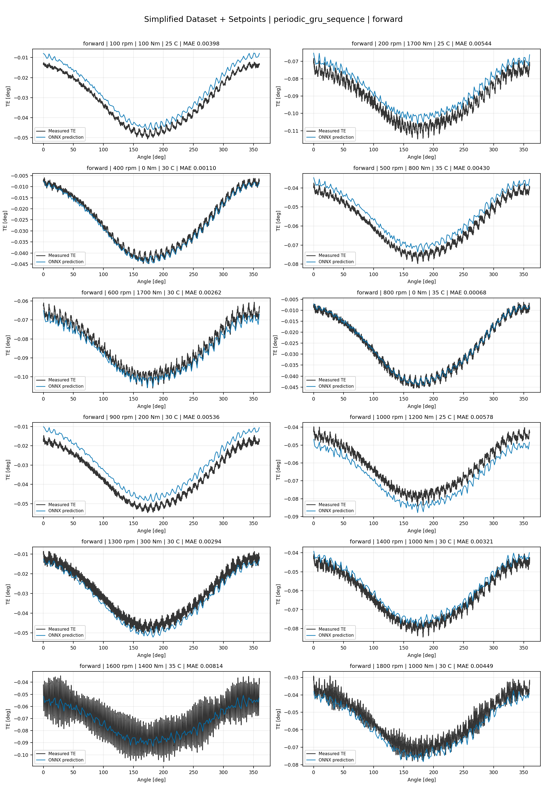
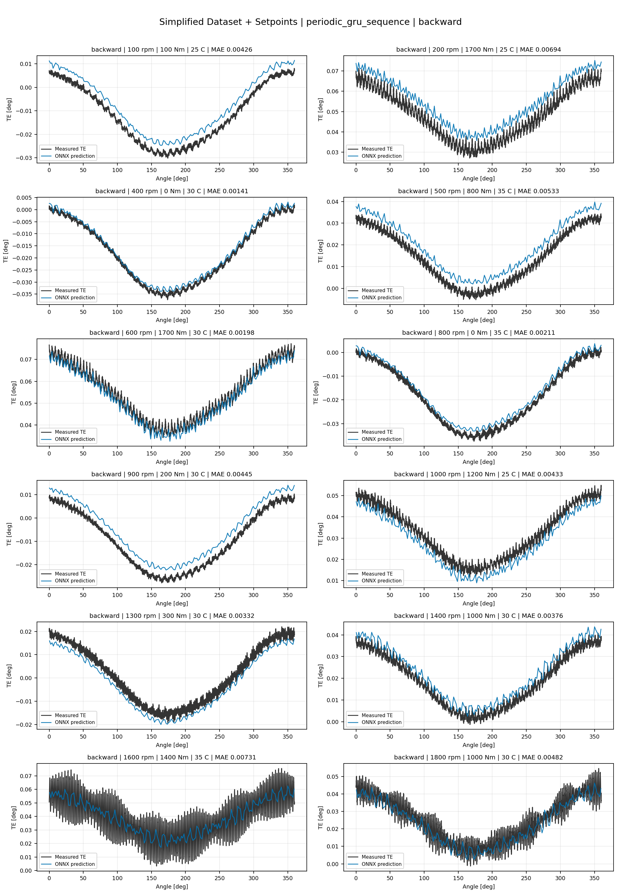
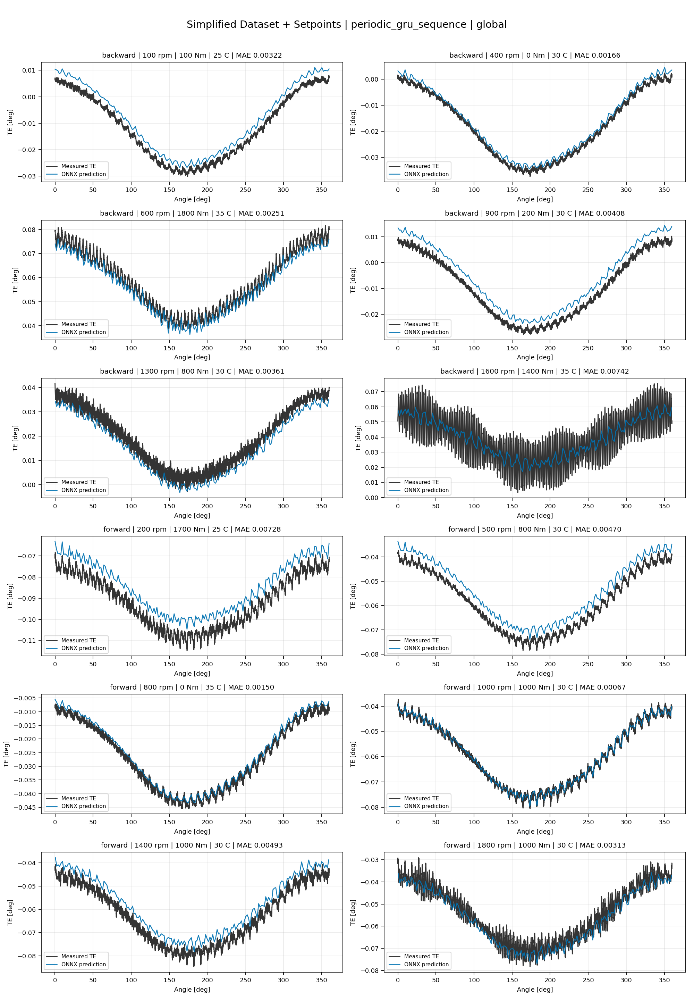
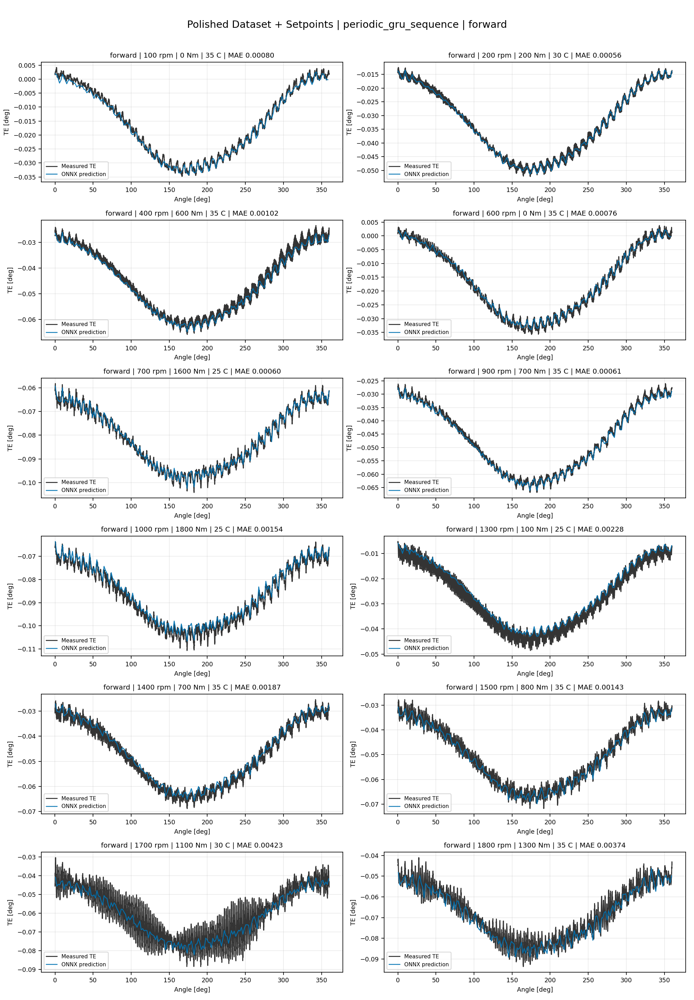
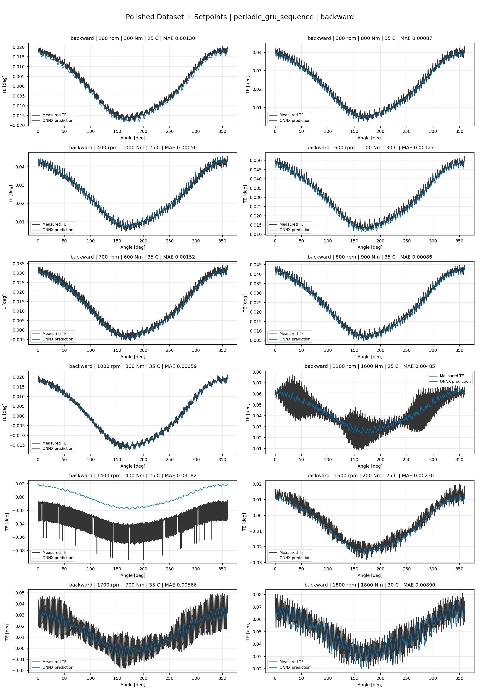
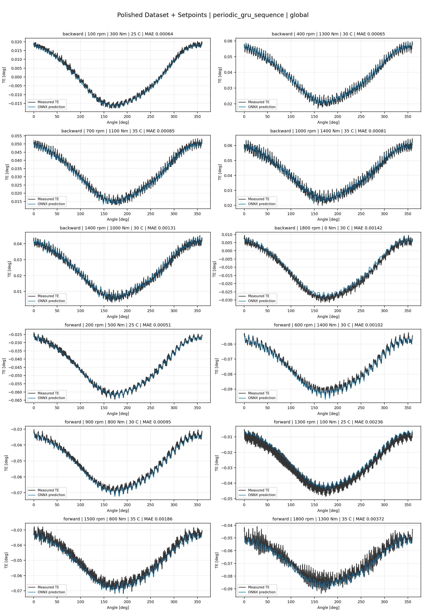
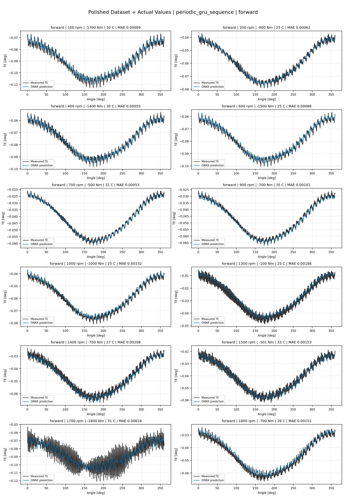
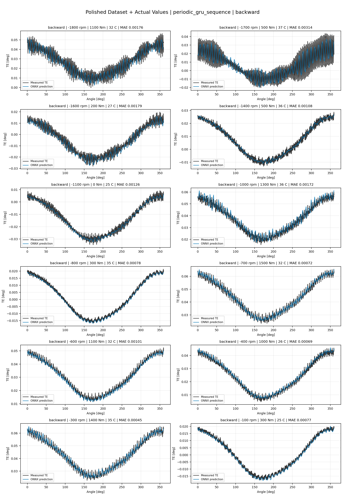
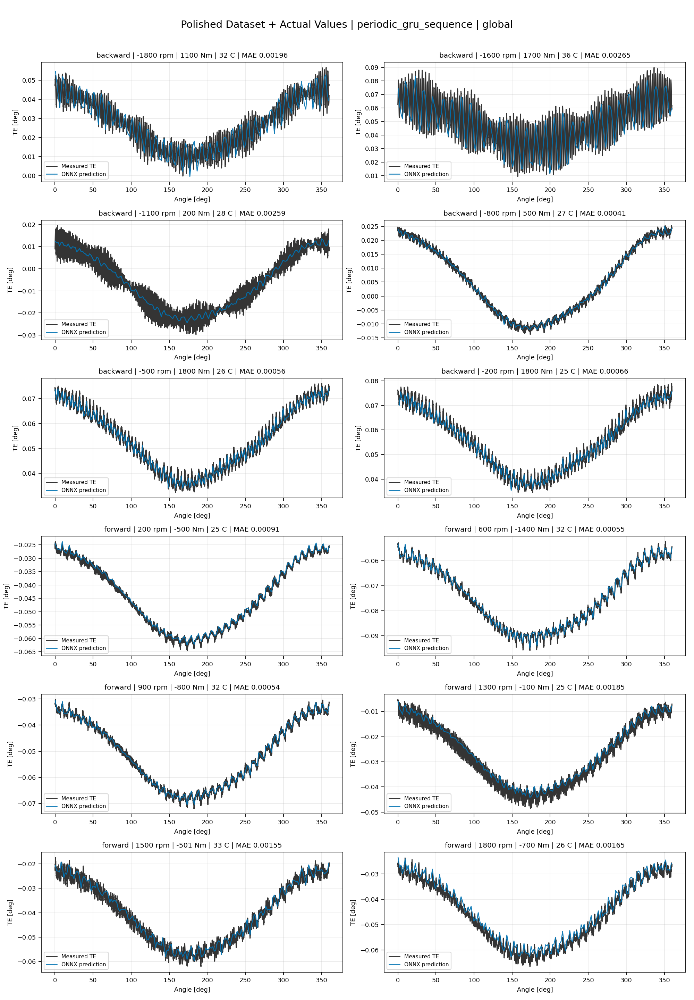

# TE Curve Verification Pipeline Familywise ONNX Report - periodic_gru_sequence

## Overview

This report evaluates exported ONNX models from the dataset input-mode
retraining program. Each dataset/input-mode section uses dataset-matched
held-out test curves and lists the exact model artifacts loaded from
`models/`.

Rank-3 temporal ONNX exports are evaluated on the sequence-window test
contract stored in each `training_config.snapshot.yaml`, including
`sequence_length`, `sequence_stride`, `sequence_target_position`, and
`maximum_sequences_per_curve`.
The collage pages keep the measured TE trace at the original full-curve
resolution; temporal ONNX predictions are overlaid at the evaluated
sequence-target angles.

The report is diagnostic and family-specific. It does not replace an
official multi-index model-promotion decision.

## Output Artifacts

- output directory: `output/validation_checks/track2_familywise_onnx_report/periodic_gru_sequence/2026-07-09-09-05-16__track2_periodic_gru_sequence_familywise_onnx_report`;
- summary YAML: `output/validation_checks/track2_familywise_onnx_report/periodic_gru_sequence/2026-07-09-09-05-16__track2_periodic_gru_sequence_familywise_onnx_report/track2_familywise_onnx_report_summary.yaml`;
- model inventory CSV: `output/validation_checks/track2_familywise_onnx_report/periodic_gru_sequence/2026-07-09-09-05-16__track2_periodic_gru_sequence_familywise_onnx_report/model_inventory.csv`;
- per-curve metrics CSV: `output/validation_checks/track2_familywise_onnx_report/periodic_gru_sequence/2026-07-09-09-05-16__track2_periodic_gru_sequence_familywise_onnx_report/per_curve_metrics.csv`.

## Simplified Dataset + Setpoints

- dataset: `simplified_dataset`;
- input mode: `setpoints`;
- evaluated family: `periodic_gru_sequence`;
- dataset root: `data/simplified_dataset`.

### Models Used

| Surface | Run Name | Run Instance | Dataset Schema |
| --- | --- | --- | --- |
| forward | `te_periodic_gru_sequence_fw__simplified_setpoints` | `2026-07-08-22-14-21__te_periodic_gru_sequence_fw__simplified_setpoints` | `simplified_curve_v1` |
| backward | `te_periodic_gru_sequence_bw__simplified_setpoints` | `2026-07-08-22-23-26__te_periodic_gru_sequence_bw__simplified_setpoints` | `simplified_curve_v1` |
| global | `te_periodic_gru_sequence_global__simplified_setpoints` | `2026-07-08-22-04-46__te_periodic_gru_sequence_global__simplified_setpoints` | `simplified_curve_v1` |

Exact model paths:

| Surface | ONNX Model Path | Python Model Path |
| --- | --- | --- |
| forward | `models/simplified_dataset/setpoints/periodic_gru_sequence/forward/onnx/model.onnx` | `models/simplified_dataset/setpoints/periodic_gru_sequence/forward/python/periodic_gru_sequence-epoch=056-val_mae=0.00353205.ckpt` |
| backward | `models/simplified_dataset/setpoints/periodic_gru_sequence/backward/onnx/model.onnx` | `models/simplified_dataset/setpoints/periodic_gru_sequence/backward/python/periodic_gru_sequence-epoch=081-val_mae=0.00349987.ckpt` |
| global | `models/simplified_dataset/setpoints/periodic_gru_sequence/global/onnx/model.onnx` | `models/simplified_dataset/setpoints/periodic_gru_sequence/global/python/periodic_gru_sequence-epoch=060-val_mae=0.00347740.ckpt` |

### Aggregate Metrics

| Surface | Curves | MAE [deg] | RMSE [deg] | Mean Error [%] | P95 Error [%] |
| --- | ---: | ---: | ---: | ---: | ---: |
| forward | 97 | 0.003160 | 0.003415 | 7.397 | 12.672 |
| backward | 97 | 0.003353 | 0.003660 | 7.826 | 14.327 |
| global | 194 | 0.003332 | 0.003610 | 7.794 | 14.638 |

Offset And Shape Metrics:

| Surface | Signed Offset [deg] | Absolute Offset [deg] | Centered MAE [deg] | P2P Error [deg] |
| --- | ---: | ---: | ---: | ---: |
| forward | -0.000380 | 0.002833 | 0.001145 | 0.002737 |
| backward | 0.000496 | 0.002712 | 0.001484 | 0.003046 |
| global | 0.000754 | 0.002840 | 0.001319 | 0.002781 |

### Forward 12-Curve Page

### Backward 12-Curve Page

### Global 12-Curve Page

## Polished Dataset + Setpoints

- dataset: `polished_dataset`;
- input mode: `setpoints`;
- evaluated family: `periodic_gru_sequence`;
- dataset root: `data/polished_dataset`.

### Models Used

| Surface | Run Name | Run Instance | Dataset Schema |
| --- | --- | --- | --- |
| forward | `te_periodic_gru_sequence_fw__polished_setpoints` | `2026-07-08-22-57-44__te_periodic_gru_sequence_fw__polished_setpoints` | `polished_setpoint_curve_v1` |
| backward | `te_periodic_gru_sequence_bw__polished_setpoints` | `2026-07-08-23-18-30__te_periodic_gru_sequence_bw__polished_setpoints` | `polished_setpoint_curve_v1` |
| global | `te_periodic_gru_sequence_global__polished_setpoints` | `2026-07-08-22-43-56__te_periodic_gru_sequence_global__polished_setpoints` | `polished_setpoint_curve_v1` |

Exact model paths:

| Surface | ONNX Model Path | Python Model Path |
| --- | --- | --- |
| forward | `models/polished_dataset/setpoints/periodic_gru_sequence/forward/onnx/model.onnx` | `models/polished_dataset/setpoints/periodic_gru_sequence/forward/python/periodic_gru_sequence-epoch=091-val_mae=0.00183161.ckpt` |
| backward | `models/polished_dataset/setpoints/periodic_gru_sequence/backward/onnx/model.onnx` | `models/polished_dataset/setpoints/periodic_gru_sequence/backward/python/periodic_gru_sequence-epoch=064-val_mae=0.00189811.ckpt` |
| global | `models/polished_dataset/setpoints/periodic_gru_sequence/global/onnx/model.onnx` | `models/polished_dataset/setpoints/periodic_gru_sequence/global/python/periodic_gru_sequence-epoch=045-val_mae=0.00186736.ckpt` |

### Aggregate Metrics

| Surface | Curves | MAE [deg] | RMSE [deg] | Mean Error [%] | P95 Error [%] |
| --- | ---: | ---: | ---: | ---: | ---: |
| forward | 100 | 0.001802 | 0.002131 | 3.946 | 8.937 |
| backward | 94 | 0.002489 | 0.002928 | 4.632 | 11.378 |
| global | 194 | 0.002143 | 0.002520 | 4.275 | 10.564 |

Offset And Shape Metrics:

| Surface | Signed Offset [deg] | Absolute Offset [deg] | Centered MAE [deg] | P2P Error [deg] |
| --- | ---: | ---: | ---: | ---: |
| forward | 0.000111 | 0.000943 | 0.001421 | 0.003102 |
| backward | -0.000001 | 0.001053 | 0.002051 | 0.004867 |
| global | -0.000006 | 0.001053 | 0.001708 | 0.004076 |

### Forward 12-Curve Page

### Backward 12-Curve Page

### Global 12-Curve Page

## Polished Dataset + Actual Values

- dataset: `polished_dataset`;
- input mode: `actual_values`;
- evaluated family: `periodic_gru_sequence`;
- dataset root: `data/polished_dataset`.

### Models Used

| Surface | Run Name | Run Instance | Dataset Schema |
| --- | --- | --- | --- |
| forward | `te_periodic_gru_sequence_fw__polished_actual_values` | `2026-07-09-00-29-12__te_periodic_gru_sequence_fw__polished_actual_values` | `polished_point_v1` |
| backward | `te_periodic_gru_sequence_bw__polished_actual_values` | `2026-07-09-01-09-21__te_periodic_gru_sequence_bw__polished_actual_values` | `polished_point_v1` |
| global | `te_periodic_gru_sequence_global__polished_actual_values` | `2026-07-08-23-45-29__te_periodic_gru_sequence_global__polished_actual_values` | `polished_point_v1` |

Exact model paths:

| Surface | ONNX Model Path | Python Model Path |
| --- | --- | --- |
| forward | `models/polished_dataset/actual_values/periodic_gru_sequence/forward/onnx/model.onnx` | `models/polished_dataset/actual_values/periodic_gru_sequence/forward/python/periodic_gru_sequence-epoch=200-val_mae=0.00150079.ckpt` |
| backward | `models/polished_dataset/actual_values/periodic_gru_sequence/backward/onnx/model.onnx` | `models/polished_dataset/actual_values/periodic_gru_sequence/backward/python/periodic_gru_sequence-epoch=257-val_mae=0.00127934.ckpt` |
| global | `models/polished_dataset/actual_values/periodic_gru_sequence/global/onnx/model.onnx` | `models/polished_dataset/actual_values/periodic_gru_sequence/global/python/periodic_gru_sequence-epoch=259-val_mae=0.00132221.ckpt` |

### Aggregate Metrics

| Surface | Curves | MAE [deg] | RMSE [deg] | Mean Error [%] | P95 Error [%] |
| --- | ---: | ---: | ---: | ---: | ---: |
| forward | 100 | 0.001662 | 0.001982 | 3.594 | 8.944 |
| backward | 94 | 0.001263 | 0.001583 | 2.654 | 5.490 |
| global | 194 | 0.001390 | 0.001709 | 3.005 | 6.473 |

Offset And Shape Metrics:

| Surface | Signed Offset [deg] | Absolute Offset [deg] | Centered MAE [deg] | P2P Error [deg] |
| --- | ---: | ---: | ---: | ---: |
| forward | -0.000254 | 0.000756 | 0.001399 | 0.002597 |
| backward | 0.000083 | 0.000502 | 0.001137 | 0.002262 |
| global | 0.000064 | 0.000642 | 0.001186 | 0.002258 |

### Forward 12-Curve Page

### Backward 12-Curve Page

### Global 12-Curve Page

