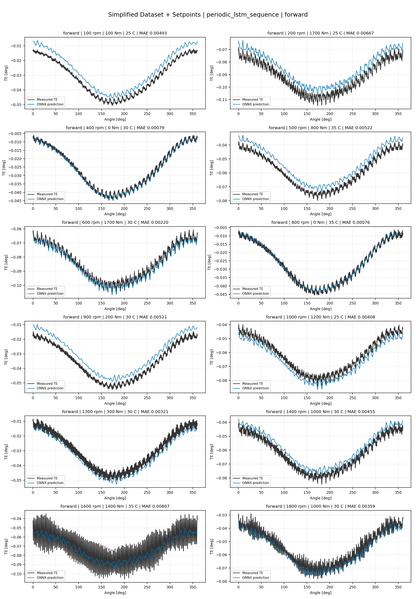
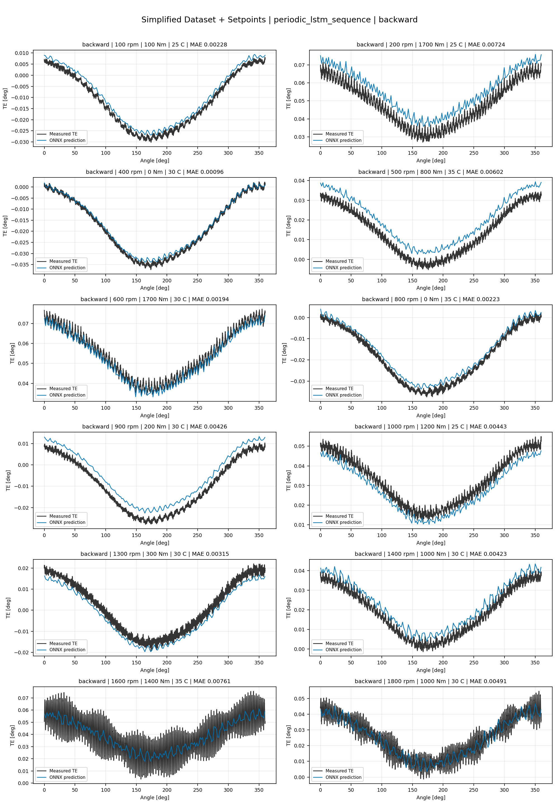
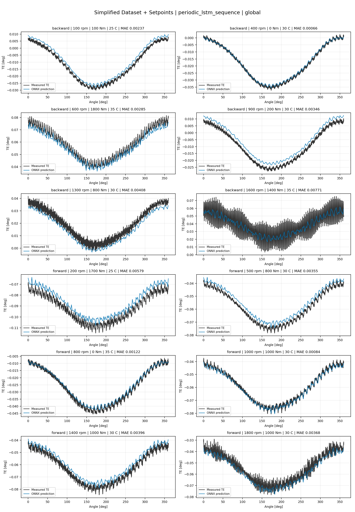
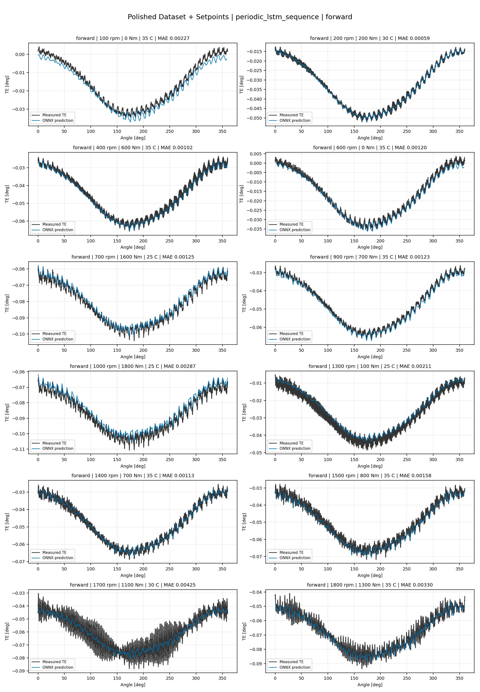
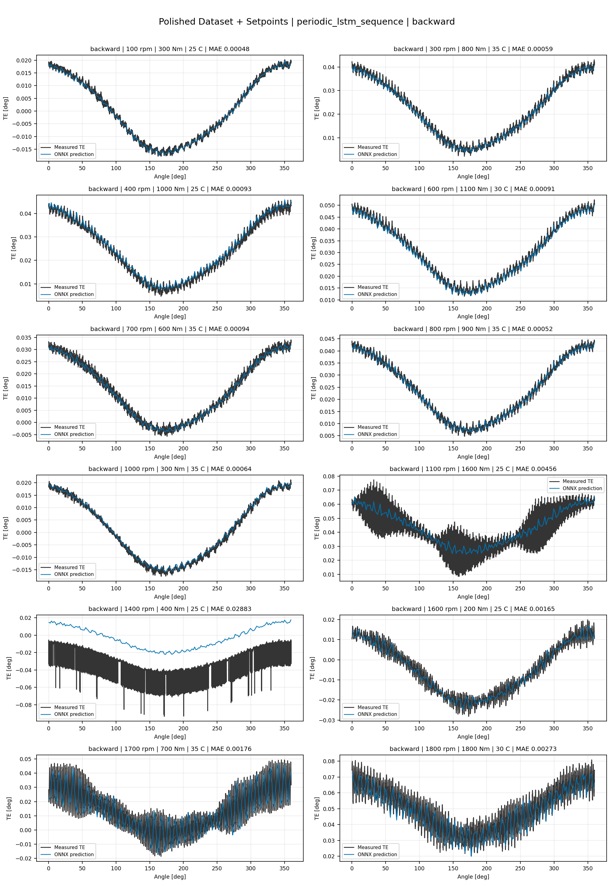
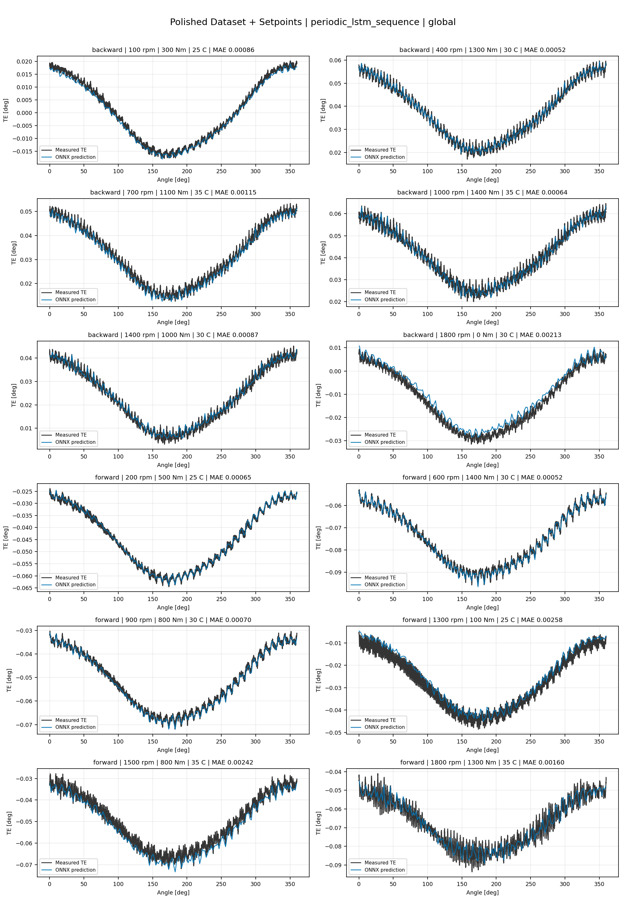
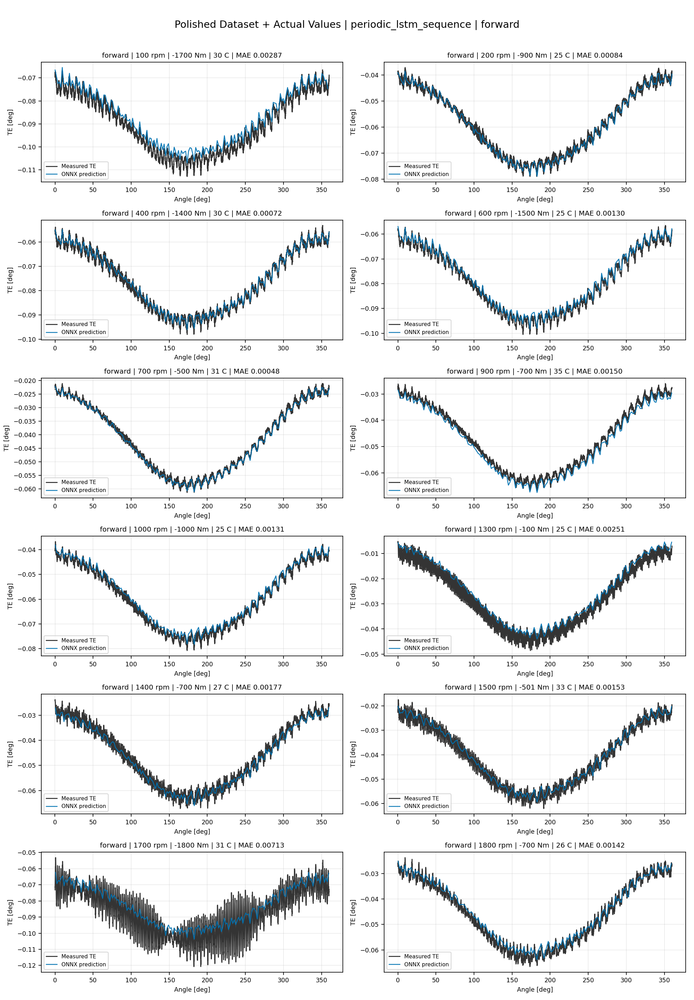
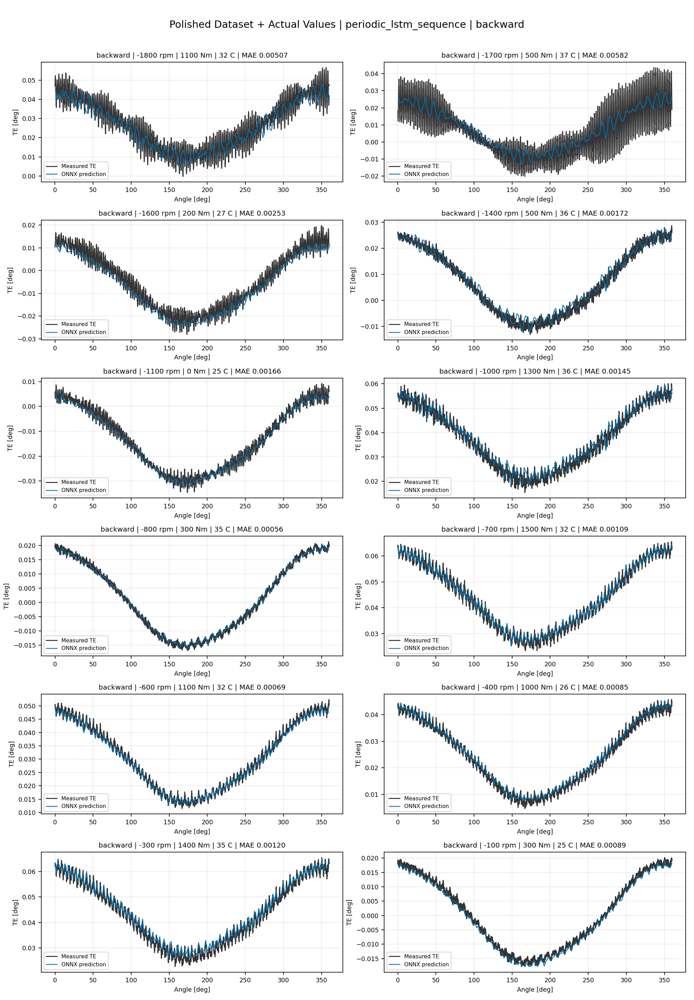
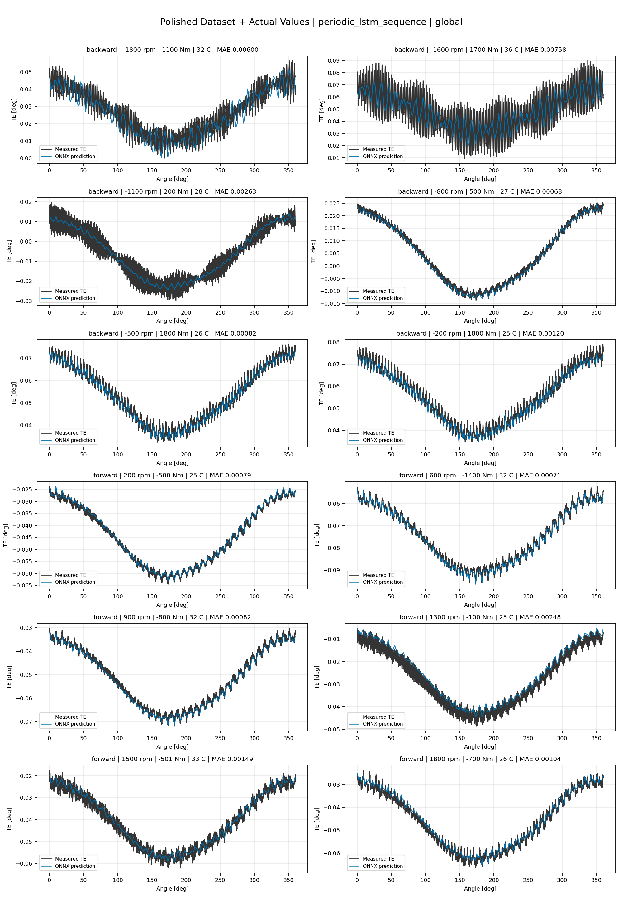

# TE Curve Verification Pipeline Familywise ONNX Report - periodic_lstm_sequence

## Overview

This report evaluates exported ONNX models from the dataset input-mode
retraining program. Each dataset/input-mode section uses dataset-matched
held-out test curves and lists the exact model artifacts loaded from
`models/`.

Rank-3 temporal ONNX exports are evaluated on the sequence-window test
contract stored in each `training_config.snapshot.yaml`, including
`sequence_length`, `sequence_stride`, `sequence_target_position`, and
`maximum_sequences_per_curve`.
The collage pages keep the measured TE trace at the original full-curve
resolution; temporal ONNX predictions are overlaid at the evaluated
sequence-target angles.

The report is diagnostic and family-specific. It does not replace an
official multi-index model-promotion decision.

## Output Artifacts

- output directory: `output/validation_checks/track2_familywise_onnx_report/periodic_lstm_sequence/2026-07-09-10-24-20__track2_periodic_lstm_sequence_familywise_onnx_report`;
- summary YAML: `output/validation_checks/track2_familywise_onnx_report/periodic_lstm_sequence/2026-07-09-10-24-20__track2_periodic_lstm_sequence_familywise_onnx_report/track2_familywise_onnx_report_summary.yaml`;
- model inventory CSV: `output/validation_checks/track2_familywise_onnx_report/periodic_lstm_sequence/2026-07-09-10-24-20__track2_periodic_lstm_sequence_familywise_onnx_report/model_inventory.csv`;
- per-curve metrics CSV: `output/validation_checks/track2_familywise_onnx_report/periodic_lstm_sequence/2026-07-09-10-24-20__track2_periodic_lstm_sequence_familywise_onnx_report/per_curve_metrics.csv`.

## Simplified Dataset + Setpoints

- dataset: `simplified_dataset`;
- input mode: `setpoints`;
- evaluated family: `periodic_lstm_sequence`;
- dataset root: `data/simplified_dataset`.

### Models Used

| Surface | Run Name | Run Instance | Dataset Schema |
| --- | --- | --- | --- |
| forward | `te_periodic_lstm_sequence_fw__simplified_setpoints` | `2026-07-09-02-19-42__te_periodic_lstm_sequence_fw__simplified_setpoints` | `simplified_curve_v1` |
| backward | `te_periodic_lstm_sequence_bw__simplified_setpoints` | `2026-07-09-02-32-24__te_periodic_lstm_sequence_bw__simplified_setpoints` | `simplified_curve_v1` |
| global | `te_periodic_lstm_sequence_global__simplified_setpoints` | `2026-07-09-02-10-37__te_periodic_lstm_sequence_global__simplified_setpoints` | `simplified_curve_v1` |

Exact model paths:

| Surface | ONNX Model Path | Python Model Path |
| --- | --- | --- |
| forward | `models/simplified_dataset/setpoints/exported/periodic_lstm_sequence/forward/2026-07-09-02-19-42__te_periodic_lstm_sequence_fw__simplified_setpoints/onnx/model.onnx` | `models/simplified_dataset/setpoints/exported/periodic_lstm_sequence/forward/2026-07-09-02-19-42__te_periodic_lstm_sequence_fw__simplified_setpoints/python/periodic_lstm_sequence-epoch=095-val_mae=0.00348296.ckpt` |
| backward | `models/simplified_dataset/setpoints/exported/periodic_lstm_sequence/backward/2026-07-09-02-32-24__te_periodic_lstm_sequence_bw__simplified_setpoints/onnx/model.onnx` | `models/simplified_dataset/setpoints/exported/periodic_lstm_sequence/backward/2026-07-09-02-32-24__te_periodic_lstm_sequence_bw__simplified_setpoints/python/periodic_lstm_sequence-epoch=074-val_mae=0.00352408.ckpt` |
| global | `models/simplified_dataset/setpoints/exported/periodic_lstm_sequence/global/2026-07-09-02-10-37__te_periodic_lstm_sequence_global__simplified_setpoints/onnx/model.onnx` | `models/simplified_dataset/setpoints/exported/periodic_lstm_sequence/global/2026-07-09-02-10-37__te_periodic_lstm_sequence_global__simplified_setpoints/python/periodic_lstm_sequence-epoch=088-val_mae=0.00353329.ckpt` |

### Aggregate Metrics

| Surface | Curves | MAE [deg] | RMSE [deg] | Mean Error [%] | P95 Error [%] |
| --- | ---: | ---: | ---: | ---: | ---: |
| forward | 97 | 0.003259 | 0.003506 | 7.645 | 13.799 |
| backward | 97 | 0.003346 | 0.003642 | 7.804 | 14.920 |
| global | 194 | 0.003369 | 0.003655 | 7.871 | 13.010 |

Offset And Shape Metrics:

| Surface | Signed Offset [deg] | Absolute Offset [deg] | Centered MAE [deg] | P2P Error [deg] |
| --- | ---: | ---: | ---: | ---: |
| forward | 0.000545 | 0.002918 | 0.001145 | 0.002279 |
| backward | 0.000464 | 0.002684 | 0.001467 | 0.003743 |
| global | 0.000032 | 0.002933 | 0.001339 | 0.003023 |

### Forward 12-Curve Page

### Backward 12-Curve Page

### Global 12-Curve Page

## Polished Dataset + Setpoints

- dataset: `polished_dataset`;
- input mode: `setpoints`;
- evaluated family: `periodic_lstm_sequence`;
- dataset root: `data/polished_dataset`.

### Models Used

| Surface | Run Name | Run Instance | Dataset Schema |
| --- | --- | --- | --- |
| forward | `te_periodic_lstm_sequence_fw__polished_setpoints` | `2026-07-09-03-42-29__te_periodic_lstm_sequence_fw__polished_setpoints` | `polished_setpoint_curve_v1` |
| backward | `te_periodic_lstm_sequence_bw__polished_setpoints` | `2026-07-09-03-56-20__te_periodic_lstm_sequence_bw__polished_setpoints` | `polished_setpoint_curve_v1` |
| global | `te_periodic_lstm_sequence_global__polished_setpoints` | `2026-07-09-03-02-43__te_periodic_lstm_sequence_global__polished_setpoints` | `polished_setpoint_curve_v1` |

Exact model paths:

| Surface | ONNX Model Path | Python Model Path |
| --- | --- | --- |
| forward | `models/polished_dataset/setpoints/exported/periodic_lstm_sequence/forward/2026-07-09-03-42-29__te_periodic_lstm_sequence_fw__polished_setpoints/onnx/model.onnx` | `models/polished_dataset/setpoints/exported/periodic_lstm_sequence/forward/2026-07-09-03-42-29__te_periodic_lstm_sequence_fw__polished_setpoints/python/periodic_lstm_sequence-epoch=047-val_mae=0.00186699.ckpt` |
| backward | `models/polished_dataset/setpoints/exported/periodic_lstm_sequence/backward/2026-07-09-03-56-20__te_periodic_lstm_sequence_bw__polished_setpoints/onnx/model.onnx` | `models/polished_dataset/setpoints/exported/periodic_lstm_sequence/backward/2026-07-09-03-56-20__te_periodic_lstm_sequence_bw__polished_setpoints/python/periodic_lstm_sequence-epoch=208-val_mae=0.00138862.ckpt` |
| global | `models/polished_dataset/setpoints/exported/periodic_lstm_sequence/global/2026-07-09-03-02-43__te_periodic_lstm_sequence_global__polished_setpoints/onnx/model.onnx` | `models/polished_dataset/setpoints/exported/periodic_lstm_sequence/global/2026-07-09-03-02-43__te_periodic_lstm_sequence_global__polished_setpoints/python/periodic_lstm_sequence-epoch=245-val_mae=0.00137071.ckpt` |

### Aggregate Metrics

| Surface | Curves | MAE [deg] | RMSE [deg] | Mean Error [%] | P95 Error [%] |
| --- | ---: | ---: | ---: | ---: | ---: |
| forward | 100 | 0.001914 | 0.002238 | 4.210 | 10.391 |
| backward | 94 | 0.001671 | 0.001994 | 3.282 | 7.047 |
| global | 194 | 0.001561 | 0.001889 | 3.335 | 6.580 |

Offset And Shape Metrics:

| Surface | Signed Offset [deg] | Absolute Offset [deg] | Centered MAE [deg] | P2P Error [deg] |
| --- | ---: | ---: | ---: | ---: |
| forward | 0.000100 | 0.001100 | 0.001409 | 0.003072 |
| backward | 0.000352 | 0.000948 | 0.001263 | 0.003177 |
| global | 0.000003 | 0.000872 | 0.001230 | 0.002273 |

### Forward 12-Curve Page

### Backward 12-Curve Page

### Global 12-Curve Page

## Polished Dataset + Actual Values

- dataset: `polished_dataset`;
- input mode: `actual_values`;
- evaluated family: `periodic_lstm_sequence`;
- dataset root: `data/polished_dataset`.

### Models Used

| Surface | Run Name | Run Instance | Dataset Schema |
| --- | --- | --- | --- |
| forward | `te_periodic_lstm_sequence_fw__polished_actual_values` | `2026-07-09-05-06-07__te_periodic_lstm_sequence_fw__polished_actual_values` | `polished_point_v1` |
| backward | `te_periodic_lstm_sequence_bw__polished_actual_values` | `2026-07-09-05-16-31__te_periodic_lstm_sequence_bw__polished_actual_values` | `polished_point_v1` |
| global | `te_periodic_lstm_sequence_global__polished_actual_values` | `2026-07-09-04-47-33__te_periodic_lstm_sequence_global__polished_actual_values` | `polished_point_v1` |

Exact model paths:

| Surface | ONNX Model Path | Python Model Path |
| --- | --- | --- |
| forward | `models/polished_dataset/actual_values/exported/periodic_lstm_sequence/forward/2026-07-09-05-06-07__te_periodic_lstm_sequence_fw__polished_actual_values/onnx/model.onnx` | `models/polished_dataset/actual_values/exported/periodic_lstm_sequence/forward/2026-07-09-05-06-07__te_periodic_lstm_sequence_fw__polished_actual_values/python/periodic_lstm_sequence-epoch=017-val_mae=0.00196587.ckpt` |
| backward | `models/polished_dataset/actual_values/exported/periodic_lstm_sequence/backward/2026-07-09-05-16-31__te_periodic_lstm_sequence_bw__polished_actual_values/onnx/model.onnx` | `models/polished_dataset/actual_values/exported/periodic_lstm_sequence/backward/2026-07-09-05-16-31__te_periodic_lstm_sequence_bw__polished_actual_values/python/periodic_lstm_sequence-epoch=053-val_mae=0.00197877.ckpt` |
| global | `models/polished_dataset/actual_values/exported/periodic_lstm_sequence/global/2026-07-09-04-47-33__te_periodic_lstm_sequence_global__polished_actual_values/onnx/model.onnx` | `models/polished_dataset/actual_values/exported/periodic_lstm_sequence/global/2026-07-09-04-47-33__te_periodic_lstm_sequence_global__polished_actual_values/python/periodic_lstm_sequence-epoch=103-val_mae=0.00191666.ckpt` |

### Aggregate Metrics

| Surface | Curves | MAE [deg] | RMSE [deg] | Mean Error [%] | P95 Error [%] |
| --- | ---: | ---: | ---: | ---: | ---: |
| forward | 100 | 0.001919 | 0.002246 | 4.216 | 10.613 |
| backward | 94 | 0.002539 | 0.002974 | 4.719 | 11.493 |
| global | 194 | 0.002121 | 0.002491 | 4.281 | 11.054 |

Offset And Shape Metrics:

| Surface | Signed Offset [deg] | Absolute Offset [deg] | Centered MAE [deg] | P2P Error [deg] |
| --- | ---: | ---: | ---: | ---: |
| forward | 0.000151 | 0.001013 | 0.001444 | 0.003569 |
| backward | 0.000517 | 0.000999 | 0.002114 | 0.005407 |
| global | -0.000053 | 0.000961 | 0.001701 | 0.003590 |

### Forward 12-Curve Page

### Backward 12-Curve Page

### Global 12-Curve Page

