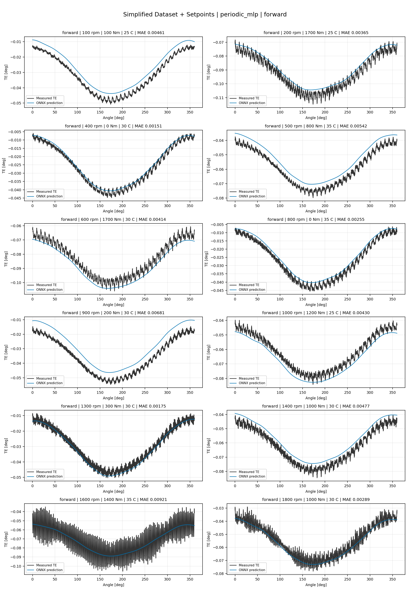
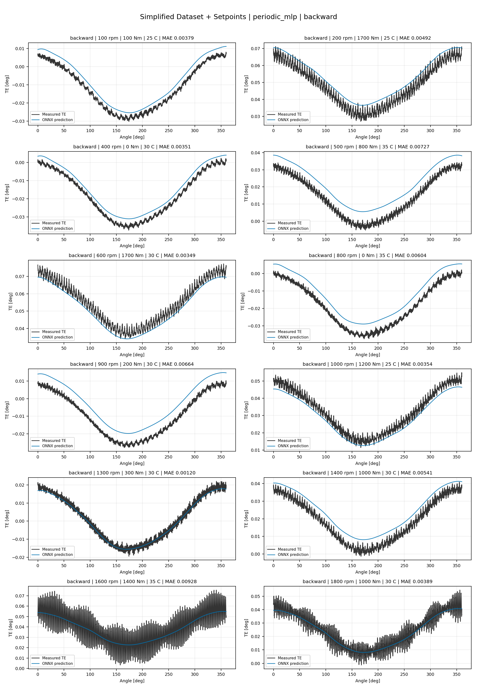
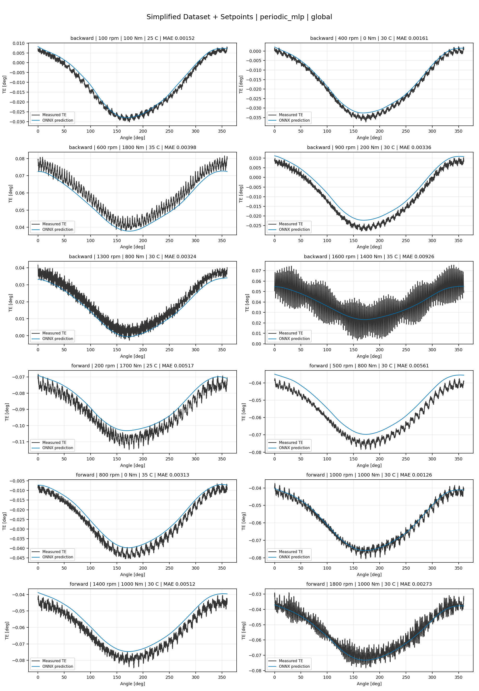
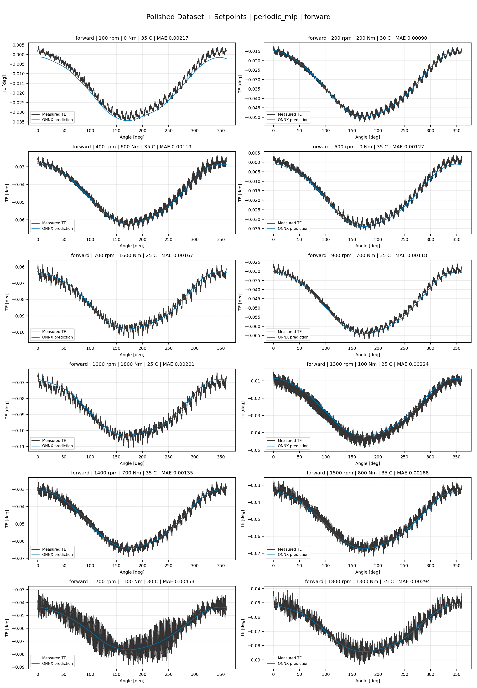
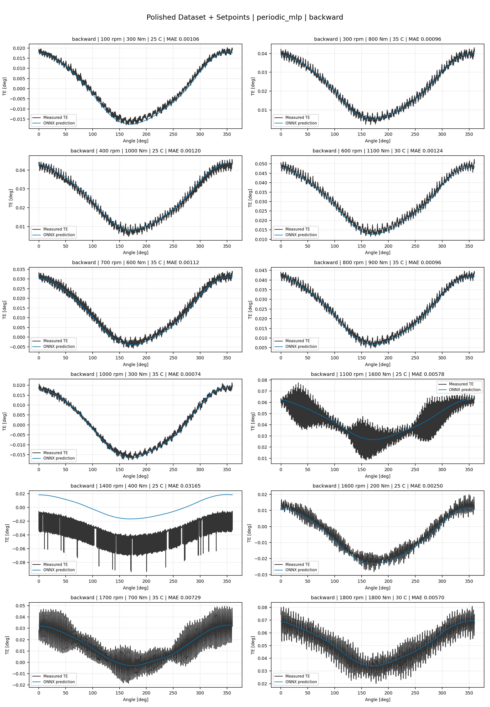
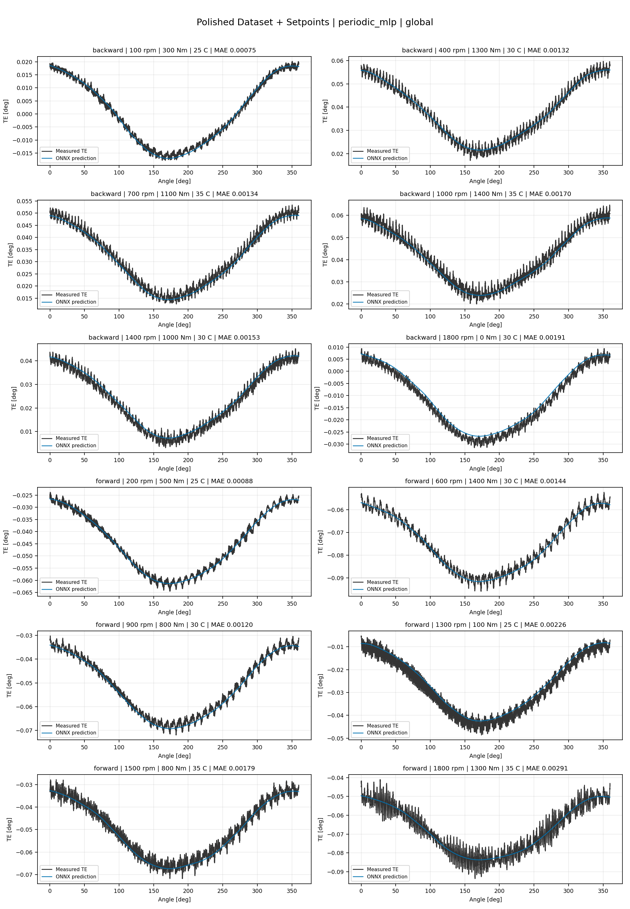
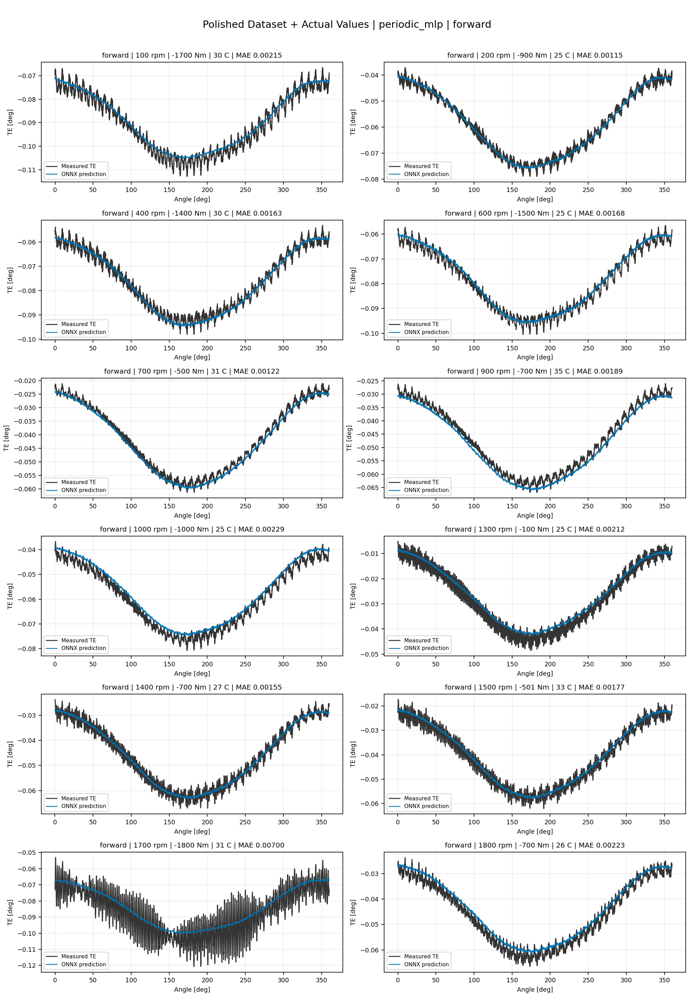
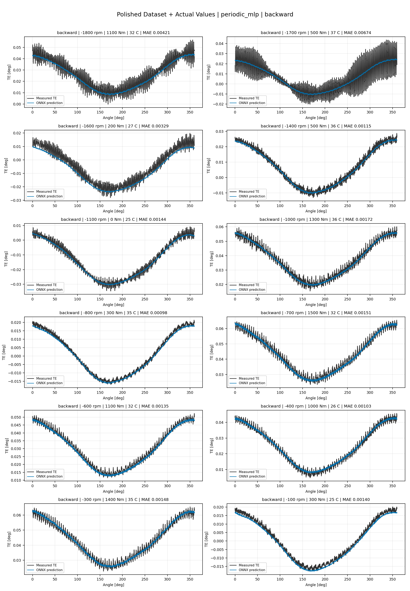
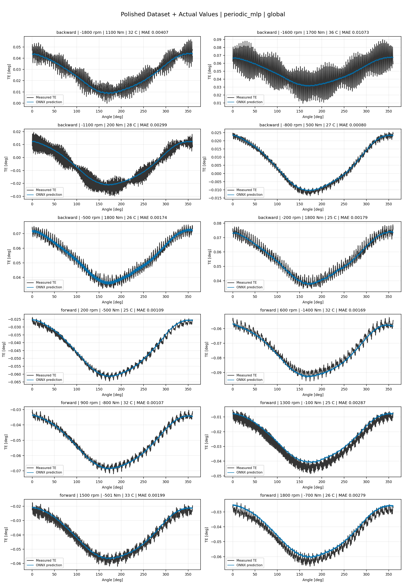

# TE Curve Verification Pipeline Familywise ONNX Report - periodic_mlp

## Overview

This report evaluates exported ONNX models from the dataset input-mode
retraining program. Each dataset/input-mode section uses dataset-matched
held-out test curves and lists the exact model artifacts loaded from
`models/`.

The report is diagnostic and family-specific. It does not replace an
official multi-index model-promotion decision.

## Output Artifacts

- output directory: `output/validation_checks/track2_familywise_onnx_report/periodic_mlp/2026-07-08-08-36-53__track2_periodic_mlp_familywise_onnx_report`;
- summary YAML: `output/validation_checks/track2_familywise_onnx_report/periodic_mlp/2026-07-08-08-36-53__track2_periodic_mlp_familywise_onnx_report/track2_familywise_onnx_report_summary.yaml`;
- model inventory CSV: `output/validation_checks/track2_familywise_onnx_report/periodic_mlp/2026-07-08-08-36-53__track2_periodic_mlp_familywise_onnx_report/model_inventory.csv`;
- per-curve metrics CSV: `output/validation_checks/track2_familywise_onnx_report/periodic_mlp/2026-07-08-08-36-53__track2_periodic_mlp_familywise_onnx_report/per_curve_metrics.csv`.

## Simplified Dataset + Setpoints

- dataset: `simplified_dataset`;
- input mode: `setpoints`;
- evaluated family: `periodic_mlp`;
- dataset root: `data/simplified_dataset`.

### Models Used

| Surface | Run Name | Run Instance | Dataset Schema |
| --- | --- | --- | --- |
| forward | `te_periodic_mlp_fw__simplified_setpoints` | `2026-07-07-20-14-15__te_periodic_mlp_fw__simplified_setpoints` | `simplified_curve_v1` |
| backward | `te_periodic_mlp_bw__simplified_setpoints` | `2026-07-07-20-20-54__te_periodic_mlp_bw__simplified_setpoints` | `simplified_curve_v1` |
| global | `te_periodic_mlp_global__simplified_setpoints` | `2026-07-07-20-03-02__te_periodic_mlp_global__simplified_setpoints` | `simplified_curve_v1` |

Exact model paths:

| Surface | ONNX Model Path | Python Model Path |
| --- | --- | --- |
| forward | `models/simplified_dataset/setpoints/exported/periodic_mlp/forward/2026-07-07-20-14-15__te_periodic_mlp_fw__simplified_setpoints/onnx/model.onnx` | `models/simplified_dataset/setpoints/exported/periodic_mlp/forward/2026-07-07-20-14-15__te_periodic_mlp_fw__simplified_setpoints/python/periodic_mlp-epoch=037-val_mae=0.00302141.ckpt` |
| backward | `models/simplified_dataset/setpoints/exported/periodic_mlp/backward/2026-07-07-20-20-54__te_periodic_mlp_bw__simplified_setpoints/onnx/model.onnx` | `models/simplified_dataset/setpoints/exported/periodic_mlp/backward/2026-07-07-20-20-54__te_periodic_mlp_bw__simplified_setpoints/python/periodic_mlp-epoch=062-val_mae=0.00301630.ckpt` |
| global | `models/simplified_dataset/setpoints/exported/periodic_mlp/global/2026-07-07-20-03-02__te_periodic_mlp_global__simplified_setpoints/onnx/model.onnx` | `models/simplified_dataset/setpoints/exported/periodic_mlp/global/2026-07-07-20-03-02__te_periodic_mlp_global__simplified_setpoints/python/periodic_mlp-epoch=090-val_mae=0.00301298.ckpt` |

### Aggregate Metrics

| Surface | Curves | MAE [deg] | RMSE [deg] | Mean Error [%] | P95 Error [%] |
| --- | ---: | ---: | ---: | ---: | ---: |
| forward | 97 | 0.003476 | 0.003906 | 7.722 | 13.580 |
| backward | 97 | 0.003985 | 0.004414 | 8.778 | 17.516 |
| global | 194 | 0.003601 | 0.004029 | 7.944 | 14.680 |

Offset And Shape Metrics:

| Surface | Signed Offset [deg] | Absolute Offset [deg] | Centered MAE [deg] | P2P Error [deg] |
| --- | ---: | ---: | ---: | ---: |
| forward | 0.000530 | 0.002918 | 0.001746 | 0.009664 |
| backward | 0.001283 | 0.003316 | 0.001869 | 0.010514 |
| global | 0.000691 | 0.002992 | 0.001784 | 0.010321 |

### Forward 12-Curve Page

### Backward 12-Curve Page

### Global 12-Curve Page

## Polished Dataset + Setpoints

- dataset: `polished_dataset`;
- input mode: `setpoints`;
- evaluated family: `periodic_mlp`;
- dataset root: `data/polished_dataset`.

### Models Used

| Surface | Run Name | Run Instance | Dataset Schema |
| --- | --- | --- | --- |
| forward | `te_periodic_mlp_fw__polished_setpoints` | `2026-07-07-20-52-32__te_periodic_mlp_fw__polished_setpoints` | `polished_setpoint_curve_v1` |
| backward | `te_periodic_mlp_bw__polished_setpoints` | `2026-07-07-21-11-38__te_periodic_mlp_bw__polished_setpoints` | `polished_setpoint_curve_v1` |
| global | `te_periodic_mlp_global__polished_setpoints` | `2026-07-07-20-38-26__te_periodic_mlp_global__polished_setpoints` | `polished_setpoint_curve_v1` |

Exact model paths:

| Surface | ONNX Model Path | Python Model Path |
| --- | --- | --- |
| forward | `models/polished_dataset/setpoints/exported/periodic_mlp/forward/2026-07-07-20-52-32__te_periodic_mlp_fw__polished_setpoints/onnx/model.onnx` | `models/polished_dataset/setpoints/exported/periodic_mlp/forward/2026-07-07-20-52-32__te_periodic_mlp_fw__polished_setpoints/python/periodic_mlp-epoch=089-val_mae=0.00162401.ckpt` |
| backward | `models/polished_dataset/setpoints/exported/periodic_mlp/backward/2026-07-07-21-11-38__te_periodic_mlp_bw__polished_setpoints/onnx/model.onnx` | `models/polished_dataset/setpoints/exported/periodic_mlp/backward/2026-07-07-21-11-38__te_periodic_mlp_bw__polished_setpoints/python/periodic_mlp-epoch=055-val_mae=0.00165461.ckpt` |
| global | `models/polished_dataset/setpoints/exported/periodic_mlp/global/2026-07-07-20-38-26__te_periodic_mlp_global__polished_setpoints/onnx/model.onnx` | `models/polished_dataset/setpoints/exported/periodic_mlp/global/2026-07-07-20-38-26__te_periodic_mlp_global__polished_setpoints/python/periodic_mlp-epoch=080-val_mae=0.00165354.ckpt` |

### Aggregate Metrics

| Surface | Curves | MAE [deg] | RMSE [deg] | Mean Error [%] | P95 Error [%] |
| --- | ---: | ---: | ---: | ---: | ---: |
| forward | 100 | 0.002180 | 0.002639 | 4.506 | 8.819 |
| backward | 94 | 0.002762 | 0.003264 | 4.894 | 10.587 |
| global | 194 | 0.002506 | 0.002988 | 4.798 | 10.379 |

Offset And Shape Metrics:

| Surface | Signed Offset [deg] | Absolute Offset [deg] | Centered MAE [deg] | P2P Error [deg] |
| --- | ---: | ---: | ---: | ---: |
| forward | 0.000196 | 0.000873 | 0.001934 | 0.011535 |
| backward | 0.000598 | 0.001041 | 0.002375 | 0.011368 |
| global | 0.000322 | 0.001002 | 0.002152 | 0.011436 |

### Forward 12-Curve Page

### Backward 12-Curve Page

### Global 12-Curve Page

## Polished Dataset + Actual Values

- dataset: `polished_dataset`;
- input mode: `actual_values`;
- evaluated family: `periodic_mlp`;
- dataset root: `data/polished_dataset`.

### Models Used

| Surface | Run Name | Run Instance | Dataset Schema |
| --- | --- | --- | --- |
| forward | `te_periodic_mlp_fw__polished_actual_values` | `2026-07-07-21-58-17__te_periodic_mlp_fw__polished_actual_values` | `polished_point_v1` |
| backward | `te_periodic_mlp_bw__polished_actual_values` | `2026-07-07-22-12-18__te_periodic_mlp_bw__polished_actual_values` | `polished_point_v1` |
| global | `te_periodic_mlp_global__polished_actual_values` | `2026-07-07-21-37-50__te_periodic_mlp_global__polished_actual_values` | `polished_point_v1` |

Exact model paths:

| Surface | ONNX Model Path | Python Model Path |
| --- | --- | --- |
| forward | `models/polished_dataset/actual_values/exported/periodic_mlp/forward/2026-07-07-21-58-17__te_periodic_mlp_fw__polished_actual_values/onnx/model.onnx` | `models/polished_dataset/actual_values/exported/periodic_mlp/forward/2026-07-07-21-58-17__te_periodic_mlp_fw__polished_actual_values/python/periodic_mlp-epoch=048-val_mae=0.00168924.ckpt` |
| backward | `models/polished_dataset/actual_values/exported/periodic_mlp/backward/2026-07-07-22-12-18__te_periodic_mlp_bw__polished_actual_values/onnx/model.onnx` | `models/polished_dataset/actual_values/exported/periodic_mlp/backward/2026-07-07-22-12-18__te_periodic_mlp_bw__polished_actual_values/python/periodic_mlp-epoch=076-val_mae=0.00167645.ckpt` |
| global | `models/polished_dataset/actual_values/exported/periodic_mlp/global/2026-07-07-21-37-50__te_periodic_mlp_global__polished_actual_values/onnx/model.onnx` | `models/polished_dataset/actual_values/exported/periodic_mlp/global/2026-07-07-21-37-50__te_periodic_mlp_global__polished_actual_values/python/periodic_mlp-epoch=094-val_mae=0.00165445.ckpt` |

### Aggregate Metrics

| Surface | Curves | MAE [deg] | RMSE [deg] | Mean Error [%] | P95 Error [%] |
| --- | ---: | ---: | ---: | ---: | ---: |
| forward | 100 | 0.002212 | 0.002669 | 4.573 | 8.898 |
| backward | 94 | 0.002787 | 0.003329 | 4.953 | 10.619 |
| global | 194 | 0.002481 | 0.002970 | 4.728 | 9.998 |

Offset And Shape Metrics:

| Surface | Signed Offset [deg] | Absolute Offset [deg] | Centered MAE [deg] | P2P Error [deg] |
| --- | ---: | ---: | ---: | ---: |
| forward | 0.000025 | 0.000845 | 0.001969 | 0.010202 |
| backward | -0.000249 | 0.001036 | 0.002424 | 0.011064 |
| global | 0.000243 | 0.000932 | 0.002179 | 0.010389 |

### Forward 12-Curve Page

### Backward 12-Curve Page

### Global 12-Curve Page

