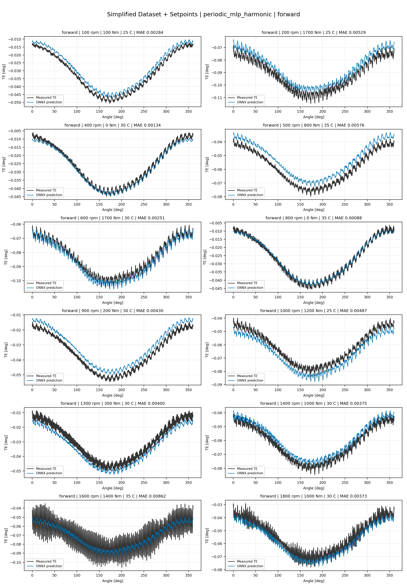
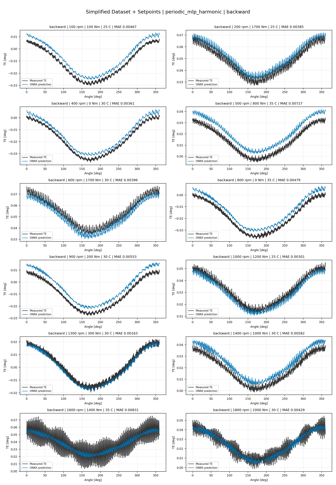
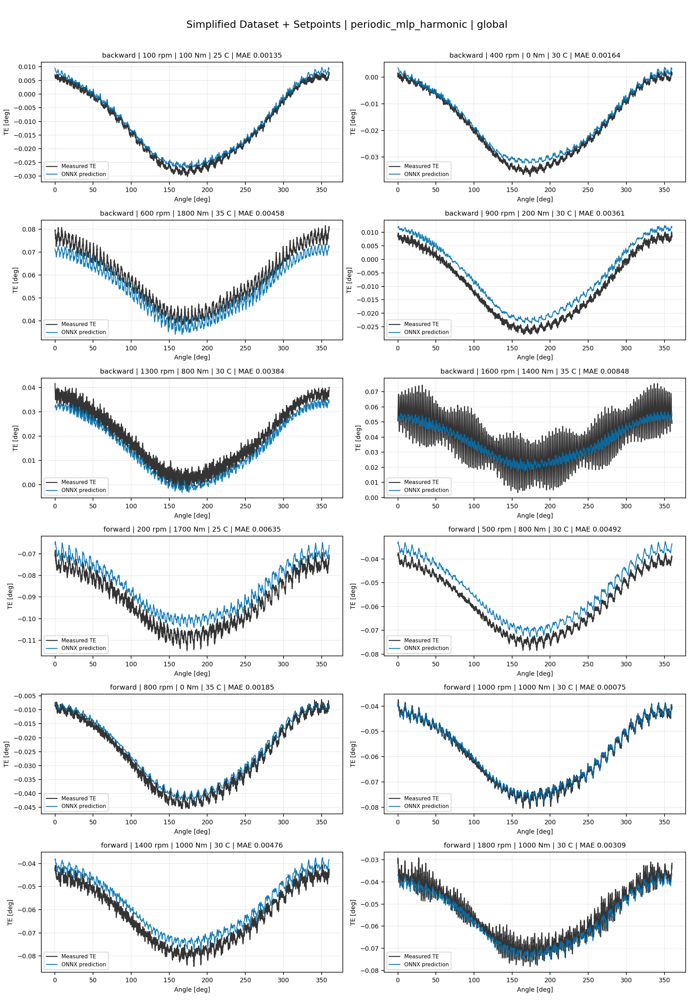
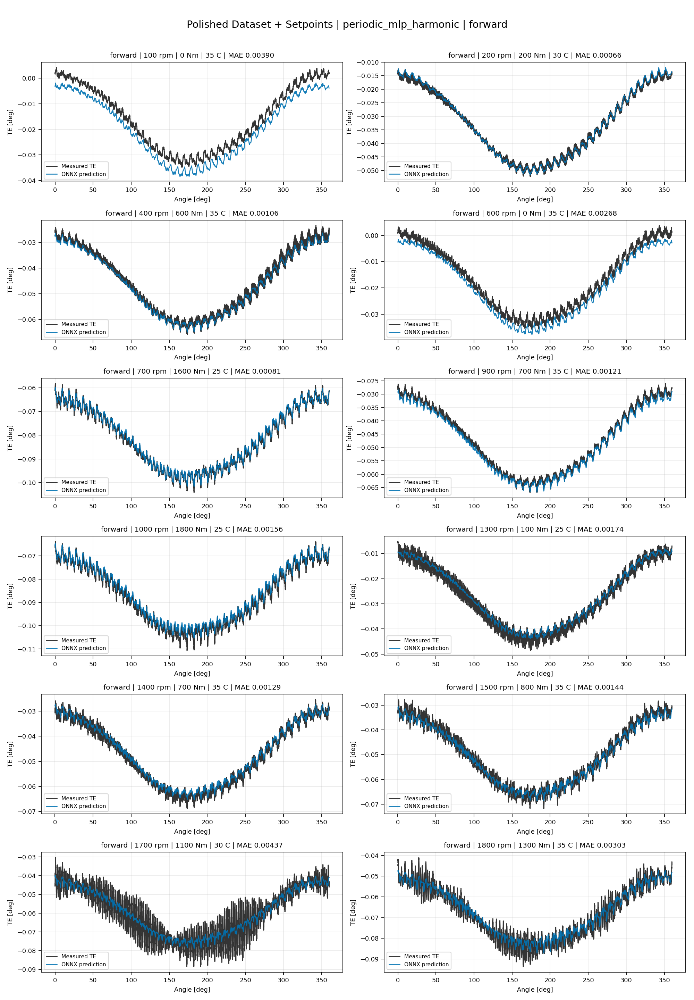
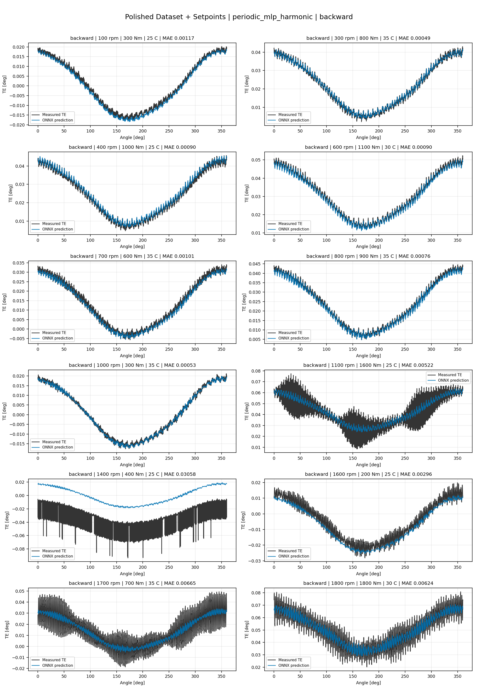
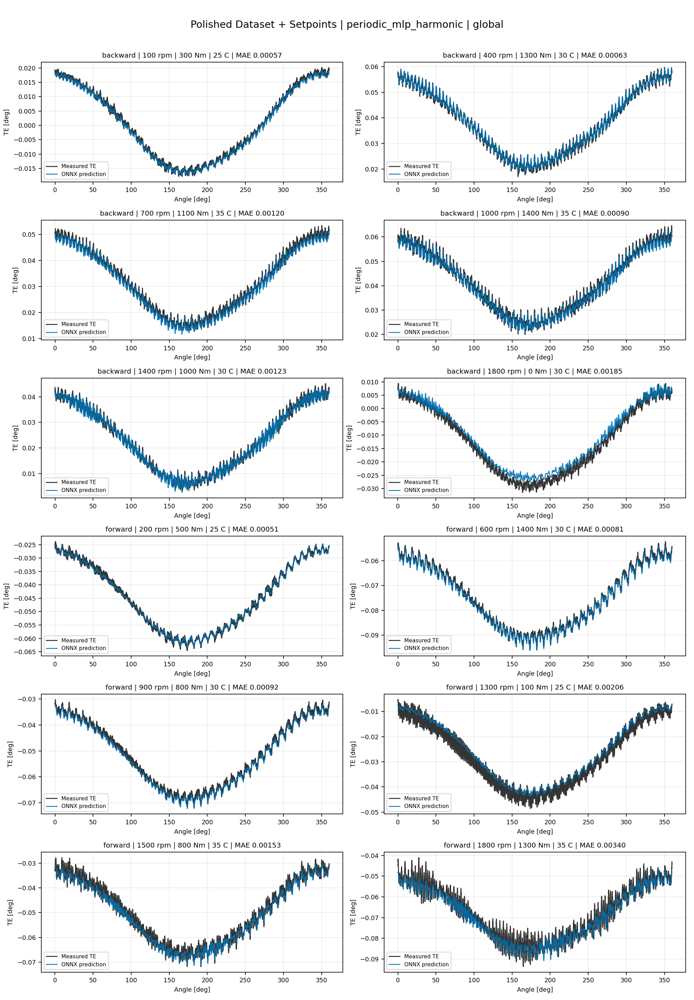
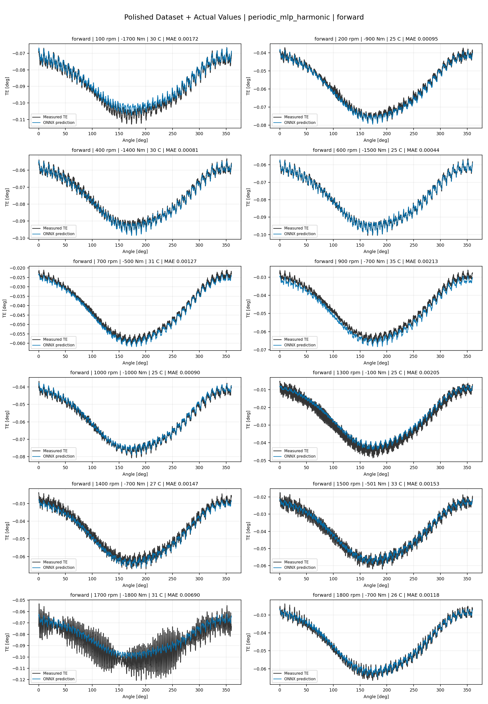
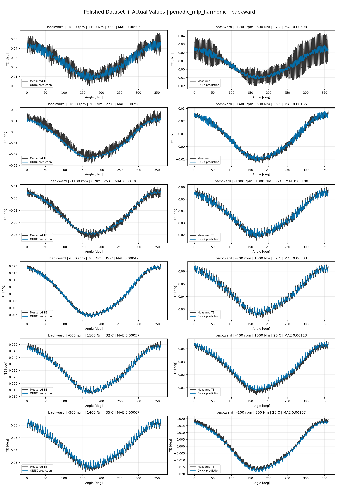
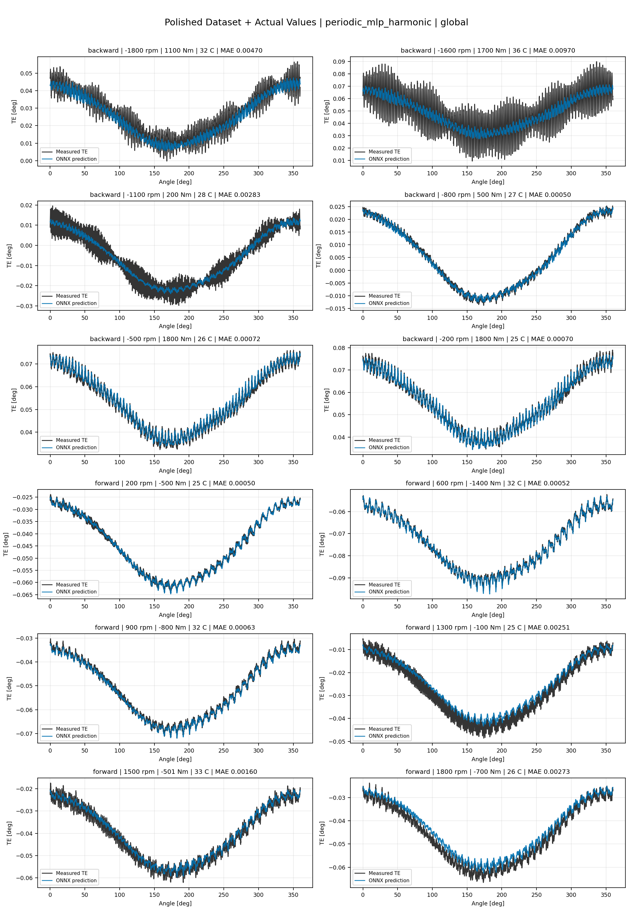

# TE Curve Verification Pipeline Familywise ONNX Report - periodic_mlp_harmonic

## Overview

This report evaluates exported ONNX models from the dataset input-mode
retraining program. Each dataset/input-mode section uses dataset-matched
held-out test curves and lists the exact model artifacts loaded from
`models/`.

The report is diagnostic and family-specific. It does not replace an
official multi-index model-promotion decision.

## Output Artifacts

- output directory: `output/validation_checks/track2_familywise_onnx_report/periodic_mlp_harmonic/2026-07-08-09-46-27__track2_periodic_mlp_harmonic_familywise_onnx_report`;
- summary YAML: `output/validation_checks/track2_familywise_onnx_report/periodic_mlp_harmonic/2026-07-08-09-46-27__track2_periodic_mlp_harmonic_familywise_onnx_report/track2_familywise_onnx_report_summary.yaml`;
- model inventory CSV: `output/validation_checks/track2_familywise_onnx_report/periodic_mlp_harmonic/2026-07-08-09-46-27__track2_periodic_mlp_harmonic_familywise_onnx_report/model_inventory.csv`;
- per-curve metrics CSV: `output/validation_checks/track2_familywise_onnx_report/periodic_mlp_harmonic/2026-07-08-09-46-27__track2_periodic_mlp_harmonic_familywise_onnx_report/per_curve_metrics.csv`.

## Simplified Dataset + Setpoints

- dataset: `simplified_dataset`;
- input mode: `setpoints`;
- evaluated family: `periodic_mlp_harmonic`;
- dataset root: `data/simplified_dataset`.

### Models Used

| Surface | Run Name | Run Instance | Dataset Schema |
| --- | --- | --- | --- |
| forward | `te_periodic_mlp_harmonic_fw__simplified_setpoints` | `2026-07-08-01-11-12__te_periodic_mlp_harmonic_fw__simplified_setpoints` | `simplified_curve_v1` |
| backward | `te_periodic_mlp_harmonic_bw__simplified_setpoints` | `2026-07-08-01-19-22__te_periodic_mlp_harmonic_bw__simplified_setpoints` | `simplified_curve_v1` |
| global | `te_periodic_mlp_harmonic_global__simplified_setpoints` | `2026-07-08-01-02-50__te_periodic_mlp_harmonic_global__simplified_setpoints` | `simplified_curve_v1` |

Exact model paths:

| Surface | ONNX Model Path | Python Model Path |
| --- | --- | --- |
| forward | `models/simplified_dataset/setpoints/exported/periodic_mlp_harmonic/forward/2026-07-08-01-11-12__te_periodic_mlp_harmonic_fw__simplified_setpoints/onnx/model.onnx` | `models/simplified_dataset/setpoints/exported/periodic_mlp_harmonic/forward/2026-07-08-01-11-12__te_periodic_mlp_harmonic_fw__simplified_setpoints/python/periodic_mlp-epoch=055-val_mae=0.00280280.ckpt` |
| backward | `models/simplified_dataset/setpoints/exported/periodic_mlp_harmonic/backward/2026-07-08-01-19-22__te_periodic_mlp_harmonic_bw__simplified_setpoints/onnx/model.onnx` | `models/simplified_dataset/setpoints/exported/periodic_mlp_harmonic/backward/2026-07-08-01-19-22__te_periodic_mlp_harmonic_bw__simplified_setpoints/python/periodic_mlp-epoch=053-val_mae=0.00280310.ckpt` |
| global | `models/simplified_dataset/setpoints/exported/periodic_mlp_harmonic/global/2026-07-08-01-02-50__te_periodic_mlp_harmonic_global__simplified_setpoints/onnx/model.onnx` | `models/simplified_dataset/setpoints/exported/periodic_mlp_harmonic/global/2026-07-08-01-02-50__te_periodic_mlp_harmonic_global__simplified_setpoints/python/periodic_mlp-epoch=059-val_mae=0.00284742.ckpt` |

### Aggregate Metrics

| Surface | Curves | MAE [deg] | RMSE [deg] | Mean Error [%] | P95 Error [%] |
| --- | ---: | ---: | ---: | ---: | ---: |
| forward | 97 | 0.003111 | 0.003363 | 6.899 | 11.570 |
| backward | 97 | 0.003842 | 0.004144 | 8.477 | 16.308 |
| global | 194 | 0.003515 | 0.003796 | 7.758 | 13.911 |

Offset And Shape Metrics:

| Surface | Signed Offset [deg] | Absolute Offset [deg] | Centered MAE [deg] | P2P Error [deg] |
| --- | ---: | ---: | ---: | ---: |
| forward | -0.000032 | 0.002726 | 0.001170 | 0.004345 |
| backward | 0.001274 | 0.003256 | 0.001501 | 0.005290 |
| global | 0.000233 | 0.003036 | 0.001344 | 0.005857 |

### Forward 12-Curve Page

### Backward 12-Curve Page

### Global 12-Curve Page

## Polished Dataset + Setpoints

- dataset: `polished_dataset`;
- input mode: `setpoints`;
- evaluated family: `periodic_mlp_harmonic`;
- dataset root: `data/polished_dataset`.

### Models Used

| Surface | Run Name | Run Instance | Dataset Schema |
| --- | --- | --- | --- |
| forward | `te_periodic_mlp_harmonic_fw__polished_setpoints` | `2026-07-08-02-15-59__te_periodic_mlp_harmonic_fw__polished_setpoints` | `polished_setpoint_curve_v1` |
| backward | `te_periodic_mlp_harmonic_bw__polished_setpoints` | `2026-07-08-02-29-32__te_periodic_mlp_harmonic_bw__polished_setpoints` | `polished_setpoint_curve_v1` |
| global | `te_periodic_mlp_harmonic_global__polished_setpoints` | `2026-07-08-01-46-27__te_periodic_mlp_harmonic_global__polished_setpoints` | `polished_setpoint_curve_v1` |

Exact model paths:

| Surface | ONNX Model Path | Python Model Path |
| --- | --- | --- |
| forward | `models/polished_dataset/setpoints/exported/periodic_mlp_harmonic/forward/2026-07-08-02-15-59__te_periodic_mlp_harmonic_fw__polished_setpoints/onnx/model.onnx` | `models/polished_dataset/setpoints/exported/periodic_mlp_harmonic/forward/2026-07-08-02-15-59__te_periodic_mlp_harmonic_fw__polished_setpoints/python/periodic_mlp-epoch=051-val_mae=0.00120808.ckpt` |
| backward | `models/polished_dataset/setpoints/exported/periodic_mlp_harmonic/backward/2026-07-08-02-29-32__te_periodic_mlp_harmonic_bw__polished_setpoints/onnx/model.onnx` | `models/polished_dataset/setpoints/exported/periodic_mlp_harmonic/backward/2026-07-08-02-29-32__te_periodic_mlp_harmonic_bw__polished_setpoints/python/periodic_mlp-epoch=081-val_mae=0.00121896.ckpt` |
| global | `models/polished_dataset/setpoints/exported/periodic_mlp_harmonic/global/2026-07-08-01-46-27__te_periodic_mlp_harmonic_global__polished_setpoints/onnx/model.onnx` | `models/polished_dataset/setpoints/exported/periodic_mlp_harmonic/global/2026-07-08-01-46-27__te_periodic_mlp_harmonic_global__polished_setpoints/python/periodic_mlp-epoch=183-val_mae=0.00113740.ckpt` |

### Aggregate Metrics

| Surface | Curves | MAE [deg] | RMSE [deg] | Mean Error [%] | P95 Error [%] |
| --- | ---: | ---: | ---: | ---: | ---: |
| forward | 100 | 0.001938 | 0.002276 | 3.988 | 10.017 |
| backward | 94 | 0.002470 | 0.002891 | 4.277 | 9.956 |
| global | 194 | 0.002113 | 0.002488 | 3.954 | 9.629 |

Offset And Shape Metrics:

| Surface | Signed Offset [deg] | Absolute Offset [deg] | Centered MAE [deg] | P2P Error [deg] |
| --- | ---: | ---: | ---: | ---: |
| forward | 0.000102 | 0.001008 | 0.001490 | 0.006883 |
| backward | 0.000137 | 0.000996 | 0.002026 | 0.008407 |
| global | 0.000078 | 0.000953 | 0.001726 | 0.006013 |

### Forward 12-Curve Page

### Backward 12-Curve Page

### Global 12-Curve Page

## Polished Dataset + Actual Values

- dataset: `polished_dataset`;
- input mode: `actual_values`;
- evaluated family: `periodic_mlp_harmonic`;
- dataset root: `data/polished_dataset`.

### Models Used

| Surface | Run Name | Run Instance | Dataset Schema |
| --- | --- | --- | --- |
| forward | `te_periodic_mlp_harmonic_fw__polished_actual_values` | `2026-07-08-03-17-38__te_periodic_mlp_harmonic_fw__polished_actual_values` | `polished_point_v1` |
| backward | `te_periodic_mlp_harmonic_bw__polished_actual_values` | `2026-07-08-03-31-01__te_periodic_mlp_harmonic_bw__polished_actual_values` | `polished_point_v1` |
| global | `te_periodic_mlp_harmonic_global__polished_actual_values` | `2026-07-08-02-59-27__te_periodic_mlp_harmonic_global__polished_actual_values` | `polished_point_v1` |

Exact model paths:

| Surface | ONNX Model Path | Python Model Path |
| --- | --- | --- |
| forward | `models/polished_dataset/actual_values/exported/periodic_mlp_harmonic/forward/2026-07-08-03-17-38__te_periodic_mlp_harmonic_fw__polished_actual_values/onnx/model.onnx` | `models/polished_dataset/actual_values/exported/periodic_mlp_harmonic/forward/2026-07-08-03-17-38__te_periodic_mlp_harmonic_fw__polished_actual_values/python/periodic_mlp-epoch=045-val_mae=0.00131065.ckpt` |
| backward | `models/polished_dataset/actual_values/exported/periodic_mlp_harmonic/backward/2026-07-08-03-31-01__te_periodic_mlp_harmonic_bw__polished_actual_values/onnx/model.onnx` | `models/polished_dataset/actual_values/exported/periodic_mlp_harmonic/backward/2026-07-08-03-31-01__te_periodic_mlp_harmonic_bw__polished_actual_values/python/periodic_mlp-epoch=128-val_mae=0.00117146.ckpt` |
| global | `models/polished_dataset/actual_values/exported/periodic_mlp_harmonic/global/2026-07-08-02-59-27__te_periodic_mlp_harmonic_global__polished_actual_values/onnx/model.onnx` | `models/polished_dataset/actual_values/exported/periodic_mlp_harmonic/global/2026-07-08-02-59-27__te_periodic_mlp_harmonic_global__polished_actual_values/python/periodic_mlp-epoch=074-val_mae=0.00123779.ckpt` |

### Aggregate Metrics

| Surface | Curves | MAE [deg] | RMSE [deg] | Mean Error [%] | P95 Error [%] |
| --- | ---: | ---: | ---: | ---: | ---: |
| forward | 100 | 0.001900 | 0.002239 | 3.891 | 10.013 |
| backward | 94 | 0.002483 | 0.002914 | 4.321 | 10.519 |
| global | 194 | 0.002153 | 0.002535 | 4.017 | 9.840 |

Offset And Shape Metrics:

| Surface | Signed Offset [deg] | Absolute Offset [deg] | Centered MAE [deg] | P2P Error [deg] |
| --- | ---: | ---: | ---: | ---: |
| forward | -0.000240 | 0.000943 | 0.001507 | 0.005793 |
| backward | 0.000503 | 0.000973 | 0.002072 | 0.007753 |
| global | 0.000146 | 0.000968 | 0.001756 | 0.006152 |

### Forward 12-Curve Page

### Backward 12-Curve Page

### Global 12-Curve Page

