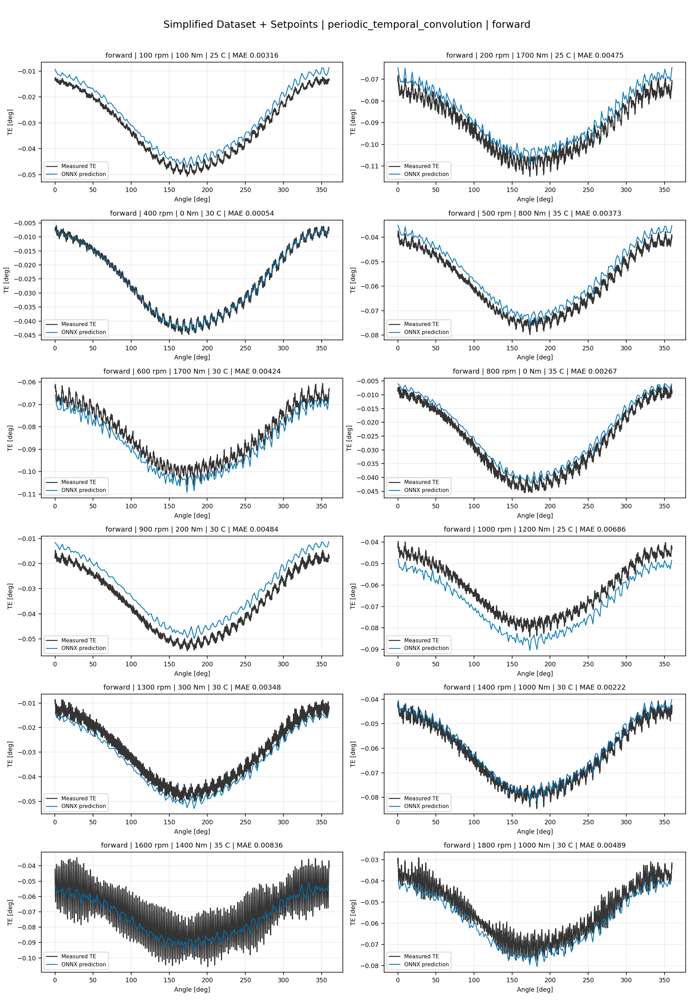
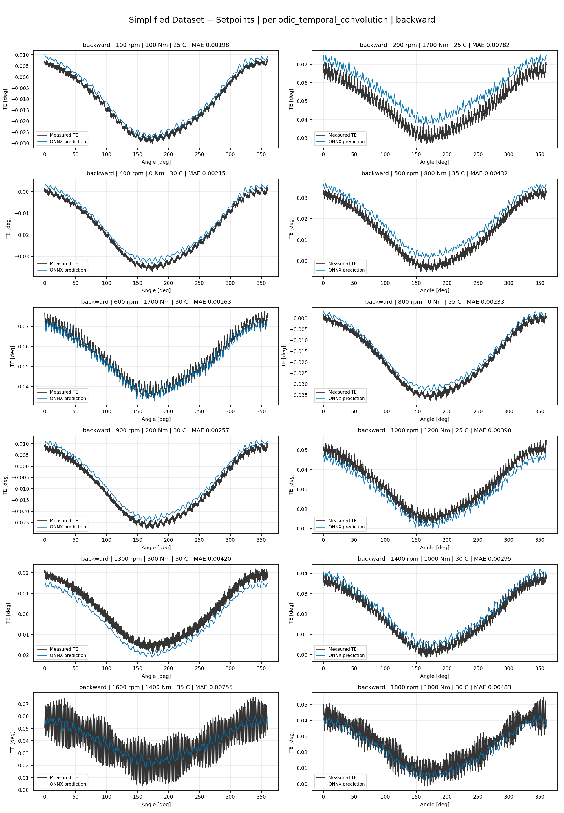
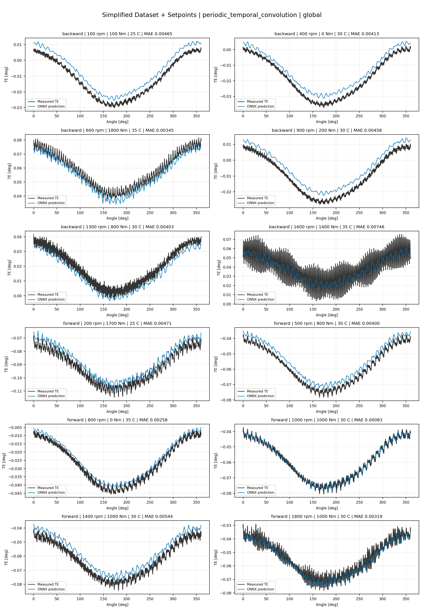
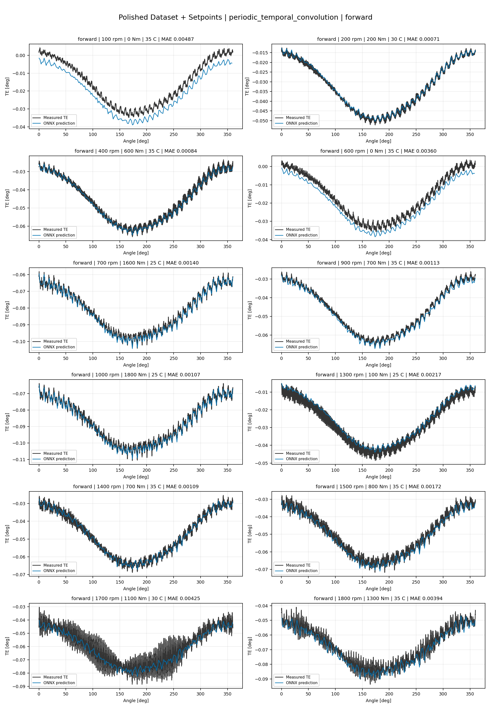
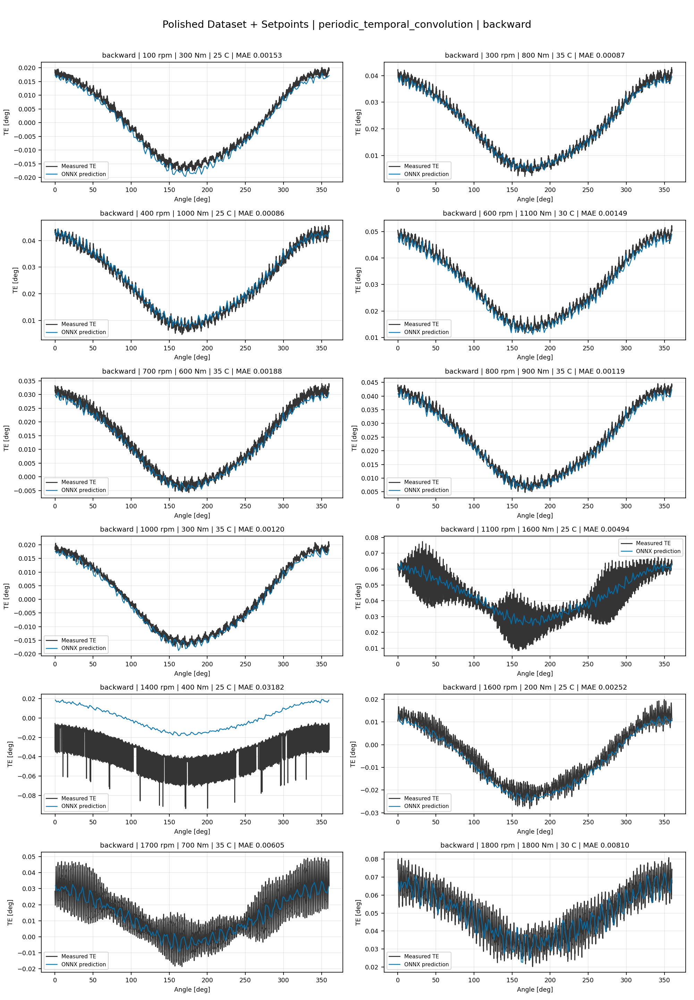
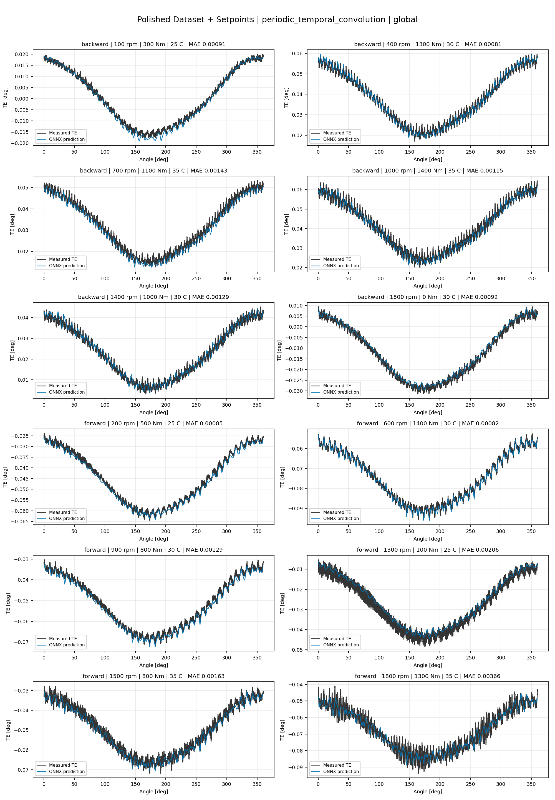
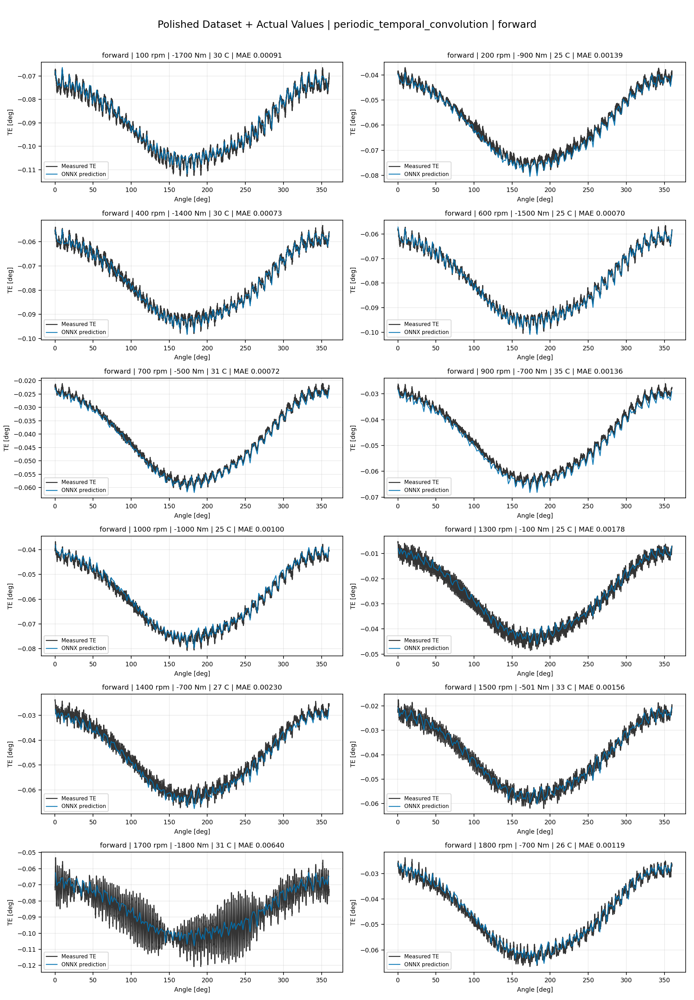
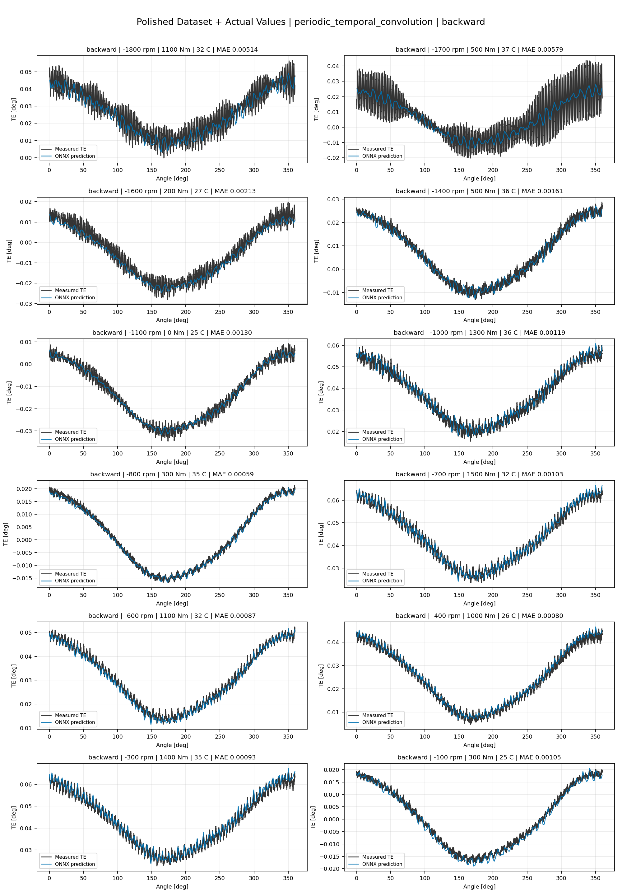
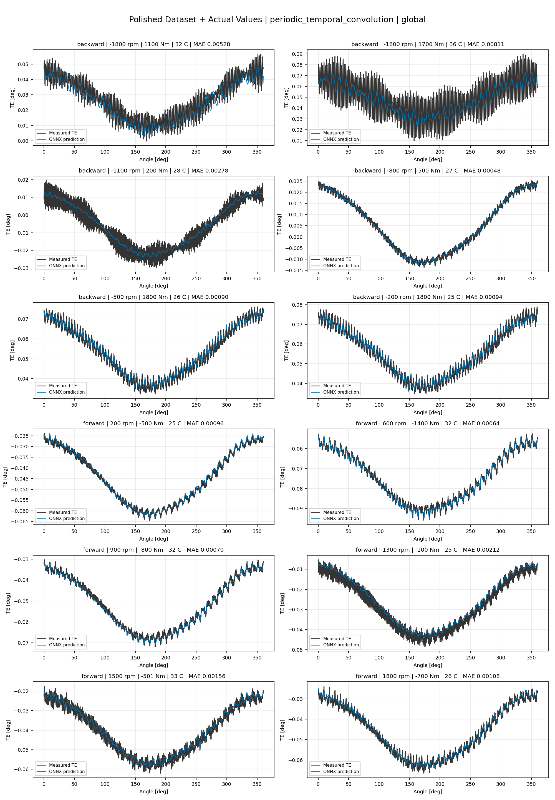

# TE Curve Verification Pipeline Familywise ONNX Report - periodic_temporal_convolution

## Overview

This report evaluates exported ONNX models from the dataset input-mode
retraining program. Each dataset/input-mode section uses dataset-matched
held-out test curves and lists the exact model artifacts loaded from
`models/`.

Rank-3 temporal ONNX exports are evaluated on the sequence-window test
contract stored in each `training_config.snapshot.yaml`, including
`sequence_length`, `sequence_stride`, `sequence_target_position`, and
`maximum_sequences_per_curve`.
The collage pages keep the measured TE trace at the original full-curve
resolution; temporal ONNX predictions are overlaid at the evaluated
sequence-target angles.

The report is diagnostic and family-specific. It does not replace an
official multi-index model-promotion decision.

## Output Artifacts

- output directory: `output/validation_checks/track2_familywise_onnx_report/periodic_temporal_convolution/2026-07-08-23-45-38__track2_periodic_temporal_convolution_familywise_onnx_report`;
- summary YAML: `output/validation_checks/track2_familywise_onnx_report/periodic_temporal_convolution/2026-07-08-23-45-38__track2_periodic_temporal_convolution_familywise_onnx_report/track2_familywise_onnx_report_summary.yaml`;
- model inventory CSV: `output/validation_checks/track2_familywise_onnx_report/periodic_temporal_convolution/2026-07-08-23-45-38__track2_periodic_temporal_convolution_familywise_onnx_report/model_inventory.csv`;
- per-curve metrics CSV: `output/validation_checks/track2_familywise_onnx_report/periodic_temporal_convolution/2026-07-08-23-45-38__track2_periodic_temporal_convolution_familywise_onnx_report/per_curve_metrics.csv`.

## Simplified Dataset + Setpoints

- dataset: `simplified_dataset`;
- input mode: `setpoints`;
- evaluated family: `periodic_temporal_convolution`;
- dataset root: `data/simplified_dataset`.

### Models Used

| Surface | Run Name | Run Instance | Dataset Schema |
| --- | --- | --- | --- |
| forward | `te_periodic_temporal_convolution_fw__simplified_setpoints` | `2026-07-08-19-19-28__te_periodic_temporal_convolution_fw__simplified_setpoints` | `simplified_curve_v1` |
| backward | `te_periodic_temporal_convolution_bw__simplified_setpoints` | `2026-07-08-19-25-24__te_periodic_temporal_convolution_bw__simplified_setpoints` | `simplified_curve_v1` |
| global | `te_periodic_temporal_convolution_global__simplified_setpoints` | `2026-07-08-19-09-50__te_periodic_temporal_convolution_global__simplified_setpoints` | `simplified_curve_v1` |

Exact model paths:

| Surface | ONNX Model Path | Python Model Path |
| --- | --- | --- |
| forward | `models/simplified_dataset/setpoints/exported/periodic_temporal_convolution/forward/2026-07-08-19-19-28__te_periodic_temporal_convolution_fw__simplified_setpoints/onnx/model.onnx` | `models/simplified_dataset/setpoints/exported/periodic_temporal_convolution/forward/2026-07-08-19-19-28__te_periodic_temporal_convolution_fw__simplified_setpoints/python/periodic_temporal_convolution-epoch=050-val_mae=0.00364466.ckpt` |
| backward | `models/simplified_dataset/setpoints/exported/periodic_temporal_convolution/backward/2026-07-08-19-25-24__te_periodic_temporal_convolution_bw__simplified_setpoints/onnx/model.onnx` | `models/simplified_dataset/setpoints/exported/periodic_temporal_convolution/backward/2026-07-08-19-25-24__te_periodic_temporal_convolution_bw__simplified_setpoints/python/periodic_temporal_convolution-epoch=066-val_mae=0.00355314.ckpt` |
| global | `models/simplified_dataset/setpoints/exported/periodic_temporal_convolution/global/2026-07-08-19-09-50__te_periodic_temporal_convolution_global__simplified_setpoints/onnx/model.onnx` | `models/simplified_dataset/setpoints/exported/periodic_temporal_convolution/global/2026-07-08-19-09-50__te_periodic_temporal_convolution_global__simplified_setpoints/python/periodic_temporal_convolution-epoch=095-val_mae=0.00360046.ckpt` |

### Aggregate Metrics

| Surface | Curves | MAE [deg] | RMSE [deg] | Mean Error [%] | P95 Error [%] |
| --- | ---: | ---: | ---: | ---: | ---: |
| forward | 97 | 0.003422 | 0.003679 | 8.000 | 13.997 |
| backward | 97 | 0.003445 | 0.003790 | 8.028 | 14.132 |
| global | 194 | 0.003436 | 0.003734 | 8.044 | 13.923 |

Offset And Shape Metrics:

| Surface | Signed Offset [deg] | Absolute Offset [deg] | Centered MAE [deg] | P2P Error [deg] |
| --- | ---: | ---: | ---: | ---: |
| forward | -0.001096 | 0.003099 | 0.001182 | 0.002074 |
| backward | 0.000134 | 0.002870 | 0.001580 | 0.003763 |
| global | 0.000343 | 0.002987 | 0.001374 | 0.002565 |

### Forward 12-Curve Page

### Backward 12-Curve Page

### Global 12-Curve Page

## Polished Dataset + Setpoints

- dataset: `polished_dataset`;
- input mode: `setpoints`;
- evaluated family: `periodic_temporal_convolution`;
- dataset root: `data/polished_dataset`.

### Models Used

| Surface | Run Name | Run Instance | Dataset Schema |
| --- | --- | --- | --- |
| forward | `te_periodic_temporal_convolution_fw__polished_setpoints` | `2026-07-08-19-59-14__te_periodic_temporal_convolution_fw__polished_setpoints` | `polished_setpoint_curve_v1` |
| backward | `te_periodic_temporal_convolution_bw__polished_setpoints` | `2026-07-08-20-12-10__te_periodic_temporal_convolution_bw__polished_setpoints` | `polished_setpoint_curve_v1` |
| global | `te_periodic_temporal_convolution_global__polished_setpoints` | `2026-07-08-19-44-50__te_periodic_temporal_convolution_global__polished_setpoints` | `polished_setpoint_curve_v1` |

Exact model paths:

| Surface | ONNX Model Path | Python Model Path |
| --- | --- | --- |
| forward | `models/polished_dataset/setpoints/exported/periodic_temporal_convolution/forward/2026-07-08-19-59-14__te_periodic_temporal_convolution_fw__polished_setpoints/onnx/model.onnx` | `models/polished_dataset/setpoints/exported/periodic_temporal_convolution/forward/2026-07-08-19-59-14__te_periodic_temporal_convolution_fw__polished_setpoints/python/periodic_temporal_convolution-epoch=040-val_mae=0.00194544.ckpt` |
| backward | `models/polished_dataset/setpoints/exported/periodic_temporal_convolution/backward/2026-07-08-20-12-10__te_periodic_temporal_convolution_bw__polished_setpoints/onnx/model.onnx` | `models/polished_dataset/setpoints/exported/periodic_temporal_convolution/backward/2026-07-08-20-12-10__te_periodic_temporal_convolution_bw__polished_setpoints/python/periodic_temporal_convolution-epoch=048-val_mae=0.00196877.ckpt` |
| global | `models/polished_dataset/setpoints/exported/periodic_temporal_convolution/global/2026-07-08-19-44-50__te_periodic_temporal_convolution_global__polished_setpoints/onnx/model.onnx` | `models/polished_dataset/setpoints/exported/periodic_temporal_convolution/global/2026-07-08-19-44-50__te_periodic_temporal_convolution_global__polished_setpoints/python/periodic_temporal_convolution-epoch=050-val_mae=0.00196079.ckpt` |

### Aggregate Metrics

| Surface | Curves | MAE [deg] | RMSE [deg] | Mean Error [%] | P95 Error [%] |
| --- | ---: | ---: | ---: | ---: | ---: |
| forward | 100 | 0.001985 | 0.002336 | 4.406 | 10.341 |
| backward | 94 | 0.002591 | 0.003039 | 4.862 | 11.266 |
| global | 194 | 0.002236 | 0.002638 | 4.517 | 10.346 |

Offset And Shape Metrics:

| Surface | Signed Offset [deg] | Absolute Offset [deg] | Centered MAE [deg] | P2P Error [deg] |
| --- | ---: | ---: | ---: | ---: |
| forward | -0.000539 | 0.001175 | 0.001475 | 0.002655 |
| backward | -0.000212 | 0.001142 | 0.002128 | 0.005466 |
| global | -0.000032 | 0.001009 | 0.001812 | 0.003988 |

### Forward 12-Curve Page

### Backward 12-Curve Page

### Global 12-Curve Page

## Polished Dataset + Actual Values

- dataset: `polished_dataset`;
- input mode: `actual_values`;
- evaluated family: `periodic_temporal_convolution`;
- dataset root: `data/polished_dataset`.

### Models Used

| Surface | Run Name | Run Instance | Dataset Schema |
| --- | --- | --- | --- |
| forward | `te_periodic_temporal_convolution_fw__polished_actual_values` | `2026-07-08-21-06-17__te_periodic_temporal_convolution_fw__polished_actual_values` | `polished_point_v1` |
| backward | `te_periodic_temporal_convolution_bw__polished_actual_values` | `2026-07-08-21-27-59__te_periodic_temporal_convolution_bw__polished_actual_values` | `polished_point_v1` |
| global | `te_periodic_temporal_convolution_global__polished_actual_values` | `2026-07-08-20-40-43__te_periodic_temporal_convolution_global__polished_actual_values` | `polished_point_v1` |

Exact model paths:

| Surface | ONNX Model Path | Python Model Path |
| --- | --- | --- |
| forward | `models/polished_dataset/actual_values/exported/periodic_temporal_convolution/forward/2026-07-08-21-06-17__te_periodic_temporal_convolution_fw__polished_actual_values/onnx/model.onnx` | `models/polished_dataset/actual_values/exported/periodic_temporal_convolution/forward/2026-07-08-21-06-17__te_periodic_temporal_convolution_fw__polished_actual_values/python/periodic_temporal_convolution-epoch=087-val_mae=0.00193888.ckpt` |
| backward | `models/polished_dataset/actual_values/exported/periodic_temporal_convolution/backward/2026-07-08-21-27-59__te_periodic_temporal_convolution_bw__polished_actual_values/onnx/model.onnx` | `models/polished_dataset/actual_values/exported/periodic_temporal_convolution/backward/2026-07-08-21-27-59__te_periodic_temporal_convolution_bw__polished_actual_values/python/periodic_temporal_convolution-epoch=093-val_mae=0.00186606.ckpt` |
| global | `models/polished_dataset/actual_values/exported/periodic_temporal_convolution/global/2026-07-08-20-40-43__te_periodic_temporal_convolution_global__polished_actual_values/onnx/model.onnx` | `models/polished_dataset/actual_values/exported/periodic_temporal_convolution/global/2026-07-08-20-40-43__te_periodic_temporal_convolution_global__polished_actual_values/python/periodic_temporal_convolution-epoch=109-val_mae=0.00190820.ckpt` |

### Aggregate Metrics

| Surface | Curves | MAE [deg] | RMSE [deg] | Mean Error [%] | P95 Error [%] |
| --- | ---: | ---: | ---: | ---: | ---: |
| forward | 100 | 0.001886 | 0.002237 | 4.160 | 10.342 |
| backward | 94 | 0.002193 | 0.002653 | 4.238 | 10.628 |
| global | 194 | 0.002000 | 0.002395 | 4.117 | 10.372 |

Offset And Shape Metrics:

| Surface | Signed Offset [deg] | Absolute Offset [deg] | Centered MAE [deg] | P2P Error [deg] |
| --- | ---: | ---: | ---: | ---: |
| forward | -0.000550 | 0.000960 | 0.001506 | 0.002522 |
| backward | -0.000038 | 0.000616 | 0.002069 | 0.004861 |
| global | -0.000057 | 0.000773 | 0.001751 | 0.003649 |

### Forward 12-Curve Page

### Backward 12-Curve Page

### Global 12-Curve Page

