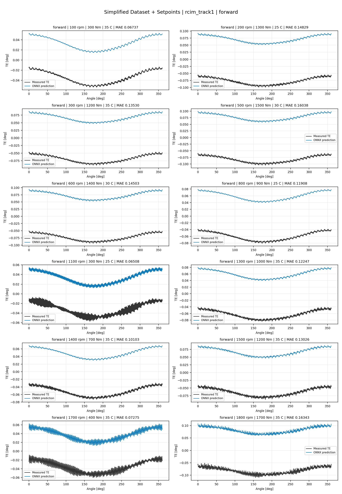
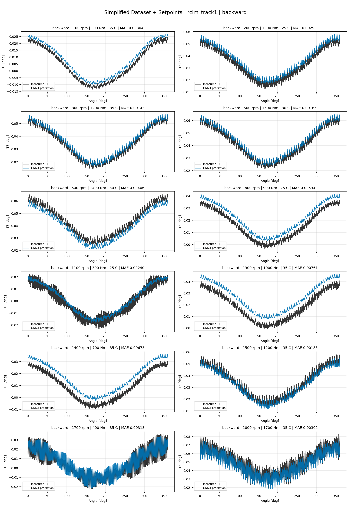
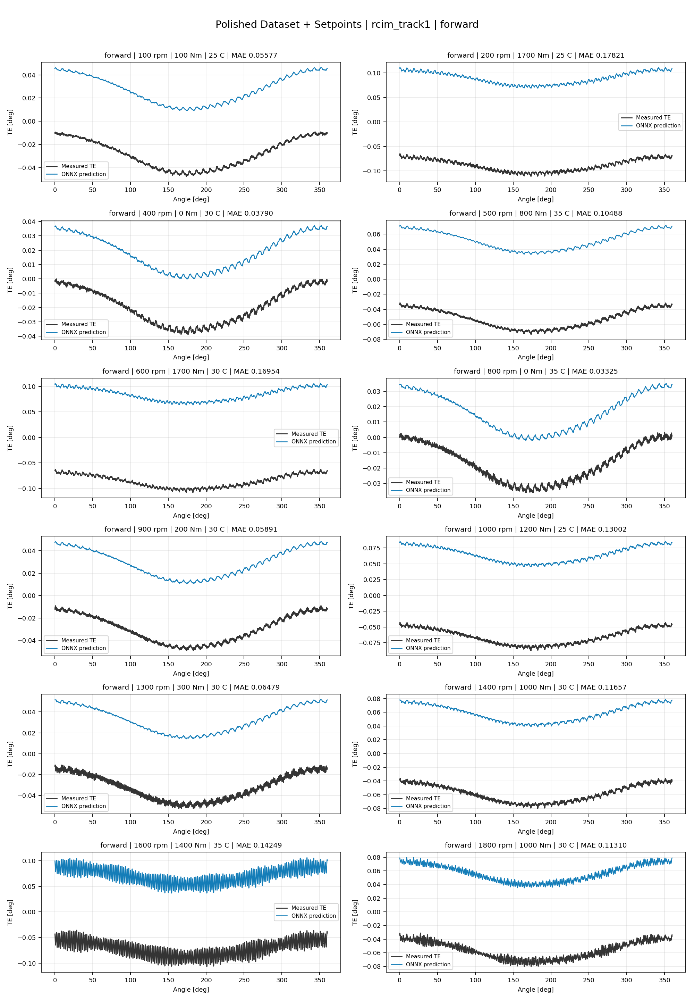
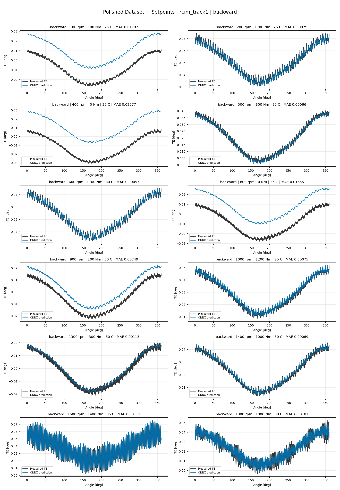
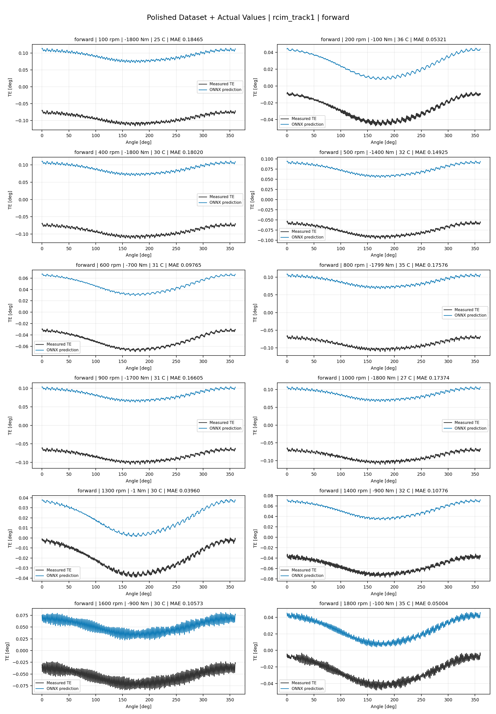
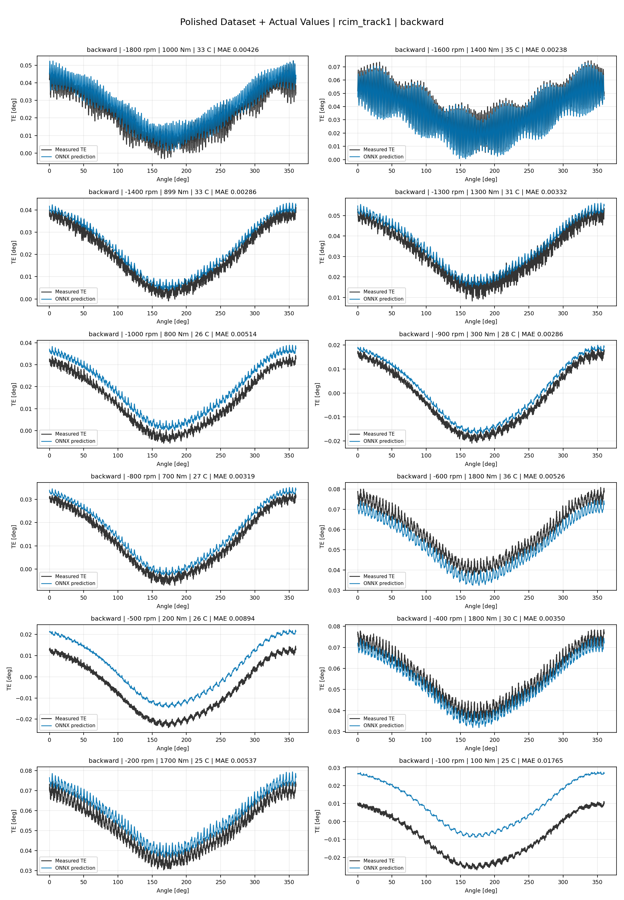
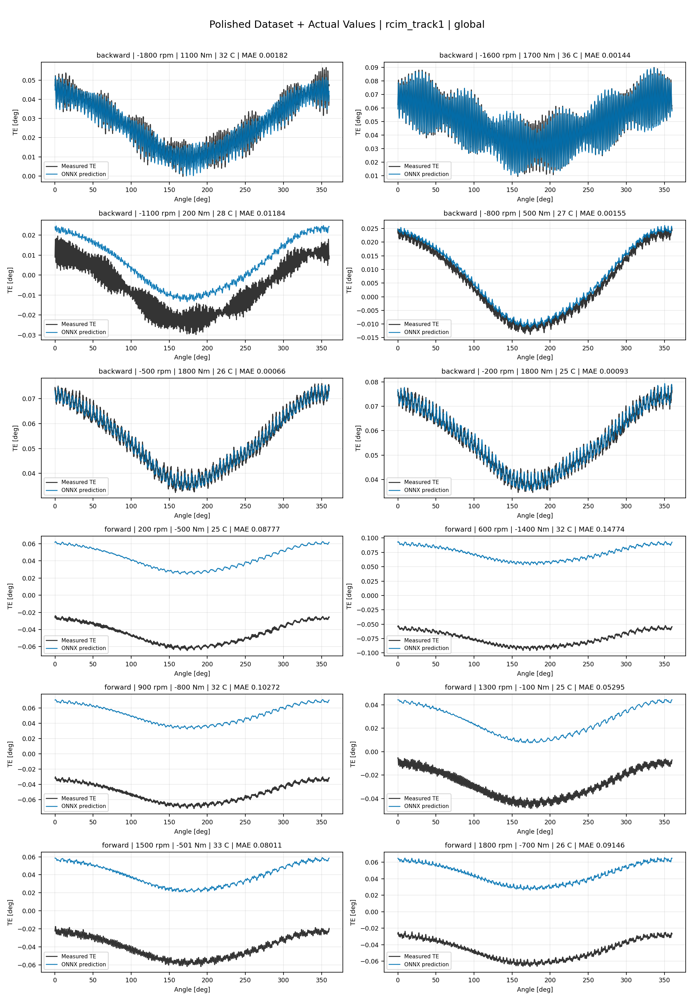

# TE Curve Verification Pipeline Familywise ONNX Report - rcim_track1

## Overview

This report evaluates `rcim_track1` paper-reference model-bank archives.
Each surface loads the selected harmonic amplitude/phase ONNX components
from `models/`, reconstructs full TE curves, and compares those curves
against dataset-matched held-out measured TE traces.

Unlike standard familywise model-development exports, `rcim_track1` uses
a component bank rather than one ONNX file per surface. The surface tables
therefore list archive roots and inventory paths; every exact component
ONNX and Python path is recorded in the component inventory CSV.
The surface path table intentionally uses archive-root glob patterns
because one `rcim_track1` surface is assembled from 19 component ONNX
models rather than from a single surface-level ONNX file.
The harmonic reconstruction applies the paper-faithful `h0` sign
convention per curve direction: forward curves use `-1`, backward
curves use `+1`.

## Output Artifacts

- output directory: `output/validation_checks/track2_familywise_onnx_report/rcim_track1/2026-07-20-12-53-15__track2_rcim_track1_familywise_onnx_report`;
- summary YAML: `output/validation_checks/track2_familywise_onnx_report/rcim_track1/2026-07-20-12-53-15__track2_rcim_track1_familywise_onnx_report/track2_familywise_onnx_report_summary.yaml`;
- model inventory CSV: `output/validation_checks/track2_familywise_onnx_report/rcim_track1/2026-07-20-12-53-15__track2_rcim_track1_familywise_onnx_report/model_inventory.csv`;
- component model inventory CSV: `output/validation_checks/track2_familywise_onnx_report/rcim_track1/2026-07-20-12-53-15__track2_rcim_track1_familywise_onnx_report/component_model_inventory.csv`;
- per-curve metrics CSV: `output/validation_checks/track2_familywise_onnx_report/rcim_track1/2026-07-20-12-53-15__track2_rcim_track1_familywise_onnx_report/per_curve_metrics.csv`.

## Simplified Dataset + Setpoints

- dataset: `simplified_dataset`;
- input mode: `setpoints`;
- evaluated family: `rcim_track1`;
- dataset root: `data/simplified_dataset`.

### Models Used

| Surface | Run Name | Run Instance | Dataset Schema |
| --- | --- | --- | --- |
| forward | `rcim_track1_simplified_setpoints_forward` | `historical_simplified_rcim_track1_component_winner_bank` | `simplified_curve_v1` |
| backward | `rcim_track1_simplified_setpoints_backward` | `historical_simplified_rcim_track1_component_winner_bank` | `simplified_curve_v1` |

Exact model paths:

| Surface | ONNX Model Path | Python Model Path |
| --- | --- | --- |
| forward | `models/simplified_dataset/paper_reference/rcim_track1/forward/*/onnx/*/*.onnx` | `models/simplified_dataset/paper_reference/rcim_track1/forward/*/python/*/*.pkl` |
| backward | `models/simplified_dataset/paper_reference/rcim_track1/backward/*/onnx/*/*.onnx` | `models/simplified_dataset/paper_reference/rcim_track1/backward/*/python/*/*.pkl` |
| global | `not available in archive` | `not available in archive` |

### Aggregate Metrics

| Surface | Curves | MAE [deg] | RMSE [deg] | Mean Error [%] | P95 Error [%] |
| --- | ---: | ---: | ---: | ---: | ---: |
| forward | 97 | 0.003223 | 0.003465 | 7.099 | 15.049 |
| backward | 97 | 0.004107 | 0.004324 | 9.385 | 22.179 |

Offset And Shape Metrics:

| Surface | Signed Offset [deg] | Absolute Offset [deg] | Centered MAE [deg] | P2P Error [deg] |
| --- | ---: | ---: | ---: | ---: |
| forward | 0.000370 | 0.003028 | 0.001044 | 0.004022 |
| backward | 0.001922 | 0.003809 | 0.001066 | 0.003162 |

Unavailable surfaces:

- `global`: no archive exists under the dataset-matched `paper_reference/rcim_track1` root.

### Forward 12-Curve Page

### Backward 12-Curve Page

## Polished Dataset + Setpoints

- dataset: `polished_dataset`;
- input mode: `setpoints`;
- evaluated family: `rcim_track1`;
- dataset root: `data/polished_dataset`.

### Models Used

| Surface | Run Name | Run Instance | Dataset Schema |
| --- | --- | --- | --- |
| forward | `rcim_track1_polished_setpoints_fw` | `2026-07-13-21-11-39__rcim_track1_polished_setpoints_fw_rcim_track1_polished_input_mode_campaign_validation` | `polished_setpoint_curve_v1` |
| backward | `rcim_track1_polished_setpoints_bw` | `2026-07-13-21-11-39__rcim_track1_polished_setpoints_bw_rcim_track1_polished_input_mode_campaign_validation` | `polished_setpoint_curve_v1` |
| global | `rcim_track1_polished_setpoints_global` | `2026-07-13-21-11-39__rcim_track1_polished_setpoints_global_rcim_track1_polished_input_mode_campaign_validation` | `polished_setpoint_curve_v1` |

Exact model paths:

| Surface | ONNX Model Path | Python Model Path |
| --- | --- | --- |
| forward | `models/polished_dataset/paper_reference/rcim_track1/setpoints/forward/*/onnx/*/*.onnx` | `models/polished_dataset/paper_reference/rcim_track1/setpoints/forward/*/python/*/*.pkl` |
| backward | `models/polished_dataset/paper_reference/rcim_track1/setpoints/backward/*/onnx/*/*.onnx` | `models/polished_dataset/paper_reference/rcim_track1/setpoints/backward/*/python/*/*.pkl` |
| global | `models/polished_dataset/paper_reference/rcim_track1/setpoints/global/*/onnx/*/*.onnx` | `models/polished_dataset/paper_reference/rcim_track1/setpoints/global/*/python/*/*.pkl` |

### Aggregate Metrics

| Surface | Curves | MAE [deg] | RMSE [deg] | Mean Error [%] | P95 Error [%] |
| --- | ---: | ---: | ---: | ---: | ---: |
| forward | 97 | 0.001169 | 0.001389 | 2.527 | 5.814 |
| backward | 97 | 0.003582 | 0.003794 | 8.356 | 42.764 |
| global | 194 | 0.002490 | 0.002756 | 5.218 | 21.742 |

Offset And Shape Metrics:

| Surface | Signed Offset [deg] | Absolute Offset [deg] | Centered MAE [deg] | P2P Error [deg] |
| --- | ---: | ---: | ---: | ---: |
| forward | -0.000111 | 0.000769 | 0.000850 | 0.003634 |
| backward | 0.002612 | 0.003175 | 0.000970 | 0.002682 |
| global | 0.001207 | 0.001837 | 0.001174 | 0.004152 |

### Forward 12-Curve Page

### Backward 12-Curve Page

### Global 12-Curve Page

## Polished Dataset + Actual Values

- dataset: `polished_dataset`;
- input mode: `actual_values`;
- evaluated family: `rcim_track1`;
- dataset root: `data/polished_dataset`.

### Models Used

| Surface | Run Name | Run Instance | Dataset Schema |
| --- | --- | --- | --- |
| forward | `rcim_track1_polished_actual_values_fw` | `2026-07-18-11-55-05__rcim_track1_polished_actual_values_fw_rcim_track1_polished_input_mode_campaign_validation` | `polished_point_v1` |
| backward | `rcim_track1_polished_actual_values_bw` | `2026-07-18-11-56-46__rcim_track1_polished_actual_values_bw_rcim_track1_polished_input_mode_campaign_validation` | `polished_point_v1` |
| global | `rcim_track1_polished_actual_values_global` | `2026-07-18-11-55-05__rcim_track1_polished_actual_values_global_rcim_track1_polished_input_mode_campaign_validation` | `polished_point_v1` |

Exact model paths:

| Surface | ONNX Model Path | Python Model Path |
| --- | --- | --- |
| forward | `models/polished_dataset/paper_reference/rcim_track1/actual_values/forward/*/onnx/*/*.onnx` | `models/polished_dataset/paper_reference/rcim_track1/actual_values/forward/*/python/*/*.pkl` |
| backward | `models/polished_dataset/paper_reference/rcim_track1/actual_values/backward/*/onnx/*/*.onnx` | `models/polished_dataset/paper_reference/rcim_track1/actual_values/backward/*/python/*/*.pkl` |
| global | `models/polished_dataset/paper_reference/rcim_track1/actual_values/global/*/onnx/*/*.onnx` | `models/polished_dataset/paper_reference/rcim_track1/actual_values/global/*/python/*/*.pkl` |

### Aggregate Metrics

| Surface | Curves | MAE [deg] | RMSE [deg] | Mean Error [%] | P95 Error [%] |
| --- | ---: | ---: | ---: | ---: | ---: |
| forward | 97 | 0.001250 | 0.001469 | 2.700 | 6.166 |
| backward | 97 | 0.004765 | 0.004951 | 11.063 | 42.080 |
| global | 194 | 0.002532 | 0.002810 | 5.291 | 20.392 |

Offset And Shape Metrics:

| Surface | Signed Offset [deg] | Absolute Offset [deg] | Centered MAE [deg] | P2P Error [deg] |
| --- | ---: | ---: | ---: | ---: |
| forward | 0.000039 | 0.000808 | 0.000872 | 0.003662 |
| backward | 0.003020 | 0.004626 | 0.000920 | 0.002679 |
| global | 0.001284 | 0.001857 | 0.001231 | 0.003953 |

### Forward 12-Curve Page

### Backward 12-Curve Page

### Global 12-Curve Page

