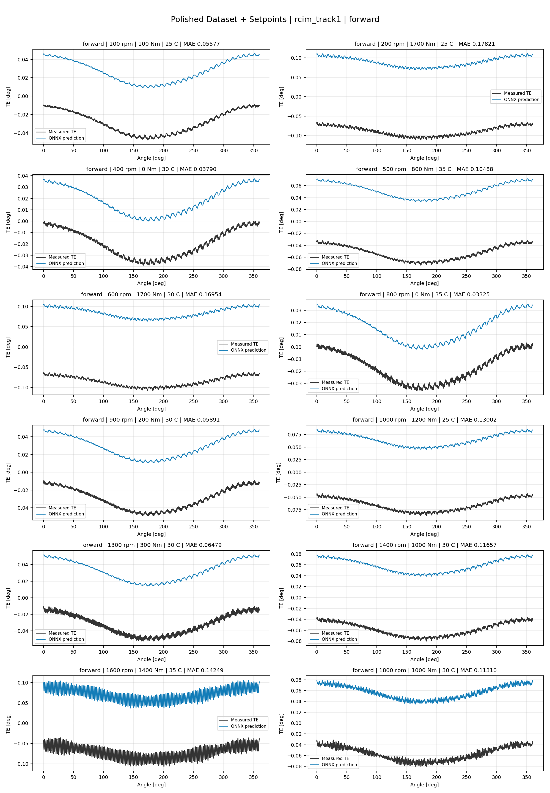
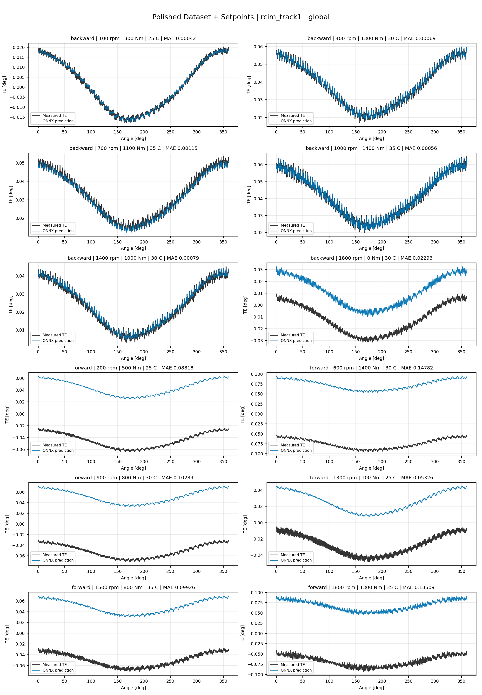

# TE Curve Verification Pipeline Familywise ONNX Report - rcim_track1

## Overview

This report evaluates `rcim_track1` paper-reference model-bank archives.
Each surface loads the selected harmonic amplitude/phase ONNX components
from `models/`, reconstructs full TE curves, and compares those curves
against dataset-matched held-out measured TE traces.

Unlike standard familywise model-development exports, `rcim_track1` uses
a component bank rather than one ONNX file per surface. The surface tables
therefore list archive roots and inventory paths; every exact component
ONNX and Python path is recorded in the component inventory CSV.
The surface path table intentionally uses archive-root glob patterns
because one `rcim_track1` surface is assembled from 19 component ONNX
models rather than from a single surface-level ONNX file.

## Output Artifacts

- output directory: `output/validation_checks/track2_familywise_onnx_report/rcim_track1/2026-07-19-17-09-08__track2_rcim_track1_polished_setpoints_familywise_onnx_report`;
- summary YAML: `output/validation_checks/track2_familywise_onnx_report/rcim_track1/2026-07-19-17-09-08__track2_rcim_track1_polished_setpoints_familywise_onnx_report/track2_familywise_onnx_report_summary.yaml`;
- model inventory CSV: `output/validation_checks/track2_familywise_onnx_report/rcim_track1/2026-07-19-17-09-08__track2_rcim_track1_polished_setpoints_familywise_onnx_report/model_inventory.csv`;
- component model inventory CSV: `output/validation_checks/track2_familywise_onnx_report/rcim_track1/2026-07-19-17-09-08__track2_rcim_track1_polished_setpoints_familywise_onnx_report/component_model_inventory.csv`;
- per-curve metrics CSV: `output/validation_checks/track2_familywise_onnx_report/rcim_track1/2026-07-19-17-09-08__track2_rcim_track1_polished_setpoints_familywise_onnx_report/per_curve_metrics.csv`.

## Polished Dataset + Setpoints

- dataset: `polished_dataset`;
- input mode: `setpoints`;
- evaluated family: `rcim_track1`;
- dataset root: `data/polished_dataset`.

### Models Used

| Surface | Run Name | Run Instance | Dataset Schema |
| --- | --- | --- | --- |
| forward | `rcim_track1_polished_setpoints_fw` | `2026-07-13-21-11-39__rcim_track1_polished_setpoints_fw_rcim_track1_polished_input_mode_campaign_validation` | `polished_setpoint_curve_v1` |
| backward | `rcim_track1_polished_setpoints_bw` | `2026-07-13-21-11-39__rcim_track1_polished_setpoints_bw_rcim_track1_polished_input_mode_campaign_validation` | `polished_setpoint_curve_v1` |
| global | `rcim_track1_polished_setpoints_global` | `2026-07-13-21-11-39__rcim_track1_polished_setpoints_global_rcim_track1_polished_input_mode_campaign_validation` | `polished_setpoint_curve_v1` |

Exact model paths:

| Surface | ONNX Model Path | Python Model Path |
| --- | --- | --- |
| forward | `models/polished_dataset/paper_reference/rcim_track1/setpoints/forward/*/onnx/*/*.onnx` | `models/polished_dataset/paper_reference/rcim_track1/setpoints/forward/*/python/*/*.pkl` |
| backward | `models/polished_dataset/paper_reference/rcim_track1/setpoints/backward/*/onnx/*/*.onnx` | `models/polished_dataset/paper_reference/rcim_track1/setpoints/backward/*/python/*/*.pkl` |
| global | `models/polished_dataset/paper_reference/rcim_track1/setpoints/global/*/onnx/*/*.onnx` | `models/polished_dataset/paper_reference/rcim_track1/setpoints/global/*/python/*/*.pkl` |

### Aggregate Metrics

| Surface | Curves | MAE [deg] | RMSE [deg] | Mean Error [%] | P95 Error [%] |
| --- | ---: | ---: | ---: | ---: | ---: |
| forward | 97 | 0.115062 | 0.115071 | 255.560 | 382.580 |
| backward | 97 | 0.003582 | 0.003794 | 8.356 | 42.764 |
| global | 194 | 0.057251 | 0.057389 | 124.423 | 353.865 |

Offset And Shape Metrics:

| Surface | Signed Offset [deg] | Absolute Offset [deg] | Centered MAE [deg] | P2P Error [deg] |
| --- | ---: | ---: | ---: | ---: |
| forward | 0.115062 | 0.115062 | 0.000850 | 0.003634 |
| backward | 0.002612 | 0.003175 | 0.000970 | 0.002682 |
| global | 0.056691 | 0.056939 | 0.001174 | 0.004152 |

### Forward 12-Curve Page

### Backward 12-Curve Page

### Global 12-Curve Page

