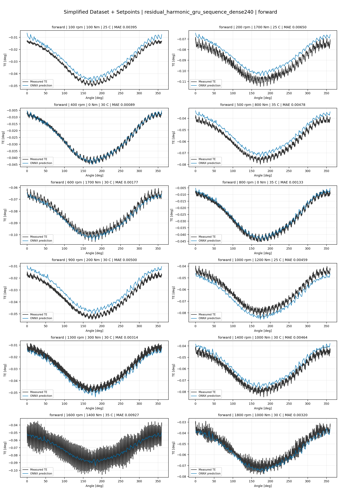
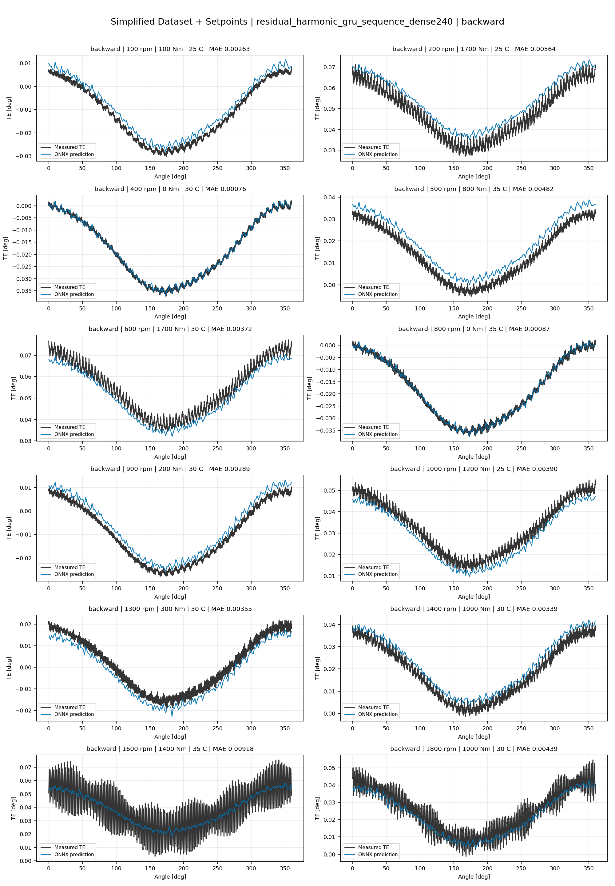
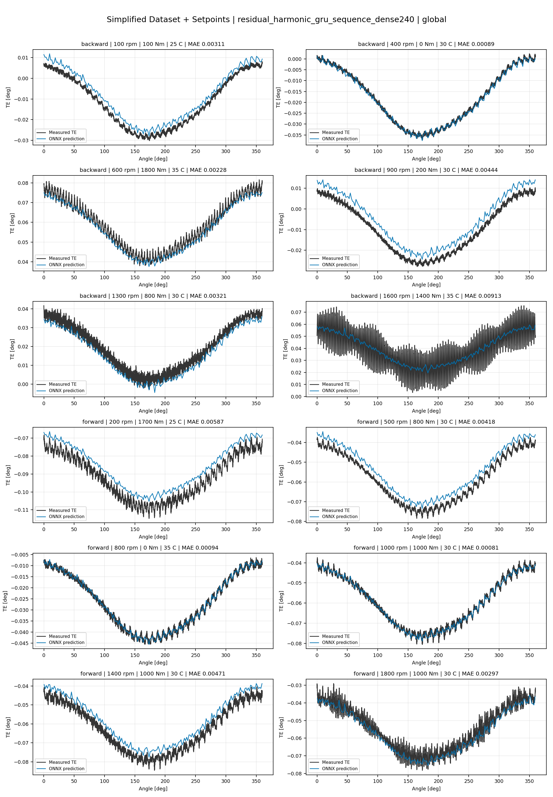
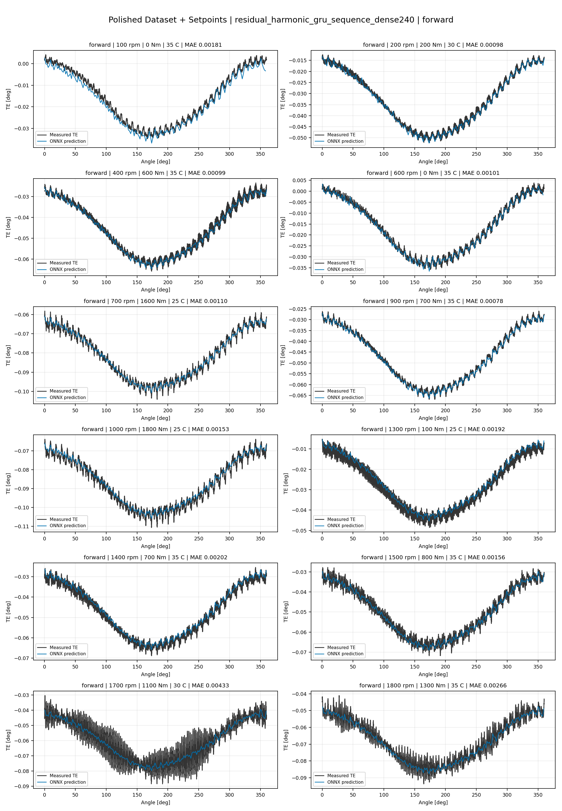
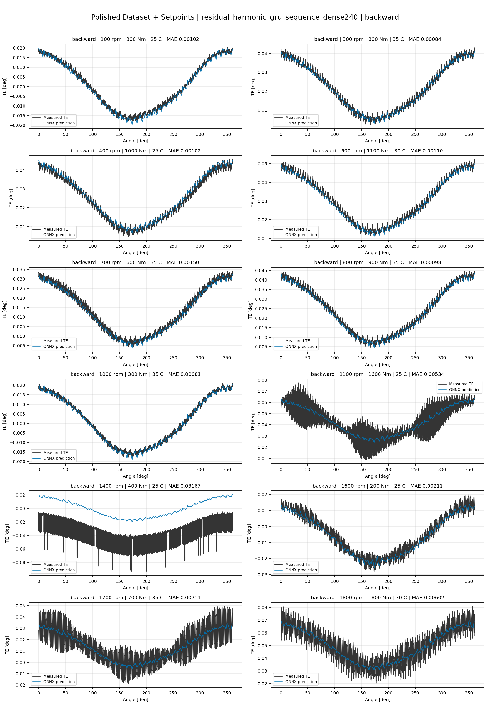
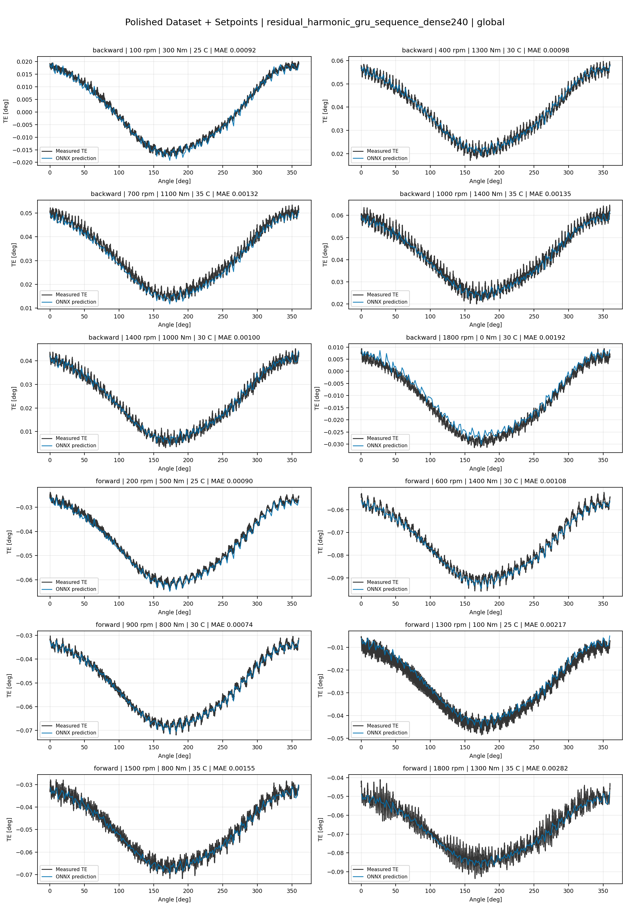
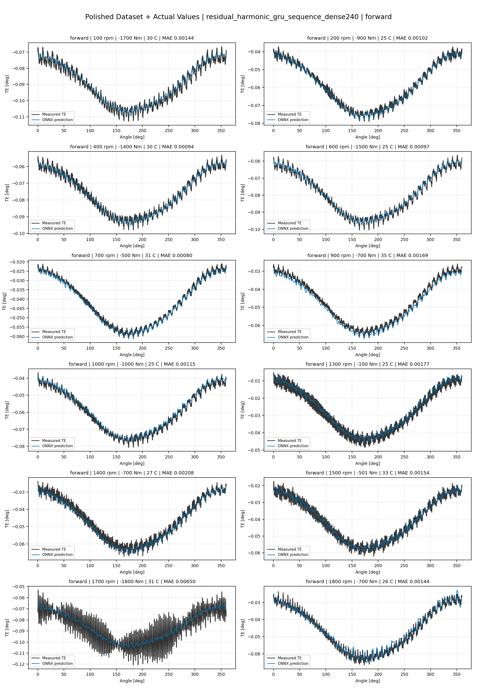
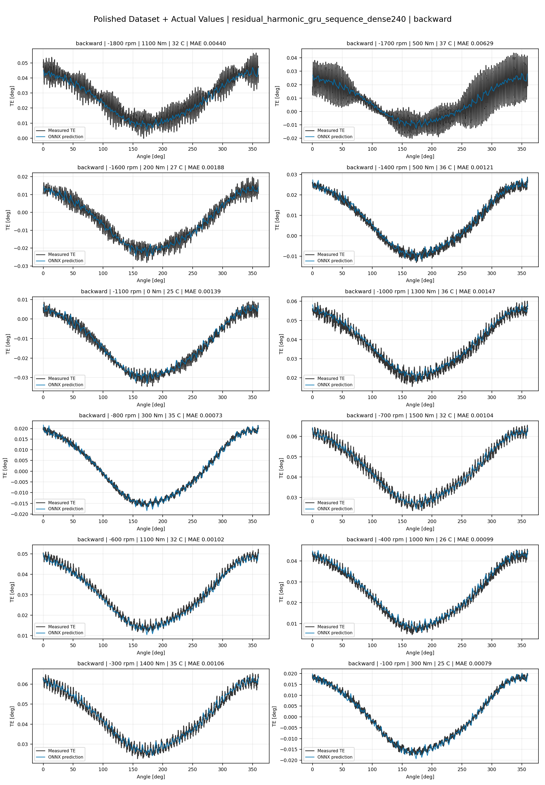
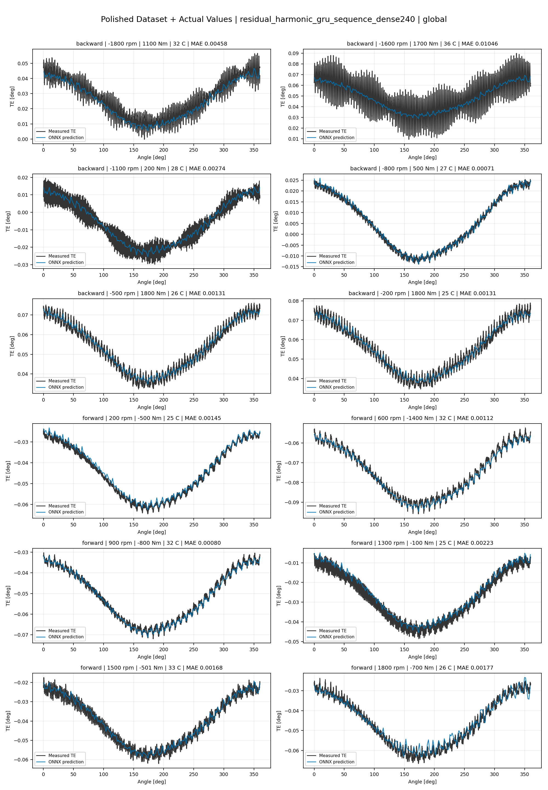

# TE Curve Verification Pipeline Familywise ONNX Report - residual_harmonic_gru_sequence_dense240

## Overview

This report evaluates exported ONNX models from the dataset input-mode
retraining program. Each dataset/input-mode section uses dataset-matched
held-out test curves and lists the exact model artifacts loaded from
`models/`.

Rank-3 temporal ONNX exports are evaluated on the sequence-window test
contract stored in each `training_config.snapshot.yaml`, including
`sequence_length`, `sequence_stride`, `sequence_target_position`, and
`maximum_sequences_per_curve`.
The collage pages keep the measured TE trace at the original full-curve
resolution; temporal ONNX predictions are overlaid at the evaluated
sequence-target angles.

The report is diagnostic and family-specific. It does not replace an
official multi-index model-promotion decision.

## Output Artifacts

- output directory: `output/validation_checks/track2_familywise_onnx_report/residual_harmonic_gru_sequence_dense240/2026-07-09-13-29-35__track2_residual_harmonic_gru_sequence_dense240_familywise_onnx_report`;
- summary YAML: `output/validation_checks/track2_familywise_onnx_report/residual_harmonic_gru_sequence_dense240/2026-07-09-13-29-35__track2_residual_harmonic_gru_sequence_dense240_familywise_onnx_report/track2_familywise_onnx_report_summary.yaml`;
- model inventory CSV: `output/validation_checks/track2_familywise_onnx_report/residual_harmonic_gru_sequence_dense240/2026-07-09-13-29-35__track2_residual_harmonic_gru_sequence_dense240_familywise_onnx_report/model_inventory.csv`;
- per-curve metrics CSV: `output/validation_checks/track2_familywise_onnx_report/residual_harmonic_gru_sequence_dense240/2026-07-09-13-29-35__track2_residual_harmonic_gru_sequence_dense240_familywise_onnx_report/per_curve_metrics.csv`.

## Simplified Dataset + Setpoints

- dataset: `simplified_dataset`;
- input mode: `setpoints`;
- evaluated family: `residual_harmonic_gru_sequence_dense240`;
- dataset root: `data/simplified_dataset`.

### Models Used

| Surface | Run Name | Run Instance | Dataset Schema |
| --- | --- | --- | --- |
| forward | `te_residual_harmonic_gru_sequence_dense240_fw__simplified_setpoints` | `2026-07-09-09-59-06__te_residual_harmonic_gru_sequence_dense240_fw__simplified_setpoints` | `simplified_curve_v1` |
| backward | `te_residual_harmonic_gru_sequence_dense240_bw__simplified_setpoints` | `2026-07-09-10-09-38__te_residual_harmonic_gru_sequence_dense240_bw__simplified_setpoints` | `simplified_curve_v1` |
| global | `te_residual_harmonic_gru_sequence_dense240_global__simplified_setpoints` | `2026-07-09-09-48-12__te_residual_harmonic_gru_sequence_dense240_global__simplified_setpoints` | `simplified_curve_v1` |

Exact model paths:

| Surface | ONNX Model Path | Python Model Path |
| --- | --- | --- |
| forward | `models/simplified_dataset/setpoints/residual_harmonic_gru_sequence_dense240/forward/onnx/model.onnx` | `models/simplified_dataset/setpoints/residual_harmonic_gru_sequence_dense240/forward/python/residual_harmonic_gru_sequence-epoch=065-val_mae=0.00358712.ckpt` |
| backward | `models/simplified_dataset/setpoints/residual_harmonic_gru_sequence_dense240/backward/onnx/model.onnx` | `models/simplified_dataset/setpoints/residual_harmonic_gru_sequence_dense240/backward/python/residual_harmonic_gru_sequence-epoch=057-val_mae=0.00359522.ckpt` |
| global | `models/simplified_dataset/setpoints/residual_harmonic_gru_sequence_dense240/global/onnx/model.onnx` | `models/simplified_dataset/setpoints/residual_harmonic_gru_sequence_dense240/global/python/residual_harmonic_gru_sequence-epoch=102-val_mae=0.00361734.ckpt` |

### Aggregate Metrics

| Surface | Curves | MAE [deg] | RMSE [deg] | Mean Error [%] | P95 Error [%] |
| --- | ---: | ---: | ---: | ---: | ---: |
| forward | 97 | 0.003203 | 0.003537 | 7.487 | 12.626 |
| backward | 97 | 0.003570 | 0.003955 | 8.272 | 13.306 |
| global | 194 | 0.003375 | 0.003726 | 7.866 | 14.451 |

Offset And Shape Metrics:

| Surface | Signed Offset [deg] | Absolute Offset [deg] | Centered MAE [deg] | P2P Error [deg] |
| --- | ---: | ---: | ---: | ---: |
| forward | 0.000392 | 0.002752 | 0.001423 | 0.003161 |
| backward | -0.000141 | 0.002949 | 0.001718 | 0.004230 |
| global | 0.000638 | 0.002803 | 0.001556 | 0.003895 |

### Forward 12-Curve Page

### Backward 12-Curve Page

### Global 12-Curve Page

## Polished Dataset + Setpoints

- dataset: `polished_dataset`;
- input mode: `setpoints`;
- evaluated family: `residual_harmonic_gru_sequence_dense240`;
- dataset root: `data/polished_dataset`.

### Models Used

| Surface | Run Name | Run Instance | Dataset Schema |
| --- | --- | --- | --- |
| forward | `te_residual_harmonic_gru_sequence_dense240_fw__polished_setpoints` | `2026-07-09-10-52-16__te_residual_harmonic_gru_sequence_dense240_fw__polished_setpoints` | `polished_setpoint_curve_v1` |
| backward | `te_residual_harmonic_gru_sequence_dense240_bw__polished_setpoints` | `2026-07-09-11-12-09__te_residual_harmonic_gru_sequence_dense240_bw__polished_setpoints` | `polished_setpoint_curve_v1` |
| global | `te_residual_harmonic_gru_sequence_dense240_global__polished_setpoints` | `2026-07-09-10-32-04__te_residual_harmonic_gru_sequence_dense240_global__polished_setpoints` | `polished_setpoint_curve_v1` |

Exact model paths:

| Surface | ONNX Model Path | Python Model Path |
| --- | --- | --- |
| forward | `models/polished_dataset/setpoints/residual_harmonic_gru_sequence_dense240/forward/onnx/model.onnx` | `models/polished_dataset/setpoints/residual_harmonic_gru_sequence_dense240/forward/python/residual_harmonic_gru_sequence-epoch=110-val_mae=0.00198772.ckpt` |
| backward | `models/polished_dataset/setpoints/residual_harmonic_gru_sequence_dense240/backward/onnx/model.onnx` | `models/polished_dataset/setpoints/residual_harmonic_gru_sequence_dense240/backward/python/residual_harmonic_gru_sequence-epoch=069-val_mae=0.00196095.ckpt` |
| global | `models/polished_dataset/setpoints/residual_harmonic_gru_sequence_dense240/global/onnx/model.onnx` | `models/polished_dataset/setpoints/residual_harmonic_gru_sequence_dense240/global/python/residual_harmonic_gru_sequence-epoch=081-val_mae=0.00198647.ckpt` |

### Aggregate Metrics

| Surface | Curves | MAE [deg] | RMSE [deg] | Mean Error [%] | P95 Error [%] |
| --- | ---: | ---: | ---: | ---: | ---: |
| forward | 100 | 0.001989 | 0.002387 | 4.367 | 9.621 |
| backward | 94 | 0.002593 | 0.003059 | 4.778 | 10.905 |
| global | 194 | 0.002278 | 0.002712 | 4.572 | 10.756 |

Offset And Shape Metrics:

| Surface | Signed Offset [deg] | Absolute Offset [deg] | Centered MAE [deg] | P2P Error [deg] |
| --- | ---: | ---: | ---: | ---: |
| forward | 0.000090 | 0.000885 | 0.001684 | 0.003885 |
| backward | 0.000253 | 0.000908 | 0.002224 | 0.006569 |
| global | 0.000042 | 0.000900 | 0.001945 | 0.005083 |

### Forward 12-Curve Page

### Backward 12-Curve Page

### Global 12-Curve Page

## Polished Dataset + Actual Values

- dataset: `polished_dataset`;
- input mode: `actual_values`;
- evaluated family: `residual_harmonic_gru_sequence_dense240`;
- dataset root: `data/polished_dataset`.

### Models Used

| Surface | Run Name | Run Instance | Dataset Schema |
| --- | --- | --- | --- |
| forward | `te_residual_harmonic_gru_sequence_dense240_fw__polished_actual_values` | `2026-07-09-11-57-58__te_residual_harmonic_gru_sequence_dense240_fw__polished_actual_values` | `polished_point_v1` |
| backward | `te_residual_harmonic_gru_sequence_dense240_bw__polished_actual_values` | `2026-07-09-12-19-38__te_residual_harmonic_gru_sequence_dense240_bw__polished_actual_values` | `polished_point_v1` |
| global | `te_residual_harmonic_gru_sequence_dense240_global__polished_actual_values` | `2026-07-09-11-46-57__te_residual_harmonic_gru_sequence_dense240_global__polished_actual_values` | `polished_point_v1` |

Exact model paths:

| Surface | ONNX Model Path | Python Model Path |
| --- | --- | --- |
| forward | `models/polished_dataset/actual_values/residual_harmonic_gru_sequence_dense240/forward/onnx/model.onnx` | `models/polished_dataset/actual_values/residual_harmonic_gru_sequence_dense240/forward/python/residual_harmonic_gru_sequence-epoch=120-val_mae=0.00196886.ckpt` |
| backward | `models/polished_dataset/actual_values/residual_harmonic_gru_sequence_dense240/backward/onnx/model.onnx` | `models/polished_dataset/actual_values/residual_harmonic_gru_sequence_dense240/backward/python/residual_harmonic_gru_sequence-epoch=180-val_mae=0.00194153.ckpt` |
| global | `models/polished_dataset/actual_values/residual_harmonic_gru_sequence_dense240/global/onnx/model.onnx` | `models/polished_dataset/actual_values/residual_harmonic_gru_sequence_dense240/global/python/residual_harmonic_gru_sequence-epoch=056-val_mae=0.00204583.ckpt` |

### Aggregate Metrics

| Surface | Curves | MAE [deg] | RMSE [deg] | Mean Error [%] | P95 Error [%] |
| --- | ---: | ---: | ---: | ---: | ---: |
| forward | 100 | 0.001887 | 0.002273 | 4.117 | 9.088 |
| backward | 94 | 0.002268 | 0.002775 | 4.364 | 10.599 |
| global | 194 | 0.002214 | 0.002651 | 4.542 | 10.951 |

Offset And Shape Metrics:

| Surface | Signed Offset [deg] | Absolute Offset [deg] | Centered MAE [deg] | P2P Error [deg] |
| --- | ---: | ---: | ---: | ---: |
| forward | -0.000507 | 0.000837 | 0.001639 | 0.004318 |
| backward | 0.000280 | 0.000530 | 0.002206 | 0.005885 |
| global | -0.000065 | 0.000769 | 0.001994 | 0.004900 |

### Forward 12-Curve Page

### Backward 12-Curve Page

### Global 12-Curve Page

