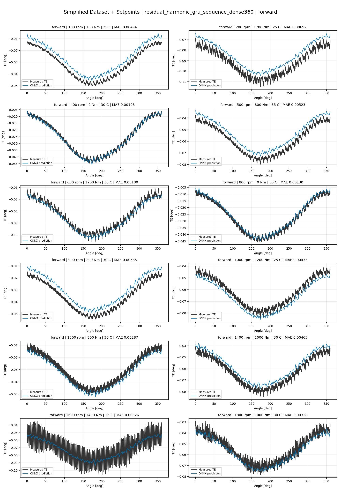
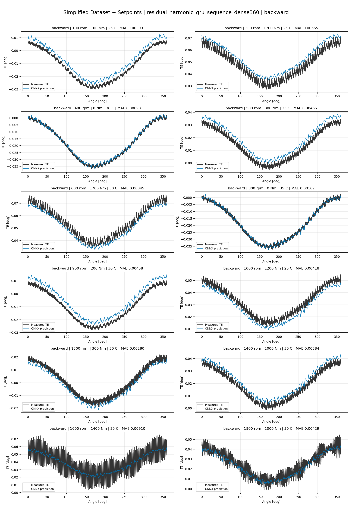
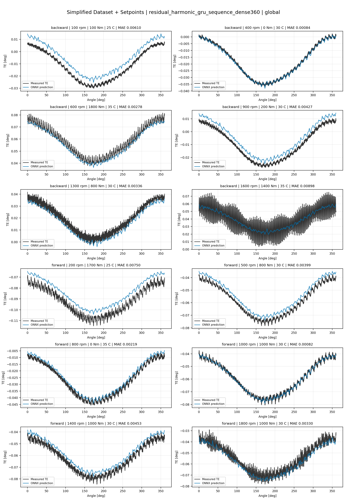
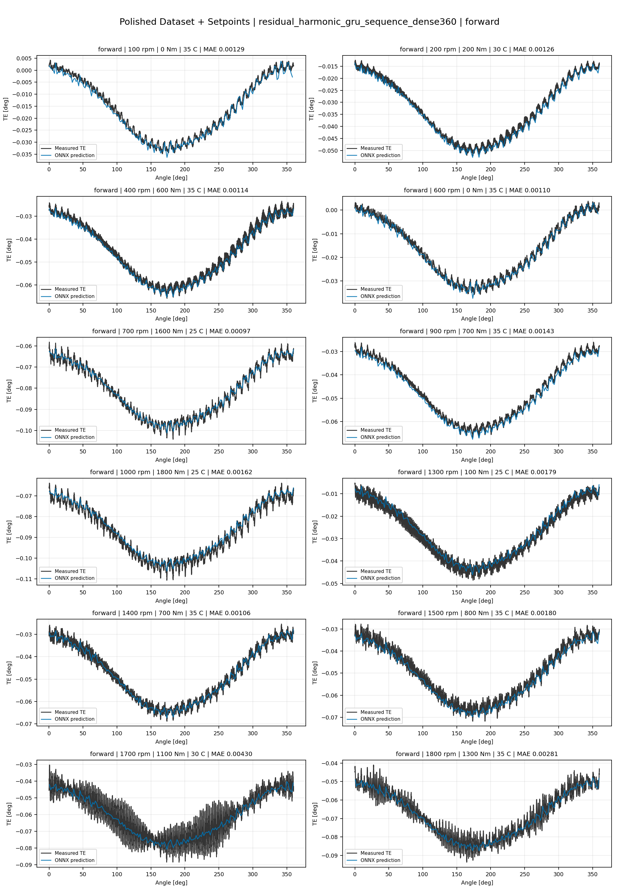
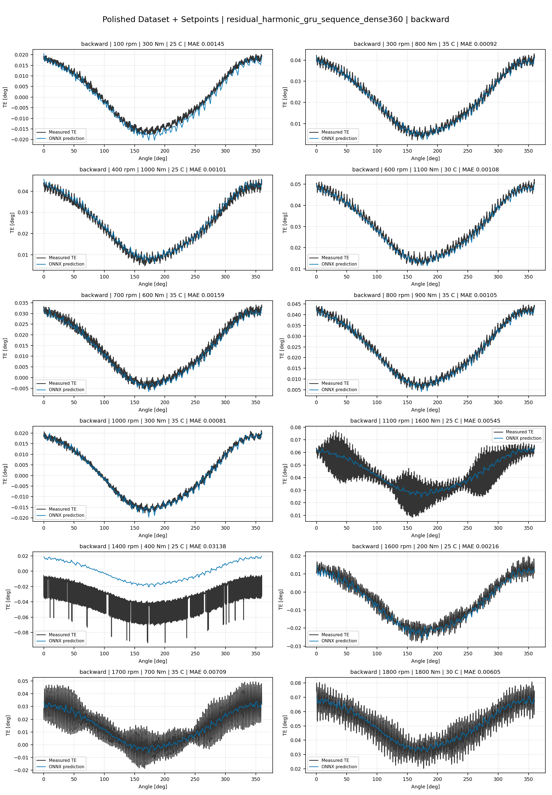
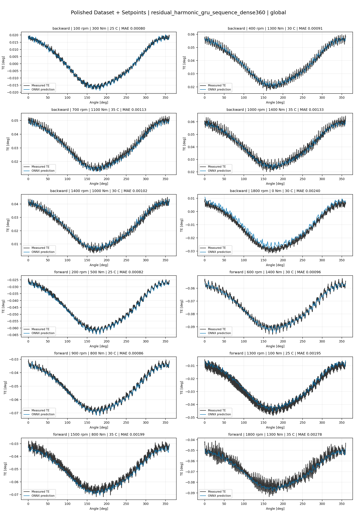
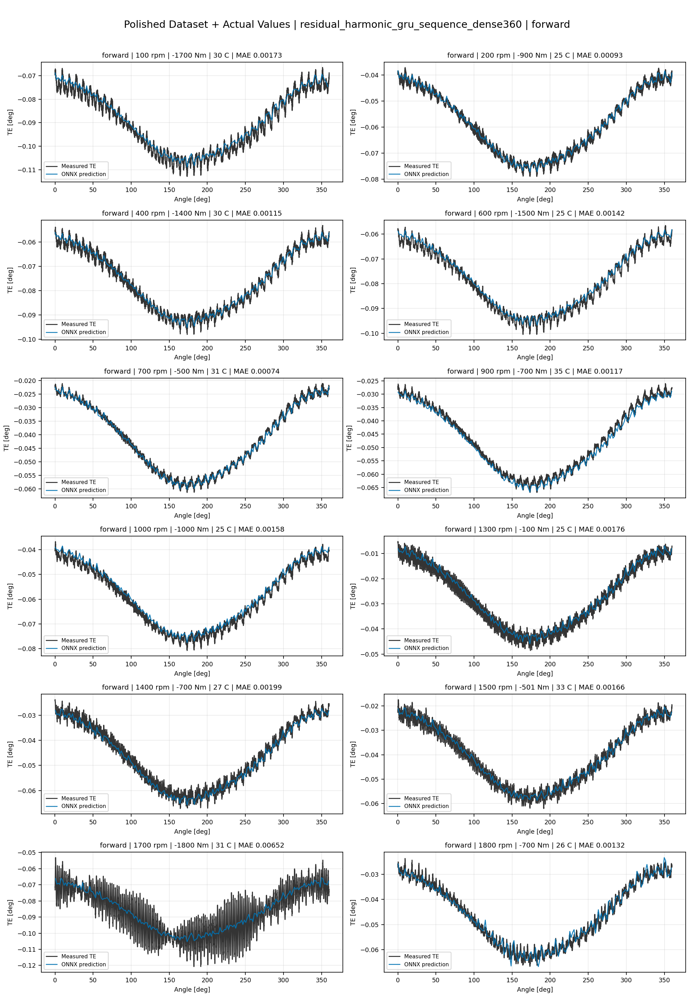
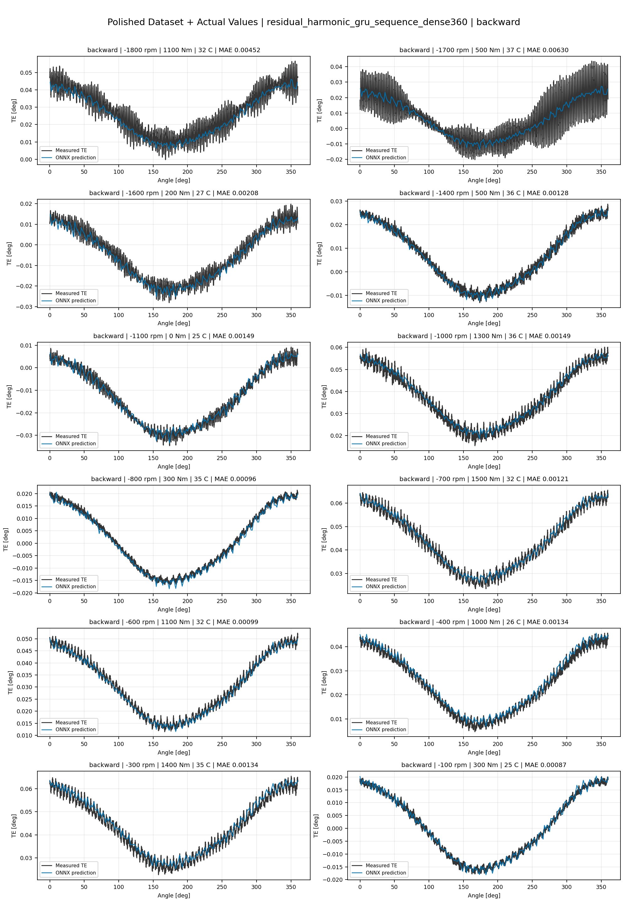
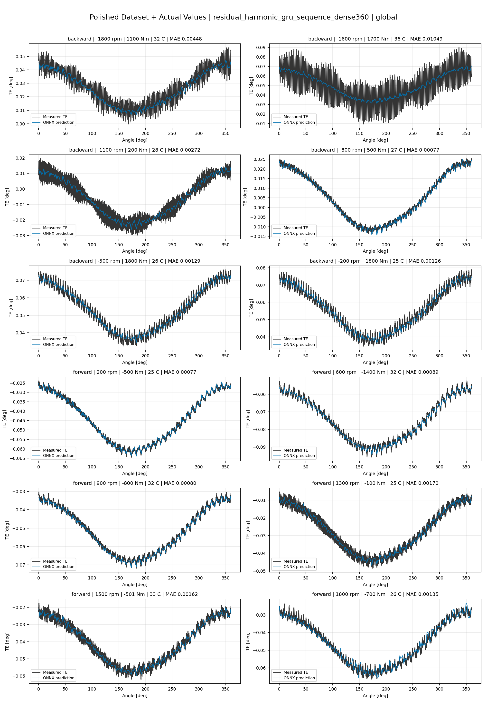

# TE Curve Verification Pipeline Familywise ONNX Report - residual_harmonic_gru_sequence_dense360

## Overview

This report evaluates exported ONNX models from the dataset input-mode
retraining program. Each dataset/input-mode section uses dataset-matched
held-out test curves and lists the exact model artifacts loaded from
`models/`.

Rank-3 temporal ONNX exports are evaluated on the sequence-window test
contract stored in each `training_config.snapshot.yaml`, including
`sequence_length`, `sequence_stride`, `sequence_target_position`, and
`maximum_sequences_per_curve`.
The collage pages keep the measured TE trace at the original full-curve
resolution; temporal ONNX predictions are overlaid at the evaluated
sequence-target angles.

The report is diagnostic and family-specific. It does not replace an
official multi-index model-promotion decision.

## Output Artifacts

- output directory: `output/validation_checks/track2_familywise_onnx_report/residual_harmonic_gru_sequence_dense360/2026-07-09-21-12-15__track2_residual_harmonic_gru_sequence_dense360_familywise_onnx_report`;
- summary YAML: `output/validation_checks/track2_familywise_onnx_report/residual_harmonic_gru_sequence_dense360/2026-07-09-21-12-15__track2_residual_harmonic_gru_sequence_dense360_familywise_onnx_report/track2_familywise_onnx_report_summary.yaml`;
- model inventory CSV: `output/validation_checks/track2_familywise_onnx_report/residual_harmonic_gru_sequence_dense360/2026-07-09-21-12-15__track2_residual_harmonic_gru_sequence_dense360_familywise_onnx_report/model_inventory.csv`;
- per-curve metrics CSV: `output/validation_checks/track2_familywise_onnx_report/residual_harmonic_gru_sequence_dense360/2026-07-09-21-12-15__track2_residual_harmonic_gru_sequence_dense360_familywise_onnx_report/per_curve_metrics.csv`.

## Simplified Dataset + Setpoints

- dataset: `simplified_dataset`;
- input mode: `setpoints`;
- evaluated family: `residual_harmonic_gru_sequence_dense360`;
- dataset root: `data/simplified_dataset`.

### Models Used

| Surface | Run Name | Run Instance | Dataset Schema |
| --- | --- | --- | --- |
| forward | `te_residual_harmonic_gru_sequence_dense360_fw__simplified_setpoints` | `2026-07-09-13-40-47__te_residual_harmonic_gru_sequence_dense360_fw__simplified_setpoints` | `simplified_curve_v1` |
| backward | `te_residual_harmonic_gru_sequence_dense360_bw__simplified_setpoints` | `2026-07-09-13-52-29__te_residual_harmonic_gru_sequence_dense360_bw__simplified_setpoints` | `simplified_curve_v1` |
| global | `te_residual_harmonic_gru_sequence_dense360_global__simplified_setpoints` | `2026-07-09-13-30-19__te_residual_harmonic_gru_sequence_dense360_global__simplified_setpoints` | `simplified_curve_v1` |

Exact model paths:

| Surface | ONNX Model Path | Python Model Path |
| --- | --- | --- |
| forward | `models/simplified_dataset/setpoints/exported/residual_harmonic_gru_sequence_dense360/forward/2026-07-09-13-40-47__te_residual_harmonic_gru_sequence_dense360_fw__simplified_setpoints/onnx/model.onnx` | `models/simplified_dataset/setpoints/exported/residual_harmonic_gru_sequence_dense360/forward/2026-07-09-13-40-47__te_residual_harmonic_gru_sequence_dense360_fw__simplified_setpoints/python/residual_harmonic_gru_sequence-epoch=081-val_mae=0.00358186.ckpt` |
| backward | `models/simplified_dataset/setpoints/exported/residual_harmonic_gru_sequence_dense360/backward/2026-07-09-13-52-29__te_residual_harmonic_gru_sequence_dense360_bw__simplified_setpoints/onnx/model.onnx` | `models/simplified_dataset/setpoints/exported/residual_harmonic_gru_sequence_dense360/backward/2026-07-09-13-52-29__te_residual_harmonic_gru_sequence_dense360_bw__simplified_setpoints/python/residual_harmonic_gru_sequence-epoch=077-val_mae=0.00358806.ckpt` |
| global | `models/simplified_dataset/setpoints/exported/residual_harmonic_gru_sequence_dense360/global/2026-07-09-13-30-19__te_residual_harmonic_gru_sequence_dense360_global__simplified_setpoints/onnx/model.onnx` | `models/simplified_dataset/setpoints/exported/residual_harmonic_gru_sequence_dense360/global/2026-07-09-13-30-19__te_residual_harmonic_gru_sequence_dense360_global__simplified_setpoints/python/residual_harmonic_gru_sequence-epoch=090-val_mae=0.00360722.ckpt` |

### Aggregate Metrics

| Surface | Curves | MAE [deg] | RMSE [deg] | Mean Error [%] | P95 Error [%] |
| --- | ---: | ---: | ---: | ---: | ---: |
| forward | 97 | 0.003278 | 0.003632 | 7.673 | 13.720 |
| backward | 97 | 0.003510 | 0.003903 | 8.137 | 13.504 |
| global | 194 | 0.003404 | 0.003760 | 7.945 | 15.366 |

Offset And Shape Metrics:

| Surface | Signed Offset [deg] | Absolute Offset [deg] | Centered MAE [deg] | P2P Error [deg] |
| --- | ---: | ---: | ---: | ---: |
| forward | 0.000665 | 0.002843 | 0.001466 | 0.003441 |
| backward | 0.000175 | 0.002838 | 0.001745 | 0.004039 |
| global | 0.000809 | 0.002814 | 0.001574 | 0.003728 |

### Forward 12-Curve Page

### Backward 12-Curve Page

### Global 12-Curve Page

## Polished Dataset + Setpoints

- dataset: `polished_dataset`;
- input mode: `setpoints`;
- evaluated family: `residual_harmonic_gru_sequence_dense360`;
- dataset root: `data/polished_dataset`.

### Models Used

| Surface | Run Name | Run Instance | Dataset Schema |
| --- | --- | --- | --- |
| forward | `te_residual_harmonic_gru_sequence_dense360_fw__polished_setpoints` | `2026-07-09-15-45-26__te_residual_harmonic_gru_sequence_dense360_fw__polished_setpoints` | `polished_setpoint_curve_v1` |
| backward | `te_residual_harmonic_gru_sequence_dense360_bw__polished_setpoints` | `2026-07-09-16-10-44__te_residual_harmonic_gru_sequence_dense360_bw__polished_setpoints` | `polished_setpoint_curve_v1` |
| global | `te_residual_harmonic_gru_sequence_dense360_global__polished_setpoints` | `2026-07-09-15-18-00__te_residual_harmonic_gru_sequence_dense360_global__polished_setpoints` | `polished_setpoint_curve_v1` |

Exact model paths:

| Surface | ONNX Model Path | Python Model Path |
| --- | --- | --- |
| forward | `models/polished_dataset/setpoints/exported/residual_harmonic_gru_sequence_dense360/forward/2026-07-09-15-45-26__te_residual_harmonic_gru_sequence_dense360_fw__polished_setpoints/onnx/model.onnx` | `models/polished_dataset/setpoints/exported/residual_harmonic_gru_sequence_dense360/forward/2026-07-09-15-45-26__te_residual_harmonic_gru_sequence_dense360_fw__polished_setpoints/python/residual_harmonic_gru_sequence-epoch=120-val_mae=0.00200154.ckpt` |
| backward | `models/polished_dataset/setpoints/exported/residual_harmonic_gru_sequence_dense360/backward/2026-07-09-16-10-44__te_residual_harmonic_gru_sequence_dense360_bw__polished_setpoints/onnx/model.onnx` | `models/polished_dataset/setpoints/exported/residual_harmonic_gru_sequence_dense360/backward/2026-07-09-16-10-44__te_residual_harmonic_gru_sequence_dense360_bw__polished_setpoints/python/residual_harmonic_gru_sequence-epoch=064-val_mae=0.00200024.ckpt` |
| global | `models/polished_dataset/setpoints/exported/residual_harmonic_gru_sequence_dense360/global/2026-07-09-15-18-00__te_residual_harmonic_gru_sequence_dense360_global__polished_setpoints/onnx/model.onnx` | `models/polished_dataset/setpoints/exported/residual_harmonic_gru_sequence_dense360/global/2026-07-09-15-18-00__te_residual_harmonic_gru_sequence_dense360_global__polished_setpoints/python/residual_harmonic_gru_sequence-epoch=111-val_mae=0.00197378.ckpt` |

### Aggregate Metrics

| Surface | Curves | MAE [deg] | RMSE [deg] | Mean Error [%] | P95 Error [%] |
| --- | ---: | ---: | ---: | ---: | ---: |
| forward | 100 | 0.001986 | 0.002373 | 4.381 | 9.480 |
| backward | 94 | 0.002665 | 0.003161 | 4.963 | 10.895 |
| global | 194 | 0.002284 | 0.002711 | 4.574 | 10.881 |

Offset And Shape Metrics:

| Surface | Signed Offset [deg] | Absolute Offset [deg] | Centered MAE [deg] | P2P Error [deg] |
| --- | ---: | ---: | ---: | ---: |
| forward | -0.000336 | 0.001025 | 0.001620 | 0.003811 |
| backward | 0.000434 | 0.000993 | 0.002298 | 0.006746 |
| global | 0.000020 | 0.000957 | 0.001924 | 0.005178 |

### Forward 12-Curve Page

### Backward 12-Curve Page

### Global 12-Curve Page

## Polished Dataset + Actual Values

- dataset: `polished_dataset`;
- input mode: `actual_values`;
- evaluated family: `residual_harmonic_gru_sequence_dense360`;
- dataset root: `data/polished_dataset`.

### Models Used

| Surface | Run Name | Run Instance | Dataset Schema |
| --- | --- | --- | --- |
| forward | `te_residual_harmonic_gru_sequence_dense360_fw__polished_actual_values` | `2026-07-09-17-18-37__te_residual_harmonic_gru_sequence_dense360_fw__polished_actual_values` | `polished_point_v1` |
| backward | `te_residual_harmonic_gru_sequence_dense360_bw__polished_actual_values` | `2026-07-09-17-49-07__te_residual_harmonic_gru_sequence_dense360_bw__polished_actual_values` | `polished_point_v1` |
| global | `te_residual_harmonic_gru_sequence_dense360_global__polished_actual_values` | `2026-07-09-16-52-22__te_residual_harmonic_gru_sequence_dense360_global__polished_actual_values` | `polished_point_v1` |

Exact model paths:

| Surface | ONNX Model Path | Python Model Path |
| --- | --- | --- |
| forward | `models/polished_dataset/actual_values/exported/residual_harmonic_gru_sequence_dense360/forward/2026-07-09-17-18-37__te_residual_harmonic_gru_sequence_dense360_fw__polished_actual_values/onnx/model.onnx` | `models/polished_dataset/actual_values/exported/residual_harmonic_gru_sequence_dense360/forward/2026-07-09-17-18-37__te_residual_harmonic_gru_sequence_dense360_fw__polished_actual_values/python/residual_harmonic_gru_sequence-epoch=156-val_mae=0.00195537.ckpt` |
| backward | `models/polished_dataset/actual_values/exported/residual_harmonic_gru_sequence_dense360/backward/2026-07-09-17-49-07__te_residual_harmonic_gru_sequence_dense360_bw__polished_actual_values/onnx/model.onnx` | `models/polished_dataset/actual_values/exported/residual_harmonic_gru_sequence_dense360/backward/2026-07-09-17-49-07__te_residual_harmonic_gru_sequence_dense360_bw__polished_actual_values/python/residual_harmonic_gru_sequence-epoch=116-val_mae=0.00195966.ckpt` |
| global | `models/polished_dataset/actual_values/exported/residual_harmonic_gru_sequence_dense360/global/2026-07-09-16-52-22__te_residual_harmonic_gru_sequence_dense360_global__polished_actual_values/onnx/model.onnx` | `models/polished_dataset/actual_values/exported/residual_harmonic_gru_sequence_dense360/global/2026-07-09-16-52-22__te_residual_harmonic_gru_sequence_dense360_global__polished_actual_values/python/residual_harmonic_gru_sequence-epoch=134-val_mae=0.00196008.ckpt` |

### Aggregate Metrics

| Surface | Curves | MAE [deg] | RMSE [deg] | Mean Error [%] | P95 Error [%] |
| --- | ---: | ---: | ---: | ---: | ---: |
| forward | 100 | 0.001903 | 0.002307 | 4.145 | 9.009 |
| backward | 94 | 0.002359 | 0.002875 | 4.568 | 10.676 |
| global | 194 | 0.002088 | 0.002529 | 4.272 | 10.211 |

Offset And Shape Metrics:

| Surface | Signed Offset [deg] | Absolute Offset [deg] | Centered MAE [deg] | P2P Error [deg] |
| --- | ---: | ---: | ---: | ---: |
| forward | -0.000137 | 0.000749 | 0.001711 | 0.004232 |
| backward | 0.000034 | 0.000558 | 0.002267 | 0.005903 |
| global | -0.000201 | 0.000694 | 0.001931 | 0.004796 |

### Forward 12-Curve Page

### Backward 12-Curve Page

### Global 12-Curve Page

