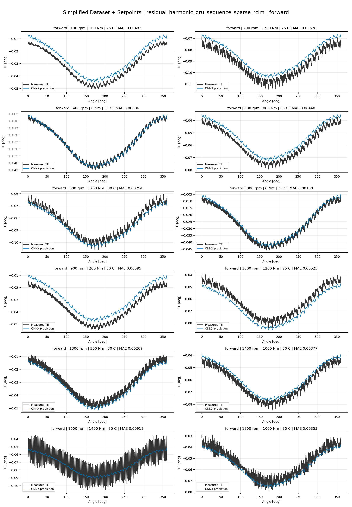
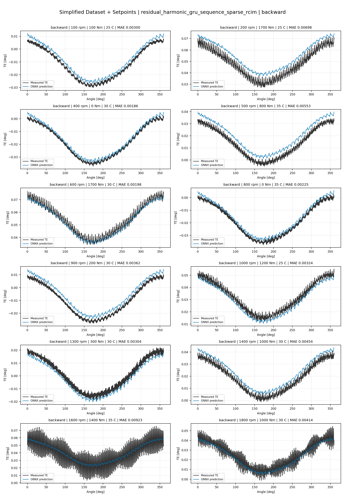
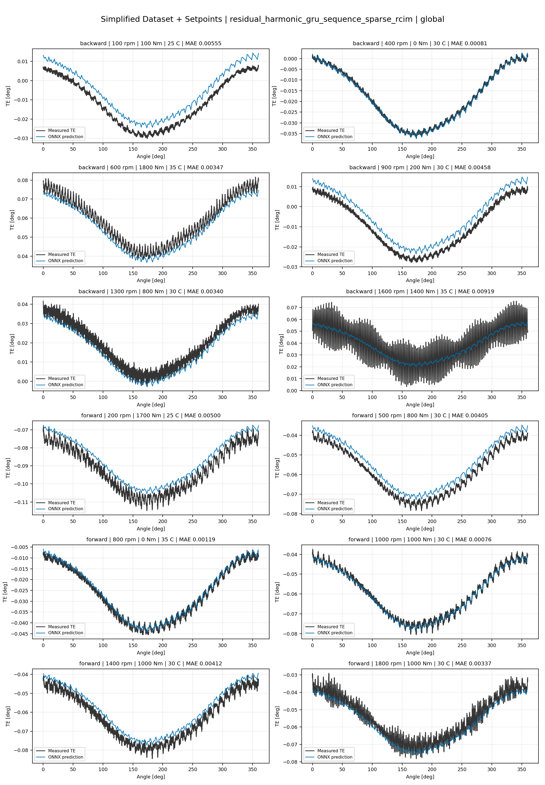
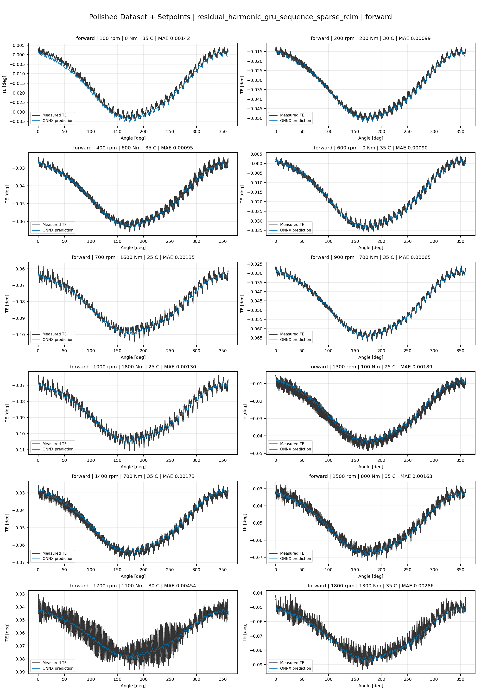
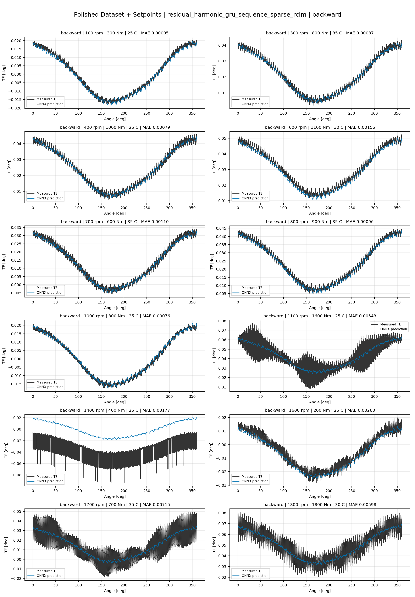
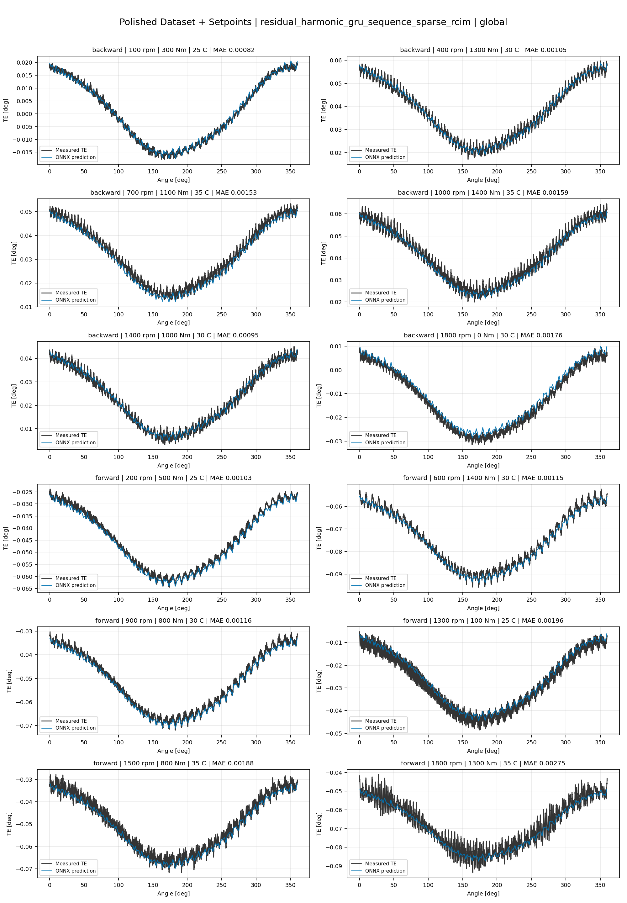
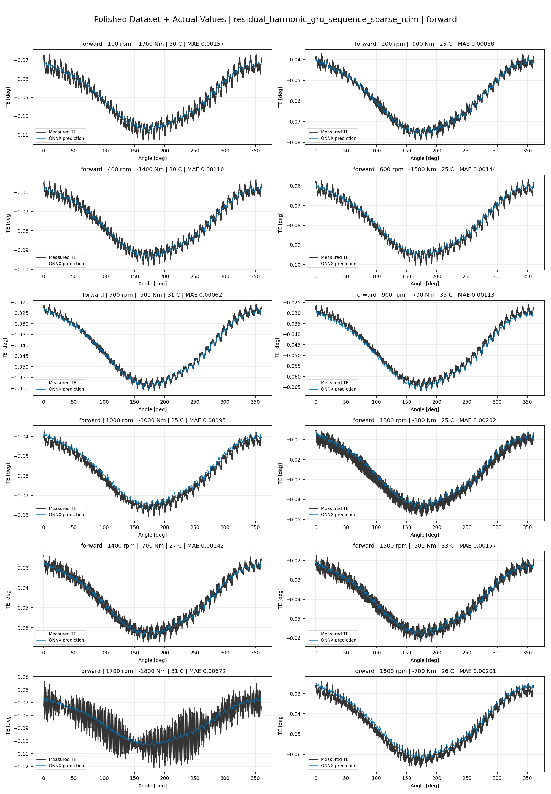
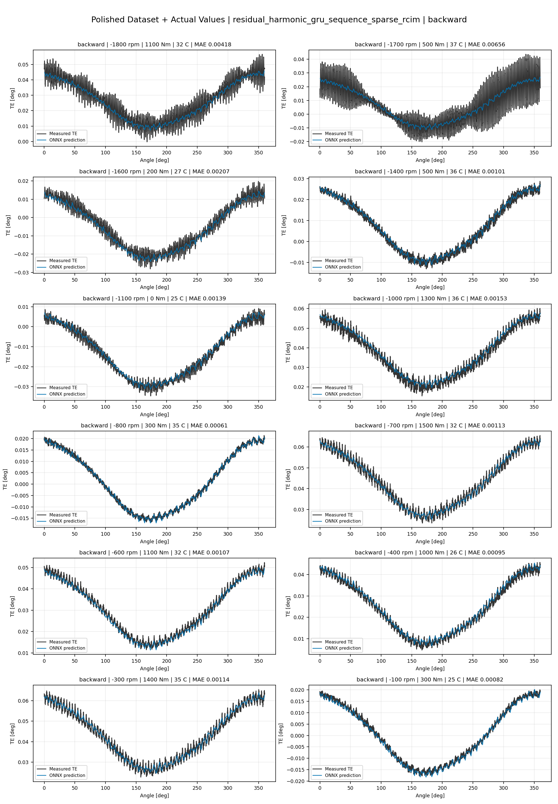
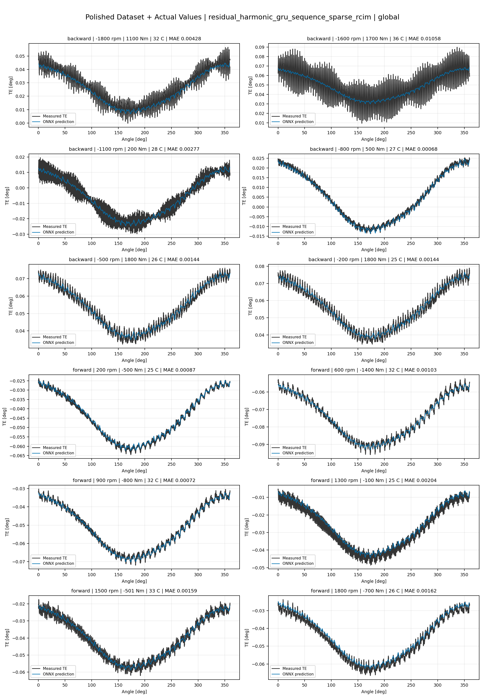

# TE Curve Verification Pipeline Familywise ONNX Report - residual_harmonic_gru_sequence_sparse_rcim

## Overview

This report evaluates exported ONNX models from the dataset input-mode
retraining program. Each dataset/input-mode section uses dataset-matched
held-out test curves and lists the exact model artifacts loaded from
`models/`.

Rank-3 temporal ONNX exports are evaluated on the sequence-window test
contract stored in each `training_config.snapshot.yaml`, including
`sequence_length`, `sequence_stride`, `sequence_target_position`, and
`maximum_sequences_per_curve`.
The collage pages keep the measured TE trace at the original full-curve
resolution; temporal ONNX predictions are overlaid at the evaluated
sequence-target angles.

The report is diagnostic and family-specific. It does not replace an
official multi-index model-promotion decision.

## Output Artifacts

- output directory: `output/validation_checks/track2_familywise_onnx_report/residual_harmonic_gru_sequence_sparse_rcim/2026-07-09-11-17-17__track2_residual_harmonic_gru_sequence_sparse_rcim_familywise_onnx_report`;
- summary YAML: `output/validation_checks/track2_familywise_onnx_report/residual_harmonic_gru_sequence_sparse_rcim/2026-07-09-11-17-17__track2_residual_harmonic_gru_sequence_sparse_rcim_familywise_onnx_report/track2_familywise_onnx_report_summary.yaml`;
- model inventory CSV: `output/validation_checks/track2_familywise_onnx_report/residual_harmonic_gru_sequence_sparse_rcim/2026-07-09-11-17-17__track2_residual_harmonic_gru_sequence_sparse_rcim_familywise_onnx_report/model_inventory.csv`;
- per-curve metrics CSV: `output/validation_checks/track2_familywise_onnx_report/residual_harmonic_gru_sequence_sparse_rcim/2026-07-09-11-17-17__track2_residual_harmonic_gru_sequence_sparse_rcim_familywise_onnx_report/per_curve_metrics.csv`.

## Simplified Dataset + Setpoints

- dataset: `simplified_dataset`;
- input mode: `setpoints`;
- evaluated family: `residual_harmonic_gru_sequence_sparse_rcim`;
- dataset root: `data/simplified_dataset`.

### Models Used

| Surface | Run Name | Run Instance | Dataset Schema |
| --- | --- | --- | --- |
| forward | `te_residual_harmonic_gru_sequence_sparse_rcim_fw__simplified_setpoints` | `2026-07-09-05-56-34__te_residual_harmonic_gru_sequence_sparse_rcim_fw__simplified_setpoints` | `simplified_curve_v1` |
| backward | `te_residual_harmonic_gru_sequence_sparse_rcim_bw__simplified_setpoints` | `2026-07-09-06-07-25__te_residual_harmonic_gru_sequence_sparse_rcim_bw__simplified_setpoints` | `simplified_curve_v1` |
| global | `te_residual_harmonic_gru_sequence_sparse_rcim_global__simplified_setpoints` | `2026-07-09-05-46-13__te_residual_harmonic_gru_sequence_sparse_rcim_global__simplified_setpoints` | `simplified_curve_v1` |

Exact model paths:

| Surface | ONNX Model Path | Python Model Path |
| --- | --- | --- |
| forward | `models/simplified_dataset/setpoints/exported/residual_harmonic_gru_sequence_sparse_rcim/forward/2026-07-09-05-56-34__te_residual_harmonic_gru_sequence_sparse_rcim_fw__simplified_setpoints/onnx/model.onnx` | `models/simplified_dataset/setpoints/exported/residual_harmonic_gru_sequence_sparse_rcim/forward/2026-07-09-05-56-34__te_residual_harmonic_gru_sequence_sparse_rcim_fw__simplified_setpoints/python/residual_harmonic_gru_sequence-epoch=070-val_mae=0.00360244.ckpt` |
| backward | `models/simplified_dataset/setpoints/exported/residual_harmonic_gru_sequence_sparse_rcim/backward/2026-07-09-06-07-25__te_residual_harmonic_gru_sequence_sparse_rcim_bw__simplified_setpoints/onnx/model.onnx` | `models/simplified_dataset/setpoints/exported/residual_harmonic_gru_sequence_sparse_rcim/backward/2026-07-09-06-07-25__te_residual_harmonic_gru_sequence_sparse_rcim_bw__simplified_setpoints/python/residual_harmonic_gru_sequence-epoch=061-val_mae=0.00359811.ckpt` |
| global | `models/simplified_dataset/setpoints/exported/residual_harmonic_gru_sequence_sparse_rcim/global/2026-07-09-05-46-13__te_residual_harmonic_gru_sequence_sparse_rcim_global__simplified_setpoints/onnx/model.onnx` | `models/simplified_dataset/setpoints/exported/residual_harmonic_gru_sequence_sparse_rcim/global/2026-07-09-05-46-13__te_residual_harmonic_gru_sequence_sparse_rcim_global__simplified_setpoints/python/residual_harmonic_gru_sequence-epoch=106-val_mae=0.00358149.ckpt` |

### Aggregate Metrics

| Surface | Curves | MAE [deg] | RMSE [deg] | Mean Error [%] | P95 Error [%] |
| --- | ---: | ---: | ---: | ---: | ---: |
| forward | 97 | 0.003251 | 0.003581 | 7.600 | 13.632 |
| backward | 97 | 0.003517 | 0.003877 | 8.155 | 14.945 |
| global | 194 | 0.003456 | 0.003797 | 8.054 | 15.503 |

Offset And Shape Metrics:

| Surface | Signed Offset [deg] | Absolute Offset [deg] | Centered MAE [deg] | P2P Error [deg] |
| --- | ---: | ---: | ---: | ---: |
| forward | 0.000070 | 0.002839 | 0.001404 | 0.004422 |
| backward | 0.000826 | 0.002826 | 0.001674 | 0.004315 |
| global | 0.000339 | 0.002898 | 0.001541 | 0.004408 |

### Forward 12-Curve Page

### Backward 12-Curve Page

### Global 12-Curve Page

## Polished Dataset + Setpoints

- dataset: `polished_dataset`;
- input mode: `setpoints`;
- evaluated family: `residual_harmonic_gru_sequence_sparse_rcim`;
- dataset root: `data/polished_dataset`.

### Models Used

| Surface | Run Name | Run Instance | Dataset Schema |
| --- | --- | --- | --- |
| forward | `te_residual_harmonic_gru_sequence_sparse_rcim_fw__polished_setpoints` | `2026-07-09-06-39-47__te_residual_harmonic_gru_sequence_sparse_rcim_fw__polished_setpoints` | `polished_setpoint_curve_v1` |
| backward | `te_residual_harmonic_gru_sequence_sparse_rcim_bw__polished_setpoints` | `2026-07-09-07-04-00__te_residual_harmonic_gru_sequence_sparse_rcim_bw__polished_setpoints` | `polished_setpoint_curve_v1` |
| global | `te_residual_harmonic_gru_sequence_sparse_rcim_global__polished_setpoints` | `2026-07-09-06-26-33__te_residual_harmonic_gru_sequence_sparse_rcim_global__polished_setpoints` | `polished_setpoint_curve_v1` |

Exact model paths:

| Surface | ONNX Model Path | Python Model Path |
| --- | --- | --- |
| forward | `models/polished_dataset/setpoints/exported/residual_harmonic_gru_sequence_sparse_rcim/forward/2026-07-09-06-39-47__te_residual_harmonic_gru_sequence_sparse_rcim_fw__polished_setpoints/onnx/model.onnx` | `models/polished_dataset/setpoints/exported/residual_harmonic_gru_sequence_sparse_rcim/forward/2026-07-09-06-39-47__te_residual_harmonic_gru_sequence_sparse_rcim_fw__polished_setpoints/python/residual_harmonic_gru_sequence-epoch=116-val_mae=0.00198454.ckpt` |
| backward | `models/polished_dataset/setpoints/exported/residual_harmonic_gru_sequence_sparse_rcim/backward/2026-07-09-07-04-00__te_residual_harmonic_gru_sequence_sparse_rcim_bw__polished_setpoints/onnx/model.onnx` | `models/polished_dataset/setpoints/exported/residual_harmonic_gru_sequence_sparse_rcim/backward/2026-07-09-07-04-00__te_residual_harmonic_gru_sequence_sparse_rcim_bw__polished_setpoints/python/residual_harmonic_gru_sequence-epoch=058-val_mae=0.00205854.ckpt` |
| global | `models/polished_dataset/setpoints/exported/residual_harmonic_gru_sequence_sparse_rcim/global/2026-07-09-06-26-33__te_residual_harmonic_gru_sequence_sparse_rcim_global__polished_setpoints/onnx/model.onnx` | `models/polished_dataset/setpoints/exported/residual_harmonic_gru_sequence_sparse_rcim/global/2026-07-09-06-26-33__te_residual_harmonic_gru_sequence_sparse_rcim_global__polished_setpoints/python/residual_harmonic_gru_sequence-epoch=060-val_mae=0.00203207.ckpt` |

### Aggregate Metrics

| Surface | Curves | MAE [deg] | RMSE [deg] | Mean Error [%] | P95 Error [%] |
| --- | ---: | ---: | ---: | ---: | ---: |
| forward | 100 | 0.002001 | 0.002399 | 4.392 | 9.679 |
| backward | 94 | 0.002687 | 0.003158 | 4.989 | 11.038 |
| global | 194 | 0.002357 | 0.002789 | 4.743 | 11.057 |

Offset And Shape Metrics:

| Surface | Signed Offset [deg] | Absolute Offset [deg] | Centered MAE [deg] | P2P Error [deg] |
| --- | ---: | ---: | ---: | ---: |
| forward | -0.000085 | 0.000955 | 0.001669 | 0.004847 |
| backward | 0.000033 | 0.001081 | 0.002238 | 0.006501 |
| global | -0.000161 | 0.001076 | 0.001937 | 0.005662 |

### Forward 12-Curve Page

### Backward 12-Curve Page

### Global 12-Curve Page

## Polished Dataset + Actual Values

- dataset: `polished_dataset`;
- input mode: `actual_values`;
- evaluated family: `residual_harmonic_gru_sequence_sparse_rcim`;
- dataset root: `data/polished_dataset`.

### Models Used

| Surface | Run Name | Run Instance | Dataset Schema |
| --- | --- | --- | --- |
| forward | `te_residual_harmonic_gru_sequence_sparse_rcim_fw__polished_actual_values` | `2026-07-09-08-19-20__te_residual_harmonic_gru_sequence_sparse_rcim_fw__polished_actual_values` | `polished_point_v1` |
| backward | `te_residual_harmonic_gru_sequence_sparse_rcim_bw__polished_actual_values` | `2026-07-09-08-55-01__te_residual_harmonic_gru_sequence_sparse_rcim_bw__polished_actual_values` | `polished_point_v1` |
| global | `te_residual_harmonic_gru_sequence_sparse_rcim_global__polished_actual_values` | `2026-07-09-07-39-41__te_residual_harmonic_gru_sequence_sparse_rcim_global__polished_actual_values` | `polished_point_v1` |

Exact model paths:

| Surface | ONNX Model Path | Python Model Path |
| --- | --- | --- |
| forward | `models/polished_dataset/actual_values/exported/residual_harmonic_gru_sequence_sparse_rcim/forward/2026-07-09-08-19-20__te_residual_harmonic_gru_sequence_sparse_rcim_fw__polished_actual_values/onnx/model.onnx` | `models/polished_dataset/actual_values/exported/residual_harmonic_gru_sequence_sparse_rcim/forward/2026-07-09-08-19-20__te_residual_harmonic_gru_sequence_sparse_rcim_fw__polished_actual_values/python/residual_harmonic_gru_sequence-epoch=170-val_mae=0.00195142.ckpt` |
| backward | `models/polished_dataset/actual_values/exported/residual_harmonic_gru_sequence_sparse_rcim/backward/2026-07-09-08-55-01__te_residual_harmonic_gru_sequence_sparse_rcim_bw__polished_actual_values/onnx/model.onnx` | `models/polished_dataset/actual_values/exported/residual_harmonic_gru_sequence_sparse_rcim/backward/2026-07-09-08-55-01__te_residual_harmonic_gru_sequence_sparse_rcim_bw__polished_actual_values/python/residual_harmonic_gru_sequence-epoch=200-val_mae=0.00195317.ckpt` |
| global | `models/polished_dataset/actual_values/exported/residual_harmonic_gru_sequence_sparse_rcim/global/2026-07-09-07-39-41__te_residual_harmonic_gru_sequence_sparse_rcim_global__polished_actual_values/onnx/model.onnx` | `models/polished_dataset/actual_values/exported/residual_harmonic_gru_sequence_sparse_rcim/global/2026-07-09-07-39-41__te_residual_harmonic_gru_sequence_sparse_rcim_global__polished_actual_values/python/residual_harmonic_gru_sequence-epoch=226-val_mae=0.00193782.ckpt` |

### Aggregate Metrics

| Surface | Curves | MAE [deg] | RMSE [deg] | Mean Error [%] | P95 Error [%] |
| --- | ---: | ---: | ---: | ---: | ---: |
| forward | 100 | 0.001906 | 0.002300 | 4.154 | 8.967 |
| backward | 94 | 0.002294 | 0.002792 | 4.399 | 10.716 |
| global | 194 | 0.002062 | 0.002500 | 4.193 | 10.360 |

Offset And Shape Metrics:

| Surface | Signed Offset [deg] | Absolute Offset [deg] | Centered MAE [deg] | P2P Error [deg] |
| --- | ---: | ---: | ---: | ---: |
| forward | -0.000135 | 0.000806 | 0.001668 | 0.004909 |
| backward | 0.000250 | 0.000589 | 0.002202 | 0.006165 |
| global | -0.000217 | 0.000617 | 0.001922 | 0.005629 |

### Forward 12-Curve Page

### Backward 12-Curve Page

### Global 12-Curve Page

