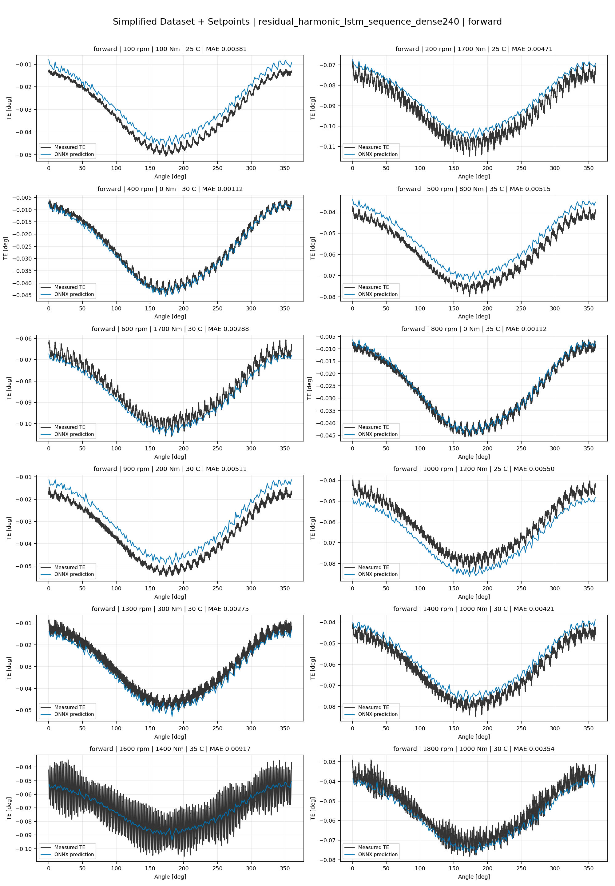
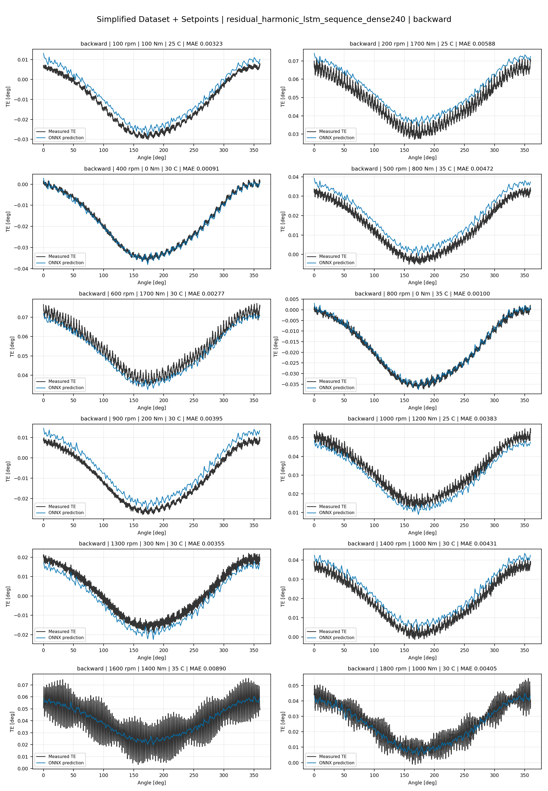
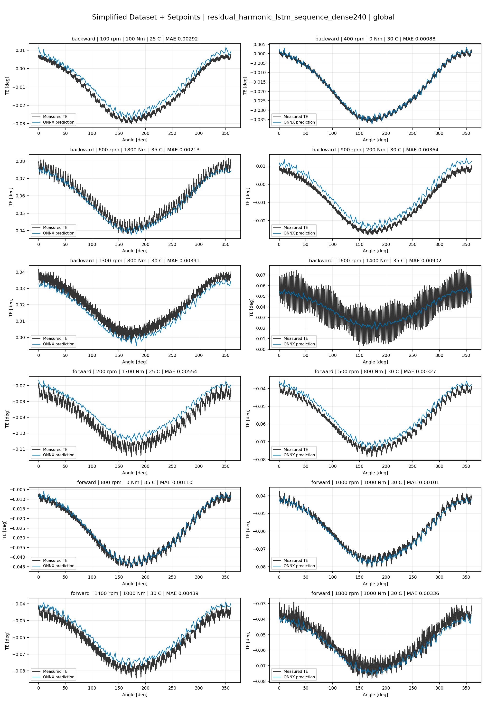
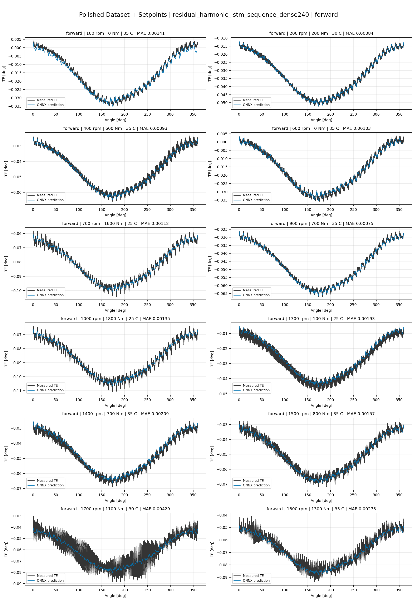
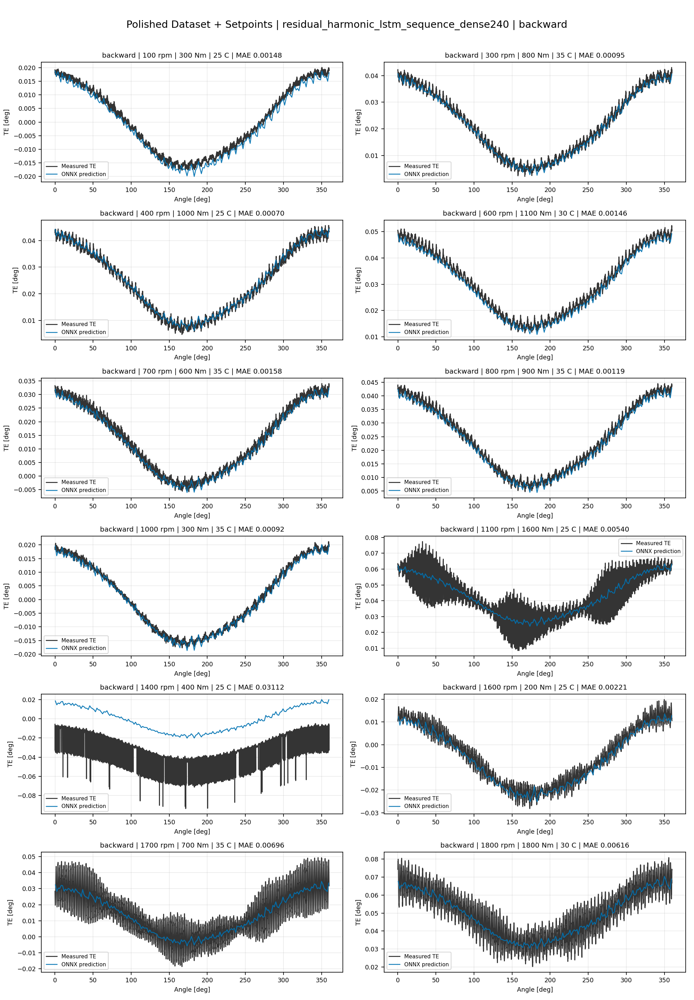
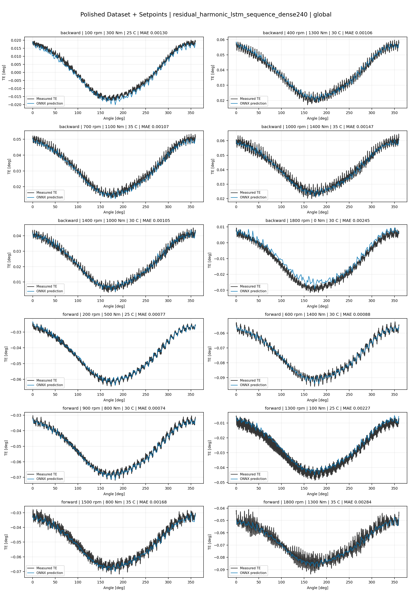
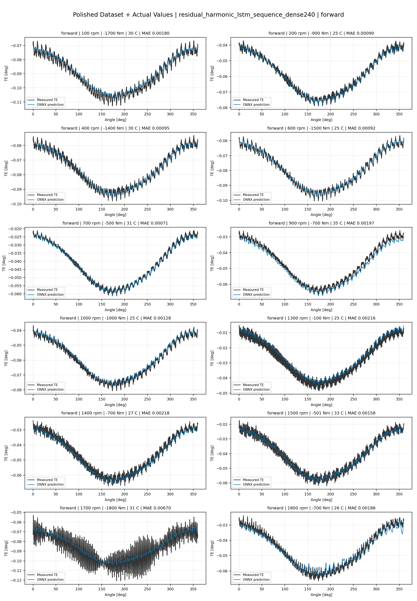
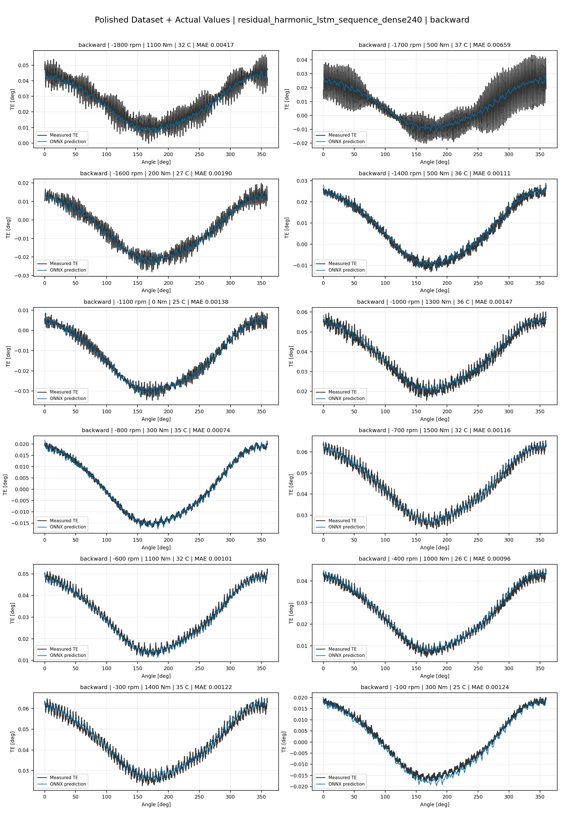
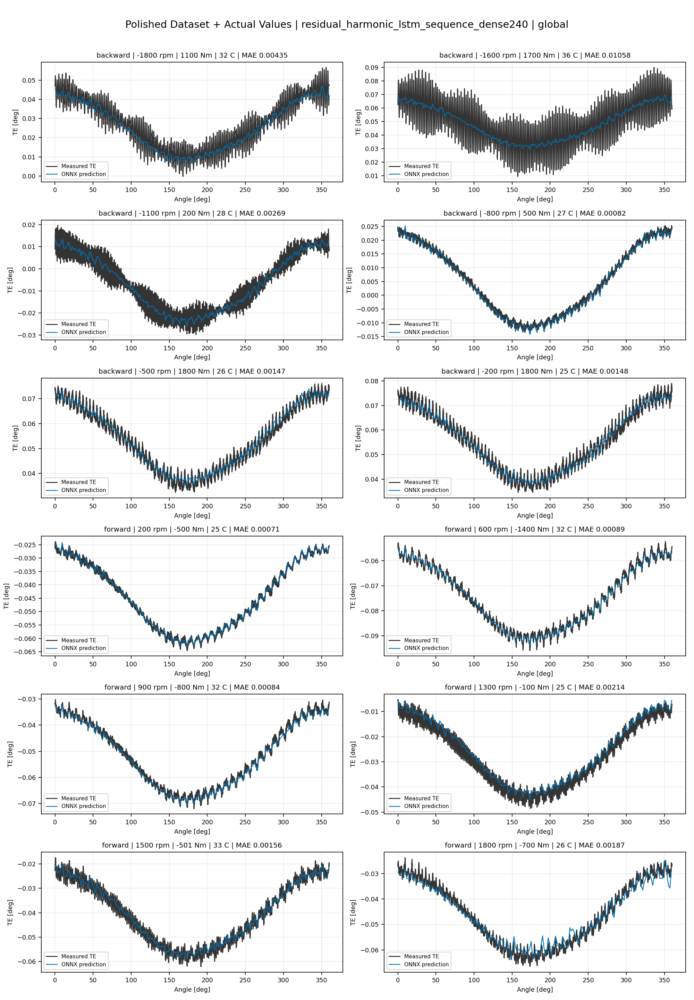

# TE Curve Verification Pipeline Familywise ONNX Report - residual_harmonic_lstm_sequence_dense240

## Overview

This report evaluates exported ONNX models from the dataset input-mode
retraining program. Each dataset/input-mode section uses dataset-matched
held-out test curves and lists the exact model artifacts loaded from
`models/`.

Rank-3 temporal ONNX exports are evaluated on the sequence-window test
contract stored in each `training_config.snapshot.yaml`, including
`sequence_length`, `sequence_stride`, `sequence_target_position`, and
`maximum_sequences_per_curve`.
The collage pages keep the measured TE trace at the original full-curve
resolution; temporal ONNX predictions are overlaid at the evaluated
sequence-target angles.

The report is diagnostic and family-specific. It does not replace an
official multi-index model-promotion decision.

## Output Artifacts

- output directory: `output/validation_checks/track2_familywise_onnx_report/residual_harmonic_lstm_sequence_dense240/2026-07-10-09-24-21__track2_residual_harmonic_lstm_sequence_dense240_familywise_onnx_report`;
- summary YAML: `output/validation_checks/track2_familywise_onnx_report/residual_harmonic_lstm_sequence_dense240/2026-07-10-09-24-21__track2_residual_harmonic_lstm_sequence_dense240_familywise_onnx_report/track2_familywise_onnx_report_summary.yaml`;
- model inventory CSV: `output/validation_checks/track2_familywise_onnx_report/residual_harmonic_lstm_sequence_dense240/2026-07-10-09-24-21__track2_residual_harmonic_lstm_sequence_dense240_familywise_onnx_report/model_inventory.csv`;
- per-curve metrics CSV: `output/validation_checks/track2_familywise_onnx_report/residual_harmonic_lstm_sequence_dense240/2026-07-10-09-24-21__track2_residual_harmonic_lstm_sequence_dense240_familywise_onnx_report/per_curve_metrics.csv`.

## Simplified Dataset + Setpoints

- dataset: `simplified_dataset`;
- input mode: `setpoints`;
- evaluated family: `residual_harmonic_lstm_sequence_dense240`;
- dataset root: `data/simplified_dataset`.

### Models Used

| Surface | Run Name | Run Instance | Dataset Schema |
| --- | --- | --- | --- |
| forward | `te_residual_harmonic_lstm_sequence_dense240_fw__simplified_setpoints` | `2026-07-09-23-32-01__te_residual_harmonic_lstm_sequence_dense240_fw__simplified_setpoints` | `simplified_curve_v1` |
| backward | `te_residual_harmonic_lstm_sequence_dense240_bw__simplified_setpoints` | `2026-07-09-23-53-53__te_residual_harmonic_lstm_sequence_dense240_bw__simplified_setpoints` | `simplified_curve_v1` |
| global | `te_residual_harmonic_lstm_sequence_dense240_global__simplified_setpoints` | `2026-07-09-23-14-07__te_residual_harmonic_lstm_sequence_dense240_global__simplified_setpoints` | `simplified_curve_v1` |

Exact model paths:

| Surface | ONNX Model Path | Python Model Path |
| --- | --- | --- |
| forward | `models/simplified_dataset/setpoints/exported/residual_harmonic_lstm_sequence_dense240/forward/2026-07-09-23-32-01__te_residual_harmonic_lstm_sequence_dense240_fw__simplified_setpoints/onnx/model.onnx` | `models/simplified_dataset/setpoints/exported/residual_harmonic_lstm_sequence_dense240/forward/2026-07-09-23-32-01__te_residual_harmonic_lstm_sequence_dense240_fw__simplified_setpoints/python/residual_harmonic_lstm_sequence-epoch=061-val_mae=0.00356071.ckpt` |
| backward | `models/simplified_dataset/setpoints/exported/residual_harmonic_lstm_sequence_dense240/backward/2026-07-09-23-53-53__te_residual_harmonic_lstm_sequence_dense240_bw__simplified_setpoints/onnx/model.onnx` | `models/simplified_dataset/setpoints/exported/residual_harmonic_lstm_sequence_dense240/backward/2026-07-09-23-53-53__te_residual_harmonic_lstm_sequence_dense240_bw__simplified_setpoints/python/residual_harmonic_lstm_sequence-epoch=087-val_mae=0.00358639.ckpt` |
| global | `models/simplified_dataset/setpoints/exported/residual_harmonic_lstm_sequence_dense240/global/2026-07-09-23-14-07__te_residual_harmonic_lstm_sequence_dense240_global__simplified_setpoints/onnx/model.onnx` | `models/simplified_dataset/setpoints/exported/residual_harmonic_lstm_sequence_dense240/global/2026-07-09-23-14-07__te_residual_harmonic_lstm_sequence_dense240_global__simplified_setpoints/python/residual_harmonic_lstm_sequence-epoch=042-val_mae=0.00360357.ckpt` |

### Aggregate Metrics

| Surface | Curves | MAE [deg] | RMSE [deg] | Mean Error [%] | P95 Error [%] |
| --- | ---: | ---: | ---: | ---: | ---: |
| forward | 97 | 0.003230 | 0.003560 | 7.550 | 12.928 |
| backward | 97 | 0.003486 | 0.003874 | 8.093 | 13.883 |
| global | 194 | 0.003381 | 0.003750 | 7.878 | 14.033 |

Offset And Shape Metrics:

| Surface | Signed Offset [deg] | Absolute Offset [deg] | Centered MAE [deg] | P2P Error [deg] |
| --- | ---: | ---: | ---: | ---: |
| forward | -0.000025 | 0.002818 | 0.001404 | 0.003810 |
| backward | 0.000447 | 0.002811 | 0.001729 | 0.004132 |
| global | 0.000366 | 0.002832 | 0.001594 | 0.003848 |

### Forward 12-Curve Page

### Backward 12-Curve Page

### Global 12-Curve Page

## Polished Dataset + Setpoints

- dataset: `polished_dataset`;
- input mode: `setpoints`;
- evaluated family: `residual_harmonic_lstm_sequence_dense240`;
- dataset root: `data/polished_dataset`.

### Models Used

| Surface | Run Name | Run Instance | Dataset Schema |
| --- | --- | --- | --- |
| forward | `te_residual_harmonic_lstm_sequence_dense240_fw__polished_setpoints` | `2026-07-10-00-54-03__te_residual_harmonic_lstm_sequence_dense240_fw__polished_setpoints` | `polished_setpoint_curve_v1` |
| backward | `te_residual_harmonic_lstm_sequence_dense240_bw__polished_setpoints` | `2026-07-10-01-19-43__te_residual_harmonic_lstm_sequence_dense240_bw__polished_setpoints` | `polished_setpoint_curve_v1` |
| global | `te_residual_harmonic_lstm_sequence_dense240_global__polished_setpoints` | `2026-07-10-00-33-07__te_residual_harmonic_lstm_sequence_dense240_global__polished_setpoints` | `polished_setpoint_curve_v1` |

Exact model paths:

| Surface | ONNX Model Path | Python Model Path |
| --- | --- | --- |
| forward | `models/polished_dataset/setpoints/exported/residual_harmonic_lstm_sequence_dense240/forward/2026-07-10-00-54-03__te_residual_harmonic_lstm_sequence_dense240_fw__polished_setpoints/onnx/model.onnx` | `models/polished_dataset/setpoints/exported/residual_harmonic_lstm_sequence_dense240/forward/2026-07-10-00-54-03__te_residual_harmonic_lstm_sequence_dense240_fw__polished_setpoints/python/residual_harmonic_lstm_sequence-epoch=067-val_mae=0.00199481.ckpt` |
| backward | `models/polished_dataset/setpoints/exported/residual_harmonic_lstm_sequence_dense240/backward/2026-07-10-01-19-43__te_residual_harmonic_lstm_sequence_dense240_bw__polished_setpoints/onnx/model.onnx` | `models/polished_dataset/setpoints/exported/residual_harmonic_lstm_sequence_dense240/backward/2026-07-10-01-19-43__te_residual_harmonic_lstm_sequence_dense240_bw__polished_setpoints/python/residual_harmonic_lstm_sequence-epoch=073-val_mae=0.00200521.ckpt` |
| global | `models/polished_dataset/setpoints/exported/residual_harmonic_lstm_sequence_dense240/global/2026-07-10-00-33-07__te_residual_harmonic_lstm_sequence_dense240_global__polished_setpoints/onnx/model.onnx` | `models/polished_dataset/setpoints/exported/residual_harmonic_lstm_sequence_dense240/global/2026-07-10-00-33-07__te_residual_harmonic_lstm_sequence_dense240_global__polished_setpoints/python/residual_harmonic_lstm_sequence-epoch=045-val_mae=0.00200392.ckpt` |

### Aggregate Metrics

| Surface | Curves | MAE [deg] | RMSE [deg] | Mean Error [%] | P95 Error [%] |
| --- | ---: | ---: | ---: | ---: | ---: |
| forward | 100 | 0.001961 | 0.002348 | 4.306 | 9.387 |
| backward | 94 | 0.002671 | 0.003144 | 4.984 | 10.865 |
| global | 194 | 0.002297 | 0.002733 | 4.612 | 10.970 |

Offset And Shape Metrics:

| Surface | Signed Offset [deg] | Absolute Offset [deg] | Centered MAE [deg] | P2P Error [deg] |
| --- | ---: | ---: | ---: | ---: |
| forward | 0.000030 | 0.000870 | 0.001669 | 0.003889 |
| backward | -0.000247 | 0.001115 | 0.002223 | 0.006368 |
| global | 0.000232 | 0.000920 | 0.001958 | 0.005178 |

### Forward 12-Curve Page

### Backward 12-Curve Page

### Global 12-Curve Page

## Polished Dataset + Actual Values

- dataset: `polished_dataset`;
- input mode: `actual_values`;
- evaluated family: `residual_harmonic_lstm_sequence_dense240`;
- dataset root: `data/polished_dataset`.

### Models Used

| Surface | Run Name | Run Instance | Dataset Schema |
| --- | --- | --- | --- |
| forward | `te_residual_harmonic_lstm_sequence_dense240_fw__polished_actual_values` | `2026-07-10-02-31-07__te_residual_harmonic_lstm_sequence_dense240_fw__polished_actual_values` | `polished_point_v1` |
| backward | `te_residual_harmonic_lstm_sequence_dense240_bw__polished_actual_values` | `2026-07-10-02-54-22__te_residual_harmonic_lstm_sequence_dense240_bw__polished_actual_values` | `polished_point_v1` |
| global | `te_residual_harmonic_lstm_sequence_dense240_global__polished_actual_values` | `2026-07-10-02-07-46__te_residual_harmonic_lstm_sequence_dense240_global__polished_actual_values` | `polished_point_v1` |

Exact model paths:

| Surface | ONNX Model Path | Python Model Path |
| --- | --- | --- |
| forward | `models/polished_dataset/actual_values/exported/residual_harmonic_lstm_sequence_dense240/forward/2026-07-10-02-31-07__te_residual_harmonic_lstm_sequence_dense240_fw__polished_actual_values/onnx/model.onnx` | `models/polished_dataset/actual_values/exported/residual_harmonic_lstm_sequence_dense240/forward/2026-07-10-02-31-07__te_residual_harmonic_lstm_sequence_dense240_fw__polished_actual_values/python/residual_harmonic_lstm_sequence-epoch=055-val_mae=0.00202504.ckpt` |
| backward | `models/polished_dataset/actual_values/exported/residual_harmonic_lstm_sequence_dense240/backward/2026-07-10-02-54-22__te_residual_harmonic_lstm_sequence_dense240_bw__polished_actual_values/onnx/model.onnx` | `models/polished_dataset/actual_values/exported/residual_harmonic_lstm_sequence_dense240/backward/2026-07-10-02-54-22__te_residual_harmonic_lstm_sequence_dense240_bw__polished_actual_values/python/residual_harmonic_lstm_sequence-epoch=126-val_mae=0.00198495.ckpt` |
| global | `models/polished_dataset/actual_values/exported/residual_harmonic_lstm_sequence_dense240/global/2026-07-10-02-07-46__te_residual_harmonic_lstm_sequence_dense240_global__polished_actual_values/onnx/model.onnx` | `models/polished_dataset/actual_values/exported/residual_harmonic_lstm_sequence_dense240/global/2026-07-10-02-07-46__te_residual_harmonic_lstm_sequence_dense240_global__polished_actual_values/python/residual_harmonic_lstm_sequence-epoch=055-val_mae=0.00202673.ckpt` |

### Aggregate Metrics

| Surface | Curves | MAE [deg] | RMSE [deg] | Mean Error [%] | P95 Error [%] |
| --- | ---: | ---: | ---: | ---: | ---: |
| forward | 100 | 0.001962 | 0.002347 | 4.308 | 10.295 |
| backward | 94 | 0.002354 | 0.002851 | 4.508 | 10.769 |
| global | 194 | 0.002297 | 0.002725 | 4.613 | 10.984 |

Offset And Shape Metrics:

| Surface | Signed Offset [deg] | Absolute Offset [deg] | Centered MAE [deg] | P2P Error [deg] |
| --- | ---: | ---: | ---: | ---: |
| forward | -0.000435 | 0.000938 | 0.001630 | 0.004765 |
| backward | 0.000161 | 0.000501 | 0.002278 | 0.005896 |
| global | -0.000091 | 0.000864 | 0.001961 | 0.005404 |

### Forward 12-Curve Page

### Backward 12-Curve Page

### Global 12-Curve Page

