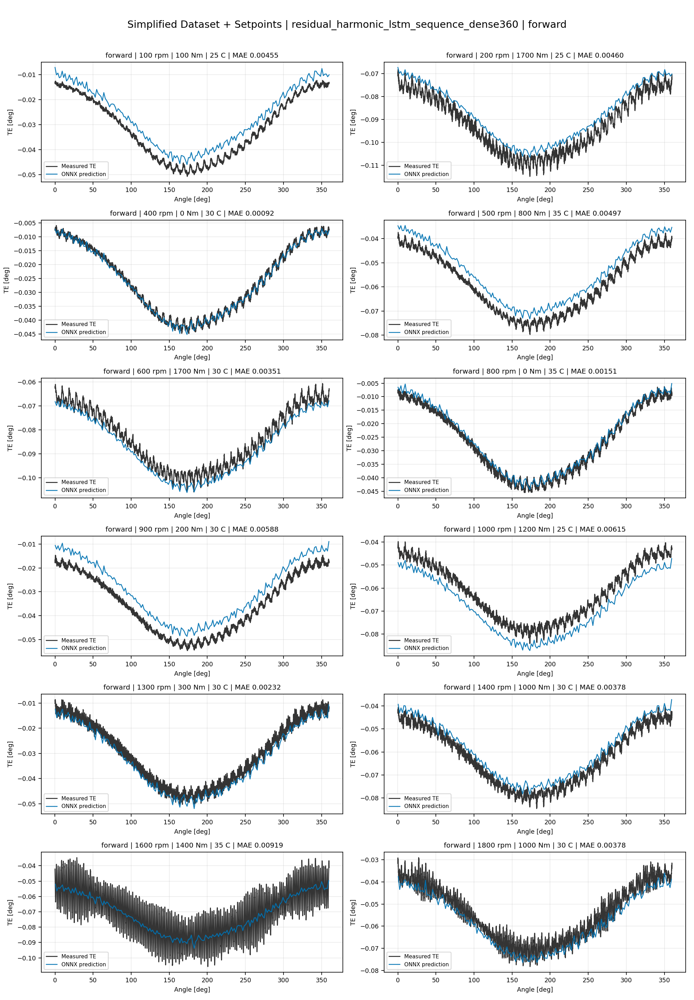
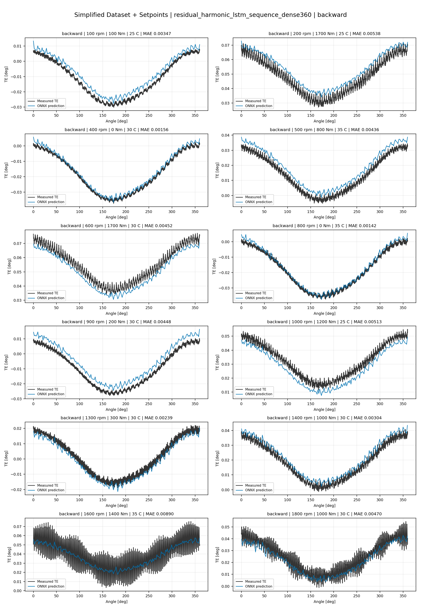
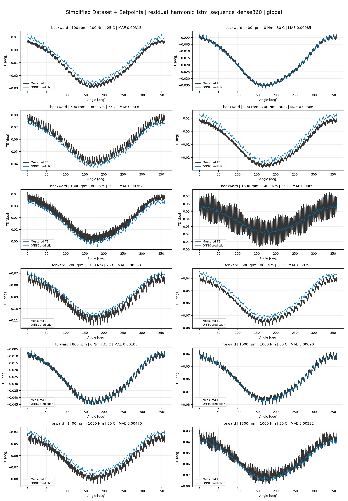
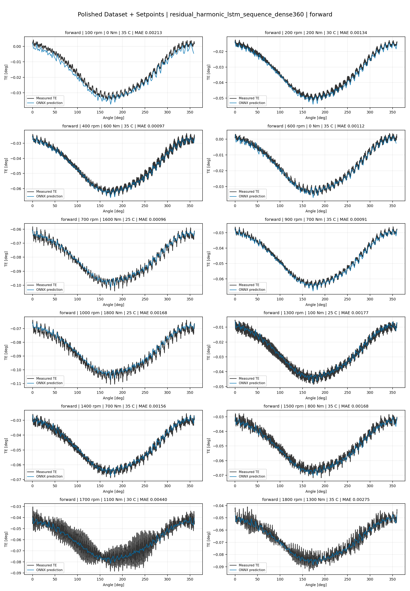
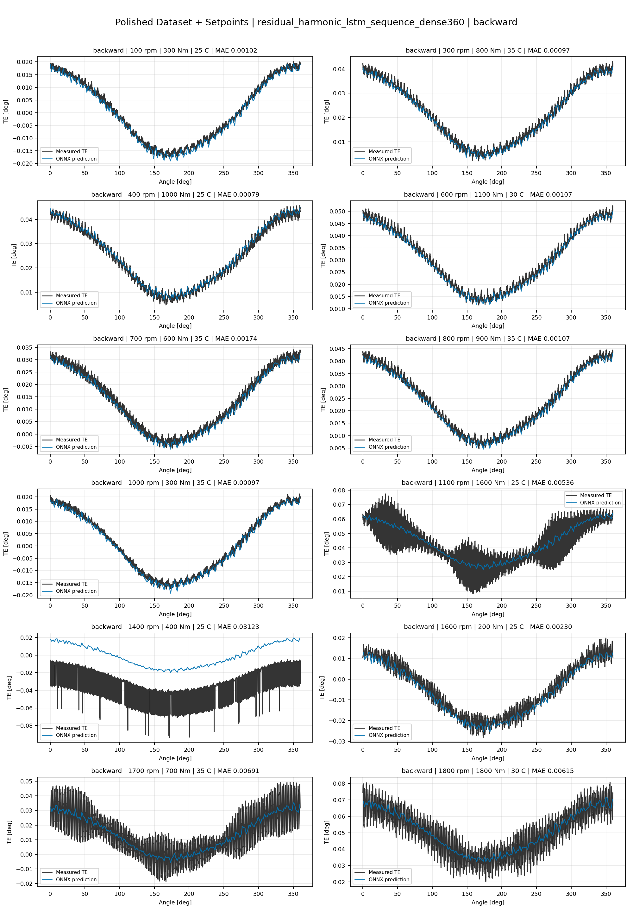
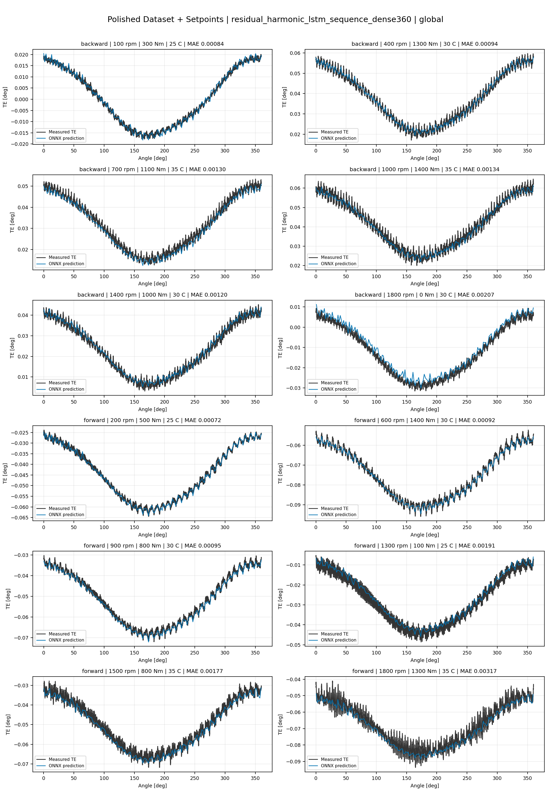
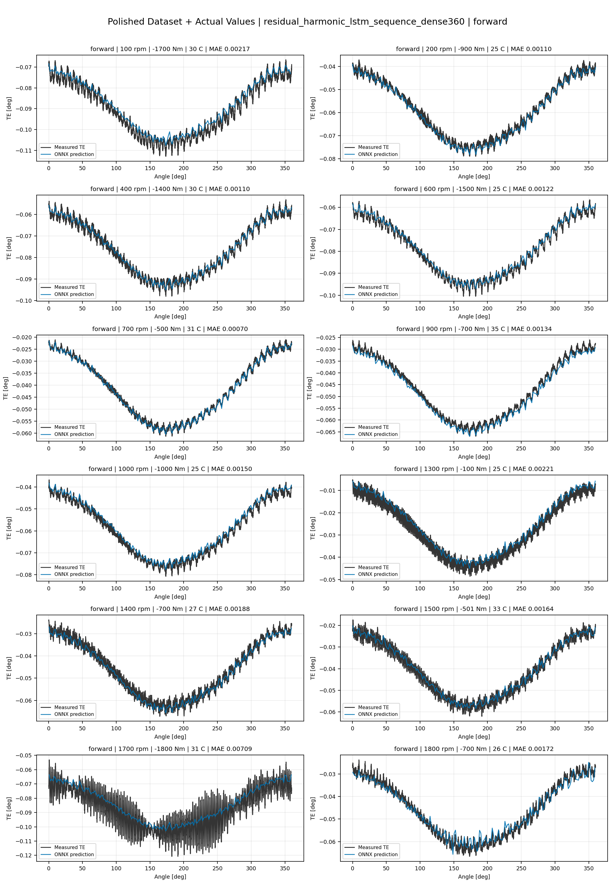
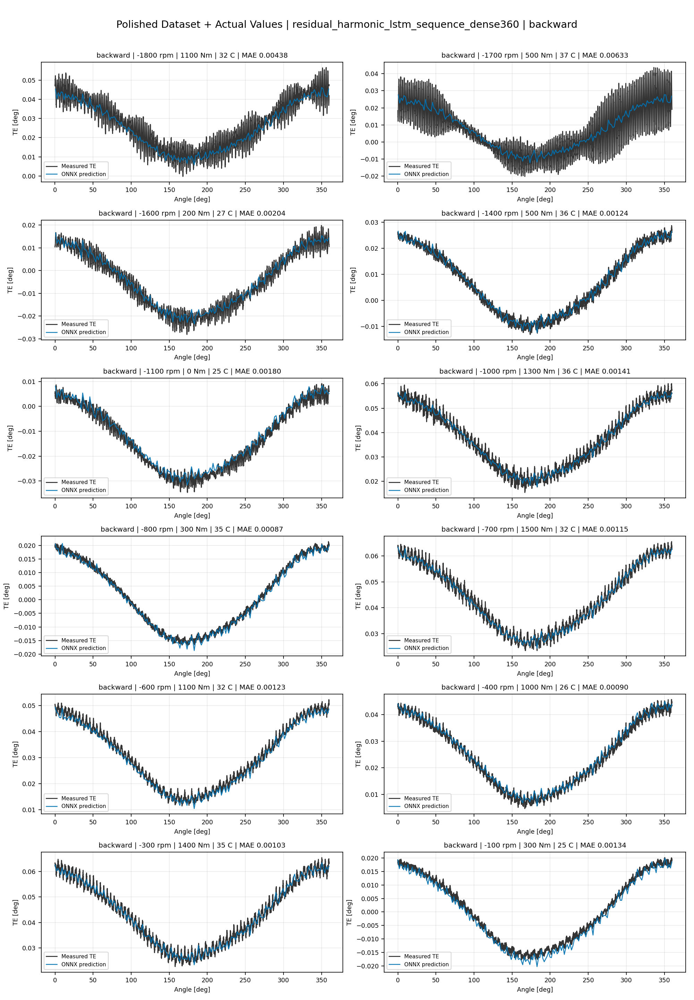
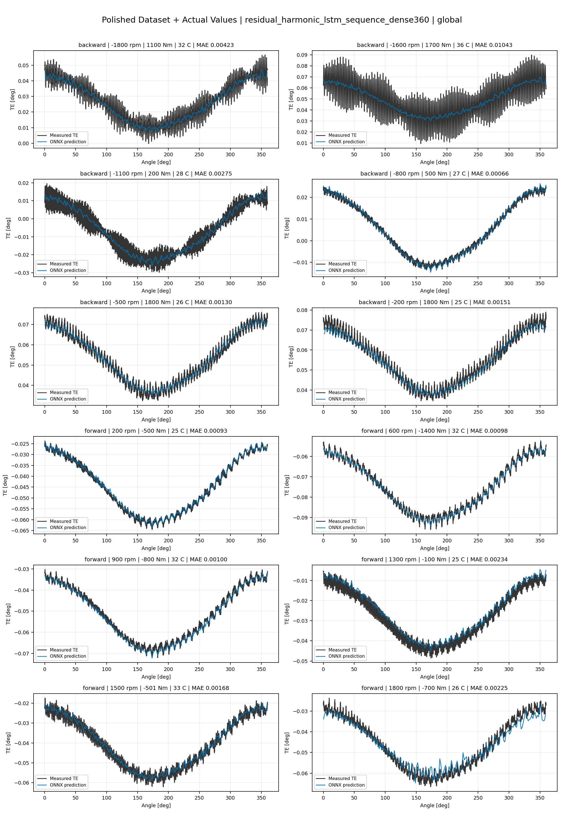

# TE Curve Verification Pipeline Familywise ONNX Report - residual_harmonic_lstm_sequence_dense360

## Overview

This report evaluates exported ONNX models from the dataset input-mode
retraining program. Each dataset/input-mode section uses dataset-matched
held-out test curves and lists the exact model artifacts loaded from
`models/`.

Rank-3 temporal ONNX exports are evaluated on the sequence-window test
contract stored in each `training_config.snapshot.yaml`, including
`sequence_length`, `sequence_stride`, `sequence_target_position`, and
`maximum_sequences_per_curve`.
The collage pages keep the measured TE trace at the original full-curve
resolution; temporal ONNX predictions are overlaid at the evaluated
sequence-target angles.

The report is diagnostic and family-specific. It does not replace an
official multi-index model-promotion decision.

## Output Artifacts

- output directory: `output/validation_checks/track2_familywise_onnx_report/residual_harmonic_lstm_sequence_dense360/2026-07-10-12-52-29__track2_residual_harmonic_lstm_sequence_dense360_familywise_onnx_report`;
- summary YAML: `output/validation_checks/track2_familywise_onnx_report/residual_harmonic_lstm_sequence_dense360/2026-07-10-12-52-29__track2_residual_harmonic_lstm_sequence_dense360_familywise_onnx_report/track2_familywise_onnx_report_summary.yaml`;
- model inventory CSV: `output/validation_checks/track2_familywise_onnx_report/residual_harmonic_lstm_sequence_dense360/2026-07-10-12-52-29__track2_residual_harmonic_lstm_sequence_dense360_familywise_onnx_report/model_inventory.csv`;
- per-curve metrics CSV: `output/validation_checks/track2_familywise_onnx_report/residual_harmonic_lstm_sequence_dense360/2026-07-10-12-52-29__track2_residual_harmonic_lstm_sequence_dense360_familywise_onnx_report/per_curve_metrics.csv`.

## Simplified Dataset + Setpoints

- dataset: `simplified_dataset`;
- input mode: `setpoints`;
- evaluated family: `residual_harmonic_lstm_sequence_dense360`;
- dataset root: `data/simplified_dataset`.

### Models Used

| Surface | Run Name | Run Instance | Dataset Schema |
| --- | --- | --- | --- |
| forward | `te_residual_harmonic_lstm_sequence_dense360_fw__simplified_setpoints` | `2026-07-10-04-03-58__te_residual_harmonic_lstm_sequence_dense360_fw__simplified_setpoints` | `simplified_curve_v1` |
| backward | `te_residual_harmonic_lstm_sequence_dense360_bw__simplified_setpoints` | `2026-07-10-04-23-03__te_residual_harmonic_lstm_sequence_dense360_bw__simplified_setpoints` | `simplified_curve_v1` |
| global | `te_residual_harmonic_lstm_sequence_dense360_global__simplified_setpoints` | `2026-07-10-03-42-49__te_residual_harmonic_lstm_sequence_dense360_global__simplified_setpoints` | `simplified_curve_v1` |

Exact model paths:

| Surface | ONNX Model Path | Python Model Path |
| --- | --- | --- |
| forward | `models/simplified_dataset/setpoints/exported/residual_harmonic_lstm_sequence_dense360/forward/2026-07-10-04-03-58__te_residual_harmonic_lstm_sequence_dense360_fw__simplified_setpoints/onnx/model.onnx` | `models/simplified_dataset/setpoints/exported/residual_harmonic_lstm_sequence_dense360/forward/2026-07-10-04-03-58__te_residual_harmonic_lstm_sequence_dense360_fw__simplified_setpoints/python/residual_harmonic_lstm_sequence-epoch=047-val_mae=0.00358223.ckpt` |
| backward | `models/simplified_dataset/setpoints/exported/residual_harmonic_lstm_sequence_dense360/backward/2026-07-10-04-23-03__te_residual_harmonic_lstm_sequence_dense360_bw__simplified_setpoints/onnx/model.onnx` | `models/simplified_dataset/setpoints/exported/residual_harmonic_lstm_sequence_dense360/backward/2026-07-10-04-23-03__te_residual_harmonic_lstm_sequence_dense360_bw__simplified_setpoints/python/residual_harmonic_lstm_sequence-epoch=030-val_mae=0.00360440.ckpt` |
| global | `models/simplified_dataset/setpoints/exported/residual_harmonic_lstm_sequence_dense360/global/2026-07-10-03-42-49__te_residual_harmonic_lstm_sequence_dense360_global__simplified_setpoints/onnx/model.onnx` | `models/simplified_dataset/setpoints/exported/residual_harmonic_lstm_sequence_dense360/global/2026-07-10-03-42-49__te_residual_harmonic_lstm_sequence_dense360_global__simplified_setpoints/python/residual_harmonic_lstm_sequence-epoch=055-val_mae=0.00360012.ckpt` |

### Aggregate Metrics

| Surface | Curves | MAE [deg] | RMSE [deg] | Mean Error [%] | P95 Error [%] |
| --- | ---: | ---: | ---: | ---: | ---: |
| forward | 97 | 0.003324 | 0.003680 | 7.770 | 14.041 |
| backward | 97 | 0.003636 | 0.004035 | 8.436 | 13.508 |
| global | 194 | 0.003443 | 0.003807 | 8.022 | 14.410 |

Offset And Shape Metrics:

| Surface | Signed Offset [deg] | Absolute Offset [deg] | Centered MAE [deg] | P2P Error [deg] |
| --- | ---: | ---: | ---: | ---: |
| forward | -0.000286 | 0.002861 | 0.001494 | 0.003143 |
| backward | -0.000432 | 0.002975 | 0.001785 | 0.004322 |
| global | 0.000167 | 0.002885 | 0.001594 | 0.003801 |

### Forward 12-Curve Page

### Backward 12-Curve Page

### Global 12-Curve Page

## Polished Dataset + Setpoints

- dataset: `polished_dataset`;
- input mode: `setpoints`;
- evaluated family: `residual_harmonic_lstm_sequence_dense360`;
- dataset root: `data/polished_dataset`.

### Models Used

| Surface | Run Name | Run Instance | Dataset Schema |
| --- | --- | --- | --- |
| forward | `te_residual_harmonic_lstm_sequence_dense360_fw__polished_setpoints` | `2026-07-10-05-27-52__te_residual_harmonic_lstm_sequence_dense360_fw__polished_setpoints` | `polished_setpoint_curve_v1` |
| backward | `te_residual_harmonic_lstm_sequence_dense360_bw__polished_setpoints` | `2026-07-10-05-51-16__te_residual_harmonic_lstm_sequence_dense360_bw__polished_setpoints` | `polished_setpoint_curve_v1` |
| global | `te_residual_harmonic_lstm_sequence_dense360_global__polished_setpoints` | `2026-07-10-04-53-57__te_residual_harmonic_lstm_sequence_dense360_global__polished_setpoints` | `polished_setpoint_curve_v1` |

Exact model paths:

| Surface | ONNX Model Path | Python Model Path |
| --- | --- | --- |
| forward | `models/polished_dataset/setpoints/exported/residual_harmonic_lstm_sequence_dense360/forward/2026-07-10-05-27-52__te_residual_harmonic_lstm_sequence_dense360_fw__polished_setpoints/onnx/model.onnx` | `models/polished_dataset/setpoints/exported/residual_harmonic_lstm_sequence_dense360/forward/2026-07-10-05-27-52__te_residual_harmonic_lstm_sequence_dense360_fw__polished_setpoints/python/residual_harmonic_lstm_sequence-epoch=089-val_mae=0.00201259.ckpt` |
| backward | `models/polished_dataset/setpoints/exported/residual_harmonic_lstm_sequence_dense360/backward/2026-07-10-05-51-16__te_residual_harmonic_lstm_sequence_dense360_bw__polished_setpoints/onnx/model.onnx` | `models/polished_dataset/setpoints/exported/residual_harmonic_lstm_sequence_dense360/backward/2026-07-10-05-51-16__te_residual_harmonic_lstm_sequence_dense360_bw__polished_setpoints/python/residual_harmonic_lstm_sequence-epoch=102-val_mae=0.00199077.ckpt` |
| global | `models/polished_dataset/setpoints/exported/residual_harmonic_lstm_sequence_dense360/global/2026-07-10-04-53-57__te_residual_harmonic_lstm_sequence_dense360_global__polished_setpoints/onnx/model.onnx` | `models/polished_dataset/setpoints/exported/residual_harmonic_lstm_sequence_dense360/global/2026-07-10-04-53-57__te_residual_harmonic_lstm_sequence_dense360_global__polished_setpoints/python/residual_harmonic_lstm_sequence-epoch=101-val_mae=0.00197679.ckpt` |

### Aggregate Metrics

| Surface | Curves | MAE [deg] | RMSE [deg] | Mean Error [%] | P95 Error [%] |
| --- | ---: | ---: | ---: | ---: | ---: |
| forward | 100 | 0.001962 | 0.002342 | 4.317 | 9.740 |
| backward | 94 | 0.002561 | 0.003018 | 4.717 | 10.769 |
| global | 194 | 0.002282 | 0.002718 | 4.574 | 10.784 |

Offset And Shape Metrics:

| Surface | Signed Offset [deg] | Absolute Offset [deg] | Centered MAE [deg] | P2P Error [deg] |
| --- | ---: | ---: | ---: | ---: |
| forward | -0.000112 | 0.000944 | 0.001623 | 0.003539 |
| backward | 0.000234 | 0.000941 | 0.002181 | 0.006428 |
| global | 0.000058 | 0.000942 | 0.001939 | 0.005049 |

### Forward 12-Curve Page

### Backward 12-Curve Page

### Global 12-Curve Page

## Polished Dataset + Actual Values

- dataset: `polished_dataset`;
- input mode: `actual_values`;
- evaluated family: `residual_harmonic_lstm_sequence_dense360`;
- dataset root: `data/polished_dataset`.

### Models Used

| Surface | Run Name | Run Instance | Dataset Schema |
| --- | --- | --- | --- |
| forward | `te_residual_harmonic_lstm_sequence_dense360_fw__polished_actual_values` | `2026-07-10-06-59-39__te_residual_harmonic_lstm_sequence_dense360_fw__polished_actual_values` | `polished_point_v1` |
| backward | `te_residual_harmonic_lstm_sequence_dense360_bw__polished_actual_values` | `2026-07-10-07-24-50__te_residual_harmonic_lstm_sequence_dense360_bw__polished_actual_values` | `polished_point_v1` |
| global | `te_residual_harmonic_lstm_sequence_dense360_global__polished_actual_values` | `2026-07-10-06-44-07__te_residual_harmonic_lstm_sequence_dense360_global__polished_actual_values` | `polished_point_v1` |

Exact model paths:

| Surface | ONNX Model Path | Python Model Path |
| --- | --- | --- |
| forward | `models/polished_dataset/actual_values/exported/residual_harmonic_lstm_sequence_dense360/forward/2026-07-10-06-59-39__te_residual_harmonic_lstm_sequence_dense360_fw__polished_actual_values/onnx/model.onnx` | `models/polished_dataset/actual_values/exported/residual_harmonic_lstm_sequence_dense360/forward/2026-07-10-06-59-39__te_residual_harmonic_lstm_sequence_dense360_fw__polished_actual_values/python/residual_harmonic_lstm_sequence-epoch=062-val_mae=0.00203211.ckpt` |
| backward | `models/polished_dataset/actual_values/exported/residual_harmonic_lstm_sequence_dense360/backward/2026-07-10-07-24-50__te_residual_harmonic_lstm_sequence_dense360_bw__polished_actual_values/onnx/model.onnx` | `models/polished_dataset/actual_values/exported/residual_harmonic_lstm_sequence_dense360/backward/2026-07-10-07-24-50__te_residual_harmonic_lstm_sequence_dense360_bw__polished_actual_values/python/residual_harmonic_lstm_sequence-epoch=105-val_mae=0.00199856.ckpt` |
| global | `models/polished_dataset/actual_values/exported/residual_harmonic_lstm_sequence_dense360/global/2026-07-10-06-44-07__te_residual_harmonic_lstm_sequence_dense360_global__polished_actual_values/onnx/model.onnx` | `models/polished_dataset/actual_values/exported/residual_harmonic_lstm_sequence_dense360/global/2026-07-10-06-44-07__te_residual_harmonic_lstm_sequence_dense360_global__polished_actual_values/python/residual_harmonic_lstm_sequence-epoch=018-val_mae=0.00209241.ckpt` |

### Aggregate Metrics

| Surface | Curves | MAE [deg] | RMSE [deg] | Mean Error [%] | P95 Error [%] |
| --- | ---: | ---: | ---: | ---: | ---: |
| forward | 100 | 0.001963 | 0.002351 | 4.308 | 9.765 |
| backward | 94 | 0.002407 | 0.002910 | 4.655 | 10.621 |
| global | 194 | 0.002330 | 0.002768 | 4.681 | 10.888 |

Offset And Shape Metrics:

| Surface | Signed Offset [deg] | Absolute Offset [deg] | Centered MAE [deg] | P2P Error [deg] |
| --- | ---: | ---: | ---: | ---: |
| forward | 0.000074 | 0.000820 | 0.001683 | 0.004364 |
| backward | -0.000045 | 0.000668 | 0.002267 | 0.005942 |
| global | 0.000269 | 0.000925 | 0.001985 | 0.005341 |

### Forward 12-Curve Page

### Backward 12-Curve Page

### Global 12-Curve Page

