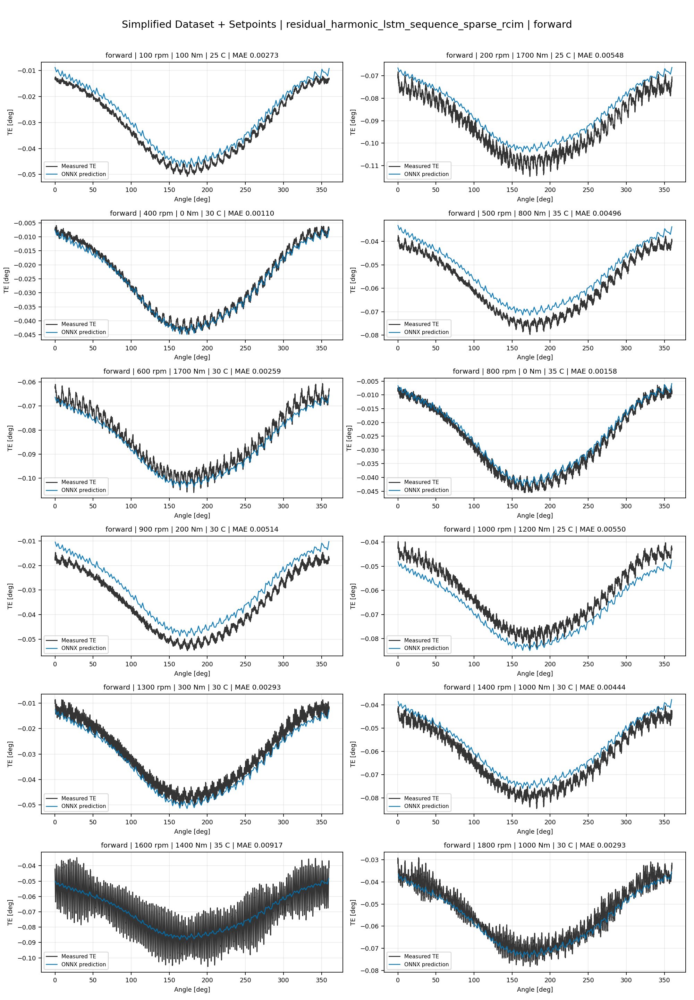
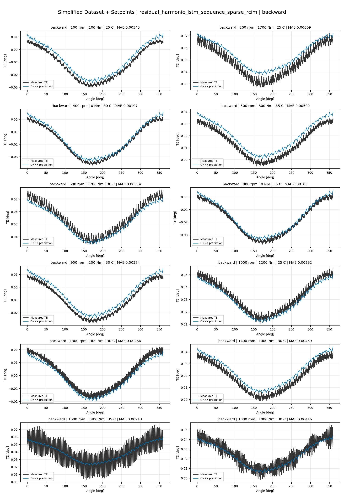
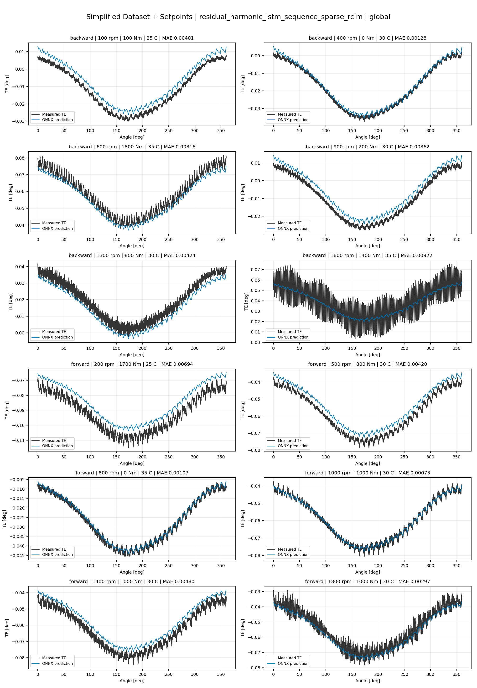
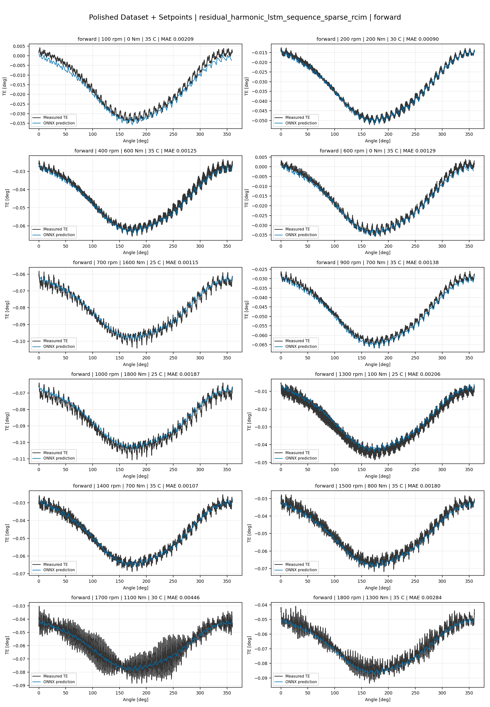
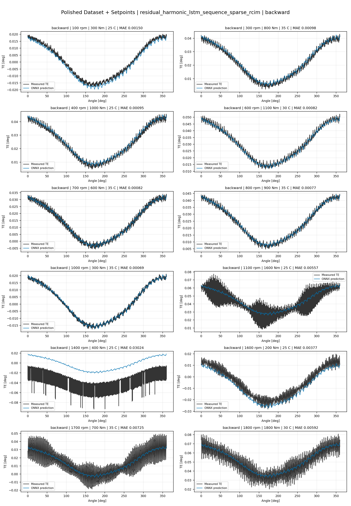
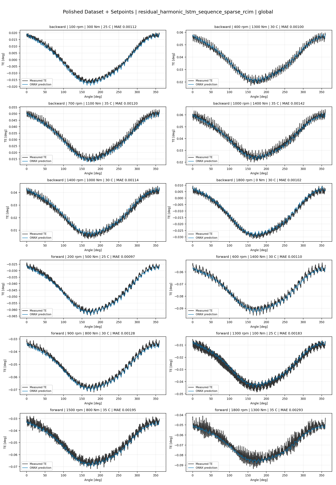
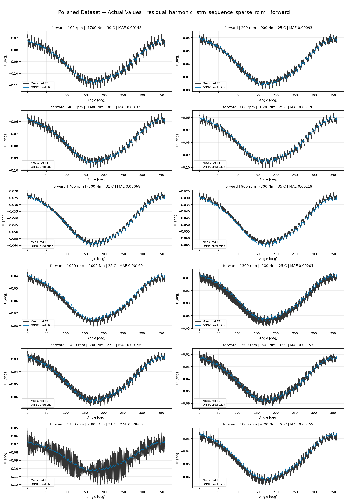
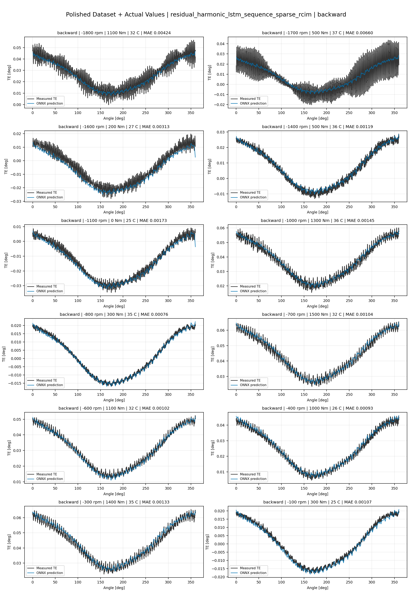
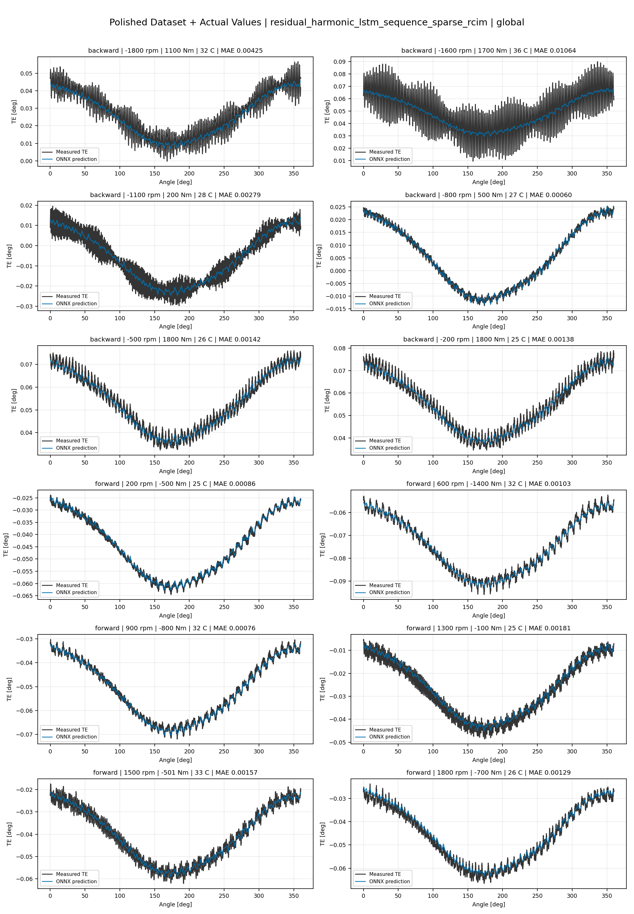

# TE Curve Verification Pipeline Familywise ONNX Report - residual_harmonic_lstm_sequence_sparse_rcim

## Overview

This report evaluates exported ONNX models from the dataset input-mode
retraining program. Each dataset/input-mode section uses dataset-matched
held-out test curves and lists the exact model artifacts loaded from
`models/`.

Rank-3 temporal ONNX exports are evaluated on the sequence-window test
contract stored in each `training_config.snapshot.yaml`, including
`sequence_length`, `sequence_stride`, `sequence_target_position`, and
`maximum_sequences_per_curve`.
The collage pages keep the measured TE trace at the original full-curve
resolution; temporal ONNX predictions are overlaid at the evaluated
sequence-target angles.

The report is diagnostic and family-specific. It does not replace an
official multi-index model-promotion decision.

## Output Artifacts

- output directory: `output/validation_checks/track2_familywise_onnx_report/residual_harmonic_lstm_sequence_sparse_rcim/2026-07-09-23-54-09__track2_residual_harmonic_lstm_sequence_sparse_rcim_familywise_onnx_report`;
- summary YAML: `output/validation_checks/track2_familywise_onnx_report/residual_harmonic_lstm_sequence_sparse_rcim/2026-07-09-23-54-09__track2_residual_harmonic_lstm_sequence_sparse_rcim_familywise_onnx_report/track2_familywise_onnx_report_summary.yaml`;
- model inventory CSV: `output/validation_checks/track2_familywise_onnx_report/residual_harmonic_lstm_sequence_sparse_rcim/2026-07-09-23-54-09__track2_residual_harmonic_lstm_sequence_sparse_rcim_familywise_onnx_report/model_inventory.csv`;
- per-curve metrics CSV: `output/validation_checks/track2_familywise_onnx_report/residual_harmonic_lstm_sequence_sparse_rcim/2026-07-09-23-54-09__track2_residual_harmonic_lstm_sequence_sparse_rcim_familywise_onnx_report/per_curve_metrics.csv`.

## Simplified Dataset + Setpoints

- dataset: `simplified_dataset`;
- input mode: `setpoints`;
- evaluated family: `residual_harmonic_lstm_sequence_sparse_rcim`;
- dataset root: `data/simplified_dataset`.

### Models Used

| Surface | Run Name | Run Instance | Dataset Schema |
| --- | --- | --- | --- |
| forward | `te_residual_harmonic_lstm_sequence_sparse_rcim_fw__simplified_setpoints` | `2026-07-09-18-56-39__te_residual_harmonic_lstm_sequence_sparse_rcim_fw__simplified_setpoints` | `simplified_curve_v1` |
| backward | `te_residual_harmonic_lstm_sequence_sparse_rcim_bw__simplified_setpoints` | `2026-07-09-19-10-53__te_residual_harmonic_lstm_sequence_sparse_rcim_bw__simplified_setpoints` | `simplified_curve_v1` |
| global | `te_residual_harmonic_lstm_sequence_sparse_rcim_global__simplified_setpoints` | `2026-07-09-18-39-59__te_residual_harmonic_lstm_sequence_sparse_rcim_global__simplified_setpoints` | `simplified_curve_v1` |

Exact model paths:

| Surface | ONNX Model Path | Python Model Path |
| --- | --- | --- |
| forward | `models/simplified_dataset/setpoints/exported/residual_harmonic_lstm_sequence_sparse_rcim/forward/2026-07-09-18-56-39__te_residual_harmonic_lstm_sequence_sparse_rcim_fw__simplified_setpoints/onnx/model.onnx` | `models/simplified_dataset/setpoints/exported/residual_harmonic_lstm_sequence_sparse_rcim/forward/2026-07-09-18-56-39__te_residual_harmonic_lstm_sequence_sparse_rcim_fw__simplified_setpoints/python/residual_harmonic_lstm_sequence-epoch=029-val_mae=0.00367824.ckpt` |
| backward | `models/simplified_dataset/setpoints/exported/residual_harmonic_lstm_sequence_sparse_rcim/backward/2026-07-09-19-10-53__te_residual_harmonic_lstm_sequence_sparse_rcim_bw__simplified_setpoints/onnx/model.onnx` | `models/simplified_dataset/setpoints/exported/residual_harmonic_lstm_sequence_sparse_rcim/backward/2026-07-09-19-10-53__te_residual_harmonic_lstm_sequence_sparse_rcim_bw__simplified_setpoints/python/residual_harmonic_lstm_sequence-epoch=027-val_mae=0.00365442.ckpt` |
| global | `models/simplified_dataset/setpoints/exported/residual_harmonic_lstm_sequence_sparse_rcim/global/2026-07-09-18-39-59__te_residual_harmonic_lstm_sequence_sparse_rcim_global__simplified_setpoints/onnx/model.onnx` | `models/simplified_dataset/setpoints/exported/residual_harmonic_lstm_sequence_sparse_rcim/global/2026-07-09-18-39-59__te_residual_harmonic_lstm_sequence_sparse_rcim_global__simplified_setpoints/python/residual_harmonic_lstm_sequence-epoch=050-val_mae=0.00361757.ckpt` |

### Aggregate Metrics

| Surface | Curves | MAE [deg] | RMSE [deg] | Mean Error [%] | P95 Error [%] |
| --- | ---: | ---: | ---: | ---: | ---: |
| forward | 97 | 0.003230 | 0.003595 | 7.545 | 12.779 |
| backward | 97 | 0.003631 | 0.004018 | 8.424 | 14.298 |
| global | 194 | 0.003400 | 0.003752 | 7.906 | 13.518 |

Offset And Shape Metrics:

| Surface | Signed Offset [deg] | Absolute Offset [deg] | Centered MAE [deg] | P2P Error [deg] |
| --- | ---: | ---: | ---: | ---: |
| forward | 0.000018 | 0.002780 | 0.001503 | 0.004466 |
| backward | 0.000713 | 0.002954 | 0.001750 | 0.004777 |
| global | 0.000355 | 0.002874 | 0.001554 | 0.004320 |

### Forward 12-Curve Page

### Backward 12-Curve Page

### Global 12-Curve Page

## Polished Dataset + Setpoints

- dataset: `polished_dataset`;
- input mode: `setpoints`;
- evaluated family: `residual_harmonic_lstm_sequence_sparse_rcim`;
- dataset root: `data/polished_dataset`.

### Models Used

| Surface | Run Name | Run Instance | Dataset Schema |
| --- | --- | --- | --- |
| forward | `te_residual_harmonic_lstm_sequence_sparse_rcim_fw__polished_setpoints` | `2026-07-09-19-52-09__te_residual_harmonic_lstm_sequence_sparse_rcim_fw__polished_setpoints` | `polished_setpoint_curve_v1` |
| backward | `te_residual_harmonic_lstm_sequence_sparse_rcim_bw__polished_setpoints` | `2026-07-09-20-17-04__te_residual_harmonic_lstm_sequence_sparse_rcim_bw__polished_setpoints` | `polished_setpoint_curve_v1` |
| global | `te_residual_harmonic_lstm_sequence_sparse_rcim_global__polished_setpoints` | `2026-07-09-19-35-45__te_residual_harmonic_lstm_sequence_sparse_rcim_global__polished_setpoints` | `polished_setpoint_curve_v1` |

Exact model paths:

| Surface | ONNX Model Path | Python Model Path |
| --- | --- | --- |
| forward | `models/polished_dataset/setpoints/exported/residual_harmonic_lstm_sequence_sparse_rcim/forward/2026-07-09-19-52-09__te_residual_harmonic_lstm_sequence_sparse_rcim_fw__polished_setpoints/onnx/model.onnx` | `models/polished_dataset/setpoints/exported/residual_harmonic_lstm_sequence_sparse_rcim/forward/2026-07-09-19-52-09__te_residual_harmonic_lstm_sequence_sparse_rcim_fw__polished_setpoints/python/residual_harmonic_lstm_sequence-epoch=068-val_mae=0.00202292.ckpt` |
| backward | `models/polished_dataset/setpoints/exported/residual_harmonic_lstm_sequence_sparse_rcim/backward/2026-07-09-20-17-04__te_residual_harmonic_lstm_sequence_sparse_rcim_bw__polished_setpoints/onnx/model.onnx` | `models/polished_dataset/setpoints/exported/residual_harmonic_lstm_sequence_sparse_rcim/backward/2026-07-09-20-17-04__te_residual_harmonic_lstm_sequence_sparse_rcim_bw__polished_setpoints/python/residual_harmonic_lstm_sequence-epoch=088-val_mae=0.00204480.ckpt` |
| global | `models/polished_dataset/setpoints/exported/residual_harmonic_lstm_sequence_sparse_rcim/global/2026-07-09-19-35-45__te_residual_harmonic_lstm_sequence_sparse_rcim_global__polished_setpoints/onnx/model.onnx` | `models/polished_dataset/setpoints/exported/residual_harmonic_lstm_sequence_sparse_rcim/global/2026-07-09-19-35-45__te_residual_harmonic_lstm_sequence_sparse_rcim_global__polished_setpoints/python/residual_harmonic_lstm_sequence-epoch=060-val_mae=0.00204293.ckpt` |

### Aggregate Metrics

| Surface | Curves | MAE [deg] | RMSE [deg] | Mean Error [%] | P95 Error [%] |
| --- | ---: | ---: | ---: | ---: | ---: |
| forward | 100 | 0.002051 | 0.002446 | 4.522 | 10.352 |
| backward | 94 | 0.002703 | 0.003183 | 5.052 | 11.113 |
| global | 194 | 0.002349 | 0.002785 | 4.725 | 11.043 |

Offset And Shape Metrics:

| Surface | Signed Offset [deg] | Absolute Offset [deg] | Centered MAE [deg] | P2P Error [deg] |
| --- | ---: | ---: | ---: | ---: |
| forward | -0.000145 | 0.001048 | 0.001658 | 0.004786 |
| backward | 0.000526 | 0.001172 | 0.002224 | 0.006798 |
| global | -0.000053 | 0.001051 | 0.001948 | 0.005866 |

### Forward 12-Curve Page

### Backward 12-Curve Page

### Global 12-Curve Page

## Polished Dataset + Actual Values

- dataset: `polished_dataset`;
- input mode: `actual_values`;
- evaluated family: `residual_harmonic_lstm_sequence_sparse_rcim`;
- dataset root: `data/polished_dataset`.

### Models Used

| Surface | Run Name | Run Instance | Dataset Schema |
| --- | --- | --- | --- |
| forward | `te_residual_harmonic_lstm_sequence_sparse_rcim_fw__polished_actual_values` | `2026-07-09-21-46-24__te_residual_harmonic_lstm_sequence_sparse_rcim_fw__polished_actual_values` | `polished_point_v1` |
| backward | `te_residual_harmonic_lstm_sequence_sparse_rcim_bw__polished_actual_values` | `2026-07-09-22-37-02__te_residual_harmonic_lstm_sequence_sparse_rcim_bw__polished_actual_values` | `polished_point_v1` |
| global | `te_residual_harmonic_lstm_sequence_sparse_rcim_global__polished_actual_values` | `2026-07-09-20-53-57__te_residual_harmonic_lstm_sequence_sparse_rcim_global__polished_actual_values` | `polished_point_v1` |

Exact model paths:

| Surface | ONNX Model Path | Python Model Path |
| --- | --- | --- |
| forward | `models/polished_dataset/actual_values/exported/residual_harmonic_lstm_sequence_sparse_rcim/forward/2026-07-09-21-46-24__te_residual_harmonic_lstm_sequence_sparse_rcim_fw__polished_actual_values/onnx/model.onnx` | `models/polished_dataset/actual_values/exported/residual_harmonic_lstm_sequence_sparse_rcim/forward/2026-07-09-21-46-24__te_residual_harmonic_lstm_sequence_sparse_rcim_fw__polished_actual_values/python/residual_harmonic_lstm_sequence-epoch=219-val_mae=0.00195141.ckpt` |
| backward | `models/polished_dataset/actual_values/exported/residual_harmonic_lstm_sequence_sparse_rcim/backward/2026-07-09-22-37-02__te_residual_harmonic_lstm_sequence_sparse_rcim_bw__polished_actual_values/onnx/model.onnx` | `models/polished_dataset/actual_values/exported/residual_harmonic_lstm_sequence_sparse_rcim/backward/2026-07-09-22-37-02__te_residual_harmonic_lstm_sequence_sparse_rcim_bw__polished_actual_values/python/residual_harmonic_lstm_sequence-epoch=010-val_mae=0.00215380.ckpt` |
| global | `models/polished_dataset/actual_values/exported/residual_harmonic_lstm_sequence_sparse_rcim/global/2026-07-09-20-53-57__te_residual_harmonic_lstm_sequence_sparse_rcim_global__polished_actual_values/onnx/model.onnx` | `models/polished_dataset/actual_values/exported/residual_harmonic_lstm_sequence_sparse_rcim/global/2026-07-09-20-53-57__te_residual_harmonic_lstm_sequence_sparse_rcim_global__polished_actual_values/python/residual_harmonic_lstm_sequence-epoch=189-val_mae=0.00196022.ckpt` |

### Aggregate Metrics

| Surface | Curves | MAE [deg] | RMSE [deg] | Mean Error [%] | P95 Error [%] |
| --- | ---: | ---: | ---: | ---: | ---: |
| forward | 100 | 0.001858 | 0.002255 | 4.031 | 8.991 |
| backward | 94 | 0.002677 | 0.003168 | 4.957 | 11.181 |
| global | 194 | 0.002097 | 0.002528 | 4.245 | 10.582 |

Offset And Shape Metrics:

| Surface | Signed Offset [deg] | Absolute Offset [deg] | Centered MAE [deg] | P2P Error [deg] |
| --- | ---: | ---: | ---: | ---: |
| forward | -0.000218 | 0.000726 | 0.001671 | 0.004964 |
| backward | 0.000301 | 0.000999 | 0.002297 | 0.006932 |
| global | -0.000088 | 0.000668 | 0.001924 | 0.005493 |

### Forward 12-Curve Page

### Backward 12-Curve Page

### Global 12-Curve Page

