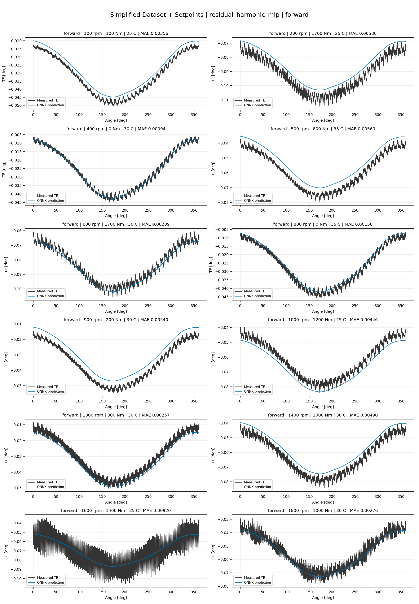
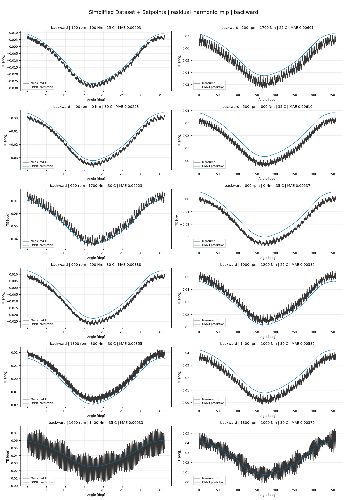
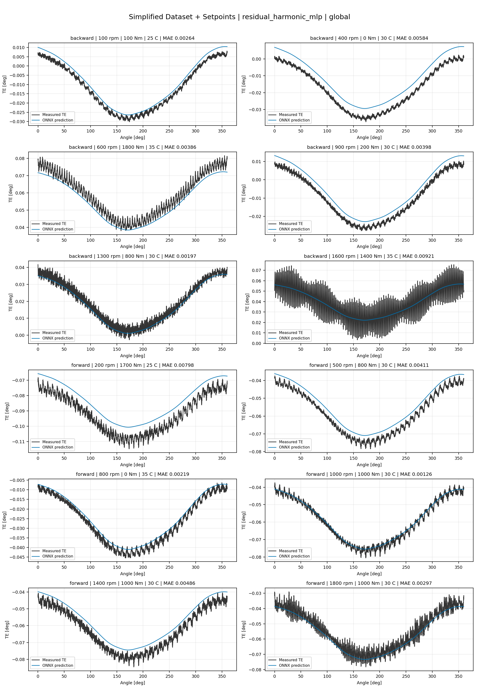
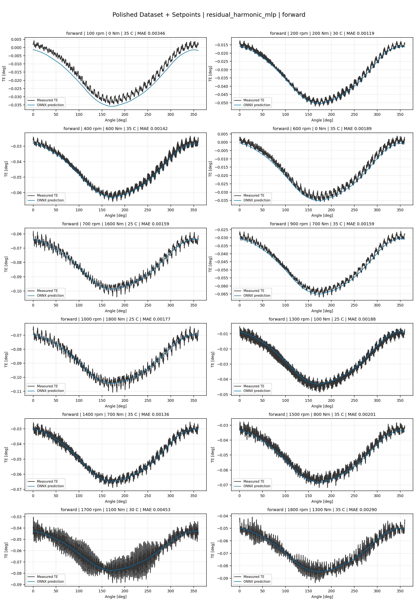
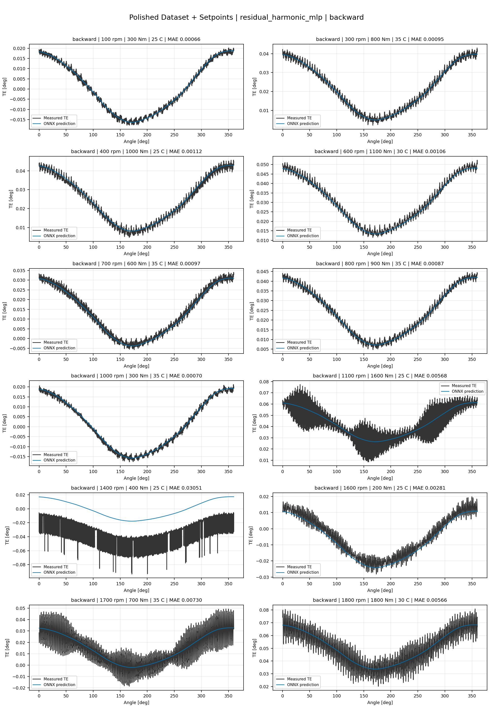
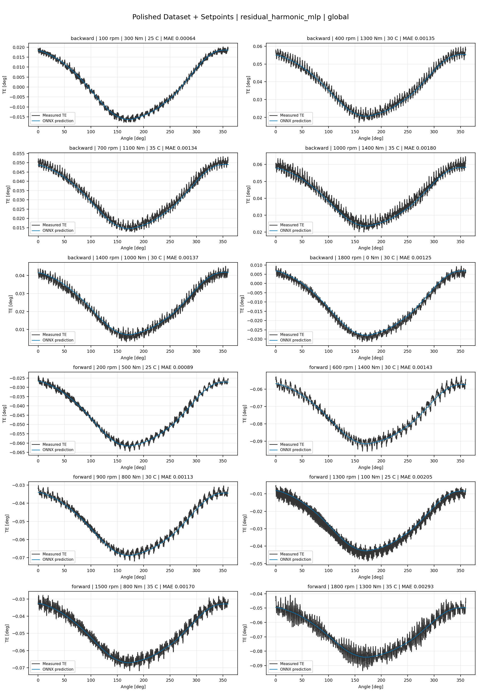
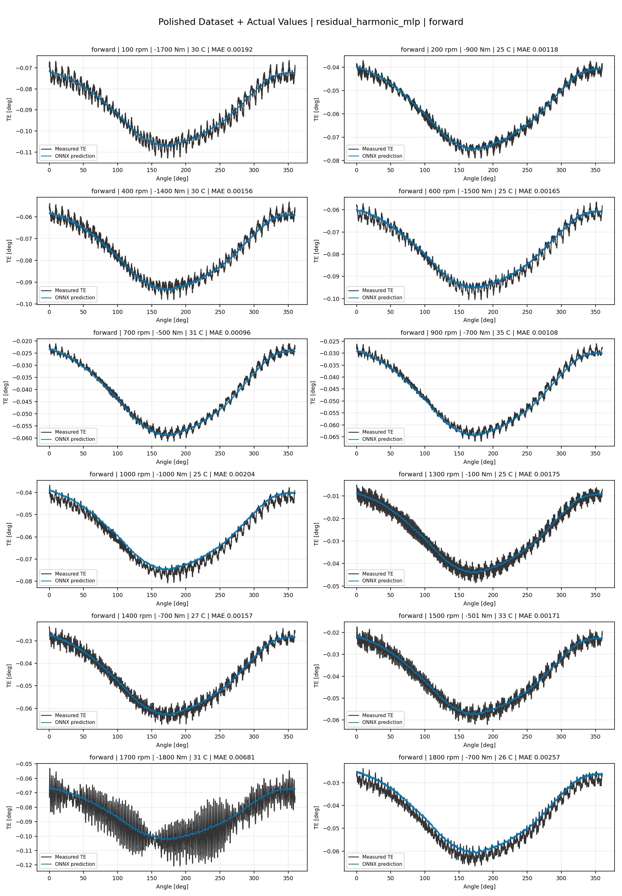
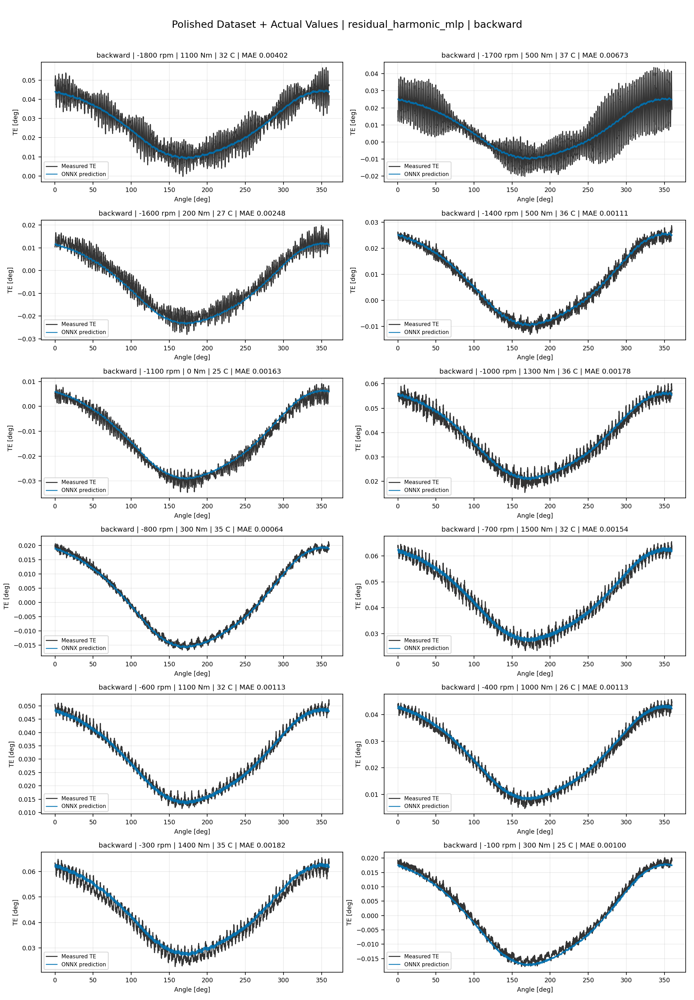
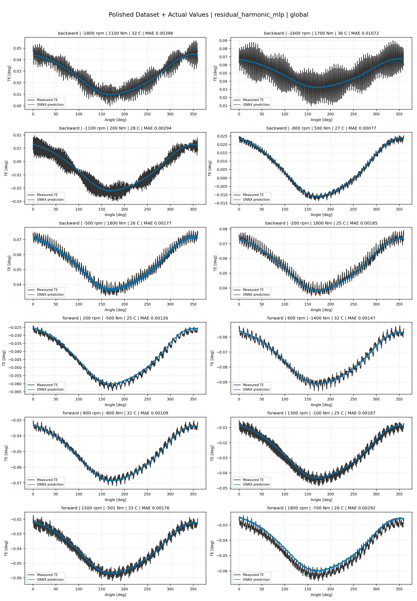

# TE Curve Verification Pipeline Familywise ONNX Report - residual_harmonic_mlp

## Overview

This report evaluates exported ONNX models from the dataset input-mode
retraining program. Each dataset/input-mode section uses dataset-matched
held-out test curves and lists the exact model artifacts loaded from
`models/`.

The report is diagnostic and family-specific. It does not replace an
official multi-index model-promotion decision.

## Output Artifacts

- output directory: `output/validation_checks/track2_familywise_onnx_report/residual_harmonic_mlp/2026-07-07-15-28-55__track2_residual_harmonic_mlp_familywise_onnx_report`;
- summary YAML: `output/validation_checks/track2_familywise_onnx_report/residual_harmonic_mlp/2026-07-07-15-28-55__track2_residual_harmonic_mlp_familywise_onnx_report/track2_familywise_onnx_report_summary.yaml`;
- model inventory CSV: `output/validation_checks/track2_familywise_onnx_report/residual_harmonic_mlp/2026-07-07-15-28-55__track2_residual_harmonic_mlp_familywise_onnx_report/model_inventory.csv`;
- per-curve metrics CSV: `output/validation_checks/track2_familywise_onnx_report/residual_harmonic_mlp/2026-07-07-15-28-55__track2_residual_harmonic_mlp_familywise_onnx_report/per_curve_metrics.csv`.

## Simplified Dataset + Setpoints

- dataset: `simplified_dataset`;
- input mode: `setpoints`;
- evaluated family: `residual_harmonic_mlp`;
- dataset root: `data/simplified_dataset`.

### Models Used

| Surface | Run Name | Run Instance | Dataset Schema |
| --- | --- | --- | --- |
| forward | `te_residual_harmonic_mlp_fw__simplified_setpoints` | `2026-07-07-10-54-26__te_residual_harmonic_mlp_fw__simplified_setpoints` | `simplified_curve_v1` |
| backward | `te_residual_harmonic_mlp_bw__simplified_setpoints` | `2026-07-07-11-09-49__te_residual_harmonic_mlp_bw__simplified_setpoints` | `simplified_curve_v1` |
| global | `te_residual_harmonic_mlp_global__simplified_setpoints` | `2026-07-07-10-46-08__te_residual_harmonic_mlp_global__simplified_setpoints` | `simplified_curve_v1` |

Exact model paths:

| Surface | ONNX Model Path | Python Model Path |
| --- | --- | --- |
| forward | `models/simplified_dataset/setpoints/residual_harmonic_mlp/forward/onnx/model.onnx` | `models/simplified_dataset/setpoints/residual_harmonic_mlp/forward/python/residual_harmonic_mlp-epoch=079-val_mae=0.00306417.ckpt` |
| backward | `models/simplified_dataset/setpoints/residual_harmonic_mlp/backward/onnx/model.onnx` | `models/simplified_dataset/setpoints/residual_harmonic_mlp/backward/python/residual_harmonic_mlp-epoch=032-val_mae=0.00306476.ckpt` |
| global | `models/simplified_dataset/setpoints/residual_harmonic_mlp/global/onnx/model.onnx` | `models/simplified_dataset/setpoints/residual_harmonic_mlp/global/python/residual_harmonic_mlp-epoch=010-val_mae=0.00315844.ckpt` |

### Aggregate Metrics

| Surface | Curves | MAE [deg] | RMSE [deg] | Mean Error [%] | P95 Error [%] |
| --- | ---: | ---: | ---: | ---: | ---: |
| forward | 97 | 0.003329 | 0.003739 | 7.380 | 13.427 |
| backward | 97 | 0.003734 | 0.004148 | 8.181 | 15.080 |
| global | 194 | 0.003728 | 0.004144 | 8.241 | 15.361 |

Offset And Shape Metrics:

| Surface | Signed Offset [deg] | Absolute Offset [deg] | Centered MAE [deg] | P2P Error [deg] |
| --- | ---: | ---: | ---: | ---: |
| forward | 0.000903 | 0.002727 | 0.001697 | 0.009765 |
| backward | 0.001054 | 0.003027 | 0.001828 | 0.009713 |
| global | 0.001222 | 0.003092 | 0.001781 | 0.009788 |

### Forward 12-Curve Page

### Backward 12-Curve Page

### Global 12-Curve Page

## Polished Dataset + Setpoints

- dataset: `polished_dataset`;
- input mode: `setpoints`;
- evaluated family: `residual_harmonic_mlp`;
- dataset root: `data/polished_dataset`.

### Models Used

| Surface | Run Name | Run Instance | Dataset Schema |
| --- | --- | --- | --- |
| forward | `te_residual_harmonic_mlp_fw__polished_setpoints` | `2026-07-07-12-02-44__te_residual_harmonic_mlp_fw__polished_setpoints` | `polished_setpoint_curve_v1` |
| backward | `te_residual_harmonic_mlp_bw__polished_setpoints` | `2026-07-07-12-36-55__te_residual_harmonic_mlp_bw__polished_setpoints` | `polished_setpoint_curve_v1` |
| global | `te_residual_harmonic_mlp_global__polished_setpoints` | `2026-07-07-11-34-39__te_residual_harmonic_mlp_global__polished_setpoints` | `polished_setpoint_curve_v1` |

Exact model paths:

| Surface | ONNX Model Path | Python Model Path |
| --- | --- | --- |
| forward | `models/polished_dataset/setpoints/residual_harmonic_mlp/forward/onnx/model.onnx` | `models/polished_dataset/setpoints/residual_harmonic_mlp/forward/python/residual_harmonic_mlp-epoch=122-val_mae=0.00159866.ckpt` |
| backward | `models/polished_dataset/setpoints/residual_harmonic_mlp/backward/onnx/model.onnx` | `models/polished_dataset/setpoints/residual_harmonic_mlp/backward/python/residual_harmonic_mlp-epoch=093-val_mae=0.00162645.ckpt` |
| global | `models/polished_dataset/setpoints/residual_harmonic_mlp/global/onnx/model.onnx` | `models/polished_dataset/setpoints/residual_harmonic_mlp/global/python/residual_harmonic_mlp-epoch=069-val_mae=0.00158201.ckpt` |

### Aggregate Metrics

| Surface | Curves | MAE [deg] | RMSE [deg] | Mean Error [%] | P95 Error [%] |
| --- | ---: | ---: | ---: | ---: | ---: |
| forward | 100 | 0.002201 | 0.002648 | 4.569 | 8.932 |
| backward | 94 | 0.002763 | 0.003257 | 4.912 | 10.607 |
| global | 194 | 0.002465 | 0.002939 | 4.704 | 10.418 |

Offset And Shape Metrics:

| Surface | Signed Offset [deg] | Absolute Offset [deg] | Centered MAE [deg] | P2P Error [deg] |
| --- | ---: | ---: | ---: | ---: |
| forward | -0.000413 | 0.000863 | 0.001928 | 0.010958 |
| backward | 0.000710 | 0.001022 | 0.002359 | 0.012106 |
| global | 0.000172 | 0.000937 | 0.002139 | 0.011590 |

### Forward 12-Curve Page

### Backward 12-Curve Page

### Global 12-Curve Page

## Polished Dataset + Actual Values

- dataset: `polished_dataset`;
- input mode: `actual_values`;
- evaluated family: `residual_harmonic_mlp`;
- dataset root: `data/polished_dataset`.

### Models Used

| Surface | Run Name | Run Instance | Dataset Schema |
| --- | --- | --- | --- |
| forward | `te_residual_harmonic_mlp_fw__polished_actual_values` | `2026-07-07-13-50-19__te_residual_harmonic_mlp_fw__polished_actual_values` | `polished_point_v1` |
| backward | `te_residual_harmonic_mlp_bw__polished_actual_values` | `2026-07-07-14-15-24__te_residual_harmonic_mlp_bw__polished_actual_values` | `polished_point_v1` |
| global | `te_residual_harmonic_mlp_global__polished_actual_values` | `2026-07-07-13-20-06__te_residual_harmonic_mlp_global__polished_actual_values` | `polished_point_v1` |

Exact model paths:

| Surface | ONNX Model Path | Python Model Path |
| --- | --- | --- |
| forward | `models/polished_dataset/actual_values/residual_harmonic_mlp/forward/onnx/model.onnx` | `models/polished_dataset/actual_values/residual_harmonic_mlp/forward/python/residual_harmonic_mlp-epoch=052-val_mae=0.00163893.ckpt` |
| backward | `models/polished_dataset/actual_values/residual_harmonic_mlp/backward/onnx/model.onnx` | `models/polished_dataset/actual_values/residual_harmonic_mlp/backward/python/residual_harmonic_mlp-epoch=075-val_mae=0.00160615.ckpt` |
| global | `models/polished_dataset/actual_values/residual_harmonic_mlp/global/onnx/model.onnx` | `models/polished_dataset/actual_values/residual_harmonic_mlp/global/python/residual_harmonic_mlp-epoch=077-val_mae=0.00160259.ckpt` |

### Aggregate Metrics

| Surface | Curves | MAE [deg] | RMSE [deg] | Mean Error [%] | P95 Error [%] |
| --- | ---: | ---: | ---: | ---: | ---: |
| forward | 100 | 0.002191 | 0.002649 | 4.524 | 8.799 |
| backward | 94 | 0.002770 | 0.003275 | 4.914 | 10.607 |
| global | 194 | 0.002434 | 0.002915 | 4.627 | 9.999 |

Offset And Shape Metrics:

| Surface | Signed Offset [deg] | Absolute Offset [deg] | Centered MAE [deg] | P2P Error [deg] |
| --- | ---: | ---: | ---: | ---: |
| forward | -0.000077 | 0.000859 | 0.001949 | 0.009716 |
| backward | 0.000674 | 0.000970 | 0.002409 | 0.010930 |
| global | 0.000291 | 0.000869 | 0.002171 | 0.010348 |

### Forward 12-Curve Page

### Backward 12-Curve Page

### Global 12-Curve Page

