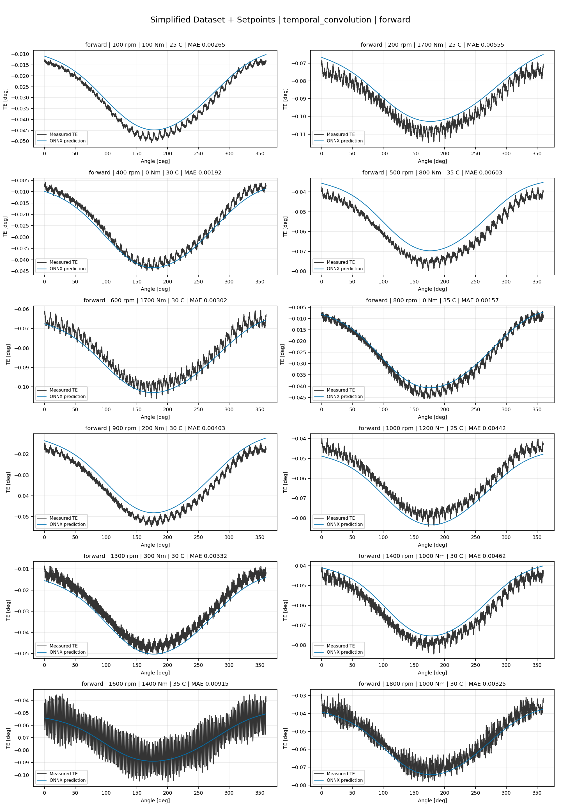
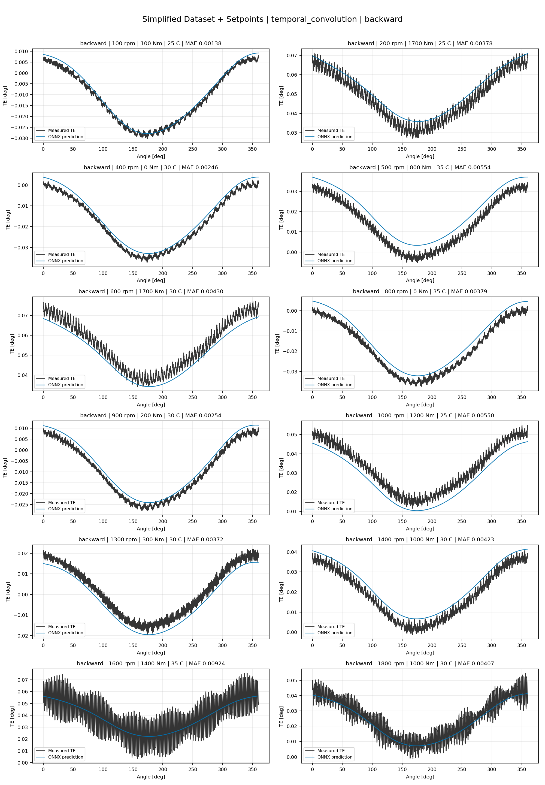
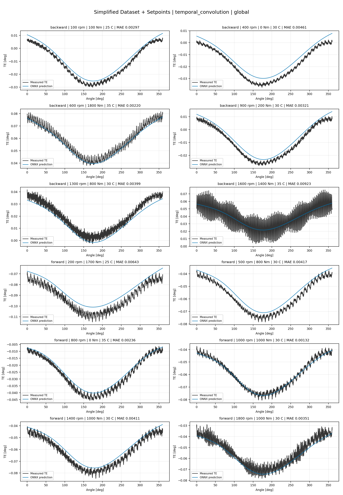
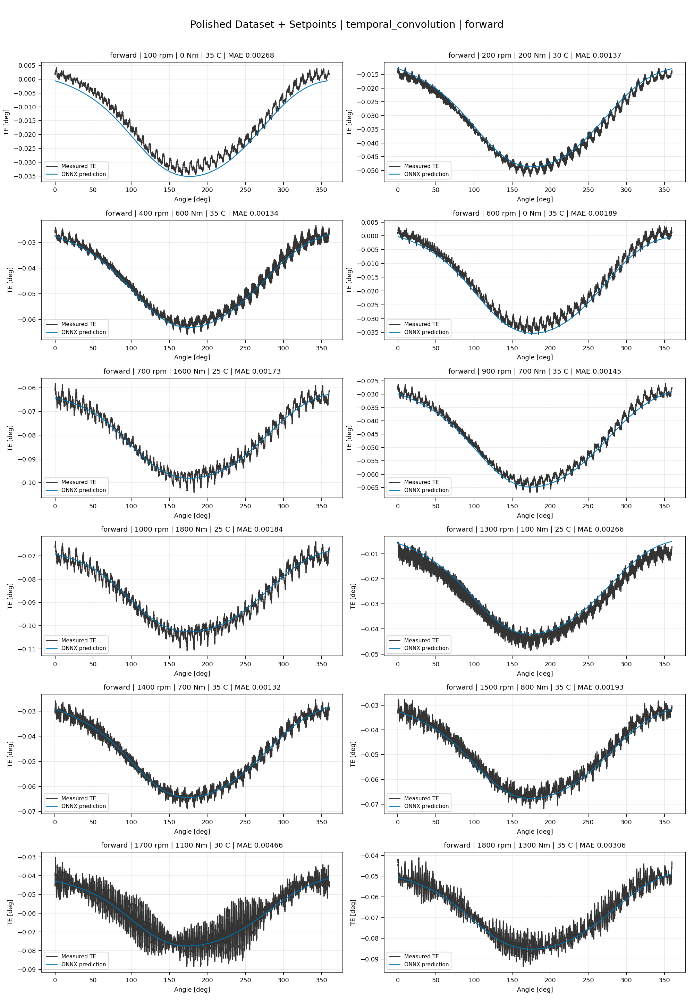
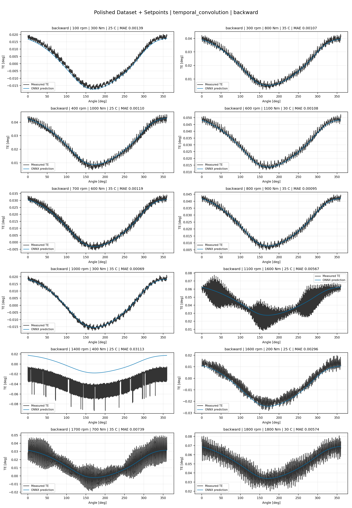
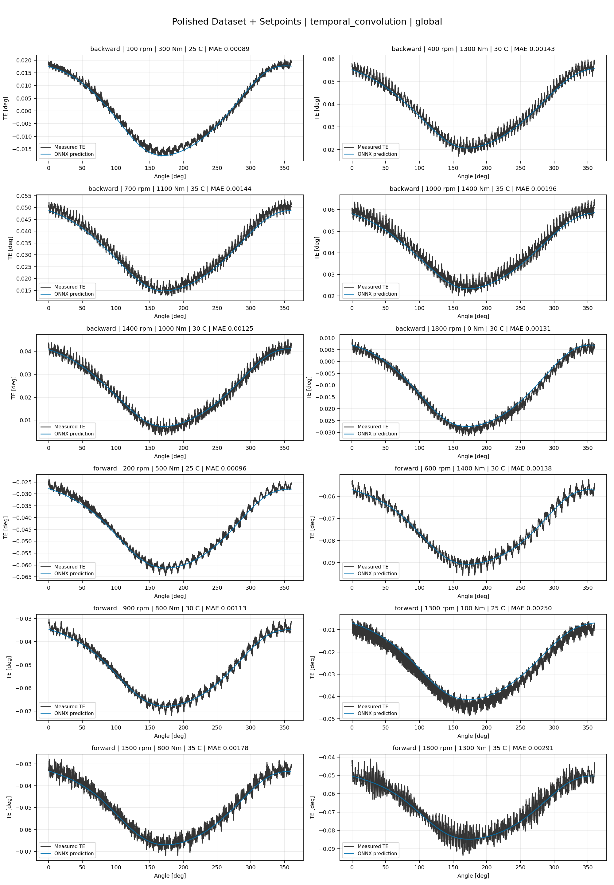
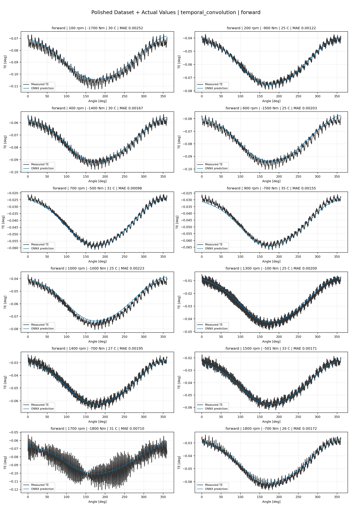
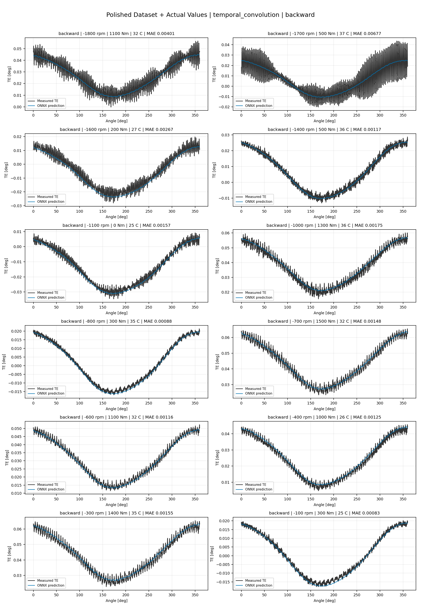
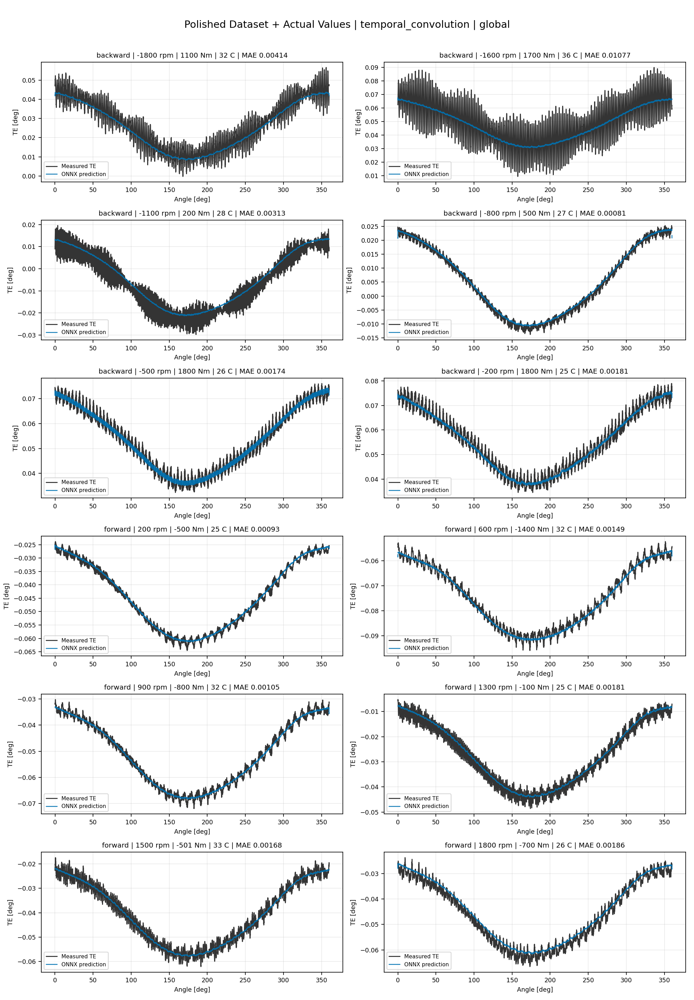

# TE Curve Verification Pipeline Familywise ONNX Report - temporal_convolution

## Overview

This report evaluates exported ONNX models from the dataset input-mode
retraining program. Each dataset/input-mode section uses dataset-matched
held-out test curves and lists the exact model artifacts loaded from
`models/`.

The report is diagnostic and family-specific. It does not replace an
official multi-index model-promotion decision.

## Output Artifacts

- output directory: `output/validation_checks/track2_familywise_onnx_report/temporal_convolution/2026-07-08-11-30-21__track2_temporal_convolution_familywise_onnx_report`;
- summary YAML: `output/validation_checks/track2_familywise_onnx_report/temporal_convolution/2026-07-08-11-30-21__track2_temporal_convolution_familywise_onnx_report/track2_familywise_onnx_report_summary.yaml`;
- model inventory CSV: `output/validation_checks/track2_familywise_onnx_report/temporal_convolution/2026-07-08-11-30-21__track2_temporal_convolution_familywise_onnx_report/model_inventory.csv`;
- per-curve metrics CSV: `output/validation_checks/track2_familywise_onnx_report/temporal_convolution/2026-07-08-11-30-21__track2_temporal_convolution_familywise_onnx_report/per_curve_metrics.csv`.

## Simplified Dataset + Setpoints

- dataset: `simplified_dataset`;
- input mode: `setpoints`;
- evaluated family: `temporal_convolution`;
- dataset root: `data/simplified_dataset`.

### Models Used

| Surface | Run Name | Run Instance | Dataset Schema |
| --- | --- | --- | --- |
| forward | `te_temporal_convolution_fw__simplified_setpoints` | `2026-07-08-04-14-38__te_temporal_convolution_fw__simplified_setpoints` | `simplified_curve_v1` |
| backward | `te_temporal_convolution_bw__simplified_setpoints` | `2026-07-08-04-21-12__te_temporal_convolution_bw__simplified_setpoints` | `simplified_curve_v1` |
| global | `te_temporal_convolution_global__simplified_setpoints` | `2026-07-08-04-09-09__te_temporal_convolution_global__simplified_setpoints` | `simplified_curve_v1` |

Exact model paths:

| Surface | ONNX Model Path | Python Model Path |
| --- | --- | --- |
| forward | `models/simplified_dataset/setpoints/temporal_convolution/forward/onnx/model.onnx` | `models/simplified_dataset/setpoints/temporal_convolution/forward/python/temporal_convolution-epoch=031-val_mae=0.00377881.ckpt` |
| backward | `models/simplified_dataset/setpoints/temporal_convolution/backward/onnx/model.onnx` | `models/simplified_dataset/setpoints/temporal_convolution/backward/python/temporal_convolution-epoch=091-val_mae=0.00381312.ckpt` |
| global | `models/simplified_dataset/setpoints/temporal_convolution/global/onnx/model.onnx` | `models/simplified_dataset/setpoints/temporal_convolution/global/python/temporal_convolution-epoch=016-val_mae=0.00380497.ckpt` |

### Aggregate Metrics

| Surface | Curves | MAE [deg] | RMSE [deg] | Mean Error [%] | P95 Error [%] |
| --- | ---: | ---: | ---: | ---: | ---: |
| forward | 97 | 0.003441 | 0.003885 | 7.630 | 12.659 |
| backward | 97 | 0.003700 | 0.004136 | 8.093 | 13.408 |
| global | 194 | 0.003624 | 0.004087 | 8.002 | 13.770 |

Offset And Shape Metrics:

| Surface | Signed Offset [deg] | Absolute Offset [deg] | Centered MAE [deg] | P2P Error [deg] |
| --- | ---: | ---: | ---: | ---: |
| forward | 0.000239 | 0.002886 | 0.001776 | 0.008700 |
| backward | -0.000412 | 0.002977 | 0.001892 | 0.009551 |
| global | 0.000330 | 0.002966 | 0.001893 | 0.008156 |

### Forward 12-Curve Page

### Backward 12-Curve Page

### Global 12-Curve Page

## Polished Dataset + Setpoints

- dataset: `polished_dataset`;
- input mode: `setpoints`;
- evaluated family: `temporal_convolution`;
- dataset root: `data/polished_dataset`.

### Models Used

| Surface | Run Name | Run Instance | Dataset Schema |
| --- | --- | --- | --- |
| forward | `te_temporal_convolution_fw__polished_setpoints` | `2026-07-08-09-01-27__te_temporal_convolution_fw__polished_setpoints` | `polished_setpoint_curve_v1` |
| backward | `te_temporal_convolution_bw__polished_setpoints` | `2026-07-08-09-14-19__te_temporal_convolution_bw__polished_setpoints` | `polished_setpoint_curve_v1` |
| global | `te_temporal_convolution_global__polished_setpoints` | `2026-07-08-08-48-08__te_temporal_convolution_global__polished_setpoints` | `polished_setpoint_curve_v1` |

Exact model paths:

| Surface | ONNX Model Path | Python Model Path |
| --- | --- | --- |
| forward | `models/polished_dataset/setpoints/temporal_convolution/forward/onnx/model.onnx` | `models/polished_dataset/setpoints/temporal_convolution/forward/python/temporal_convolution-epoch=042-val_mae=0.00225272.ckpt` |
| backward | `models/polished_dataset/setpoints/temporal_convolution/backward/onnx/model.onnx` | `models/polished_dataset/setpoints/temporal_convolution/backward/python/temporal_convolution-epoch=125-val_mae=0.00222200.ckpt` |
| global | `models/polished_dataset/setpoints/temporal_convolution/global/onnx/model.onnx` | `models/polished_dataset/setpoints/temporal_convolution/global/python/temporal_convolution-epoch=074-val_mae=0.00225012.ckpt` |

### Aggregate Metrics

| Surface | Curves | MAE [deg] | RMSE [deg] | Mean Error [%] | P95 Error [%] |
| --- | ---: | ---: | ---: | ---: | ---: |
| forward | 100 | 0.002313 | 0.002785 | 4.820 | 9.201 |
| backward | 94 | 0.002751 | 0.003254 | 4.885 | 10.587 |
| global | 194 | 0.002553 | 0.003057 | 4.907 | 10.324 |

Offset And Shape Metrics:

| Surface | Signed Offset [deg] | Absolute Offset [deg] | Centered MAE [deg] | P2P Error [deg] |
| --- | ---: | ---: | ---: | ---: |
| forward | -0.000135 | 0.001068 | 0.001965 | 0.009810 |
| backward | 0.000403 | 0.000999 | 0.002374 | 0.011338 |
| global | -0.000013 | 0.001146 | 0.002156 | 0.011565 |

### Forward 12-Curve Page

### Backward 12-Curve Page

### Global 12-Curve Page

## Polished Dataset + Actual Values

- dataset: `polished_dataset`;
- input mode: `actual_values`;
- evaluated family: `temporal_convolution`;
- dataset root: `data/polished_dataset`.

### Models Used

| Surface | Run Name | Run Instance | Dataset Schema |
| --- | --- | --- | --- |
| forward | `te_temporal_convolution_fw__polished_actual_values` | `2026-07-08-10-20-02__te_temporal_convolution_fw__polished_actual_values` | `polished_point_v1` |
| backward | `te_temporal_convolution_bw__polished_actual_values` | `2026-07-08-10-34-09__te_temporal_convolution_bw__polished_actual_values` | `polished_point_v1` |
| global | `te_temporal_convolution_global__polished_actual_values` | `2026-07-08-09-55-29__te_temporal_convolution_global__polished_actual_values` | `polished_point_v1` |

Exact model paths:

| Surface | ONNX Model Path | Python Model Path |
| --- | --- | --- |
| forward | `models/polished_dataset/actual_values/temporal_convolution/forward/onnx/model.onnx` | `models/polished_dataset/actual_values/temporal_convolution/forward/python/temporal_convolution-epoch=064-val_mae=0.00227215.ckpt` |
| backward | `models/polished_dataset/actual_values/temporal_convolution/backward/onnx/model.onnx` | `models/polished_dataset/actual_values/temporal_convolution/backward/python/temporal_convolution-epoch=123-val_mae=0.00219843.ckpt` |
| global | `models/polished_dataset/actual_values/temporal_convolution/global/onnx/model.onnx` | `models/polished_dataset/actual_values/temporal_convolution/global/python/temporal_convolution-epoch=106-val_mae=0.00219077.ckpt` |

### Aggregate Metrics

| Surface | Curves | MAE [deg] | RMSE [deg] | Mean Error [%] | P95 Error [%] |
| --- | ---: | ---: | ---: | ---: | ---: |
| forward | 100 | 0.002285 | 0.002779 | 4.740 | 10.322 |
| backward | 94 | 0.002469 | 0.002997 | 4.526 | 10.185 |
| global | 194 | 0.002336 | 0.002835 | 4.551 | 9.990 |

Offset And Shape Metrics:

| Surface | Signed Offset [deg] | Absolute Offset [deg] | Centered MAE [deg] | P2P Error [deg] |
| --- | ---: | ---: | ---: | ---: |
| forward | 0.000097 | 0.000980 | 0.002000 | 0.009439 |
| backward | -0.000024 | 0.000557 | 0.002392 | 0.009684 |
| global | -0.000016 | 0.000775 | 0.002160 | 0.010088 |

### Forward 12-Curve Page

### Backward 12-Curve Page

### Global 12-Curve Page

