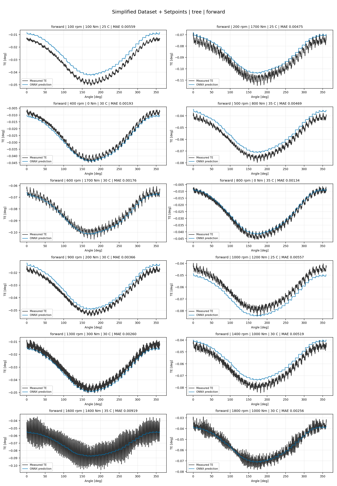
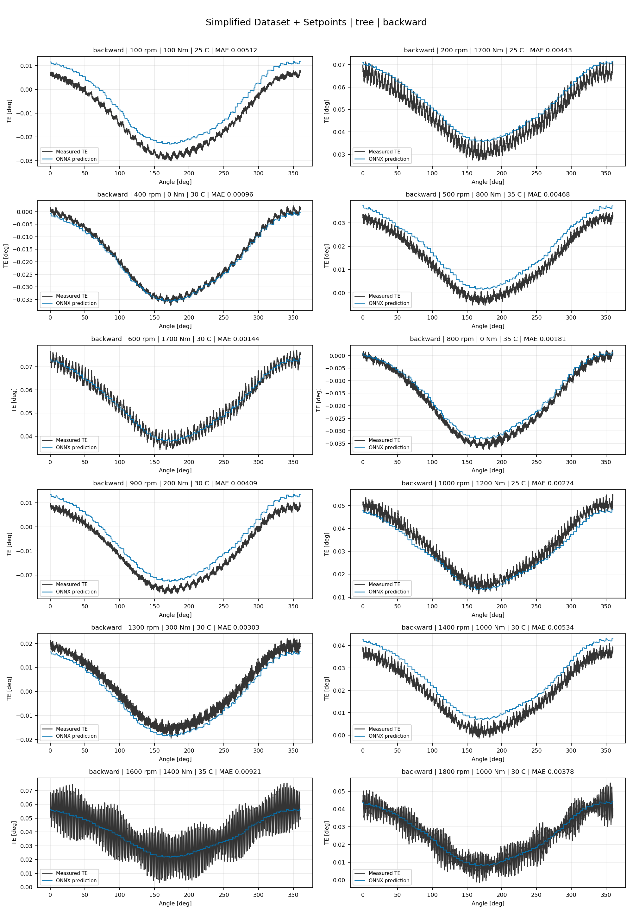
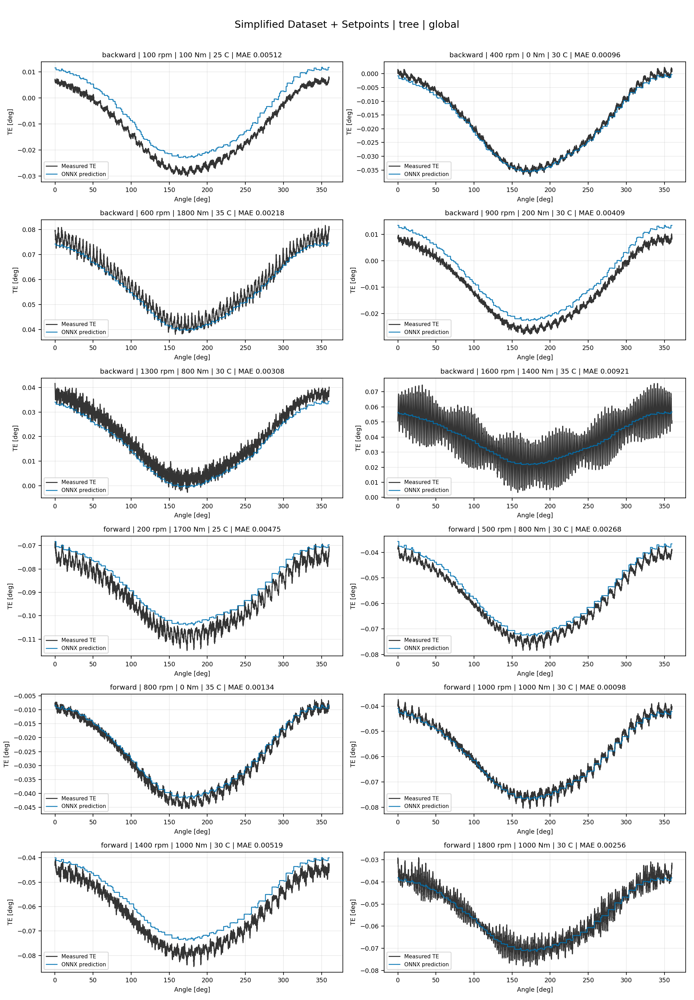
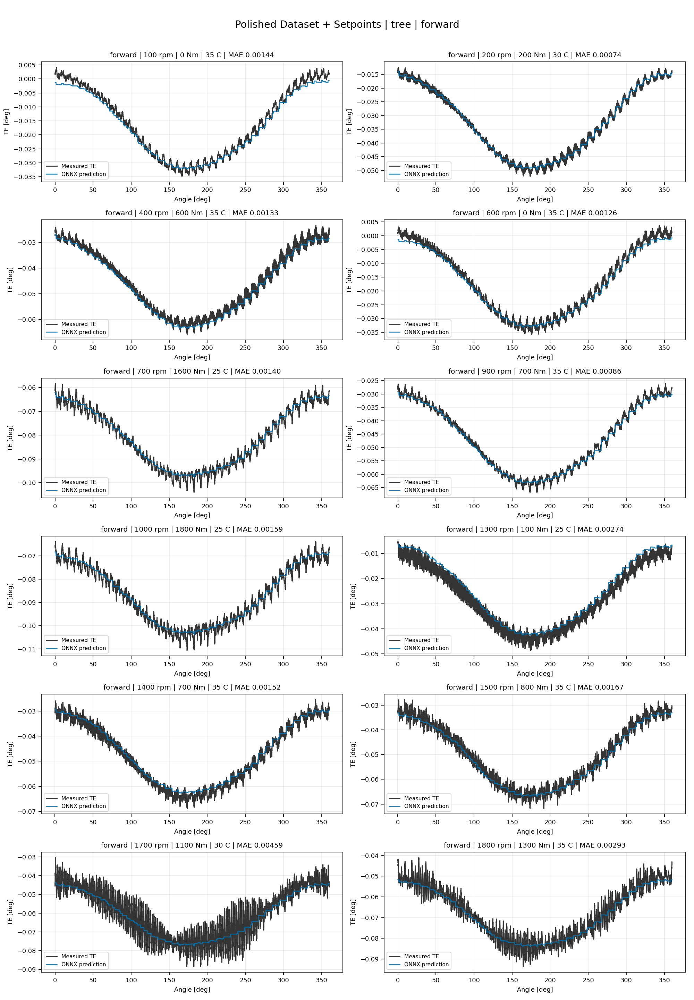
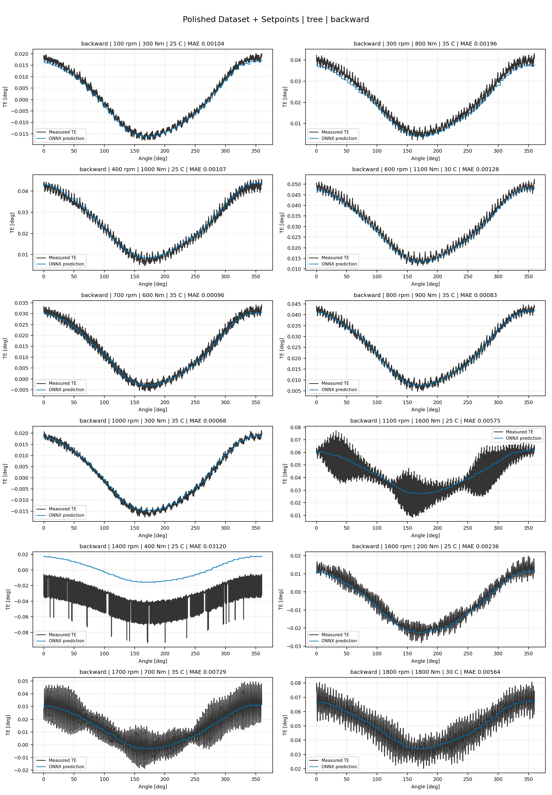
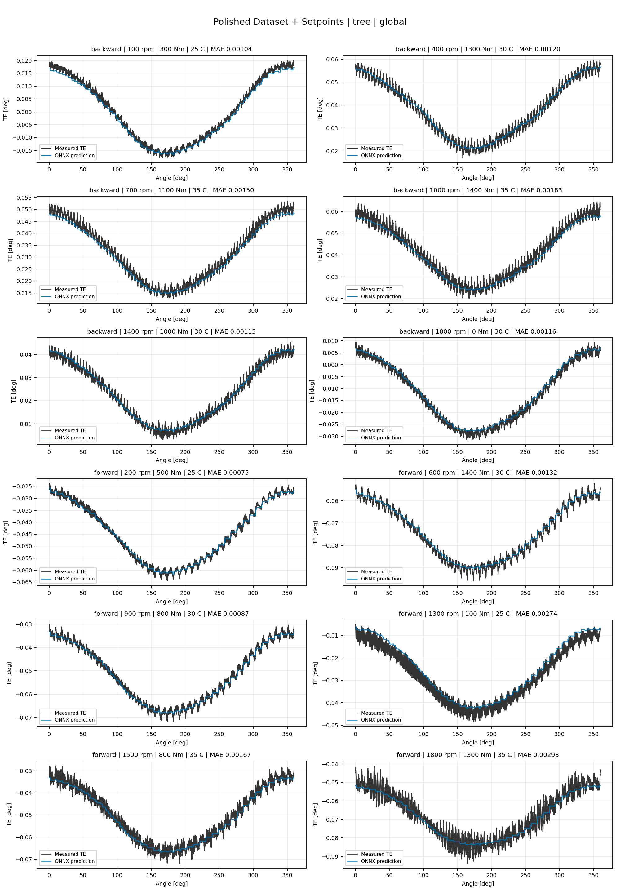
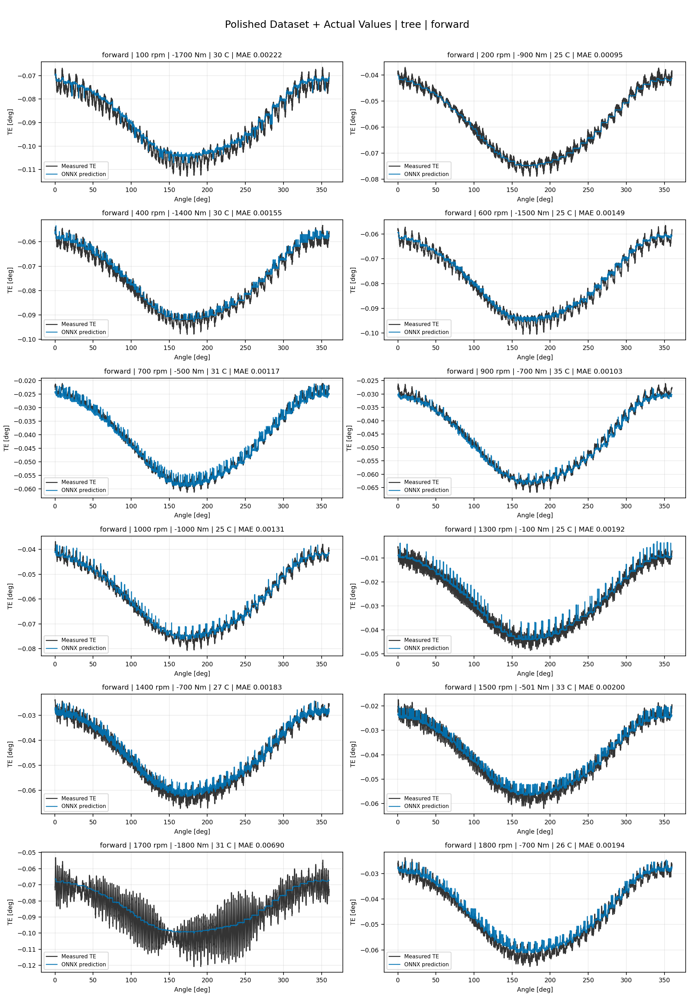
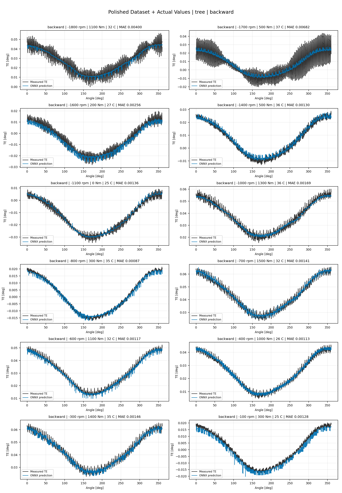
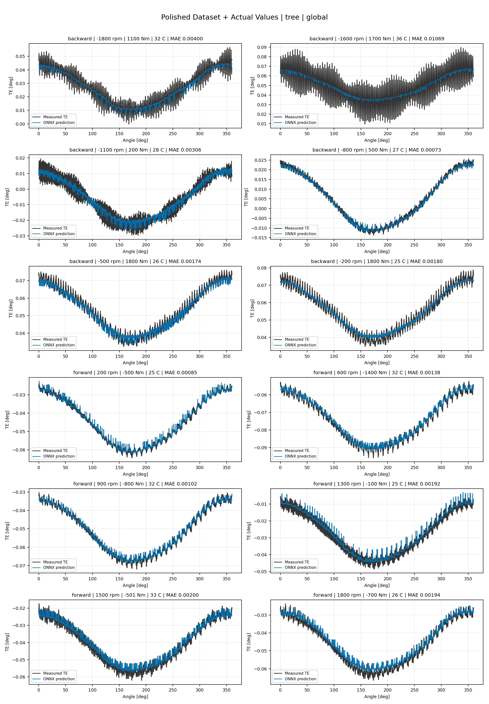

# TE Curve Verification Pipeline Familywise ONNX Report - tree

## Overview

This report evaluates exported ONNX models from the dataset input-mode
retraining program. Each dataset/input-mode section uses dataset-matched
held-out test curves and lists the exact model artifacts loaded from
`models/`.

The report is diagnostic and family-specific. It does not replace an
official multi-index model-promotion decision.

## Output Artifacts

- output directory: `output/validation_checks/track2_familywise_onnx_report/tree/2026-07-07-14-58-29__track2_tree_familywise_onnx_report`;
- summary YAML: `output/validation_checks/track2_familywise_onnx_report/tree/2026-07-07-14-58-29__track2_tree_familywise_onnx_report/track2_familywise_onnx_report_summary.yaml`;
- model inventory CSV: `output/validation_checks/track2_familywise_onnx_report/tree/2026-07-07-14-58-29__track2_tree_familywise_onnx_report/model_inventory.csv`;
- per-curve metrics CSV: `output/validation_checks/track2_familywise_onnx_report/tree/2026-07-07-14-58-29__track2_tree_familywise_onnx_report/per_curve_metrics.csv`.

## Simplified Dataset + Setpoints

- dataset: `simplified_dataset`;
- input mode: `setpoints`;
- evaluated family: `tree`;
- dataset root: `data/simplified_dataset`.

### Models Used

| Surface | Run Name | Run Instance | Dataset Schema |
| --- | --- | --- | --- |
| forward | `te_tree_fw__simplified_setpoints` | `2026-07-07-02-31-39__te_tree_fw__simplified_setpoints` | `simplified_curve_v1` |
| backward | `te_tree_bw__simplified_setpoints` | `2026-07-07-02-33-43__te_tree_bw__simplified_setpoints` | `simplified_curve_v1` |
| global | `te_tree_global__simplified_setpoints` | `2026-07-07-02-29-36__te_tree_global__simplified_setpoints` | `simplified_curve_v1` |

Exact model paths:

| Surface | ONNX Model Path | Python Model Path |
| --- | --- | --- |
| forward | `models/simplified_dataset/setpoints/tree/forward/onnx/model.onnx` | `models/simplified_dataset/setpoints/tree/forward/python/tree_model.pkl` |
| backward | `models/simplified_dataset/setpoints/tree/backward/onnx/model.onnx` | `models/simplified_dataset/setpoints/tree/backward/python/tree_model.pkl` |
| global | `models/simplified_dataset/setpoints/tree/global/onnx/model.onnx` | `models/simplified_dataset/setpoints/tree/global/python/tree_model.pkl` |

### Aggregate Metrics

| Surface | Curves | MAE [deg] | RMSE [deg] | Mean Error [%] | P95 Error [%] |
| --- | ---: | ---: | ---: | ---: | ---: |
| forward | 97 | 0.003065 | 0.003435 | 6.740 | 11.934 |
| backward | 97 | 0.003345 | 0.003754 | 7.249 | 13.745 |
| global | 194 | 0.003205 | 0.003594 | 6.995 | 13.161 |

Offset And Shape Metrics:

| Surface | Signed Offset [deg] | Absolute Offset [deg] | Centered MAE [deg] | P2P Error [deg] |
| --- | ---: | ---: | ---: | ---: |
| forward | 0.000057 | 0.002559 | 0.001521 | 0.009543 |
| backward | 0.000218 | 0.002629 | 0.001776 | 0.009349 |
| global | 0.000138 | 0.002594 | 0.001649 | 0.009446 |

### Forward 12-Curve Page

### Backward 12-Curve Page

### Global 12-Curve Page

## Polished Dataset + Setpoints

- dataset: `polished_dataset`;
- input mode: `setpoints`;
- evaluated family: `tree`;
- dataset root: `data/polished_dataset`.

### Models Used

| Surface | Run Name | Run Instance | Dataset Schema |
| --- | --- | --- | --- |
| forward | `te_tree_fw__polished_setpoints` | `2026-07-07-09-34-40__te_tree_fw__polished_setpoints` | `polished_setpoint_curve_v1` |
| backward | `te_tree_bw__polished_setpoints` | `2026-07-07-09-37-16__te_tree_bw__polished_setpoints` | `polished_setpoint_curve_v1` |
| global | `te_tree_global__polished_setpoints` | `2026-07-07-09-31-48__te_tree_global__polished_setpoints` | `polished_setpoint_curve_v1` |

Exact model paths:

| Surface | ONNX Model Path | Python Model Path |
| --- | --- | --- |
| forward | `models/polished_dataset/setpoints/tree/forward/onnx/model.onnx` | `models/polished_dataset/setpoints/tree/forward/python/tree_model.pkl` |
| backward | `models/polished_dataset/setpoints/tree/backward/onnx/model.onnx` | `models/polished_dataset/setpoints/tree/backward/python/tree_model.pkl` |
| global | `models/polished_dataset/setpoints/tree/global/onnx/model.onnx` | `models/polished_dataset/setpoints/tree/global/python/tree_model.pkl` |

### Aggregate Metrics

| Surface | Curves | MAE [deg] | RMSE [deg] | Mean Error [%] | P95 Error [%] |
| --- | ---: | ---: | ---: | ---: | ---: |
| forward | 100 | 0.002098 | 0.002536 | 4.314 | 8.754 |
| backward | 94 | 0.002684 | 0.003182 | 4.716 | 10.570 |
| global | 194 | 0.002382 | 0.002849 | 4.509 | 10.152 |

Offset And Shape Metrics:

| Surface | Signed Offset [deg] | Absolute Offset [deg] | Centered MAE [deg] | P2P Error [deg] |
| --- | ---: | ---: | ---: | ---: |
| forward | 0.000114 | 0.000909 | 0.001814 | 0.010853 |
| backward | 0.000289 | 0.000965 | 0.002319 | 0.012320 |
| global | 0.000199 | 0.000936 | 0.002059 | 0.011564 |

### Forward 12-Curve Page

### Backward 12-Curve Page

### Global 12-Curve Page

## Polished Dataset + Actual Values

- dataset: `polished_dataset`;
- input mode: `actual_values`;
- evaluated family: `tree`;
- dataset root: `data/polished_dataset`.

### Models Used

| Surface | Run Name | Run Instance | Dataset Schema |
| --- | --- | --- | --- |
| forward | `te_tree_fw__polished_actual_values` | `2026-07-07-09-55-31__te_tree_fw__polished_actual_values` | `polished_point_v1` |
| backward | `te_tree_bw__polished_actual_values` | `2026-07-07-09-58-04__te_tree_bw__polished_actual_values` | `polished_point_v1` |
| global | `te_tree_global__polished_actual_values` | `2026-07-07-09-52-50__te_tree_global__polished_actual_values` | `polished_point_v1` |

Exact model paths:

| Surface | ONNX Model Path | Python Model Path |
| --- | --- | --- |
| forward | `models/polished_dataset/actual_values/tree/forward/onnx/model.onnx` | `models/polished_dataset/actual_values/tree/forward/python/tree_model.pkl` |
| backward | `models/polished_dataset/actual_values/tree/backward/onnx/model.onnx` | `models/polished_dataset/actual_values/tree/backward/python/tree_model.pkl` |
| global | `models/polished_dataset/actual_values/tree/global/onnx/model.onnx` | `models/polished_dataset/actual_values/tree/global/python/tree_model.pkl` |

### Aggregate Metrics

| Surface | Curves | MAE [deg] | RMSE [deg] | Mean Error [%] | P95 Error [%] |
| --- | ---: | ---: | ---: | ---: | ---: |
| forward | 100 | 0.002120 | 0.002599 | 4.341 | 8.662 |
| backward | 94 | 0.002759 | 0.003293 | 4.935 | 10.731 |
| global | 194 | 0.002429 | 0.002936 | 4.629 | 9.989 |

Offset And Shape Metrics:

| Surface | Signed Offset [deg] | Absolute Offset [deg] | Centered MAE [deg] | P2P Error [deg] |
| --- | ---: | ---: | ---: | ---: |
| forward | 0.000188 | 0.000799 | 0.001919 | 0.008543 |
| backward | 0.000294 | 0.000911 | 0.002406 | 0.009683 |
| global | 0.000240 | 0.000853 | 0.002155 | 0.009096 |

### Forward 12-Curve Page

### Backward 12-Curve Page

### Global 12-Curve Page

