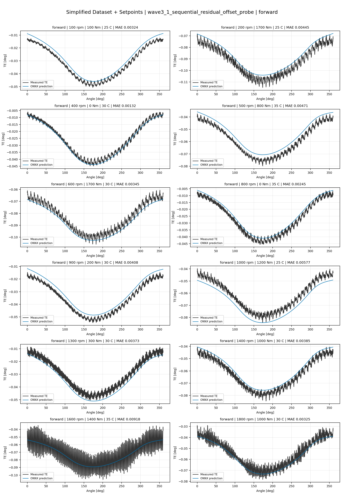
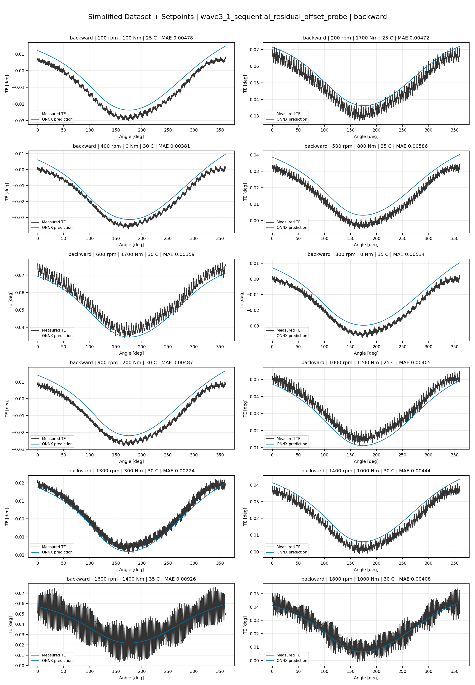
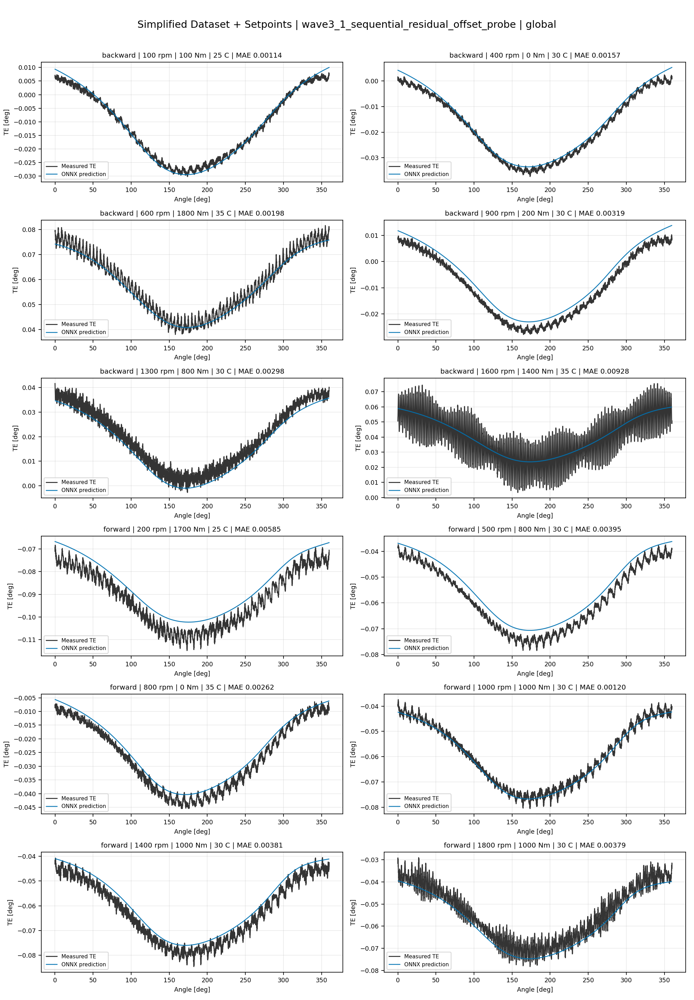
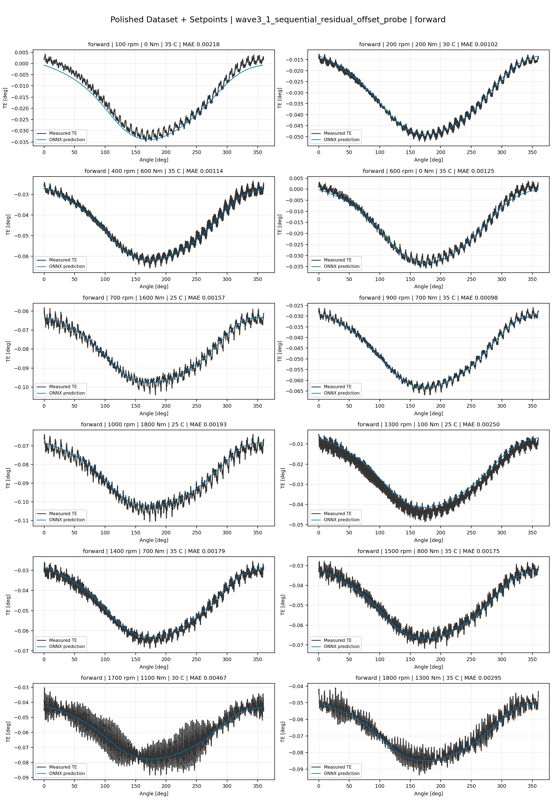
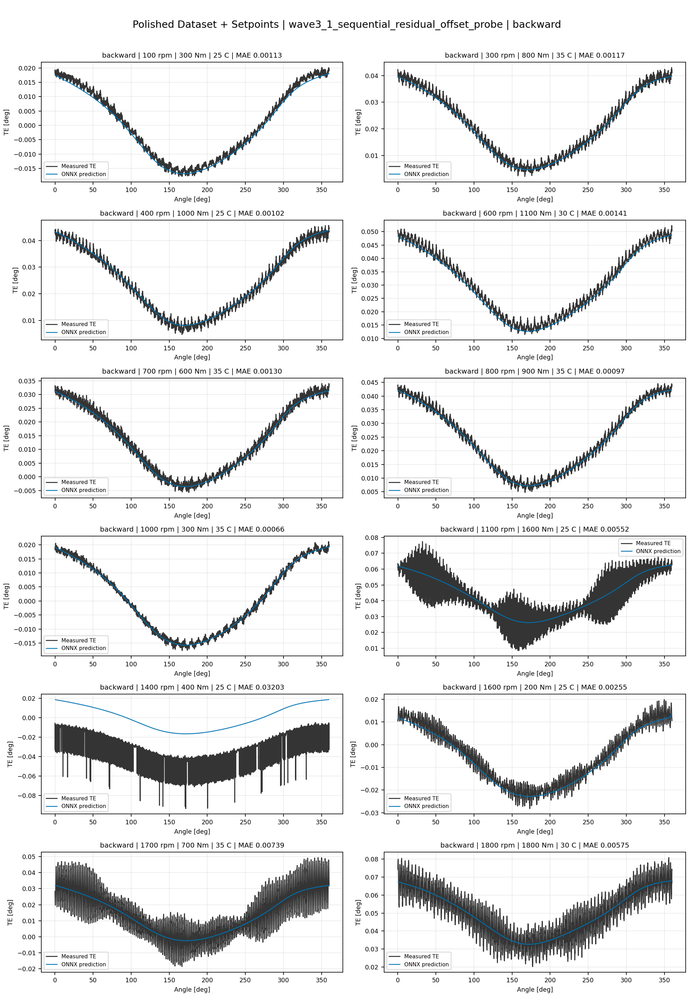
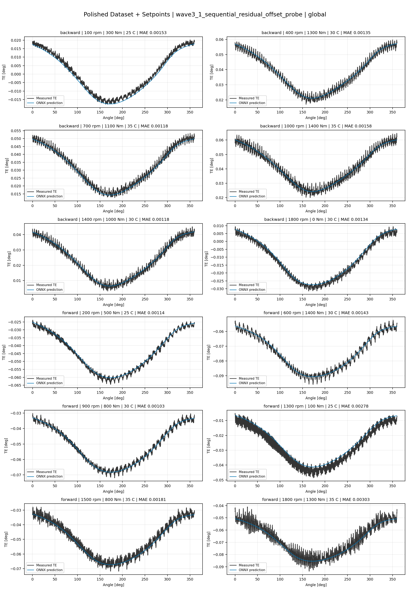
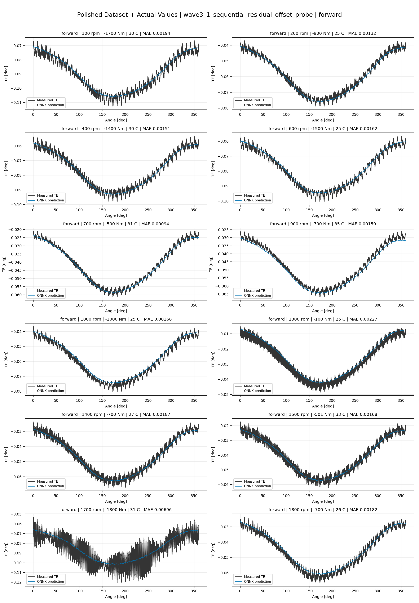
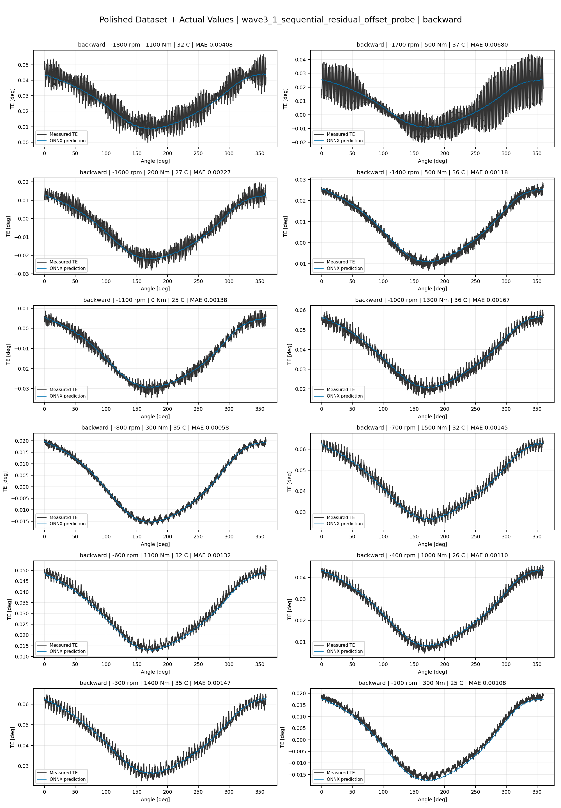
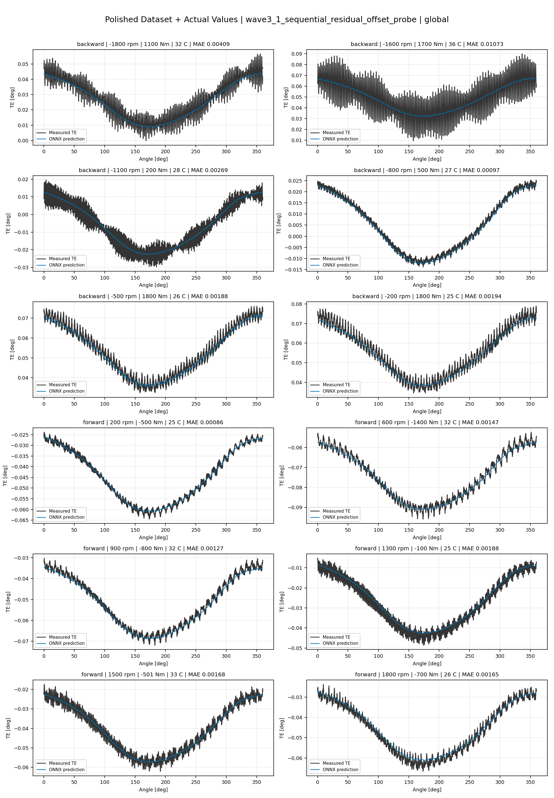

# TE Curve Verification Pipeline Familywise ONNX Report - wave3_1_sequential_residual_offset_probe

## Overview

This report evaluates exported ONNX models from the dataset input-mode
retraining program. Each dataset/input-mode section uses dataset-matched
held-out test curves and lists the exact model artifacts loaded from
`models/`.

Rank-3 temporal ONNX exports are evaluated on the sequence-window test
contract stored in each `training_config.snapshot.yaml`, including
`sequence_length`, `sequence_stride`, `sequence_target_position`, and
`maximum_sequences_per_curve`.
The collage pages keep the measured TE trace at the original full-curve
resolution; temporal ONNX predictions are overlaid at the evaluated
sequence-target angles.

The report is diagnostic and family-specific. It does not replace an
official multi-index model-promotion decision.

## Output Artifacts

- output directory: `output/validation_checks/track2_familywise_onnx_report/wave3_1_sequential_residual_offset_probe/2026-07-10-13-15-16__track2_wave3_1_sequential_residual_offset_probe_familywise_onnx_report`;
- summary YAML: `output/validation_checks/track2_familywise_onnx_report/wave3_1_sequential_residual_offset_probe/2026-07-10-13-15-16__track2_wave3_1_sequential_residual_offset_probe_familywise_onnx_report/track2_familywise_onnx_report_summary.yaml`;
- model inventory CSV: `output/validation_checks/track2_familywise_onnx_report/wave3_1_sequential_residual_offset_probe/2026-07-10-13-15-16__track2_wave3_1_sequential_residual_offset_probe_familywise_onnx_report/model_inventory.csv`;
- per-curve metrics CSV: `output/validation_checks/track2_familywise_onnx_report/wave3_1_sequential_residual_offset_probe/2026-07-10-13-15-16__track2_wave3_1_sequential_residual_offset_probe_familywise_onnx_report/per_curve_metrics.csv`.

## Simplified Dataset + Setpoints

- dataset: `simplified_dataset`;
- input mode: `setpoints`;
- evaluated family: `wave3_1_sequential_residual_offset_probe`;
- dataset root: `data/simplified_dataset`.

### Models Used

| Surface | Run Name | Run Instance | Dataset Schema |
| --- | --- | --- | --- |
| forward | `te_wave3_1_sequential_residual_offset_probe_fw__simplified_setpoints` | `2026-07-10-08-24-57__te_wave3_1_sequential_residual_offset_probe_fw__simplified_setpoints` | `simplified_curve_v1` |
| backward | `te_wave3_1_sequential_residual_offset_probe_bw__simplified_setpoints` | `2026-07-10-08-46-24__te_wave3_1_sequential_residual_offset_probe_bw__simplified_setpoints` | `simplified_curve_v1` |
| global | `te_wave3_1_sequential_residual_offset_probe_global__simplified_setpoints` | `2026-07-10-08-11-44__te_wave3_1_sequential_residual_offset_probe_global__simplified_setpoints` | `simplified_curve_v1` |

Exact model paths:

| Surface | ONNX Model Path | Python Model Path |
| --- | --- | --- |
| forward | `models/simplified_dataset/setpoints/exported/wave3_1_sequential_residual_offset_probe/forward/2026-07-10-08-24-57__te_wave3_1_sequential_residual_offset_probe_fw__simplified_setpoints/onnx/model.onnx` | `models/simplified_dataset/setpoints/exported/wave3_1_sequential_residual_offset_probe/forward/2026-07-10-08-24-57__te_wave3_1_sequential_residual_offset_probe_fw__simplified_setpoints/python/sequential_residual_offset_probe-epoch=138-val_mae=0.00365466.ckpt` |
| backward | `models/simplified_dataset/setpoints/exported/wave3_1_sequential_residual_offset_probe/backward/2026-07-10-08-46-24__te_wave3_1_sequential_residual_offset_probe_bw__simplified_setpoints/onnx/model.onnx` | `models/simplified_dataset/setpoints/exported/wave3_1_sequential_residual_offset_probe/backward/2026-07-10-08-46-24__te_wave3_1_sequential_residual_offset_probe_bw__simplified_setpoints/python/sequential_residual_offset_probe-epoch=098-val_mae=0.00372763.ckpt` |
| global | `models/simplified_dataset/setpoints/exported/wave3_1_sequential_residual_offset_probe/global/2026-07-10-08-11-44__te_wave3_1_sequential_residual_offset_probe_global__simplified_setpoints/onnx/model.onnx` | `models/simplified_dataset/setpoints/exported/wave3_1_sequential_residual_offset_probe/global/2026-07-10-08-11-44__te_wave3_1_sequential_residual_offset_probe_global__simplified_setpoints/python/sequential_residual_offset_probe-epoch=095-val_mae=0.00372731.ckpt` |

### Aggregate Metrics

| Surface | Curves | MAE [deg] | RMSE [deg] | Mean Error [%] | P95 Error [%] |
| --- | ---: | ---: | ---: | ---: | ---: |
| forward | 97 | 0.003452 | 0.003882 | 8.069 | 12.695 |
| backward | 97 | 0.003721 | 0.004171 | 8.657 | 15.404 |
| global | 194 | 0.003534 | 0.003958 | 8.239 | 15.027 |

Offset And Shape Metrics:

| Surface | Signed Offset [deg] | Absolute Offset [deg] | Centered MAE [deg] | P2P Error [deg] |
| --- | ---: | ---: | ---: | ---: |
| forward | -0.000521 | 0.002947 | 0.001712 | 0.006873 |
| backward | 0.000602 | 0.002981 | 0.001927 | 0.004967 |
| global | 0.000430 | 0.002856 | 0.001796 | 0.006402 |

### Forward 12-Curve Page

### Backward 12-Curve Page

### Global 12-Curve Page

## Polished Dataset + Setpoints

- dataset: `polished_dataset`;
- input mode: `setpoints`;
- evaluated family: `wave3_1_sequential_residual_offset_probe`;
- dataset root: `data/polished_dataset`.

### Models Used

| Surface | Run Name | Run Instance | Dataset Schema |
| --- | --- | --- | --- |
| forward | `te_wave3_1_sequential_residual_offset_probe_fw__polished_setpoints` | `2026-07-10-09-39-31__te_wave3_1_sequential_residual_offset_probe_fw__polished_setpoints` | `polished_setpoint_curve_v1` |
| backward | `te_wave3_1_sequential_residual_offset_probe_bw__polished_setpoints` | `2026-07-10-10-05-23__te_wave3_1_sequential_residual_offset_probe_bw__polished_setpoints` | `polished_setpoint_curve_v1` |
| global | `te_wave3_1_sequential_residual_offset_probe_global__polished_setpoints` | `2026-07-10-09-12-14__te_wave3_1_sequential_residual_offset_probe_global__polished_setpoints` | `polished_setpoint_curve_v1` |

Exact model paths:

| Surface | ONNX Model Path | Python Model Path |
| --- | --- | --- |
| forward | `models/polished_dataset/setpoints/exported/wave3_1_sequential_residual_offset_probe/forward/2026-07-10-09-39-31__te_wave3_1_sequential_residual_offset_probe_fw__polished_setpoints/onnx/model.onnx` | `models/polished_dataset/setpoints/exported/wave3_1_sequential_residual_offset_probe/forward/2026-07-10-09-39-31__te_wave3_1_sequential_residual_offset_probe_fw__polished_setpoints/python/sequential_residual_offset_probe-epoch=111-val_mae=0.00217538.ckpt` |
| backward | `models/polished_dataset/setpoints/exported/wave3_1_sequential_residual_offset_probe/backward/2026-07-10-10-05-23__te_wave3_1_sequential_residual_offset_probe_bw__polished_setpoints/onnx/model.onnx` | `models/polished_dataset/setpoints/exported/wave3_1_sequential_residual_offset_probe/backward/2026-07-10-10-05-23__te_wave3_1_sequential_residual_offset_probe_bw__polished_setpoints/python/sequential_residual_offset_probe-epoch=137-val_mae=0.00216898.ckpt` |
| global | `models/polished_dataset/setpoints/exported/wave3_1_sequential_residual_offset_probe/global/2026-07-10-09-12-14__te_wave3_1_sequential_residual_offset_probe_global__polished_setpoints/onnx/model.onnx` | `models/polished_dataset/setpoints/exported/wave3_1_sequential_residual_offset_probe/global/2026-07-10-09-12-14__te_wave3_1_sequential_residual_offset_probe_global__polished_setpoints/python/sequential_residual_offset_probe-epoch=155-val_mae=0.00218350.ckpt` |

### Aggregate Metrics

| Surface | Curves | MAE [deg] | RMSE [deg] | Mean Error [%] | P95 Error [%] |
| --- | ---: | ---: | ---: | ---: | ---: |
| forward | 100 | 0.002220 | 0.002677 | 4.920 | 9.784 |
| backward | 94 | 0.002720 | 0.003226 | 5.054 | 11.312 |
| global | 194 | 0.002475 | 0.002953 | 5.019 | 11.292 |

Offset And Shape Metrics:

| Surface | Signed Offset [deg] | Absolute Offset [deg] | Centered MAE [deg] | P2P Error [deg] |
| --- | ---: | ---: | ---: | ---: |
| forward | 0.000085 | 0.000975 | 0.001905 | 0.008076 |
| backward | 0.000214 | 0.000961 | 0.002361 | 0.008899 |
| global | 0.000176 | 0.001001 | 0.002126 | 0.008351 |

### Forward 12-Curve Page

### Backward 12-Curve Page

### Global 12-Curve Page

## Polished Dataset + Actual Values

- dataset: `polished_dataset`;
- input mode: `actual_values`;
- evaluated family: `wave3_1_sequential_residual_offset_probe`;
- dataset root: `data/polished_dataset`.

### Models Used

| Surface | Run Name | Run Instance | Dataset Schema |
| --- | --- | --- | --- |
| forward | `te_wave3_1_sequential_residual_offset_probe_fw__polished_actual_values` | `2026-07-10-11-09-33__te_wave3_1_sequential_residual_offset_probe_fw__polished_actual_values` | `polished_point_v1` |
| backward | `te_wave3_1_sequential_residual_offset_probe_bw__polished_actual_values` | `2026-07-10-11-35-18__te_wave3_1_sequential_residual_offset_probe_bw__polished_actual_values` | `polished_point_v1` |
| global | `te_wave3_1_sequential_residual_offset_probe_global__polished_actual_values` | `2026-07-10-10-48-41__te_wave3_1_sequential_residual_offset_probe_global__polished_actual_values` | `polished_point_v1` |

Exact model paths:

| Surface | ONNX Model Path | Python Model Path |
| --- | --- | --- |
| forward | `models/polished_dataset/actual_values/exported/wave3_1_sequential_residual_offset_probe/forward/2026-07-10-11-09-33__te_wave3_1_sequential_residual_offset_probe_fw__polished_actual_values/onnx/model.onnx` | `models/polished_dataset/actual_values/exported/wave3_1_sequential_residual_offset_probe/forward/2026-07-10-11-09-33__te_wave3_1_sequential_residual_offset_probe_fw__polished_actual_values/python/sequential_residual_offset_probe-epoch=097-val_mae=0.00219045.ckpt` |
| backward | `models/polished_dataset/actual_values/exported/wave3_1_sequential_residual_offset_probe/backward/2026-07-10-11-35-18__te_wave3_1_sequential_residual_offset_probe_bw__polished_actual_values/onnx/model.onnx` | `models/polished_dataset/actual_values/exported/wave3_1_sequential_residual_offset_probe/backward/2026-07-10-11-35-18__te_wave3_1_sequential_residual_offset_probe_bw__polished_actual_values/python/sequential_residual_offset_probe-epoch=197-val_mae=0.00215382.ckpt` |
| global | `models/polished_dataset/actual_values/exported/wave3_1_sequential_residual_offset_probe/global/2026-07-10-10-48-41__te_wave3_1_sequential_residual_offset_probe_global__polished_actual_values/onnx/model.onnx` | `models/polished_dataset/actual_values/exported/wave3_1_sequential_residual_offset_probe/global/2026-07-10-10-48-41__te_wave3_1_sequential_residual_offset_probe_global__polished_actual_values/python/sequential_residual_offset_probe-epoch=077-val_mae=0.00220916.ckpt` |

### Aggregate Metrics

| Surface | Curves | MAE [deg] | RMSE [deg] | Mean Error [%] | P95 Error [%] |
| --- | ---: | ---: | ---: | ---: | ---: |
| forward | 100 | 0.002241 | 0.002700 | 4.973 | 11.550 |
| backward | 94 | 0.002429 | 0.002964 | 4.709 | 11.070 |
| global | 194 | 0.002379 | 0.002870 | 4.940 | 11.359 |

Offset And Shape Metrics:

| Surface | Signed Offset [deg] | Absolute Offset [deg] | Centered MAE [deg] | P2P Error [deg] |
| --- | ---: | ---: | ---: | ---: |
| forward | -0.000320 | 0.001010 | 0.001914 | 0.007983 |
| backward | 0.000019 | 0.000598 | 0.002347 | 0.008197 |
| global | -0.000324 | 0.000856 | 0.002141 | 0.008432 |

### Forward 12-Curve Page

### Backward 12-Curve Page

### Global 12-Curve Page

