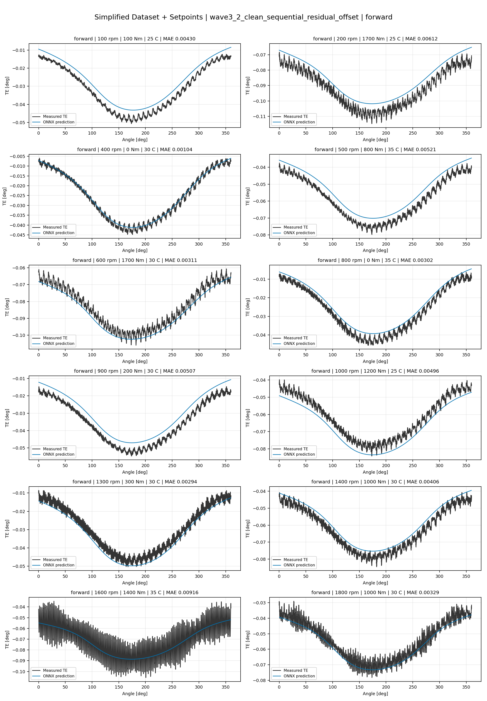
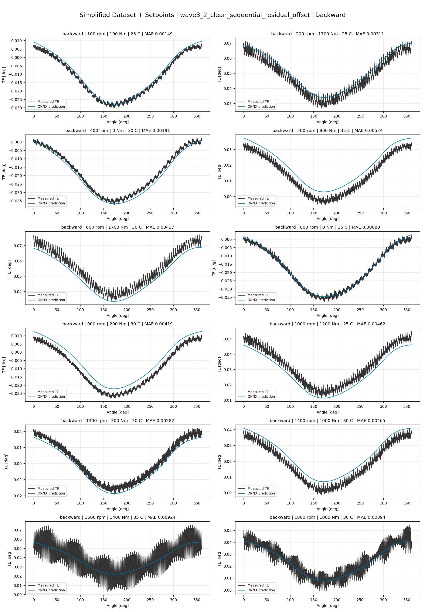
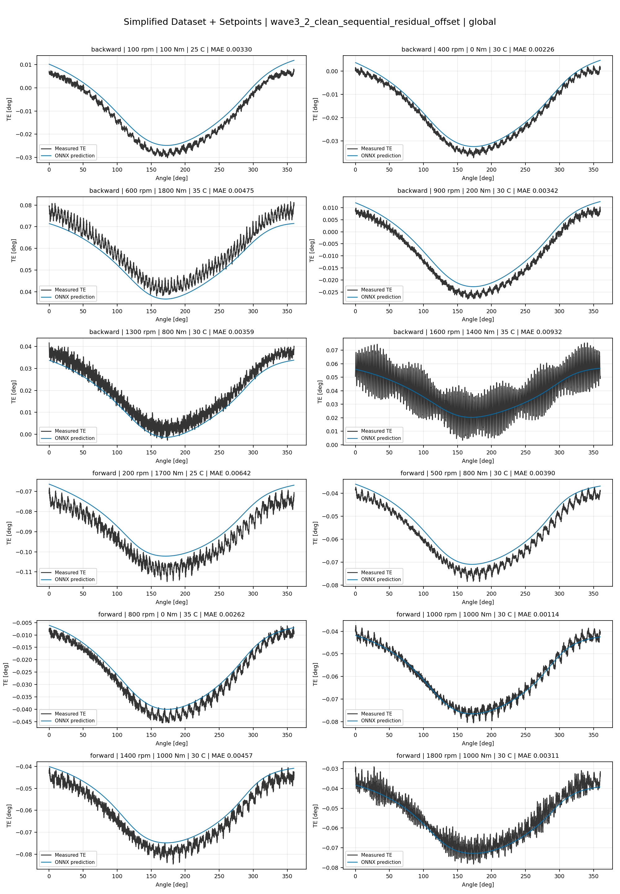
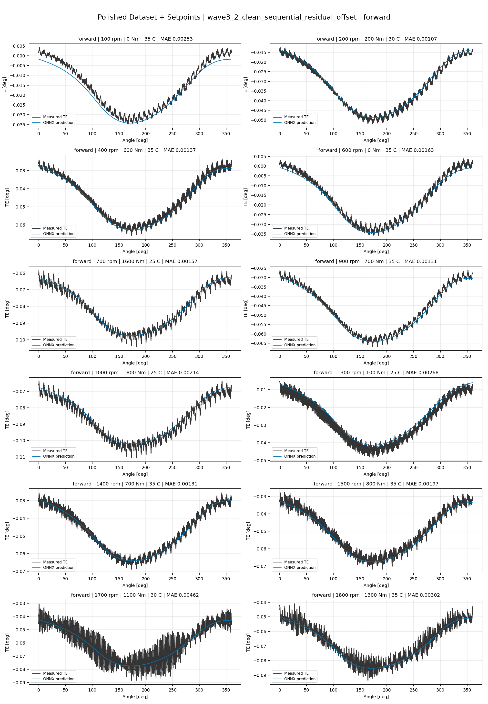
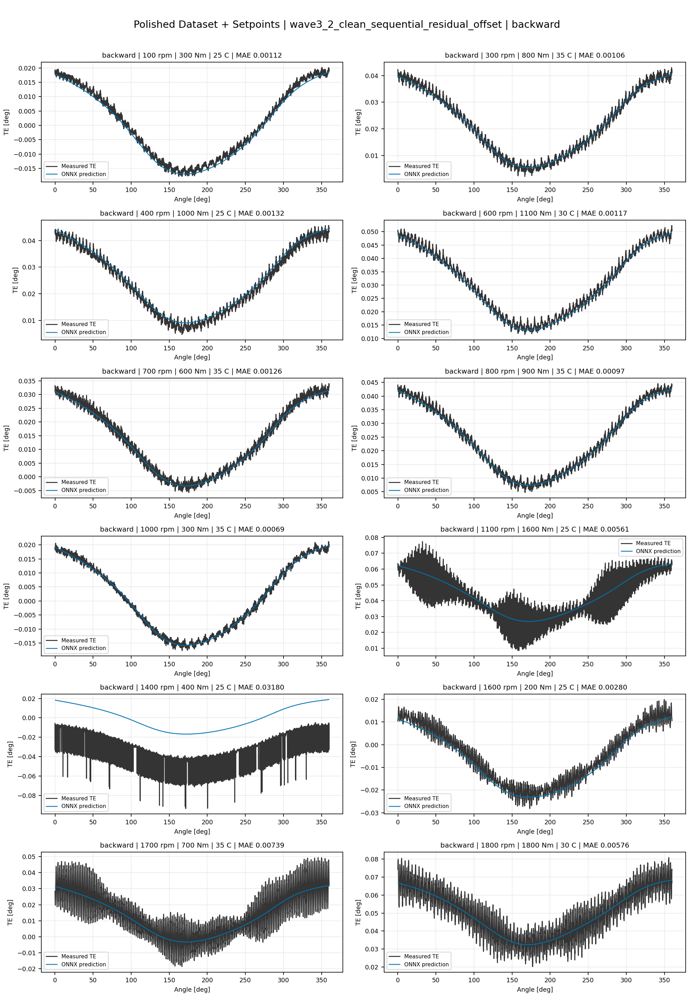
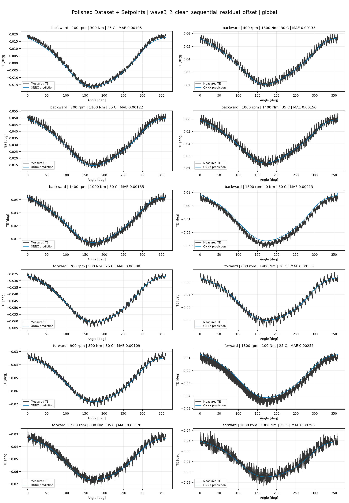
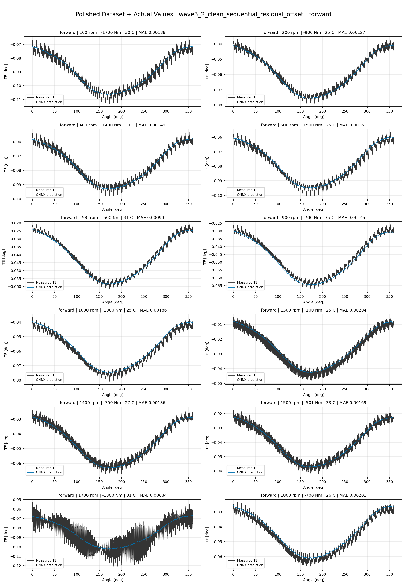
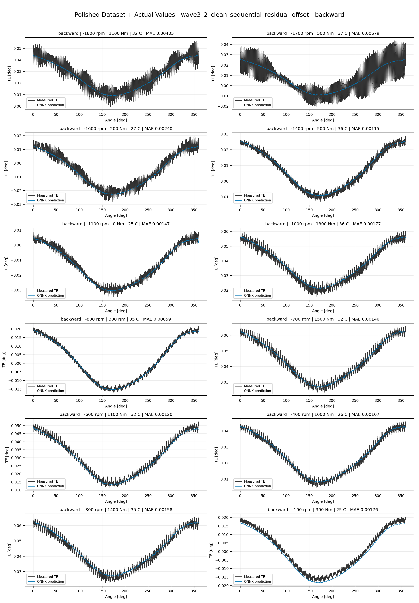
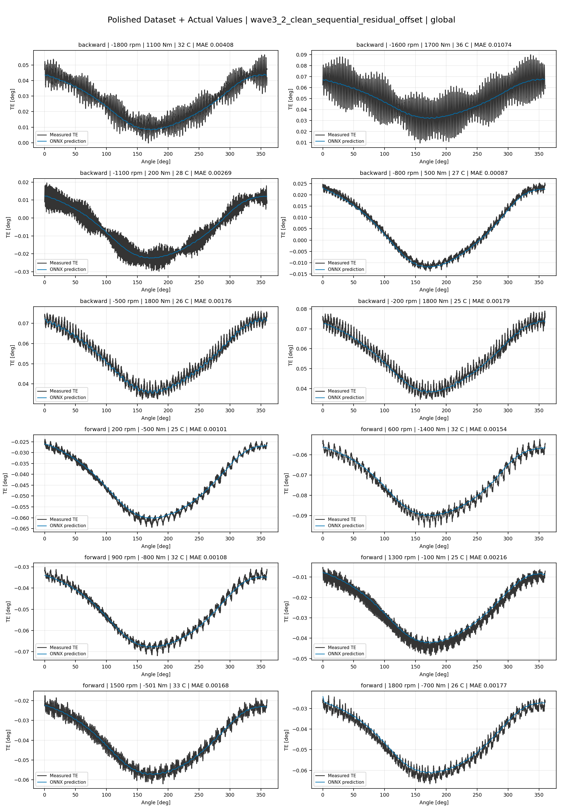

# TE Curve Verification Pipeline Familywise ONNX Report - wave3_2_clean_sequential_residual_offset

## Overview

This report evaluates exported ONNX models from the dataset input-mode
retraining program. Each dataset/input-mode section uses dataset-matched
held-out test curves and lists the exact model artifacts loaded from
`models/`.

Rank-3 temporal ONNX exports are evaluated on the sequence-window test
contract stored in each `training_config.snapshot.yaml`, including
`sequence_length`, `sequence_stride`, `sequence_target_position`, and
`maximum_sequences_per_curve`.
The collage pages keep the measured TE trace at the original full-curve
resolution; temporal ONNX predictions are overlaid at the evaluated
sequence-target angles.

The report is diagnostic and family-specific. It does not replace an
official multi-index model-promotion decision.

## Output Artifacts

- output directory: `output/validation_checks/track2_familywise_onnx_report/wave3_2_clean_sequential_residual_offset/2026-07-11-10-22-05__track2_wave3_2_clean_sequential_residual_offset_familywise_onnx_report`;
- summary YAML: `output/validation_checks/track2_familywise_onnx_report/wave3_2_clean_sequential_residual_offset/2026-07-11-10-22-05__track2_wave3_2_clean_sequential_residual_offset_familywise_onnx_report/track2_familywise_onnx_report_summary.yaml`;
- model inventory CSV: `output/validation_checks/track2_familywise_onnx_report/wave3_2_clean_sequential_residual_offset/2026-07-11-10-22-05__track2_wave3_2_clean_sequential_residual_offset_familywise_onnx_report/model_inventory.csv`;
- per-curve metrics CSV: `output/validation_checks/track2_familywise_onnx_report/wave3_2_clean_sequential_residual_offset/2026-07-11-10-22-05__track2_wave3_2_clean_sequential_residual_offset_familywise_onnx_report/per_curve_metrics.csv`.

## Simplified Dataset + Setpoints

- dataset: `simplified_dataset`;
- input mode: `setpoints`;
- evaluated family: `wave3_2_clean_sequential_residual_offset`;
- dataset root: `data/simplified_dataset`.

### Models Used

| Surface | Run Name | Run Instance | Dataset Schema |
| --- | --- | --- | --- |
| forward | `te_wave3_2_clean_sequential_residual_offset_fw__simplified_setpoints` | `2026-07-10-12-54-53__te_wave3_2_clean_sequential_residual_offset_fw__simplified_setpoints` | `simplified_curve_v1` |
| backward | `te_wave3_2_clean_sequential_residual_offset_bw__simplified_setpoints` | `2026-07-10-13-09-01__te_wave3_2_clean_sequential_residual_offset_bw__simplified_setpoints` | `simplified_curve_v1` |
| global | `te_wave3_2_clean_sequential_residual_offset_global__simplified_setpoints` | `2026-07-10-12-38-46__te_wave3_2_clean_sequential_residual_offset_global__simplified_setpoints` | `simplified_curve_v1` |

Exact model paths:

| Surface | ONNX Model Path | Python Model Path |
| --- | --- | --- |
| forward | `models/simplified_dataset/setpoints/exported/wave3_2_clean_sequential_residual_offset/forward/2026-07-10-12-54-53__te_wave3_2_clean_sequential_residual_offset_fw__simplified_setpoints/onnx/model.onnx` | `models/simplified_dataset/setpoints/exported/wave3_2_clean_sequential_residual_offset/forward/2026-07-10-12-54-53__te_wave3_2_clean_sequential_residual_offset_fw__simplified_setpoints/python/sequential_residual_offset_probe-epoch=074-val_mae=0.00371625.ckpt` |
| backward | `models/simplified_dataset/setpoints/exported/wave3_2_clean_sequential_residual_offset/backward/2026-07-10-13-09-01__te_wave3_2_clean_sequential_residual_offset_bw__simplified_setpoints/onnx/model.onnx` | `models/simplified_dataset/setpoints/exported/wave3_2_clean_sequential_residual_offset/backward/2026-07-10-13-09-01__te_wave3_2_clean_sequential_residual_offset_bw__simplified_setpoints/python/sequential_residual_offset_probe-epoch=151-val_mae=0.00364800.ckpt` |
| global | `models/simplified_dataset/setpoints/exported/wave3_2_clean_sequential_residual_offset/global/2026-07-10-12-38-46__te_wave3_2_clean_sequential_residual_offset_global__simplified_setpoints/onnx/model.onnx` | `models/simplified_dataset/setpoints/exported/wave3_2_clean_sequential_residual_offset/global/2026-07-10-12-38-46__te_wave3_2_clean_sequential_residual_offset_global__simplified_setpoints/python/sequential_residual_offset_probe-epoch=110-val_mae=0.00370701.ckpt` |

### Aggregate Metrics

| Surface | Curves | MAE [deg] | RMSE [deg] | Mean Error [%] | P95 Error [%] |
| --- | ---: | ---: | ---: | ---: | ---: |
| forward | 97 | 0.003475 | 0.003912 | 8.132 | 13.778 |
| backward | 97 | 0.003577 | 0.004001 | 8.280 | 13.551 |
| global | 194 | 0.003636 | 0.004065 | 8.486 | 15.133 |

Offset And Shape Metrics:

| Surface | Signed Offset [deg] | Absolute Offset [deg] | Centered MAE [deg] | P2P Error [deg] |
| --- | ---: | ---: | ---: | ---: |
| forward | 0.000198 | 0.002938 | 0.001734 | 0.006182 |
| backward | -0.000108 | 0.002850 | 0.001851 | 0.007030 |
| global | 0.000415 | 0.003059 | 0.001788 | 0.007024 |

### Forward 12-Curve Page

### Backward 12-Curve Page

### Global 12-Curve Page

## Polished Dataset + Setpoints

- dataset: `polished_dataset`;
- input mode: `setpoints`;
- evaluated family: `wave3_2_clean_sequential_residual_offset`;
- dataset root: `data/polished_dataset`.

### Models Used

| Surface | Run Name | Run Instance | Dataset Schema |
| --- | --- | --- | --- |
| forward | `te_wave3_2_clean_sequential_residual_offset_fw__polished_setpoints` | `2026-07-10-14-12-44__te_wave3_2_clean_sequential_residual_offset_fw__polished_setpoints` | `polished_setpoint_curve_v1` |
| backward | `te_wave3_2_clean_sequential_residual_offset_bw__polished_setpoints` | `2026-07-10-14-35-10__te_wave3_2_clean_sequential_residual_offset_bw__polished_setpoints` | `polished_setpoint_curve_v1` |
| global | `te_wave3_2_clean_sequential_residual_offset_global__polished_setpoints` | `2026-07-10-13-46-46__te_wave3_2_clean_sequential_residual_offset_global__polished_setpoints` | `polished_setpoint_curve_v1` |

Exact model paths:

| Surface | ONNX Model Path | Python Model Path |
| --- | --- | --- |
| forward | `models/polished_dataset/setpoints/exported/wave3_2_clean_sequential_residual_offset/forward/2026-07-10-14-12-44__te_wave3_2_clean_sequential_residual_offset_fw__polished_setpoints/onnx/model.onnx` | `models/polished_dataset/setpoints/exported/wave3_2_clean_sequential_residual_offset/forward/2026-07-10-14-12-44__te_wave3_2_clean_sequential_residual_offset_fw__polished_setpoints/python/sequential_residual_offset_probe-epoch=092-val_mae=0.00219799.ckpt` |
| backward | `models/polished_dataset/setpoints/exported/wave3_2_clean_sequential_residual_offset/backward/2026-07-10-14-35-10__te_wave3_2_clean_sequential_residual_offset_bw__polished_setpoints/onnx/model.onnx` | `models/polished_dataset/setpoints/exported/wave3_2_clean_sequential_residual_offset/backward/2026-07-10-14-35-10__te_wave3_2_clean_sequential_residual_offset_bw__polished_setpoints/python/sequential_residual_offset_probe-epoch=089-val_mae=0.00218161.ckpt` |
| global | `models/polished_dataset/setpoints/exported/wave3_2_clean_sequential_residual_offset/global/2026-07-10-13-46-46__te_wave3_2_clean_sequential_residual_offset_global__polished_setpoints/onnx/model.onnx` | `models/polished_dataset/setpoints/exported/wave3_2_clean_sequential_residual_offset/global/2026-07-10-13-46-46__te_wave3_2_clean_sequential_residual_offset_global__polished_setpoints/python/sequential_residual_offset_probe-epoch=128-val_mae=0.00217355.ckpt` |

### Aggregate Metrics

| Surface | Curves | MAE [deg] | RMSE [deg] | Mean Error [%] | P95 Error [%] |
| --- | ---: | ---: | ---: | ---: | ---: |
| forward | 100 | 0.002253 | 0.002715 | 5.000 | 10.589 |
| backward | 94 | 0.002729 | 0.003236 | 5.078 | 11.315 |
| global | 194 | 0.002454 | 0.002944 | 4.962 | 11.305 |

Offset And Shape Metrics:

| Surface | Signed Offset [deg] | Absolute Offset [deg] | Centered MAE [deg] | P2P Error [deg] |
| --- | ---: | ---: | ---: | ---: |
| forward | 0.000029 | 0.001055 | 0.001911 | 0.008038 |
| backward | 0.000213 | 0.001004 | 0.002372 | 0.008659 |
| global | 0.000157 | 0.000977 | 0.002126 | 0.009069 |

### Forward 12-Curve Page

### Backward 12-Curve Page

### Global 12-Curve Page

## Polished Dataset + Actual Values

- dataset: `polished_dataset`;
- input mode: `actual_values`;
- evaluated family: `wave3_2_clean_sequential_residual_offset`;
- dataset root: `data/polished_dataset`.

### Models Used

| Surface | Run Name | Run Instance | Dataset Schema |
| --- | --- | --- | --- |
| forward | `te_wave3_2_clean_sequential_residual_offset_fw__polished_actual_values` | `2026-07-10-22-06-08__te_wave3_2_clean_sequential_residual_offset_fw__polished_actual_values` | `polished_point_v1` |
| backward | `te_wave3_2_clean_sequential_residual_offset_bw__polished_actual_values` | `2026-07-10-22-37-04__te_wave3_2_clean_sequential_residual_offset_bw__polished_actual_values` | `polished_point_v1` |
| global | `te_wave3_2_clean_sequential_residual_offset_global__polished_actual_values` | `2026-07-10-21-34-26__te_wave3_2_clean_sequential_residual_offset_global__polished_actual_values` | `polished_point_v1` |

Exact model paths:

| Surface | ONNX Model Path | Python Model Path |
| --- | --- | --- |
| forward | `models/polished_dataset/actual_values/exported/wave3_2_clean_sequential_residual_offset/forward/2026-07-10-22-06-08__te_wave3_2_clean_sequential_residual_offset_fw__polished_actual_values/onnx/model.onnx` | `models/polished_dataset/actual_values/exported/wave3_2_clean_sequential_residual_offset/forward/2026-07-10-22-06-08__te_wave3_2_clean_sequential_residual_offset_fw__polished_actual_values/python/sequential_residual_offset_probe-epoch=153-val_mae=0.00216939.ckpt` |
| backward | `models/polished_dataset/actual_values/exported/wave3_2_clean_sequential_residual_offset/backward/2026-07-10-22-37-04__te_wave3_2_clean_sequential_residual_offset_bw__polished_actual_values/onnx/model.onnx` | `models/polished_dataset/actual_values/exported/wave3_2_clean_sequential_residual_offset/backward/2026-07-10-22-37-04__te_wave3_2_clean_sequential_residual_offset_bw__polished_actual_values/python/sequential_residual_offset_probe-epoch=127-val_mae=0.00219453.ckpt` |
| global | `models/polished_dataset/actual_values/exported/wave3_2_clean_sequential_residual_offset/global/2026-07-10-21-34-26__te_wave3_2_clean_sequential_residual_offset_global__polished_actual_values/onnx/model.onnx` | `models/polished_dataset/actual_values/exported/wave3_2_clean_sequential_residual_offset/global/2026-07-10-21-34-26__te_wave3_2_clean_sequential_residual_offset_global__polished_actual_values/python/sequential_residual_offset_probe-epoch=151-val_mae=0.00216362.ckpt` |

### Aggregate Metrics

| Surface | Curves | MAE [deg] | RMSE [deg] | Mean Error [%] | P95 Error [%] |
| --- | ---: | ---: | ---: | ---: | ---: |
| forward | 100 | 0.002138 | 0.002589 | 4.710 | 9.504 |
| backward | 94 | 0.002472 | 0.002980 | 4.774 | 11.059 |
| global | 194 | 0.002302 | 0.002798 | 4.758 | 10.511 |

Offset And Shape Metrics:

| Surface | Signed Offset [deg] | Absolute Offset [deg] | Centered MAE [deg] | P2P Error [deg] |
| --- | ---: | ---: | ---: | ---: |
| forward | -0.000221 | 0.000841 | 0.001911 | 0.007860 |
| backward | 0.000031 | 0.000552 | 0.002377 | 0.008688 |
| global | -0.000060 | 0.000777 | 0.002122 | 0.008373 |

### Forward 12-Curve Page

### Backward 12-Curve Page

### Global 12-Curve Page

