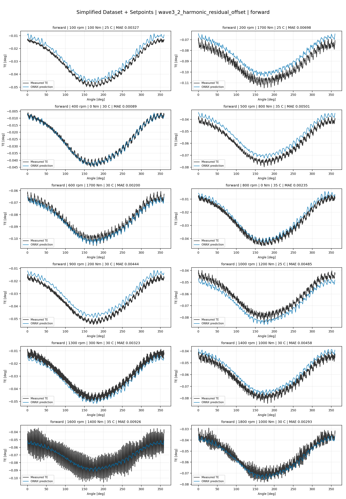
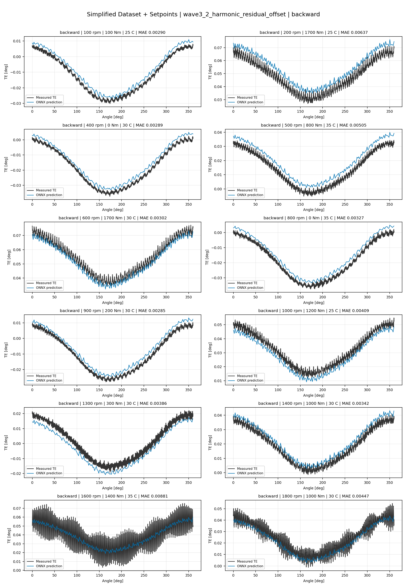
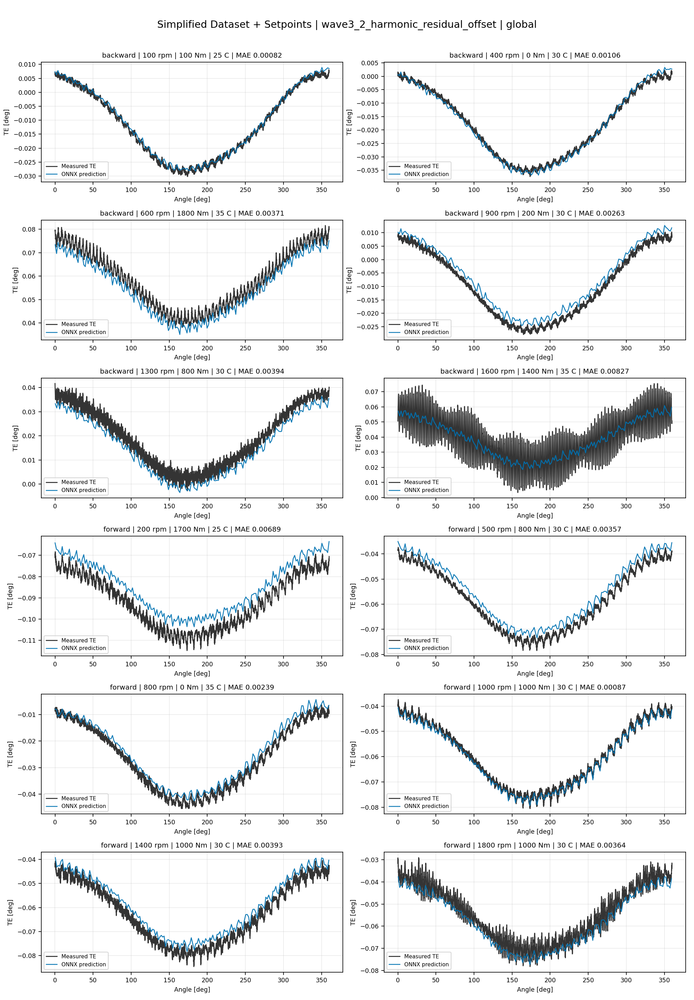
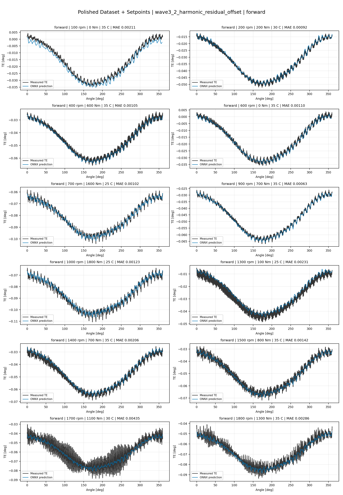
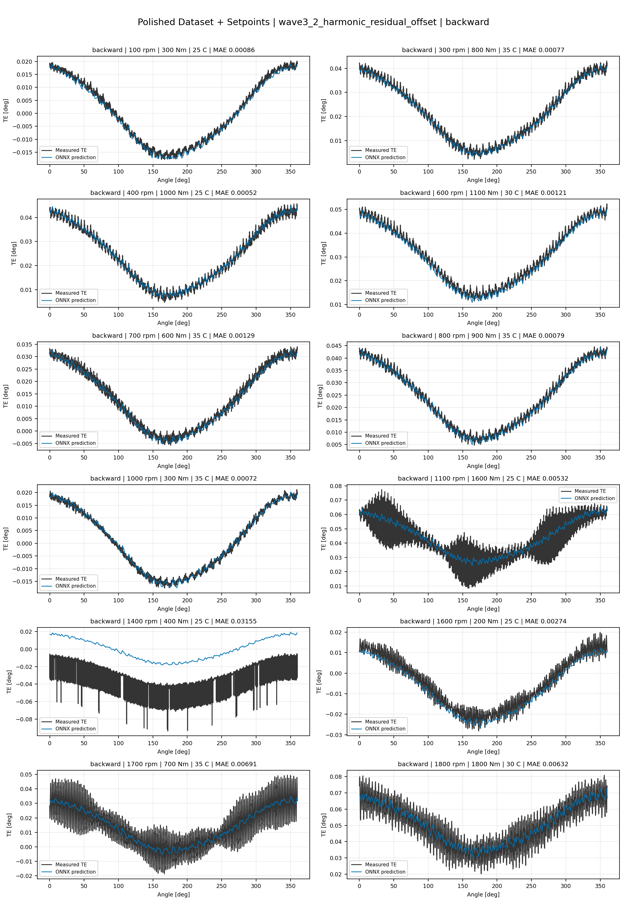
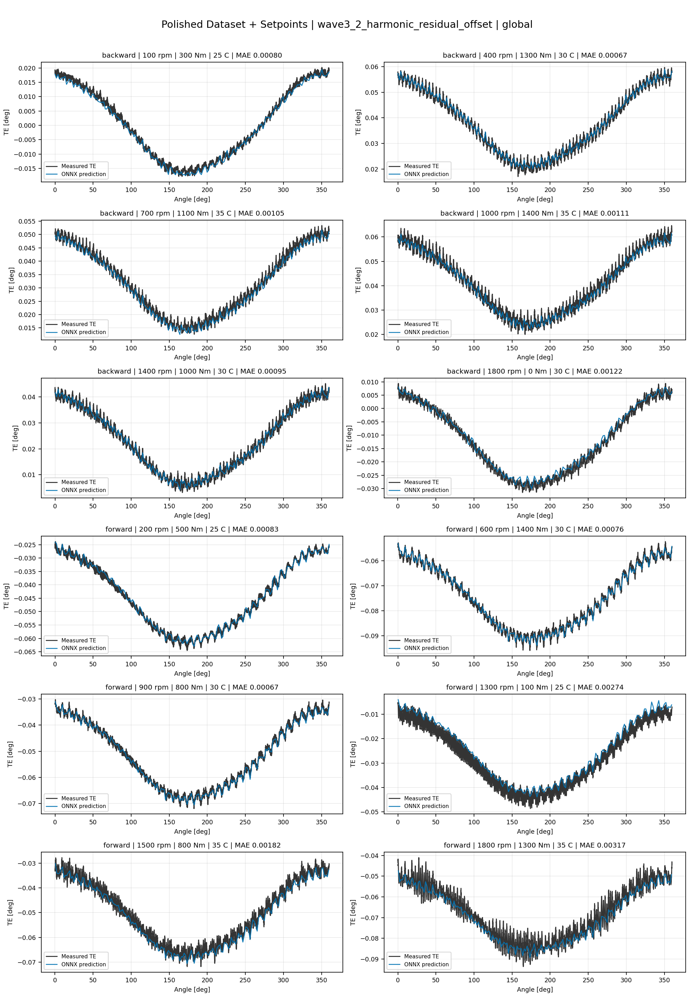
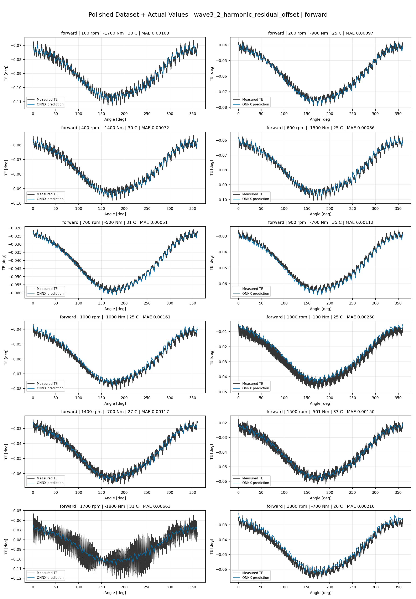
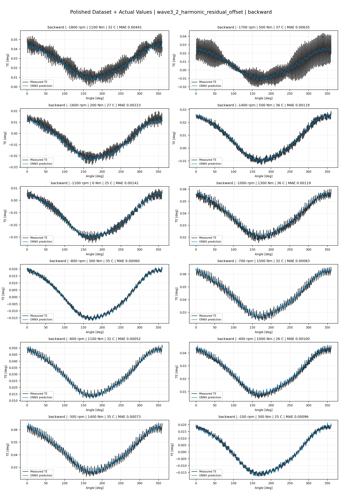
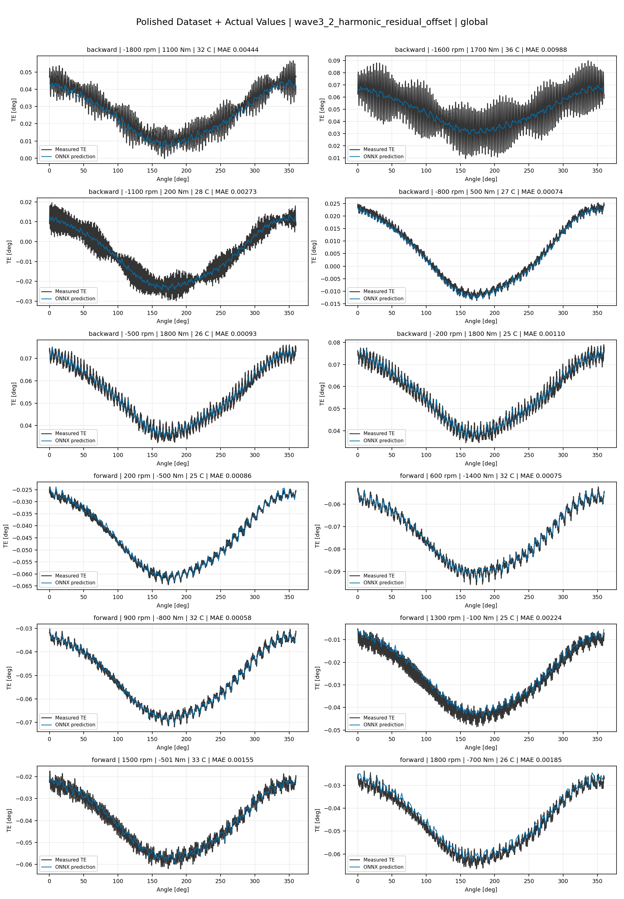

# TE Curve Verification Pipeline Familywise ONNX Report - wave3_2_harmonic_residual_offset

## Overview

This report evaluates exported ONNX models from the dataset input-mode
retraining program. Each dataset/input-mode section uses dataset-matched
held-out test curves and lists the exact model artifacts loaded from
`models/`.

Rank-3 temporal ONNX exports are evaluated on the sequence-window test
contract stored in each `training_config.snapshot.yaml`, including
`sequence_length`, `sequence_stride`, `sequence_target_position`, and
`maximum_sequences_per_curve`.
The collage pages keep the measured TE trace at the original full-curve
resolution; temporal ONNX predictions are overlaid at the evaluated
sequence-target angles.

The report is diagnostic and family-specific. It does not replace an
official multi-index model-promotion decision.

## Output Artifacts

- output directory: `output/validation_checks/track2_familywise_onnx_report/wave3_2_harmonic_residual_offset/2026-07-11-11-07-57__track2_wave3_2_harmonic_residual_offset_familywise_onnx_report`;
- summary YAML: `output/validation_checks/track2_familywise_onnx_report/wave3_2_harmonic_residual_offset/2026-07-11-11-07-57__track2_wave3_2_harmonic_residual_offset_familywise_onnx_report/track2_familywise_onnx_report_summary.yaml`;
- model inventory CSV: `output/validation_checks/track2_familywise_onnx_report/wave3_2_harmonic_residual_offset/2026-07-11-11-07-57__track2_wave3_2_harmonic_residual_offset_familywise_onnx_report/model_inventory.csv`;
- per-curve metrics CSV: `output/validation_checks/track2_familywise_onnx_report/wave3_2_harmonic_residual_offset/2026-07-11-11-07-57__track2_wave3_2_harmonic_residual_offset_familywise_onnx_report/per_curve_metrics.csv`.

## Simplified Dataset + Setpoints

- dataset: `simplified_dataset`;
- input mode: `setpoints`;
- evaluated family: `wave3_2_harmonic_residual_offset`;
- dataset root: `data/simplified_dataset`.

### Models Used

| Surface | Run Name | Run Instance | Dataset Schema |
| --- | --- | --- | --- |
| forward | `te_wave3_2_harmonic_residual_offset_fw__simplified_setpoints` | `2026-07-10-23-36-51__te_wave3_2_harmonic_residual_offset_fw__simplified_setpoints` | `simplified_curve_v1` |
| backward | `te_wave3_2_harmonic_residual_offset_bw__simplified_setpoints` | `2026-07-10-23-52-02__te_wave3_2_harmonic_residual_offset_bw__simplified_setpoints` | `simplified_curve_v1` |
| global | `te_wave3_2_harmonic_residual_offset_global__simplified_setpoints` | `2026-07-10-23-18-29__te_wave3_2_harmonic_residual_offset_global__simplified_setpoints` | `simplified_curve_v1` |

Exact model paths:

| Surface | ONNX Model Path | Python Model Path |
| --- | --- | --- |
| forward | `models/simplified_dataset/setpoints/wave3_2_harmonic_residual_offset/forward/onnx/model.onnx` | `models/simplified_dataset/setpoints/wave3_2_harmonic_residual_offset/forward/python/harmonic_residual_offset_probe-epoch=121-val_mae=0.00362257.ckpt` |
| backward | `models/simplified_dataset/setpoints/wave3_2_harmonic_residual_offset/backward/onnx/model.onnx` | `models/simplified_dataset/setpoints/wave3_2_harmonic_residual_offset/backward/python/harmonic_residual_offset_probe-epoch=091-val_mae=0.00361216.ckpt` |
| global | `models/simplified_dataset/setpoints/wave3_2_harmonic_residual_offset/global/onnx/model.onnx` | `models/simplified_dataset/setpoints/wave3_2_harmonic_residual_offset/global/python/harmonic_residual_offset_probe-epoch=138-val_mae=0.00362371.ckpt` |

### Aggregate Metrics

| Surface | Curves | MAE [deg] | RMSE [deg] | Mean Error [%] | P95 Error [%] |
| --- | ---: | ---: | ---: | ---: | ---: |
| forward | 97 | 0.003257 | 0.003530 | 7.613 | 12.571 |
| backward | 97 | 0.003554 | 0.003876 | 8.258 | 13.391 |
| global | 194 | 0.003405 | 0.003721 | 7.935 | 13.730 |

Offset And Shape Metrics:

| Surface | Signed Offset [deg] | Absolute Offset [deg] | Centered MAE [deg] | P2P Error [deg] |
| --- | ---: | ---: | ---: | ---: |
| forward | 0.000323 | 0.002861 | 0.001256 | 0.003393 |
| backward | 0.000063 | 0.002954 | 0.001557 | 0.003343 |
| global | -0.000206 | 0.002883 | 0.001466 | 0.003029 |

### Forward 12-Curve Page

### Backward 12-Curve Page

### Global 12-Curve Page

## Polished Dataset + Setpoints

- dataset: `polished_dataset`;
- input mode: `setpoints`;
- evaluated family: `wave3_2_harmonic_residual_offset`;
- dataset root: `data/polished_dataset`.

### Models Used

| Surface | Run Name | Run Instance | Dataset Schema |
| --- | --- | --- | --- |
| forward | `te_wave3_2_harmonic_residual_offset_fw__polished_setpoints` | `2026-07-11-00-52-59__te_wave3_2_harmonic_residual_offset_fw__polished_setpoints` | `polished_setpoint_curve_v1` |
| backward | `te_wave3_2_harmonic_residual_offset_bw__polished_setpoints` | `2026-07-11-01-14-42__te_wave3_2_harmonic_residual_offset_bw__polished_setpoints` | `polished_setpoint_curve_v1` |
| global | `te_wave3_2_harmonic_residual_offset_global__polished_setpoints` | `2026-07-11-00-24-33__te_wave3_2_harmonic_residual_offset_global__polished_setpoints` | `polished_setpoint_curve_v1` |

Exact model paths:

| Surface | ONNX Model Path | Python Model Path |
| --- | --- | --- |
| forward | `models/polished_dataset/setpoints/wave3_2_harmonic_residual_offset/forward/onnx/model.onnx` | `models/polished_dataset/setpoints/wave3_2_harmonic_residual_offset/forward/python/harmonic_residual_offset_probe-epoch=085-val_mae=0.00188607.ckpt` |
| backward | `models/polished_dataset/setpoints/wave3_2_harmonic_residual_offset/backward/onnx/model.onnx` | `models/polished_dataset/setpoints/wave3_2_harmonic_residual_offset/backward/python/harmonic_residual_offset_probe-epoch=120-val_mae=0.00193287.ckpt` |
| global | `models/polished_dataset/setpoints/wave3_2_harmonic_residual_offset/global/onnx/model.onnx` | `models/polished_dataset/setpoints/wave3_2_harmonic_residual_offset/global/python/harmonic_residual_offset_probe-epoch=124-val_mae=0.00190522.ckpt` |

### Aggregate Metrics

| Surface | Curves | MAE [deg] | RMSE [deg] | Mean Error [%] | P95 Error [%] |
| --- | ---: | ---: | ---: | ---: | ---: |
| forward | 100 | 0.001937 | 0.002305 | 4.262 | 10.396 |
| backward | 94 | 0.002514 | 0.002960 | 4.594 | 10.864 |
| global | 194 | 0.002220 | 0.002623 | 4.417 | 10.781 |

Offset And Shape Metrics:

| Surface | Signed Offset [deg] | Absolute Offset [deg] | Centered MAE [deg] | P2P Error [deg] |
| --- | ---: | ---: | ---: | ---: |
| forward | -0.000001 | 0.000950 | 0.001582 | 0.003934 |
| backward | 0.000378 | 0.000977 | 0.002127 | 0.005713 |
| global | 0.000191 | 0.001008 | 0.001818 | 0.004566 |

### Forward 12-Curve Page

### Backward 12-Curve Page

### Global 12-Curve Page

## Polished Dataset + Actual Values

- dataset: `polished_dataset`;
- input mode: `actual_values`;
- evaluated family: `wave3_2_harmonic_residual_offset`;
- dataset root: `data/polished_dataset`.

### Models Used

| Surface | Run Name | Run Instance | Dataset Schema |
| --- | --- | --- | --- |
| forward | `te_wave3_2_harmonic_residual_offset_fw__polished_actual_values` | `2026-07-11-05-29-51__te_wave3_2_harmonic_residual_offset_fw__polished_actual_values` | `polished_point_v1` |
| backward | `te_wave3_2_harmonic_residual_offset_bw__polished_actual_values` | `2026-07-11-06-13-40__te_wave3_2_harmonic_residual_offset_bw__polished_actual_values` | `polished_point_v1` |
| global | `te_wave3_2_harmonic_residual_offset_global__polished_actual_values` | `2026-07-11-04-51-02__te_wave3_2_harmonic_residual_offset_global__polished_actual_values` | `polished_point_v1` |

Exact model paths:

| Surface | ONNX Model Path | Python Model Path |
| --- | --- | --- |
| forward | `models/polished_dataset/actual_values/wave3_2_harmonic_residual_offset/forward/onnx/model.onnx` | `models/polished_dataset/actual_values/wave3_2_harmonic_residual_offset/forward/python/harmonic_residual_offset_probe-epoch=205-val_mae=0.00184965.ckpt` |
| backward | `models/polished_dataset/actual_values/wave3_2_harmonic_residual_offset/backward/onnx/model.onnx` | `models/polished_dataset/actual_values/wave3_2_harmonic_residual_offset/backward/python/harmonic_residual_offset_probe-epoch=205-val_mae=0.00185299.ckpt` |
| global | `models/polished_dataset/actual_values/wave3_2_harmonic_residual_offset/global/onnx/model.onnx` | `models/polished_dataset/actual_values/wave3_2_harmonic_residual_offset/global/python/harmonic_residual_offset_probe-epoch=201-val_mae=0.00183635.ckpt` |

### Aggregate Metrics

| Surface | Curves | MAE [deg] | RMSE [deg] | Mean Error [%] | P95 Error [%] |
| --- | ---: | ---: | ---: | ---: | ---: |
| forward | 100 | 0.001775 | 0.002136 | 3.859 | 9.256 |
| backward | 94 | 0.002153 | 0.002607 | 4.080 | 10.498 |
| global | 194 | 0.001958 | 0.002368 | 3.961 | 10.273 |

Offset And Shape Metrics:

| Surface | Signed Offset [deg] | Absolute Offset [deg] | Centered MAE [deg] | P2P Error [deg] |
| --- | ---: | ---: | ---: | ---: |
| forward | -0.000205 | 0.000755 | 0.001552 | 0.003671 |
| backward | 0.000237 | 0.000542 | 0.002057 | 0.005476 |
| global | -0.000060 | 0.000645 | 0.001794 | 0.004792 |

### Forward 12-Curve Page

### Backward 12-Curve Page

### Global 12-Curve Page

