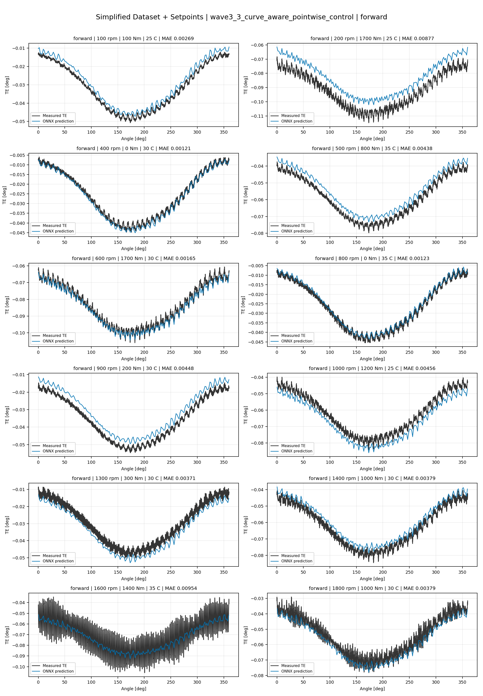
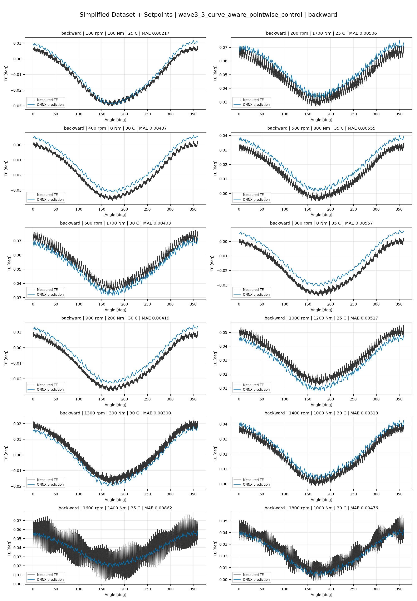
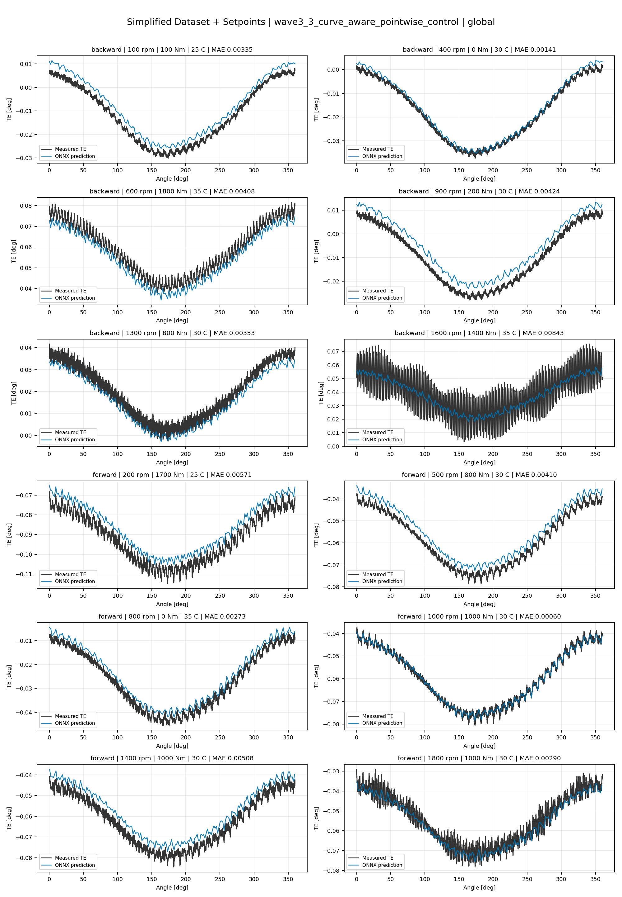
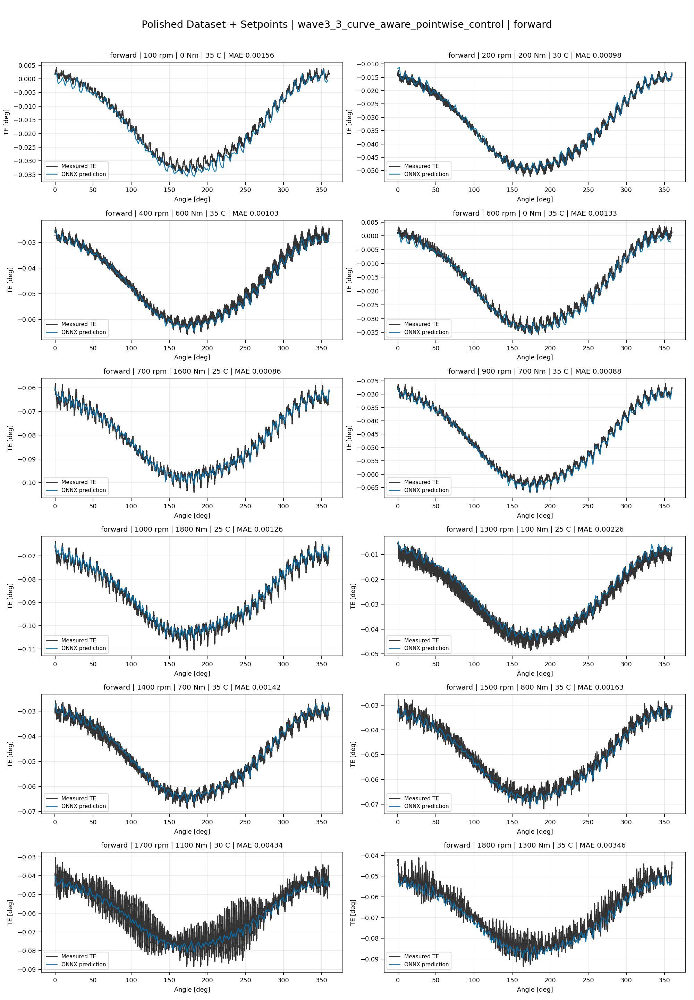
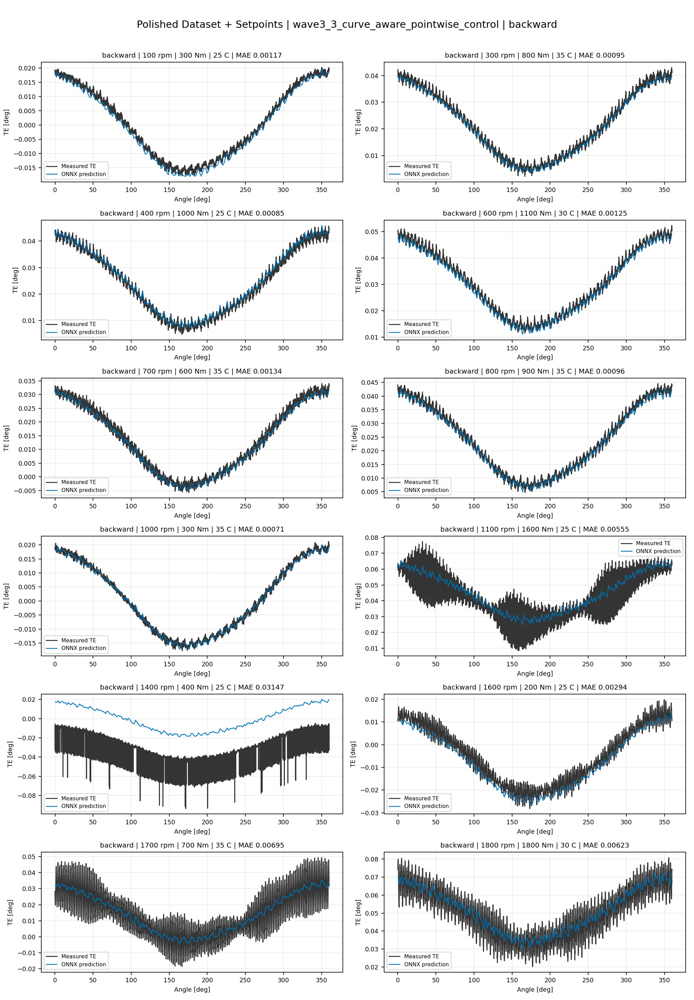
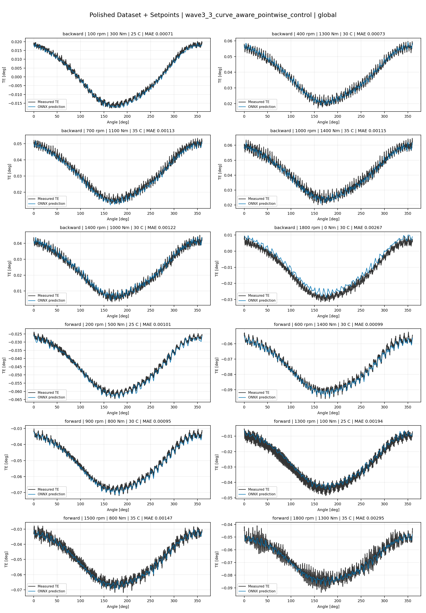
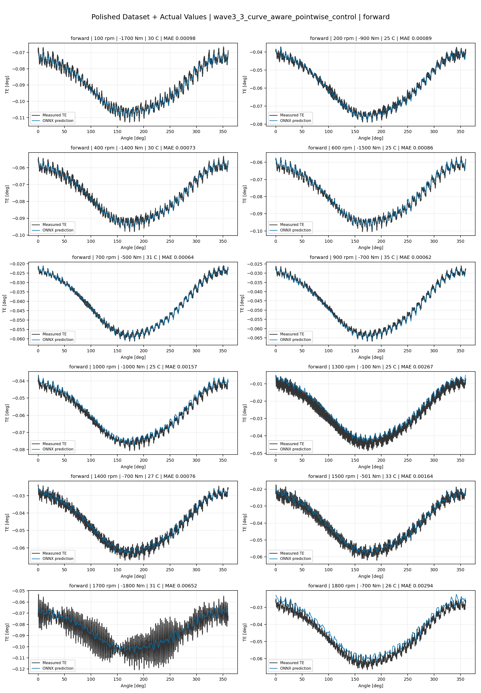
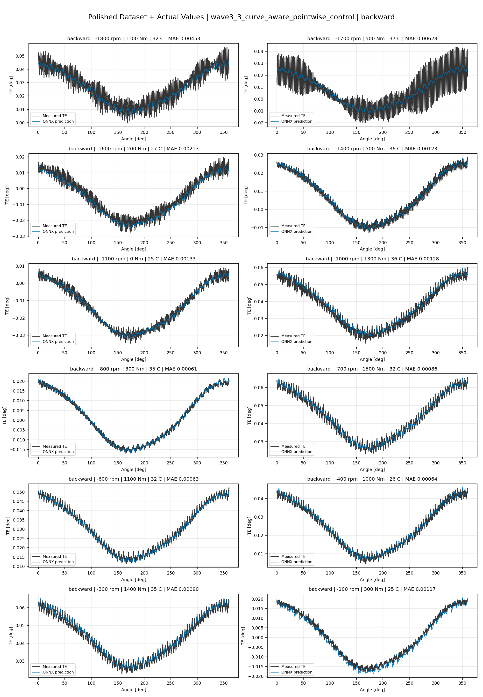
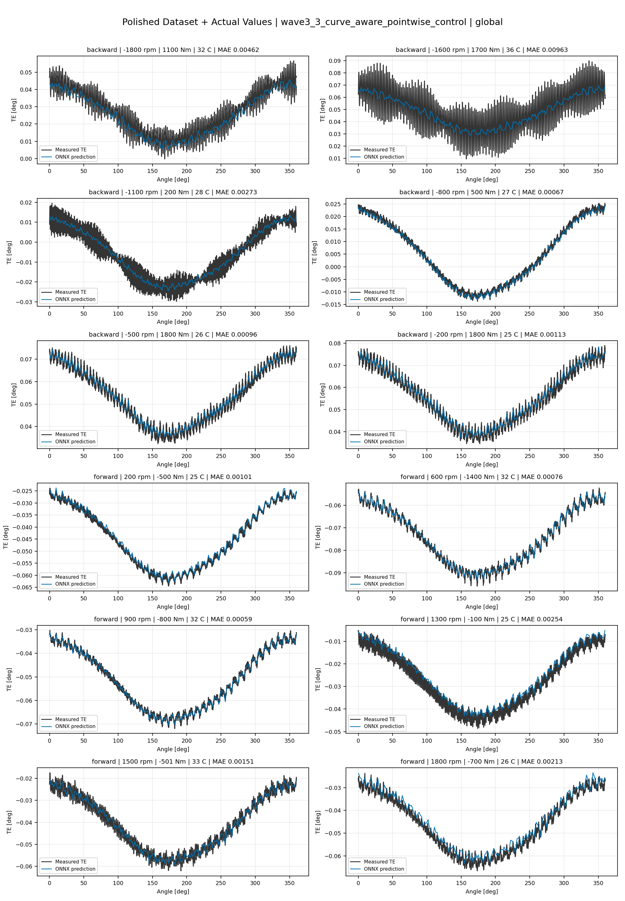

# TE Curve Verification Pipeline Familywise ONNX Report - wave3_3_curve_aware_pointwise_control

## Overview

This report evaluates exported ONNX models from the dataset input-mode
retraining program. Each dataset/input-mode section uses dataset-matched
held-out test curves and lists the exact model artifacts loaded from
`models/`.

Rank-3 temporal ONNX exports are evaluated on the sequence-window test
contract stored in each `training_config.snapshot.yaml`, including
`sequence_length`, `sequence_stride`, `sequence_target_position`, and
`maximum_sequences_per_curve`.
The collage pages keep the measured TE trace at the original full-curve
resolution; temporal ONNX predictions are overlaid at the evaluated
sequence-target angles.

The report is diagnostic and family-specific. It does not replace an
official multi-index model-promotion decision.

## Output Artifacts

- output directory: `output/validation_checks/track2_familywise_onnx_report/wave3_3_curve_aware_pointwise_control/2026-07-11-16-39-41__track2_wave3_3_curve_aware_pointwise_control_familywise_onnx_report`;
- summary YAML: `output/validation_checks/track2_familywise_onnx_report/wave3_3_curve_aware_pointwise_control/2026-07-11-16-39-41__track2_wave3_3_curve_aware_pointwise_control_familywise_onnx_report/track2_familywise_onnx_report_summary.yaml`;
- model inventory CSV: `output/validation_checks/track2_familywise_onnx_report/wave3_3_curve_aware_pointwise_control/2026-07-11-16-39-41__track2_wave3_3_curve_aware_pointwise_control_familywise_onnx_report/model_inventory.csv`;
- per-curve metrics CSV: `output/validation_checks/track2_familywise_onnx_report/wave3_3_curve_aware_pointwise_control/2026-07-11-16-39-41__track2_wave3_3_curve_aware_pointwise_control_familywise_onnx_report/per_curve_metrics.csv`.

## Simplified Dataset + Setpoints

- dataset: `simplified_dataset`;
- input mode: `setpoints`;
- evaluated family: `wave3_3_curve_aware_pointwise_control`;
- dataset root: `data/simplified_dataset`.

### Models Used

| Surface | Run Name | Run Instance | Dataset Schema |
| --- | --- | --- | --- |
| forward | `te_wave3_3_curve_aware_pointwise_control_fw__simplified_setpoints` | `2026-07-11-07-56-33__te_wave3_3_curve_aware_pointwise_control_fw__simplified_setpoints` | `simplified_curve_v1` |
| backward | `te_wave3_3_curve_aware_pointwise_control_bw__simplified_setpoints` | `2026-07-11-08-23-30__te_wave3_3_curve_aware_pointwise_control_bw__simplified_setpoints` | `simplified_curve_v1` |
| global | `te_wave3_3_curve_aware_pointwise_control_global__simplified_setpoints` | `2026-07-11-07-21-26__te_wave3_3_curve_aware_pointwise_control_global__simplified_setpoints` | `simplified_curve_v1` |

Exact model paths:

| Surface | ONNX Model Path | Python Model Path |
| --- | --- | --- |
| forward | `models/simplified_dataset/setpoints/exported/wave3_3_curve_aware_pointwise_control/forward/2026-07-11-07-56-33__te_wave3_3_curve_aware_pointwise_control_fw__simplified_setpoints/onnx/model.onnx` | `models/simplified_dataset/setpoints/exported/wave3_3_curve_aware_pointwise_control/forward/2026-07-11-07-56-33__te_wave3_3_curve_aware_pointwise_control_fw__simplified_setpoints/python/curve_aware_harmonic_residual_offset_probe-epoch=099-val_mae=0.00361775.ckpt` |
| backward | `models/simplified_dataset/setpoints/exported/wave3_3_curve_aware_pointwise_control/backward/2026-07-11-08-23-30__te_wave3_3_curve_aware_pointwise_control_bw__simplified_setpoints/onnx/model.onnx` | `models/simplified_dataset/setpoints/exported/wave3_3_curve_aware_pointwise_control/backward/2026-07-11-08-23-30__te_wave3_3_curve_aware_pointwise_control_bw__simplified_setpoints/python/curve_aware_harmonic_residual_offset_probe-epoch=105-val_mae=0.00363045.ckpt` |
| global | `models/simplified_dataset/setpoints/exported/wave3_3_curve_aware_pointwise_control/global/2026-07-11-07-21-26__te_wave3_3_curve_aware_pointwise_control_global__simplified_setpoints/onnx/model.onnx` | `models/simplified_dataset/setpoints/exported/wave3_3_curve_aware_pointwise_control/global/2026-07-11-07-21-26__te_wave3_3_curve_aware_pointwise_control_global__simplified_setpoints/python/curve_aware_harmonic_residual_offset_probe-epoch=139-val_mae=0.00358483.ckpt` |

### Aggregate Metrics

| Surface | Curves | MAE [deg] | RMSE [deg] | Mean Error [%] | P95 Error [%] |
| --- | ---: | ---: | ---: | ---: | ---: |
| forward | 97 | 0.003270 | 0.003548 | 7.634 | 12.872 |
| backward | 97 | 0.003693 | 0.004009 | 8.604 | 14.382 |
| global | 194 | 0.003445 | 0.003752 | 8.040 | 14.096 |

Offset And Shape Metrics:

| Surface | Signed Offset [deg] | Absolute Offset [deg] | Centered MAE [deg] | P2P Error [deg] |
| --- | ---: | ---: | ---: | ---: |
| forward | 0.000237 | 0.002902 | 0.001257 | 0.002940 |
| backward | -0.000115 | 0.003087 | 0.001561 | 0.003471 |
| global | 0.000376 | 0.002935 | 0.001438 | 0.003333 |

### Forward 12-Curve Page

### Backward 12-Curve Page

### Global 12-Curve Page

## Polished Dataset + Setpoints

- dataset: `polished_dataset`;
- input mode: `setpoints`;
- evaluated family: `wave3_3_curve_aware_pointwise_control`;
- dataset root: `data/polished_dataset`.

### Models Used

| Surface | Run Name | Run Instance | Dataset Schema |
| --- | --- | --- | --- |
| forward | `te_wave3_3_curve_aware_pointwise_control_fw__polished_setpoints` | `2026-07-11-11-40-50__te_wave3_3_curve_aware_pointwise_control_fw__polished_setpoints` | `polished_setpoint_curve_v1` |
| backward | `te_wave3_3_curve_aware_pointwise_control_bw__polished_setpoints` | `2026-07-11-12-11-04__te_wave3_3_curve_aware_pointwise_control_bw__polished_setpoints` | `polished_setpoint_curve_v1` |
| global | `te_wave3_3_curve_aware_pointwise_control_global__polished_setpoints` | `2026-07-11-11-00-32__te_wave3_3_curve_aware_pointwise_control_global__polished_setpoints` | `polished_setpoint_curve_v1` |

Exact model paths:

| Surface | ONNX Model Path | Python Model Path |
| --- | --- | --- |
| forward | `models/polished_dataset/setpoints/exported/wave3_3_curve_aware_pointwise_control/forward/2026-07-11-11-40-50__te_wave3_3_curve_aware_pointwise_control_fw__polished_setpoints/onnx/model.onnx` | `models/polished_dataset/setpoints/exported/wave3_3_curve_aware_pointwise_control/forward/2026-07-11-11-40-50__te_wave3_3_curve_aware_pointwise_control_fw__polished_setpoints/python/curve_aware_harmonic_residual_offset_probe-epoch=094-val_mae=0.00191479.ckpt` |
| backward | `models/polished_dataset/setpoints/exported/wave3_3_curve_aware_pointwise_control/backward/2026-07-11-12-11-04__te_wave3_3_curve_aware_pointwise_control_bw__polished_setpoints/onnx/model.onnx` | `models/polished_dataset/setpoints/exported/wave3_3_curve_aware_pointwise_control/backward/2026-07-11-12-11-04__te_wave3_3_curve_aware_pointwise_control_bw__polished_setpoints/python/curve_aware_harmonic_residual_offset_probe-epoch=130-val_mae=0.00195353.ckpt` |
| global | `models/polished_dataset/setpoints/exported/wave3_3_curve_aware_pointwise_control/global/2026-07-11-11-00-32__te_wave3_3_curve_aware_pointwise_control_global__polished_setpoints/onnx/model.onnx` | `models/polished_dataset/setpoints/exported/wave3_3_curve_aware_pointwise_control/global/2026-07-11-11-00-32__te_wave3_3_curve_aware_pointwise_control_global__polished_setpoints/python/curve_aware_harmonic_residual_offset_probe-epoch=141-val_mae=0.00193127.ckpt` |

### Aggregate Metrics

| Surface | Curves | MAE [deg] | RMSE [deg] | Mean Error [%] | P95 Error [%] |
| --- | ---: | ---: | ---: | ---: | ---: |
| forward | 100 | 0.001992 | 0.002372 | 4.383 | 10.698 |
| backward | 94 | 0.002586 | 0.003038 | 4.778 | 10.807 |
| global | 194 | 0.002241 | 0.002642 | 4.485 | 10.908 |

Offset And Shape Metrics:

| Surface | Signed Offset [deg] | Absolute Offset [deg] | Centered MAE [deg] | P2P Error [deg] |
| --- | ---: | ---: | ---: | ---: |
| forward | -0.000134 | 0.001080 | 0.001595 | 0.003598 |
| backward | 0.000369 | 0.001112 | 0.002139 | 0.005552 |
| global | 0.000105 | 0.000995 | 0.001831 | 0.004677 |

### Forward 12-Curve Page

### Backward 12-Curve Page

### Global 12-Curve Page

## Polished Dataset + Actual Values

- dataset: `polished_dataset`;
- input mode: `actual_values`;
- evaluated family: `wave3_3_curve_aware_pointwise_control`;
- dataset root: `data/polished_dataset`.

### Models Used

| Surface | Run Name | Run Instance | Dataset Schema |
| --- | --- | --- | --- |
| forward | `te_wave3_3_curve_aware_pointwise_control_fw__polished_actual_values` | `2026-07-11-13-46-39__te_wave3_3_curve_aware_pointwise_control_fw__polished_actual_values` | `polished_point_v1` |
| backward | `te_wave3_3_curve_aware_pointwise_control_bw__polished_actual_values` | `2026-07-11-14-43-50__te_wave3_3_curve_aware_pointwise_control_bw__polished_actual_values` | `polished_point_v1` |
| global | `te_wave3_3_curve_aware_pointwise_control_global__polished_actual_values` | `2026-07-11-12-56-24__te_wave3_3_curve_aware_pointwise_control_global__polished_actual_values` | `polished_point_v1` |

Exact model paths:

| Surface | ONNX Model Path | Python Model Path |
| --- | --- | --- |
| forward | `models/polished_dataset/actual_values/exported/wave3_3_curve_aware_pointwise_control/forward/2026-07-11-13-46-39__te_wave3_3_curve_aware_pointwise_control_fw__polished_actual_values/onnx/model.onnx` | `models/polished_dataset/actual_values/exported/wave3_3_curve_aware_pointwise_control/forward/2026-07-11-13-46-39__te_wave3_3_curve_aware_pointwise_control_fw__polished_actual_values/python/curve_aware_harmonic_residual_offset_probe-epoch=256-val_mae=0.00183289.ckpt` |
| backward | `models/polished_dataset/actual_values/exported/wave3_3_curve_aware_pointwise_control/backward/2026-07-11-14-43-50__te_wave3_3_curve_aware_pointwise_control_bw__polished_actual_values/onnx/model.onnx` | `models/polished_dataset/actual_values/exported/wave3_3_curve_aware_pointwise_control/backward/2026-07-11-14-43-50__te_wave3_3_curve_aware_pointwise_control_bw__polished_actual_values/python/curve_aware_harmonic_residual_offset_probe-epoch=175-val_mae=0.00184976.ckpt` |
| global | `models/polished_dataset/actual_values/exported/wave3_3_curve_aware_pointwise_control/global/2026-07-11-12-56-24__te_wave3_3_curve_aware_pointwise_control_global__polished_actual_values/onnx/model.onnx` | `models/polished_dataset/actual_values/exported/wave3_3_curve_aware_pointwise_control/global/2026-07-11-12-56-24__te_wave3_3_curve_aware_pointwise_control_global__polished_actual_values/python/curve_aware_harmonic_residual_offset_probe-epoch=199-val_mae=0.00185032.ckpt` |

### Aggregate Metrics

| Surface | Curves | MAE [deg] | RMSE [deg] | Mean Error [%] | P95 Error [%] |
| --- | ---: | ---: | ---: | ---: | ---: |
| forward | 100 | 0.001749 | 0.002109 | 3.799 | 9.130 |
| backward | 94 | 0.002191 | 0.002636 | 4.142 | 10.372 |
| global | 194 | 0.001987 | 0.002397 | 4.033 | 10.210 |

Offset And Shape Metrics:

| Surface | Signed Offset [deg] | Absolute Offset [deg] | Centered MAE [deg] | P2P Error [deg] |
| --- | ---: | ---: | ---: | ---: |
| forward | 0.000176 | 0.000678 | 0.001555 | 0.003708 |
| backward | 0.000156 | 0.000561 | 0.002084 | 0.005401 |
| global | -0.000102 | 0.000704 | 0.001805 | 0.004665 |

### Forward 12-Curve Page

### Backward 12-Curve Page

### Global 12-Curve Page

