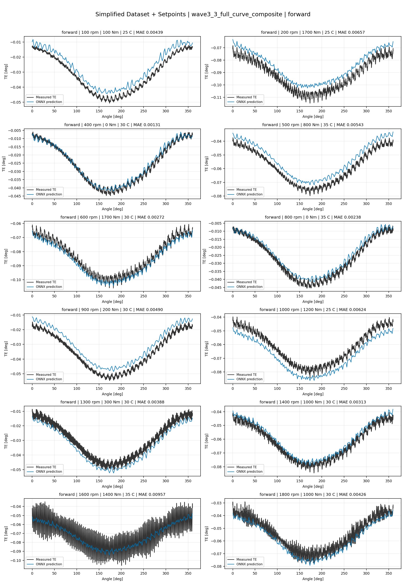
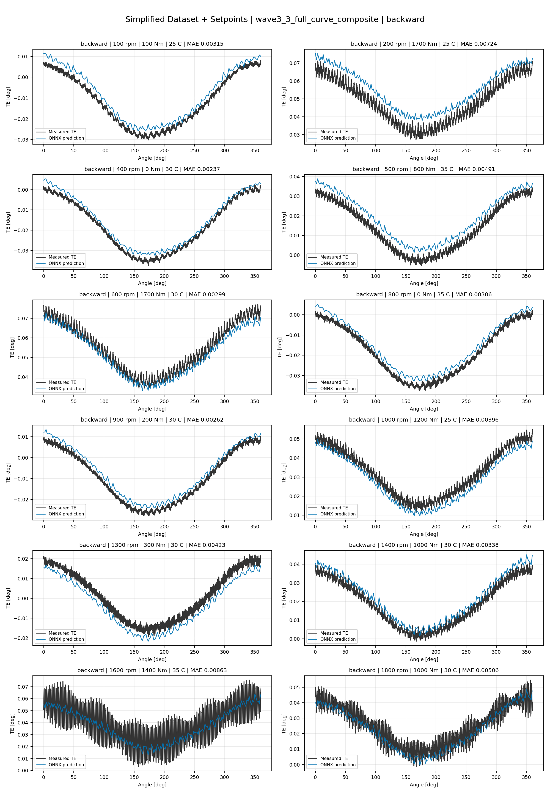
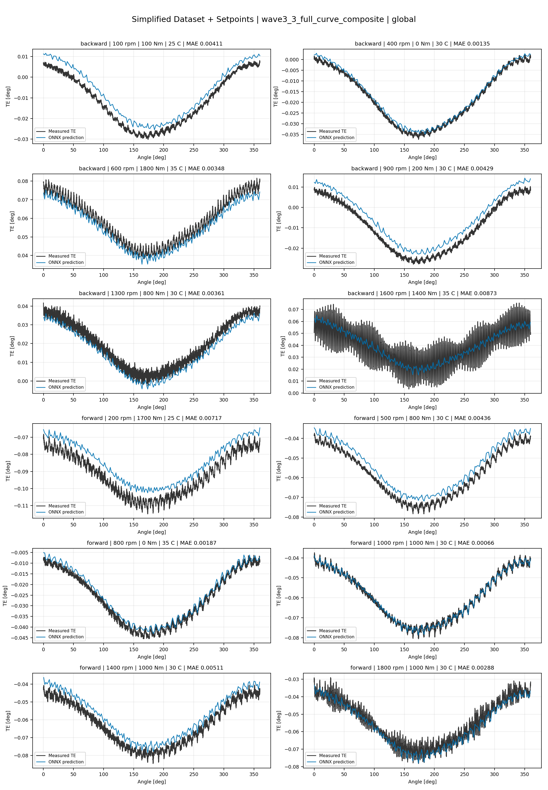
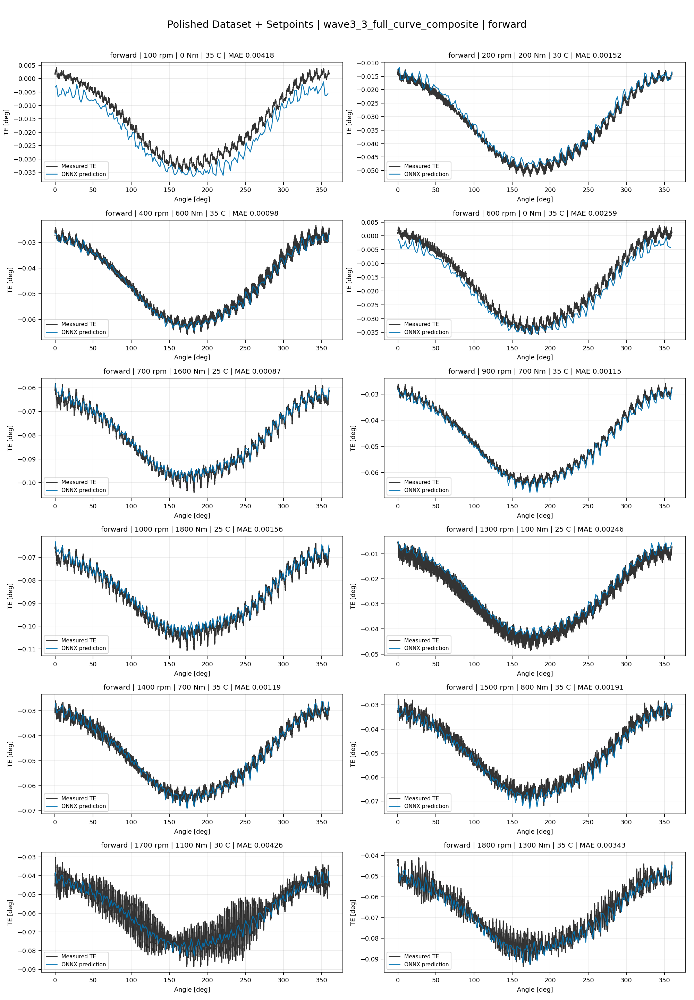
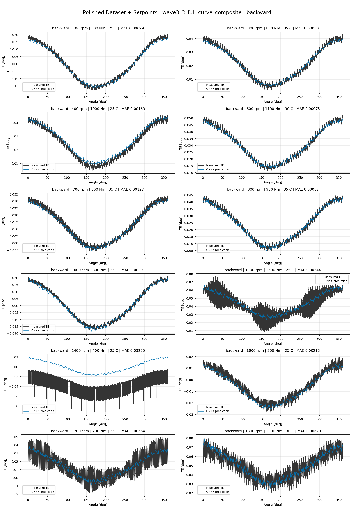
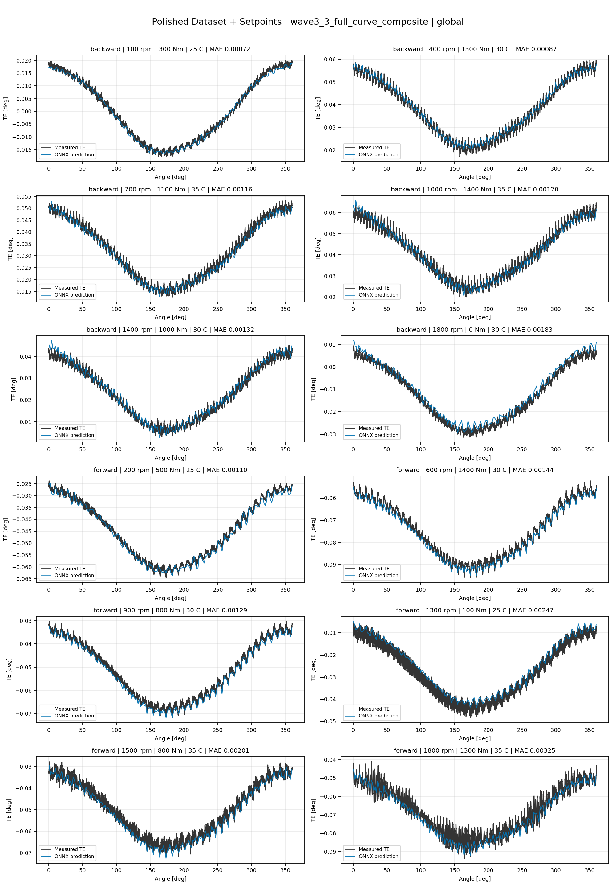
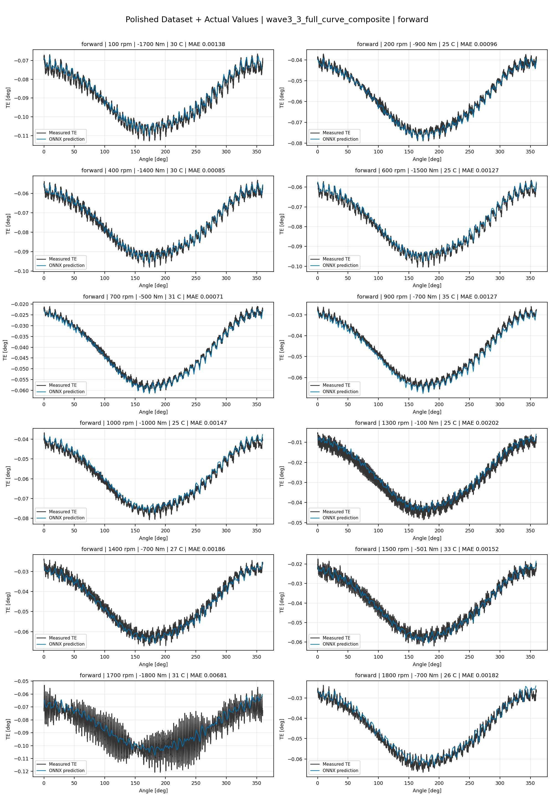
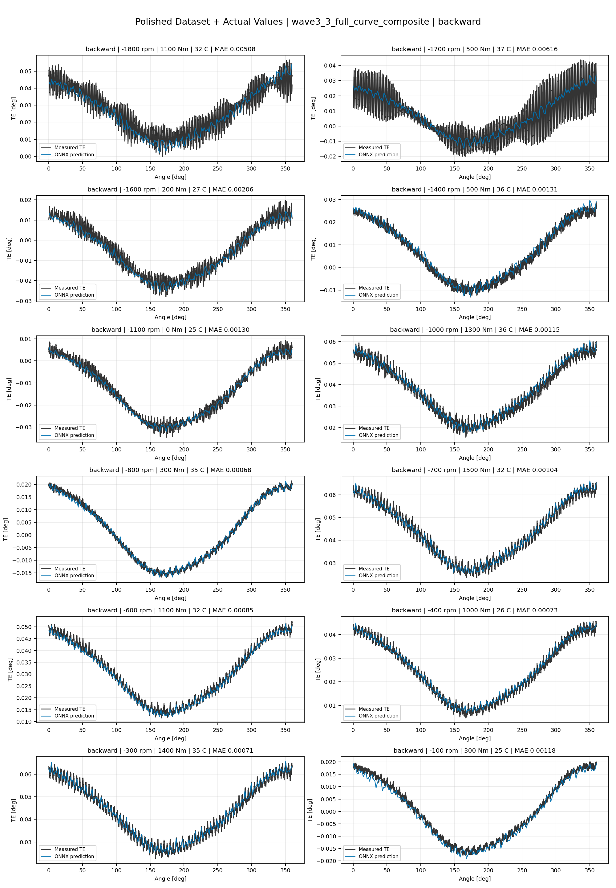
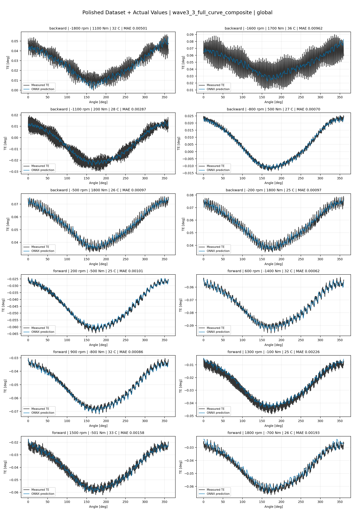

# TE Curve Verification Pipeline Familywise ONNX Report - wave3_3_full_curve_composite

## Overview

This report evaluates exported ONNX models from the dataset input-mode
retraining program. Each dataset/input-mode section uses dataset-matched
held-out test curves and lists the exact model artifacts loaded from
`models/`.

Rank-3 temporal ONNX exports are evaluated on the sequence-window test
contract stored in each `training_config.snapshot.yaml`, including
`sequence_length`, `sequence_stride`, `sequence_target_position`, and
`maximum_sequences_per_curve`.
The collage pages keep the measured TE trace at the original full-curve
resolution; temporal ONNX predictions are overlaid at the evaluated
sequence-target angles.

The report is diagnostic and family-specific. It does not replace an
official multi-index model-promotion decision.

## Output Artifacts

- output directory: `output/validation_checks/track2_familywise_onnx_report/wave3_3_full_curve_composite/2026-07-12-15-30-02__track2_wave3_3_full_curve_composite_familywise_onnx_report`;
- summary YAML: `output/validation_checks/track2_familywise_onnx_report/wave3_3_full_curve_composite/2026-07-12-15-30-02__track2_wave3_3_full_curve_composite_familywise_onnx_report/track2_familywise_onnx_report_summary.yaml`;
- model inventory CSV: `output/validation_checks/track2_familywise_onnx_report/wave3_3_full_curve_composite/2026-07-12-15-30-02__track2_wave3_3_full_curve_composite_familywise_onnx_report/model_inventory.csv`;
- per-curve metrics CSV: `output/validation_checks/track2_familywise_onnx_report/wave3_3_full_curve_composite/2026-07-12-15-30-02__track2_wave3_3_full_curve_composite_familywise_onnx_report/per_curve_metrics.csv`.

## Simplified Dataset + Setpoints

- dataset: `simplified_dataset`;
- input mode: `setpoints`;
- evaluated family: `wave3_3_full_curve_composite`;
- dataset root: `data/simplified_dataset`.

### Models Used

| Surface | Run Name | Run Instance | Dataset Schema |
| --- | --- | --- | --- |
| forward | `te_wave3_3_full_curve_composite_fw__simplified_setpoints` | `2026-07-12-04-39-03__te_wave3_3_full_curve_composite_fw__simplified_setpoints` | `simplified_curve_v1` |
| backward | `te_wave3_3_full_curve_composite_bw__simplified_setpoints` | `2026-07-12-05-09-44__te_wave3_3_full_curve_composite_bw__simplified_setpoints` | `simplified_curve_v1` |
| global | `te_wave3_3_full_curve_composite_global__simplified_setpoints` | `2026-07-12-04-02-10__te_wave3_3_full_curve_composite_global__simplified_setpoints` | `simplified_curve_v1` |

Exact model paths:

| Surface | ONNX Model Path | Python Model Path |
| --- | --- | --- |
| forward | `models/simplified_dataset/setpoints/wave3_3_full_curve_composite/forward/onnx/model.onnx` | `models/simplified_dataset/setpoints/wave3_3_full_curve_composite/forward/python/curve_aware_harmonic_residual_offset_probe-epoch=137-val_mae=0.00367911.ckpt` |
| backward | `models/simplified_dataset/setpoints/wave3_3_full_curve_composite/backward/onnx/model.onnx` | `models/simplified_dataset/setpoints/wave3_3_full_curve_composite/backward/python/curve_aware_harmonic_residual_offset_probe-epoch=140-val_mae=0.00365689.ckpt` |
| global | `models/simplified_dataset/setpoints/wave3_3_full_curve_composite/global/onnx/model.onnx` | `models/simplified_dataset/setpoints/wave3_3_full_curve_composite/global/python/curve_aware_harmonic_residual_offset_probe-epoch=172-val_mae=0.00363873.ckpt` |

### Aggregate Metrics

| Surface | Curves | MAE [deg] | RMSE [deg] | Mean Error [%] | P95 Error [%] |
| --- | ---: | ---: | ---: | ---: | ---: |
| forward | 97 | 0.003399 | 0.003708 | 7.938 | 14.562 |
| backward | 97 | 0.003611 | 0.003991 | 8.399 | 13.460 |
| global | 194 | 0.003419 | 0.003748 | 7.966 | 14.422 |

Offset And Shape Metrics:

| Surface | Signed Offset [deg] | Absolute Offset [deg] | Centered MAE [deg] | P2P Error [deg] |
| --- | ---: | ---: | ---: | ---: |
| forward | -0.000244 | 0.002988 | 0.001376 | 0.003176 |
| backward | 0.000026 | 0.003013 | 0.001700 | 0.002897 |
| global | 0.000684 | 0.002869 | 0.001490 | 0.002888 |

### Forward 12-Curve Page

### Backward 12-Curve Page

### Global 12-Curve Page

## Polished Dataset + Setpoints

- dataset: `polished_dataset`;
- input mode: `setpoints`;
- evaluated family: `wave3_3_full_curve_composite`;
- dataset root: `data/polished_dataset`.

### Models Used

| Surface | Run Name | Run Instance | Dataset Schema |
| --- | --- | --- | --- |
| forward | `te_wave3_3_full_curve_composite_fw__polished_setpoints` | `2026-07-12-10-22-30__te_wave3_3_full_curve_composite_fw__polished_setpoints` | `polished_setpoint_curve_v1` |
| backward | `te_wave3_3_full_curve_composite_bw__polished_setpoints` | `2026-07-12-10-55-22__te_wave3_3_full_curve_composite_bw__polished_setpoints` | `polished_setpoint_curve_v1` |
| global | `te_wave3_3_full_curve_composite_global__polished_setpoints` | `2026-07-12-09-42-30__te_wave3_3_full_curve_composite_global__polished_setpoints` | `polished_setpoint_curve_v1` |

Exact model paths:

| Surface | ONNX Model Path | Python Model Path |
| --- | --- | --- |
| forward | `models/polished_dataset/setpoints/wave3_3_full_curve_composite/forward/onnx/model.onnx` | `models/polished_dataset/setpoints/wave3_3_full_curve_composite/forward/python/curve_aware_harmonic_residual_offset_probe-epoch=107-val_mae=0.00203018.ckpt` |
| backward | `models/polished_dataset/setpoints/wave3_3_full_curve_composite/backward/onnx/model.onnx` | `models/polished_dataset/setpoints/wave3_3_full_curve_composite/backward/python/curve_aware_harmonic_residual_offset_probe-epoch=078-val_mae=0.00203714.ckpt` |
| global | `models/polished_dataset/setpoints/wave3_3_full_curve_composite/global/onnx/model.onnx` | `models/polished_dataset/setpoints/wave3_3_full_curve_composite/global/python/curve_aware_harmonic_residual_offset_probe-epoch=139-val_mae=0.00205804.ckpt` |

### Aggregate Metrics

| Surface | Curves | MAE [deg] | RMSE [deg] | Mean Error [%] | P95 Error [%] |
| --- | ---: | ---: | ---: | ---: | ---: |
| forward | 100 | 0.002084 | 0.002474 | 4.610 | 11.167 |
| backward | 94 | 0.002670 | 0.003149 | 4.988 | 11.084 |
| global | 194 | 0.002353 | 0.002785 | 4.750 | 10.886 |

Offset And Shape Metrics:

| Surface | Signed Offset [deg] | Absolute Offset [deg] | Centered MAE [deg] | P2P Error [deg] |
| --- | ---: | ---: | ---: | ---: |
| forward | 0.000177 | 0.001085 | 0.001653 | 0.002806 |
| backward | 0.000661 | 0.001033 | 0.002251 | 0.005256 |
| global | -0.000057 | 0.001117 | 0.001909 | 0.004032 |

### Forward 12-Curve Page

### Backward 12-Curve Page

### Global 12-Curve Page

## Polished Dataset + Actual Values

- dataset: `polished_dataset`;
- input mode: `actual_values`;
- evaluated family: `wave3_3_full_curve_composite`;
- dataset root: `data/polished_dataset`.

### Models Used

| Surface | Run Name | Run Instance | Dataset Schema |
| --- | --- | --- | --- |
| forward | `te_wave3_3_full_curve_composite_fw__polished_actual_values` | `2026-07-12-12-13-42__te_wave3_3_full_curve_composite_fw__polished_actual_values` | `polished_point_v1` |
| backward | `te_wave3_3_full_curve_composite_bw__polished_actual_values` | `2026-07-12-13-09-19__te_wave3_3_full_curve_composite_bw__polished_actual_values` | `polished_point_v1` |
| global | `te_wave3_3_full_curve_composite_global__polished_actual_values` | `2026-07-12-11-35-23__te_wave3_3_full_curve_composite_global__polished_actual_values` | `polished_point_v1` |

Exact model paths:

| Surface | ONNX Model Path | Python Model Path |
| --- | --- | --- |
| forward | `models/polished_dataset/actual_values/wave3_3_full_curve_composite/forward/onnx/model.onnx` | `models/polished_dataset/actual_values/wave3_3_full_curve_composite/forward/python/curve_aware_harmonic_residual_offset_probe-epoch=211-val_mae=0.00198008.ckpt` |
| backward | `models/polished_dataset/actual_values/wave3_3_full_curve_composite/backward/onnx/model.onnx` | `models/polished_dataset/actual_values/wave3_3_full_curve_composite/backward/python/curve_aware_harmonic_residual_offset_probe-epoch=143-val_mae=0.00194357.ckpt` |
| global | `models/polished_dataset/actual_values/wave3_3_full_curve_composite/global/onnx/model.onnx` | `models/polished_dataset/actual_values/wave3_3_full_curve_composite/global/python/curve_aware_harmonic_residual_offset_probe-epoch=131-val_mae=0.00200797.ckpt` |

### Aggregate Metrics

| Surface | Curves | MAE [deg] | RMSE [deg] | Mean Error [%] | P95 Error [%] |
| --- | ---: | ---: | ---: | ---: | ---: |
| forward | 100 | 0.001890 | 0.002276 | 4.146 | 9.240 |
| backward | 94 | 0.002250 | 0.002746 | 4.292 | 10.700 |
| global | 194 | 0.002169 | 0.002620 | 4.471 | 10.705 |

Offset And Shape Metrics:

| Surface | Signed Offset [deg] | Absolute Offset [deg] | Centered MAE [deg] | P2P Error [deg] |
| --- | ---: | ---: | ---: | ---: |
| forward | -0.000074 | 0.000859 | 0.001622 | 0.002580 |
| backward | 0.000096 | 0.000574 | 0.002154 | 0.004189 |
| global | -0.000108 | 0.000773 | 0.001967 | 0.003232 |

### Forward 12-Curve Page

### Backward 12-Curve Page

### Global 12-Curve Page

