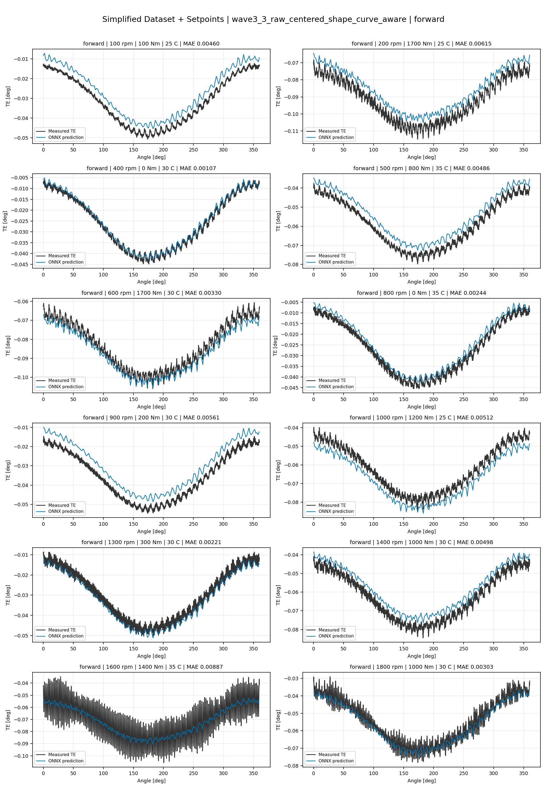
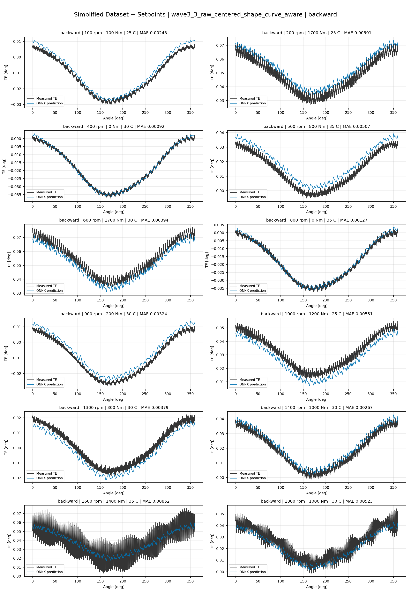
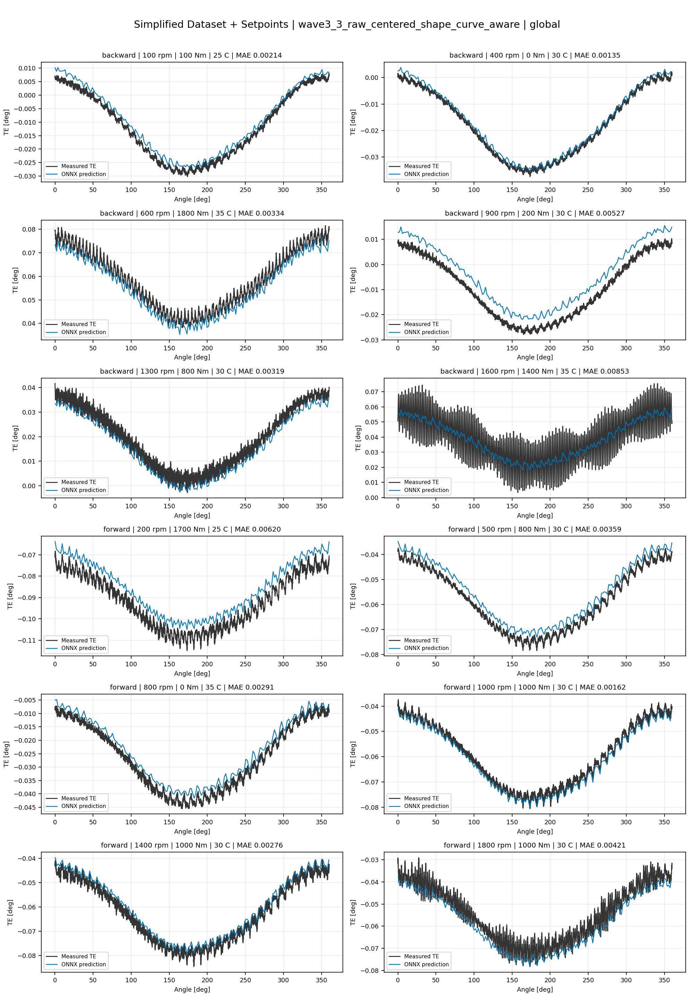
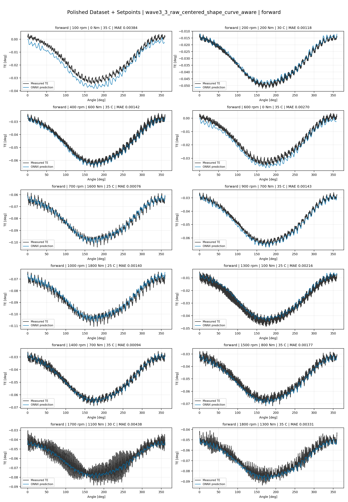
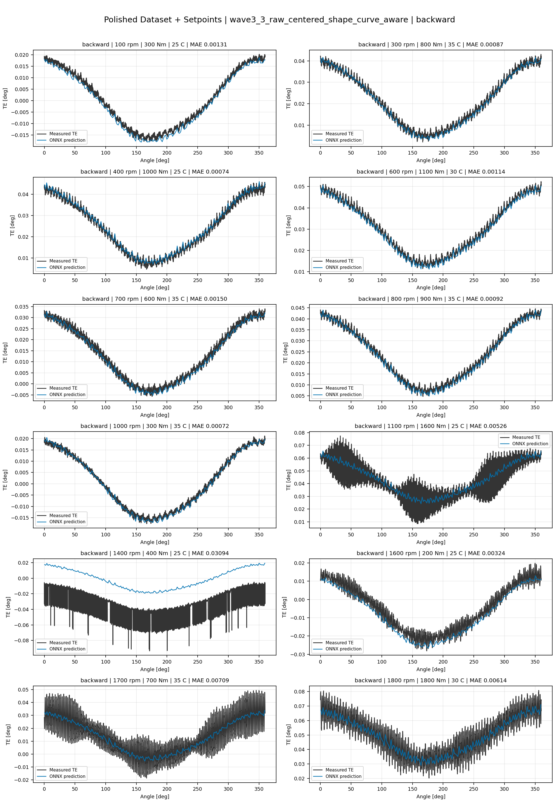
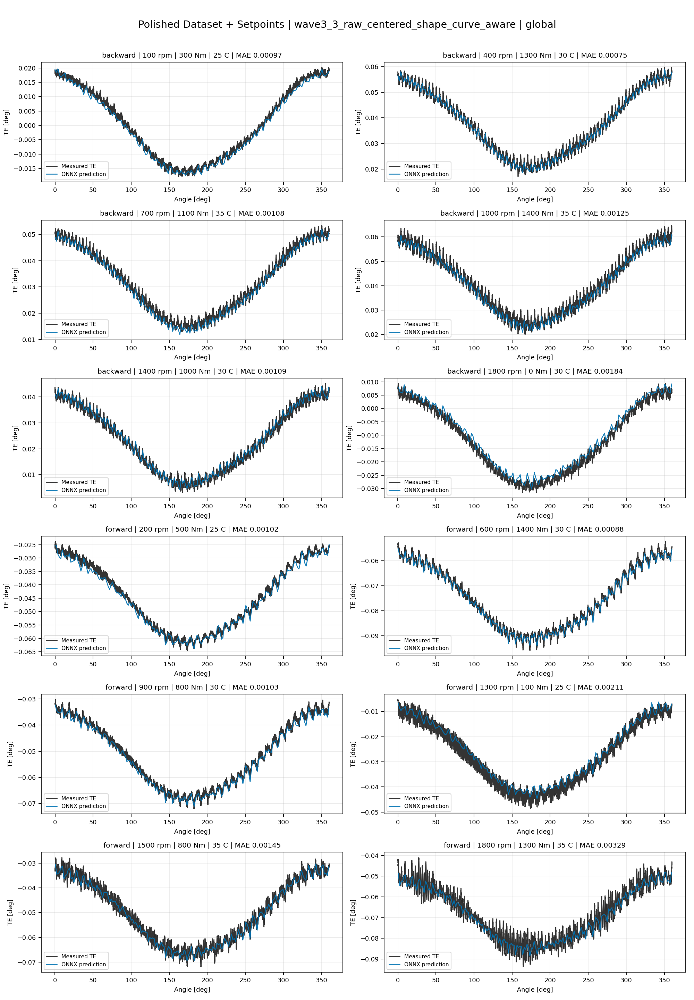
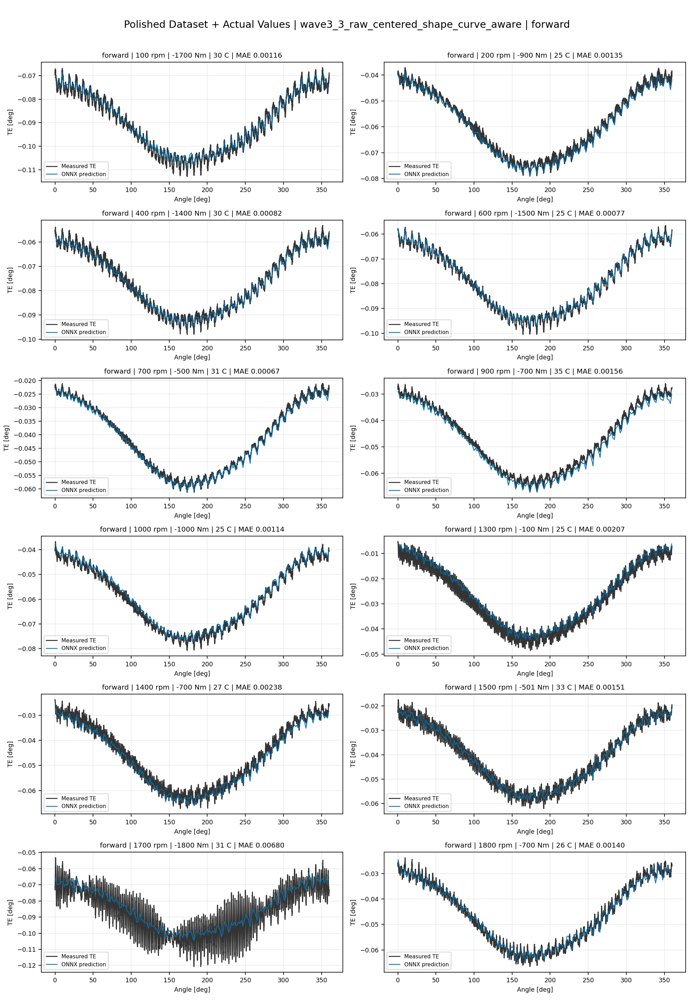
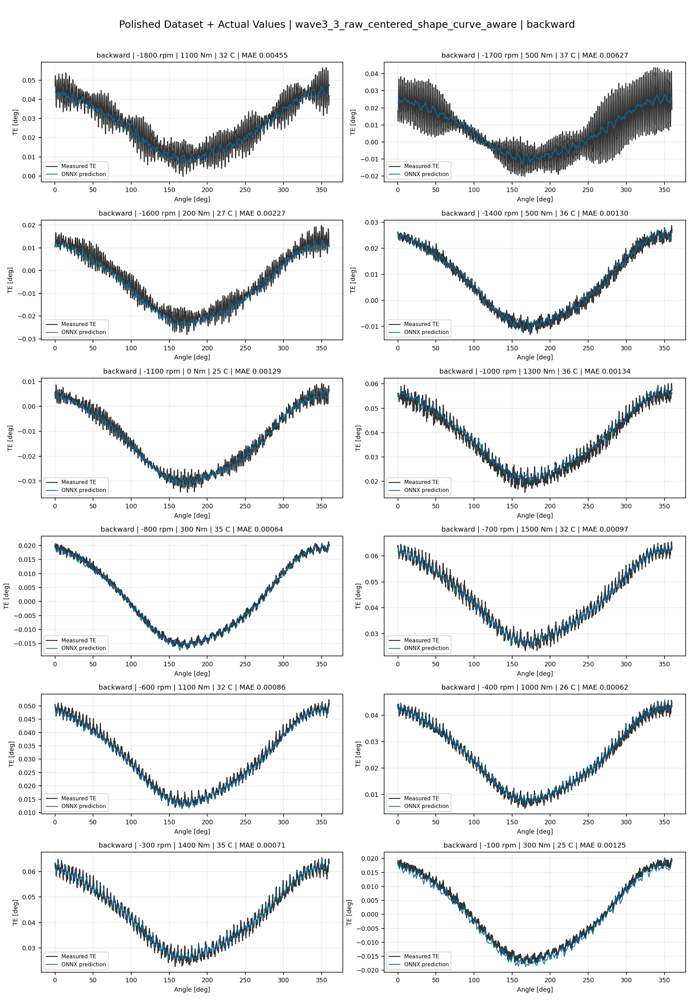
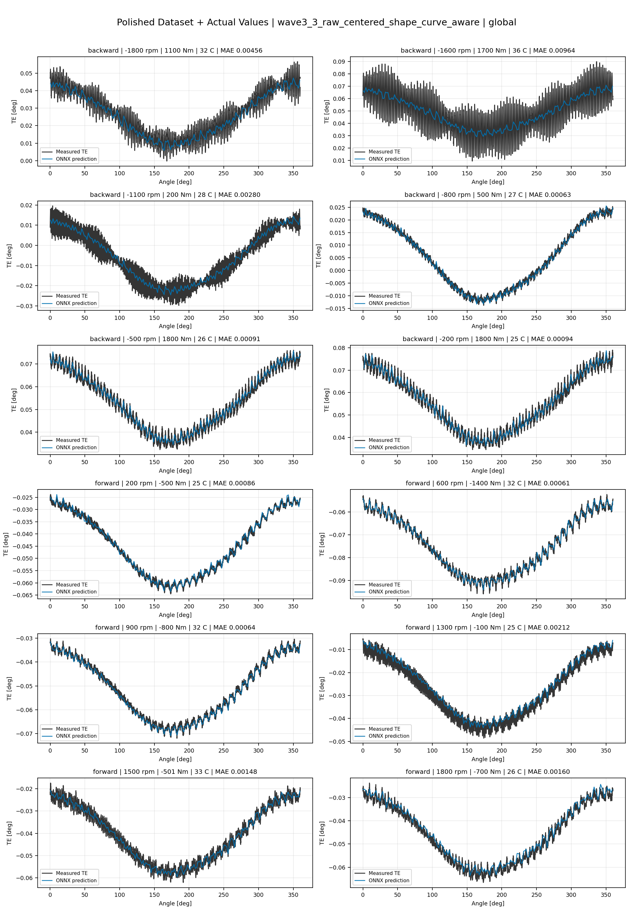

# TE Curve Verification Pipeline Familywise ONNX Report - wave3_3_raw_centered_shape_curve_aware

## Overview

This report evaluates exported ONNX models from the dataset input-mode
retraining program. Each dataset/input-mode section uses dataset-matched
held-out test curves and lists the exact model artifacts loaded from
`models/`.

Rank-3 temporal ONNX exports are evaluated on the sequence-window test
contract stored in each `training_config.snapshot.yaml`, including
`sequence_length`, `sequence_stride`, `sequence_target_position`, and
`maximum_sequences_per_curve`.
The collage pages keep the measured TE trace at the original full-curve
resolution; temporal ONNX predictions are overlaid at the evaluated
sequence-target angles.

The report is diagnostic and family-specific. It does not replace an
official multi-index model-promotion decision.

## Output Artifacts

- output directory: `output/validation_checks/track2_familywise_onnx_report/wave3_3_raw_centered_shape_curve_aware/2026-07-12-00-15-41__track2_wave3_3_raw_centered_shape_curve_aware_familywise_onnx_report`;
- summary YAML: `output/validation_checks/track2_familywise_onnx_report/wave3_3_raw_centered_shape_curve_aware/2026-07-12-00-15-41__track2_wave3_3_raw_centered_shape_curve_aware_familywise_onnx_report/track2_familywise_onnx_report_summary.yaml`;
- model inventory CSV: `output/validation_checks/track2_familywise_onnx_report/wave3_3_raw_centered_shape_curve_aware/2026-07-12-00-15-41__track2_wave3_3_raw_centered_shape_curve_aware_familywise_onnx_report/model_inventory.csv`;
- per-curve metrics CSV: `output/validation_checks/track2_familywise_onnx_report/wave3_3_raw_centered_shape_curve_aware/2026-07-12-00-15-41__track2_wave3_3_raw_centered_shape_curve_aware_familywise_onnx_report/per_curve_metrics.csv`.

## Simplified Dataset + Setpoints

- dataset: `simplified_dataset`;
- input mode: `setpoints`;
- evaluated family: `wave3_3_raw_centered_shape_curve_aware`;
- dataset root: `data/simplified_dataset`.

### Models Used

| Surface | Run Name | Run Instance | Dataset Schema |
| --- | --- | --- | --- |
| forward | `te_wave3_3_raw_centered_shape_curve_aware_fw__simplified_setpoints` | `2026-07-11-16-12-47__te_wave3_3_raw_centered_shape_curve_aware_fw__simplified_setpoints` | `simplified_curve_v1` |
| backward | `te_wave3_3_raw_centered_shape_curve_aware_bw__simplified_setpoints` | `2026-07-11-16-42-36__te_wave3_3_raw_centered_shape_curve_aware_bw__simplified_setpoints` | `simplified_curve_v1` |
| global | `te_wave3_3_raw_centered_shape_curve_aware_global__simplified_setpoints` | `2026-07-11-15-43-36__te_wave3_3_raw_centered_shape_curve_aware_global__simplified_setpoints` | `simplified_curve_v1` |

Exact model paths:

| Surface | ONNX Model Path | Python Model Path |
| --- | --- | --- |
| forward | `models/simplified_dataset/setpoints/wave3_3_raw_centered_shape_curve_aware/forward/onnx/model.onnx` | `models/simplified_dataset/setpoints/wave3_3_raw_centered_shape_curve_aware/forward/python/curve_aware_harmonic_residual_offset_probe-epoch=119-val_mae=0.00356710.ckpt` |
| backward | `models/simplified_dataset/setpoints/wave3_3_raw_centered_shape_curve_aware/backward/onnx/model.onnx` | `models/simplified_dataset/setpoints/wave3_3_raw_centered_shape_curve_aware/backward/python/curve_aware_harmonic_residual_offset_probe-epoch=122-val_mae=0.00357800.ckpt` |
| global | `models/simplified_dataset/setpoints/wave3_3_raw_centered_shape_curve_aware/global/onnx/model.onnx` | `models/simplified_dataset/setpoints/wave3_3_raw_centered_shape_curve_aware/global/python/curve_aware_harmonic_residual_offset_probe-epoch=114-val_mae=0.00357026.ckpt` |

### Aggregate Metrics

| Surface | Curves | MAE [deg] | RMSE [deg] | Mean Error [%] | P95 Error [%] |
| --- | ---: | ---: | ---: | ---: | ---: |
| forward | 97 | 0.003391 | 0.003667 | 7.934 | 13.954 |
| backward | 97 | 0.003556 | 0.003916 | 8.248 | 13.783 |
| global | 194 | 0.003524 | 0.003823 | 8.223 | 15.624 |

Offset And Shape Metrics:

| Surface | Signed Offset [deg] | Absolute Offset [deg] | Centered MAE [deg] | P2P Error [deg] |
| --- | ---: | ---: | ---: | ---: |
| forward | 0.000339 | 0.002961 | 0.001296 | 0.004132 |
| backward | -0.000764 | 0.002942 | 0.001666 | 0.002972 |
| global | 0.000245 | 0.003026 | 0.001418 | 0.003109 |

### Forward 12-Curve Page

### Backward 12-Curve Page

### Global 12-Curve Page

## Polished Dataset + Setpoints

- dataset: `polished_dataset`;
- input mode: `setpoints`;
- evaluated family: `wave3_3_raw_centered_shape_curve_aware`;
- dataset root: `data/polished_dataset`.

### Models Used

| Surface | Run Name | Run Instance | Dataset Schema |
| --- | --- | --- | --- |
| forward | `te_wave3_3_raw_centered_shape_curve_aware_fw__polished_setpoints` | `2026-07-11-18-01-02__te_wave3_3_raw_centered_shape_curve_aware_fw__polished_setpoints` | `polished_setpoint_curve_v1` |
| backward | `te_wave3_3_raw_centered_shape_curve_aware_bw__polished_setpoints` | `2026-07-11-18-25-23__te_wave3_3_raw_centered_shape_curve_aware_bw__polished_setpoints` | `polished_setpoint_curve_v1` |
| global | `te_wave3_3_raw_centered_shape_curve_aware_global__polished_setpoints` | `2026-07-11-17-26-29__te_wave3_3_raw_centered_shape_curve_aware_global__polished_setpoints` | `polished_setpoint_curve_v1` |

Exact model paths:

| Surface | ONNX Model Path | Python Model Path |
| --- | --- | --- |
| forward | `models/polished_dataset/setpoints/wave3_3_raw_centered_shape_curve_aware/forward/onnx/model.onnx` | `models/polished_dataset/setpoints/wave3_3_raw_centered_shape_curve_aware/forward/python/curve_aware_harmonic_residual_offset_probe-epoch=068-val_mae=0.00194145.ckpt` |
| backward | `models/polished_dataset/setpoints/wave3_3_raw_centered_shape_curve_aware/backward/onnx/model.onnx` | `models/polished_dataset/setpoints/wave3_3_raw_centered_shape_curve_aware/backward/python/curve_aware_harmonic_residual_offset_probe-epoch=121-val_mae=0.00193931.ckpt` |
| global | `models/polished_dataset/setpoints/wave3_3_raw_centered_shape_curve_aware/global/onnx/model.onnx` | `models/polished_dataset/setpoints/wave3_3_raw_centered_shape_curve_aware/global/python/curve_aware_harmonic_residual_offset_probe-epoch=112-val_mae=0.00195150.ckpt` |

### Aggregate Metrics

| Surface | Curves | MAE [deg] | RMSE [deg] | Mean Error [%] | P95 Error [%] |
| --- | ---: | ---: | ---: | ---: | ---: |
| forward | 100 | 0.002039 | 0.002414 | 4.507 | 11.166 |
| backward | 94 | 0.002539 | 0.002979 | 4.657 | 10.709 |
| global | 194 | 0.002271 | 0.002680 | 4.563 | 10.618 |

Offset And Shape Metrics:

| Surface | Signed Offset [deg] | Absolute Offset [deg] | Centered MAE [deg] | P2P Error [deg] |
| --- | ---: | ---: | ---: | ---: |
| forward | -0.000251 | 0.001152 | 0.001577 | 0.003558 |
| backward | -0.000085 | 0.001050 | 0.002095 | 0.005563 |
| global | -0.000113 | 0.001000 | 0.001866 | 0.004913 |

### Forward 12-Curve Page

### Backward 12-Curve Page

### Global 12-Curve Page

## Polished Dataset + Actual Values

- dataset: `polished_dataset`;
- input mode: `actual_values`;
- evaluated family: `wave3_3_raw_centered_shape_curve_aware`;
- dataset root: `data/polished_dataset`.

### Models Used

| Surface | Run Name | Run Instance | Dataset Schema |
| --- | --- | --- | --- |
| forward | `te_wave3_3_raw_centered_shape_curve_aware_fw__polished_actual_values` | `2026-07-11-20-11-00__te_wave3_3_raw_centered_shape_curve_aware_fw__polished_actual_values` | `polished_point_v1` |
| backward | `te_wave3_3_raw_centered_shape_curve_aware_bw__polished_actual_values` | `2026-07-11-20-41-54__te_wave3_3_raw_centered_shape_curve_aware_bw__polished_actual_values` | `polished_point_v1` |
| global | `te_wave3_3_raw_centered_shape_curve_aware_global__polished_actual_values` | `2026-07-11-19-14-45__te_wave3_3_raw_centered_shape_curve_aware_global__polished_actual_values` | `polished_point_v1` |

Exact model paths:

| Surface | ONNX Model Path | Python Model Path |
| --- | --- | --- |
| forward | `models/polished_dataset/actual_values/wave3_3_raw_centered_shape_curve_aware/forward/onnx/model.onnx` | `models/polished_dataset/actual_values/wave3_3_raw_centered_shape_curve_aware/forward/python/curve_aware_harmonic_residual_offset_probe-epoch=095-val_mae=0.00193478.ckpt` |
| backward | `models/polished_dataset/actual_values/wave3_3_raw_centered_shape_curve_aware/backward/onnx/model.onnx` | `models/polished_dataset/actual_values/wave3_3_raw_centered_shape_curve_aware/backward/python/curve_aware_harmonic_residual_offset_probe-epoch=186-val_mae=0.00185514.ckpt` |
| global | `models/polished_dataset/actual_values/wave3_3_raw_centered_shape_curve_aware/global/onnx/model.onnx` | `models/polished_dataset/actual_values/wave3_3_raw_centered_shape_curve_aware/global/python/curve_aware_harmonic_residual_offset_probe-epoch=210-val_mae=0.00182815.ckpt` |

### Aggregate Metrics

| Surface | Curves | MAE [deg] | RMSE [deg] | Mean Error [%] | P95 Error [%] |
| --- | ---: | ---: | ---: | ---: | ---: |
| forward | 100 | 0.001926 | 0.002295 | 4.247 | 10.410 |
| backward | 94 | 0.002197 | 0.002650 | 4.176 | 10.447 |
| global | 194 | 0.001967 | 0.002371 | 3.979 | 10.091 |

Offset And Shape Metrics:

| Surface | Signed Offset [deg] | Absolute Offset [deg] | Centered MAE [deg] | P2P Error [deg] |
| --- | ---: | ---: | ---: | ---: |
| forward | -0.000458 | 0.000946 | 0.001571 | 0.004146 |
| backward | -0.000006 | 0.000575 | 0.002081 | 0.005380 |
| global | -0.000033 | 0.000664 | 0.001801 | 0.004572 |

### Forward 12-Curve Page

### Backward 12-Curve Page

### Global 12-Curve Page

