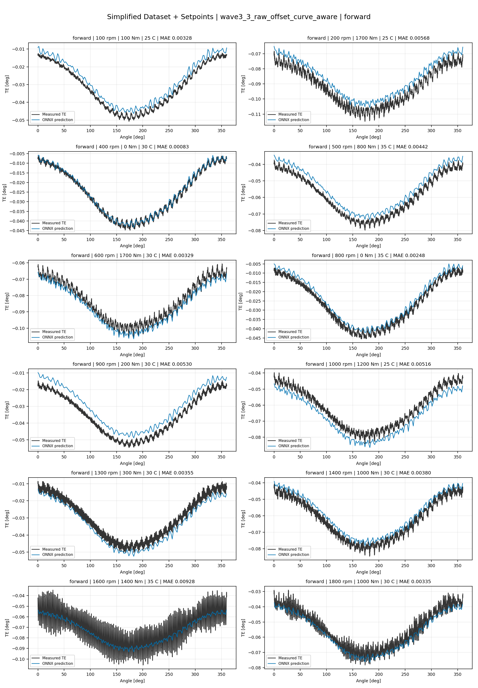
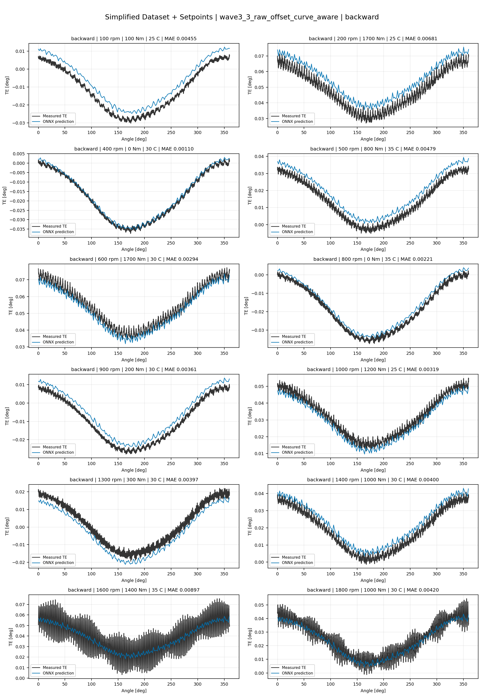
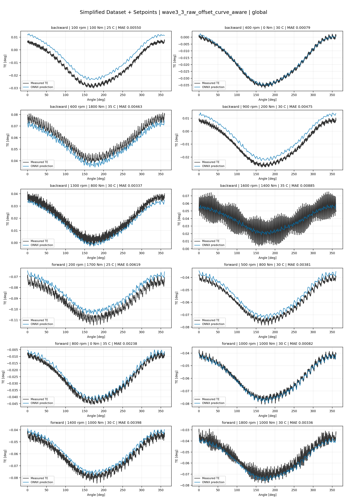
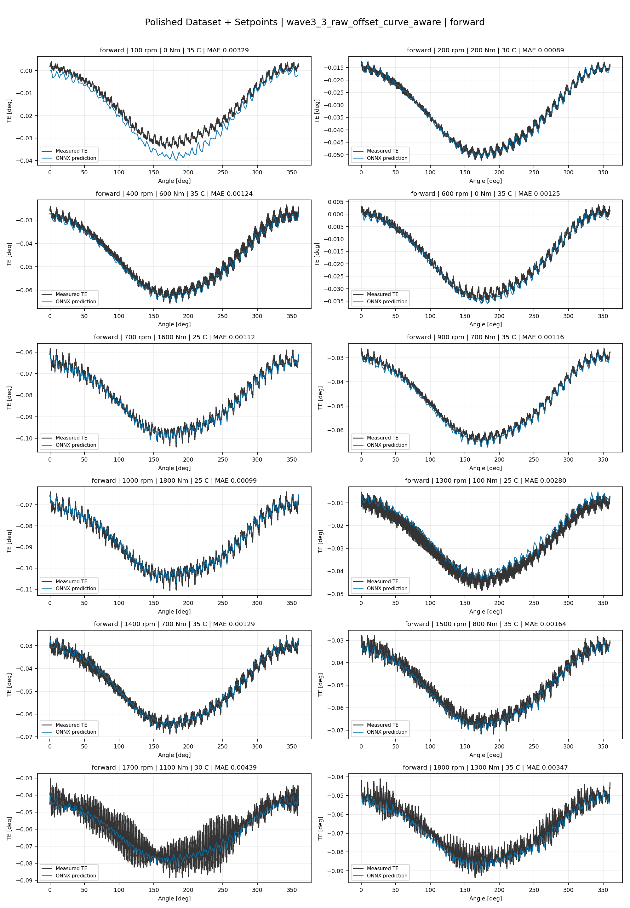
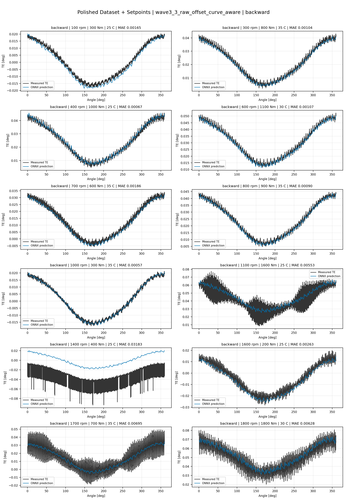
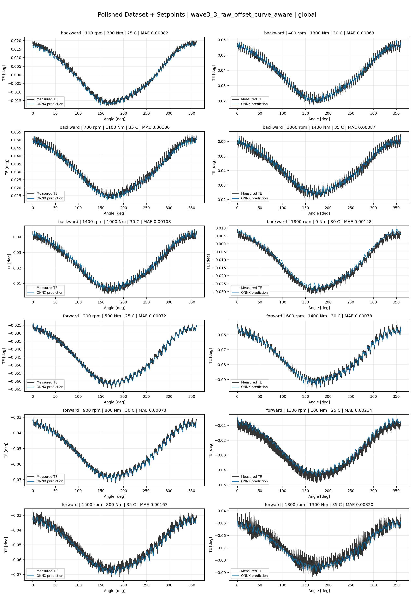
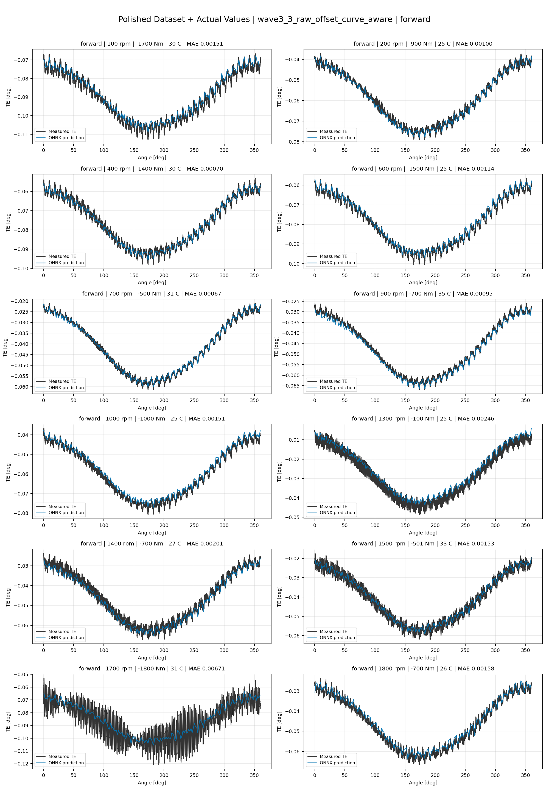
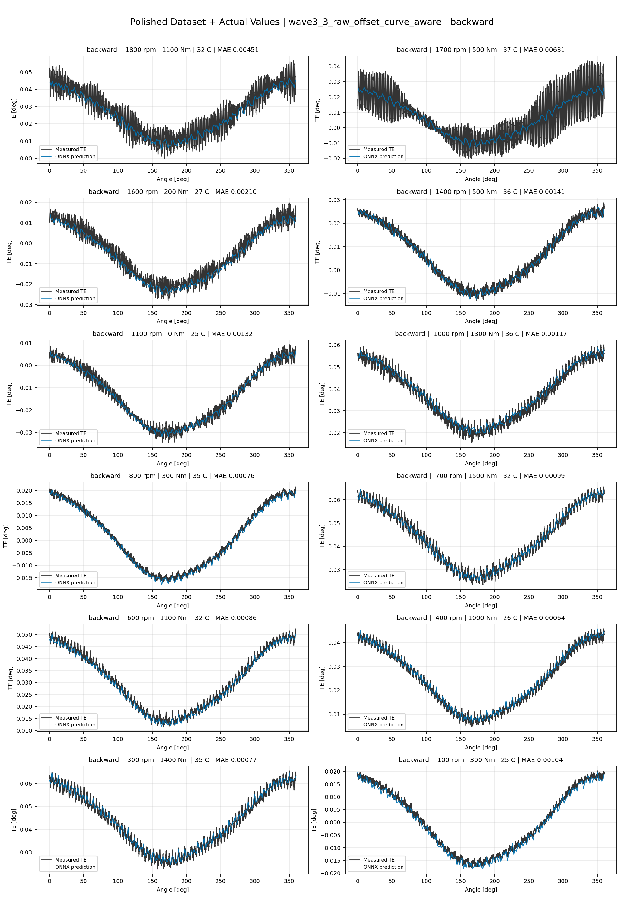
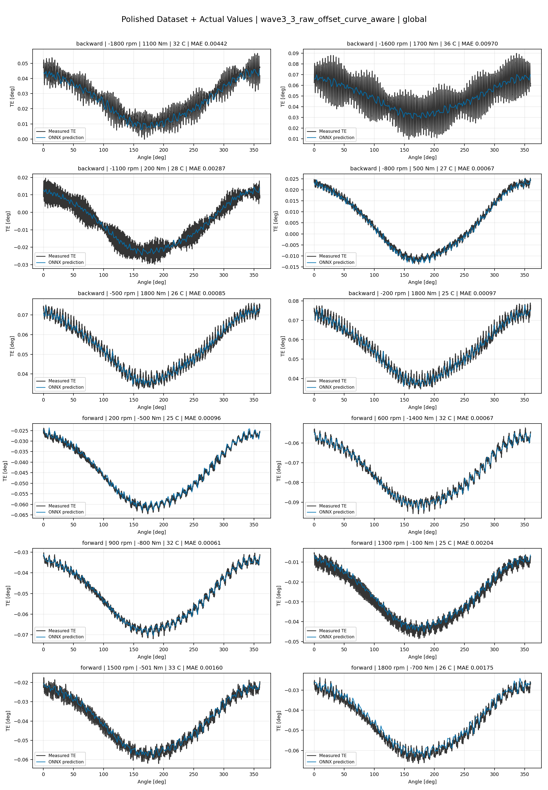

# TE Curve Verification Pipeline Familywise ONNX Report - wave3_3_raw_offset_curve_aware

## Overview

This report evaluates exported ONNX models from the dataset input-mode
retraining program. Each dataset/input-mode section uses dataset-matched
held-out test curves and lists the exact model artifacts loaded from
`models/`.

Rank-3 temporal ONNX exports are evaluated on the sequence-window test
contract stored in each `training_config.snapshot.yaml`, including
`sequence_length`, `sequence_stride`, `sequence_target_position`, and
`maximum_sequences_per_curve`.
The collage pages keep the measured TE trace at the original full-curve
resolution; temporal ONNX predictions are overlaid at the evaluated
sequence-target angles.

The report is diagnostic and family-specific. It does not replace an
official multi-index model-promotion decision.

## Output Artifacts

- output directory: `output/validation_checks/track2_familywise_onnx_report/wave3_3_raw_offset_curve_aware/2026-07-12-09-53-26__track2_wave3_3_raw_offset_curve_aware_familywise_onnx_report`;
- summary YAML: `output/validation_checks/track2_familywise_onnx_report/wave3_3_raw_offset_curve_aware/2026-07-12-09-53-26__track2_wave3_3_raw_offset_curve_aware_familywise_onnx_report/track2_familywise_onnx_report_summary.yaml`;
- model inventory CSV: `output/validation_checks/track2_familywise_onnx_report/wave3_3_raw_offset_curve_aware/2026-07-12-09-53-26__track2_wave3_3_raw_offset_curve_aware_familywise_onnx_report/model_inventory.csv`;
- per-curve metrics CSV: `output/validation_checks/track2_familywise_onnx_report/wave3_3_raw_offset_curve_aware/2026-07-12-09-53-26__track2_wave3_3_raw_offset_curve_aware_familywise_onnx_report/per_curve_metrics.csv`.

## Simplified Dataset + Setpoints

- dataset: `simplified_dataset`;
- input mode: `setpoints`;
- evaluated family: `wave3_3_raw_offset_curve_aware`;
- dataset root: `data/simplified_dataset`.

### Models Used

| Surface | Run Name | Run Instance | Dataset Schema |
| --- | --- | --- | --- |
| forward | `te_wave3_3_raw_offset_curve_aware_fw__simplified_setpoints` | `2026-07-11-22-26-25__te_wave3_3_raw_offset_curve_aware_fw__simplified_setpoints` | `simplified_curve_v1` |
| backward | `te_wave3_3_raw_offset_curve_aware_bw__simplified_setpoints` | `2026-07-11-22-59-48__te_wave3_3_raw_offset_curve_aware_bw__simplified_setpoints` | `simplified_curve_v1` |
| global | `te_wave3_3_raw_offset_curve_aware_global__simplified_setpoints` | `2026-07-11-21-48-20__te_wave3_3_raw_offset_curve_aware_global__simplified_setpoints` | `simplified_curve_v1` |

Exact model paths:

| Surface | ONNX Model Path | Python Model Path |
| --- | --- | --- |
| forward | `models/simplified_dataset/setpoints/wave3_3_raw_offset_curve_aware/forward/onnx/model.onnx` | `models/simplified_dataset/setpoints/wave3_3_raw_offset_curve_aware/forward/python/curve_aware_harmonic_residual_offset_probe-epoch=132-val_mae=0.00358121.ckpt` |
| backward | `models/simplified_dataset/setpoints/wave3_3_raw_offset_curve_aware/backward/onnx/model.onnx` | `models/simplified_dataset/setpoints/wave3_3_raw_offset_curve_aware/backward/python/curve_aware_harmonic_residual_offset_probe-epoch=145-val_mae=0.00357142.ckpt` |
| global | `models/simplified_dataset/setpoints/wave3_3_raw_offset_curve_aware/global/onnx/model.onnx` | `models/simplified_dataset/setpoints/wave3_3_raw_offset_curve_aware/global/python/curve_aware_harmonic_residual_offset_probe-epoch=159-val_mae=0.00354446.ckpt` |

### Aggregate Metrics

| Surface | Curves | MAE [deg] | RMSE [deg] | Mean Error [%] | P95 Error [%] |
| --- | ---: | ---: | ---: | ---: | ---: |
| forward | 97 | 0.003421 | 0.003699 | 8.001 | 13.729 |
| backward | 97 | 0.003497 | 0.003820 | 8.108 | 14.896 |
| global | 194 | 0.003501 | 0.003784 | 8.161 | 14.778 |

Offset And Shape Metrics:

| Surface | Signed Offset [deg] | Absolute Offset [deg] | Centered MAE [deg] | P2P Error [deg] |
| --- | ---: | ---: | ---: | ---: |
| forward | -0.000170 | 0.003056 | 0.001285 | 0.003107 |
| backward | 0.000460 | 0.002923 | 0.001538 | 0.003334 |
| global | 0.000111 | 0.002970 | 0.001388 | 0.003407 |

### Forward 12-Curve Page

### Backward 12-Curve Page

### Global 12-Curve Page

## Polished Dataset + Setpoints

- dataset: `polished_dataset`;
- input mode: `setpoints`;
- evaluated family: `wave3_3_raw_offset_curve_aware`;
- dataset root: `data/polished_dataset`.

### Models Used

| Surface | Run Name | Run Instance | Dataset Schema |
| --- | --- | --- | --- |
| forward | `te_wave3_3_raw_offset_curve_aware_fw__polished_setpoints` | `2026-07-12-00-23-59__te_wave3_3_raw_offset_curve_aware_fw__polished_setpoints` | `polished_setpoint_curve_v1` |
| backward | `te_wave3_3_raw_offset_curve_aware_bw__polished_setpoints` | `2026-07-12-00-59-31__te_wave3_3_raw_offset_curve_aware_bw__polished_setpoints` | `polished_setpoint_curve_v1` |
| global | `te_wave3_3_raw_offset_curve_aware_global__polished_setpoints` | `2026-07-11-23-47-11__te_wave3_3_raw_offset_curve_aware_global__polished_setpoints` | `polished_setpoint_curve_v1` |

Exact model paths:

| Surface | ONNX Model Path | Python Model Path |
| --- | --- | --- |
| forward | `models/polished_dataset/setpoints/wave3_3_raw_offset_curve_aware/forward/onnx/model.onnx` | `models/polished_dataset/setpoints/wave3_3_raw_offset_curve_aware/forward/python/curve_aware_harmonic_residual_offset_probe-epoch=119-val_mae=0.00195047.ckpt` |
| backward | `models/polished_dataset/setpoints/wave3_3_raw_offset_curve_aware/backward/onnx/model.onnx` | `models/polished_dataset/setpoints/wave3_3_raw_offset_curve_aware/backward/python/curve_aware_harmonic_residual_offset_probe-epoch=112-val_mae=0.00201121.ckpt` |
| global | `models/polished_dataset/setpoints/wave3_3_raw_offset_curve_aware/global/onnx/model.onnx` | `models/polished_dataset/setpoints/wave3_3_raw_offset_curve_aware/global/python/curve_aware_harmonic_residual_offset_probe-epoch=122-val_mae=0.00189514.ckpt` |

### Aggregate Metrics

| Surface | Curves | MAE [deg] | RMSE [deg] | Mean Error [%] | P95 Error [%] |
| --- | ---: | ---: | ---: | ---: | ---: |
| forward | 100 | 0.002048 | 0.002433 | 4.530 | 9.846 |
| backward | 94 | 0.002561 | 0.003002 | 4.711 | 10.783 |
| global | 194 | 0.002203 | 0.002608 | 4.389 | 10.783 |

Offset And Shape Metrics:

| Surface | Signed Offset [deg] | Absolute Offset [deg] | Centered MAE [deg] | P2P Error [deg] |
| --- | ---: | ---: | ---: | ---: |
| forward | -0.000515 | 0.001236 | 0.001578 | 0.003517 |
| backward | 0.000251 | 0.001103 | 0.002102 | 0.005874 |
| global | 0.000162 | 0.001002 | 0.001821 | 0.004606 |

### Forward 12-Curve Page

### Backward 12-Curve Page

### Global 12-Curve Page

## Polished Dataset + Actual Values

- dataset: `polished_dataset`;
- input mode: `actual_values`;
- evaluated family: `wave3_3_raw_offset_curve_aware`;
- dataset root: `data/polished_dataset`.

### Models Used

| Surface | Run Name | Run Instance | Dataset Schema |
| --- | --- | --- | --- |
| forward | `te_wave3_3_raw_offset_curve_aware_fw__polished_actual_values` | `2026-07-12-02-24-38__te_wave3_3_raw_offset_curve_aware_fw__polished_actual_values` | `polished_point_v1` |
| backward | `te_wave3_3_raw_offset_curve_aware_bw__polished_actual_values` | `2026-07-12-02-57-47__te_wave3_3_raw_offset_curve_aware_bw__polished_actual_values` | `polished_point_v1` |
| global | `te_wave3_3_raw_offset_curve_aware_global__polished_actual_values` | `2026-07-12-01-40-59__te_wave3_3_raw_offset_curve_aware_global__polished_actual_values` | `polished_point_v1` |

Exact model paths:

| Surface | ONNX Model Path | Python Model Path |
| --- | --- | --- |
| forward | `models/polished_dataset/actual_values/wave3_3_raw_offset_curve_aware/forward/onnx/model.onnx` | `models/polished_dataset/actual_values/wave3_3_raw_offset_curve_aware/forward/python/curve_aware_harmonic_residual_offset_probe-epoch=103-val_mae=0.00192801.ckpt` |
| backward | `models/polished_dataset/actual_values/wave3_3_raw_offset_curve_aware/backward/onnx/model.onnx` | `models/polished_dataset/actual_values/wave3_3_raw_offset_curve_aware/backward/python/curve_aware_harmonic_residual_offset_probe-epoch=199-val_mae=0.00184997.ckpt` |
| global | `models/polished_dataset/actual_values/wave3_3_raw_offset_curve_aware/global/onnx/model.onnx` | `models/polished_dataset/actual_values/wave3_3_raw_offset_curve_aware/global/python/curve_aware_harmonic_residual_offset_probe-epoch=155-val_mae=0.00187021.ckpt` |

### Aggregate Metrics

| Surface | Curves | MAE [deg] | RMSE [deg] | Mean Error [%] | P95 Error [%] |
| --- | ---: | ---: | ---: | ---: | ---: |
| forward | 100 | 0.001940 | 0.002313 | 4.284 | 9.624 |
| backward | 94 | 0.002175 | 0.002632 | 4.119 | 10.422 |
| global | 194 | 0.002001 | 0.002411 | 4.069 | 10.192 |

Offset And Shape Metrics:

| Surface | Signed Offset [deg] | Absolute Offset [deg] | Centered MAE [deg] | P2P Error [deg] |
| --- | ---: | ---: | ---: | ---: |
| forward | -0.000025 | 0.000969 | 0.001586 | 0.003856 |
| backward | -0.000091 | 0.000516 | 0.002086 | 0.005351 |
| global | -0.000033 | 0.000671 | 0.001817 | 0.004590 |

### Forward 12-Curve Page

### Backward 12-Curve Page

### Global 12-Curve Page

