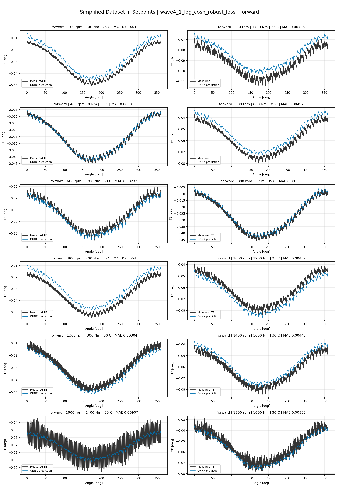
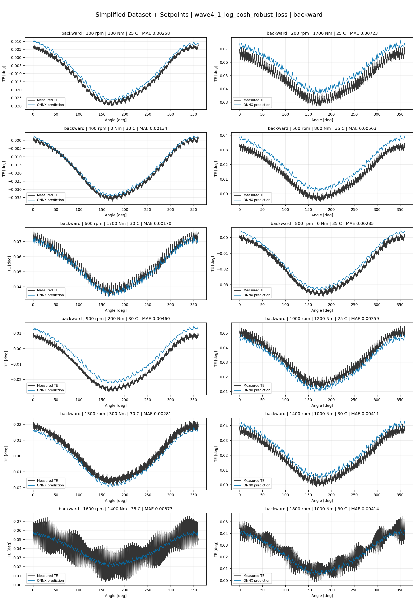
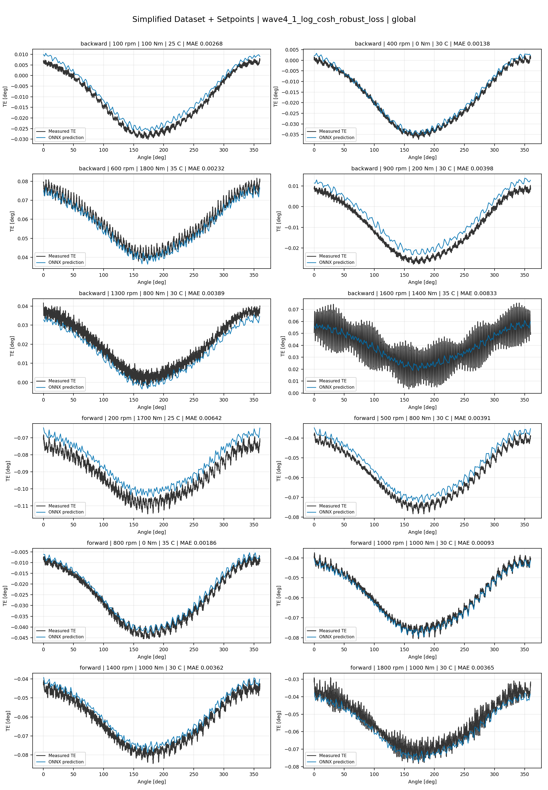
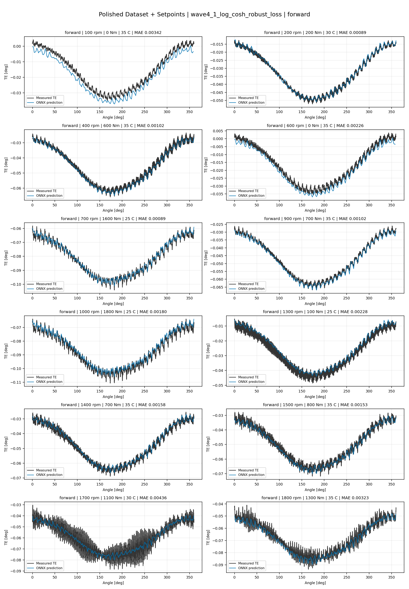
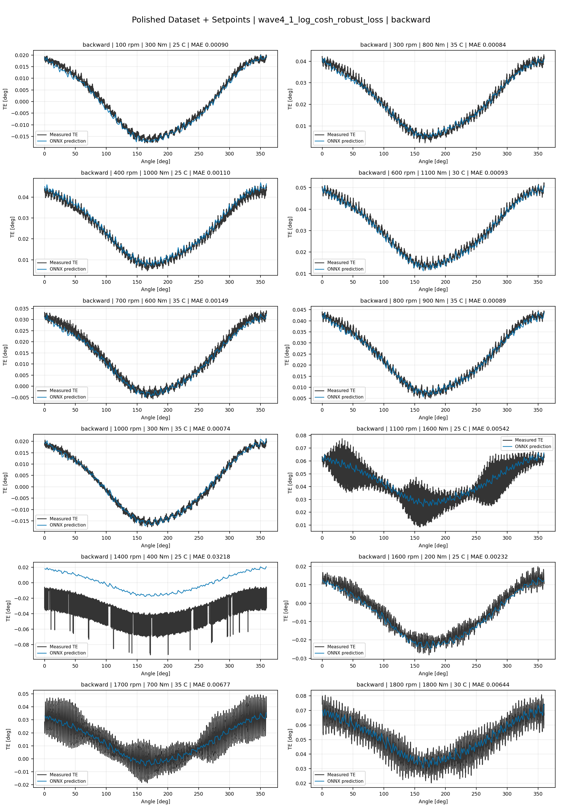
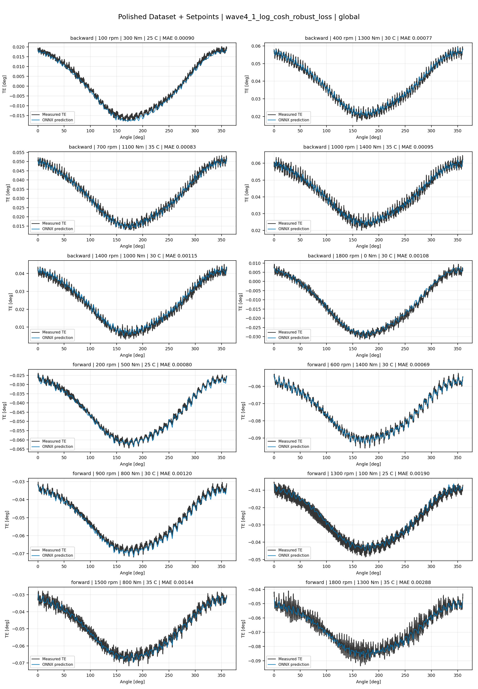
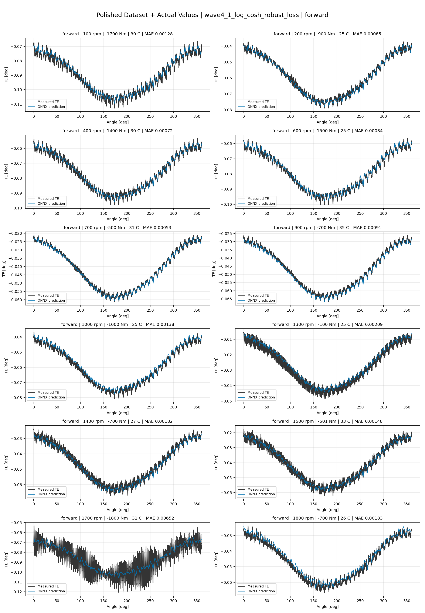
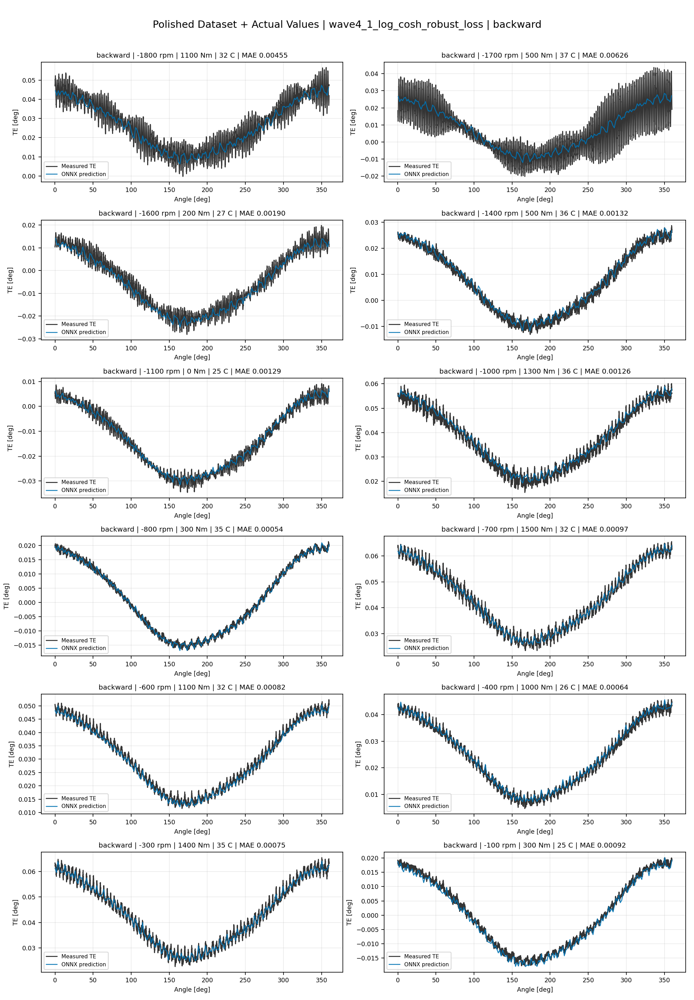
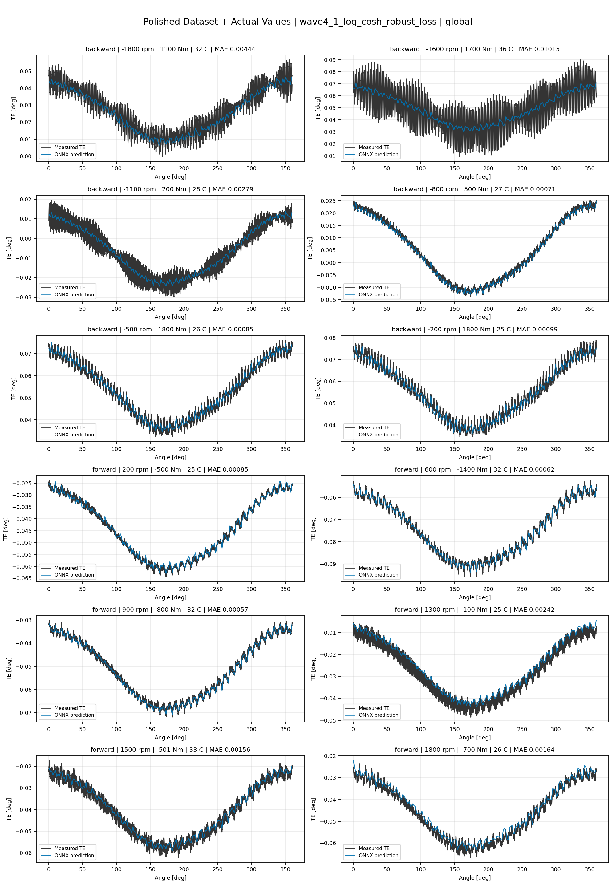

# TE Curve Verification Pipeline Familywise ONNX Report - wave4_1_log_cosh_robust_loss

## Overview

This report evaluates exported ONNX models from the dataset input-mode
retraining program. Each dataset/input-mode section uses dataset-matched
held-out test curves and lists the exact model artifacts loaded from
`models/`.

Rank-3 temporal ONNX exports are evaluated on the sequence-window test
contract stored in each `training_config.snapshot.yaml`, including
`sequence_length`, `sequence_stride`, `sequence_target_position`, and
`maximum_sequences_per_curve`.
The collage pages keep the measured TE trace at the original full-curve
resolution; temporal ONNX predictions are overlaid at the evaluated
sequence-target angles.

The report is diagnostic and family-specific. It does not replace an
official multi-index model-promotion decision.

## Output Artifacts

- output directory: `output/validation_checks/track2_familywise_onnx_report/wave4_1_log_cosh_robust_loss/2026-07-13-11-52-34__track2_wave4_1_log_cosh_robust_loss_familywise_onnx_report`;
- summary YAML: `output/validation_checks/track2_familywise_onnx_report/wave4_1_log_cosh_robust_loss/2026-07-13-11-52-34__track2_wave4_1_log_cosh_robust_loss_familywise_onnx_report/track2_familywise_onnx_report_summary.yaml`;
- model inventory CSV: `output/validation_checks/track2_familywise_onnx_report/wave4_1_log_cosh_robust_loss/2026-07-13-11-52-34__track2_wave4_1_log_cosh_robust_loss_familywise_onnx_report/model_inventory.csv`;
- per-curve metrics CSV: `output/validation_checks/track2_familywise_onnx_report/wave4_1_log_cosh_robust_loss/2026-07-13-11-52-34__track2_wave4_1_log_cosh_robust_loss_familywise_onnx_report/per_curve_metrics.csv`.

## Simplified Dataset + Setpoints

- dataset: `simplified_dataset`;
- input mode: `setpoints`;
- evaluated family: `wave4_1_log_cosh_robust_loss`;
- dataset root: `data/simplified_dataset`.

### Models Used

| Surface | Run Name | Run Instance | Dataset Schema |
| --- | --- | --- | --- |
| forward | `te_wave4_1_log_cosh_robust_loss_fw__simplified_setpoints` | `2026-07-13-03-10-51__te_wave4_1_log_cosh_robust_loss_fw__simplified_setpoints` | `simplified_curve_v1` |
| backward | `te_wave4_1_log_cosh_robust_loss_bw__simplified_setpoints` | `2026-07-13-04-12-33__te_wave4_1_log_cosh_robust_loss_bw__simplified_setpoints` | `simplified_curve_v1` |
| global | `te_wave4_1_log_cosh_robust_loss_global__simplified_setpoints` | `2026-07-13-02-40-42__te_wave4_1_log_cosh_robust_loss_global__simplified_setpoints` | `simplified_curve_v1` |

Exact model paths:

| Surface | ONNX Model Path | Python Model Path |
| --- | --- | --- |
| forward | `models/simplified_dataset/setpoints/exported/wave4_1_log_cosh_robust_loss/forward/2026-07-13-03-10-51__te_wave4_1_log_cosh_robust_loss_fw__simplified_setpoints/onnx/model.onnx` | `models/simplified_dataset/setpoints/exported/wave4_1_log_cosh_robust_loss/forward/2026-07-13-03-10-51__te_wave4_1_log_cosh_robust_loss_fw__simplified_setpoints/python/curve_aware_harmonic_residual_offset_probe-epoch=101-val_mae=0.00354228.ckpt` |
| backward | `models/simplified_dataset/setpoints/exported/wave4_1_log_cosh_robust_loss/backward/2026-07-13-04-12-33__te_wave4_1_log_cosh_robust_loss_bw__simplified_setpoints/onnx/model.onnx` | `models/simplified_dataset/setpoints/exported/wave4_1_log_cosh_robust_loss/backward/2026-07-13-04-12-33__te_wave4_1_log_cosh_robust_loss_bw__simplified_setpoints/python/curve_aware_harmonic_residual_offset_probe-epoch=099-val_mae=0.00352715.ckpt` |
| global | `models/simplified_dataset/setpoints/exported/wave4_1_log_cosh_robust_loss/global/2026-07-13-02-40-42__te_wave4_1_log_cosh_robust_loss_global__simplified_setpoints/onnx/model.onnx` | `models/simplified_dataset/setpoints/exported/wave4_1_log_cosh_robust_loss/global/2026-07-13-02-40-42__te_wave4_1_log_cosh_robust_loss_global__simplified_setpoints/python/curve_aware_harmonic_residual_offset_probe-epoch=120-val_mae=0.00357307.ckpt` |

### Aggregate Metrics

| Surface | Curves | MAE [deg] | RMSE [deg] | Mean Error [%] | P95 Error [%] |
| --- | ---: | ---: | ---: | ---: | ---: |
| forward | 97 | 0.003296 | 0.003584 | 7.713 | 13.598 |
| backward | 97 | 0.003455 | 0.003773 | 8.032 | 15.847 |
| global | 194 | 0.003339 | 0.003651 | 7.785 | 13.889 |

Offset And Shape Metrics:

| Surface | Signed Offset [deg] | Absolute Offset [deg] | Centered MAE [deg] | P2P Error [deg] |
| --- | ---: | ---: | ---: | ---: |
| forward | 0.000413 | 0.002894 | 0.001302 | 0.002898 |
| backward | 0.000821 | 0.002794 | 0.001534 | 0.003547 |
| global | -0.000001 | 0.002807 | 0.001447 | 0.003166 |

### Forward 12-Curve Page

### Backward 12-Curve Page

### Global 12-Curve Page

## Polished Dataset + Setpoints

- dataset: `polished_dataset`;
- input mode: `setpoints`;
- evaluated family: `wave4_1_log_cosh_robust_loss`;
- dataset root: `data/polished_dataset`.

### Models Used

| Surface | Run Name | Run Instance | Dataset Schema |
| --- | --- | --- | --- |
| forward | `te_wave4_1_log_cosh_robust_loss_fw__polished_setpoints` | `2026-07-13-07-40-29__te_wave4_1_log_cosh_robust_loss_fw__polished_setpoints` | `polished_setpoint_curve_v1` |
| backward | `te_wave4_1_log_cosh_robust_loss_bw__polished_setpoints` | `2026-07-13-08-11-55__te_wave4_1_log_cosh_robust_loss_bw__polished_setpoints` | `polished_setpoint_curve_v1` |
| global | `te_wave4_1_log_cosh_robust_loss_global__polished_setpoints` | `2026-07-13-05-22-10__te_wave4_1_log_cosh_robust_loss_global__polished_setpoints` | `polished_setpoint_curve_v1` |

Exact model paths:

| Surface | ONNX Model Path | Python Model Path |
| --- | --- | --- |
| forward | `models/polished_dataset/setpoints/exported/wave4_1_log_cosh_robust_loss/forward/2026-07-13-07-40-29__te_wave4_1_log_cosh_robust_loss_fw__polished_setpoints/onnx/model.onnx` | `models/polished_dataset/setpoints/exported/wave4_1_log_cosh_robust_loss/forward/2026-07-13-07-40-29__te_wave4_1_log_cosh_robust_loss_fw__polished_setpoints/python/curve_aware_harmonic_residual_offset_probe-epoch=089-val_mae=0.00196005.ckpt` |
| backward | `models/polished_dataset/setpoints/exported/wave4_1_log_cosh_robust_loss/backward/2026-07-13-08-11-55__te_wave4_1_log_cosh_robust_loss_bw__polished_setpoints/onnx/model.onnx` | `models/polished_dataset/setpoints/exported/wave4_1_log_cosh_robust_loss/backward/2026-07-13-08-11-55__te_wave4_1_log_cosh_robust_loss_bw__polished_setpoints/python/curve_aware_harmonic_residual_offset_probe-epoch=044-val_mae=0.00196637.ckpt` |
| global | `models/polished_dataset/setpoints/exported/wave4_1_log_cosh_robust_loss/global/2026-07-13-05-22-10__te_wave4_1_log_cosh_robust_loss_global__polished_setpoints/onnx/model.onnx` | `models/polished_dataset/setpoints/exported/wave4_1_log_cosh_robust_loss/global/2026-07-13-05-22-10__te_wave4_1_log_cosh_robust_loss_global__polished_setpoints/python/curve_aware_harmonic_residual_offset_probe-epoch=155-val_mae=0.00191211.ckpt` |

### Aggregate Metrics

| Surface | Curves | MAE [deg] | RMSE [deg] | Mean Error [%] | P95 Error [%] |
| --- | ---: | ---: | ---: | ---: | ---: |
| forward | 100 | 0.002048 | 0.002420 | 4.519 | 11.168 |
| backward | 94 | 0.002577 | 0.003039 | 4.750 | 10.910 |
| global | 194 | 0.002200 | 0.002596 | 4.382 | 10.716 |

Offset And Shape Metrics:

| Surface | Signed Offset [deg] | Absolute Offset [deg] | Centered MAE [deg] | P2P Error [deg] |
| --- | ---: | ---: | ---: | ---: |
| forward | 0.000164 | 0.001061 | 0.001600 | 0.003512 |
| backward | 0.000468 | 0.001011 | 0.002191 | 0.005570 |
| global | 0.000191 | 0.000969 | 0.001804 | 0.004798 |

### Forward 12-Curve Page

### Backward 12-Curve Page

### Global 12-Curve Page

## Polished Dataset + Actual Values

- dataset: `polished_dataset`;
- input mode: `actual_values`;
- evaluated family: `wave4_1_log_cosh_robust_loss`;
- dataset root: `data/polished_dataset`.

### Models Used

| Surface | Run Name | Run Instance | Dataset Schema |
| --- | --- | --- | --- |
| forward | `te_wave4_1_log_cosh_robust_loss_fw__polished_actual_values` | `2026-07-13-09-34-38__te_wave4_1_log_cosh_robust_loss_fw__polished_actual_values` | `polished_point_v1` |
| backward | `te_wave4_1_log_cosh_robust_loss_bw__polished_actual_values` | `2026-07-13-10-23-44__te_wave4_1_log_cosh_robust_loss_bw__polished_actual_values` | `polished_point_v1` |
| global | `te_wave4_1_log_cosh_robust_loss_global__polished_actual_values` | `2026-07-13-09-01-50__te_wave4_1_log_cosh_robust_loss_global__polished_actual_values` | `polished_point_v1` |

Exact model paths:

| Surface | ONNX Model Path | Python Model Path |
| --- | --- | --- |
| forward | `models/polished_dataset/actual_values/exported/wave4_1_log_cosh_robust_loss/forward/2026-07-13-09-34-38__te_wave4_1_log_cosh_robust_loss_fw__polished_actual_values/onnx/model.onnx` | `models/polished_dataset/actual_values/exported/wave4_1_log_cosh_robust_loss/forward/2026-07-13-09-34-38__te_wave4_1_log_cosh_robust_loss_fw__polished_actual_values/python/curve_aware_harmonic_residual_offset_probe-epoch=193-val_mae=0.00182691.ckpt` |
| backward | `models/polished_dataset/actual_values/exported/wave4_1_log_cosh_robust_loss/backward/2026-07-13-10-23-44__te_wave4_1_log_cosh_robust_loss_bw__polished_actual_values/onnx/model.onnx` | `models/polished_dataset/actual_values/exported/wave4_1_log_cosh_robust_loss/backward/2026-07-13-10-23-44__te_wave4_1_log_cosh_robust_loss_bw__polished_actual_values/python/curve_aware_harmonic_residual_offset_probe-epoch=127-val_mae=0.00187102.ckpt` |
| global | `models/polished_dataset/actual_values/exported/wave4_1_log_cosh_robust_loss/global/2026-07-13-09-01-50__te_wave4_1_log_cosh_robust_loss_global__polished_actual_values/onnx/model.onnx` | `models/polished_dataset/actual_values/exported/wave4_1_log_cosh_robust_loss/global/2026-07-13-09-01-50__te_wave4_1_log_cosh_robust_loss_global__polished_actual_values/python/curve_aware_harmonic_residual_offset_probe-epoch=110-val_mae=0.00189902.ckpt` |

### Aggregate Metrics

| Surface | Curves | MAE [deg] | RMSE [deg] | Mean Error [%] | P95 Error [%] |
| --- | ---: | ---: | ---: | ---: | ---: |
| forward | 100 | 0.001749 | 0.002110 | 3.797 | 9.128 |
| backward | 94 | 0.002218 | 0.002673 | 4.192 | 10.475 |
| global | 194 | 0.002046 | 0.002447 | 4.160 | 10.412 |

Offset And Shape Metrics:

| Surface | Signed Offset [deg] | Absolute Offset [deg] | Centered MAE [deg] | P2P Error [deg] |
| --- | ---: | ---: | ---: | ---: |
| forward | -0.000100 | 0.000726 | 0.001551 | 0.003920 |
| backward | 0.000205 | 0.000642 | 0.002107 | 0.005396 |
| global | 0.000075 | 0.000708 | 0.001818 | 0.004621 |

### Forward 12-Curve Page

### Backward 12-Curve Page

### Global 12-Curve Page

