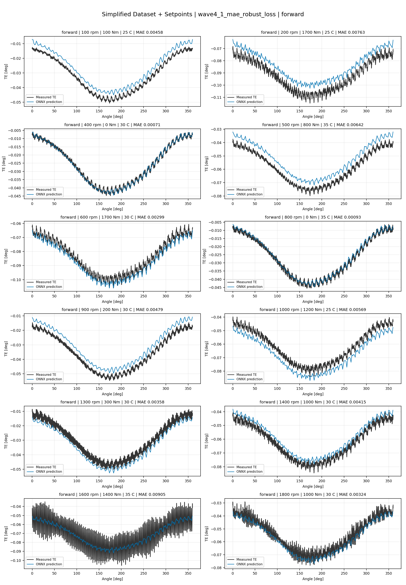
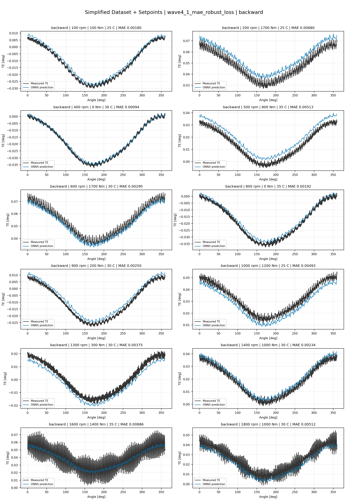
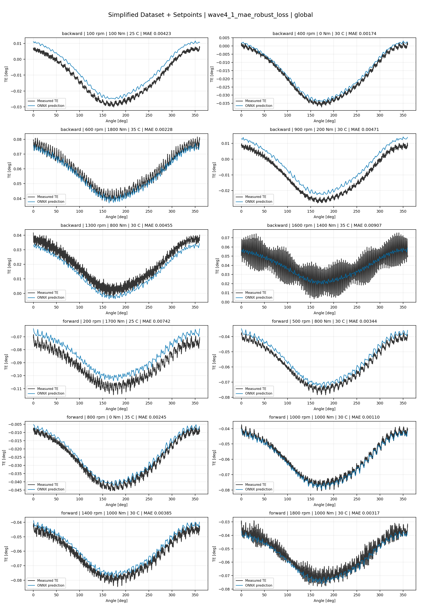
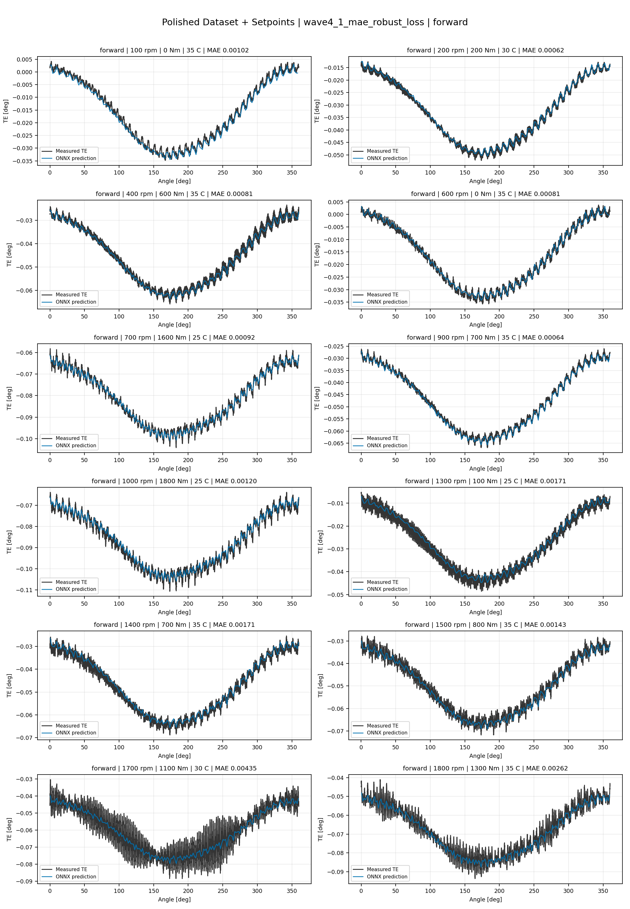
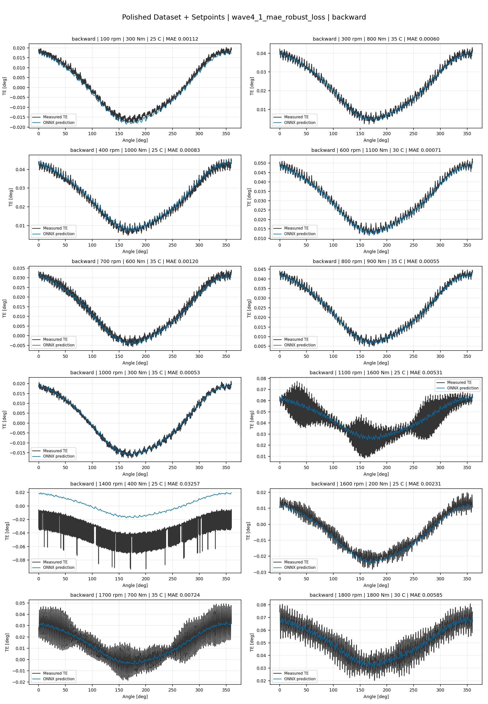
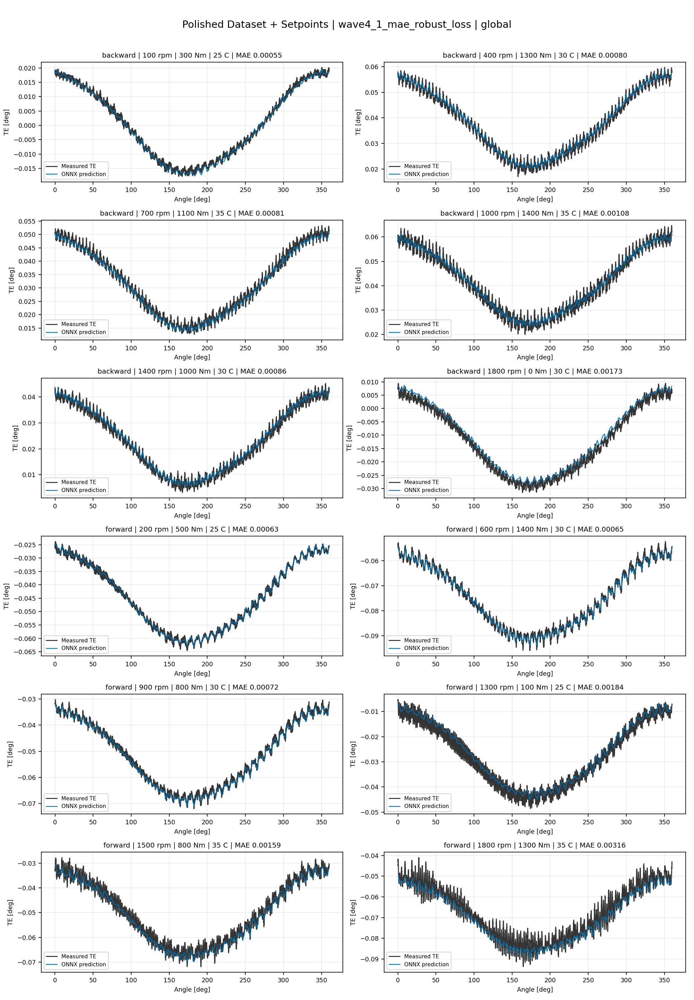
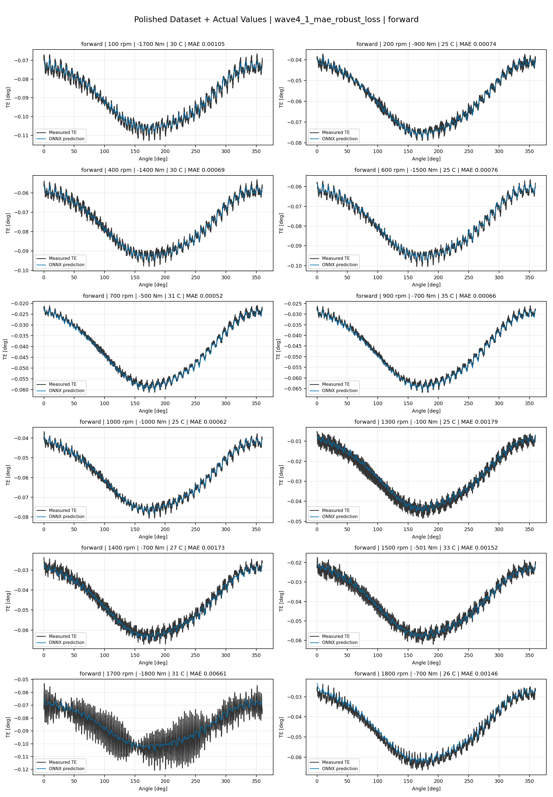
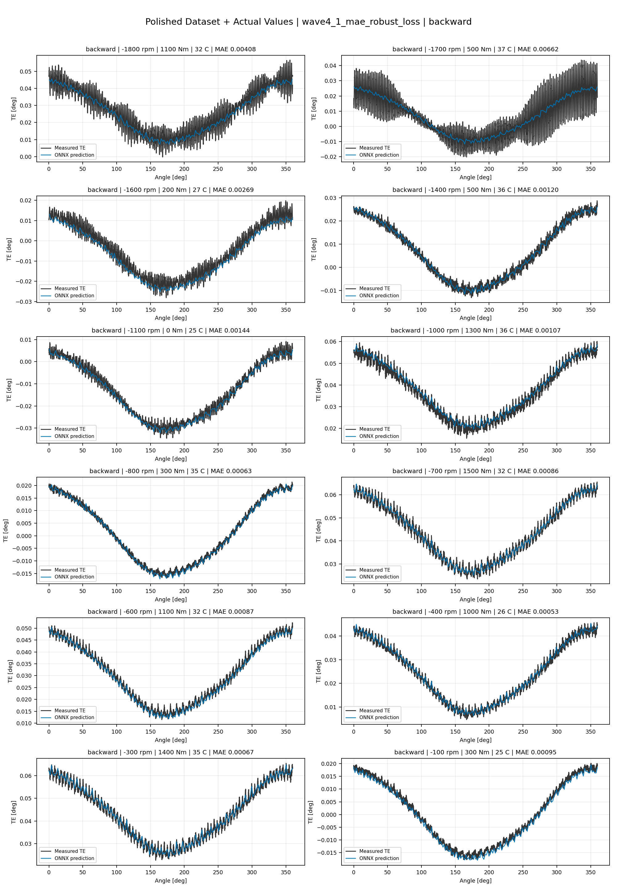
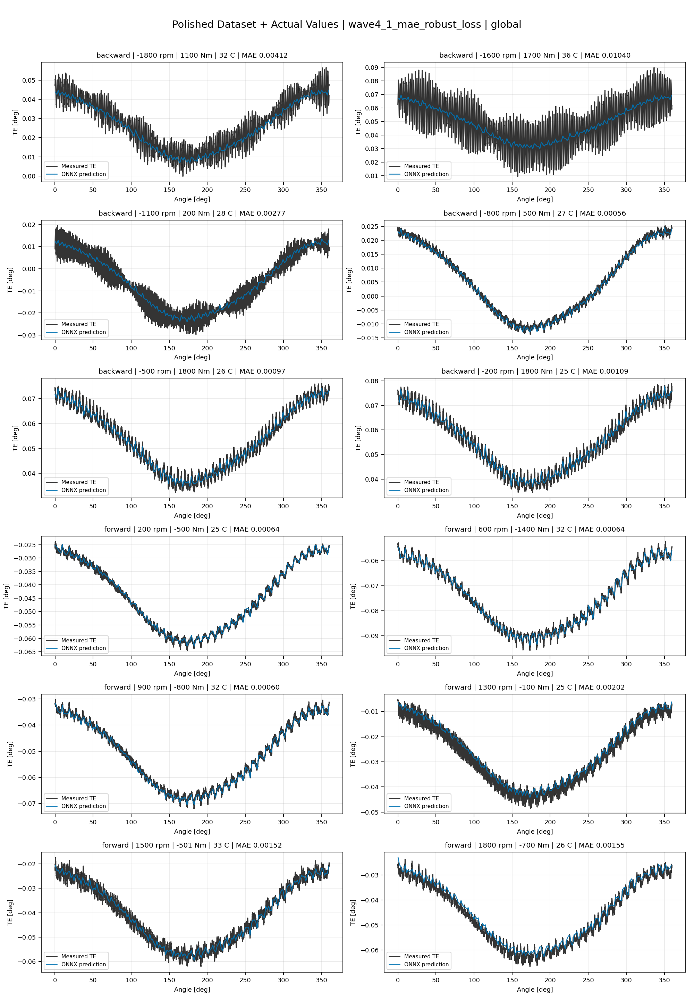

# TE Curve Verification Pipeline Familywise ONNX Report - wave4_1_mae_robust_loss

## Overview

This report evaluates exported ONNX models from the dataset input-mode
retraining program. Each dataset/input-mode section uses dataset-matched
held-out test curves and lists the exact model artifacts loaded from
`models/`.

Rank-3 temporal ONNX exports are evaluated on the sequence-window test
contract stored in each `training_config.snapshot.yaml`, including
`sequence_length`, `sequence_stride`, `sequence_target_position`, and
`maximum_sequences_per_curve`.
The collage pages keep the measured TE trace at the original full-curve
resolution; temporal ONNX predictions are overlaid at the evaluated
sequence-target angles.

The report is diagnostic and family-specific. It does not replace an
official multi-index model-promotion decision.

## Output Artifacts

- output directory: `output/validation_checks/track2_familywise_onnx_report/wave4_1_mae_robust_loss/2026-07-12-20-30-49__track2_wave4_1_mae_robust_loss_familywise_onnx_report`;
- summary YAML: `output/validation_checks/track2_familywise_onnx_report/wave4_1_mae_robust_loss/2026-07-12-20-30-49__track2_wave4_1_mae_robust_loss_familywise_onnx_report/track2_familywise_onnx_report_summary.yaml`;
- model inventory CSV: `output/validation_checks/track2_familywise_onnx_report/wave4_1_mae_robust_loss/2026-07-12-20-30-49__track2_wave4_1_mae_robust_loss_familywise_onnx_report/model_inventory.csv`;
- per-curve metrics CSV: `output/validation_checks/track2_familywise_onnx_report/wave4_1_mae_robust_loss/2026-07-12-20-30-49__track2_wave4_1_mae_robust_loss_familywise_onnx_report/per_curve_metrics.csv`.

## Simplified Dataset + Setpoints

- dataset: `simplified_dataset`;
- input mode: `setpoints`;
- evaluated family: `wave4_1_mae_robust_loss`;
- dataset root: `data/simplified_dataset`.

### Models Used

| Surface | Run Name | Run Instance | Dataset Schema |
| --- | --- | --- | --- |
| forward | `te_wave4_1_mae_robust_loss_fw__simplified_setpoints` | `2026-07-12-14-40-52__te_wave4_1_mae_robust_loss_fw__simplified_setpoints` | `simplified_curve_v1` |
| backward | `te_wave4_1_mae_robust_loss_bw__simplified_setpoints` | `2026-07-12-14-58-28__te_wave4_1_mae_robust_loss_bw__simplified_setpoints` | `simplified_curve_v1` |
| global | `te_wave4_1_mae_robust_loss_global__simplified_setpoints` | `2026-07-12-14-11-27__te_wave4_1_mae_robust_loss_global__simplified_setpoints` | `simplified_curve_v1` |

Exact model paths:

| Surface | ONNX Model Path | Python Model Path |
| --- | --- | --- |
| forward | `models/simplified_dataset/setpoints/wave4_1_mae_robust_loss/forward/onnx/model.onnx` | `models/simplified_dataset/setpoints/wave4_1_mae_robust_loss/forward/python/curve_aware_harmonic_residual_offset_probe-epoch=085-val_mae=0.00364418.ckpt` |
| backward | `models/simplified_dataset/setpoints/wave4_1_mae_robust_loss/backward/onnx/model.onnx` | `models/simplified_dataset/setpoints/wave4_1_mae_robust_loss/backward/python/curve_aware_harmonic_residual_offset_probe-epoch=073-val_mae=0.00358581.ckpt` |
| global | `models/simplified_dataset/setpoints/wave4_1_mae_robust_loss/global/onnx/model.onnx` | `models/simplified_dataset/setpoints/wave4_1_mae_robust_loss/global/python/curve_aware_harmonic_residual_offset_probe-epoch=143-val_mae=0.00355510.ckpt` |

### Aggregate Metrics

| Surface | Curves | MAE [deg] | RMSE [deg] | Mean Error [%] | P95 Error [%] |
| --- | ---: | ---: | ---: | ---: | ---: |
| forward | 97 | 0.003379 | 0.003646 | 7.902 | 14.678 |
| backward | 97 | 0.003517 | 0.003848 | 8.147 | 13.666 |
| global | 194 | 0.003478 | 0.003764 | 8.119 | 15.898 |

Offset And Shape Metrics:

| Surface | Signed Offset [deg] | Absolute Offset [deg] | Centered MAE [deg] | P2P Error [deg] |
| --- | ---: | ---: | ---: | ---: |
| forward | 0.000197 | 0.002973 | 0.001248 | 0.002730 |
| backward | -0.000173 | 0.002941 | 0.001554 | 0.003494 |
| global | 0.000479 | 0.002966 | 0.001377 | 0.003504 |

### Forward 12-Curve Page

### Backward 12-Curve Page

### Global 12-Curve Page

## Polished Dataset + Setpoints

- dataset: `polished_dataset`;
- input mode: `setpoints`;
- evaluated family: `wave4_1_mae_robust_loss`;
- dataset root: `data/polished_dataset`.

### Models Used

| Surface | Run Name | Run Instance | Dataset Schema |
| --- | --- | --- | --- |
| forward | `te_wave4_1_mae_robust_loss_fw__polished_setpoints` | `2026-07-12-16-19-34__te_wave4_1_mae_robust_loss_fw__polished_setpoints` | `polished_setpoint_curve_v1` |
| backward | `te_wave4_1_mae_robust_loss_bw__polished_setpoints` | `2026-07-12-16-51-03__te_wave4_1_mae_robust_loss_bw__polished_setpoints` | `polished_setpoint_curve_v1` |
| global | `te_wave4_1_mae_robust_loss_global__polished_setpoints` | `2026-07-12-15-32-30__te_wave4_1_mae_robust_loss_global__polished_setpoints` | `polished_setpoint_curve_v1` |

Exact model paths:

| Surface | ONNX Model Path | Python Model Path |
| --- | --- | --- |
| forward | `models/polished_dataset/setpoints/wave4_1_mae_robust_loss/forward/onnx/model.onnx` | `models/polished_dataset/setpoints/wave4_1_mae_robust_loss/forward/python/curve_aware_harmonic_residual_offset_probe-epoch=105-val_mae=0.00179190.ckpt` |
| backward | `models/polished_dataset/setpoints/wave4_1_mae_robust_loss/backward/onnx/model.onnx` | `models/polished_dataset/setpoints/wave4_1_mae_robust_loss/backward/python/curve_aware_harmonic_residual_offset_probe-epoch=088-val_mae=0.00183184.ckpt` |
| global | `models/polished_dataset/setpoints/wave4_1_mae_robust_loss/global/onnx/model.onnx` | `models/polished_dataset/setpoints/wave4_1_mae_robust_loss/global/python/curve_aware_harmonic_residual_offset_probe-epoch=178-val_mae=0.00178795.ckpt` |

### Aggregate Metrics

| Surface | Curves | MAE [deg] | RMSE [deg] | Mean Error [%] | P95 Error [%] |
| --- | ---: | ---: | ---: | ---: | ---: |
| forward | 100 | 0.001752 | 0.002090 | 3.802 | 9.578 |
| backward | 94 | 0.002451 | 0.002873 | 4.398 | 10.887 |
| global | 194 | 0.002113 | 0.002496 | 4.137 | 10.977 |

Offset And Shape Metrics:

| Surface | Signed Offset [deg] | Absolute Offset [deg] | Centered MAE [deg] | P2P Error [deg] |
| --- | ---: | ---: | ---: | ---: |
| forward | 0.000037 | 0.000722 | 0.001479 | 0.004239 |
| backward | 0.000492 | 0.000903 | 0.002060 | 0.006463 |
| global | 0.000183 | 0.000884 | 0.001774 | 0.005181 |

### Forward 12-Curve Page

### Backward 12-Curve Page

### Global 12-Curve Page

## Polished Dataset + Actual Values

- dataset: `polished_dataset`;
- input mode: `actual_values`;
- evaluated family: `wave4_1_mae_robust_loss`;
- dataset root: `data/polished_dataset`.

### Models Used

| Surface | Run Name | Run Instance | Dataset Schema |
| --- | --- | --- | --- |
| forward | `te_wave4_1_mae_robust_loss_fw__polished_actual_values` | `2026-07-12-18-19-09__te_wave4_1_mae_robust_loss_fw__polished_actual_values` | `polished_point_v1` |
| backward | `te_wave4_1_mae_robust_loss_bw__polished_actual_values` | `2026-07-12-19-08-24__te_wave4_1_mae_robust_loss_bw__polished_actual_values` | `polished_point_v1` |
| global | `te_wave4_1_mae_robust_loss_global__polished_actual_values` | `2026-07-12-17-35-21__te_wave4_1_mae_robust_loss_global__polished_actual_values` | `polished_point_v1` |

Exact model paths:

| Surface | ONNX Model Path | Python Model Path |
| --- | --- | --- |
| forward | `models/polished_dataset/actual_values/wave4_1_mae_robust_loss/forward/onnx/model.onnx` | `models/polished_dataset/actual_values/wave4_1_mae_robust_loss/forward/python/curve_aware_harmonic_residual_offset_probe-epoch=202-val_mae=0.00173420.ckpt` |
| backward | `models/polished_dataset/actual_values/wave4_1_mae_robust_loss/backward/onnx/model.onnx` | `models/polished_dataset/actual_values/wave4_1_mae_robust_loss/backward/python/curve_aware_harmonic_residual_offset_probe-epoch=173-val_mae=0.00178689.ckpt` |
| global | `models/polished_dataset/actual_values/wave4_1_mae_robust_loss/global/onnx/model.onnx` | `models/polished_dataset/actual_values/wave4_1_mae_robust_loss/global/python/curve_aware_harmonic_residual_offset_probe-epoch=157-val_mae=0.00176826.ckpt` |

### Aggregate Metrics

| Surface | Curves | MAE [deg] | RMSE [deg] | Mean Error [%] | P95 Error [%] |
| --- | ---: | ---: | ---: | ---: | ---: |
| forward | 100 | 0.001665 | 0.002011 | 3.578 | 9.042 |
| backward | 94 | 0.002317 | 0.002781 | 4.206 | 10.793 |
| global | 194 | 0.002047 | 0.002425 | 3.976 | 10.692 |

Offset And Shape Metrics:

| Surface | Signed Offset [deg] | Absolute Offset [deg] | Centered MAE [deg] | P2P Error [deg] |
| --- | ---: | ---: | ---: | ---: |
| forward | -0.000323 | 0.000683 | 0.001492 | 0.004216 |
| backward | 0.000165 | 0.000736 | 0.002115 | 0.006064 |
| global | -0.000016 | 0.000777 | 0.001757 | 0.005181 |

### Forward 12-Curve Page

### Backward 12-Curve Page

### Global 12-Curve Page

