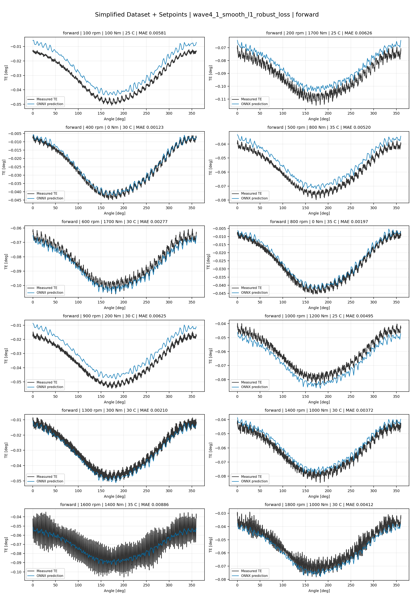
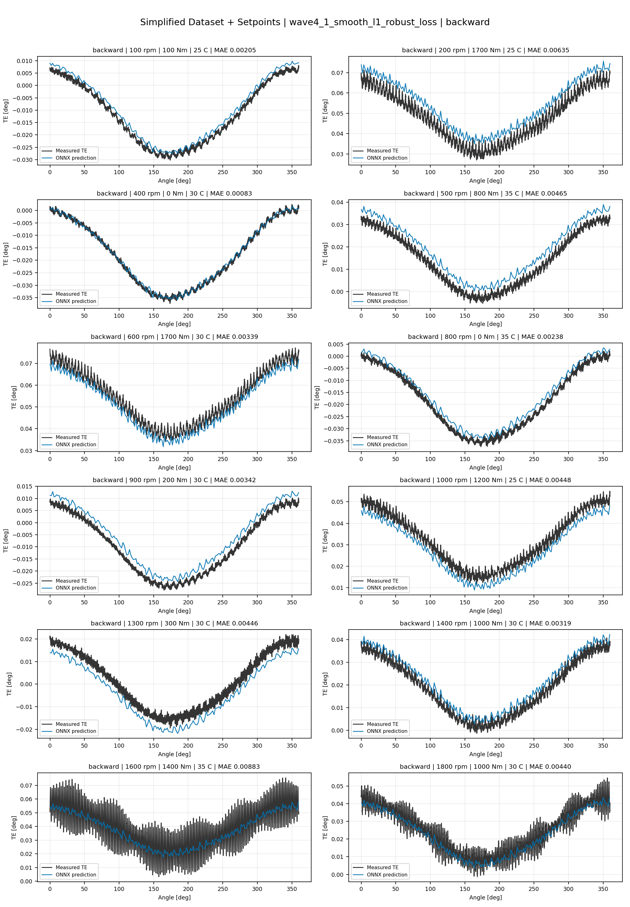
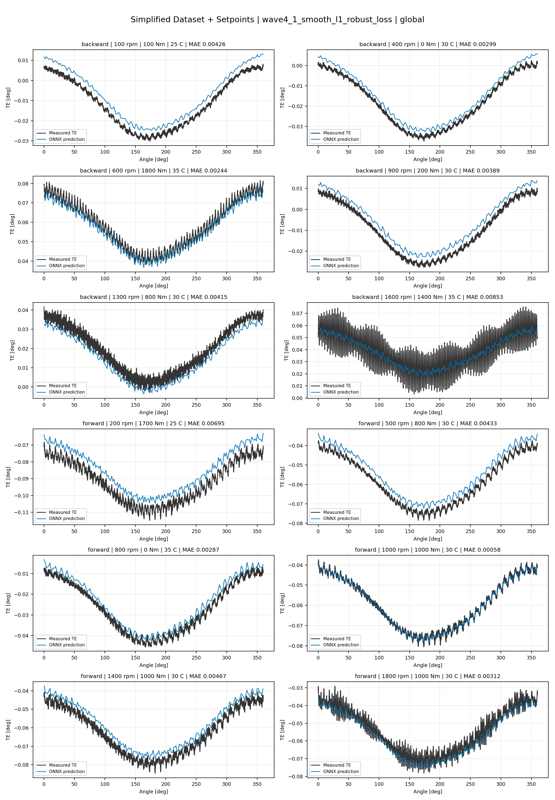
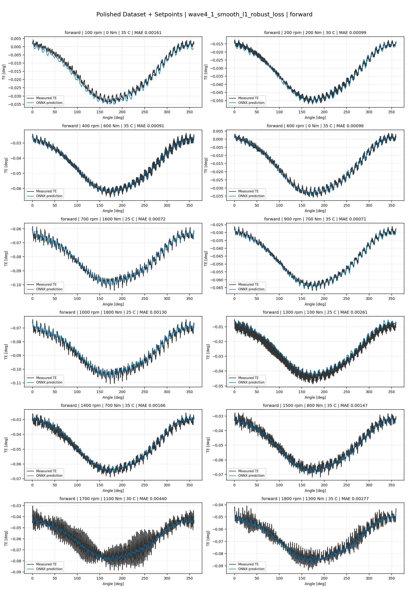
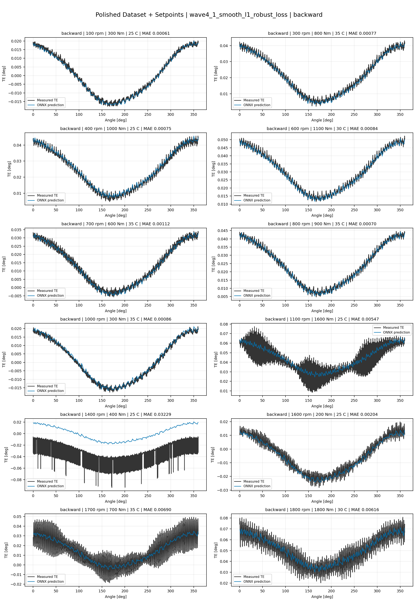
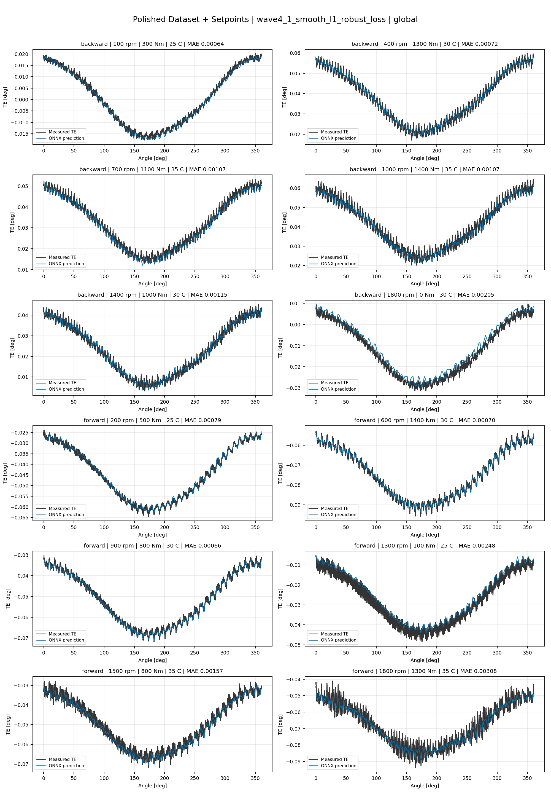
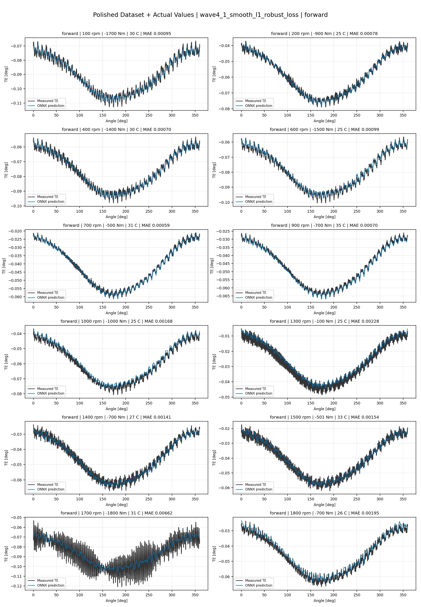
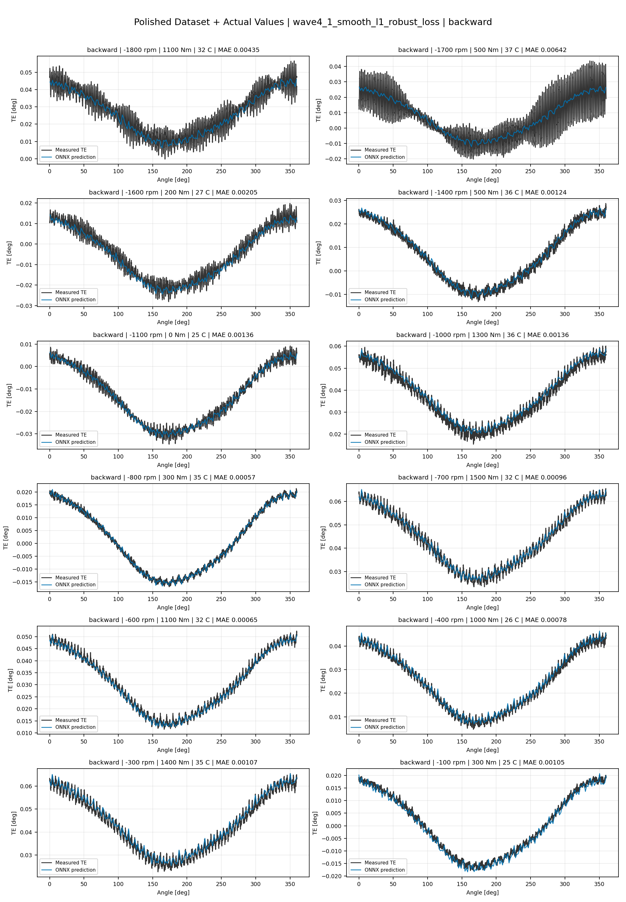
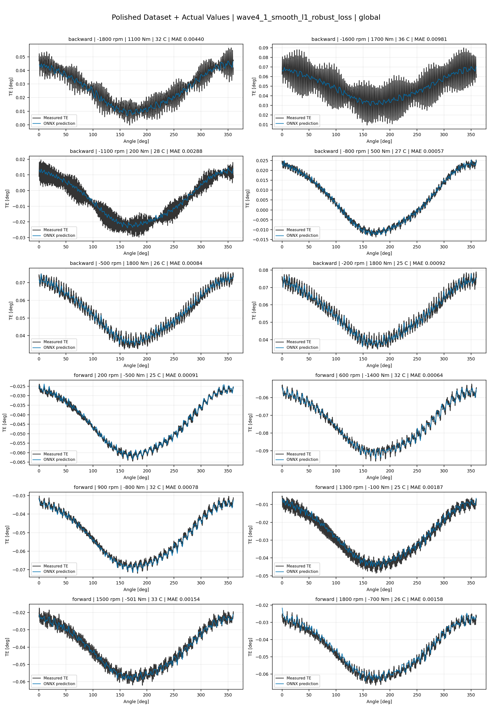

# TE Curve Verification Pipeline Familywise ONNX Report - wave4_1_smooth_l1_robust_loss

## Overview

This report evaluates exported ONNX models from the dataset input-mode
retraining program. Each dataset/input-mode section uses dataset-matched
held-out test curves and lists the exact model artifacts loaded from
`models/`.

Rank-3 temporal ONNX exports are evaluated on the sequence-window test
contract stored in each `training_config.snapshot.yaml`, including
`sequence_length`, `sequence_stride`, `sequence_target_position`, and
`maximum_sequences_per_curve`.
The collage pages keep the measured TE trace at the original full-curve
resolution; temporal ONNX predictions are overlaid at the evaluated
sequence-target angles.

The report is diagnostic and family-specific. It does not replace an
official multi-index model-promotion decision.

## Output Artifacts

- output directory: `output/validation_checks/track2_familywise_onnx_report/wave4_1_smooth_l1_robust_loss/2026-07-13-09-08-55__track2_wave4_1_smooth_l1_robust_loss_familywise_onnx_report`;
- summary YAML: `output/validation_checks/track2_familywise_onnx_report/wave4_1_smooth_l1_robust_loss/2026-07-13-09-08-55__track2_wave4_1_smooth_l1_robust_loss_familywise_onnx_report/track2_familywise_onnx_report_summary.yaml`;
- model inventory CSV: `output/validation_checks/track2_familywise_onnx_report/wave4_1_smooth_l1_robust_loss/2026-07-13-09-08-55__track2_wave4_1_smooth_l1_robust_loss_familywise_onnx_report/model_inventory.csv`;
- per-curve metrics CSV: `output/validation_checks/track2_familywise_onnx_report/wave4_1_smooth_l1_robust_loss/2026-07-13-09-08-55__track2_wave4_1_smooth_l1_robust_loss_familywise_onnx_report/per_curve_metrics.csv`.

## Simplified Dataset + Setpoints

- dataset: `simplified_dataset`;
- input mode: `setpoints`;
- evaluated family: `wave4_1_smooth_l1_robust_loss`;
- dataset root: `data/simplified_dataset`.

### Models Used

| Surface | Run Name | Run Instance | Dataset Schema |
| --- | --- | --- | --- |
| forward | `te_wave4_1_smooth_l1_robust_loss_fw__simplified_setpoints` | `2026-07-12-20-38-09__te_wave4_1_smooth_l1_robust_loss_fw__simplified_setpoints` | `simplified_curve_v1` |
| backward | `te_wave4_1_smooth_l1_robust_loss_bw__simplified_setpoints` | `2026-07-12-21-02-43__te_wave4_1_smooth_l1_robust_loss_bw__simplified_setpoints` | `simplified_curve_v1` |
| global | `te_wave4_1_smooth_l1_robust_loss_global__simplified_setpoints` | `2026-07-12-20-13-14__te_wave4_1_smooth_l1_robust_loss_global__simplified_setpoints` | `simplified_curve_v1` |

Exact model paths:

| Surface | ONNX Model Path | Python Model Path |
| --- | --- | --- |
| forward | `models/simplified_dataset/setpoints/exported/wave4_1_smooth_l1_robust_loss/forward/2026-07-12-20-38-09__te_wave4_1_smooth_l1_robust_loss_fw__simplified_setpoints/onnx/model.onnx` | `models/simplified_dataset/setpoints/exported/wave4_1_smooth_l1_robust_loss/forward/2026-07-12-20-38-09__te_wave4_1_smooth_l1_robust_loss_fw__simplified_setpoints/python/curve_aware_harmonic_residual_offset_probe-epoch=086-val_mae=0.00353570.ckpt` |
| backward | `models/simplified_dataset/setpoints/exported/wave4_1_smooth_l1_robust_loss/backward/2026-07-12-21-02-43__te_wave4_1_smooth_l1_robust_loss_bw__simplified_setpoints/onnx/model.onnx` | `models/simplified_dataset/setpoints/exported/wave4_1_smooth_l1_robust_loss/backward/2026-07-12-21-02-43__te_wave4_1_smooth_l1_robust_loss_bw__simplified_setpoints/python/curve_aware_harmonic_residual_offset_probe-epoch=142-val_mae=0.00357827.ckpt` |
| global | `models/simplified_dataset/setpoints/exported/wave4_1_smooth_l1_robust_loss/global/2026-07-12-20-13-14__te_wave4_1_smooth_l1_robust_loss_global__simplified_setpoints/onnx/model.onnx` | `models/simplified_dataset/setpoints/exported/wave4_1_smooth_l1_robust_loss/global/2026-07-12-20-13-14__te_wave4_1_smooth_l1_robust_loss_global__simplified_setpoints/python/curve_aware_harmonic_residual_offset_probe-epoch=087-val_mae=0.00364010.ckpt` |

### Aggregate Metrics

| Surface | Curves | MAE [deg] | RMSE [deg] | Mean Error [%] | P95 Error [%] |
| --- | ---: | ---: | ---: | ---: | ---: |
| forward | 97 | 0.003305 | 0.003598 | 7.750 | 14.360 |
| backward | 97 | 0.003527 | 0.003848 | 8.180 | 13.736 |
| global | 194 | 0.003373 | 0.003685 | 7.861 | 14.039 |

Offset And Shape Metrics:

| Surface | Signed Offset [deg] | Absolute Offset [deg] | Centered MAE [deg] | P2P Error [deg] |
| --- | ---: | ---: | ---: | ---: |
| forward | 0.000344 | 0.002896 | 0.001326 | 0.002823 |
| backward | -0.000246 | 0.002952 | 0.001533 | 0.003340 |
| global | 0.000554 | 0.002878 | 0.001431 | 0.003093 |

### Forward 12-Curve Page

### Backward 12-Curve Page

### Global 12-Curve Page

## Polished Dataset + Setpoints

- dataset: `polished_dataset`;
- input mode: `setpoints`;
- evaluated family: `wave4_1_smooth_l1_robust_loss`;
- dataset root: `data/polished_dataset`.

### Models Used

| Surface | Run Name | Run Instance | Dataset Schema |
| --- | --- | --- | --- |
| forward | `te_wave4_1_smooth_l1_robust_loss_fw__polished_setpoints` | `2026-07-12-23-00-14__te_wave4_1_smooth_l1_robust_loss_fw__polished_setpoints` | `polished_setpoint_curve_v1` |
| backward | `te_wave4_1_smooth_l1_robust_loss_bw__polished_setpoints` | `2026-07-12-23-26-15__te_wave4_1_smooth_l1_robust_loss_bw__polished_setpoints` | `polished_setpoint_curve_v1` |
| global | `te_wave4_1_smooth_l1_robust_loss_global__polished_setpoints` | `2026-07-12-22-12-14__te_wave4_1_smooth_l1_robust_loss_global__polished_setpoints` | `polished_setpoint_curve_v1` |

Exact model paths:

| Surface | ONNX Model Path | Python Model Path |
| --- | --- | --- |
| forward | `models/polished_dataset/setpoints/exported/wave4_1_smooth_l1_robust_loss/forward/2026-07-12-23-00-14__te_wave4_1_smooth_l1_robust_loss_fw__polished_setpoints/onnx/model.onnx` | `models/polished_dataset/setpoints/exported/wave4_1_smooth_l1_robust_loss/forward/2026-07-12-23-00-14__te_wave4_1_smooth_l1_robust_loss_fw__polished_setpoints/python/curve_aware_harmonic_residual_offset_probe-epoch=079-val_mae=0.00192933.ckpt` |
| backward | `models/polished_dataset/setpoints/exported/wave4_1_smooth_l1_robust_loss/backward/2026-07-12-23-26-15__te_wave4_1_smooth_l1_robust_loss_bw__polished_setpoints/onnx/model.onnx` | `models/polished_dataset/setpoints/exported/wave4_1_smooth_l1_robust_loss/backward/2026-07-12-23-26-15__te_wave4_1_smooth_l1_robust_loss_bw__polished_setpoints/python/curve_aware_harmonic_residual_offset_probe-epoch=115-val_mae=0.00193797.ckpt` |
| global | `models/polished_dataset/setpoints/exported/wave4_1_smooth_l1_robust_loss/global/2026-07-12-22-12-14__te_wave4_1_smooth_l1_robust_loss_global__polished_setpoints/onnx/model.onnx` | `models/polished_dataset/setpoints/exported/wave4_1_smooth_l1_robust_loss/global/2026-07-12-22-12-14__te_wave4_1_smooth_l1_robust_loss_global__polished_setpoints/python/curve_aware_harmonic_residual_offset_probe-epoch=143-val_mae=0.00190163.ckpt` |

### Aggregate Metrics

| Surface | Curves | MAE [deg] | RMSE [deg] | Mean Error [%] | P95 Error [%] |
| --- | ---: | ---: | ---: | ---: | ---: |
| forward | 100 | 0.001947 | 0.002307 | 4.279 | 9.489 |
| backward | 94 | 0.002523 | 0.002967 | 4.608 | 10.754 |
| global | 194 | 0.002182 | 0.002583 | 4.338 | 10.860 |

Offset And Shape Metrics:

| Surface | Signed Offset [deg] | Absolute Offset [deg] | Centered MAE [deg] | P2P Error [deg] |
| --- | ---: | ---: | ---: | ---: |
| forward | 0.000150 | 0.001029 | 0.001532 | 0.003657 |
| backward | 0.000721 | 0.001053 | 0.002113 | 0.005803 |
| global | 0.000287 | 0.000914 | 0.001828 | 0.004512 |

### Forward 12-Curve Page

### Backward 12-Curve Page

### Global 12-Curve Page

## Polished Dataset + Actual Values

- dataset: `polished_dataset`;
- input mode: `actual_values`;
- evaluated family: `wave4_1_smooth_l1_robust_loss`;
- dataset root: `data/polished_dataset`.

### Models Used

| Surface | Run Name | Run Instance | Dataset Schema |
| --- | --- | --- | --- |
| forward | `te_wave4_1_smooth_l1_robust_loss_fw__polished_actual_values` | `2026-07-13-00-54-21__te_wave4_1_smooth_l1_robust_loss_fw__polished_actual_values` | `polished_point_v1` |
| backward | `te_wave4_1_smooth_l1_robust_loss_bw__polished_actual_values` | `2026-07-13-01-50-39__te_wave4_1_smooth_l1_robust_loss_bw__polished_actual_values` | `polished_point_v1` |
| global | `te_wave4_1_smooth_l1_robust_loss_global__polished_actual_values` | `2026-07-13-00-17-37__te_wave4_1_smooth_l1_robust_loss_global__polished_actual_values` | `polished_point_v1` |

Exact model paths:

| Surface | ONNX Model Path | Python Model Path |
| --- | --- | --- |
| forward | `models/polished_dataset/actual_values/exported/wave4_1_smooth_l1_robust_loss/forward/2026-07-13-00-54-21__te_wave4_1_smooth_l1_robust_loss_fw__polished_actual_values/onnx/model.onnx` | `models/polished_dataset/actual_values/exported/wave4_1_smooth_l1_robust_loss/forward/2026-07-13-00-54-21__te_wave4_1_smooth_l1_robust_loss_fw__polished_actual_values/python/curve_aware_harmonic_residual_offset_probe-epoch=218-val_mae=0.00183482.ckpt` |
| backward | `models/polished_dataset/actual_values/exported/wave4_1_smooth_l1_robust_loss/backward/2026-07-13-01-50-39__te_wave4_1_smooth_l1_robust_loss_bw__polished_actual_values/onnx/model.onnx` | `models/polished_dataset/actual_values/exported/wave4_1_smooth_l1_robust_loss/backward/2026-07-13-01-50-39__te_wave4_1_smooth_l1_robust_loss_bw__polished_actual_values/python/curve_aware_harmonic_residual_offset_probe-epoch=128-val_mae=0.00189374.ckpt` |
| global | `models/polished_dataset/actual_values/exported/wave4_1_smooth_l1_robust_loss/global/2026-07-13-00-17-37__te_wave4_1_smooth_l1_robust_loss_global__polished_actual_values/onnx/model.onnx` | `models/polished_dataset/actual_values/exported/wave4_1_smooth_l1_robust_loss/global/2026-07-13-00-17-37__te_wave4_1_smooth_l1_robust_loss_global__polished_actual_values/python/curve_aware_harmonic_residual_offset_probe-epoch=151-val_mae=0.00188208.ckpt` |

### Aggregate Metrics

| Surface | Curves | MAE [deg] | RMSE [deg] | Mean Error [%] | P95 Error [%] |
| --- | ---: | ---: | ---: | ---: | ---: |
| forward | 100 | 0.001758 | 0.002123 | 3.825 | 9.160 |
| backward | 94 | 0.002200 | 0.002646 | 4.148 | 10.462 |
| global | 194 | 0.002028 | 0.002438 | 4.123 | 10.298 |

Offset And Shape Metrics:

| Surface | Signed Offset [deg] | Absolute Offset [deg] | Centered MAE [deg] | P2P Error [deg] |
| --- | ---: | ---: | ---: | ---: |
| forward | 0.000064 | 0.000705 | 0.001555 | 0.003632 |
| backward | 0.000327 | 0.000600 | 0.002094 | 0.005637 |
| global | 0.000040 | 0.000785 | 0.001819 | 0.004571 |

### Forward 12-Curve Page

### Backward 12-Curve Page

### Global 12-Curve Page

